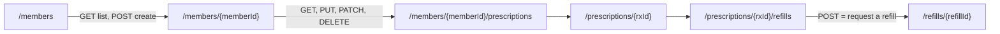
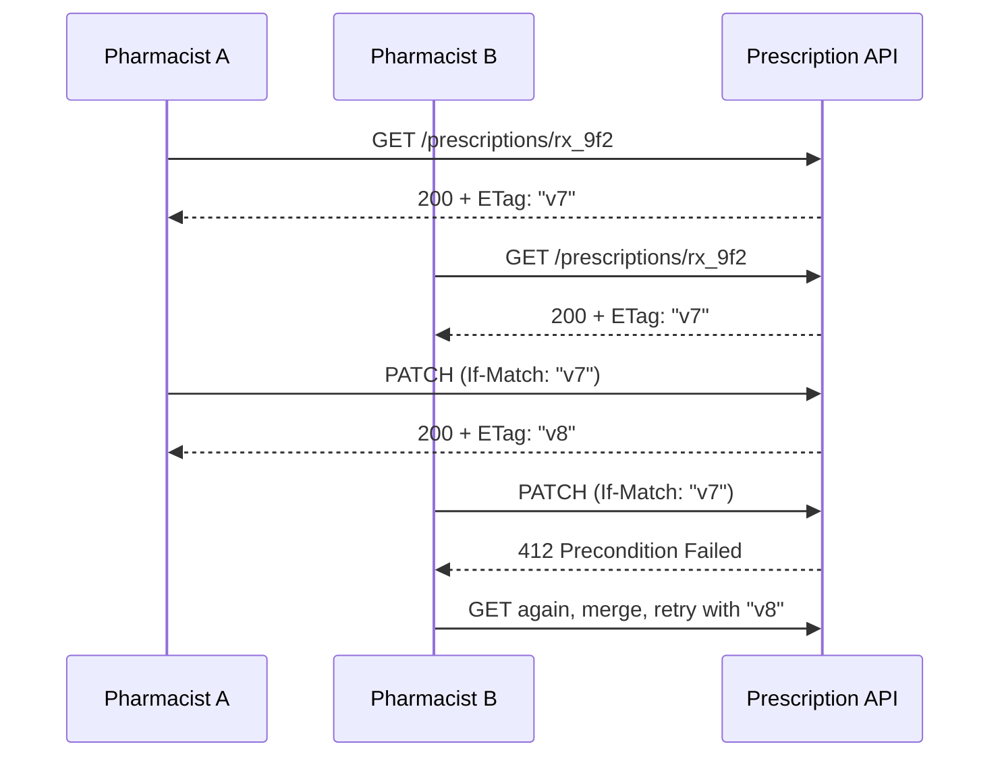

# REST Principles, Resource Modelling & HTTP Semantics

!!! abstract "Key takeaways"
    - **REST** is an architectural style (Fielding, 2000) with six constraints: client-server, **stateless**, cacheable, **uniform interface**, layered system, optional code-on-demand. Most "REST APIs" are really *HTTP + JSON resource APIs*; that is fine, as long as you use HTTP semantics correctly.
    - Model **resources (nouns)**, not procedures: `GET /members/42/prescriptions`, not `POST /getPrescriptions`. Collections are plural; nest only one level for ownership.
    - **Method semantics (RFC 9110):** `GET`/`HEAD` are **safe**; `GET`, `HEAD`, `PUT`, `DELETE`, `OPTIONS` are **idempotent**; **`POST` and `PATCH` are not** (PATCH can be made idempotent). Retries, caches and proxies rely on these promises.
    - **PUT replaces** the whole representation; **PATCH** applies a partial change (JSON Merge Patch RFC 7396 or JSON Patch RFC 6902). Use **ETag + `If-Match`** to stop lost updates (412 on conflict).
    - Actions that aren't CRUD become **sub-resources or state transitions**: `POST /orders/42/cancellation`, or `PATCH /orders/42 {"status":"CANCELLED"}`, with the server enforcing the state machine.

## Why it matters

Every service you own exposes an API, and APIs outlive the code behind them. A badly modelled API leaks internal tables, breaks clients when you refactor, cannot be cached, and becomes unsafe to retry. Interviewers use REST questions to see whether you understand **HTTP as an application protocol** (its methods, status codes, caching and concurrency rules), not just "JSON over port 443".

For a lead engineer the bar is higher. You will review other teams' APIs and set the house style. You need to explain *why* `POST` is not safe to retry, *why* a `GET` with side effects breaks crawlers and caches, and *how* to stop two pharmacists overwriting each other's edit.

## Core concepts

### REST constraints in one table

| Constraint | What it means | What breaks if you ignore it |
|---|---|---|
| Client-server | UI and data storage evolve separately | Clients coupled to server internals |
| **Stateless** | Each request carries everything needed (auth token, ids); no server session per client | Sticky sessions, hard horizontal scaling |
| **Cacheable** | Responses say whether they can be cached (`Cache-Control`, `ETag`) | Every read hits the origin |
| **Uniform interface** | Resources identified by URIs, manipulated through representations, self-descriptive messages, hypermedia (HATEOAS) | Every endpoint is a special case |
| Layered system | Clients can't tell if they talk to the origin, a gateway or a CDN | Can't insert caches, gateways, WAFs |
| Code on demand (optional) | Server may send executable code (JavaScript) | — |

**Richardson Maturity Model** is a handy way to describe how RESTful an API is:

- **Level 0:** one endpoint, everything is `POST` (SOAP-style RPC).
- **Level 1:** separate resources (`/members/42`), still mostly `POST`.
- **Level 2:** resources **plus correct HTTP methods and status codes**. This is where most good public APIs sit (Stripe, GitHub).
- **Level 3:** hypermedia controls (`_links` telling the client what it can do next).

!!! question "Interview angle"
    "Is your API RESTful?" A strong answer: "It's Level 2. Resources, correct methods, status codes and caching headers. We don't use full HATEOAS because our clients are our own SPA and mobile apps, generated from an OpenAPI contract, so links add little. We do return `Location` on creates and pagination links."

### Resources and URIs

A **resource** is anything worth naming: a member, a prescription, a refill request, a search result. A **representation** is its current state in a format (JSON). URIs name resources; methods say what to do.


*Notice that nesting stops at one level of ownership: a prescription gets its own top-level URI once it has an id, so clients don't need to know the member to fetch it.*

**URI design rules that interviewers expect:**

- **Plural nouns** for collections (`/prescriptions`), id for an item (`/prescriptions/rx_9f2`).
- **Lowercase, hyphenated** path segments (`/refill-requests`), consistent everywhere.
- **No verbs** in paths for CRUD (`/createMember` is RPC). Actions get a resource name (see below).
- **Opaque, stable ids.** Prefer UUIDs or prefixed ids (`rx_9f2…`) over database sequence numbers, which leak volume and invite enumeration.
- **Query parameters** for filtering, sorting, paging and projections (`?status=ACTIVE&sort=-createdAt&limit=20`), not for identifying the resource.
- **Don't expose your tables.** A resource is a *view* designed for clients; it may join three tables or hide two columns.

### HTTP method semantics (RFC 9110)

| Method | Purpose | Safe | Idempotent | Cacheable | Request body |
|---|---|---|---|---|---|
| `GET` | Read a representation | ✅ | ✅ | ✅ | No (semantics undefined) |
| `HEAD` | Like GET, headers only | ✅ | ✅ | ✅ | No |
| `OPTIONS` | Capabilities, CORS preflight | ✅ | ✅ | ❌ | Optional |
| `POST` | Process data: create in a collection, trigger an action | ❌ | ❌ | Rarely | Yes |
| `PUT` | Create or **replace** the resource at this URI | ❌ | ✅ | ❌ | Yes |
| `PATCH` | **Partial** modification (RFC 5789) | ❌ | ❌ (can be) | ❌ | Yes |
| `DELETE` | Remove the resource | ❌ | ✅ | ❌ | Rare |

- **Safe** means the client doesn't request a state change. The server can still log or count. Crawlers, prefetchers and caches call safe methods freely, so a `GET /members/42/delete` link *will* eventually be followed by something.
- **Idempotent** means sending the request N times has the same **effect on server state** as sending it once. The *response* can differ: the first `DELETE` returns `204`, the second may return `404`. Idempotency is what lets clients, proxies and libraries **retry automatically** after a timeout.
- `POST` is the general "do something" method. It is not idempotent, which is why creates need an **idempotency key** (see [Idempotency keys & safe retries](05-idempotency-keys-and-safe-retries.md)).

### PUT vs PATCH vs POST for create

- **`POST /prescriptions`**: the server picks the id. Returns `201 Created` with a `Location: /prescriptions/rx_9f2` header and usually the body.
- **`PUT /prescriptions/rx_9f2`**: the *client* picks the id; creates if absent, replaces if present. Idempotent by definition, good for upserts with natural keys (`PUT /members/42/preferences`).
- **`PUT`** must send the **full** representation. Fields you leave out are removed or reset. That is the classic bug: a client that only knows three fields `PUT`s and wipes the other ten.
- **`PATCH`** sends only the change. Two standard formats:
    - **JSON Merge Patch** (`application/merge-patch+json`, RFC 7396): send a partial document; `null` means "remove". Simple, but you can't set a field to `null` and can't edit array elements.
    - **JSON Patch** (`application/json-patch+json`, RFC 6902): a list of operations (`add`, `remove`, `replace`, `move`, `copy`, `test`). Precise, supports a `test` op as a guard, more verbose.

### Conditional requests: stopping lost updates

Two pharmacists open the same prescription. Both edit. The second save silently overwrites the first. This is the **lost update** problem, and HTTP solves it with **validators**.


*Notice that the second writer is told about the conflict instead of silently winning. The ETag maps naturally to a JPA `@Version` column.*

- **`ETag`** is an opaque version tag for the representation (strong `"v8"` or weak `W/"v8"`). **`Last-Modified`** is a timestamp alternative with one-second resolution.
- **Reads:** `If-None-Match: "v8"` → `304 Not Modified` with no body if unchanged. Saves bandwidth and lets caches revalidate.
- **Writes:** `If-Match: "v7"` → proceed only if the current version still matches, else **`412 Precondition Failed`**. If you *require* conditional writes, reject unconditional ones with **`428 Precondition Required`** (RFC 6585).

### Content negotiation and representations

- The client says what it accepts (`Accept: application/json`); the server answers with `Content-Type` and `Vary: Accept` if it varies. Unsupported → `406 Not Acceptable`; unsupported request body → `415 Unsupported Media Type`.
- Use **one JSON naming convention** everywhere (camelCase is the most common for JSON APIs), ISO-8601 timestamps with an offset (`2026-10-03T09:15:00Z`), and **money as a decimal string or minor units plus currency**, never a float.
- Return **`201` + `Location`** on create, **`204`** for success with no body, **`202 Accepted`** with a status resource for long-running work (see [Status codes & error format](02-status-codes-and-error-format.md)).

### Modelling actions that aren't CRUD

Real domains have verbs: *approve*, *cancel*, *transfer*, *resend*. Options, from most to least RESTful:

1. **State transition on the resource:** `PATCH /orders/42 {"status": "CANCELLED"}`. The server validates the transition against its state machine and returns `409 Conflict` if it's illegal (already shipped).
2. **Create a sub-resource that represents the action:** `POST /orders/42/cancellations` → `201` with `/orders/42/cancellations/c_1`. Good when the action has its own data (reason, who, when) and history, which auditors in healthcare and banking usually want.
3. **Controller resource (pragmatic RPC):** `POST /orders/42:cancel` (Google AIP style) or `POST /orders/42/cancel`. Acceptable when the action is genuinely procedural; be consistent.

Avoid `GET` for anything with a side effect, and avoid a single `POST /api` that dispatches on an `action` field.

## In practice: code & configuration

=== "❌ Common mistake"
    ```java
    @RestController
    @RequestMapping("/api")
    class PrescriptionController {

        // RPC-style URL, GET with a side effect, entity leaked to clients
        @GetMapping("/cancelPrescription")
        PrescriptionEntity cancel(@RequestParam Long id) {
            var rx = repo.findById(id).orElseThrow();
            rx.setStatus("CANCELLED");         // no state check: shipped Rx can be "cancelled"
            return repo.save(rx);              // JPA entity as the API contract
        }

        // PUT used for a partial update: missing fields get wiped to null
        @PutMapping("/prescriptions/{id}")
        PrescriptionEntity update(@PathVariable Long id, @RequestBody PrescriptionEntity body) {
            body.setId(id);
            return repo.save(body);            // last writer wins, no concurrency check
        }
    }
    ```

=== "✅ Correct approach"
    ```java
    @RestController
    @RequestMapping("/prescriptions")
    class PrescriptionController {

        private final PrescriptionService service;

        PrescriptionController(PrescriptionService service) { this.service = service; }

        @GetMapping("/{rxId}")
        ResponseEntity<PrescriptionView> get(@PathVariable String rxId) {
            var rx = service.get(rxId);
            return ResponseEntity.ok()
                    .eTag("\"" + rx.version() + "\"")          // validator for caching and concurrency
                    .body(rx);
        }

        @PostMapping
        ResponseEntity<PrescriptionView> create(@Valid @RequestBody CreatePrescription cmd,
                                                UriComponentsBuilder uri) {
            var rx = service.create(cmd);
            return ResponseEntity
                    .created(uri.path("/prescriptions/{id}").build(rx.id()))   // 201 + Location
                    .eTag("\"" + rx.version() + "\"")
                    .body(rx);
        }

        // Partial update with JSON Merge Patch semantics and optimistic concurrency
        @PatchMapping(path = "/{rxId}", consumes = "application/merge-patch+json")
        ResponseEntity<PrescriptionView> patch(@PathVariable String rxId,
                                               @RequestHeader(HttpHeaders.IF_MATCH) String ifMatch,
                                               @RequestBody PrescriptionPatch patch) {
            long expected = Long.parseLong(ifMatch.replace("\"", ""));
            var rx = service.patch(rxId, expected, patch);  // throws VersionConflict -> 412
            return ResponseEntity.ok().eTag("\"" + rx.version() + "\"").body(rx);
        }

        // A domain action modelled as a sub-resource with its own data
        @PostMapping("/{rxId}/cancellations")
        ResponseEntity<CancellationView> cancel(@PathVariable String rxId,
                                                @Valid @RequestBody CancelRequest req) {
            return ResponseEntity.status(HttpStatus.CREATED)
                    .body(service.cancel(rxId, req.reason()));   // 409 if state forbids it
        }
    }

    record PrescriptionView(String id, String drugName, int refillsLeft, String status, long version) {}
    ```

A missing `If-Match` header makes Spring return `400` here because the header is required. If you want the more precise `428 Precondition Required`, make the header optional and throw a mapped exception when it is absent. The service layer compares `expected` with the entity's `@Version` and throws a conflict exception that a `@RestControllerAdvice` maps to `412`.

## Real-world usage

- **Stripe** is the usual reference for a pragmatic Level 2 API: resource URLs (`/v1/customers/cus_123`), prefixed opaque ids, `POST` for creates and updates, idempotency keys on every mutating request, and expandable sub-objects.
- **GitHub** uses `ETag`/`If-None-Match` heavily; conditional requests that return `304` don't count against your rate limit, which nudges clients to cache.
- **Google's API Improvement Proposals (AIP)** define resource-oriented design with standard methods (`Get`, `List`, `Create`, `Update`, `Delete`) and custom methods written as `POST /v1/{name}:cancel`.
- **Healthcare (FHIR):** HL7 FHIR is a RESTful standard for clinical data (`GET [base]/Patient/123`, `PUT` for update, `If-Match` with versioned ETags, `_history` for versions). Knowing it exists is useful in healthcare interviews.
- **Failure mode:** a `GET` link that deleted records was famously wiped out by a link-prefetching browser accelerator. Safe methods must be safe.

## Trade-offs & production gotchas

| Option | Pros | Cons | Use when |
|---|---|---|---|
| `PUT` full replace | Idempotent, simple semantics | Clients must send everything; wipes unknown fields | Small resources, client owns the whole document |
| JSON Merge Patch | Simple partial updates | Can't set `null` explicitly, arrays replaced wholesale | Most form-style edits |
| JSON Patch | Precise ops, `test` guard, array edits | Verbose, harder for clients | Collaborative edits, arrays, audit of ops |
| Sub-resource for actions | Audit trail, own data, RESTful | More endpoints | Approvals, cancellations, transfers |
| Custom method `:cancel` | Clear intent, simple | Less uniform | Truly procedural operations |
| HATEOAS (Level 3) | Discoverable, server-driven workflows | Extra payload, clients rarely use it | Public APIs with generic clients |

!!! warning "Gotcha: idempotent is about state, not response"
    A second `DELETE` returning `404` is still idempotent. A `PUT` that *increments* a counter, or a `DELETE` that deletes "the oldest item", is **not**, even though the method is defined as idempotent. The method is a promise your implementation must keep.

!!! warning "Gotcha: entities as contracts"
    Returning JPA entities couples the API to your schema, triggers lazy-loading during serialisation and can leak fields (internal flags, audit columns, PHI). Always map to request and response DTOs (records).

## How this connects to my experience

- **Where I used it:** not a ★ subtopic, but the foundation of every API on the resume: REST APIs in Spring Boot at Coriolis (CCKM), cloud-native services behind API Gateway at Deloitte, and the REST upstreams that the **GraphQL Consumer Service** at OptumRx integrates.
- **Talking points:**
    - "Our upstreams were REST, so I cared about their semantics. Idempotent methods are retried by our client; `POST`s are only retried with an idempotency key."
    - "For key management at Coriolis, key operations like rotate and disable were modelled as state transitions with a server-enforced lifecycle, not as free-form updates." *[confirm the exact endpoint style]*
    - "I review APIs for entity leakage, `PUT`-as-partial-update bugs and missing concurrency control."
- **Likely follow-up chain:** "Design the API for refills" → resources and URIs → "How do you cancel a refill?" (state transition or sub-resource, 409 on illegal transitions) → "Two users edit at once?" (ETag + If-Match, 412) → "Client retries a create after a timeout?" (idempotency key).

## Interview questions

### Fundamentals

??? question "Q1. What are the REST constraints, and which ones matter most in practice?"
    **Answer:** Client-server, stateless, cacheable, uniform interface, layered system and optional code-on-demand. In practice **statelessness** (any instance can serve any request, so you scale horizontally), the **uniform interface** (resources plus standard methods and status codes) and **cacheability** matter most. Most production APIs are Richardson Level 2 and skip full HATEOAS.

    **Interviewer listens for:** naming statelessness and the uniform interface, honesty that most APIs are Level 2, linking constraints to scaling and caching.

    **Common wrong answer:** "REST means JSON over HTTP." JSON is just one representation; REST is about constraints.

??? question "Q2. What do 'safe' and 'idempotent' mean? Which methods are which?"
    **Answer:** Safe means the client is not asking for a state change: `GET`, `HEAD`, `OPTIONS`. Idempotent means repeating the request has the same effect on server state as sending it once: all safe methods plus `PUT` and `DELETE`. `POST` and `PATCH` are neither. Idempotency is about *state*, not the response: a second `DELETE` may return `404`.

    **Interviewer listens for:** the state-not-response distinction, POST and PATCH not idempotent, why it matters for retries and caches.

    **Common wrong answer:** "DELETE isn't idempotent because the second call returns 404."

??? question "Q3. PUT vs PATCH?"
    **Answer:** `PUT` replaces the entire representation at a URI (and can create it if the client chooses the id); it's idempotent. `PATCH` applies a partial change described by a patch document: JSON Merge Patch (send the changed fields, `null` removes) or JSON Patch (a list of operations). PATCH isn't guaranteed idempotent; an `add` to an array isn't, for example.

    **Interviewer listens for:** full replace vs partial, the two patch formats, the wiped-fields bug with partial PUTs.

    **Common wrong answer:** "PUT is for updates and POST is for creates." PUT can create, POST can update, and the real difference is replace vs partial.

??? question "Q4. How do you design URIs for members, their prescriptions and refills?"
    **Answer:** Plural collections and opaque ids: `/members/{memberId}`, `/members/{memberId}/prescriptions` for "this member's prescriptions", `/prescriptions/{rxId}` as the canonical item URI, `/prescriptions/{rxId}/refills` for refill requests. Nest at most one level for ownership, use query parameters for filters (`?status=ACTIVE`), no verbs for CRUD.

    **Interviewer listens for:** nouns, plural, one-level nesting, canonical item URIs, filters in query parameters, opaque ids.

    **Common wrong answer:** `/getMemberPrescriptions?memberId=42` or deep nesting like `/members/42/prescriptions/7/refills/3/items/1`.

### Intermediate

??? question "Q5. What should a successful create return?"
    **Answer:** `201 Created` with a `Location` header pointing to the new resource, usually the representation in the body, and an `ETag`. If creation is asynchronous, `202 Accepted` with a `Location` to a status resource that the client polls.

    **Interviewer listens for:** 201 + Location, 202 for async work, ETag.

    **Common wrong answer:** "200 with the id in the body." It works, but loses the standard semantics that clients and tooling understand.

??? question "Q6. How do you prevent lost updates when two clients edit the same resource?"
    **Answer:** Optimistic concurrency with HTTP validators. Return an `ETag` (mapped to a `@Version` column) on reads. Clients send `If-Match` with that ETag on `PUT`/`PATCH`. If the version changed, return `412 Precondition Failed` and the client re-reads and merges. If you require conditional writes, reject requests without `If-Match` with `428 Precondition Required`.

    **Interviewer listens for:** ETag + If-Match, 412 vs 428, mapping to a database version column.

    **Common wrong answer:** "Use a database lock while the user edits." Locks across user think-time don't scale and leak.

??? question "Q7. How do you model a non-CRUD action like 'cancel order'?"
    **Answer:** Either as a state transition (`PATCH /orders/42` with `status: CANCELLED`, server enforces the state machine and returns `409` for illegal transitions), or as a sub-resource (`POST /orders/42/cancellations` with a reason), which also gives an audit trail. A custom method (`POST /orders/42:cancel`) is acceptable if used consistently. Never a `GET`.

    **Interviewer listens for:** server-enforced state machine, 409 on illegal transitions, audit value of sub-resources, consistency.

    **Common wrong answer:** `GET /cancelOrder?id=42`.

??? question "Q8. What is the Richardson Maturity Model?"
    **Answer:** A way to grade HTTP APIs: Level 0 is one RPC endpoint; Level 1 introduces resources; Level 2 adds proper HTTP methods and status codes; Level 3 adds hypermedia controls (HATEOAS). Most well-designed APIs, including Stripe and GitHub, are Level 2 with some links.

    **Interviewer listens for:** the four levels, where real APIs sit, a reasoned view on HATEOAS.

    **Common wrong answer:** "An API without HATEOAS isn't REST, so it's useless." Level 2 delivers most of the practical value.

??? question "Q9. Why shouldn't a GET have side effects?"
    **Answer:** Because GET is defined as safe. Browsers prefetch links, crawlers follow them, caches and CDNs serve and revalidate them, and HTTP clients retry them freely. A side-effecting GET will be triggered by something you don't control, and it may be cached so the effect doesn't even happen when you expect it.

    **Interviewer listens for:** prefetchers, crawlers, caches, automatic retries.

    **Common wrong answer:** "It's fine if the endpoint requires authentication." Authenticated users' browsers prefetch too, and retries still repeat the effect.

### Senior

??? question "Q10. Should your API return JPA entities? What do you return instead?"
    **Answer:** No. Entities couple the contract to the schema, trigger lazy loading (N+1 or `LazyInitializationException`) during serialisation, and can leak internal or sensitive fields. Use dedicated request and response DTOs (Java records), mapped in the service layer. That lets the schema and the API evolve separately and makes the contract reviewable.

    **Interviewer listens for:** coupling, lazy-loading problems, data leakage, separate request/response models.

    **Common wrong answer:** "Use `@JsonIgnore` on the fields you don't want." It still couples the API to the schema and is easy to forget on new columns.

??? question "Q11. How do PUT-as-upsert and client-generated ids fit with idempotency?"
    **Answer:** `PUT /resources/{id}` with a client-chosen id is naturally idempotent: repeating it leaves the same state. That's useful for upserts with natural keys (`PUT /members/42/preferences`) or when the client generates a UUID before sending. Risks: clients must generate unique ids, and you must validate that they can't choose ids that collide with other tenants. For server-assigned ids, `POST` plus an `Idempotency-Key` header is the standard alternative.

    **Interviewer listens for:** PUT is idempotent by definition, client-generated UUIDs, tenant validation, POST + idempotency key as the alternative.

    **Common wrong answer:** "Retrying a create is always safe if you use PUT." Only if the implementation really replaces rather than appends.

??? question "Q12. JSON Merge Patch vs JSON Patch: how do you choose?"
    **Answer:** Merge Patch for most form-style edits: simple, readable, but it can't distinguish "set to null" from "remove" and replaces arrays wholesale. JSON Patch when you need precise array operations, explicit operations for audit, or a `test` op as an inline precondition. Always declare the media type (`application/merge-patch+json` or `application/json-patch+json`) so the server knows the semantics.

    **Interviewer listens for:** the null and array limitations, test op, explicit media types.

    **Common wrong answer:** "PATCH just means send JSON with the changed fields." Without a defined format, null and array behaviour is ambiguous.

### Scenario-based

??? question "Q13. A mobile app updates a member's phone number with PUT and other members' fields keep disappearing. What's wrong and how do you fix it?"
    **Answer:** The app sends only the fields it knows, and `PUT` replaces the whole representation, so missing fields are wiped. Fix: switch the endpoint to `PATCH` with Merge Patch semantics (or a dedicated `PUT /members/{id}/phone` sub-resource), map the request to a DTO that applies only provided fields, and add `If-Match` so stale clients get `412`. Add a contract test that a partial request never nulls other fields.

    **Interviewer listens for:** diagnosing replace semantics, PATCH or narrower sub-resource, concurrency, tests.

    **Common wrong answer:** "Make the server ignore nulls on PUT." That breaks PUT semantics and makes it impossible to clear a field.

??? question "Q14. Design the API for a refill workflow: request, approve by pharmacist, ship, cancel."
    **Answer:** Resources: `POST /prescriptions/{rxId}/refills` (with idempotency key) → `201` `/refills/{refillId}` with status `REQUESTED`. Transitions as sub-resources with their own data and audit: `POST /refills/{id}/approvals` (pharmacist role), `POST /refills/{id}/shipments` (carrier, tracking), `POST /refills/{id}/cancellations` (reason). The server enforces the state machine (`409` for illegal moves) and returns the refill with an `ETag`. `GET /refills?memberId=…&status=…` for lists. Long-running steps return `202` with a status URI. Webhooks or events notify clients of status changes.

    **Interviewer listens for:** resource and state-machine thinking, idempotent create, role-based transitions, 409, audit, async handling.

    **Common wrong answer:** one `POST /refill` endpoint with an `action` field, or exposing the database row as the resource.

??? question "Q15. An auditor wants to know who changed a prescription and when. How does the API design help?"
    **Answer:** Model significant changes as explicit actions (sub-resources like `/approvals`, `/cancellations`) or record every PATCH as an event with actor, timestamp and diff. Keep versions (ETag/version number) and expose a history resource (`GET /prescriptions/{id}/history`), as FHIR does with `_history`. The identity comes from the access token, never from a request field.

    **Interviewer listens for:** actions as resources, versioning, history resource, identity from the token.

    **Common wrong answer:** "Add `updatedBy` and `updatedAt` columns." That only keeps the latest change.

## Cheat sheet

| Concept | Remember |
|---|---|
| REST | Constraints, not JSON. Stateless + uniform interface + cacheable |
| Maturity | L0 RPC, L1 resources, L2 methods + status codes (target), L3 hypermedia |
| Safe | GET, HEAD, OPTIONS |
| Idempotent | Safe methods + PUT + DELETE. POST and PATCH not |
| Create | `POST` → `201` + `Location`; async → `202` + status URI |
| PUT | Full replace, idempotent, can create with client id |
| PATCH | Merge Patch (RFC 7396) or JSON Patch (RFC 6902) |
| Concurrency | `ETag` + `If-Match` → `412`; require it → `428` |
| Caching reads | `If-None-Match` → `304` |
| Actions | State transition (409 if illegal), sub-resource, or `:verb` custom method |
| Contract | DTO records, never entities; ISO-8601 dates, money not as float |

## Sources
1. [Roy Fielding: Architectural Styles and the Design of Network-based Software Architectures, ch. 5 (REST)](https://ics.uci.edu/~fielding/pubs/dissertation/rest_arch_style.htm): the REST constraints.
2. [RFC 9110: HTTP Semantics](https://www.rfc-editor.org/rfc/rfc9110): safe and idempotent methods, conditional requests, ETag, 412.
3. [RFC 5789: PATCH Method for HTTP](https://www.rfc-editor.org/rfc/rfc5789).
4. [RFC 7396: JSON Merge Patch](https://www.rfc-editor.org/rfc/rfc7396) and [RFC 6902: JSON Patch](https://www.rfc-editor.org/rfc/rfc6902).
5. [RFC 6585: Additional HTTP Status Codes](https://www.rfc-editor.org/rfc/rfc6585): 428 Precondition Required.
6. [Martin Fowler: Richardson Maturity Model](https://martinfowler.com/articles/richardsonMaturityModel.html).
7. [Google AIP-121: Resource-oriented design](https://google.aip.dev/121) and [AIP-136: Custom methods](https://google.aip.dev/136).
8. [GitHub REST API: Conditional requests](https://docs.github.com/en/rest/using-the-rest-api/best-practices-for-using-the-rest-api#use-conditional-requests-if-appropriate).
9. [HL7 FHIR: RESTful API](https://hl7.org/fhir/http.html): versioned updates with If-Match, history.
10. [Spring Framework: ResponseEntity and ETag support](https://docs.spring.io/spring-framework/reference/web/webmvc/mvc-caching.html).
