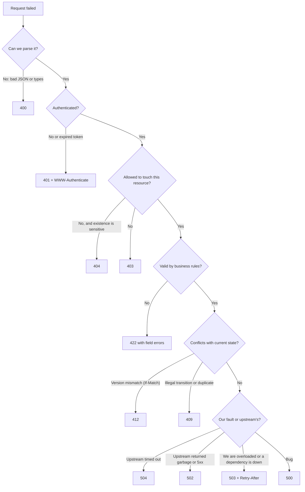

# Status Codes & Error Format (RFC 9457 Problem Details)

!!! abstract "Key takeaways"
    - The status code is for **machines** (clients, retries, caches, monitoring); the body is for **developers and users**. The class matters most: **2xx** success, **4xx** the client must change something, **5xx** the server failed and a retry *may* help.
    - Learn the confusing pairs: **400** malformed vs **422** well-formed but invalid; **401** not authenticated vs **403** not allowed; **409** state conflict vs **412** failed precondition (`If-Match`); **502** bad upstream response vs **503** overloaded/unavailable vs **504** upstream timeout; **429** rate-limited with `Retry-After`.
    - Use one error body everywhere: **RFC 9457 Problem Details** (`application/problem+json`) with `type`, `title`, `status`, `detail`, `instance`, plus **extension members** such as a stable `code`, field `errors[]` and a `traceId`. RFC 9457 replaced RFC 7807 in 2023.
    - **Never** return `200` with `{"success": false}`, stack traces, SQL errors or PHI in error bodies. Log details server-side, keyed by the trace id you return.
    - Spring Boot 3: `ProblemDetail`, `ErrorResponseException`, `spring.mvc.problemdetails.enabled=true`, and one `@RestControllerAdvice` mapping domain exceptions to problems.

## Why it matters

Clients make decisions from status codes. A retry library retries `503` but not `400`. A CDN caches `200` and `404` but not `500`. Monitoring pages someone on a 5xx spike and ignores 4xx. A gateway or circuit breaker counts 5xx as failures. If your API returns `200` for errors or `500` for validation failures, every one of those systems behaves wrongly.

The error body is your support line. A good one lets a client developer fix their request without opening a ticket, and lets your on-call engineer find the exact log line from the `traceId` a user pasted. In regulated domains it must also *not* say too much: no stack traces, no SQL, no other patients' data.

## Core concepts

### Status code classes

| Class | Meaning | Retry? | Who fixes it |
|---|---|---|---|
| 1xx | Informational (`100 Continue`, `103 Early Hints`) | — | — |
| 2xx | Success | No | — |
| 3xx | Redirection / not modified (`301`, `302`, `304`, `307`, `308`) | Follow | — |
| 4xx | Client error: the request must change | **No** (except 408, 425, 429 after waiting) | Client |
| 5xx | Server error | **Maybe**, with backoff and only if idempotent | Server |

### The codes you actually use

**Success**

| Code | Use for |
|---|---|
| `200 OK` | Successful read or update returning a body |
| `201 Created` | Resource created; include `Location` |
| `202 Accepted` | Accepted for async processing; include a status URI |
| `204 No Content` | Success, no body (DELETE, some PUTs) |
| `304 Not Modified` | Conditional GET, representation unchanged |

**Client errors**

| Code | Use for |
|---|---|
| `400 Bad Request` | Malformed syntax: invalid JSON, wrong types, missing required parameter |
| `401 Unauthorized` | **Not authenticated**: missing, expired or invalid token. Send `WWW-Authenticate` |
| `403 Forbidden` | Authenticated but **not allowed** (role, scope, ownership) |
| `404 Not Found` | Resource doesn't exist, **or** you hide its existence from this caller |
| `405 Method Not Allowed` | Method not supported on this resource; send `Allow` |
| `406` / `415` | Can't produce the `Accept` type / can't consume the `Content-Type` |
| `409 Conflict` | Request conflicts with current **state**: illegal transition, duplicate unique key, concurrent in-flight idempotent request |
| `410 Gone` | Existed, permanently removed (sunset API versions) |
| `412 Precondition Failed` | `If-Match`/`If-Unmodified-Since` didn't match (optimistic lock) |
| `413 Content Too Large` | Body too large |
| `422 Unprocessable Content` | Syntax fine, **semantics invalid**: validation rules, business rules |
| `428 Precondition Required` | You require `If-Match` and it's missing |
| `429 Too Many Requests` | Rate limited; send `Retry-After` |

**Server errors**

| Code | Use for |
|---|---|
| `500 Internal Server Error` | Unexpected bug; nothing more specific fits |
| `501 Not Implemented` | Method not supported by the server at all |
| `502 Bad Gateway` | An upstream returned an invalid or error response |
| `503 Service Unavailable` | Overloaded, maintenance, dependency down, load shedding; may send `Retry-After` |
| `504 Gateway Timeout` | An upstream didn't answer in time |

### Choosing between the confusing pairs


*Notice the order: parse, authenticate, authorise, validate, check state. Following this order also stops you leaking information, for example validating a body before checking the caller may even see the resource.*

{ loading=lazy }
*Watch where each request turns red: the status code is just the name of the first check that failed.*

- **400 vs 422.** Many APIs use `400` for all validation errors and that is acceptable if consistent. The precise split is: `400` when the request can't be understood (malformed JSON, `"refills": "abc"`), `422` when it is understood but breaks rules (`refills: -2`, end date before start date). Spring's default for `@Valid` failures is `400`.
- **401 vs 403.** `401` means "who are you?" (no or bad credentials) and must include `WWW-Authenticate: Bearer …`. `403` means "I know who you are, and no".
- **403 vs 404.** If revealing that a resource exists is itself a leak (another member's prescription, an admin endpoint), return `404`. GitHub does this for private repositories.
- **409 vs 412.** `412` is specifically a failed HTTP precondition header. `409` is any other conflict with state: "this refill is already shipped", "email already registered".
- **502 vs 503 vs 504.** All three are typical in a gateway or aggregation service: `504` when the upstream timed out, `502` when it answered with something unusable, `503` when *we* are shedding load or a dependency is known to be down (circuit breaker open).

### RFC 9457 Problem Details

RFC 9457 (July 2023, obsoletes RFC 7807) defines a standard JSON error object with media type `application/problem+json`.

```json
HTTP/1.1 422 Unprocessable Content
Content-Type: application/problem+json

{
  "type": "https://api.example-health.com/problems/validation-error",
  "title": "Request validation failed",
  "status": 422,
  "detail": "2 fields are invalid.",
  "instance": "/refills",
  "code": "VALIDATION_FAILED",
  "traceId": "4bf92f3577b34da6a3ce929d0e0e4736",
  "errors": [
    { "pointer": "#/quantity", "detail": "must be between 1 and 90" },
    { "pointer": "#/pharmacyId", "detail": "pharmacy is not in network" }
  ]
}
```

| Member | Meaning | Rule of thumb |
|---|---|---|
| `type` | URI identifying the **problem type** | Stable, documented; a page explaining the error. Defaults to `about:blank` |
| `title` | Short, human summary of the type | Same for every occurrence of the type |
| `status` | The HTTP status code (advisory copy) | Must match the real status |
| `detail` | Explanation of **this** occurrence | Human-readable, no secrets |
| `instance` | URI for this occurrence | Often the request path or an error id |
| *extensions* | Your own members | `code`, `errors[]`, `traceId`, `retryAfter`, `balance` |

{ loading=lazy }
*Notice the purple and teal lines: those are what client code reads. Everything in black is for humans.*

RFC 9457 also clarifies that clients must **ignore unknown extensions**, encourages registering common problem types, and suggests how to report multiple problems of the same type (an array in an extension such as `errors` with JSON pointers).

**Design rules for the error contract:**

1. **Stable machine-readable code** (`type` URI and/or `code`) that clients switch on. Never make clients parse `detail` text.
2. **Field-level errors** with a JSON pointer or field path, so UIs can show the message next to the field.
3. **Correlation id** (`traceId` from OpenTelemetry) in every error, so support can find the log.
4. **Safe text:** no stack traces, class names, SQL, internal hostnames, tokens or PHI. "Prescription not found" is fine; "No row in rx_table for member 42, SSN …" is not.
5. **Same shape everywhere**, including errors produced by the gateway, the security filter chain and the framework (404 for unknown routes, 405, 415).

### Errors in async and batch operations

- **Async (`202`):** the status resource carries the final outcome, including a problem object if the job failed.
- **Batch endpoints:** either all-or-nothing (one status), or `207 Multi-Status`-style per-item results in a `200` body. Be explicit; clients must not assume a `200` means every item succeeded.

## In practice: code & configuration

```yaml
# application.yml (Spring Boot 3)
spring:
  mvc:
    problemdetails:
      enabled: true   # framework exceptions (400, 404, 405, 415...) rendered as application/problem+json
```

=== "❌ Common mistake"
    ```java
    @PostMapping("/refills")
    Map<String, Object> create(@RequestBody RefillRequest req) {
        try {
            return Map.of("success", true, "data", service.create(req));
        } catch (Exception e) {
            // 200 OK for a failure, internal message and stack trace leaked to the client
            return Map.of("success", false, "error", e.toString(),
                          "trace", Arrays.toString(e.getStackTrace()));
        }
    }
    ```

=== "✅ Correct approach"
    ```java
    // Domain exceptions carry a stable code; the advice maps them to problem details.
    public sealed abstract class ApiException extends RuntimeException
            permits NotFoundException, ConflictException, BusinessRuleException {
        private final String code;
        protected ApiException(String code, String message) { super(message); this.code = code; }
        public String code() { return code; }
    }
    public final class NotFoundException extends ApiException {
        public NotFoundException(String what) { super("NOT_FOUND", what + " not found"); }
    }
    public final class ConflictException extends ApiException {
        public ConflictException(String code, String msg) { super(code, msg); }
    }
    public final class BusinessRuleException extends ApiException {
        public BusinessRuleException(String code, String msg) { super(code, msg); }
    }

    @RestControllerAdvice
    class ApiExceptionHandler extends ResponseEntityExceptionHandler {   // keeps Spring's own mappings

        private static final String BASE = "https://api.example-health.com/problems/";

        @ExceptionHandler(ApiException.class)
        ProblemDetail handleApi(ApiException ex, HttpServletRequest req) {
            HttpStatus status = switch (ex) {
                case NotFoundException n     -> HttpStatus.NOT_FOUND;
                case ConflictException c     -> HttpStatus.CONFLICT;
                case BusinessRuleException b -> HttpStatus.UNPROCESSABLE_ENTITY;
            };
            ProblemDetail pd = ProblemDetail.forStatusAndDetail(status, ex.getMessage());
            pd.setType(URI.create(BASE + ex.code().toLowerCase().replace('_', '-')));
            pd.setTitle(status.getReasonPhrase());
            pd.setInstance(URI.create(req.getRequestURI()));
            pd.setProperty("code", ex.code());
            pd.setProperty("traceId", currentTraceId());
            return pd;
        }

        // Bean Validation failures: 400 by default in Spring; add field errors in a stable shape
        @Override
        protected ResponseEntity<Object> handleMethodArgumentNotValid(
                MethodArgumentNotValidException ex, HttpHeaders headers,
                HttpStatusCode status, WebRequest request) {
            ProblemDetail pd = ex.getBody();                          // already a ProblemDetail
            pd.setType(URI.create(BASE + "validation-error"));
            pd.setProperty("code", "VALIDATION_FAILED");
            pd.setProperty("errors", ex.getFieldErrors().stream()
                    .map(f -> Map.of("pointer", "#/" + f.getField(),
                                     "detail", String.valueOf(f.getDefaultMessage())))
                    .toList());
            pd.setProperty("traceId", currentTraceId());
            return ResponseEntity.status(status).headers(headers).body(pd);
        }

        // Last resort: log everything, return nothing internal
        @ExceptionHandler(Exception.class)
        ProblemDetail handleUnexpected(Exception ex) {
            log.error("Unhandled error", ex);                         // full detail stays in logs
            ProblemDetail pd = ProblemDetail.forStatusAndDetail(
                    HttpStatus.INTERNAL_SERVER_ERROR, "Unexpected error. Quote the traceId to support.");
            pd.setProperty("traceId", currentTraceId());
            return pd;
        }

        private static final Logger log = LoggerFactory.getLogger(ApiExceptionHandler.class);
        private String currentTraceId() { return MDC.get("traceId"); }  // set by Micrometer Tracing
    }
    ```

!!! tip "Don't forget the errors Spring Security produces"
    `401` and `403` come from the security filter chain, *before* your controller advice runs. Configure an `AuthenticationEntryPoint` and `AccessDeniedHandler` that write the same problem format (Spring Security can delegate to a `HandlerExceptionResolver`), or your API will return two different error shapes.

## Real-world usage

- **Stripe** returns a consistent error object with `type` (`card_error`, `invalid_request_error`), a stable `code`, a `param` naming the bad field, a `doc_url` and a `request_id`. It is the same idea as problem details, from before the RFC.
- **GitHub** returns `404` instead of `403` for private resources you can't see, and documents `422` for validation errors with an `errors` array.
- **Zalando RESTful API Guidelines** mandate RFC 9457 problem JSON for all errors and list exactly which status codes services may use.
- **Spring Boot 3** made `ProblemDetail` first-class, and Spring Framework 6 exceptions implement `ErrorResponse`, so framework errors can be rendered in the same format.
- **Failure mode:** a payments API that returned `500` for card declines made clients retry declines (and alerted on-call all night). A decline is a `402`/`422`-style client outcome, not a server error.

## Trade-offs & production gotchas

| Option | Pros | Cons | Use when |
|---|---|---|---|
| `400` for all validation | Simple, Spring default | Less precise | Internal APIs, consistency matters most |
| `400` syntax / `422` semantics | Precise, clients can tell apart | More mapping code | Public or partner APIs |
| `404` for forbidden items | No existence leak | Harder to debug for legit users | Other users' data, admin resources |
| Problem details (RFC 9457) | Standard, tooling, extensible | Must enforce everywhere | Default for all new APIs |
| Custom error envelope | Fits legacy clients | Non-standard | Only when clients already depend on it |

!!! warning "Gotcha: 5xx for client mistakes"
    An unhandled `IllegalArgumentException` or `ConstraintViolationException` becomes a `500`. That pollutes error-rate SLOs, pages on-call and makes clients retry requests that can never succeed. Map every expected exception explicitly, and treat a 5xx spike as a bug report.

!!! warning "Gotcha: errors behind gateways"
    Gateways, load balancers and WAFs produce their own `502`/`503`/`504`/`413` pages, often in HTML. Configure them to return problem JSON too, or at least make clients tolerant of non-JSON error bodies.

## How this connects to my experience

- **Where I used it:** not ★, but every service I built returned errors to someone: the REST APIs at Coriolis (CCKM), AWS services behind API Gateway at Deloitte, and at OptumRx the **GraphQL Consumer Service** translated failures from 5 upstream REST systems into GraphQL `errors`.
- **Talking points:**
    - "In the aggregation layer, upstream status codes drove behaviour: `404` became a null field, `5xx` and timeouts tripped the circuit breaker and became a partial result with an error entry, `401` from an upstream meant our token exchange was wrong and was alerted." *[confirm the exact mapping you used]*
    - "I standardised on problem details with a stable `code` and the trace id, so frontend and support could act on errors." *[confirm whether this was done at OptumRx]*
- **Likely follow-up chain:** "Which status for a validation error?" → 400 vs 422 → "What's in your error body?" → problem details, stable code, field errors, traceId → "How do you keep it consistent across services?" → shared starter / advice, security entry point, gateway config, contract tests.

## Interview questions

### Fundamentals

??? question "Q1. What is the difference between 4xx and 5xx, and why does it matter to clients?"
    **Answer:** 4xx means the client sent something wrong and must change the request; retrying the same request won't help (except 408/429 after waiting). 5xx means the server failed; the same request may succeed later, so idempotent requests can be retried with backoff. Monitoring, circuit breakers and SLOs usually count 5xx as failures and 4xx as client behaviour.

    **Interviewer listens for:** who must act, retry behaviour, effect on SLOs and breakers.

    **Common wrong answer:** "4xx are small errors and 5xx are big errors."

??? question "Q2. 401 vs 403?"
    **Answer:** `401 Unauthorized` means not authenticated: missing, expired or invalid credentials, and the response includes `WWW-Authenticate`. `403 Forbidden` means the caller is authenticated but lacks permission. A client should refresh or re-login on 401 and show "no access" on 403.

    **Interviewer listens for:** authentication vs authorisation, WWW-Authenticate, client reaction.

    **Common wrong answer:** Swapping them, because "Unauthorized" sounds like "not allowed".

??? question "Q3. 400 vs 422?"
    **Answer:** `400` for requests the server can't parse or that have the wrong shape (bad JSON, wrong types, missing required parameters). `422 Unprocessable Content` for well-formed requests that break validation or business rules. Using `400` for everything is acceptable if consistent; Spring's default for `@Valid` failures is `400`.

    **Interviewer listens for:** syntax vs semantics, consistency, knowledge of the Spring default.

    **Common wrong answer:** "422 is a WebDAV code, so never use it." RFC 9110 made it a general HTTP status.

??? question "Q4. What is RFC 9457 and what fields does it define?"
    **Answer:** The Problem Details for HTTP APIs standard (2023, replacing RFC 7807). Media type `application/problem+json`, members `type` (URI of the problem type), `title`, `status`, `detail` (this occurrence), `instance`, plus extension members for your own data such as `code`, `errors` and `traceId`. Clients must ignore extensions they don't understand.

    **Interviewer listens for:** the five members, extensions, media type, that it replaced 7807.

    **Common wrong answer:** "It's a Spring error format." It's an IETF standard that Spring implements.

### Intermediate

??? question "Q5. 409 vs 412?"
    **Answer:** `412 Precondition Failed` is returned when a conditional header (`If-Match`, `If-Unmodified-Since`) doesn't match, typically an optimistic-lock version mismatch. `409 Conflict` covers other conflicts with the current state: an illegal state transition, a duplicate unique value, or an idempotent request with the same key still in progress.

    **Interviewer listens for:** precondition headers vs general state conflicts, concrete examples.

    **Common wrong answer:** "They're interchangeable."

??? question "Q6. When would you return 404 instead of 403?"
    **Answer:** When telling the caller that the resource exists is itself a leak: another member's prescription, a private repository, an admin endpoint. Returning `404` gives the same answer whether the resource is missing or hidden, which also defeats id enumeration.

    **Interviewer listens for:** information disclosure, enumeration, consistency.

    **Common wrong answer:** "Always 403, because it's more accurate." Accuracy for an attacker is the problem.

??? question "Q7. 502 vs 503 vs 504 in an API gateway or aggregation service?"
    **Answer:** `504` when an upstream didn't respond within the timeout. `502` when the upstream responded with an invalid response or an error we can't pass through. `503` when we are deliberately not serving: overloaded, load shedding, maintenance, or a dependency known to be down (circuit open), ideally with `Retry-After`.

    **Interviewer listens for:** timeout vs bad response vs unavailable, Retry-After, link to circuit breakers.

    **Common wrong answer:** "Always return 500 when something downstream fails."

??? question "Q8. What should and shouldn't go into an error body?"
    **Answer:** Should: a stable code/type, a human-readable detail, field-level errors with paths, a trace or request id, and retry hints where useful. Shouldn't: stack traces, exception class names, SQL, internal hostnames, tokens, secrets or personal/health data. Details go to logs, linked by the trace id.

    **Interviewer listens for:** stable machine code, correlation id, explicit list of what not to leak.

    **Common wrong answer:** "Include the stack trace in non-production environments." Config drift puts it in production eventually.

### Senior

??? question "Q9. How do you make error responses consistent across 30 microservices?"
    **Answer:** Agree on one contract (RFC 9457 with a defined set of extensions and a problem-type registry). Ship it as a shared Spring Boot starter that auto-configures the controller advice, the security `AuthenticationEntryPoint`/`AccessDeniedHandler` and the trace id. Configure the gateway to emit the same format. Enforce it with OpenAPI (shared error schemas), linting (Spectral rules) and contract tests.

    **Interviewer listens for:** standard + shared library + security layer + gateway + automated enforcement.

    **Common wrong answer:** "Write a wiki page with the format." Without a library and checks it drifts.

??? question "Q10. How should an aggregation layer translate upstream errors?"
    **Answer:** Never pass upstream errors through blindly. Map them deliberately: upstream `404` may be a legitimate empty result; upstream `400` usually means *our* bug (we built a bad request), so it becomes a `500`/`502` on our side and an alert; upstream timeouts become `504` or a partial result; upstream `401`/`403` means our credentials or token exchange failed. Always sanitise upstream messages so their internals don't leak through us.

    **Interviewer listens for:** deliberate mapping, upstream 4xx as our bug, partial results, sanitising messages.

    **Common wrong answer:** "Return whatever status the upstream returned." The client didn't call the upstream; that status means nothing to them.

??? question "Q11. Why is returning 200 with `{success:false}` harmful?"
    **Answer:** Every HTTP-aware component misreads it: caches store it, retry and circuit-breaker logic sees success, monitoring and SLOs undercount errors, API gateways can't apply policies, and clients must parse bodies to learn the outcome. It also makes OpenAPI contracts vague. Use real status codes with a problem body.

    **Interviewer listens for:** caches, retries, monitoring, gateways and client complexity.

    **Common wrong answer:** "It's fine because our frontend checks the flag." Everything between the frontend and the server doesn't.

### Scenario-based

??? question "Q12. Your error-rate SLO alert fires, but investigation shows most 5xx are validation failures. What do you do?"
    **Answer:** The validation exceptions are unmapped, so they fall through to `500`. Map them explicitly (`MethodArgumentNotValidException`, `ConstraintViolationException`, `HttpMessageNotReadableException`, domain rule exceptions) to `400`/`422` problem responses. Add a test per exception type. Then re-check the SLO definition so it counts only server faults, and review remaining 5xx as genuine bugs.

    **Interviewer listens for:** finding the unmapped exceptions, explicit mapping, tests, fixing the SLO signal.

    **Common wrong answer:** "Exclude that endpoint from the alert."

??? question "Q13. A frontend team says they can't show validation messages next to fields. How do you change the API?"
    **Answer:** Return field-level errors in the problem body as an extension, for example `errors: [{pointer: "#/quantity", detail: "must be ≤ 90", code: "MAX"}]`, using JSON pointers that match the request body. Keep messages user-safe and add a stable code per rule so the UI can localise. Document the schema in OpenAPI and add it to the shared error starter.

    **Interviewer listens for:** pointer per field, stable codes for i18n, documented schema.

    **Common wrong answer:** "Put all messages into the `detail` string, separated by commas."

??? question "Q14. A partner integration retries every failed request, including declined payments, and overloads you. What's wrong with your API and theirs?"
    **Answer:** Possibly your API returns `5xx` for business outcomes like declines, which tells clients to retry. Return a client error (`402`/`422` with a stable code such as `card_declined`) so they stop. Return `429`/`503` with `Retry-After` when you *do* want them to back off. On their side, they should retry only 5xx/429 on idempotent or keyed requests, with exponential backoff and jitter. Agree on this in the integration guide.

    **Interviewer listens for:** status code drives retry behaviour, business outcomes are 4xx, Retry-After, client retry policy.

    **Common wrong answer:** "Block the partner's IP."

## Cheat sheet

| Concept | Remember |
|---|---|
| 2xx | 200 read/update, 201 + Location, 202 async + status URI, 204 no body, 304 not modified |
| 4xx | Client must change the request. Don't retry (except 408/429 after waiting) |
| 5xx | Server failed. Retry idempotent requests with backoff |
| 400 vs 422 | Syntax/shape vs semantics/business rules (Spring default 400) |
| 401 vs 403 | Not authenticated (+WWW-Authenticate) vs not allowed |
| 403 vs 404 | Use 404 when existence is sensitive |
| 409 vs 412 | State conflict vs failed `If-Match` precondition |
| 502/503/504 | Bad upstream response / we're unavailable (+Retry-After) / upstream timeout |
| 429 | Rate limited + `Retry-After` |
| RFC 9457 | `application/problem+json`: type, title, status, detail, instance + extensions |
| Extensions | Stable `code`, `errors[]` with pointers, `traceId` |
| Spring | `ProblemDetail`, `ErrorResponseException`, `spring.mvc.problemdetails.enabled`, security entry point |

## Sources
1. [RFC 9457: Problem Details for HTTP APIs](https://www.rfc-editor.org/rfc/rfc9457): members, extensions, multiple problems, obsoletes RFC 7807.
2. [RFC 9110: HTTP Semantics, §15 Status Codes](https://www.rfc-editor.org/rfc/rfc9110#section-15): definitions including 422 and 413 names.
3. [RFC 6585: Additional HTTP Status Codes](https://www.rfc-editor.org/rfc/rfc6585): 428 and 429.
4. [Spring Framework: Error Responses (ProblemDetail, ErrorResponse)](https://docs.spring.io/spring-framework/reference/web/webmvc/mvc-ann-rest-exceptions.html).
5. [Spring Boot: Error handling and problem details](https://docs.spring.io/spring-boot/reference/web/servlet.html#web.servlet.spring-mvc.error-handling).
6. [Zalando RESTful API Guidelines: errors and status codes](https://opensource.zalando.com/restful-api-guidelines/#errors).
7. [Stripe API: Errors](https://docs.stripe.com/api/errors).
8. [GitHub REST API: Troubleshooting and status codes](https://docs.github.com/en/rest/using-the-rest-api/troubleshooting-the-rest-api).
9. [MDN: HTTP response status codes](https://developer.mozilla.org/en-US/docs/Web/HTTP/Reference/Status).
