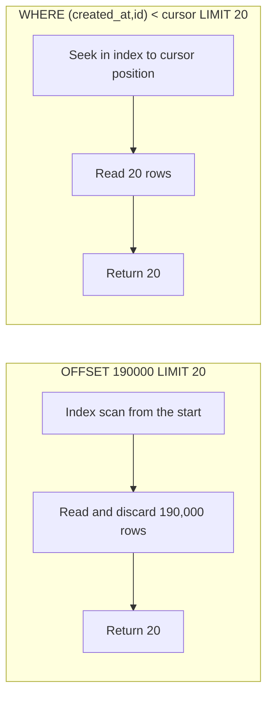

# Pagination, Filtering & Sorting

!!! abstract "TL;DR"
    - **Never return unbounded lists.** Every collection endpoint has a default and a **maximum** page size.
    - **Offset pagination** (`?page=3&size=20` → `LIMIT 20 OFFSET 60`) is simple and supports "jump to page 7", but the database still reads and discards all skipped rows, so **deep pages get slow**, and rows **shift** (duplicates or gaps) when data changes between requests.
    - **Keyset / cursor pagination** (`WHERE (created_at, id) < (:lastCreatedAt, :lastId) ORDER BY created_at DESC, id DESC LIMIT 20`) uses an index to jump straight to the next page: constant cost at any depth and stable under inserts. Expose it as an **opaque cursor** (`?after=eyJ…`). Trade-off: no random page jumps.
    - **Sort must be deterministic:** always end with a unique tiebreaker (`id`). Otherwise rows with equal sort values can appear on two pages or none.
    - **Filters and sorts are an allow-list** of fields backed by indexes, not a free-form query language. Totals (`COUNT(*)`) are expensive at scale; make them optional or approximate.

## Why it matters

List endpoints are where APIs fall over. A `GET /claims` that returns everything works with 50 test rows and times out with 5 million production rows. Offset pagination that looked fine in a demo makes page 5,000 take seconds and lets a scraper hammer your database. A sort on a non-unique column quietly shows the same claim twice and hides another, which in healthcare or banking turns into a support ticket about "missing transactions".

Interviewers ask this to see whether you know how pagination maps onto the **database**: indexes, `OFFSET` cost, consistency during concurrent writes, and the price of `COUNT(*)`.

## Core concepts

### Offset vs keyset pagination


*Notice that offset work grows with page depth, while keyset work stays at the page size. Measured on a 200,000-row PostgreSQL 16 table: OFFSET 190000 read 190,020 index entries in about 45 ms; the equivalent keyset query read 20 entries in 0.04 ms.*

| | Offset (`page`/`size` or `offset`/`limit`) | Keyset / cursor |
|---|---|---|
| SQL | `ORDER BY … LIMIT n OFFSET k` | `WHERE (sort_cols) < (last_values) ORDER BY … LIMIT n` |
| Cost of deep pages | Grows linearly with `k` | Constant (index seek) |
| Jump to page N | ✅ | ❌ (only next/previous) |
| Stable when rows are inserted/deleted | ❌ duplicates or gaps | ✅ |
| Total count / page count | Natural (but expensive) | Usually omitted |
| Good for | Admin tables, small or bounded data, "page 3 of 12" UIs | Feeds, infinite scroll, large tables, exports, sync APIs |

**Why offset drifts:** you read page 1 (rows 1–20). Someone inserts a new claim at the top. Page 2 is now rows 21–40 *of the new ordering*, so the old row 20 appears again. Deletes cause the opposite: a row is skipped.

### Keyset pagination done right

1. **Order by the sort column plus a unique tiebreaker:** `ORDER BY created_at DESC, id DESC`.
2. **Index exactly that order**, including any equality filter first: `CREATE INDEX … ON claim (member_id, created_at DESC, id DESC)`.
3. **The cursor is the last row's sort values:** `(created_at, id)` of the last item returned.
4. **Next page:** `WHERE member_id = :m AND (created_at, id) < (:c, :i)`. PostgreSQL compares row values lexicographically and can use the index for it. In databases without row-value comparison: `created_at < :c OR (created_at = :c AND id < :i)`.
5. **Fetch `limit + 1` rows** to know whether there is a next page without a count.
6. **Encode the cursor opaquely** (Base64 of a small JSON or binary, ideally signed or encrypted). Clients must not build or edit cursors, which lets you change the scheme later.

```sql
-- Page 1
SELECT id, created_at, status FROM claim
WHERE member_id = 42
ORDER BY created_at DESC, id DESC
LIMIT 21;                       -- 20 + 1 to detect hasNext

-- Next page: cursor = last row's (created_at, id)
SELECT id, created_at, status FROM claim
WHERE member_id = 42
  AND (created_at, id) < ('2026-01-20 19:34:00+00', 199742)
ORDER BY created_at DESC, id DESC
LIMIT 21;
```

!!! warning "Gotcha: build the cursor from the *same* row"
    The cursor must hold the `created_at` **and** the `id` of the last row. Mixing the timestamp of one row with the id of another silently skips or repeats rows. Write a test that pages through a dataset with many equal timestamps and asserts every id appears exactly once.

### Response shapes

```json
{
  "data": [ { "id": "clm_81", "status": "PAID", "createdAt": "2026-01-20T19:48:00Z" } ],
  "page": {
    "size": 20,
    "nextCursor": "eyJjIjoiMjAyNi0wMS0yMFQxOTozNDowMFoiLCJpIjoxOTk3NDJ9",
    "hasNext": true
  },
  "links": { "next": "/claims?memberId=42&limit=20&after=eyJjIjoi..." }
}
```

- Put pagination links in the body, or in an RFC 8288 `Link` header (`Link: <…&after=…>; rel="next"`) as GitHub does. Clients should **follow links**, not construct URLs.
- **Totals:** `COUNT(*)` on a large filtered table can cost more than the page itself. Options: no total (most feeds), `hasNext` only, an estimate (`pg_class.reltuples` or `EXPLAIN` rows), or a total only on request (`?includeTotal=true`), cached briefly.

### Filtering

- **Allow-list** filterable fields and operators: `?status=PENDING&createdFrom=2026-01-01&createdTo=2026-02-01&memberId=42`. Each allowed combination should hit an index.
- Use simple, explicit names (`createdFrom`/`createdTo`, `minAmount`) or a documented convention (`amount[gte]=100`, `filter=status eq 'PENDING'`). Pick one style per organisation.
- **Multiple values:** `?status=PENDING,DENIED` or repeated `?status=PENDING&status=DENIED`; document which.
- **Authorisation is a filter too:** a member's list endpoint always adds `member_id = :caller` server-side; never trust a `memberId` parameter alone.
- **Full-text search** goes to a search engine (Elasticsearch/OpenSearch) or `tsvector`, not `LIKE '%term%'` on a large table.
- **Long or complex queries:** if the filter outgrows a URL (about 2 KB is a safe limit across proxies), use `POST /claims/search` with a body, and treat it as a safe read in your docs (no side effects).

### Sorting

- `?sort=createdAt,desc` (Spring convention) or `?sort=-createdAt,status` (JSON:API style). Allow-list sortable fields.
- **Always append a unique tiebreaker** server-side, even if the client didn't ask for it.
- With keyset pagination, the sort **defines** the cursor. Changing the sort invalidates existing cursors, so encode the sort into the cursor and reject a mismatch with `400`.

### Projections and sparse fields

Large lists often need fewer fields than the detail view. Offer a summary representation for lists, or sparse fieldsets (`?fields=id,status,createdAt`), so you don't serialise and transfer heavy nested objects 20 times per page.

## In practice: code & configuration

```yaml
spring:
  data:
    web:
      pageable:
        default-page-size: 20
        max-page-size: 100            # clients can't ask for 1,000,000 rows
        serialization-mode: via-dto   # stable JSON for Page (PagedModel) instead of raw PageImpl
```

=== "❌ Common mistake"
    ```java
    @GetMapping("/claims")
    List<Claim> all() {
        return claimRepository.findAll();          // unbounded: fine in dev, outage in prod
    }

    @GetMapping("/claims/page")
    Page<Claim> page(@RequestParam int page, @RequestParam String sort) {
        // sort on any field the client names, no tiebreaker, entity serialised directly,
        // plus a COUNT(*) on every request
        return claimRepository.findAll(PageRequest.of(page, 20, Sort.by(sort)));
    }
    ```

=== "✅ Correct approach"
    ```java
    public interface ClaimRepository extends JpaRepository<ClaimEntity, Long> {

        // Keyset scrolling (Spring Data 3.1+): Window + ScrollPosition, no COUNT query
        Window<ClaimSummary> findFirst20ByMemberIdOrderByCreatedAtDescIdDesc(
                Long memberId, ScrollPosition position);
    }

    public record ClaimSummary(Long id, String status, Instant createdAt) {}   // interface/record projection

    @RestController
    @RequestMapping("/claims")
    class ClaimController {

        private final ClaimRepository repo;
        private final CursorCodec cursors;          // Base64 + HMAC so clients can't tamper

        ClaimController(ClaimRepository repo, CursorCodec cursors) {
            this.repo = repo;
            this.cursors = cursors;
        }

        @GetMapping
        ClaimPage list(@AuthenticationPrincipal Jwt jwt,
                       @RequestParam(required = false) String after) {
            Long memberId = Long.valueOf(jwt.getClaimAsString("member_id"));   // scope from token, not params

            ScrollPosition position = (after == null)
                    ? ScrollPosition.keyset()                                    // first page
                    : ScrollPosition.forward(cursors.decode(after));             // Map of last row's keys

            Window<ClaimSummary> window =
                    repo.findFirst20ByMemberIdOrderByCreatedAtDescIdDesc(memberId, position);

            String next = window.hasNext() && !window.isEmpty()
                    ? cursors.encode(((KeysetScrollPosition) window.positionAt(window.size() - 1)).getKeys())
                    : null;
            return new ClaimPage(window.getContent(), next, window.hasNext());
        }
    }

    record ClaimPage(List<ClaimSummary> data, String nextCursor, boolean hasNext) {}
    ```

For classic offset paging in admin screens, accept a `Pageable` parameter, return a `Slice` when you don't need totals (it fetches `size + 1` rows instead of running a count), and map to DTOs (`page.map(mapper::toView)`). Validate sort properties against an allow-list before they reach the repository; Spring Data rejects unknown properties, but you still don't want clients sorting on unindexed columns.

## Real-world usage

- **Stripe** uses cursor pagination everywhere: `limit` (max 100), `starting_after`/`ending_before` with an object id, and `has_more`. There are no page numbers or totals.
- **GitHub** REST uses `Link` headers with `rel="next"`, `"last"` etc.; some endpoints are offset-based and some cursor-based, and clients are told to follow the links. GitHub GraphQL uses Relay connections (`first`, `after`, `pageInfo { endCursor hasNextPage }`).
- **Slack** moved many APIs from page numbers to cursors because offset paging became slow and inconsistent on huge workspaces.
- **Healthcare (FHIR):** search results come as a `Bundle` with `link` entries (`next`, `previous`) whose URLs the client follows; servers commonly implement them with opaque cursors.
- **Failure mode:** an "export all transactions" job that paged with `OFFSET` got slower with every page and timed out halfway on large accounts. Switching to keyset made every page take the same time.

## Trade-offs & production gotchas

| Option | Pros | Cons | Use when |
|---|---|---|---|
| Offset/limit | Simple, page jumps, totals | Slow deep pages, drift under writes | Admin UIs, small or bounded sets |
| Keyset/cursor | Fast at any depth, stable | No random access, cursor tied to sort | Feeds, infinite scroll, exports, sync |
| Page with total (`Page`) | "Page 3 of 12" | Extra `COUNT(*)` per request | Small tables, totals truly needed |
| Slice / `hasNext` | No count query | No total | Most lists |
| `POST …/search` | Complex filters, no URL limits | Not cacheable by default | Rich search forms |

!!! warning "Gotcha: unbounded page size is a denial-of-service vector"
    `?size=1000000` on an unbounded endpoint loads a million rows into memory. Always enforce a maximum (Spring Data: `spring.data.web.pageable.max-page-size`, default 2000, which is usually too high for APIs).

!!! warning "Gotcha: `Page` JSON stability"
    Returning Spring Data's `Page` directly serialises the internal `PageImpl`, whose JSON shape isn't guaranteed; Spring Data 3.3+ logs a warning. Use `PagedModel` (via `serialization-mode: via-dto`) or your own response record.

## How this connects to my experience

- **Where I used it:** not ★. Paginated lists appear in every product on the resume: claims and prescription lists in the OptumRx React application, Elasticsearch-backed search in ConvergeHealth Data Asset Explorer at Deloitte, and key listings in CCKM at Coriolis. *[confirm which pagination style each used]*
- **Talking points:**
    - "In the GraphQL layer we exposed lists as Relay-style connections with cursors, and each resolver translated the cursor into the upstream's own paging scheme." *[confirm]*
    - "For search results in the data discovery platform, Elasticsearch's `from`/`size` has a 10,000-result window by default, so deep paging uses `search_after` with a point-in-time, which is keyset pagination for search." *[confirm what was implemented]*
- **Likely follow-up chain:** "How do you paginate?" → offset vs cursor trade-off → "Why is page 5,000 slow?" (OFFSET reads and discards rows) → "How does the cursor work?" (last row's sort keys + tiebreaker, index, opaque encoding) → "What about totals?" (optional, approximate, cached).

## Interview questions

### Fundamentals

??? question "Q1. Offset vs cursor pagination: what's the difference?"
    **Answer:** Offset pagination skips `k` rows (`LIMIT n OFFSET k`); it supports page jumps and totals but gets slower with depth and drifts when rows are inserted or deleted. Cursor (keyset) pagination remembers the last row's sort values and asks for rows after them (`WHERE (created_at, id) < (…)`); it uses an index seek, costs the same at any depth and is stable under writes, but can't jump to page N.

    **Interviewer listens for:** cost with depth, consistency under writes, the page-jump trade-off.

    **Common wrong answer:** "Cursors are database cursors kept open on the server." API cursors are stateless tokens with the last row's keys.

??? question "Q2. Why do deep OFFSET pages get slow?"
    **Answer:** The database must produce and discard all `k` skipped rows before returning the page, even with an index. `OFFSET 190000 LIMIT 20` reads 190,020 index entries. Cost grows linearly with page depth, and concurrent scrapers paging deeply can saturate the database.

    **Interviewer listens for:** rows are read then discarded, linear growth, index doesn't remove it.

    **Common wrong answer:** "Add an index and offset becomes fast."

??? question "Q3. Why must the sort order be deterministic?"
    **Answer:** If several rows share the sort value (same `created_at`), the database may return them in any order, and the order can differ between two queries. Rows then appear on two pages or on none. Always add a unique tiebreaker such as `id` to the `ORDER BY`, and include it in the cursor.

    **Interviewer listens for:** ties, nondeterministic order, unique tiebreaker in sort and cursor.

    **Common wrong answer:** "The database always returns rows in insertion order."

??? question "Q4. Why should every list endpoint have a maximum page size?"
    **Answer:** Without one, a client (or attacker) can request millions of rows in one call, exhausting memory, connections and database time. A default plus an enforced maximum (for example 20 and 100) keeps response time and resource use predictable.

    **Interviewer listens for:** resource exhaustion, DoS, predictable latency.

    **Common wrong answer:** "Clients will request reasonable sizes."

### Intermediate

??? question "Q5. How do you implement keyset pagination in SQL?"
    **Answer:** Order by the sort column plus a unique tiebreaker (`ORDER BY created_at DESC, id DESC`), index that exact order with any equality filters first, and for the next page filter by the last row's values: `WHERE (created_at, id) < (:c, :i)`. Fetch `limit + 1` to know whether a next page exists. Without row-value support, expand to `created_at < :c OR (created_at = :c AND id < :i)`.

    **Interviewer listens for:** tiebreaker, matching index, row-value comparison, limit + 1.

    **Common wrong answer:** `WHERE id > :lastId` while sorting by date: the cursor doesn't match the sort.

??? question "Q6. Why make cursors opaque?"
    **Answer:** So clients treat them as tokens and don't build or edit them. That lets you change the encoding, add the sort or filter into it, sign it to prevent tampering, and switch strategies later without breaking clients. Encode as Base64 of a small payload, optionally HMAC-signed or encrypted if it contains sensitive values.

    **Interviewer listens for:** freedom to evolve, tamper protection, not leaking internals.

    **Common wrong answer:** "Expose `?afterId=123` so it's easy to use." It ties clients to your implementation.

??? question "Q7. How do you handle total counts at scale?"
    **Answer:** `COUNT(*)` with filters can cost more than the page. Options: omit totals and return `hasNext`; offer `?includeTotal=true`; return an estimate from statistics; cache counts briefly; or compute totals asynchronously for reports. In Spring Data, return `Slice` instead of `Page` to skip the count query.

    **Interviewer listens for:** cost of counts, Slice vs Page, estimates or optional totals.

    **Common wrong answer:** "Always return the exact total; the UI needs it."

??? question "Q8. How do you design filter parameters safely?"
    **Answer:** Allow-list fields and operators, each backed by an index; validate types; use clear names (`createdFrom`, `createdTo`, `status`); support multi-values in one documented way; and enforce authorisation scoping server-side (the caller's member id from the token). Avoid exposing arbitrary query languages or passing parameters into SQL strings.

    **Interviewer listens for:** allow-list, indexes, validation, server-side scoping, injection safety.

    **Common wrong answer:** "Let clients pass a `where` clause for flexibility."

### Senior

??? question "Q9. How does Spring Data support keyset pagination?"
    **Answer:** Since Spring Data 3.1, repository methods can take a `ScrollPosition` and return a `Window<T>`. `ScrollPosition.keyset()` starts from the beginning; `window.positionAt(i)` gives a `KeysetScrollPosition` with the keys of row `i`, which you encode as the cursor; `window.hasNext()` tells whether there's more. The query must have a deterministic sort including a unique property. `Slice` and `Page` remain for offset paging.

    **Interviewer listens for:** Window/ScrollPosition, deterministic sort requirement, encoding keys as a cursor.

    **Common wrong answer:** "Spring Data only supports Pageable."

??? question "Q10. A client changes the sort order but keeps using an old cursor. What happens and how do you prevent it?"
    **Answer:** The cursor's keys refer to the old ordering, so applying them to the new sort returns wrong or missing rows. Encode the sort (and filters) into the cursor, and reject a cursor whose embedded sort or filters don't match the request with `400`. This is another reason cursors must be opaque.

    **Interviewer listens for:** cursor bound to sort and filters, validation, 400.

    **Common wrong answer:** "Clients shouldn't do that." They will.

??? question "Q11. How would you paginate an export of 50 million records?"
    **Answer:** Not through a synchronous list endpoint. Start an async export job (`POST /exports` → `202` + status URI) that reads with keyset pagination or a database cursor in chunks, streams to a file in object storage, and gives a pre-signed download link. Keyset keeps each chunk constant-cost; streaming keeps memory flat; the async pattern avoids HTTP timeouts.

    **Interviewer listens for:** async job, keyset chunks, streaming to storage, pre-signed URL.

    **Common wrong answer:** "Loop over pages of 100 with OFFSET from the client."

### Scenario-based

??? question "Q12. Users say a transaction appears twice in their history and another is missing. What do you check?"
    **Answer:** Two likely causes. (1) Offset pagination while new transactions arrive, so rows shift between page requests. (2) A non-unique sort (by date only) where tied rows are ordered differently in each query. Fix: deterministic sort with an `id` tiebreaker and keyset pagination with a cursor built from the last row's full sort key. Add a test with many equal timestamps.

    **Interviewer listens for:** both causes, tiebreaker, keyset, a regression test.

    **Common wrong answer:** "It's a caching issue in the frontend."

??? question "Q13. Page 1 of a claims list loads in 50 ms, page 2,000 in 6 seconds, and the DBA sees heavy load from one client paging deeply. What do you do?"
    **Answer:** Short term: cap the maximum offset or page depth and rate-limit that client. Proper fix: move the endpoint to cursor pagination backed by an index on `(member_id, created_at DESC, id DESC)` so every page costs the same. If deep random access is a real need, it's probably a search or export use case: use a search engine with `search_after`, or an async export.

    **Interviewer listens for:** diagnosing OFFSET, immediate mitigation, keyset + index, recognising the real use case.

    **Common wrong answer:** "Add a read replica." It spreads the waste instead of removing it.

??? question "Q14. Product wants 'page 3 of 1,248' on a list backed by a 200-million-row table. How do you respond?"
    **Answer:** Explain the cost: an exact count over a filtered 200-million-row table on every request is expensive, and deep page jumps need offset paging, which is slow. Offer alternatives: show "1,000+ results" with an estimate, filters that narrow the set until exact counts are cheap, cursor-based next/previous, or exact totals computed asynchronously. If exact counts are a must for small filtered sets, compute them only below a threshold.

    **Interviewer listens for:** quantifying cost, offering UX alternatives, thresholds.

    **Common wrong answer:** "Sure, just run `COUNT(*)`."

## Cheat sheet

| Concept | Remember |
|---|---|
| Rule 1 | Never unbounded. Default + max page size |
| Offset | `LIMIT n OFFSET k`: page jumps + totals; slow deep pages, drift under writes |
| Keyset | `WHERE (sort, id) < (last) ORDER BY sort, id LIMIT n+1`; constant cost, stable |
| Tiebreaker | Always end the sort with a unique column; include it in the cursor |
| Index | Equality filters first, then the sort columns in the same direction |
| Cursor | Opaque, Base64 + HMAC, encodes sort/filters; reject mismatches with 400 |
| Totals | Optional, estimated, or async. Spring `Slice` skips the count |
| Links | Body links or RFC 8288 `Link: <…>; rel="next"`; clients follow, don't build |
| Filters | Allow-list, indexed, typed, scoped by the caller's identity |
| Spring | `Pageable`, `Slice`, `Page` → `PagedModel` (`via-dto`), `Window` + `ScrollPosition` for keyset |
| Big exports | Async job + keyset chunks + file + pre-signed URL |

## Sources
1. [Markus Winand, Use The Index, Luke: Paging through results (no offset)](https://use-the-index-luke.com/no-offset) and [the seek method](https://use-the-index-luke.com/sql/partial-results/fetch-next-page).
2. [PostgreSQL docs: LIMIT and OFFSET](https://www.postgresql.org/docs/current/queries-limit.html) (skipped rows are still computed) and [Row constructor comparison](https://www.postgresql.org/docs/current/functions-comparisons.html#ROW-WISE-COMPARISON).
3. [Spring Data Commons: Scrolling (Window, ScrollPosition, keyset)](https://docs.spring.io/spring-data/commons/reference/repositories/scrolling.html).
4. [Spring Data Commons: Web support, PagedModel and page serialization mode](https://docs.spring.io/spring-data/commons/reference/repositories/core-extensions.html).
5. [Stripe API: Pagination](https://docs.stripe.com/api/pagination).
6. [GitHub REST API: Using pagination](https://docs.github.com/en/rest/using-the-rest-api/using-pagination-in-the-rest-api).
7. [RFC 8288: Web Linking](https://www.rfc-editor.org/rfc/rfc8288).
8. [Slack Engineering: Evolving API pagination at Slack](https://slack.engineering/evolving-api-pagination-at-slack/).
9. [Elasticsearch: Paginate search results (search_after, point in time)](https://www.elastic.co/docs/reference/elasticsearch/rest-apis/paginate-search-results).
10. Measurements on this page: PostgreSQL 16, 200,000-row table, `EXPLAIN ANALYZE`, run while writing this page.
