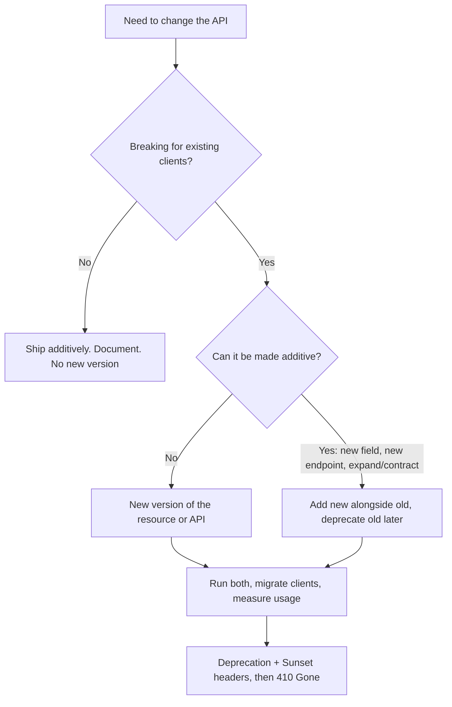
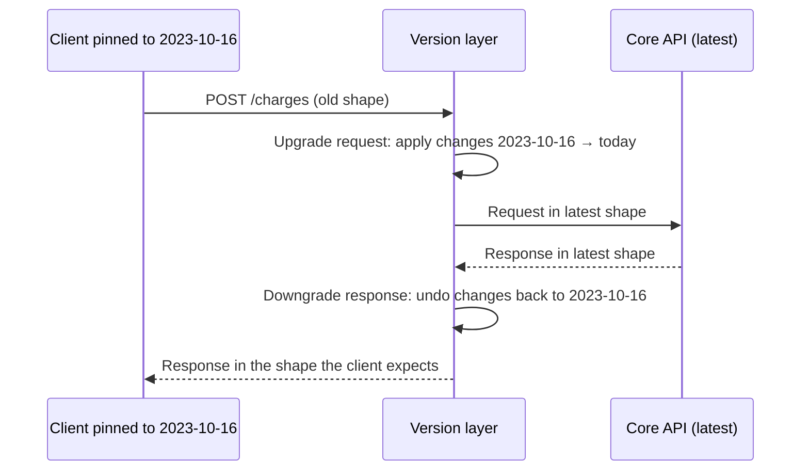
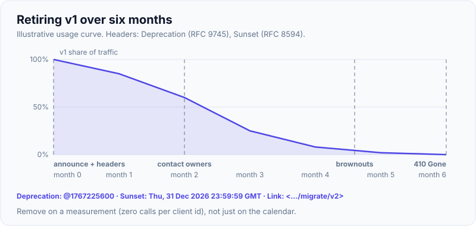

# Versioning Strategies

!!! abstract "Key takeaways"
    - **The best version is the one you never ship.** Evolve **additively** (new optional fields, new endpoints, new enum values clients were told to expect) and make clients **tolerant readers** (ignore unknown fields). Version only for **breaking** changes.
    - **Breaking** = an existing, correctly written client stops working: removing or renaming a field, changing a type or meaning, making an optional input required, tightening validation, changing status codes or error codes, changing defaults or pagination.
    - Where the version goes: **URI path** (`/v1/…`, most common, visible, cache-friendly), **header** (`API-Version: 2`), **query** (`?version=2`), or **media type** (`Accept: application/vnd.acme.v2+json`). Pick one per organisation and stay consistent.
    - **Date-based versions** (Stripe: `Stripe-Version: 2024-06-20`) pin each client to the API as it was on a date; the server upgrades old requests and downgrades new responses through a chain of small transformations.
    - Retire versions on purpose: announce, send **`Deprecation`** (RFC 9745) and **`Sunset`** (RFC 8594) headers, measure who still calls, then remove (`410 Gone`). **Spring Framework 7 / Boot 4** has first-class API versioning (`version` on `@GetMapping`, `ApiVersionConfigurer`, deprecation headers).

## Why it matters

You can redeploy your service in five minutes; you cannot redeploy your clients. Mobile apps stay installed for years, partners upgrade once a year, and other teams have their own roadmaps. Every breaking change therefore forces a choice: break clients, or run two behaviours side by side.

Versioning questions test whether you can **tell breaking from non-breaking**, keep the number of live versions small, and run a deprecation process that actually ends. A lead is expected to set this policy for a whole platform.

## Core concepts

### Breaking vs non-breaking changes

| Change | Breaking? | Why |
|---|---|---|
| Add an optional request field | No | Old clients don't send it |
| Add a response field | No (if clients are tolerant readers) | Strict deserialisers (`FAIL_ON_UNKNOWN_PROPERTIES`) will break, so document tolerance |
| Add a new endpoint or resource | No | |
| Add an enum value in a response | **Often yes** | Clients with exhaustive `switch` statements fail. Document "expect new values" from day one |
| Remove or rename a field | **Yes** | |
| Change a field's type or format (`int` → `string`, date format) | **Yes** | |
| Change a field's **meaning** (`amount` from dollars to cents) | **Yes**, and the most dangerous because nothing fails loudly | |
| Make an optional input required, or tighten validation | **Yes** | Previously valid requests now fail |
| Change status codes, error codes or default sort/page size | **Yes** | Client logic depends on them |
| Loosen validation, accept new input formats | No | |

!!! tip "Postel's law, applied carefully"
    "Be conservative in what you send, liberal in what you accept." Servers keep responses stable and additive; clients ignore unknown fields and handle unknown enum values with a default branch. This **tolerant reader** pattern is what makes additive evolution work.

### Evolve first, version last


*Notice that most "breaking" needs can be turned into additive ones: add `amountMinor` next to `amount`, migrate clients, then retire `amount`. A new major version is the last resort.*

**Expand and contract** is the API equivalent of a zero-downtime database migration: add the new shape, support both, migrate clients, then remove the old shape once usage reaches zero.

{ loading=lazy }
*Watch the client column: the old field disappears only after the last row has turned teal.*

### Where to put the version

| Strategy | Example | Pros | Cons |
|---|---|---|---|
| **URI path** | `GET /v2/claims/7` | Obvious, easy to route at the gateway, cacheable, easy to test in a browser | The "same" resource has two URIs; tempts teams into big-bang `v2` rewrites |
| **Custom header** | `API-Version: 2` | Clean URIs, version per request | Invisible in links and logs unless captured; caches need `Vary: API-Version` |
| **Query parameter** | `/claims/7?version=2` | Easy to try | Mixes versioning with filtering; easy to forget |
| **Media type** | `Accept: application/vnd.acme.claim.v2+json` | Most "RESTful", per-representation versions | Hardest for clients and tooling; needs `Vary: Accept` |
| **Date-based** | `Stripe-Version: 2024-06-20` | Fine-grained, each client pinned, many small changes | Needs a transformation layer and discipline |

Most organisations choose **path versioning for major versions** (Google, Twitter/X, many public APIs) because it is visible and easy to route. **Header-based** versioning is common for internal platforms and with gateways that can route on headers.

!!! question "Interview angle"
    There is no single right answer. Interviewers want a reasoned choice: "Path major versions for public and partner APIs because they're explicit and route cleanly at the gateway, additive changes within a version, and we design so a v2 is rare. Internally we avoid versions with tolerant readers and contract tests."

### How date-based versioning works (Stripe model)


*Notice that the core code only knows the latest model. Each breaking change ships with a small, self-contained transformation, and old clients keep working without a fork of the codebase.*

- Each account or API key is **pinned** to the version current when it was created; requests can override with a header to test upgrades.
- The cost is a growing list of transformations, which must be tested and occasionally retired.

### Deprecation and sunset

A version you can't remove is a version you maintain forever. A deprecation process that works:

1. **Announce** in the changelog and developer portal with a date and a migration guide.
2. **Signal in-band** on every response from the old version:
    ```
    Deprecation: @1767225600            # RFC 9745: a date (Unix time) when it became deprecated
    Sunset: Thu, 31 Dec 2026 23:59:59 GMT   # RFC 8594: when it will stop working
    Link: <https://developer.example-health.com/migrate/v2>; rel="deprecation"; type="text/html"
    ```
3. **Measure** who still calls the old version (by client id, API key or consumer team) and contact them directly.
4. **Brownouts** (optional): fail a small percentage of old-version calls for short windows before the sunset date, so forgotten clients surface early.
5. **Remove:** respond `410 Gone` with a problem body pointing to the migration guide, then delete the code.

{ loading=lazy }
*Notice the long tail after month 3: the last few percent are the forgotten clients that brownouts are designed to flush out.*

### Versioning in the wider platform

- **Internal APIs:** consumer-driven contract tests (Pact, Spring Cloud Contract) tell you *before* deploying whether a change breaks a consumer. That often removes the need for versions entirely.
- **GraphQL:** the convention is no versions: add fields, mark old ones `@deprecated(reason: …)`, track field usage, remove when unused.
- **Events and messages:** the same rules apply to Kafka payloads, enforced by Schema Registry compatibility modes (`BACKWARD`, `FORWARD`, `FULL`). See [Kafka schema management](../kafka/10-schema-management-avro-protobuf-schema-registry-compatibilit.md).
- **SDKs:** semantic versioning of client libraries is separate from API versioning; a non-breaking API change can still need a minor SDK release.

## In practice: code & configuration

Spring Framework 7 (Spring Boot 4) added first-class API versioning. You choose where the version is read from, declare supported versions, and annotate handler methods.

```yaml
# Spring Boot 4 application.yml
spring:
  mvc:
    apiversion:
      use:
        header: API-Version        # or path-segment / query-parameter / media-type-parameter
      supported: 1.0, 1.1, 2.0
      default: 1.0                  # used when the client sends no version
```

=== "❌ Common mistake"
    ```java
    // Copy-paste versioning: a second controller per version, logic duplicated and drifting
    @RestController @RequestMapping("/v1/claims")
    class ClaimControllerV1 { /* 400 lines */ }

    @RestController @RequestMapping("/v2/claims")
    class ClaimControllerV2 { /* the same 400 lines, slightly edited */ }

    // ...and a silent breaking change inside v1: amount switched from dollars to cents
    record ClaimV1(String id, long amount) {}   // was BigDecimal dollars last month
    ```

=== "✅ Correct approach"
    ```java
    @RestController
    @RequestMapping("/claims")
    class ClaimController {

        private final ClaimService service;
        private final ClaimMapper mapper;

        ClaimController(ClaimService service, ClaimMapper mapper) {
            this.service = service;
            this.mapper = mapper;
        }

        // One code path; only the representation differs per version.
        @GetMapping(path = "/{id}", version = "1.0")        // exactly 1.0
        ClaimV1 getV1(@PathVariable String id) {
            return mapper.toV1(service.get(id));            // amount as decimal string, legacy shape
        }

        @GetMapping(path = "/{id}", version = "1.1+")       // 1.1 and every later supported version
        ClaimV2 getLatest(@PathVariable String id) {
            return mapper.toV2(service.get(id));            // amountMinor + currency
        }
    }

    record ClaimV1(String id, String amount, String status) {}
    record ClaimV2(String id, long amountMinor, String currency, String status) {}

    @Configuration
    class ApiVersionConfig implements WebMvcConfigurer {
        @Override
        public void configureApiVersioning(ApiVersionConfigurer configurer) {
            configurer.useRequestHeader("API-Version")
                      .addSupportedVersions("1.0", "1.1", "2.0")
                      .setDefaultVersion("1.0")
                      // adds Deprecation / Sunset / Link headers for retiring versions
                      .setDeprecationHandler(deprecationHandler());
        }

        private ApiVersionDeprecationHandler deprecationHandler() {
            var handler = new StandardApiVersionDeprecationHandler();
            handler.configureVersion("1.0")
                   .setDeprecationDate(ZonedDateTime.parse("2026-07-01T00:00:00Z"))
                   .setSunsetDate(ZonedDateTime.parse("2026-12-31T23:59:59Z"))
                   .setDeprecationLink(URI.create("https://developer.example-health.com/migrate/claims-v2"));
            return handler;
        }
    }
    ```

With a baseline version such as `"1.1+"`, Spring picks the highest handler version that is less than or equal to the requested version, so adding `2.0` to the supported list doesn't require touching controllers that didn't change. An unsupported version raises `InvalidApiVersionException` (400); a missing version, when required, raises `MissingApiVersionException` (400). Running this example on Spring Boot 4.0: a request with no version gets the v1 shape plus `Deprecation: @1782864000`, `Sunset: Thu, 31 Dec 2026 23:59:59 GMT` and the `Link` header; `API-Version: 2.0` is served by the `1.1+` handler; `API-Version: 3.0` returns 400. On Spring Boot 3 the same effect needs path prefixes, a custom `RequestCondition`, or gateway routing.

## Real-world usage

- **Stripe:** date-based versions, accounts pinned on first use, per-request override header, and a transformation layer that keeps very old integrations working. Their engineering blog describes it as "version change modules".
- **GitHub REST:** moved from media-type versions to date-based calendar versions (`X-GitHub-Api-Version: 2022-11-28`), with a documented support window for old versions.
- **Google APIs:** major version in the path (`/v1/`), with AIP-180/181 rules for backwards compatibility and stability levels (alpha, beta, GA).
- **Microsoft Azure:** a required `api-version=2024-…` query parameter on every request.
- **Zalando guidelines:** avoid versioning; prefer compatible extensions and, only if unavoidable, media-type versioning.
- **Healthcare:** FHIR versions the whole specification (R4, R5) and servers advertise theirs in a `CapabilityStatement`; clients choose with `fhirVersion` media-type parameters. Payer and pharmacy integrations often run R4 for years.
- **Failure mode:** "We changed `amount` from dollars to cents in v1 because it's just a bug fix." Nothing errored; invoices were off by 100×. Meaning changes are breaking changes.

## Trade-offs & production gotchas

| Option | Pros | Cons | Use when |
|---|---|---|---|
| No versioning, additive only | No duplication, simplest | Needs tolerant clients and discipline | Internal APIs with contract tests |
| Path major versions | Explicit, gateway routing, cacheable | Duplicate URIs, big-bang temptation | Public and partner APIs |
| Header versions | Clean URIs, flexible | Hidden, needs `Vary` | Internal platforms with gateways |
| Media-type versions | Per-representation, RESTful | Complex for clients | Hypermedia-heavy APIs |
| Date-based + transforms | Fine-grained, clients pinned | Transformation layer to maintain | Large public APIs with many clients |

!!! warning "Gotcha: version sprawl"
    Every live version multiplies testing, documentation, security patches and on-call knowledge. Set a policy (for example "at most two major versions live, 12 months' deprecation notice") and enforce it with usage metrics.

!!! warning "Gotcha: enums are a breaking-change trap"
    Adding `ON_HOLD` to a `status` enum breaks every client that does an exhaustive match without a default. State in the contract that enums are open ("clients must handle unknown values"), and in Java clients deserialise unknowns to an `UNKNOWN` constant (`@JsonEnumDefaultValue`).

## How this connects to my experience

- **Where I used it:** not ★. At OptumRx the **GraphQL Consumer Service** sat between 5 upstream systems and multiple consumers, so upstream API versions and our own schema evolution were daily concerns. At Deloitte, API Gateway stages and paths often encode versions.
- **Talking points:**
    - "Our GraphQL schema followed the no-versioning convention: additive fields, `@deprecated` with a reason, and removal only after usage dropped to zero." *[confirm usage tracking]*
    - "When an upstream shipped a breaking v2, the anti-corruption layer in our service mapped both versions to one internal model, so consumers didn't see the change." *[confirm a concrete case]*
- **Likely follow-up chain:** "How do you version APIs?" → where and why → "What counts as breaking?" (renames, type/meaning changes, required inputs, enum additions) → "How do you retire v1?" (Deprecation/Sunset headers, usage metrics, brownouts, 410) → "How do you avoid needing v2?" (additive changes, tolerant readers, contract tests).

## Interview questions

### Fundamentals

??? question "Q1. What makes an API change breaking?"
    **Answer:** Any change after which a correctly written existing client stops working or behaves wrongly: removing or renaming fields, changing types or formats, changing a field's meaning or units, making optional inputs required, tightening validation, changing status or error codes, changing defaults (sort, page size), and often adding enum values. Adding optional request fields, new response fields (for tolerant clients) and new endpoints are non-breaking.

    **Interviewer listens for:** meaning/unit changes and enum additions, not just removals; tolerant readers.

    **Common wrong answer:** "Only removing endpoints is breaking."

??? question "Q2. What are the common places to put an API version?"
    **Answer:** URI path (`/v1/claims`), a custom header (`API-Version: 2`), a query parameter (`?version=2`), the media type (`Accept: application/vnd.acme.v2+json`), or a date-based version header (Stripe, GitHub). Path versioning is the most common for public APIs because it's explicit and easy to route.

    **Interviewer listens for:** the four options plus date-based, with one trade-off each.

    **Common wrong answer:** "Versioning means putting v1 in the URL." That's one option among several.

??? question "Q3. What is a tolerant reader?"
    **Answer:** A client that reads only the fields it needs and ignores unknown ones (and handles unknown enum values with a default). It lets servers add fields without breaking clients. In Jackson, keep `FAIL_ON_UNKNOWN_PROPERTIES` disabled (Spring Boot's default) and use `@JsonEnumDefaultValue` for enums.

    **Interviewer listens for:** ignore unknown fields, default enum handling, link to additive evolution.

    **Common wrong answer:** "A client that retries on errors."

??? question "Q4. Why prefer evolving an API over versioning it?"
    **Answer:** Each version is another contract to test, document, secure and support, and clients must migrate. Additive changes and expand/contract let you ship improvements continuously with no client work, keeping one code path. Version only when a change can't be made compatible.

    **Interviewer listens for:** cost of parallel versions, expand/contract, versions as a last resort.

    **Common wrong answer:** "Create a new version for every release to be safe."

### Intermediate

??? question "Q5. Path vs header versioning: which do you choose and why?"
    **Answer:** Path versioning is explicit, visible in logs and links, cache-friendly and easy to route at a gateway, so it suits public and partner APIs. Header versioning keeps URIs stable and allows per-request versions but is invisible in links and needs `Vary` for caches; it suits internal platforms. Either works if applied consistently; the bigger decision is keeping major versions rare.

    **Interviewer listens for:** a reasoned choice with audience, routing and caching considerations.

    **Common wrong answer:** "Header versioning is the only RESTful option."

??? question "Q6. How does Stripe-style date-based versioning work?"
    **Answer:** Each account is pinned to the API version (a date) current when it started; requests can override with a version header. The core code implements only the latest model. Each breaking change ships with a transformation that upgrades old requests and downgrades new responses; the server applies the chain of transformations between the client's version and today. Clients upgrade on their own schedule.

    **Interviewer listens for:** pinning, single core model, request/response transformations, client-controlled upgrades.

    **Common wrong answer:** "They keep a separate codebase per date."

??? question "Q7. How do you deprecate and remove an old version?"
    **Answer:** Announce with a date and migration guide; add `Deprecation` (RFC 9745) and `Sunset` (RFC 8594) headers plus a `Link` to the guide on every old-version response; track usage per client and contact remaining users; optionally run brownouts; on the sunset date return `410 Gone` with a problem body; then delete the code.

    **Interviewer listens for:** in-band headers, usage metrics, brownouts, 410, actually deleting.

    **Common wrong answer:** "Email clients and switch it off."

??? question "Q8. Is adding an enum value a breaking change?"
    **Answer:** It can be. Clients with exhaustive switches, or generated code that throws on unknown values, will fail. Prevent it by documenting enums as open from day one, deserialising unknown values to a default constant, and announcing new values ahead of time. Removing or renaming a value is always breaking.

    **Interviewer listens for:** exhaustive matching risk, open-enum contract, default constant.

    **Common wrong answer:** "No, adding things is never breaking."

### Senior

??? question "Q9. What does Spring Framework 7 add for API versioning?"
    **Answer:** First-class support: configure how the version is resolved (`ApiVersionConfigurer` via `useRequestHeader`, `useQueryParam`, `usePathSegment` or a media-type parameter; or `spring.mvc.apiversion.*` properties in Boot 4), declare supported and default versions, and set `version` on mappings (`"1.1"` fixed, `"1.2+"` baseline). The highest matching handler version wins. Unsupported or missing versions give 400. `StandardApiVersionDeprecationHandler` adds `Deprecation`, `Sunset` and `Link` headers, and `RestClient`/`WebClient` can send versions too.

    **Interviewer listens for:** resolver options, baseline syntax, 400 behaviour, deprecation headers.

    **Common wrong answer:** "Spring has no versioning support; use separate controllers."

??? question "Q10. How do you avoid duplicating business logic across versions?"
    **Answer:** Keep one domain model and service layer at the latest version, and make versions a representation concern: separate request/response DTOs per version and mappers (or transformation modules, Stripe style) at the edge. Old versions translate into the current model on the way in and back out on the way out. Never fork controllers or services per version.

    **Interviewer listens for:** single core model, version-specific DTOs and mappers, no forks.

    **Common wrong answer:** "Copy the v1 controller to v2 and edit it."

??? question "Q11. How do contract tests reduce the need for versioning internally?"
    **Answer:** Consumer-driven contracts record which fields and behaviours each consumer actually uses. The provider's pipeline verifies all contracts (`can-i-deploy`), so a change that breaks a real consumer fails before release, while changes no consumer depends on ship freely. Combined with tolerant readers, most internal changes become non-events.

    **Interviewer listens for:** consumer-driven contracts, verification in the provider pipeline, freedom for unused parts.

    **Common wrong answer:** "Integration tests in a shared staging environment catch it."

### Scenario-based

??? question "Q12. You must change `amount` from a decimal in dollars to integer cents. How do you roll it out?"
    **Answer:** Don't change `amount` in place: a meaning change is breaking and fails silently. Add `amountMinor` and `currency` alongside `amount` (additive), document `amount` as deprecated, migrate clients (tracking which still read `amount` if possible), then remove `amount` in the next major version or after a sunset. If a new major version is needed anyway, include it there, with mappers producing both shapes from one model.

    **Interviewer listens for:** meaning change = breaking, additive field, expand/contract, sunset.

    **Common wrong answer:** "It's a bug fix, change it in v1."

??? question "Q13. You run v1, v2 and v3 of a partner API and maintenance is crushing the team. What's your plan?"
    **Answer:** Measure usage per version and per partner. Set a published policy (for example two live majors, 12 months' notice). Deprecate v1 with headers and direct outreach, offer migration help, run brownouts, then return 410 and delete it. Collapse v2 and v3 onto one core model with edge mappers. Going forward, prefer additive changes and contract tests so v4 is rare.

    **Interviewer listens for:** data first, policy, communication, consolidating to one core model.

    **Common wrong answer:** "Keep all three forever to avoid upsetting partners."

??? question "Q14. A mobile app crashes after the backend added a new value to an order status. What went wrong and how do you prevent it?"
    **Answer:** The client used an exhaustive enum without a default (or a strict generated client), so the unknown value failed deserialisation. Short term: ship the client fix, or temporarily map the new value to an existing one for old app versions (detect via app version header). Long term: document enums as open, deserialise unknown values to `UNKNOWN`, add a contract test with an unknown value, and announce new values before shipping.

    **Interviewer listens for:** enum risk, short-term mitigation by app version, open-enum contract, tests.

    **Common wrong answer:** "Never add enum values." Domains change; the contract must allow it.

## Cheat sheet

| Concept | Remember |
|---|---|
| Default | Evolve additively; tolerant readers; version only for breaking changes |
| Breaking | Remove/rename, type or **meaning** change, new required input, tighter validation, new status/error codes, enum additions (often) |
| Expand/contract | Add new alongside old → migrate → remove old |
| Placement | Path `/v1` (common), header, query, media type, date-based |
| Stripe model | Account pinned to a date; core = latest; request/response transforms |
| Retire | Announce → `Deprecation` (RFC 9745) + `Sunset` (RFC 8594) + `Link` → measure → brownout → `410 Gone` → delete |
| Spring 7 / Boot 4 | `ApiVersionConfigurer`, `spring.mvc.apiversion.*`, `@GetMapping(version="1.2+")`, 400 if unsupported |
| Internal APIs | Contract tests + tolerant readers ≈ no versions |
| GraphQL / events | `@deprecated` + usage tracking; Schema Registry compatibility |

## Sources
1. [Spring Framework reference: API Versioning](https://docs.spring.io/spring-framework/reference/web/webmvc-versioning.html) and [request mapping with API versions](https://docs.spring.io/spring-framework/reference/web/webmvc/mvc-controller/ann-requestmapping.html).
2. [Spring Framework 7.0 API: ApiVersionConfigurer](https://docs.spring.io/spring-framework/docs/current/javadoc-api/org/springframework/web/servlet/config/annotation/ApiVersionConfigurer.html).
3. [Dan Vega: First-class API versioning in Spring Boot 4](https://www.danvega.dev/blog/spring-boot-4-api-versioning): Boot 4 `spring.mvc.apiversion.*` properties.
4. [RFC 9745: The Deprecation HTTP Response Header Field](https://datatracker.ietf.org/doc/html/rfc9745) and [RFC 8594: The Sunset HTTP Header Field](https://www.rfc-editor.org/rfc/rfc8594).
5. [Stripe: APIs as infrastructure: future-proofing Stripe with versioning](https://stripe.com/blog/api-versioning) and [Stripe API versioning docs](https://docs.stripe.com/api/versioning).
6. [GitHub REST API: API versions](https://docs.github.com/en/rest/about-the-rest-api/api-versions).
7. [Google AIP-180: Backwards compatibility](https://google.aip.dev/180) and [AIP-185: API versioning](https://google.aip.dev/185).
8. [Zalando RESTful API Guidelines: compatibility](https://opensource.zalando.com/restful-api-guidelines/#compatibility).
9. [Martin Fowler: Tolerant Reader](https://martinfowler.com/bliki/TolerantReader.html).
