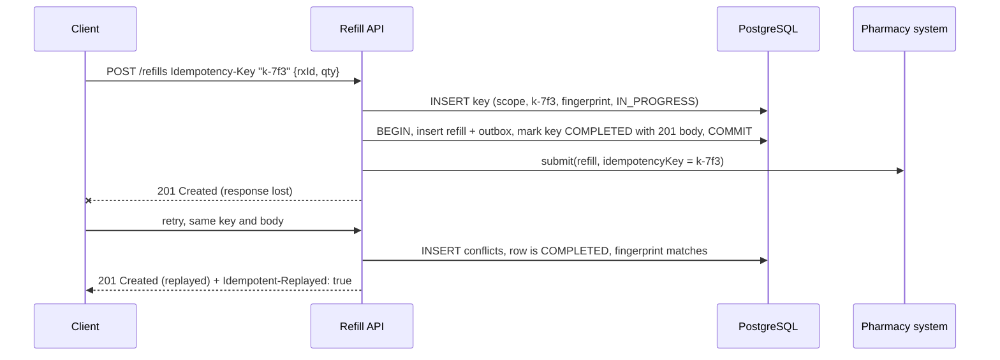
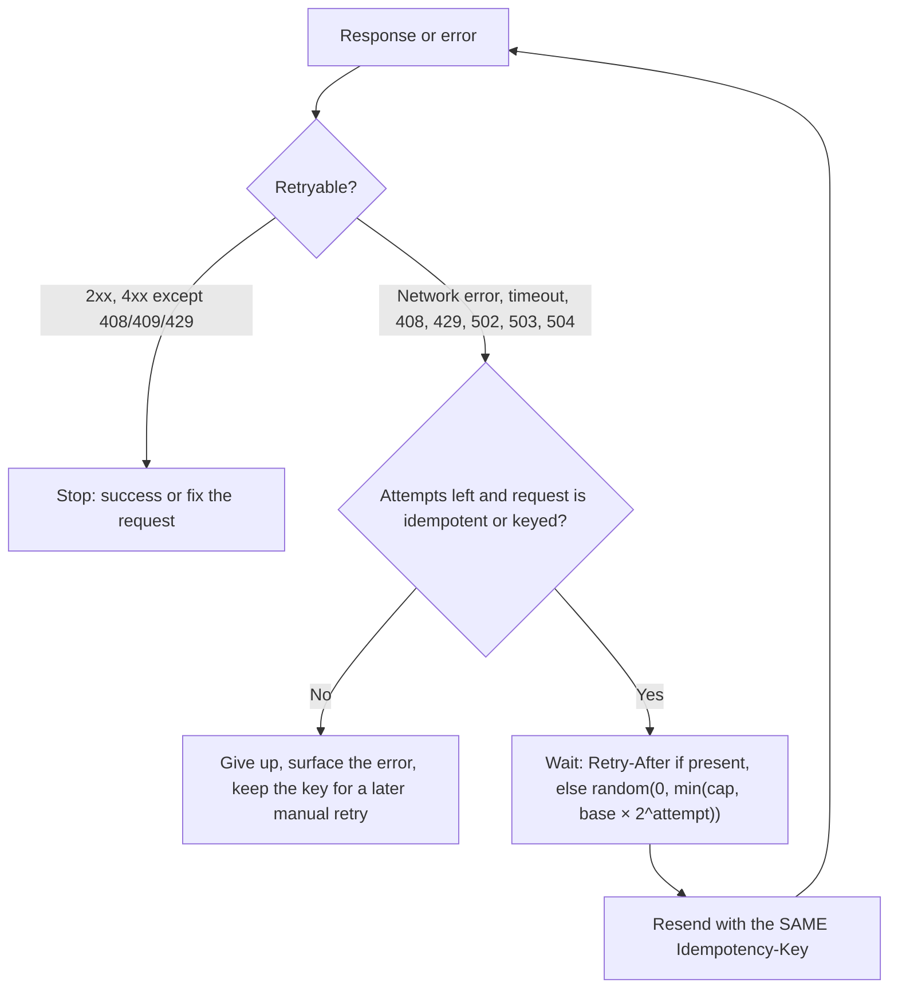

# Idempotency Keys & Safe Retries

!!! abstract "TL;DR"
    - A timeout gives the client an **unknown outcome**: the server may or may not have done the work. Safe retries need **idempotent** operations. `GET`, `PUT` and `DELETE` are idempotent by definition; **`POST` and `PATCH` need an `Idempotency-Key`**.
    - Contract (IETF draft, Stripe-style): the client sends `Idempotency-Key: "<uuid>"` **once per logical operation and reuses it on every retry**. The server stores key → request fingerprint → result and **replays** the stored result. Missing key on an endpoint that requires it → **400**; same key, different body → **422**; same key still processing → **409**.
    - Server must **claim the key atomically** (unique constraint, insert first) and **store the result in the same transaction** as the business change. Pass the key on to downstream providers (payments, pharmacy) so the whole chain is idempotent.
    - Clients retry only **retryable** failures (network errors, timeouts, `408`, `429`, `502`, `503`, `504`; `500` with care), with **exponential backoff + jitter**, a retry cap, and they honour **`Retry-After`**. Never retry `4xx` validation failures.
    - Keys are **scoped** (per caller and endpoint) and **expire** (Stripe: 24 hours for API v1). Document the window.

## Why it matters

Networks drop responses. Load balancers time out. Mobile apps lose signal mid-request and resend when they reconnect. Every serious client library retries. If a `POST /refills` or `POST /payments` isn't idempotent, those retries become duplicate refills, double charges and repeated SMS messages, and in healthcare that is a patient-safety issue as well as a billing one.

This page is about the **API surface**: what the contract promises, how clients should behave, and how to implement the server side correctly in Spring Boot. The underlying theory (natural vs engineered idempotency, idempotent consumers, where idempotency breaks) is in [Distributed Systems: Idempotency & idempotency keys](../distributed-systems/04-idempotency-and-idempotency-keys.md).

## Core concepts

### Which requests are safe to retry?

| Request | Retry safely? | How |
|---|---|---|
| `GET`, `HEAD`, `OPTIONS` | ✅ | Safe and idempotent |
| `PUT` (full replace) | ✅ | Idempotent by definition, if implemented as a real replace |
| `DELETE` | ✅ | Second call may return `404`; state is the same |
| `PUT`/`PATCH` with `If-Match` | ✅ | The precondition fails (`412`) if the first attempt already applied |
| `POST` create / action | ❌ unless keyed | `Idempotency-Key` header |
| `PATCH` (JSON Patch `add`, increments) | ❌ unless keyed or conditional | `Idempotency-Key` or `If-Match` |

### The contract


*Notice that the retry gets the **original** response without re-running the business logic, and the downstream call carries the same key, so even a crash after calling the pharmacy can't create a second fill.*

| Situation | Server response |
|---|---|
| First request with key K | Process; store fingerprint + result |
| Retry with K, same fingerprint, completed | **Replay** the stored status code and body (Stripe adds `Idempotent-Replayed: true`) |
| Retry with K while the first is still running | **409 Conflict** + `Retry-After` (or wait briefly) |
| Retry with K but a **different** body | **422 Unprocessable Content** (key reused for a different operation) |
| Endpoint requires a key, none sent | **400 Bad Request** |
| K older than the retention window | Treated as new; document the window so clients don't rely on it |

**Header details from the IETF draft** (`draft-ietf-httpapi-idempotency-key-header`, revision 07, October 2025, now expired, but widely implemented): the value is a Structured Field **String**, so it is quoted: `Idempotency-Key: "8e03978e-40d5-43e8-bc93-6894a57f9324"`. Servers should publish which endpoints accept keys and their expiry policy. Many APIs (Stripe included) also accept an unquoted value; be liberal in what you accept.

### Designing the key

- **Generated by the client**, per **logical operation**: create the UUID when the user presses "Submit", store it with the pending action, reuse it for every retry. A new key per attempt defeats the purpose.
- **Deterministic keys** are fine when the operation has a natural identity: `rx_9f2:fill:3` for "third fill of this prescription". Useful for server-to-server calls and message-driven flows.
- **Scope** the key: the uniqueness constraint is `(caller/tenant, endpoint, key)`, so two customers who happen to pick the same key don't see each other's results (a data leak).
- **Fingerprint** the request: hash method, path and a canonical body, so a reused key with different content is detected.
- **Retention:** long enough to cover every client retry, including offline mobile queues. Stripe keeps keys for 24 hours on API v1 and 30 days on API v2.

### What to store and replay

- Status code, the response body (or the created resource id to re-render), important headers (`Location`), and timestamps.
- **Errors too:** if the first attempt failed validation (`422`), replay the same `422`. If it failed with a **retryable** error *before any side effect committed* (database down, `503`), **release the key** so the retry can run.
- Store the body as text if you need byte-exact replays. A JSONB column normalises whitespace and key order.

### How clients should retry


*Notice that the key never changes between attempts, and that `409` for a key that is still in progress is retryable after a short wait, unlike other `409`s.*

- **Exponential backoff with full jitter** spreads retries out so thousands of clients don't hammer a recovering service in sync.
- **Cap attempts and total time** (for example 3 attempts within the user's patience or the caller's deadline).
- **Honour `Retry-After`** on `429` and `503`.
- **Retry budgets** at the service level stop retry storms: retries may add at most, say, 10% extra load.
- Retry at **one layer** only. A mobile app, a BFF and an HTTP client library each retrying 3 times turns one failure into 27 requests.

## In practice: code & configuration

```sql
CREATE TABLE idempotency_key (
  scope         TEXT        NOT NULL,        -- e.g. 'member-42:POST /refills'
  idem_key      TEXT        NOT NULL,
  fingerprint   CHAR(64)    NOT NULL,        -- SHA-256 of method + path + canonical body
  status        TEXT        NOT NULL CHECK (status IN ('IN_PROGRESS', 'COMPLETED')),
  locked_until  TIMESTAMPTZ,                 -- lets a retry take over if the owner crashed
  response_code INT,
  response_body JSONB,                       -- use TEXT if replays must be byte-exact
  created_at    TIMESTAMPTZ NOT NULL DEFAULT now(),
  PRIMARY KEY (scope, idem_key)              -- concurrent duplicates collide here
);
-- Cleanup: DELETE FROM idempotency_key WHERE created_at < now() - interval '24 hours';
```

=== "❌ Common mistake"
    ```java
    @PostMapping("/refills")
    ResponseEntity<RefillView> create(@RequestHeader("Idempotency-Key") String key,
                                      @RequestBody RefillRequest req) {
        // Check-then-act: two concurrent retries both see "not found" and both create a refill
        var existing = keys.findById(key);                 // not scoped per caller either
        if (existing.isPresent()) return existing.get().toResponse();

        RefillView view = refillService.create(req);       // business transaction commits here...
        keys.save(new StoredKey(key, view));               // ...crash before this line = duplicate on retry
        pharmacy.submit(view);                             // downstream call without the key
        return ResponseEntity.status(201).body(view);
    }
    ```

=== "✅ Correct approach"
    ```java
    @Repository
    public class IdempotencyStore {

        public sealed interface Outcome permits Started, Replay, Mismatch, InProgress {}
        public record Started() implements Outcome {}
        public record Replay(int status, String body) implements Outcome {}
        public record Mismatch() implements Outcome {}
        public record InProgress() implements Outcome {}

        private final JdbcTemplate jdbc;

        public IdempotencyStore(JdbcTemplate jdbc) { this.jdbc = jdbc; }

        /** Runs in its own (auto-commit) transaction so concurrent duplicates see the claim at once. */
        public Outcome begin(String scope, String key, String fingerprint) {
            int inserted = jdbc.update("""
                    INSERT INTO idempotency_key (scope, idem_key, fingerprint, status, locked_until)
                    VALUES (?, ?, ?, 'IN_PROGRESS', now() + interval '30 seconds')
                    ON CONFLICT (scope, idem_key) DO NOTHING
                    """, scope, key, fingerprint);
            if (inserted == 1) return new Started();                       // we own this key now

            Map<String, Object> row = jdbc.queryForMap("""
                    SELECT fingerprint, status, response_code, response_body::text AS body
                    FROM idempotency_key WHERE scope = ? AND idem_key = ?
                    """, scope, key);
            if (!fingerprint.equals(row.get("fingerprint"))) return new Mismatch();      // -> 422
            if ("COMPLETED".equals(row.get("status")))
                return new Replay((Integer) row.get("response_code"), (String) row.get("body"));

            // IN_PROGRESS: take over only if the previous owner's lock expired (it crashed)
            int taken = jdbc.update("""
                    UPDATE idempotency_key SET locked_until = now() + interval '30 seconds'
                    WHERE scope = ? AND idem_key = ? AND status = 'IN_PROGRESS' AND locked_until < now()
                    """, scope, key);
            return taken == 1 ? new Started() : new InProgress();          // -> 409 + Retry-After
        }

        /** Call inside the business transaction, so the result and the business change commit together. */
        public void complete(String scope, String key, int status, String jsonBody) {
            jdbc.update("""
                    UPDATE idempotency_key
                    SET status = 'COMPLETED', response_code = ?, response_body = ?::jsonb, locked_until = NULL
                    WHERE scope = ? AND idem_key = ?
                    """, status, jsonBody, scope, key);
        }

        /** On a retryable failure (nothing was committed), free the key so the client's retry can run. */
        public void release(String scope, String key) {
            jdbc.update("DELETE FROM idempotency_key WHERE scope = ? AND idem_key = ? AND status = 'IN_PROGRESS'",
                    scope, key);
        }
    }

    @RestController
    @RequestMapping("/refills")
    class RefillController {

        private final IdempotencyStore keys;
        private final RefillService refills;        // @Transactional: inserts refill + outbox + calls keys.complete(...)
        private final ObjectMapper json;

        RefillController(IdempotencyStore keys, RefillService refills, ObjectMapper json) {
            this.keys = keys; this.refills = refills; this.json = json;
        }

        @PostMapping
        ResponseEntity<String> create(@RequestHeader("Idempotency-Key") String rawKey,   // missing -> 400
                                      @AuthenticationPrincipal Jwt caller,
                                      @RequestBody RefillRequest req) throws Exception {
            String key = rawKey.replace("\"", "");                          // accept quoted (sf-string) and bare
            String scope = caller.getSubject() + ":POST /refills";          // keys never collide across callers
            String fingerprint = sha256Hex("POST /refills " + json.writeValueAsString(req));

            return switch (keys.begin(scope, key, fingerprint)) {
                case IdempotencyStore.Replay r -> ResponseEntity.status(r.status())
                        .header("Idempotent-Replayed", "true").body(r.body());
                case IdempotencyStore.Mismatch m -> problem(422, "Idempotency-Key was reused with a different request");
                case IdempotencyStore.InProgress p -> ResponseEntity.status(409).header("Retry-After", "1")
                        .body(problemJson(409, "A request with this Idempotency-Key is still being processed"));
                case IdempotencyStore.Started s -> {
                    try {
                        String body = refills.create(req, scope, key);       // business TX + keys.complete(...)
                        yield ResponseEntity.status(201).body(body);
                    } catch (TransientDataAccessException | ResourceAccessException e) {
                        keys.release(scope, key);                            // nothing committed: allow retry
                        throw e;                                             // -> 503 via the error handler
                    }
                }
            };
        }
        // problem(), problemJson(), sha256Hex() omitted: build RFC 9457 bodies and a hex SHA-256
    }
    ```

The `IdempotencyStore` above was tested against PostgreSQL 16 while writing this page: 16 threads sending the same key at the same moment produced exactly **1 `Started` and 15 `InProgress`**; after `complete`, the same key replayed `201` with the stored body; the same key with a different fingerprint returned `Mismatch`; the same key under a different caller scope started independently; and an expired lock was taken over.

!!! tip "Use the serialised DTO, not the raw request body, for the fingerprint"
    Hashing the raw bytes makes `{"a":1,"b":2}` and `{"b":2, "a":1}` look different. Deserialise into the request record first and hash a canonical serialisation (stable field order), as above, or hash only the business-relevant fields.

**Client side** (Java `RestClient` with Spring Retry-style logic, or Resilience4j):

```java
String key = UUID.randomUUID().toString();                // created once per user action
RetryConfig cfg = RetryConfig.custom()
        .maxAttempts(3)
        .intervalFunction(IntervalFunction.ofExponentialRandomBackoff(200, 2.0))   // backoff + jitter
        .retryOnException(e -> e instanceof ResourceAccessException                // timeouts, resets
                || (e instanceof HttpServerErrorException h && h.getStatusCode().value() >= 502)
                || (e instanceof HttpClientErrorException c
                        && (c.getStatusCode().value() == 429 || c.getStatusCode().value() == 409)))
        .build();

RefillView view = Retry.of("refills", cfg).executeSupplier(() ->
        restClient.post().uri("/refills")
                .header("Idempotency-Key", "\"" + key + "\"")    // the SAME key on every attempt
                .body(request)
                .retrieve()
                .body(RefillView.class));
```

Retrying on every `409` is only right for this endpoint, where `409` means "same key still in progress". If the API also uses `409` for business conflicts, check the problem `code` before retrying.

## Real-world usage

- **Stripe:** every `POST` accepts `Idempotency-Key`; results (including errors) are stored and replayed; replays carry `Idempotent-Replayed: true`; keys are pruned after 24 hours on API v1 (30 days on v2); a reused key with different parameters is rejected. Stripe's SDKs generate keys automatically and retry with backoff.
- **AWS:** many APIs take a `ClientToken` (EC2 `RunInstances`, ECS `RunTask`). **Powertools for AWS Lambda** has an idempotency utility that stores keys in DynamoDB with an in-progress record and expiry, the same pattern as above.
- **Adyen, PayPal, Square** and most payment providers support idempotency keys on payment creation, which is why your own service must **pass its key through**.
- **Google APIs:** `requestId` fields on mutating calls for the same purpose.
- **Healthcare:** e-prescribing and pharmacy integrations deduplicate on message ids; a refill submitted twice because a mobile app retried is a classic incident.

## Trade-offs & production gotchas

| Option | Pros | Cons | Use when |
|---|---|---|---|
| `Idempotency-Key` header + store | Works for any POST, replays exact result | Storage, cleanup, more code | Creates, payments, actions |
| Client-generated id + `PUT` | Natural idempotency, no key table | Clients must generate unique ids | Upserts, offline-first clients |
| Natural unique constraint (business key) | Simple, strong | Only for operations with a natural key | `rxId + fillNumber`, order numbers |
| `If-Match` conditional update | No extra table | Only for updates of existing resources | PATCH/PUT edits |
| Redis key store | Fast, TTL built in | Not transactional with your DB; eviction loses keys | High volume, short windows, plus a DB constraint as backstop |

!!! warning "Gotcha: recording the key after the side effect"
    If the business transaction commits and the process dies before the key is marked completed, the retry runs again. Mark the key completed **inside** the business transaction (as `complete()` above is designed for), and pass the key to any external system you call.

!!! warning "Gotcha: unscoped keys leak data"
    If the primary key is just `idem_key`, two customers using the same key value see each other's stored responses. Always include the caller or tenant in the key's scope.

!!! warning "Gotcha: idempotency across retries at several layers"
    A gateway that retries a `POST` on timeout **without** the client's key turns one request into two. Gateways and service meshes should only retry idempotent methods, or forward the key untouched.

## How this connects to my experience

- **Where I used it:** ★ The OptumRx **Kafka-based event-driven workflows with retry and DLQ handling** depend on idempotent processing, and the **GraphQL Consumer Service** issued mutations to upstream systems on behalf of members. At Coriolis, key-management operations (create, rotate) must not run twice.
- **Talking points:**
    - "Retries were everywhere in our design (HTTP clients to 5 upstreams, Kafka redelivery, DLQ replay), so every write path needed a dedup strategy: idempotency keys on API writes, event ids in a processed table for consumers." *[confirm which mechanism each path used]*
    - "We only retried idempotent calls automatically. GraphQL mutations that called non-idempotent upstream POSTs carried a key derived from the business operation." *[confirm]*
    - "For key rotation at Coriolis, a duplicate rotate creates an extra key version, so the operation was guarded by the key's current version." *[confirm]*
- **Likely follow-up chain:** "How do you make a POST safe to retry?" → idempotency key contract → "Two duplicates arrive at the same moment?" (unique insert first, 409) → "Server crashes after charging?" (key passed downstream, result stored in the same transaction, stale-lock takeover) → "How long do you keep keys?" (retention window vs offline clients) → "How do clients retry?" (backoff, jitter, Retry-After, same key).

## Interview questions

### Fundamentals

??? question "Q1. Why do APIs need idempotency keys?"
    **Answer:** Because a timeout doesn't tell the client whether the server did the work. Retrying a non-idempotent request like `POST /payments` can then duplicate it. An idempotency key identifies the logical operation, so the server can recognise a retry and return the original result instead of executing again.

    **Interviewer listens for:** unknown outcome after timeout, POST not idempotent, replay of the original result.

    **Common wrong answer:** "To prevent users clicking the button twice." That's one case; network retries are the main one.

??? question "Q2. Which HTTP requests are safe to retry without a key?"
    **Answer:** `GET`, `HEAD`, `OPTIONS`, `PUT` (if it's a true replace) and `DELETE`, because they are idempotent. Conditional updates with `If-Match` are also safe because a repeated attempt fails the precondition. `POST` and non-conditional `PATCH` need a key.

    **Interviewer listens for:** idempotent methods, conditional requests as an alternative, POST/PATCH need keys.

    **Common wrong answer:** "Any request can be retried if the server is fast."

??? question "Q3. Who generates the idempotency key, and when?"
    **Answer:** The client, once per logical operation (when the user submits or the job decides to act), and it reuses the same key for every retry. Alternatively a deterministic key from business identity (`rxId + fillNumber`). Generating a new key per attempt makes every retry look like a new request.

    **Interviewer listens for:** client-generated, per operation not per attempt, deterministic option.

    **Common wrong answer:** "The server generates it and returns it." The client needs it *before* the first attempt.

??? question "Q4. What should the server return for a retried request that already succeeded?"
    **Answer:** The original response: the same status code and body (and relevant headers like `Location`), without re-running the logic. Stripe marks replays with `Idempotent-Replayed: true`. If the original failed with a non-retryable error, replay that error too.

    **Interviewer listens for:** replay not recompute, same status and body, errors replayed.

    **Common wrong answer:** "Return 409 because it already exists." That makes the client think it failed.

### Intermediate

??? question "Q5. What status codes does the Idempotency-Key draft define for errors?"
    **Answer:** `400` when an endpoint requires the header and it's missing; `422` when a key is reused with a different request payload; `409` when a request with the same key is still being processed. The header value is a Structured Field string, so it is quoted.

    **Interviewer listens for:** 400/422/409 mapping, the quoted sf-string detail.

    **Common wrong answer:** "Return 200 for everything with the same key."

??? question "Q6. How do you handle two identical requests arriving at the same time?"
    **Answer:** Claim the key atomically before doing any work: `INSERT … ON CONFLICT DO NOTHING` on a unique `(scope, key)` primary key. Exactly one request inserts and proceeds; the others see an `IN_PROGRESS` row and get `409` with `Retry-After` (or wait briefly and then replay). A lock timeout lets a retry take over if the owner crashed.

    **Interviewer listens for:** insert-first with a unique constraint, 409 for in-flight, takeover of stale locks.

    **Common wrong answer:** "Check whether the key exists, then insert." Two requests pass the check together.

??? question "Q7. Why include a request fingerprint?"
    **Answer:** To detect a key reused for a different operation, which is a client bug (or a key collision). Without it, the server would replay the response for request A to request B. Hash the method, path and a canonical body and return `422` on mismatch.

    **Interviewer listens for:** detecting misuse, canonical body, 422.

    **Common wrong answer:** "The key alone is enough because it's a UUID."

??? question "Q8. How should a client retry?"
    **Answer:** Only on retryable failures (network errors, timeouts, `408`, `429`, `502`, `503`, `504`, and the idempotency `409`), with exponential backoff and full jitter, a cap on attempts and total time, honouring `Retry-After`, and always with the same idempotency key. Retry at one layer only.

    **Interviewer listens for:** retryable classification, jitter, cap, Retry-After, same key, single layer.

    **Common wrong answer:** "Retry immediately three times."

### Senior

??? question "Q9. Where must the 'completed' record be written, relative to the business change?"
    **Answer:** In the same database transaction as the business change (and the outbox row, if events are published). Then either both commit or neither does. If the key were marked in a separate transaction after the business commit, a crash in between would let the retry execute again.

    **Interviewer listens for:** same transaction, crash window reasoning, outbox.

    **Common wrong answer:** "Write the key to Redis after the database commit."

??? question "Q10. What if your service calls an external payment or pharmacy API?"
    **Answer:** You can't put the external call in your transaction, so pass an idempotency key downstream (your key or a derived one) so the provider deduplicates. If your service crashes after the provider succeeded but before you recorded it, the retry calls the provider again with the same key and gets the original result. Add reconciliation for providers that don't support keys.

    **Interviewer listens for:** key propagation, crash after external success, reconciliation.

    **Common wrong answer:** "Wrap the HTTP call in @Transactional."

??? question "Q11. How long should idempotency keys be kept, and what happens after?"
    **Answer:** Longer than any client's retry window: minutes for synchronous clients, hours or days for offline mobile queues and batch jobs. Stripe keeps keys 24 hours on API v1. After expiry a reused key is treated as a new request, so document the window and make clients generate new keys for new operations. Clean up with a scheduled delete or table partitioning.

    **Interviewer listens for:** window vs client behaviour, documented policy, cleanup.

    **Common wrong answer:** "Keep them forever." Storage grows without bound and it isn't needed.

??? question "Q12. Redis or the database for the key store?"
    **Answer:** The database when the operation's effects live there: the key and the business change can commit atomically. Redis is faster and has TTLs but isn't transactional with your database and may evict keys, so use it only as a fast first check with a database unique constraint as the backstop, or for operations without a database write.

    **Interviewer listens for:** atomicity with business data, eviction risk, backstop constraint.

    **Common wrong answer:** "Redis, because it's faster." Speed doesn't help if the guarantee is gone.

### Scenario-based

??? question "Q13. Members report duplicate refill orders after poor mobile connectivity. How do you fix it end to end?"
    **Answer:** The app retries `POST /refills` without a stable key. Fix the client to create a UUID when the member taps "Refill", store it with the pending action, and reuse it for every retry, including after app restarts. On the server, require `Idempotency-Key` on that endpoint, claim it atomically, store the result in the business transaction, and pass the key to the pharmacy system. Add a natural constraint (`rxId + fillNumber`) as a second guard, and dedupe existing duplicates.

    **Interviewer listens for:** client and server changes, persistence of the key on the device, downstream propagation, natural constraint backstop.

    **Common wrong answer:** "Disable retries in the app." Members would see failures for requests that actually succeeded.

??? question "Q14. A gateway retries POSTs on upstream timeout and you see duplicate payments. What do you change?"
    **Answer:** Configure the gateway (or mesh) to retry only idempotent methods, or to retry POSTs only when they carry an `Idempotency-Key` that it forwards unchanged. Make the payment endpoint require keys. Check the timeout chain: the gateway timeout should be longer than the service's own deadline so it doesn't give up while the service is still working.

    **Interviewer listens for:** method-aware retry policy, key forwarding, timeout ordering.

    **Common wrong answer:** "Increase the gateway timeout." It reduces but doesn't remove the duplicates.

??? question "Q15. After a deploy, clients get 409 'still processing' for minutes on some keys. What happened?"
    **Answer:** Requests were killed mid-flight during the deploy, leaving `IN_PROGRESS` rows whose owners no longer exist. Without a lock expiry, retries see "in progress" forever. Fix: a `locked_until` lease so a retry can take over after expiry, graceful shutdown that drains in-flight requests, and releasing keys when a request fails before committing. Then check whether any of those requests reached downstream systems before takeover.

    **Interviewer listens for:** orphaned in-progress records, lease/takeover, graceful shutdown, downstream check.

    **Common wrong answer:** "Delete all IN_PROGRESS rows on startup." Another instance may still be processing them.

## Cheat sheet

| Concept | Remember |
|---|---|
| Why | Timeout = unknown outcome. Retries must not duplicate effects |
| Retry-safe | GET, HEAD, OPTIONS, PUT, DELETE, conditional writes. POST/PATCH need a key |
| Header | `Idempotency-Key: "<uuid>"` (sf-string). Per operation, reused on every retry |
| Server rules | Missing → 400, different body → 422, still running → 409 + Retry-After, done → replay |
| Storage | `(scope, key)` PK, fingerprint, status, lease, response; claim first, complete in the business TX |
| Downstream | Pass the key on; reconcile when providers can't dedupe |
| Retention | Longer than client retry windows; Stripe 24 h (v1) |
| Client retry | Retryable only; exponential backoff + jitter; cap; Retry-After; one layer; same key |
| Gotchas | Per-attempt keys, check-then-insert, key written after the side effect, unscoped keys, gateways retrying POST |

## Sources
1. [IETF draft: The Idempotency-Key HTTP Header Field (revision 07)](https://www.ietf.org/archive/id/draft-ietf-httpapi-idempotency-key-header-07.html): header syntax, 400/409/422 rules, expiry guidance.
2. [Stripe API: Idempotent requests](https://docs.stripe.com/api/idempotent_requests): 24-hour retention, replay semantics, `Idempotent-Replayed`.
3. [Stripe: API v2 overview](https://docs.stripe.com/api-v2-overview): 30-day idempotency window in v2.
4. [Stripe blog: Designing robust and predictable APIs with idempotency](https://stripe.com/blog/idempotency).
5. [Brandur Leach: Implementing Stripe-like idempotency keys in Postgres](https://brandur.org/idempotency-keys).
6. [RFC 9110 §9.2.2: Idempotent methods](https://www.rfc-editor.org/rfc/rfc9110#section-9.2.2).
7. [AWS Builders' Library: Timeouts, retries and backoff with jitter](https://aws.amazon.com/builders-library/timeouts-retries-and-backoff-with-jitter/) and [Making retries safe with idempotent APIs](https://aws.amazon.com/builders-library/making-retries-safe-with-idempotent-APIs/).
8. [Powertools for AWS Lambda (Java): Idempotency](https://docs.powertools.aws.dev/lambda/java/utilities/idempotency/).
9. [Resilience4j: Retry](https://resilience4j.readme.io/docs/retry).
10. Implementation and concurrency test on this page: Spring Boot 3.5 + PostgreSQL 16, run while writing this page.
