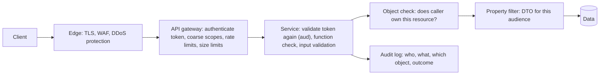

# API Security & Rate Limiting

!!! abstract "TL;DR"
    - The **OWASP API Security Top 10 (2023)** is the checklist. Number one is **BOLA** (Broken Object Level Authorization): a valid user changes `/members/42` to `/members/43` and sees someone else's data. **Authenticating the caller is not authorising the object.**
    - **Authentication:** OAuth2 access tokens (JWT validated for signature, `iss`, `aud`, `exp`) for users and services; **mTLS** for service identity; **API keys only identify a client** (for quotas and analytics) and are not strong user authentication.
    - **Authorisation at three levels:** function (can this role call `POST /refunds`?), object (does this caller own claim 7?), property (may they read `ssn`, or write `status`?). Enforce all three in the service, not just the gateway.
    - **Validate input strictly** (types, ranges, sizes, allow-lists), never bind request bodies directly onto entities (**mass assignment**), and keep errors free of internals.
    - **Rate limit and quota** every API per client identity (token bucket in Redis or at the gateway). Over the limit → **`429 Too Many Requests`** + `Retry-After`; advertise limits with the IETF **`RateLimit-Policy`/`RateLimit`** headers. Also cap payload size, page size, query cost and timeouts (OWASP API4: unrestricted resource consumption).

## Why it matters

APIs are now the main attack surface: mobile apps, SPAs and partners all talk to them directly, and an attacker can read your JavaScript to find every endpoint. Most API breaches are not clever cryptography attacks. They are **authorisation bugs**: a missing ownership check, an admin field a normal user can set, an endpoint left over from v1 with no auth, or an unlimited "check if this email exists" endpoint used to enumerate customers.

In healthcare and banking, one BOLA bug is a reportable breach. Interviewers ask about API security to see whether you think in **objects and data**, not just "we use OAuth".

## Core concepts

### OWASP API Security Top 10 (2023)

| # | Risk | What it looks like | Primary defence |
|---|---|---|---|
| API1 | **Broken Object Level Authorization (BOLA)** | `GET /claims/7` returns another member's claim | Ownership/tenant check on every object access |
| API2 | Broken Authentication | Weak tokens, no expiry, credential stuffing, unvalidated JWTs | Standard OAuth2/OIDC, validate `iss`/`aud`/`exp`/signature, MFA, lockouts |
| API3 | Broken Object **Property** Level Authorization | Response leaks `ssn`; client can set `role` or `status` | Response DTOs per audience, explicit writable fields |
| API4 | Unrestricted Resource Consumption | No rate limits, huge pages, expensive queries, large uploads | Rate limits, quotas, max sizes, timeouts, query cost limits |
| API5 | Broken **Function** Level Authorization | A member calls `DELETE /admin/users/9` | Role/scope checks per endpoint, deny by default |
| API6 | Unrestricted Access to Sensitive Business Flows | Bots buying all tickets, mass account creation, refill abuse | Business-level limits, bot detection, step-up checks |
| API7 | Server-Side Request Forgery | API fetches a user-supplied URL and reaches internal metadata endpoints | Allow-list destinations, block private ranges, no redirects |
| API8 | Security Misconfiguration | Verbose errors, open CORS, missing TLS, default credentials | Hardened defaults, automated config checks |
| API9 | Improper Inventory Management | Forgotten `/v1`, staging API exposed, undocumented endpoints | API inventory, gateway as the only entry, retire old versions |
| API10 | Unsafe Consumption of APIs | Trusting upstream/partner data blindly | Validate and sanitise third-party responses, timeouts, TLS |

### Defence in depth for one request


*Notice that the gateway does the cheap, generic checks, but object- and property-level decisions can only be made inside the service that knows the data. Each layer assumes the one in front of it might be bypassed.*

### Authentication options

| Mechanism | Identifies | Strength | Typical use |
|---|---|---|---|
| OAuth2 access token (JWT or opaque) | User and/or client, with scopes | Strong if validated properly and short-lived | User-facing APIs, service-to-service via client credentials |
| mTLS client certificate | A workload or partner system | Strong, at transport level | Internal mesh, B2B partners, open banking |
| API key | A client application or account | Weak alone (a long-lived shared secret) | Quotas, analytics, low-risk public data, combined with OAuth for writes |
| HMAC request signing | A client holding a secret, plus message integrity | Strong, replay-protected with timestamps | Webhooks, AWS SigV4-style APIs |

**JWT validation checklist** (details in [Spring Security JWT](../spring-security-oauth2/04-jwt-structure-signing-validation-revocation.md)): verify the signature with the issuer's keys (JWKS), pin the algorithm (no `none`, no HS/RS confusion), check `iss`, **`aud`** (this API), `exp`/`nbf` with small clock skew, and required scopes. Never trust identity from a request field or a plain header like `X-User-Id` unless it was set by a trusted component and stripped from client input.

### Authorisation at three levels

1. **Function level (API5):** "May a `MEMBER` call this endpoint?" URL rules or `@PreAuthorize("hasAuthority('SCOPE_refills:write')")`. Deny by default.
2. **Object level (API1, BOLA):** "May *this* member see *this* claim?" Check ownership or tenant on **every** access: `WHERE id = :id AND member_id = :caller`, or an authorisation bean (`@PreAuthorize("@claimAuth.canRead(authentication, #id)")`). Using unguessable ids (UUIDs) helps but is **not** authorisation.
3. **Property level (API3):** "May they see `ssn`? May they set `status`?" Separate response DTOs per audience (member vs pharmacist vs admin) and request DTOs that only contain writable fields.

### Input handling

- **Validate everything** at the boundary: types, lengths, ranges, formats, enums (Bean Validation `@Size`, `@Pattern`, `@Min`). Reject unknown fields on sensitive endpoints if you want strictness.
- **Mass assignment:** binding `@RequestBody MemberEntity` lets a client set `role`, `verified` or `balance`. Bind to a request record with only allowed fields.
- **Injection:** parameterised queries and the ORM's binding; never concatenate filters or sort fields into SQL; allow-list sort/filter fields.
- **SSRF:** if the API fetches URLs (webhooks, imports, image proxies), allow-list hosts, resolve and block private/link-local ranges (including `169.254.169.254`), and disable redirects.
- **Size limits:** max body size (`server.tomcat.max-swallow-size`, gateway limits), max page size, max array lengths, upload size limits, and GraphQL depth/complexity limits.

### Transport and headers

- TLS 1.2+ everywhere (TLS 1.3 preferred), HSTS on browser-facing hosts, no secrets in URLs (they end up in logs and browser history).
- `Cache-Control: no-store` on responses containing personal or health data.
- CORS allow-lists of exact origins; never `*` with credentials (see [CSRF & CORS](../spring-security-oauth2/03-sessions-vs-tokens-csrf-and-cors-in-spring.md)).
- Security headers for browser clients: `X-Content-Type-Options: nosniff`, `Content-Security-Policy` on HTML, `Referrer-Policy`.

### Rate limiting, quotas and throttling

Rate limiting protects **availability** and **fairness**, and slows down credential stuffing and enumeration. Algorithms (token bucket, sliding window, fixed window, leaky bucket) are covered in [System Design: Rate limiting](../system-design/08-rate-limiting-and-api-gateway-design.md); here is the API contract.

| Concept | Meaning | Example |
|---|---|---|
| Rate limit | Short-term request rate | 100 requests/minute per client, burst 20 |
| Quota | Long-term allowance, often commercial | 1 million calls/month on the partner plan |
| Concurrency limit | Max in-flight requests | 10 concurrent exports per tenant |
| Cost-based limit | Expensive calls cost more units | Search = 5 units, GET = 1 unit, GraphQL by query cost |

**Choose the key carefully:** per **authenticated client or user** (token `sub`/`client_id`), per API key, per tenant, and per endpoint for sensitive flows (login, OTP, password reset, "does this email exist"). Per-IP limits alone are unfair behind corporate NAT and useless against distributed bots.

**Response contract:**

```
HTTP/1.1 429 Too Many Requests
Retry-After: 12
RateLimit-Policy: "per-client";q=100;w=60
RateLimit: "per-client";r=0;t=12
Content-Type: application/problem+json

{"type":"https://api.example-health.com/problems/rate-limited","title":"Too Many Requests","status":429,
 "detail":"Rate limit exceeded. Retry after 12 seconds."}
```

- `Retry-After` (RFC 9110) tells clients when to retry.
- `RateLimit-Policy` and `RateLimit` (IETF draft `draft-ietf-httpapi-ratelimit-headers`, revision 11, May 2026) advertise the quota (`q`), window in seconds (`w`), remaining units (`r`) and time until reset (`t`). Many APIs still use the older de facto `X-RateLimit-Limit` / `X-RateLimit-Remaining` / `X-RateLimit-Reset` headers.
- Use **`503`** (not 429) when the whole service is shedding load regardless of who is calling.

**Where to enforce:** at the gateway (AWS API Gateway usage plans and throttling, Kong, Apigee, Spring Cloud Gateway `RequestRateLimiter` with Redis) for coarse per-client limits, plus in the service for business-flow limits that need domain knowledge. With several instances, state must be shared (Redis) or each instance gets `limit / instances`.

## In practice: code & configuration

=== "❌ Common mistake"
    ```java
    @RestController
    class ClaimController {
        // BOLA: any authenticated member can read any claim by changing the id
        @GetMapping("/claims/{id}")
        ClaimEntity get(@PathVariable Long id) {
            return claims.findById(id).orElseThrow();              // entity leaks every column too (API3)
        }

        // Mass assignment: client can send {"role":"ADMIN","verified":true}
        @PatchMapping("/members/{id}")
        MemberEntity update(@PathVariable Long id, @RequestBody MemberEntity patch) {
            patch.setId(id);
            return members.save(patch);
        }

        // Identity from a header the client controls
        @GetMapping("/me/prescriptions")
        List<Rx> mine(@RequestHeader("X-User-Id") Long userId) { return rx.findByMemberId(userId); }
    }
    ```

=== "✅ Correct approach"
    ```java
    @RestController
    @RequestMapping("/claims")
    class ClaimController {

        private final ClaimRepository claims;

        ClaimController(ClaimRepository claims) { this.claims = claims; }

        @GetMapping("/{id}")
        @PreAuthorize("hasAuthority('SCOPE_claims:read')")                 // function level
        ClaimMemberView get(@PathVariable UUID id, @AuthenticationPrincipal Jwt jwt) {
            String memberId = jwt.getClaimAsString("member_id");           // identity from the validated token
            return claims.findByIdAndMemberId(id, memberId)                // object level: ownership in the query
                    .map(ClaimMemberView::from)                            // property level: member-safe DTO
                    .orElseThrow(() -> new NotFoundException("Claim"));    // 404, not 403: don't confirm existence
        }
    }

    // Only the fields a member may change; role, verified, status are not even representable.
    record UpdateContactRequest(@Email @Size(max = 254) String email,
                                @Pattern(regexp = "\\+?[0-9]{10,15}") String phone) {}

    // Response for members: no internal flags, no other people's data, masked identifiers.
    record ClaimMemberView(UUID id, String status, String serviceDate, String amountDue) {
        static ClaimMemberView from(ClaimEntity c) {                     // explicit mapping, field by field
            return new ClaimMemberView(c.getId(), c.getStatus().name(),
                    c.getServiceDate().toString(), c.getAmountDue().toPlainString());
        }
    }
    ```

**Per-client rate limiting in a servlet filter** (Bucket4j token bucket), registered after the authentication filter so the key is the caller's identity:

```java
public class RateLimitFilter extends OncePerRequestFilter {

    private static final long CAPACITY = 100;                       // burst size
    private static final Duration WINDOW = Duration.ofMinutes(1);   // refill 100 tokens per minute

    private final Map<String, Bucket> buckets = new ConcurrentHashMap<>();   // single instance only, see note

    @Override
    protected void doFilterInternal(HttpServletRequest req, HttpServletResponse res, FilterChain chain)
            throws ServletException, IOException {
        Authentication auth = SecurityContextHolder.getContext().getAuthentication();
        String clientId = (auth != null) ? auth.getName() : "anon:" + req.getRemoteAddr();

        Bucket bucket = buckets.computeIfAbsent(clientId, id -> Bucket.builder()
                .addLimit(limit -> limit.capacity(CAPACITY).refillGreedy(CAPACITY, WINDOW))
                .build());

        ConsumptionProbe probe = bucket.tryConsumeAndReturnRemaining(1);
        res.setHeader("RateLimit-Policy", "\"per-client\";q=" + CAPACITY + ";w=" + WINDOW.toSeconds());
        if (probe.isConsumed()) {
            res.setHeader("RateLimit", "\"per-client\";r=" + probe.getRemainingTokens());
            chain.doFilter(req, res);
        } else {
            long waitSeconds = Math.max(1, TimeUnit.NANOSECONDS.toSeconds(probe.getNanosToWaitForRefill()));
            res.setStatus(429);
            res.setHeader("Retry-After", String.valueOf(waitSeconds));
            res.setContentType("application/problem+json");
            res.getWriter().write("""
                    {"type":"https://api.example-health.com/problems/rate-limited","title":"Too Many Requests",
                     "status":429,"detail":"Rate limit exceeded. Retry after %d seconds."}""".formatted(waitSeconds));
        }
    }
}
```

Tested while writing this page (Bucket4j 8.14): 105 rapid requests from one client gave 100 passes and 5 × `429` with `Retry-After: 1`. The in-memory map only works for a single instance and grows with the number of clients; in production use Bucket4j's Redis/JCache proxy manager (or the gateway) so all instances share one bucket per client, with expiry for idle buckets.

```yaml
# Spring Cloud Gateway: Redis-backed per-user rate limiting at the edge
spring:
  cloud:
    gateway:
      routes:
        - id: claims
          uri: http://claims-service
          predicates: [ "Path=/claims/**" ]
          filters:
            - name: RequestRateLimiter
              args:
                redis-rate-limiter.replenishRate: 10     # tokens per second
                redis-rate-limiter.burstCapacity: 20
                key-resolver: "#{@principalKeyResolver}"  # bean resolving the authenticated principal
```

## Real-world usage

- **BOLA in the news:** large breaches at telecoms, fitness apps and car makers came from APIs that returned any record for a valid token and an incrementing id. OWASP put BOLA first in both the 2019 and 2023 lists.
- **GitHub** applies primary rate limits per user or app (for example 5,000 requests/hour for authenticated users), secondary limits on concurrency and content creation, and returns `x-ratelimit-*` headers and `Retry-After`.
- **Stripe** uses separate rate limits for read and write operations and returns `429` with guidance to back off exponentially.
- **AWS API Gateway** offers account- and stage-level throttling plus **usage plans** with API keys for per-customer quotas; the API key there is explicitly for metering, not authorisation.
- **Open banking (UK, Brazil, Australia):** mTLS-bound access tokens and FAPI security profiles, because bearer tokens alone are not considered enough for payments.
- **Healthcare:** SMART on FHIR scopes (`patient/Observation.read`) express object and property access; HIPAA requires access controls and audit logs of who viewed which record.

## Trade-offs & production gotchas

| Option | Pros | Cons | Use when |
|---|---|---|---|
| Gateway-only authorisation | Central, simple | Can't do object/property checks; bypass risk | Coarse scopes only, never alone |
| In-service object checks | Correct, data-aware | Must be applied everywhere | Always, for user data |
| JWT access tokens | Local validation, scalable | Hard to revoke before expiry | Short-lived (5–15 min) tokens |
| Opaque tokens + introspection | Instant revocation | Latency, IdP dependency | High-risk operations |
| Per-IP rate limits | No auth needed | Unfair behind NAT, weak vs botnets | Anonymous endpoints, plus per-identity limits |
| Per-identity limits | Fair, abuse traceable | Needs authentication first | Authenticated APIs |
| In-memory buckets | Fast | Per instance, memory growth | Single instance or local defence only |
| Redis / gateway buckets | Shared across instances | Extra hop and dependency | Multi-instance services |

!!! warning "Gotcha: unguessable ids are not authorisation"
    Switching from sequential ids to UUIDs makes enumeration harder, but ids leak through logs, URLs, referrers and shared screenshots. Every object access still needs an ownership or tenant check.

!!! warning "Gotcha: limiting only the happy path"
    Attackers go for login, OTP verification, password reset, "check eligibility" and search endpoints. Give these their own, tighter limits keyed by account *and* IP, plus lockout or step-up after repeated failures.

!!! warning "Gotcha: 403 vs 404 leaks"
    Returning `403` for another member's claim confirms it exists. Return `404` for objects the caller may not see.

## How this connects to my experience

- **Where I used it:** ★ "Built secure enterprise APIs using OAuth2, PingFederate, and Active Directory integration" (OptumRx), "implemented security controls using IAM, KMS, and Secrets Manager" (Deloitte), and "Implemented Spring Security authorization controls and API security mechanisms" (Johnson Controls).
- **Talking points:**
    - "In the GraphQL Consumer Service the token was validated at the edge and again in the service; member-level data was always fetched with the member id from the token, never from arguments, so one member could not query another's prescriptions." *[confirm]*
    - "Limits were layered: gateway throttling per client, plus query depth/complexity limits in GraphQL, plus timeouts and bulkheads per upstream." *[confirm which layers you owned]*
    - "Error responses never included upstream details or PHI; logs carried the trace id."
- **Likely follow-up chain:** "How did you secure the APIs?" → OAuth2 + PingFederate tokens, validation checks → "How do you stop a member reading another member's data?" (BOLA, ownership in queries, 404) → "How do you rate-limit across pods?" (Redis or gateway, per identity) → "What does a client see when limited?" (429, Retry-After, RateLimit headers).

## Interview questions

### Fundamentals

??? question "Q1. What is BOLA and how do you prevent it?"
    **Answer:** Broken Object Level Authorization: an authenticated user accesses another user's object by changing an identifier (`/claims/7` → `/claims/8`). Prevent it with an ownership or tenant check on every object access, ideally in the query itself (`findByIdAndMemberId(id, callerId)`) or in an authorisation component, returning `404` when the caller may not see the object. Add tests that try other users' ids.

    **Interviewer listens for:** authn ≠ authz, check per object, identity from the token, tests.

    **Common wrong answer:** "We use UUIDs so ids can't be guessed."

??? question "Q2. Are API keys enough to secure an API?"
    **Answer:** No. An API key identifies a client application; it's a long-lived shared secret that leaks easily (mobile apps, logs) and carries no user identity or fine-grained scope. Use it for metering, quotas and low-risk data. For user data and writes use OAuth2 access tokens; for service identity use client credentials or mTLS.

    **Interviewer listens for:** identification vs authentication, leakage, OAuth/mTLS for real auth.

    **Common wrong answer:** "Yes, if the key is long enough."

??? question "Q3. What status and headers should a rate-limited response have?"
    **Answer:** `429 Too Many Requests` with `Retry-After` and a problem body. Optionally advertise limits with `RateLimit-Policy` and `RateLimit` (IETF draft) or the older `X-RateLimit-*` headers. Use `503` when the service sheds load for everyone.

    **Interviewer listens for:** 429 + Retry-After, rate limit headers, 429 vs 503.

    **Common wrong answer:** "Return 403 when they exceed the limit."

??? question "Q4. What's the difference between function-, object- and property-level authorisation?"
    **Answer:** Function level: may this role call this endpoint at all (`DELETE /admin/users`)? Object level: may this caller access this specific record? Property level: which fields may they read or write (`ssn`, `role`, `status`)? OWASP lists them as API5, API1 and API3. All three must be enforced in the service.

    **Interviewer listens for:** three levels with examples, mapping to OWASP.

    **Common wrong answer:** "Role checks cover everything."

### Intermediate

??? question "Q5. What is mass assignment and how do you prevent it in Spring?"
    **Answer:** Automatically binding request fields onto internal objects, so a client can set fields it shouldn't (`role`, `verified`, `price`). Prevent it by binding to request DTO records that contain only writable fields, mapping explicitly to entities, and never using entities as request bodies.

    **Interviewer listens for:** DTOs with allowed fields only, explicit mapping.

    **Common wrong answer:** "Use `@JsonIgnore` on sensitive entity fields." Easy to forget for new fields.

??? question "Q6. How do you validate a JWT in a resource server?"
    **Answer:** Verify the signature with the issuer's public keys (JWKS, cached and rotated by `kid`), pin accepted algorithms, check `iss` matches the expected issuer, `aud` includes this API, `exp` and `nbf` with small clock skew, and required scopes or roles. In Spring Security, configure `issuer-uri` and an audience validator.

    **Interviewer listens for:** signature + iss + aud + exp, algorithm pinning, audience validation explicitly added.

    **Common wrong answer:** "Decode the token and read the user id." Decoding isn't validating.

??? question "Q7. What should you rate limit on besides requests per second?"
    **Answer:** Quotas over longer periods, concurrent requests, expensive operations by cost units, payload and page sizes, query complexity (GraphQL), and sensitive business flows (login attempts per account, OTP checks, sign-ups, refill submissions). OWASP calls this unrestricted resource consumption (API4) and unrestricted access to sensitive business flows (API6).

    **Interviewer listens for:** cost and concurrency, business-flow limits, size limits.

    **Common wrong answer:** "A global requests-per-second limit is enough."

??? question "Q8. How do you protect an API that fetches URLs supplied by users?"
    **Answer:** That's an SSRF risk (API7). Allow-list destination hosts or schemes, resolve DNS and reject private, loopback and link-local addresses (including cloud metadata at `169.254.169.254`), re-check after redirects or disable them, use a dedicated egress proxy, and set short timeouts and size limits. Use IMDSv2 on AWS.

    **Interviewer listens for:** allow-list, private range blocking, metadata endpoint, redirects.

    **Common wrong answer:** "Validate that the URL starts with https."

### Senior

??? question "Q9. Where do you enforce rate limits in a multi-instance system?"
    **Answer:** Coarse per-client limits at the gateway (API Gateway usage plans, Kong, Spring Cloud Gateway with Redis), so abusive traffic never reaches services. Business-specific limits in the service, with shared state in Redis (atomic token bucket via Lua or Bucket4j's Redis integration) so all instances agree. Local in-memory limits only as a last-resort safety net or with `limit / instances`.

    **Interviewer listens for:** gateway + service layers, shared state, atomicity.

    **Common wrong answer:** "Each pod keeps its own counter with the full limit." Ten pods allow ten times the limit.

??? question "Q10. Gateway validates tokens. Should services validate them too?"
    **Answer:** Yes. Validation is cheap with cached keys, and it removes the assumption that nothing can reach the service except through the gateway (misconfigured routes, internal callers, compromised pods). Services also need the token's claims for object-level decisions and must check the audience is themselves.

    **Interviewer listens for:** defence in depth, audience, claims needed for object checks.

    **Common wrong answer:** "No, the gateway handles security."

??? question "Q11. How do you find forgotten or shadow APIs (API9)?"
    **Answer:** Maintain an inventory generated from OpenAPI specs and gateway configuration, route all external traffic through the gateway, compare observed traffic (gateway logs, service mesh telemetry) against the inventory, scan for exposed hosts, and retire old versions with a deprecation process. Tag each API with an owner.

    **Interviewer listens for:** inventory from specs, traffic comparison, single entry point, ownership.

    **Common wrong answer:** "We document APIs on a wiki."

??? question "Q12. How would you design limits for a login or OTP endpoint?"
    **Answer:** Multiple keys: per account (for example 5 failed attempts per 15 minutes, then lockout or step-up), per IP and per device fingerprint for credential stuffing, plus a global ceiling. Return generic errors that don't reveal whether the account exists, add CAPTCHA or MFA challenges after failures, and alert on spikes.

    **Interviewer listens for:** per-account and per-IP keys, enumeration-safe errors, step-up, alerting.

    **Common wrong answer:** "Same limit as any other endpoint."

### Scenario-based

??? question "Q13. A penetration test shows a member can fetch other members' prescriptions by changing an id. What do you do?"
    **Answer:** Treat it as a likely breach: fix immediately by scoping every query by the caller's member id from the token (or an authorisation check) and returning `404` for others' records. Check access logs for exploitation and involve security/privacy for breach assessment. Then systemic fixes: an object-level authorisation pattern applied to all endpoints, automated tests that call each endpoint with another user's ids, code review checklist, and OWASP API Top 10 in threat modelling.

    **Interviewer listens for:** immediate fix, breach assessment, systemic prevention with tests.

    **Common wrong answer:** "Switch to UUIDs." Hides the bug, doesn't fix it.

??? question "Q14. A partner's integration bug sends 50,000 requests per minute and degrades the API for everyone. What do you put in place?"
    **Answer:** Immediately: throttle or block that partner's client id at the gateway. Then per-client rate limits and quotas with `429` + `Retry-After`, bulkheads so one tenant can't exhaust shared pools, load shedding with `503` when overall capacity is reached, usage dashboards and alerts per client, and a contractual limit in the integration guide.

    **Interviewer listens for:** per-client limits, isolation, load shedding, observability, contract.

    **Common wrong answer:** "Autoscale to absorb it."

??? question "Q15. Security asks you to log access to PHI for audit, but logs must not contain PHI. How do you design it?"
    **Answer:** A dedicated audit log: who (subject and client id from the token), what action, which resource id (an opaque id, not the data), when, outcome, and correlation id. Keep payloads out. Write it from a filter or aspect so no endpoint is missed, store it append-only with restricted access and a retention policy, and keep application logs scrubbed (no bodies, masked identifiers).

    **Interviewer listens for:** separate audit stream, identifiers not data, central capture, append-only and access control.

    **Common wrong answer:** "Log the full request and response at INFO level."

## Cheat sheet

| Concept | Remember |
|---|---|
| OWASP #1 | BOLA: check ownership/tenant on every object; 404 for others' objects |
| Three authz levels | Function (role/scope), object (ownership), property (fields via DTOs) |
| AuthN | OAuth2 tokens (validate sig, iss, aud, exp), mTLS for workloads, API keys only identify |
| Input | Validate types/sizes/ranges, request DTOs (no mass assignment), parameterised queries, SSRF allow-lists |
| Transport | TLS everywhere, HSTS, no secrets in URLs, `Cache-Control: no-store` for PHI |
| Rate limits | Per identity + per sensitive flow; quotas, concurrency, cost units, size caps |
| Limited response | 429 + Retry-After (+ RateLimit-Policy / RateLimit); 503 for global shedding |
| Multi-instance | Gateway or Redis-shared buckets; local only as a safety net |
| Audit | Who, what, which id, when, outcome; no payloads |

## Sources
1. [OWASP API Security Top 10 – 2023](https://owasp.org/API-Security/editions/2023/en/0x11-t10/): the ten risks and mitigations.
2. [IETF draft: RateLimit header fields for HTTP (revision 11)](https://datatracker.ietf.org/doc/draft-ietf-httpapi-ratelimit-headers/): `RateLimit-Policy` and `RateLimit` syntax.
3. [RFC 6585 §4: 429 Too Many Requests](https://www.rfc-editor.org/rfc/rfc6585#section-4) and [RFC 9110: Retry-After](https://www.rfc-editor.org/rfc/rfc9110#field.retry-after).
4. [Spring Security: OAuth2 Resource Server JWT](https://docs.spring.io/spring-security/reference/servlet/oauth2/resource-server/jwt.html).
5. [Bucket4j reference](https://bucket4j.com/) and [Spring Cloud Gateway: RequestRateLimiter filter](https://docs.spring.io/spring-cloud-gateway/reference/spring-cloud-gateway-server-webflux/gatewayfilter-factories/requestratelimiter-factory.html).
6. [GitHub REST API: Rate limits](https://docs.github.com/en/rest/using-the-rest-api/rate-limits-for-the-rest-api).
7. [AWS API Gateway: Usage plans and throttling](https://docs.aws.amazon.com/apigateway/latest/developerguide/api-gateway-api-usage-plans.html).
8. [OWASP Cheat Sheet: REST Security](https://cheatsheetseries.owasp.org/cheatsheets/REST_Security_Cheat_Sheet.html) and [Mass Assignment](https://cheatsheetseries.owasp.org/cheatsheets/Mass_Assignment_Cheat_Sheet.html).
9. [SMART App Launch: scopes](https://hl7.org/fhir/smart-app-launch/scopes-and-launch-context.html).
10. Rate-limit filter test on this page: Bucket4j 8.14, Spring Boot 3.5, run while writing this page.
