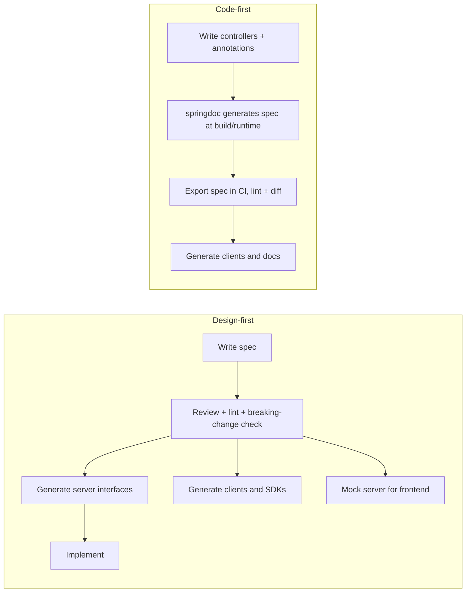
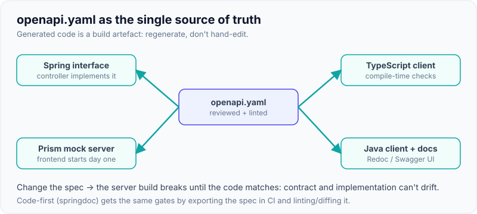

# OpenAPI & API-First Development

!!! abstract "Key takeaways"
    - **OpenAPI** is the standard, machine-readable description of an HTTP API: paths, operations, parameters, request/response schemas, status codes, security schemes. **3.1** (2021) aligned schemas with **JSON Schema 2020-12**; **3.2** (September 2025) added the `QUERY` method, streaming media types (SSE, JSON Lines) and hierarchical tags.
    - **Design-first (API-first):** write and review the spec *before* code, then generate server stubs, clients, mocks and docs from it. **Code-first:** annotate controllers and generate the spec (springdoc). Design-first suits public/partner and cross-team APIs; code-first is fine for small internal APIs, if the generated spec is still reviewed and checked.
    - Make the spec **enforced, not decorative**: generate Spring **interfaces** the controller must implement (`openapi-generator`, `interfaceOnly`), so contract drift is a compile error.
    - **Automate the gates in CI:** lint style rules (**Spectral**), fail on **breaking changes** between the main-branch spec and the PR spec (**oasdiff**), validate examples, and run contract or schema-conformance tests.
    - The spec is the hub: docs (Swagger UI, Redoc), typed SDKs (TypeScript, Java), mock servers (Prism) so frontends start early, gateway configuration, and the API inventory security teams need.

## Why it matters

Without a contract, an API's real definition is "whatever the code does today". Frontend teams wait for the backend, clients guess field types from examples, a refactor silently renames a field, and nobody notices until mobile crashes in production. An agreed, machine-checked contract turns API changes into reviewable diffs and lets teams work in parallel.

For a lead, API-first is also a **governance** tool: one style guide applied by a linter, one place to review naming and error formats, one inventory of every endpoint (OWASP API9 "improper inventory management" is about exactly this).

## Core concepts

### What a spec contains

```yaml
openapi: 3.1.0
info:
  title: Refill API
  version: 1.4.0                      # version of the document/API contract
paths:
  /refills:
    post:
      operationId: createRefill        # becomes the Java/TS method name
      parameters:
        - name: Idempotency-Key
          in: header
          required: true
          schema: { type: string, maxLength: 255 }
      requestBody:
        required: true
        content:
          application/json:
            schema: { $ref: '#/components/schemas/CreateRefillRequest' }
      responses:
        '201':
          description: Refill created
          headers:
            Location: { schema: { type: string, format: uri } }
          content:
            application/json:
              schema: { $ref: '#/components/schemas/Refill' }
        '422': { $ref: '#/components/responses/Problem' }
components:
  securitySchemes:
    oauth2:
      type: oauth2
      flows:
        clientCredentials:
          tokenUrl: https://idp.example-health.com/oauth2/token
          scopes: { refills:write: Create refills }
  schemas:
    CreateRefillRequest:
      type: object
      required: [prescriptionId, quantity]
      additionalProperties: false      # reject unknown input fields
      properties:
        prescriptionId: { type: string }
        quantity: { type: integer, minimum: 1, maximum: 90 }
    Refill:
      type: object
      required: [id, prescriptionId, quantity, status]
      properties:
        id: { type: string, examples: [rf_8Hk2Lm9Q] }
        status:
          type: string
          description: Clients must tolerate values added in future versions.
          enum: [REQUESTED, APPROVED, SHIPPED, CANCELLED]
```

| Part | Purpose |
|---|---|
| `info`, `servers` | Metadata, contact, base URLs per environment |
| `paths` → operations | Method, `operationId`, parameters (path, query, header, cookie), body, responses per status |
| `components.schemas` | Reusable data models (JSON Schema) |
| `components.responses`/`parameters` | Shared pieces such as the RFC 9457 problem response, pagination params |
| `securitySchemes` + `security` | OAuth2 flows and scopes, API keys, mTLS, bearer |
| `tags` | Grouping for docs (3.2 adds `parent` and `kind`) |
| `webhooks` (3.1+) | Callbacks your API sends to clients |

**Version differences interviewers ask about:**

- **Swagger 2.0 → OpenAPI 3.0 (2017):** renamed spec, `components`, `requestBody`, multiple servers, better content negotiation. "Swagger" now names the SmartBear tools (Swagger UI, Editor).
- **3.0 → 3.1 (2021):** schemas are full JSON Schema 2020-12 (`type: [string, "null"]` instead of `nullable: true`, `examples` arrays, `const`), `webhooks`, `paths` optional.
- **3.1 → 3.2 (September 2025):** `QUERY` HTTP method and arbitrary methods, streaming media types with `itemSchema` (SSE, JSON Lines), structured tags, OAuth2 device flow. Tool support is still catching up, so most teams generate 3.0 or 3.1 today.

### Design-first vs code-first


*Notice that both paths end with the same CI gates. The difference is when the contract is reviewed: before any code exists (design-first) or after (code-first).*

| | Design-first | Code-first |
|---|---|---|
| Contract reviewed | Before implementation, by consumers too | After implementation, often by nobody |
| Parallel work | Frontend uses a mock server from day one | Frontend waits for a running backend |
| Drift risk | Low if server interfaces are generated | Low (spec comes from code), but design quality varies |
| Effort | Learning OpenAPI, generator configuration | Annotations, less upfront work |
| Best for | Public, partner and cross-team APIs, platform style guides | Small internal services, prototypes |

### Generating code from the spec

- **Server side (Spring):** `openapi-generator` with the `spring` generator and `interfaceOnly=true` produces a `RefillsApi` interface with `@RequestMapping`, validation annotations and models. The controller `implements RefillsApi`; if someone changes the spec, the build breaks until the code matches.
- **Clients:** typed clients for TypeScript (`typescript-fetch`, `openapi-typescript`), Java (`java` with RestClient/WebClient libraries) and others. Mobile and SPA teams get compile-time checking against the contract.
- **Generated code is a build artefact:** regenerate in the build, don't hand-edit it, don't commit it (or commit and check it is up to date).

{ loading=lazy }
*Notice every arrow points away from the spec: nothing is hand-written twice, so nothing can drift.*

### Code-first with springdoc

`springdoc-openapi` reads Spring MVC mappings, Bean Validation constraints and annotations (`@Operation`, `@Schema`, `@ApiResponse`) and serves the spec at `/v3/api-docs` with Swagger UI at `/swagger-ui.html`. Version 2.x targets Spring Boot 3 (version 3.x targets Boot 4). In CI, start the app or use the Maven/Gradle plugin to export the spec, then lint and diff it like a hand-written one. Disable the UI and docs endpoints in production unless you mean to publish them.

### Making the contract trustworthy

| Gate | Tool examples | Catches |
|---|---|---|
| Style and consistency lint | **Spectral** (with a company ruleset), Redocly CLI, Zalando's Zally | camelCase fields, plural paths, problem+json errors, `operationId` present, security on every operation |
| Breaking-change detection | **oasdiff**, openapi-diff | Removed endpoints, new required inputs, tightened validation, changed types |
| Example validation | Spectral, Redocly | Examples that don't match their schema |
| Conformance tests | Schemathesis (property-based fuzzing from the spec), contract tests, `swagger-request-validator` in integration tests | Implementation returns something the spec doesn't allow |
| Mocking | Prism, WireMock with OpenAPI | Lets consumers build and test before the server exists |

**Real run while writing this page:** Spectral's built-in `spectral:oas` ruleset flagged 5 warnings on the sample spec (missing `contact`, missing operation descriptions, tags not declared globally). `oasdiff breaking` on a revised spec reported `request-property-became-required` (new required `pharmacyId`) and `request-property-max-decreased` (quantity maximum 90 → 30) as **errors**, and exited non-zero with `--fail-on ERR`. It did **not** flag removing the optional response field `createdAt`, a reminder that tools catch the mechanical cases, while consumer-driven contract tests catch "a client actually reads that field".

{ loading=lazy }
*Watch PR 2 stop at the second gate: the breaking change is caught in review, before any client sees it.*

## In practice: code & configuration

=== "❌ Common mistake"
    ```java
    // Spec written once by hand for a design review, then never updated.
    // The controller drifted: field renamed, new required param, different error shape.
    @PostMapping("/refills")
    RefillDto create(@RequestParam String pharmacy,          // not in the spec
                     @RequestBody Map<String, Object> body) { // untyped: no schema, no validation
        ...
    }
    // Swagger UI is public in production and the spec lists internal admin endpoints.
    ```

=== "✅ Correct approach"
    ```xml
    <!-- pom.xml: generate Spring interfaces from the reviewed spec on every build -->
    <plugin>
      <groupId>org.openapitools</groupId>
      <artifactId>openapi-generator-maven-plugin</artifactId>
      <version>7.14.0</version>
      <executions>
        <execution>
          <goals><goal>generate</goal></goals>
          <configuration>
            <inputSpec>${project.basedir}/src/main/resources/refills.yaml</inputSpec>
            <generatorName>spring</generatorName>
            <apiPackage>com.examplehealth.refills.api</apiPackage>
            <modelPackage>com.examplehealth.refills.model</modelPackage>
            <configOptions>
              <interfaceOnly>true</interfaceOnly>          <!-- we write the controller -->
              <useSpringBoot3>true</useSpringBoot3>        <!-- jakarta.* imports -->
              <useTags>true</useTags>                      <!-- one interface per tag -->
              <openApiNullable>false</openApiNullable>
              <skipDefaultInterface>true</skipDefaultInterface>
            </configOptions>
          </configuration>
        </execution>
      </executions>
    </plugin>
    ```

    ```java
    @RestController
    class RefillsController implements RefillsApi {       // compile error if the contract changes

        private final RefillService service;

        RefillsController(RefillService service) { this.service = service; }

        @Override
        public ResponseEntity<Refill> createRefill(String idempotencyKey, CreateRefillRequest req) {
            Refill created = service.create(idempotencyKey, req);
            return ResponseEntity.created(URI.create("/refills/" + created.getId())).body(created);
        }

        @Override
        public ResponseEntity<Refill> getRefill(String refillId) {
            return ResponseEntity.ok(service.get(refillId));
        }
    }
    ```

    ```yaml
    # CI (GitHub Actions / GitLab CI equivalent): lint and block breaking changes on every PR
    - run: npx @stoplight/spectral-cli lint api/refills.yaml --ruleset .spectral.yaml --fail-severity error
    - run: git show origin/main:api/refills.yaml > /tmp/base.yaml
    - run: oasdiff breaking /tmp/base.yaml api/refills.yaml --fail-on ERR
    ```

The generator and controller above were compiled while writing this page (openapi-generator 7.14.0, Spring Boot 3.5): the generated `RefillsApi` interface carries the mappings, the `oauth2` security requirement and both `application/json` and `application/problem+json` response types.

**A company Spectral ruleset** encodes the style guide so reviews focus on design, not naming. These three rules were tested on a deliberately broken spec and caught a camelCase path and a `404` returning `application/json` instead of problem JSON:

```yaml
# .spectral.yaml
extends: ["spectral:oas"]
rules:
  paths-kebab-case:
    description: Path segments must be kebab-case
    severity: error
    given: "$.paths[*]~"
    then:
      function: pattern
      functionOptions: { match: "^(/([a-z0-9-]+|\\{[a-zA-Z]+\\}))+$" }
  error-responses-use-problem-json:
    description: 4xx/5xx responses must use application/problem+json
    severity: error
    given: "$.paths[*][*].responses[?(@property >= '400')].content"
    then:
      field: "application/problem+json"
      function: truthy
  global-security-defined:
    description: The API must declare a default security requirement (operations may override it)
    severity: error
    given: "$"
    then: { field: security, function: defined }
```

## Real-world usage

- **Stripe, GitHub, Twilio** publish their OpenAPI specs openly and generate SDKs and docs from them. GitHub's spec is the source for Octokit types.
- **Zalando** made API-first a company rule: every API is reviewed as an OpenAPI spec against their public RESTful API Guidelines, checked by the Zally linter.
- **Microsoft Azure** generates its SDKs for many languages from OpenAPI/TypeSpec definitions; TypeSpec is an emerging higher-level language that compiles to OpenAPI.
- **AWS API Gateway** can import an OpenAPI spec (with `x-amazon-apigateway-*` extensions) to create routes, validators and integrations.
- **Healthcare:** FHIR servers describe their capabilities with a `CapabilityStatement`, and many also publish OpenAPI for developer portals; payers exposing CMS-mandated APIs commonly do this.
- **Failure mode:** a team generated clients from a spec that no longer matched the server; the generated mobile client crashed on an undocumented `null`. Contract conformance tests in the server's pipeline would have caught it.

## Trade-offs & production gotchas

| Option | Pros | Cons | Use when |
|---|---|---|---|
| Design-first + generated interfaces | Reviewed contract, no drift, parallel work | Generator learning curve, less flexible code | Cross-team, public, partner APIs |
| Code-first + springdoc | Fast, spec always matches code | Design reviewed late; annotations clutter controllers | Small internal APIs, prototypes |
| Generated clients | Type safety, consistency | Generated code style, version pinning | Many consumers or languages |
| Hand-written clients | Idiomatic, tailored | Drift, duplicated effort | One consumer, tiny APIs |
| Spec in the service repo | Changes reviewed with code | Harder to find across the company | Default; publish to a portal/registry |
| Central API registry | Inventory, discovery, governance | Process overhead | Platforms with many teams |

!!! warning "Gotcha: generators are opinionated"
    Watch nullability (`openApiNullable` wraps fields in `JsonNullable`), date types, `oneOf`/`anyOf` support (uneven across generators), enum handling (unknown values may throw unless configured) and Jakarta vs javax imports (`useSpringBoot3`). Pin the generator version and review generated diffs when upgrading.

!!! warning "Gotcha: publishing internal endpoints"
    A springdoc spec or Swagger UI exposed in production lists every endpoint, including admin and internal ones, which helps attackers map the API. Disable it in production or protect it, and use groups to publish only public operations.

!!! tip "Treat the spec version like a contract version"
    `info.version` should follow semantic versioning of the contract: patch for docs fixes, minor for additive changes, major only for breaking ones (which oasdiff should have forced you to acknowledge).

## How this connects to my experience

- **Where I used it:** not ★. Every role involved REST APIs with Spring Boot (Coriolis CCKM, Deloitte AWS services behind API Gateway), and at OptumRx I "established engineering standards around testing, CI/CD, code quality, and deployment practices", where contract checks belong. The GraphQL layer at OptumRx is schema-first by nature, the GraphQL equivalent of API-first.
- **Talking points:**
    - "With five upstream teams, the contract was the coordination point. Upstream specs let us generate or validate clients and mock upstreams in tests." *[confirm whether upstreams published OpenAPI]*
    - "I'd put Spectral and oasdiff in the pipeline: style issues fail fast and breaking changes need an explicit decision."
    - "For the React application, generating TypeScript types from the API contract removes a whole class of runtime errors." *[confirm what you used]*
- **Likely follow-up chain:** "Design-first or code-first?" → reasons and audience → "How do you keep spec and code in sync?" (generated interfaces or exported spec) → "How do you stop breaking changes?" (oasdiff in CI, contract tests) → "What's new in 3.1/3.2?".

## Interview questions

### Fundamentals

??? question "Q1. What is OpenAPI, and how is it different from Swagger?"
    **Answer:** OpenAPI is the vendor-neutral specification (Linux Foundation's OpenAPI Initiative) for describing HTTP APIs in YAML or JSON. Swagger was the original name up to version 2.0; it now refers to SmartBear's tools (Swagger UI, Swagger Editor, Codegen) that work with OpenAPI documents.

    **Interviewer listens for:** spec vs tools, the rename at 3.0.

    **Common wrong answer:** "Swagger is the new version of OpenAPI."

??? question "Q2. What does an OpenAPI document describe?"
    **Answer:** Servers, paths and operations (method, `operationId`), parameters (path, query, header, cookie), request bodies, responses per status code with schemas and headers, reusable components (schemas, responses, parameters), security schemes and requirements, tags and, since 3.1, webhooks.

    **Interviewer listens for:** operations, schemas, responses per status, security schemes, components.

    **Common wrong answer:** "It's documentation for humans." It's machine-readable and drives tooling.

??? question "Q3. Design-first vs code-first?"
    **Answer:** Design-first writes and reviews the spec before code, then generates server interfaces, clients, mocks and docs; consumers review the contract early and work in parallel. Code-first writes controllers and generates the spec from code (springdoc); it's quicker for small internal APIs but the design is reviewed late. Both need CI checks on the resulting spec.

    **Interviewer listens for:** when the contract is reviewed, parallel work, suitable contexts.

    **Common wrong answer:** "Code-first is always better because the spec can't be out of date." Up to date doesn't mean well designed.

??? question "Q4. What changed in OpenAPI 3.1 and 3.2?"
    **Answer:** 3.1 (2021) aligned schemas fully with JSON Schema 2020-12 (`type: [string, "null"]` replaces `nullable`, `examples`, `const`) and added `webhooks`. 3.2 (September 2025) added the `QUERY` method and arbitrary methods, streaming media types with `itemSchema` (SSE, JSON Lines), structured tags (`parent`, `kind`) and the OAuth2 device flow.

    **Interviewer listens for:** JSON Schema alignment, nullable change, webhooks, 3.2 highlights.

    **Common wrong answer:** "3.1 is just bug fixes."

### Intermediate

??? question "Q5. How do you keep a Spring Boot implementation in sync with a hand-written spec?"
    **Answer:** Generate Spring interfaces (`openapi-generator` spring generator, `interfaceOnly=true`) from the spec on every build and make controllers implement them, so any mismatch is a compile error. Add conformance tests (validate real responses against the spec, or Schemathesis fuzzing) for behaviour the types don't capture, such as status codes.

    **Interviewer listens for:** generated interfaces, compile-time drift detection, response validation tests.

    **Common wrong answer:** "Developers update the YAML when they change code."

??? question "Q6. How do you detect breaking changes automatically?"
    **Answer:** Diff the spec on the main branch against the PR's spec with a tool such as oasdiff (`oasdiff breaking base.yaml rev.yaml --fail-on ERR`), failing the build on removed operations, new required inputs, tightened validation or changed types. Complement it with consumer-driven contract tests, because tools can't know which optional fields clients really use.

    **Interviewer listens for:** spec diff in CI, failing the build, limits of tooling, contract tests.

    **Common wrong answer:** "Code review catches breaking changes."

??? question "Q7. What is API linting and what rules would you enforce?"
    **Answer:** Automated checks of the spec against a style guide, typically Spectral with a company ruleset: kebab-case plural paths, camelCase properties, `operationId` on every operation, security defined, error responses as `application/problem+json`, pagination parameters named consistently, descriptions present, no unused components. It turns style debates into CI results.

    **Interviewer listens for:** concrete rules, Spectral, consistency at scale.

    **Common wrong answer:** "Linting is for code, not APIs."

??? question "Q8. How do mock servers help API-first development?"
    **Answer:** Tools like Prism serve responses from the spec's examples and schemas, so frontend and mobile teams can build and test against the agreed contract before the backend exists, and backend tests can stub upstreams consistently. Prism can also validate requests against the spec, catching client mistakes early.

    **Interviewer listens for:** parallel development, example-driven responses, request validation.

    **Common wrong answer:** "Mocks are only for unit tests."

### Senior

??? question "Q9. How would you introduce API-first across 20 teams?"
    **Answer:** Publish a style guide and encode it as a Spectral ruleset; provide templates (problem responses, pagination, security) and a generator configuration; put spec linting, breaking-change checks and spec publishing to a portal in the shared CI pipeline; run lightweight API design reviews for new or public APIs; and measure adoption (specs in the registry, lint pass rate). Start with new APIs and high-traffic ones rather than forcing a rewrite.

    **Interviewer listens for:** guide + automation + templates + review + incremental rollout.

    **Common wrong answer:** "Mandate that every team writes OpenAPI by next quarter."

??? question "Q10. What are the pitfalls of code generation?"
    **Answer:** Generators are opinionated: nullability wrappers, date and decimal types, weak `oneOf` support, enums that throw on unknown values, naming quirks, and javax/jakarta differences. Generated code can tempt people to edit it. Mitigate by pinning versions, configuring options deliberately, never editing generated sources, reviewing diffs on upgrades and keeping schemas simple.

    **Interviewer listens for:** concrete pitfalls, enum risk, version pinning, no hand edits.

    **Common wrong answer:** "Generated code is always correct."

??? question "Q11. How does OpenAPI support API security and governance?"
    **Answer:** It declares security schemes and per-operation requirements (scopes), so reviews and linters can catch unsecured operations; it gives an inventory of every endpoint (OWASP API9); gateways can import it to create routes and request validation; and fuzzers like Schemathesis use it to test for crashes and validation gaps. Keep internal operations out of published specs.

    **Interviewer listens for:** security requirements, inventory, gateway validation, fuzzing.

    **Common wrong answer:** "Security isn't part of the spec."

### Scenario-based

??? question "Q12. The mobile app crashed because the API started returning null for a field the spec says is always present. How do you prevent a repeat?"
    **Answer:** The implementation broke the contract and nothing checked it. Add response validation against the spec in integration tests (or a validating filter in non-production), property-based tests with Schemathesis, and generated server interfaces with `required` fields enforced in DTOs. If the field can genuinely be null, change the spec (a breaking change for clients assuming non-null) through the normal process.

    **Interviewer listens for:** conformance testing, generated types, treating the spec change as breaking.

    **Common wrong answer:** "Tell the mobile team to null-check everything."

??? question "Q13. The frontend team is blocked waiting for a new backend API. How do you unblock them?"
    **Answer:** Agree the OpenAPI spec first (a short design review with them), lint it, then run a Prism mock from the spec so they build against realistic responses and error cases. Generate a typed TypeScript client from the same spec. The backend implements the generated interface; when it's ready, the frontend switches the base URL.

    **Interviewer listens for:** spec as the shared agreement, mock server, generated client, parallel work.

    **Common wrong answer:** "Have the frontend hard-code sample JSON until the backend is done."

??? question "Q14. A PR renames a response field. oasdiff fails the build. The developer says it's a typo fix. What do you do?"
    **Answer:** A rename is breaking for any client that reads the field, typo or not. Options: keep the old field and add the correctly named one (deprecate the old, remove after usage drops), or, if usage data proves no consumer reads it (contract tests, telemetry), approve the break explicitly with a documented exception. The point of the gate is a conscious decision, not a silent change.

    **Interviewer listens for:** breaking regardless of intent, additive alternative, evidence-based exceptions.

    **Common wrong answer:** "Disable the check for this PR."

## Cheat sheet

| Concept | Remember |
|---|---|
| OpenAPI | Machine-readable HTTP API contract; Swagger = tools |
| 3.1 | JSON Schema 2020-12, `type: [x, "null"]`, webhooks |
| 3.2 (Sep 2025) | `QUERY` method, streaming (`itemSchema`), structured tags |
| Design-first | Spec → review → generate interfaces, clients, mocks, docs |
| Code-first | Controllers → springdoc `/v3/api-docs` → export, lint, diff |
| No drift | `openapi-generator` spring, `interfaceOnly=true`, controller `implements` |
| CI gates | Spectral lint, oasdiff `--fail-on ERR`, example validation, Schemathesis |
| Tooling limits | Diff tools miss "optional field a client relies on" → contract tests |
| Generators | Pin versions; watch nullability, enums, `oneOf`, jakarta |
| Security | Declare schemes/scopes per operation; don't publish internal endpoints |

## Sources
1. [OpenAPI Specification v3.1.0](https://spec.openapis.org/oas/v3.1.0) and [v3.2.0](https://spec.openapis.org/oas/v3.2.0).
2. [OpenAPI Initiative: Announcing OpenAPI v3.2](https://www.openapis.org/blog/2025/09/23/announcing-openapi-v3-2).
3. [OpenAPI Generator: Spring generator options](https://openapi-generator.tech/docs/generators/spring/).
4. [springdoc-openapi documentation](https://springdoc.org/).
5. [Stoplight Spectral](https://docs.stoplight.io/docs/spectral/674b27b261c3c-overview) and [built-in OAS ruleset](https://docs.stoplight.io/docs/spectral/4dec24461f3af-open-api-rules).
6. [oasdiff: breaking changes](https://github.com/oasdiff/oasdiff/blob/main/docs/BREAKING-CHANGES.md).
7. [Prism mock server](https://docs.stoplight.io/docs/prism/674b27b261c3c-prism-overview) and [Schemathesis](https://schemathesis.readthedocs.io/).
8. [Zalando RESTful API Guidelines: API first](https://opensource.zalando.com/restful-api-guidelines/#api-first).
9. [OWASP API9:2023 Improper Inventory Management](https://owasp.org/API-Security/editions/2023/en/0xa9-improper-inventory-management/).
10. Generator, Spectral and oasdiff runs on this page: openapi-generator 7.14.0, Spectral CLI 6, oasdiff (latest), Spring Boot 3.5, run while writing this page.
