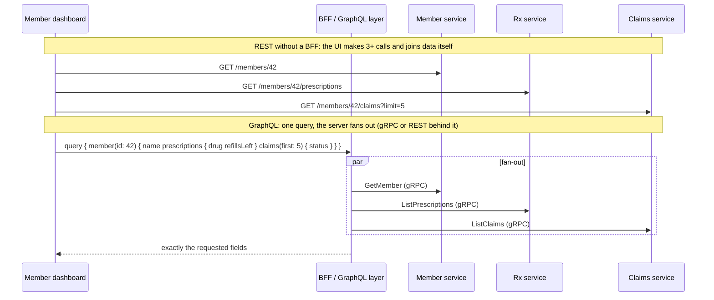
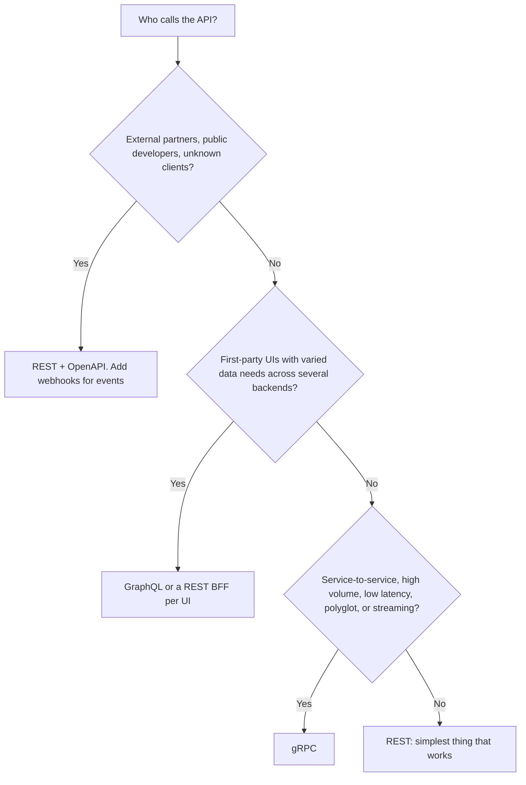

# REST vs GraphQL vs gRPC

!!! abstract "Key takeaways"
    - **REST:** resources over HTTP with standard methods and status codes. Universal, cacheable by any HTTP cache, easy to secure at a gateway, the default for **public and partner APIs**. Weakness: fixed response shapes, so UIs over-fetch or make many calls.
    - **GraphQL:** one endpoint, a typed schema, and **clients choose exactly the fields** they need, across many backends in one round trip. Great as a **BFF / aggregation layer for UIs**. Costs: harder HTTP caching, N+1 resolver problems (DataLoader), query-cost limits for security, everything returns `200` with an `errors` array.
    - **gRPC:** **contract-first RPC** with Protocol Buffers over **HTTP/2**: compact binary messages, generated typed clients in many languages, **deadlines**, four call types including **bidirectional streaming**. Best for **internal service-to-service** calls with high volume or low latency. Weak in browsers (needs gRPC-Web or a gateway) and not human-readable.
    - They are complementary: a common architecture is **gRPC between services, GraphQL (or a REST BFF) for first-party UIs, REST for partners and public clients**.
    - Choose by **consumer and constraints**, not fashion: who calls it, over what network, how much shaping they need, caching, streaming, team skills and tooling.

## Why it matters

"Why GraphQL and not REST?" and "Would you use gRPC here?" are standard design questions, and they are traps for one-sided answers. Each style moves complexity somewhere: GraphQL moves query shaping to the client and cost control to the server; gRPC moves you to binary contracts and HTTP/2 infrastructure; REST keeps things simple but pushes aggregation onto clients or a BFF.

This is a resume topic: the OptumRx **GraphQL Consumer Service** sits between five upstream systems (mostly REST) and multiple consumers. Expect to defend that choice and explain what you would do differently.

## Core concepts

### Side-by-side comparison

| Dimension | REST | GraphQL | gRPC |
|---|---|---|---|
| Model | Resources + HTTP methods | Typed graph; queries, mutations, subscriptions | Services + RPC methods |
| Contract | OpenAPI (optional, often added later) | Schema (SDL), mandatory, introspectable | `.proto` files, mandatory, code generated |
| Transport | HTTP/1.1 or HTTP/2, usually JSON | HTTP (usually `POST /graphql`), JSON; WebSocket/SSE for subscriptions | HTTP/2 (frames, multiplexing), binary Protobuf |
| Data shaping | Server decides the shape | Client selects fields; nested data in one request | Server decides (message types) |
| Round trips for a complex screen | Often several (or a BFF) | One | Several, or a purpose-built RPC |
| HTTP caching | Excellent (`GET`, `ETag`, CDN) | Hard (POST, one URL); needs persisted queries + GET or client caches | None at HTTP level; application caching |
| Streaming | SSE, chunked responses, WebSockets alongside | Subscriptions | Native: server, client and bidirectional streaming |
| Errors | HTTP status codes + problem details | `200` with `errors[]` (partial data possible) | gRPC status codes (`NOT_FOUND`, `DEADLINE_EXCEEDED`…) + details |
| Browser support | Native | Native (it's HTTP + JSON) | Needs gRPC-Web/Connect proxy or transcoding |
| Payload size/speed | Text JSON | Text JSON | Compact binary; fast (de)serialisation |
| Versioning | Path/header versions or additive | No versions: add fields, `@deprecated` | Package versions (`v1`), additive fields, never reuse field numbers |
| Gateways, WAF, tooling | Universal | Good and growing (Apollo, GraphOS, Hive) | Good in meshes (Envoy, Istio); weaker in classic API gateways |
| Typical home | Public/partner APIs, CRUD services | UI aggregation (BFF), many clients with different needs | Internal microservice calls, mobile with tight bandwidth, streaming |

### How each one handles the same screen


*Notice where the aggregation happens. GraphQL and BFFs move the joining from the device (slow network, battery) to the data centre (fast network), and the internal calls can use whichever protocol suits services best.*

### REST in brief

Covered in depth in [REST principles](01-rest-principles-resource-modelling-and-http-semantics.md). Its superpowers are **HTTP itself**: caching with `ETag`/CDNs, idempotent methods that infrastructure can retry, status codes every tool understands, and zero client tooling requirements. Its weakness for rich UIs is **over-fetching** (the claim resource has 40 fields; the list needs 3) and **under-fetching** (the screen needs 4 resources). Sparse fieldsets (`?fields=`), embedded resources (`?expand=`) and BFFs are REST's answers.

### GraphQL in brief

Covered in the [GraphQL topic](../graphql/01-graphql-fundamentals-vs-rest-schema-types-queries-mutations.md). Key trade-offs to name in an interview:

- **Pros:** clients fetch exactly what they need in one round trip; strongly typed, introspectable schema; evolves without versions; one graph over many backends (federation).
- **Cons:** **N+1** resolver calls unless batched with DataLoader; **query cost** must be limited (depth, complexity, timeouts) or one query can take the system down; **HTTP caching** is hard; **errors** don't map to status codes; file uploads and streaming are awkward; observability needs per-resolver tracing.

### gRPC in brief

gRPC (open-sourced by Google in 2015, now a CNCF project) generates client and server code from a `.proto` contract.

```protobuf
syntax = "proto3";

package examplehealth.refills.v1;                 // version in the package: v1, v2 side by side

option java_multiple_files = true;
option java_package = "com.examplehealth.refills.v1";

service RefillService {
  rpc GetRefill(GetRefillRequest) returns (Refill);                       // unary
  rpc WatchRefill(GetRefillRequest) returns (stream RefillStatusEvent);   // server streaming
}

message GetRefillRequest {
  string refill_id = 1;
}

message Refill {
  string id = 1;
  string prescription_id = 2;
  int32 quantity = 3;
  RefillStatus status = 4;
  reserved 5;                                     // was "pharmacy_name": never reuse a field number
}

enum RefillStatus {
  REFILL_STATUS_UNSPECIFIED = 0;                  // proto3: first value must be zero, used as default
  REFILL_STATUS_REQUESTED = 1;
  REFILL_STATUS_APPROVED = 2;
  REFILL_STATUS_SHIPPED = 3;
}

message RefillStatusEvent {
  string refill_id = 1;
  RefillStatus status = 2;
}
```

- **Four call types:** unary, server streaming, client streaming, bidirectional streaming, all over one HTTP/2 connection with multiplexed streams.
- **Field numbers are the contract**, not names. Adding fields is safe; removing a field means marking its number `reserved`; changing a number or type breaks the wire format. Unknown fields are preserved, so old clients tolerate new fields.
- **Deadlines** (not just timeouts) propagate across hops: a client sets "must finish within 300 ms" and every downstream call inherits the remaining budget. Servers can check `Context.current().isCancelled()`.
- **Status codes:** `OK`, `INVALID_ARGUMENT`, `NOT_FOUND`, `ALREADY_EXISTS`, `PERMISSION_DENIED`, `UNAUTHENTICATED`, `RESOURCE_EXHAUSTED`, `FAILED_PRECONDITION`, `UNAVAILABLE` (retryable), `DEADLINE_EXCEEDED`, `INTERNAL`… Richer error details via `google.rpc.Status`.
- **Load balancing gotcha:** HTTP/2 keeps one long-lived connection, so an L4 load balancer (or a Kubernetes `ClusterIP` Service) pins each client to one pod. Use L7 balancing (Envoy, a service mesh, or client-side balancing with a headless Service).
- **Browsers:** can't speak raw gRPC (no control over HTTP/2 frames and trailers). Use **gRPC-Web** via Envoy, **Connect** protocol, or **gRPC-JSON transcoding** (Envoy, Google API HTTP annotations) to expose the same service as REST.

**Tested while writing this page** (grpc-java 1.73, protobuf 4.31, in-process server): the unary call returned `REFILL_STATUS_APPROVED`; the server stream delivered `REQUESTED → APPROVED → SHIPPED`; a missing id returned status `NOT_FOUND`. The `Refill` message serialised to **20 bytes** in Protobuf versus **75 bytes** as compact JSON with the same values, which shows why gRPC is attractive for high-volume internal traffic.

### Decision guide


*Notice that the first question is about the consumer, not the technology. Many systems legitimately end up with all three, each at the boundary it suits.*

## In practice: code & configuration

=== "❌ Common mistake"
    ```text
    "Let's use GraphQL everywhere": public partner API, service-to-service calls and file
    downloads all through one GraphQL endpoint. Result: partners can't cache, gateways can't
    rate-limit per operation, internal calls pay JSON + resolver overhead, and one expensive
    query from a partner slows every UI.

    "Let's use gRPC everywhere": the React app needs a proxy for every call, the public API
    is unusable without generated clients, and support staff can't curl anything.
    ```

=== "✅ Correct approach"
    ```java
    // gRPC service implementation (grpc-java). Same contract can be exposed to browsers via
    // gRPC-Web or JSON transcoding at the edge if needed.
    public class RefillGrpcService extends RefillServiceGrpc.RefillServiceImplBase {

        @Override
        public void getRefill(GetRefillRequest req, StreamObserver<Refill> out) {
            if (!req.getRefillId().startsWith("rf_")) {
                out.onError(Status.INVALID_ARGUMENT                     // maps to HTTP 400 in transcoding
                        .withDescription("refill_id must start with rf_").asRuntimeException());
                return;
            }
            if (req.getRefillId().equals("rf_missing")) {
                out.onError(Status.NOT_FOUND.withDescription("refill not found").asRuntimeException());
                return;
            }
            out.onNext(Refill.newBuilder()
                    .setId(req.getRefillId())
                    .setPrescriptionId("rx_9f2")
                    .setQuantity(30)
                    .setStatus(RefillStatus.REFILL_STATUS_APPROVED)
                    .build());
            out.onCompleted();
        }

        @Override
        public void watchRefill(GetRefillRequest req, StreamObserver<RefillStatusEvent> out) {
            for (RefillStatus s : new RefillStatus[]{RefillStatus.REFILL_STATUS_REQUESTED,
                    RefillStatus.REFILL_STATUS_APPROVED, RefillStatus.REFILL_STATUS_SHIPPED}) {
                out.onNext(RefillStatusEvent.newBuilder().setRefillId(req.getRefillId()).setStatus(s).build());
            }
            out.onCompleted();                                          // server streaming: many messages, one call
        }
    }

    // Client: always set a deadline; it propagates to downstream calls made inside the server.
    RefillServiceGrpc.RefillServiceBlockingStub stub =
            RefillServiceGrpc.newBlockingStub(channel).withDeadlineAfter(300, TimeUnit.MILLISECONDS);
    Refill refill = stub.getRefill(GetRefillRequest.newBuilder().setRefillId("rf_123").build());
    ```

**Spring options:** Spring for GraphQL (`@QueryMapping`, `@SchemaMapping`, `@BatchMapping`) for GraphQL; **Spring gRPC** (the Spring project that auto-configures grpc-java servers and clients) or the community `grpc-spring` starter for gRPC; Spring MVC/WebFlux for REST.

## Real-world usage

- **REST:** Stripe, Twilio, AWS service APIs (many are REST/JSON), GitHub REST, and almost every public API, because any language and tool can call it.
- **GraphQL:** GitHub's v4 API, Shopify's Storefront and Admin APIs, Netflix (federated GraphQL for studio and consumer apps), Airbnb and many others use it as the **client-facing aggregation layer**.
- **gRPC:** Google internally (Stubby, its predecessor), Netflix and Square for service-to-service calls, Kubernetes components (CRI, CSI), etcd's API, Envoy's xDS control plane, and most cloud provider SDK transports for some services.
- **Combinations:** Netflix's studio stack uses GraphQL federation at the edge with gRPC and REST services behind it; many fintechs expose REST to partners while using gRPC internally.
- **Healthcare:** clinical data exchange standardises on REST (FHIR), so external interfaces are REST; internally, GraphQL BFFs over FHIR or claims services are common for member and clinician portals.

## Trade-offs & production gotchas

| Option | Pros | Cons | Use when |
|---|---|---|---|
| REST | Universal, cacheable, simple to secure and debug | Over/under-fetching, many round trips for rich UIs | Public/partner APIs, CRUD, cacheable reads |
| GraphQL | Client-shaped data, one round trip, typed schema, no versioning | N+1, cost control, caching, 200-with-errors, ops tooling | UI aggregation across services, many client types |
| gRPC | Fast, compact, typed, streaming, deadlines, polyglot codegen | Browser support, binary debugging, L7 LB needed, gateway support | Internal high-volume calls, streaming, mobile with tight bandwidth |
| REST BFF per UI | Simple, cacheable, tailored | One BFF per client type to maintain | Few client types, simple aggregation |

!!! warning "Gotcha: GraphQL in front of slow REST upstreams"
    GraphQL makes the *client* call cheaper, but the server still pays for every upstream call. Without batching, caching and timeouts per upstream, one nested query fans out into hundreds of REST calls. See [N+1 and DataLoader](../graphql/04-n-plus-1-problem-and-dataloader-batching.md).

!!! warning "Gotcha: gRPC behind an L4 load balancer"
    Because HTTP/2 multiplexes all calls over one connection, a Kubernetes `ClusterIP` Service balances *connections*, not requests. One pod gets all of a client's traffic. Use a mesh (Envoy/Istio), an L7 ingress, or client-side `round_robin` with a headless Service, plus connection max-age.

!!! tip "Interview framing"
    Don't pick a winner. Say which consumer each style serves best, what it costs, and how you'd mitigate the cost (DataLoader and query cost limits for GraphQL, L7 balancing and transcoding for gRPC, BFFs or sparse fieldsets for REST).

## How this connects to my experience

- **Where I used it:** ★ "Owned the GraphQL Consumer Service end-to-end, acting as the integration layer between 5 upstream systems and multiple downstream consumers" and "Built the ReactJS application from the ground up" (OptumRx). REST APIs at Coriolis (CCKM) and behind AWS API Gateway at Deloitte. gRPC isn't on the resume: position it as knowledge, not experience.
- **Talking points:**
    - "GraphQL fit because several UIs needed different slices of the same member, prescription and claims data from five upstreams. One query per screen replaced several REST calls from the browser, and the schema gave the frontend a typed contract."
    - "The costs were real: we batched upstream calls with DataLoader, set timeouts and circuit breakers per upstream, returned partial data with errors, cached reference data in Redis, and limited query depth/complexity." *[confirm each mechanism]*
    - "Partners and external systems stayed on REST, because they need cacheable, standard HTTP. If our upstreams had been internal and latency-critical, gRPC between the GraphQL layer and them would have been worth evaluating."
- **Likely follow-up chain:** "Why GraphQL over REST?" → consumer variety, aggregation, typed schema → "What problems did it bring?" (N+1, caching, cost limits, error handling) → "Would you use gRPC?" (internal calls, deadlines, streaming; browser and LB caveats) → "What would you do differently today?" (persisted queries, federation if more teams own subgraphs). *[confirm your honest retrospective]*

## Interview questions

### Fundamentals

??? question "Q1. What are the main differences between REST, GraphQL and gRPC?"
    **Answer:** REST exposes resources over HTTP with standard methods and status codes, usually JSON, and is cache-friendly. GraphQL exposes a typed schema at one endpoint where clients choose the fields they need, aggregating many sources in one round trip. gRPC is contract-first RPC with Protocol Buffers over HTTP/2, with generated clients, deadlines and streaming. REST suits public APIs, GraphQL suits UI aggregation, gRPC suits internal service calls.

    **Interviewer listens for:** model, transport, contract, data shaping, and a typical use for each.

    **Common wrong answer:** "GraphQL and gRPC are replacements for REST." They solve different problems.

??? question "Q2. What problem does GraphQL solve compared with REST?"
    **Answer:** Over-fetching (REST returns fixed shapes with fields the client doesn't need) and under-fetching (a screen needs several resources, so several round trips). GraphQL lets the client ask for exactly the fields it needs across related types in one request, against a typed schema.

    **Interviewer listens for:** over- and under-fetching, one round trip, typed schema.

    **Common wrong answer:** "GraphQL is faster than REST." The server still does the work; only the client round trips improve.

??? question "Q3. Why is gRPC efficient?"
    **Answer:** Binary Protocol Buffers are compact and quick to parse (a sample message was 20 bytes vs 75 as JSON); HTTP/2 multiplexes many calls over one connection with header compression; code generation avoids reflection-heavy mapping; and streaming avoids repeated request overhead. Deadlines also stop wasted work when callers have given up.

    **Interviewer listens for:** Protobuf, HTTP/2 multiplexing, codegen, streaming, deadlines.

    **Common wrong answer:** "Because it uses UDP." It runs over TCP (HTTP/2).

??? question "Q4. Why is HTTP caching harder with GraphQL?"
    **Answer:** Queries are usually `POST`s to one URL with the query in the body, so URL-keyed HTTP caches and CDNs can't cache them, and each query asks for a different shape. Workarounds: persisted queries sent as `GET` with an id, response cache hints, and normalised client caches (Apollo, Relay).

    **Interviewer listens for:** POST + single URL, varying shapes, persisted queries, client caches.

    **Common wrong answer:** "GraphQL can't be cached at all."

### Intermediate

??? question "Q5. When would you choose gRPC over REST for service-to-service calls?"
    **Answer:** High-volume or latency-sensitive internal calls, polyglot teams that benefit from generated typed clients, streaming needs (status updates, telemetry, bidirectional flows), and when deadline propagation matters. Stay with REST when callers are external, need HTTP caching, or the team lacks HTTP/2-aware infrastructure (L7 load balancing, observability).

    **Interviewer listens for:** concrete criteria both ways, infrastructure prerequisites.

    **Common wrong answer:** "Always, because it's faster."

??? question "Q6. How do errors differ across the three styles?"
    **Answer:** REST uses HTTP status codes plus a body (ideally RFC 9457 problem details). GraphQL usually returns HTTP `200` with `data` (possibly partial) and an `errors` array with paths and extensions, so clients and monitoring must inspect the body. gRPC uses its own status codes (`NOT_FOUND`, `UNAVAILABLE`, `DEADLINE_EXCEEDED`…) with optional rich details; transcoding maps them to HTTP codes.

    **Interviewer listens for:** status codes vs errors array vs gRPC codes, partial data, monitoring impact.

    **Common wrong answer:** "GraphQL returns 500 when a resolver fails."

??? question "Q7. How do you evolve a gRPC contract safely?"
    **Answer:** Add new fields with new numbers (old clients ignore them); never change a field's number or type; when removing a field, mark its number and name `reserved`; don't rely on enum values beyond those you know, and keep a zero `UNSPECIFIED` default; for a truly breaking change, create a new package version (`refills.v2`) and run both. Use breaking-change linters such as `buf breaking`.

    **Interviewer listens for:** field numbers as the contract, reserved, UNSPECIFIED default, package versions, buf.

    **Common wrong answer:** "Rename fields freely; protobuf handles it." Names don't matter on the wire, but numbers and types do.

??? question "Q8. How do browsers call gRPC services?"
    **Answer:** Not directly, because browsers don't expose HTTP/2 framing and trailers to JavaScript. Options: gRPC-Web with a proxy (Envoy) that translates to gRPC, the Connect protocol, or gRPC-JSON transcoding that exposes REST/JSON endpoints generated from the same `.proto` (using HTTP annotations). Many teams put a GraphQL or REST BFF in front instead.

    **Interviewer listens for:** browser limitation, gRPC-Web, transcoding, BFF alternative.

    **Common wrong answer:** "Browsers support HTTP/2, so gRPC just works."

### Senior

??? question "Q9. Design the API styles for a healthcare platform with a member app, a pharmacist portal, partner pharmacies and 15 internal services."
    **Answer:** Internal services talk gRPC (or REST if the team prefers) with deadlines, mTLS through a mesh and Kafka for events. The member app and pharmacist portal go through a GraphQL layer (or one REST BFF each) that aggregates services and enforces member-level authorisation. Partner pharmacies get a versioned REST API with OpenAPI, OAuth2 client credentials or mTLS, idempotency keys and webhooks, because they need standard, cacheable HTTP. External clinical exchange uses FHIR REST.

    **Interviewer listens for:** different style per boundary, security per audience, events alongside.

    **Common wrong answer:** One style for all consumers.

??? question "Q10. What operational differences should a lead plan for when adopting gRPC?"
    **Answer:** L7 load balancing (Envoy, mesh, or client-side balancing), HTTP/2-aware proxies and ingress, observability (gRPC metrics and tracing interceptors, status code dashboards), debugging tools (`grpcurl`, server reflection), proto management (a shared repo or registry, `buf lint` and `buf breaking` in CI, generated client publishing), deadline conventions, and a plan for browser and partner access (transcoding).

    **Interviewer listens for:** LB, tooling, contract governance, deadlines, edge access.

    **Common wrong answer:** "Just add the gRPC dependency."

??? question "Q11. GraphQL federation vs a single GraphQL aggregation service: how do you decide?"
    **Answer:** A single aggregation service is simpler when one team owns the graph and upstreams are few. Federation (Apollo Federation, GraphQL Hive) fits when many domain teams should own and deploy their part of the schema independently, with a router composing subgraphs. Federation adds a router, composition checks and cross-subgraph performance concerns.

    **Interviewer listens for:** team ownership as the driver, router and composition costs.

    **Common wrong answer:** "Federation is always better because it scales."

### Scenario-based

??? question "Q12. A mobile team complains the dashboard needs 7 REST calls and is slow on 3G. Options?"
    **Answer:** Move aggregation server-side: a mobile BFF with a screen-shaped REST endpoint, or a GraphQL query that fetches the needed fields in one round trip. Server-side fan-out runs in parallel over the data-centre network, with caching of reference data and per-upstream timeouts returning partial results. Also check payload sizes (sparse fields) and HTTP/2 to reduce connection overhead.

    **Interviewer listens for:** server-side aggregation, parallel fan-out, partial results, payload trimming.

    **Common wrong answer:** "Add more servers."

??? question "Q13. You moved internal calls to gRPC and one pod now gets most of the traffic. Why?"
    **Answer:** gRPC keeps a long-lived HTTP/2 connection per client, and the Kubernetes Service balances connections (L4), so each client sticks to the pod it first connected to. Fix with L7 balancing (service mesh/Envoy), client-side round-robin over a headless Service's endpoints, and a max connection age so connections are periodically rebalanced.

    **Interviewer listens for:** connection-level vs request-level balancing, mesh or client-side LB, max connection age.

    **Common wrong answer:** "Increase the replica count."

??? question "Q14. Why did your team choose GraphQL for the integration layer, and what would you change today?"
    **Answer:** Structure the answer: the problem (several UIs needing different combinations of data from five upstreams, too many browser round trips, inconsistent shapes), why GraphQL (client-selected fields, typed schema, one round trip, additive evolution), how costs were controlled (DataLoader, per-upstream timeouts and circuit breakers, partial results, caching, query limits), and an honest retrospective (for example persisted queries for caching and security, or federation if more teams owned subgraphs). Use real details only. *[confirm]*

    **Interviewer listens for:** problem-first reasoning, acknowledged costs and mitigations, honest retrospective.

    **Common wrong answer:** "GraphQL is the modern standard, so we used it."

## Cheat sheet

| Concept | Remember |
|---|---|
| REST | Resources + HTTP semantics; cacheable; public/partner default |
| GraphQL | Client picks fields; one round trip; schema; N+1, cost limits, caching, `200` + `errors` |
| gRPC | Protobuf over HTTP/2; codegen; 4 call types; deadlines; status codes |
| gRPC contract | Field numbers matter; add fields, `reserved` removed ones, `UNSPECIFIED = 0`, `v1` packages, `buf breaking` |
| Browser + gRPC | gRPC-Web/Connect proxy or JSON transcoding |
| gRPC LB | L4 pins connections → mesh/Envoy or client-side round robin + max connection age |
| Typical architecture | gRPC inside, GraphQL/BFF for UIs, REST for partners, events on Kafka |
| Sample sizes | Same refill: Protobuf 20 B vs JSON 75 B |
| Decide by | Consumer, network, shaping needs, caching, streaming, team and tooling |

## Sources
1. [gRPC: Core concepts, architecture and lifecycle](https://grpc.io/docs/what-is-grpc/core-concepts/) and [status codes](https://grpc.io/docs/guides/status-codes/).
2. [gRPC: Deadlines](https://grpc.io/docs/guides/deadlines/) and [Performance best practices (load balancing)](https://grpc.io/docs/guides/performance/).
3. [Protocol Buffers: Proto3 language guide (field numbers, reserved, enums)](https://protobuf.dev/programming-guides/proto3/).
4. [gRPC-Web](https://github.com/grpc/grpc-web) and [Envoy gRPC-JSON transcoder](https://www.envoyproxy.io/docs/envoy/latest/configuration/http/http_filters/grpc_json_transcoder_filter).
5. [GraphQL specification and best practices](https://graphql.org/learn/best-practices/).
6. [Netflix Tech Blog: How Netflix scales its API with GraphQL federation](https://netflixtechblog.com/how-netflix-scales-its-api-with-graphql-federation-part-1-ae3557c187e2).
7. [Buf: breaking change detection](https://buf.build/docs/breaking/).
8. [Spring gRPC project](https://spring.io/projects/spring-grpc) and [Spring for GraphQL](https://docs.spring.io/spring-graphql/reference/).
9. [Kubernetes blog: gRPC load balancing on Kubernetes without tears](https://kubernetes.io/blog/2018/11/07/grpc-load-balancing-on-kubernetes-without-tears/).
10. gRPC example and size comparison on this page: grpc-java 1.73, protobuf-java 4.31, in-process server test, run while writing this page.
