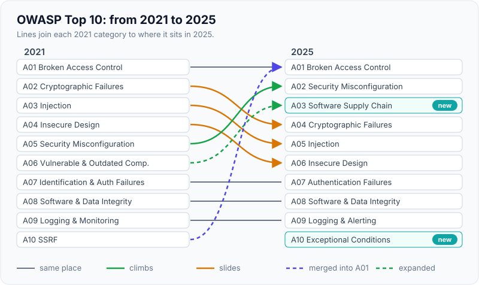
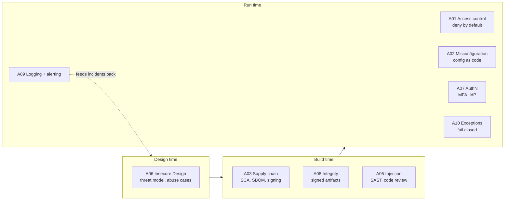

# OWASP Top 10

!!! abstract "Key takeaways"
    - The **OWASP Top 10** is an awareness document: the ten most important **categories** of web application risk, built from contributed test data on **2.8 million+ applications** plus a community survey. It is a starting point, not a standard. For a testable checklist use **OWASP ASVS**.
    - **2025 edition** (first published November 2025): A01 Broken Access Control, A02 Security Misconfiguration, A03 **Software Supply Chain Failures** (new, grows out of "Vulnerable and Outdated Components"), A04 Cryptographic Failures, A05 Injection, A06 Insecure Design, A07 Authentication Failures, A08 Software or Data Integrity Failures, A09 Security Logging and **Alerting** Failures, A10 **Mishandling of Exceptional Conditions** (new).
    - **SSRF** is no longer its own category: in 2025 it is folded into **A01 Broken Access Control**. Misconfiguration climbed from #5 to #2.
    - **Broken access control stays #1** because frameworks can't infer ownership rules for you: every object lookup needs an "is this caller allowed this *specific* record?" check, enforced server-side and deny-by-default.
    - Interview signal: map each category to **a concrete bug in your stack and the control that prevents it**, and say which controls are design-time (threat modelling, A06) versus build-time (scanning, A03) versus run-time (headers, logging, alerting).

## Why it matters

Most breaches don't come from exotic cryptographic attacks. They come from a handful of recurring mistakes: an endpoint that returns another customer's record, a debug endpoint left open, a library with a known CVE, a SQL string built by concatenation. The OWASP Top 10 names those mistakes so teams share a vocabulary.

It shows up everywhere an engineer works: security review checklists, pen-test reports ("finding mapped to A01:2021"), vendor questionnaires ([SOC 2, HIPAA reviews](../fde-enterprise-deployment/04-security-reviews-and-compliance-questionnaires-soc-2-hipaa-g.md)), static-analysis rule packs, and interview loops. In regulated domains like healthcare and banking, "how do you address the OWASP Top 10?" is a standard customer and auditor question.

What it is *not*: a complete security programme, a compliance standard, or a ranking of individual bugs. OWASP itself points teams that want verifiable requirements to the **Application Security Verification Standard (ASVS)**, and API teams to the separate [OWASP API Security Top 10](../api-design/06-api-security-and-rate-limiting.md).

## Core concepts

### How the list is built

The 2025 list draws on data covering **over 2.8 million applications** and **589 CWEs** (up from about 400 in 2021). Each category groups related CWEs (Common Weakness Enumeration entries), around 25 on average, capped at 40, so 248 CWEs feed the ten categories. OWASP counts **applications with at least one instance** of a CWE (incidence rate), not raw finding counts, so one app with 4,000 SQL injection findings counts once.

Eight categories come from the data; two are voted in by a community survey, because automated testing can't see everything practitioners worry about. Exploitability and impact scores come from about 175,000 CVE records mapped to CWEs.

### The 2025 list and what moved

| 2025 | Category | Was (2021) | Typical Java/React example |
|---|---|---|---|
| A01 | Broken Access Control (now includes SSRF) | A01 (+ A10 SSRF) | `GET /claims/{id}` returns any claim if you know the ID (IDOR) |
| A02 | Security Misconfiguration | A05 | Actuator `heapdump` exposed, default credentials, verbose errors |
| A03 | Software Supply Chain Failures | A06 Vulnerable and Outdated Components (expanded) | Log4Shell in a transitive dependency; a compromised npm package |
| A04 | Cryptographic Failures | A02 | PII sent over HTTP, MD5 password hashes, keys in source |
| A05 | Injection (includes XSS) | A03 | String-concatenated JPQL; `dangerouslySetInnerHTML` with user HTML |
| A06 | Insecure Design | A04 | Password reset with guessable codes and no rate limit |
| A07 | Authentication Failures | A07 Identification and Authentication Failures | No MFA, credential stuffing, JWT `alg` confusion |
| A08 | Software or Data Integrity Failures | A08 | Unsigned auto-updates, Java deserialisation of untrusted data |
| A09 | Security Logging and Alerting Failures | A09 Logging and Monitoring Failures | Failed logins logged but nobody alerted |
| A10 | Mishandling of Exceptional Conditions | new | Auth check that "fails open" when the policy service times out |

{ loading=lazy }
*Follow the lines: two categories climb, three slide, SSRF merges into A01 and two arrive new.*

### The categories in one paragraph each

**A01 Broken Access Control.** The user is authenticated but does something they aren't authorised to: read another tenant's record (insecure direct object reference, IDOR), call an admin endpoint, change a `role` field in a JSON body (mass assignment), or make the server fetch an internal URL (SSRF). Controls: deny by default, check ownership on every object access server-side, enforce at the service layer (not just the UI), log failures. Details in [authentication vs authorization](../spring-security-oauth2/02-authentication-vs-authorization-method-security.md).

**A02 Security Misconfiguration.** Insecure defaults, unnecessary features, overly permissive cloud storage, stack traces in responses, missing [security headers](06-security-headers-and-dependency-scanning.md). Its rise to #2 reflects how much behaviour now lives in configuration (Kubernetes manifests, IAM policies, feature flags). Controls: hardened, repeatable configuration as code, minimal platforms, automated config checks.

**A03 Software Supply Chain Failures.** Expanded from "vulnerable components" to the whole build and distribution chain: dependencies, build systems, CI/CD, registries, IDE plugins. OWASP cites SolarWinds, the 2025 **Shai-Hulud** self-propagating npm worm (over 500 package versions), and Log4Shell. Controls: SBOMs, software composition analysis, signed artifacts and provenance, a hardened pipeline. See [dependency scanning](06-security-headers-and-dependency-scanning.md).

**A04 Cryptographic Failures.** Sensitive data unprotected in transit or at rest, weak algorithms, poor key management. See [cryptography](../cryptography-key-management/01-symmetric-vs-asymmetric-encryption-hashing-mac-digital-signa.md) and [password hashing](../cryptography-key-management/07-password-hashing-and-secrets-management.md).

**A05 Injection.** Untrusted data interpreted as code by an interpreter: SQL, NoSQL, OS command, LDAP, expression languages, and the browser (XSS). Controls: parameterised APIs, context-aware output encoding. See [XSS, CSRF and SQL injection](02-xss-csrf-sql-injection-and-prevention.md).

**A06 Insecure Design.** Missing or ineffective controls by design, which no amount of perfect implementation fixes. Controls: [threat modelling](07-threat-modelling-basics.md), secure design patterns, abuse-case tests.

**A07 Authentication Failures.** Credential stuffing, weak passwords, missing MFA, broken session handling. Renamed in 2025 to match its CWEs more precisely.

**A08 Software or Data Integrity Failures.** Trusting code or data without verifying integrity: unsigned updates, insecure deserialisation, CI pipelines pulling unverified plugins.

**A09 Security Logging and Alerting Failures.** You can't respond to what you don't see. The rename stresses that logs without **alerts** don't help.

**A10 Mishandling of Exceptional Conditions.** New in 2025 with 24 CWEs: errors caught too high up the stack, sensitive data in error messages (CWE-209), unhandled missing parameters, and **failing open** (CWE-636), where an error leaves the system in a permissive state. Controls: catch errors where they occur, fail closed, roll back whole transactions, a global exception handler as a safety net, rate limits and resource quotas.


*Notice that no single tool covers the list: design reviews catch A06, the pipeline catches A03/A05/A08, and runtime controls plus alerting cover the rest.*

### Fail open versus fail closed

A10 is the category interviewers are least prepared for, so it's worth a concrete picture. Suppose an API gateway calls a policy service to authorise each request. If that service times out and the code's `catch` block returns "allow", the outage silently becomes an authorisation bypass.

{ loading=lazy }
*Same outage, two outcomes: fail-open turns an availability problem into a data breach.*

## In practice: code & configuration

The most common A01 bug in Spring is a repository lookup by ID with no ownership check.

=== "❌ Common mistake"
    ```java
    @RestController
    @RequestMapping("/api/claims")
    class ClaimController {
        private final ClaimRepository claims;

        ClaimController(ClaimRepository claims) { this.claims = claims; }

        @GetMapping("/{id}")
        ClaimDto get(@PathVariable UUID id) {
            // Authenticated? Yes. Authorised for THIS claim? Never checked (IDOR).
            return claims.findById(id).map(ClaimDto::from)
                    .orElseThrow(() -> new ResponseStatusException(HttpStatus.NOT_FOUND));
        }
    }
    ```

=== "✅ Correct approach"
    ```java
    @RestController
    @RequestMapping("/api/claims")
    class ClaimController {
        private final ClaimRepository claims;

        ClaimController(ClaimRepository claims) { this.claims = claims; }

        @GetMapping("/{id}")
        @PreAuthorize("hasAuthority('SCOPE_claims:read')")       // coarse check: may call this API at all
        ClaimDto get(@PathVariable UUID id, @AuthenticationPrincipal Jwt jwt) {
            String memberId = jwt.getClaimAsString("member_id");
            // Fine-grained check in the query itself: the row must belong to the caller.
            return claims.findByIdAndMemberId(id, memberId)
                    .map(ClaimDto::from)
                    // 404, not 403: don't confirm that someone else's claim exists
                    .orElseThrow(() -> new ResponseStatusException(HttpStatus.NOT_FOUND));
        }
    }
    ```

For A10, make the failure path explicit and closed:

=== "❌ Fails open"
    ```java
    boolean isAllowed(Request req) {
        try {
            return policyClient.check(req);          // remote call, may time out
        } catch (Exception e) {
            log.warn("policy check failed, allowing", e);
            return true;                             // outage == authorisation bypass
        }
    }
    ```

=== "✅ Fails closed"
    ```java
    Decision decide(Request req) {
        try {
            return policyClient.check(req) ? Decision.ALLOW : Decision.DENY;
        } catch (PolicyTimeoutException e) {
            metrics.counter("authz.policy.unavailable").increment();   // A09: alert on this
            return Decision.UNAVAILABLE;             // mapped to 503, never to ALLOW
        }
    }
    ```

And a global handler that never leaks internals (A10, CWE-209), using Spring's RFC 9457 `ProblemDetail`:

```java
@RestControllerAdvice
class ApiExceptionHandler {
    private static final Logger log = LoggerFactory.getLogger(ApiExceptionHandler.class);

    @ExceptionHandler(Exception.class)
    ProblemDetail unexpected(Exception ex, HttpServletRequest req) {
        String errorId = UUID.randomUUID().toString();
        log.error("Unhandled error id={} path={}", errorId, req.getRequestURI(), ex); // full detail in logs only
        ProblemDetail pd = ProblemDetail.forStatus(HttpStatus.INTERNAL_SERVER_ERROR);
        pd.setTitle("Internal error");
        pd.setProperty("errorId", errorId);           // client gets a correlation id, not a stack trace
        return pd;
    }
}
```

Also set `server.error.include-stacktrace=never` (the Spring Boot default) and keep `management.endpoints.web.exposure.include` to `health` unless an endpoint is secured (A02).

## Real-world usage

- **Pen-test and audit reports** map findings to Top 10 categories; procurement questionnaires ask how you address it. Answer with controls per category, not "we follow OWASP".
- **Tooling** (SonarQube, Semgrep, Snyk, OWASP ZAP) ships rule packs tagged by Top 10 category, which makes coverage reports easy and also tempts teams to treat "no findings" as "secure". Tools are weakest on A01, A06 and A10 because they require knowing business rules.
- **Incidents:** Apache Struts CVE-2017-5638 (behind the 2017 Equifax breach) and Log4Shell (CVE-2021-44228) are the canonical vulnerable-component stories; OWASP cites both under A03. SSRF against cloud metadata endpoints is why AWS introduced IMDSv2 with session tokens.
- **Healthcare and banking:** IDOR on patient or account records is the highest-impact class, because every record is regulated data. Expect auditors to ask how object-level authorisation is tested.

## Trade-offs & production gotchas

| Approach | Pros | Cons | Use when |
|---|---|---|---|
| Top 10 as awareness/training | Shared vocabulary, easy to teach | Not testable, not complete | Onboarding, design-review prompts |
| OWASP ASVS (levels 1–3) | Verifiable requirements | Large; needs tailoring | Security requirements, audits, regulated apps |
| OWASP API Security Top 10 | API-specific (BOLA, mass assignment, resource consumption) | Overlaps web list | REST/GraphQL services |
| Tool coverage reports | Automated, repeatable | Miss logic flaws (A01, A06, A10) | CI gates, alongside manual review |

!!! warning "Gotcha: \"compliant with the OWASP Top 10\""
    There is no such certification. OWASP explicitly says the Top 10 is an awareness document. If a customer asks, describe the controls you have per category and point to ASVS for verification.

!!! warning "Gotcha: authorisation only in the UI"
    Hiding the "Admin" button in React does nothing; the API must enforce it. Every A01 finding in a SPA-backed system is ultimately a server-side check that's missing.

!!! tip "Version check"
    Many articles still list the 2021 order. If an interviewer says "A03 Injection", they're using 2021; acknowledge both: "In 2021 injection was A03; in 2025 it's A05 and supply chain took A03."

## How this connects to my experience

- **Where I used it:** not a single resume bullet; position as applied knowledge across the security work listed: "Implemented Spring Security authorization controls and API security mechanisms" (Johnson Controls, Metasys), "Built secure enterprise APIs using OAuth2, PingFederate, and Active Directory integration" (OptumRx Meteor), and "implemented security controls using IAM, KMS, and Secrets Manager" (Deloitte).
- **Talking points:**
    - A01 in practice: object-level checks in the GraphQL Consumer Service resolvers so a member can only fetch their own data. *[confirm: how per-member authorisation was enforced across the 5 upstreams, and whether it was in the consumer service or upstream]*
    - A03: dependency scanning as part of the "engineering standards around testing, CI/CD, code quality" you established. *[confirm: which scanner (Snyk, Dependabot, OWASP Dependency-Check, Sonar) ran in the pipeline]*
    - A09: alerts, not just logs, on authorisation failures. *[confirm: what was alerted on]*
- **Likely follow-up chain:** "What's #1 and why?" → "How do you prevent IDOR in Spring?" → "How would you test that systematically?" → "What changed in 2025?" Answer with ownership checks in the query, integration tests that log in as user B and request user A's resource, and the A03/A10 additions.

## Interview questions

### Fundamentals

??? question "Q1. What is the OWASP Top 10 and what is it not?"
    **Answer:** An awareness document listing the ten most critical categories of web application security risk, built from contributed vulnerability data on millions of applications plus a community survey. It isn't a standard, a certification or an exhaustive list; for verifiable requirements OWASP points to ASVS.

    **Interviewer listens for:** "categories, data-driven, awareness, not a standard", mention of ASVS.

    **Common wrong answer:** "It's the ten most common vulnerabilities and if you fix them you're secure."

??? question "Q2. Name the current Top 10 and what changed from 2021."
    **Answer:** 2025: Broken Access Control, Security Misconfiguration, Software Supply Chain Failures, Cryptographic Failures, Injection, Insecure Design, Authentication Failures, Software or Data Integrity Failures, Security Logging and Alerting Failures, Mishandling of Exceptional Conditions. Supply chain (expanded from vulnerable components) and exceptional conditions are new; SSRF folded into access control; misconfiguration rose to #2; logging was renamed to emphasise alerting.

    **Interviewer listens for:** the two new categories and the SSRF merge.

    **Common wrong answer:** reciting the 2017 list with XXE and "Sensitive Data Exposure".

??? question "Q3. What is IDOR and how do you prevent it?"
    **Answer:** Insecure direct object reference: the server uses a client-supplied identifier to fetch a record without checking the caller may access that record. Prevent it by scoping queries to the caller (`findByIdAndOwnerId`), or a policy check per object, deny-by-default, returning 404 for others' records, and testing it with a second user.

    **Interviewer listens for:** server-side, per-object check; random UUIDs aren't a fix.

    **Common wrong answer:** "Use UUIDs instead of sequential IDs."

### Intermediate

??? question "Q4. Why is broken access control #1 when frameworks handle authentication so well?"
    **Answer:** Frameworks authenticate and can enforce coarse rules (roles, scopes), but they can't know business ownership rules: which claim belongs to which member, which tenant owns which document. Those checks must be written per endpoint, are easy to forget, and are invisible to most scanners.

    **Interviewer listens for:** authentication vs object-level authorisation; scanners can't infer business rules.

    **Common wrong answer:** "Because developers forget to add `@PreAuthorize`." (Partly true, but role checks don't stop IDOR.)

??? question "Q5. What does \"fail open\" mean and how does A10 address it?"
    **Answer:** When an error leaves the system in a permissive state, for example an authorisation check returning true when the policy service times out. A10 says plan for failure: handle errors where they occur, fail closed (deny, return 503), roll back whole transactions, use a global handler as a safety net, and alert on repeated failures.

    **Interviewer listens for:** a concrete example and the mapping to 503 plus alerting.

    **Common wrong answer:** "Fail open is better for availability" with no qualification.

??? question "Q6. Why did OWASP expand vulnerable components into supply chain failures?"
    **Answer:** Attacks moved from exploiting known CVEs to compromising how software is built and distributed: malicious package versions, hijacked maintainer tokens, compromised build systems (SolarWinds, the Shai-Hulud npm worm). Controls now include SBOMs, provenance, signing and pipeline hardening, not just "patch your libraries".

    **Interviewer listens for:** build pipeline as attack surface; SBOM and signing.

    **Common wrong answer:** "It's the same thing renamed."

### Senior

??? question "Q7. How would you use the Top 10 to drive a security programme for a team of ten?"
    **Answer:** Use it as the vocabulary, not the plan. Map each category to an owner and a control at the right stage: threat modelling per feature (A06), SCA/SBOM and secret scanning in CI (A03, A04), SAST rules for injection (A05), reusable authorisation components plus cross-user integration tests (A01), hardened configuration as code (A02), alerting runbooks (A09). Verify against ASVS level 2 for regulated data, and track findings by category to see where training is needed.

    **Interviewer listens for:** shift-left plus runtime, ASVS for verification, metrics.

    **Common wrong answer:** "Buy a scanner and fix everything it finds."

??? question "Q8. Which categories do automated scanners handle poorly, and what do you do instead?"
    **Answer:** A01 access control, A06 insecure design and A10 logic and error-handling flaws, because they depend on business intent. Compensate with threat modelling, abuse-case tests (user B requests user A's object), code review checklists, and targeted manual pen testing.

    **Interviewer listens for:** a realistic view of tooling limits.

    **Common wrong answer:** "DAST finds everything at runtime."

### Scenario-based

??? question "Q9. A pen test reports that changing the account ID in a URL returns another customer's statement. Walk me through your response."
    **Answer:** Treat as a high-severity A01 incident: confirm and scope (which endpoints share the pattern), hotfix with an ownership check in the data access layer, search access logs for exploitation (requests where the account ID didn't match the token subject), notify per policy and regulation if data was accessed, then fix systemically: a shared authorisation helper or policy, a test that runs every endpoint as a second user, and a code-review rule.

    **Interviewer listens for:** containment, log forensics, systemic fix, disclosure obligations.

    **Common wrong answer:** "Patch that one endpoint and close the ticket."

??? question "Q10. A customer's security questionnaire asks \"Are you OWASP Top 10 compliant?\" How do you answer?"
    **Answer:** Explain that the Top 10 is an awareness document without a compliance mode, then list our controls per category with evidence (SAST/SCA reports, pen-test results, access-control test suite, logging and alerting), and offer ASVS level mapping where they need verifiable requirements.

    **Interviewer listens for:** honesty plus evidence-based answer.

    **Common wrong answer:** "Yes."

## Cheat sheet

| Concept | Remember |
|---|---|
| Current edition | 2025 (Nov 2025); 2021 is still widely quoted |
| New in 2025 | A03 Software Supply Chain Failures, A10 Mishandling of Exceptional Conditions |
| Merged | SSRF → A01 Broken Access Control |
| Biggest mover | Security Misconfiguration #5 → #2 |
| Data | 2.8M+ apps, 589 CWEs analysed, 248 mapped to the 10 categories, incidence rate not counts |
| A01 fix | Deny by default, per-object ownership check server-side, test as another user |
| A10 fix | Catch where it happens, fail closed, roll back, global handler, alert |
| Not a standard | Use ASVS for verifiable requirements; API Security Top 10 for APIs |

## Sources

1. [OWASP Top 10:2025](https://top10.owasp.org/2025): the 2025 category list.
2. [OWASP Top 10:2025 Introduction](https://top10.owasp.org/2025/0x00_2025-Introduction/): changes from 2021, SSRF merge, renames, data methodology (2.8M apps, 589 CWEs, 248 mapped, survey categories).
3. [A03:2025 Software Supply Chain Failures](https://top10.owasp.org/2025/A03_2025-Software_Supply_Chain_Failures/): SolarWinds, Shai-Hulud, Bybit, Struts and Log4Shell examples and prevention list.
4. [A10:2025 Mishandling of Exceptional Conditions](https://top10.owasp.org/2025/A10_2025-Mishandling_of_Exceptional_Conditions/): fail open (CWE-636), CWE-209, prevention guidance.
5. [OWASP Top 10:2021](https://owasp.org/Top10/2021/): the previous edition for comparison.
6. [OWASP Application Security Verification Standard](https://owasp.org/www-project-application-security-verification-standard/): verifiable requirements to use alongside the Top 10.
7. [OWASP API Security Top 10 2023](https://owasp.org/API-Security/editions/2023/en/0x11-t10/): API-specific risks (BOLA, mass assignment).
8. [US GAO-18-559: Equifax data breach](https://www.gao.gov/products/gao-18-559): Apache Struts vulnerability as the breach entry point.
9. [Spring Framework reference: Error Responses (ProblemDetail)](https://docs.spring.io/spring-framework/reference/web/webmvc/mvc-ann-rest-exceptions.html): RFC 9457 error bodies.
10. [Spring Boot reference: Actuator endpoints](https://docs.spring.io/spring-boot/reference/actuator/endpoints.html): only `health` exposed over HTTP by default.
