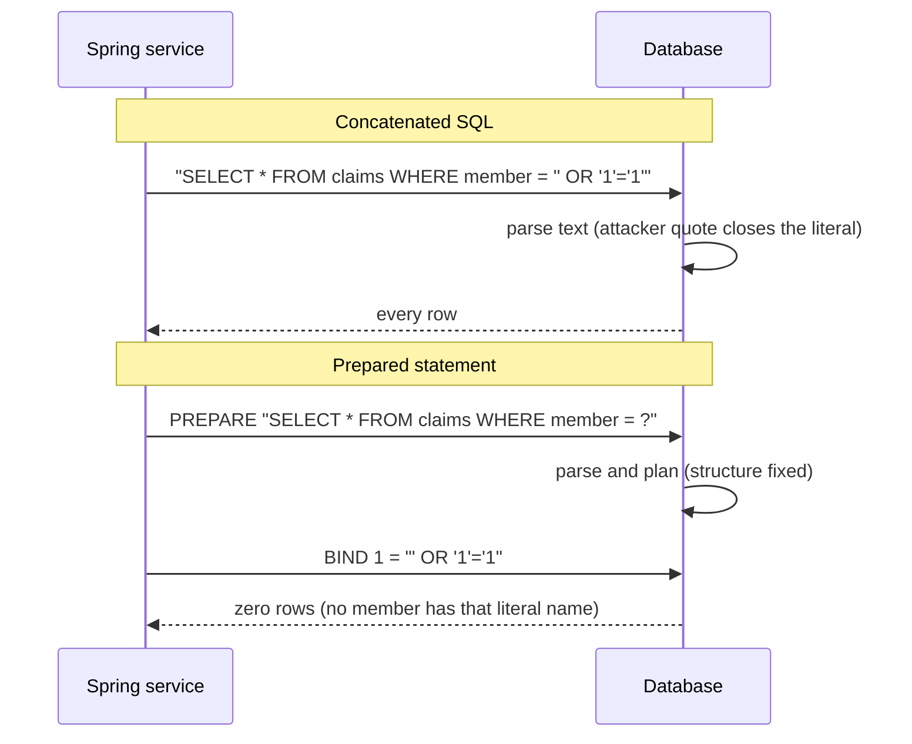
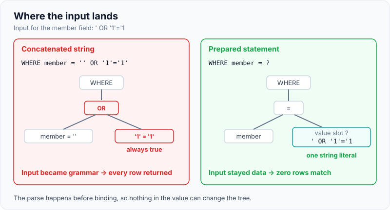
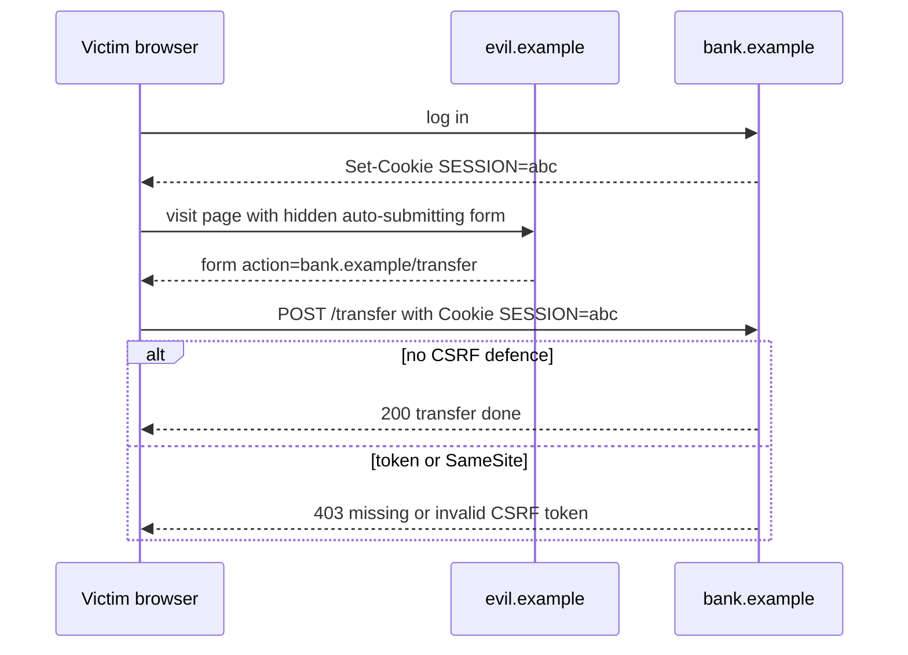

# XSS, CSRF, SQL injection & prevention

!!! abstract "Key takeaways"
    - All three are **confused-deputy** problems. **SQL injection** makes the database run attacker data as code. **XSS** makes the *browser* run attacker data as code in your origin. **CSRF** makes the browser send an authenticated request the user never intended.
    - **SQL injection fix:** parameterised queries (`PreparedStatement`, JPA named parameters, Spring Data derived queries). The value travels separately from the SQL text, so it can never change the query's structure. Allow-list anything that can't be a parameter (column names, sort direction).
    - **XSS fix:** context-aware **output encoding** (React does this for text by default), sanitise any HTML you must render (DOMPurify), never put user data in `dangerouslySetInnerHTML`, `href="javascript:…"`, `eval` or inline handlers, and add a **Content Security Policy** as a second layer.
    - **CSRF fix:** only matters when the browser attaches credentials automatically (cookies, HTTP Basic). Use a **synchroniser or double-submit token** (Spring Security's default), plus `SameSite=Lax`/`Strict` cookies. Pure bearer-token APIs (`Authorization` header) aren't CSRF-able, but tokens in `localStorage` are stealable by XSS.
    - **XSS defeats CSRF protection**: script running in your origin can read the CSRF token. Fix XSS first.

## Why it matters

These three have been on every OWASP Top 10 since 2004. In the [2025 edition](01-owasp-top-10.md) SQL injection and XSS both sit under **A05 Injection**, and CSRF is a classic **A01 Broken Access Control** issue. They're interview staples because they test whether you understand *where* trust boundaries are: between your code and the SQL parser, between your server and the browser, and between one site and another inside the same browser.

They still happen. MOVEit Transfer (CVE-2023-34362), a SQL injection in a file-transfer product, was used by the Cl0p group to steal data from thousands of organisations in 2023, including healthcare providers and banks. Stored XSS in admin panels and CSRF on "change email" endpoints remain common bug-bounty findings because each needs only one forgotten code path.

The root idea behind all three: **data crossed a boundary and was treated as instructions**, or a credential was used without proof of intent.

## Core concepts

### SQL injection: data becomes query structure

When you build SQL by concatenating strings, the database parser can't tell your query from the user's input. Input `' OR '1'='1` turns `WHERE name = '…'` into a tautology; `'; DROP TABLE claims; --` adds a statement where the driver allows multiple statements.

A **prepared statement** sends the SQL text with placeholders first. The database parses and plans it, and only then binds the values. The value can be anything, quotes included, and it stays a value.


*Notice that with a prepared statement the parse happens before the attacker's text arrives, so the text can't change the query's shape.*

{ loading=lazy }
*The same input lands in two different places: in the grammar on the left, in a value slot on the right.*

Variants worth naming:

- **Blind SQL injection:** no data comes back, but the attacker infers it from true/false page differences (boolean-based) or response delays (`pg_sleep(5)`, time-based).
- **Second-order:** input is stored safely, then later read back and concatenated into another query. "It came from our own database" isn't trust.
- **ORM injection:** JPQL/HQL and Criteria strings built by concatenation are just as injectable. So is `ORDER BY ` + `sort` param, because placeholders can't stand for identifiers.
- **NoSQL injection:** MongoDB queries built from raw JSON (`{"password": {"$ne": null}}`) can bypass checks. Bind to typed DTOs, not `Document` from the request.

### Cross-site scripting: data becomes script in your origin

XSS lets an attacker run JavaScript in a victim's browser **with your site's origin**: it can read the page, call your APIs with the user's cookies, steal tokens from `localStorage`, and rewrite the UI to phish credentials.

| Type | Where the payload lives | Example |
|---|---|---|
| **Stored** | Your database; served to every viewer | A claim note containing `` shown to an agent |
| **Reflected** | The request; echoed in the response | `/search?q=<script>…</script>` rendered in "Results for …" |
| **DOM-based** | Never reaches the server; client JS moves it from a source to a sink | `el.innerHTML = location.hash.slice(1)` |

The defence is **encoding for the context you're writing into**: HTML body, HTML attribute, JavaScript string, URL and CSS each have different metacharacters (details in [input validation and output encoding](04-input-validation-and-output-encoding.md)). React escapes text children and attribute values automatically, which removes most reflected and stored XSS. What's left are the escape hatches: `dangerouslySetInnerHTML`, `href`/`src` with a user-controlled URL (`javascript:` scheme), direct DOM writes through refs, server-side rendering that injects JSON into a `<script>` tag, and third-party libraries that use `innerHTML`.

A **Content Security Policy** is the second layer: even if a payload lands, a nonce-based `script-src` refuses to run inline script without the nonce. See [security headers](06-security-headers-and-dependency-scanning.md).

### Cross-site request forgery: a request without intent

The browser attaches cookies for `bank.example` to *any* request to `bank.example`, including one triggered by a form on `evil.example`. If the server authenticates by cookie alone, it can't tell a user's click from a forged submission.


*Notice that the attacker never sees the cookie: the browser sends it for them. That's why the defence must be something the attacker's page can't read or set.*

{ loading=lazy }
*Same forged form, two outcomes: the defence is a secret the attacker's page can't read, plus a cookie the browser won't send cross-site.*

The defences, strongest first:

1. **Synchroniser token pattern:** the server stores a random token in the session and requires it in a header or hidden field on every state-changing request. The attacker's page can't read it (same-origin policy).
2. **Double-submit cookie:** the token is in a cookie *and* must be echoed in a header; a cross-site page can't read the cookie to copy it. Sign it (or bind it to the session) so a subdomain that can set cookies can't plant one.
3. **`SameSite` cookies:** `Strict` never sends the cookie cross-site; `Lax` sends it only on top-level `GET` navigations. Chromium treats cookies without a `SameSite` attribute as `Lax`. Good defence in depth, but not sufficient alone: sibling subdomains count as *same-site*, and a state-changing `GET` is still exposed under `Lax`.
4. **Check `Origin` / `Sec-Fetch-Site` headers:** reject unsafe methods whose `Origin` isn't yours. Cheap, useful as an extra layer.

Rules that make the rest work: **never change state on `GET`**, and remember that CORS does *not* stop CSRF (a simple cross-origin form POST is sent without a preflight; see [CORS explained](03-cors-explained.md)).

### When CSRF doesn't apply

If the API authenticates only with an `Authorization: Bearer …` header that your JavaScript adds, a forged cross-site request has no token, so CSRF isn't possible. Spring's guidance: disable CSRF only for endpoints used exclusively by non-browser clients or bearer-token SPAs. The trade-off is that the token now lives where JavaScript can read it, so any XSS steals it. Many teams therefore prefer the **Backend-for-Frontend** pattern: an `HttpOnly`, `Secure`, `SameSite` session cookie to a BFF that holds the tokens, *with* CSRF protection on (see [sessions vs tokens](../spring-security-oauth2/03-sessions-vs-tokens-csrf-and-cors-in-spring.md)).

## In practice: code & configuration

### SQL injection in Spring Data JPA

=== "❌ Common mistake"
    ```java
    @Repository
    class ClaimSearchRepository {
        @PersistenceContext private EntityManager em;

        List<Claim> search(String memberName, String sortBy) {
            // Both values are concatenated: injectable JPQL and an injectable ORDER BY.
            String jpql = "SELECT c FROM Claim c WHERE c.memberName = '" + memberName + "'"
                        + " ORDER BY c." + sortBy;
            return em.createQuery(jpql, Claim.class).getResultList();
        }
    }
    ```

=== "✅ Correct approach"
    ```java
    @Repository
    class ClaimSearchRepository {
        // Identifiers can't be bound as parameters, so map them through an allow-list.
        private static final Map<String, String> SORTABLE = Map.of(
                "submitted", "c.submittedAt", "amount", "c.amount");

        @PersistenceContext private EntityManager em;

        List<Claim> search(String memberName, String sortBy) {
            String orderBy = SORTABLE.getOrDefault(sortBy, "c.submittedAt"); // unknown -> safe default
            return em.createQuery(
                    "SELECT c FROM Claim c WHERE c.memberName = :name ORDER BY " + orderBy, Claim.class)
                .setParameter("name", memberName)   // bound value, never parsed as JPQL
                .getResultList();
        }
    }
    ```

Derived queries (`findByMemberName`), `@Query` with `:name` parameters, `JdbcTemplate` with `?` placeholders and jOOQ/QueryDSL builders are all parameterised. Also: least-privilege DB users (the app account can't `DROP`), and don't enable multi-statement execution.

### XSS in React 19

=== "❌ Common mistake"
    ```tsx
    type Props = { note: { html: string; link: string } };

    export function ClaimNote({ note }: Props) {
      return (
        <div>
          {/* Renders attacker HTML:  */}
          <div dangerouslySetInnerHTML={{ __html: note.html }} />
          {/* A "javascript:alert(1)" link runs script when clicked */}
          <a href={note.link}>Attachment</a>
        </div>
      );
    }
    ```

=== "✅ Correct approach"
    ```tsx
    import DOMPurify from "dompurify";

    const SAFE_SCHEMES = new Set(["https:", "mailto:"]);

    function safeUrl(raw: string): string | undefined {
      try {
        const url = new URL(raw, window.location.origin);
        return SAFE_SCHEMES.has(url.protocol) ? url.href : undefined; // reject javascript:, data:
      } catch {
        return undefined;
      }
    }

    export function ClaimNote({ note }: { note: { html: string; link: string } }) {
      // Only when rich text is a real requirement: sanitise with an allow-list of tags.
      const clean = DOMPurify.sanitize(note.html, { ALLOWED_TAGS: ["b", "i", "p", "ul", "li"] });
      const href = safeUrl(note.link);
      return (
        <div>
          <div dangerouslySetInnerHTML={{ __html: clean }} />
          {href ? <a href={href} rel="noopener noreferrer">Attachment</a> : <span>Invalid link</span>}
        </div>
      );
    }
    ```

React has warned about `javascript:` URLs since 16.9, but don't rely on the framework for URL safety: validate the scheme yourself.

### CSRF in Spring Security 6 (Spring Boot 3)

Spring Security enables CSRF protection by default for unsafe methods (`POST`, `PUT`, `PATCH`, `DELETE`). Since 6.0 the token is **deferred** (loaded only when needed) and **XOR-masked** per request to resist BREACH. For a React SPA served from the same site, put the token in a JavaScript-readable cookie and send it back as `X-XSRF-TOKEN`:

=== "❌ Common mistake"
    ```java
    @Bean
    SecurityFilterChain api(HttpSecurity http) throws Exception {
        return http
            .authorizeHttpRequests(a -> a.anyRequest().authenticated())
            .formLogin(Customizer.withDefaults())      // session cookie authentication...
            .csrf(csrf -> csrf.disable())              // ...with CSRF off: every POST is forgeable
            .build();
    }
    ```

=== "✅ Correct approach"
    ```java
    @Bean
    SecurityFilterChain api(HttpSecurity http) throws Exception {
        return http
            .authorizeHttpRequests(a -> a.anyRequest().authenticated())
            .formLogin(Customizer.withDefaults())
            // Spring Security 7 shortcut: .csrf(csrf -> csrf.spa())
            .csrf(csrf -> csrf
                .csrfTokenRepository(CookieCsrfTokenRepository.withHttpOnlyFalse()) // XSRF-TOKEN cookie
                .csrfTokenRequestHandler(new SpaCsrfTokenRequestHandler()))         // from Spring docs
            .build();
    }
    ```

```ts
// React side: read the cookie, echo it in a header on unsafe requests.
function csrfToken(): string | undefined {
  return document.cookie.split("; ").find(c => c.startsWith("XSRF-TOKEN="))?.split("=")[1];
}

await fetch("/api/claims", {
  method: "POST",
  credentials: "same-origin",
  headers: { "Content-Type": "application/json", "X-XSRF-TOKEN": csrfToken() ?? "" },
  body: JSON.stringify(claim),
});
```

Session cookies should be `HttpOnly; Secure; SameSite=Lax` (`server.servlet.session.cookie.same-site=lax`, `…http-only=true`, `…secure=true`).

## Real-world usage

- **MOVEit (2023):** a SQL injection in a web-facing file-transfer app led to mass data theft across healthcare, finance and government. The lesson for interviews: one injectable endpoint in an internet-facing product is enough.
- **Samy worm (MySpace, 2005):** stored XSS that propagated to over a million profiles in about a day, the canonical example of XSS plus CSRF together (the script made authenticated requests as each victim).
- **Framework defaults do most of the work:** Spring Security's on-by-default CSRF, React's auto-escaping and JPA's parameter binding mean most findings now come from the escape hatches: native queries with concatenation, `dangerouslySetInnerHTML`, `csrf().disable()` copied from a tutorial.
- **Healthcare and banking:** stored XSS in an internal agent console (where notes from members are displayed) is high impact because agents have broad data access. Treat member-supplied text shown to staff as untrusted.

## Trade-offs & production gotchas

| Defence | Stops | Doesn't stop | Notes |
|---|---|---|---|
| Prepared statements / bound params | SQL injection in values | Injection via identifiers, stored procs that concatenate | Allow-list column names and sort fields |
| Output encoding (React default) | Most stored and reflected XSS | `dangerouslySetInnerHTML`, `javascript:` URLs, DOM sinks | Encoding must match the context |
| HTML sanitiser (DOMPurify) | XSS in rich text you must render | Logic bugs in what you allow | Keep it updated; allow-list tags |
| CSP with nonces | Execution of injected inline script | HTML injection without script, data exfiltration via allowed hosts | Needs build/SSR support for nonces |
| Synchroniser / double-submit token | CSRF | XSS (script can read the token) | Spring Security default |
| `SameSite=Lax` | Most cross-site POST CSRF | Same-site subdomain attacks, state-changing GET | Defence in depth only |
| Bearer token in header | CSRF | XSS token theft | Prefer BFF with cookies for browser apps |

!!! warning "Gotcha: `csrf().disable()` because \"we use JWTs\""
    Only safe if the JWT is sent in an `Authorization` header and **never** in a cookie. If you moved the JWT into a cookie to protect it from XSS, you've reintroduced CSRF and must turn protection back on.

!!! warning "Gotcha: escaping on input"
    HTML-escaping data before storing it corrupts it for every other consumer (APIs, PDFs, search) and still leaves JavaScript and URL contexts unprotected. Store the raw value; encode at output for the context.

!!! tip "Interview framing"
    "SQL injection and XSS are the same bug in two interpreters: the fix is to keep code and data in separate channels. CSRF is a different bug: the browser is the confused deputy, so the fix is proof of intent that only my origin can produce."

## How this connects to my experience

- **Where I used it:** not a single resume bullet; position as applied knowledge. Relevant lines: "Implemented Spring Security authorization controls and API security mechanisms" (Johnson Controls, Metasys), "Built secure enterprise APIs using OAuth2, PingFederate, and Active Directory integration" and "Built the ReactJS application from the ground up" (OptumRx Meteor).
- **Talking points:**
    - React's escaping plus a rule against `dangerouslySetInnerHTML` in code review for the Meteor app. *[confirm: whether the app rendered any rich text or HTML from upstream systems, and whether a CSP was configured]*
    - How the Meteor React app authenticated to the GraphQL Consumer Service: bearer token in a header (no CSRF, but XSS-sensitive) or a cookie session (CSRF needed). *[confirm: token storage and whether CSRF was enabled]*
    - Injection in GraphQL: arguments must still be bound as parameters in MongoDB/upstream calls; GraphQL types don't sanitise strings. *[confirm: how resolver arguments were passed to MongoDB queries]*
- **Likely follow-up chain:** "How does a prepared statement prevent injection?" → "What can't be parameterised?" → "Your SPA uses JWTs; do you need CSRF?" → "Where do you store the token?" Answer: parse-before-bind, allow-list identifiers, header token means no CSRF but XSS exposure, so BFF with `HttpOnly` cookie plus CSRF token for browser apps in regulated domains.

## Interview questions

### Fundamentals

??? question "Q1. How does a prepared statement prevent SQL injection?"
    **Answer:** The SQL text with placeholders is sent and parsed first; values are bound afterwards as data. Because the query's structure is fixed before the input arrives, input can't add clauses or close literals. Escaping by hand tries to achieve the same and fails on edge cases (encodings, different quote rules).

    **Interviewer listens for:** parse-then-bind, separation of code and data, not "it escapes quotes".

    **Common wrong answer:** "It escapes special characters in the input."

??? question "Q2. What are the three types of XSS?"
    **Answer:** Stored (payload saved and served to others), reflected (payload in the request echoed back), and DOM-based (client-side JavaScript moves data from a source like `location.hash` to a sink like `innerHTML` without the server involved).

    **Interviewer listens for:** DOM-based XSS as distinct, and that server-side fixes don't cover it.

    **Common wrong answer:** Listing only stored and reflected.

??? question "Q3. What is CSRF and why does it work?"
    **Answer:** The attacker's site makes the victim's browser send a state-changing request to a site where the victim is logged in. It works because browsers attach ambient credentials (cookies, Basic auth) automatically, and the server can't distinguish intent. Defence: an unguessable token the attacker's page can't read, plus `SameSite` cookies.

    **Interviewer listens for:** "ambient credentials", "attacker never sees the cookie".

    **Common wrong answer:** "The attacker steals the session cookie."

### Intermediate

??? question "Q4. Does React make you immune to XSS?"
    **Answer:** No. React escapes text and attribute values, which stops the common cases. Remaining risks: `dangerouslySetInnerHTML`, user-controlled `href`/`src` (`javascript:`, `data:`), direct DOM manipulation via refs, injecting server data into `<script>` during SSR without JSON-safe escaping, and third-party components that use `innerHTML`. Use DOMPurify for required HTML, validate URL schemes, and add a CSP.

    **Interviewer listens for:** specific escape hatches and URL schemes.

    **Common wrong answer:** "Yes, React escapes everything."

??? question "Q5. If you use JWTs, do you need CSRF protection?"
    **Answer:** Depends on transport. JWT in an `Authorization` header added by JavaScript: no CSRF, since the browser doesn't attach it automatically. JWT in a cookie: yes, it's an ambient credential like a session cookie. The header approach makes the token readable by any XSS, so browser apps often use an `HttpOnly` cookie to a BFF and keep CSRF on.

    **Interviewer listens for:** the cookie-vs-header distinction and the XSS trade-off.

    **Common wrong answer:** "JWTs are stateless so CSRF doesn't apply."

??? question "Q6. Is `SameSite=Lax` enough to stop CSRF?"
    **Answer:** It blocks most cross-site POSTs, but it's not sufficient alone: state-changing `GET`s still get the cookie on top-level navigation, sibling subdomains are "same-site" (a compromised `blog.example.com` can attack `app.example.com`), older clients may ignore it, and it doesn't cover non-cookie ambient credentials. Use it as defence in depth with tokens.

    **Interviewer listens for:** same-site vs same-origin, GET exposure.

    **Common wrong answer:** "Yes, browsers default to Lax so CSRF is dead."

### Senior

??? question "Q7. Why does XSS defeat CSRF protection?"
    **Answer:** Script running in your origin can read the page, the `XSRF-TOKEN` cookie (if not `HttpOnly`) or fetch a page containing the token, then send a valid request. Same-origin policy, which protects the token from other sites, doesn't protect it from script in your own origin. So XSS prevention is a prerequisite for CSRF defences to mean anything.

    **Interviewer listens for:** same-origin reasoning.

    **Common wrong answer:** "They're unrelated vulnerabilities."

??? question "Q8. How would you eliminate SQL injection across a large codebase, not just one bug?"
    **Answer:** Make the safe path the default: repositories and query builders only, static analysis (Semgrep/Sonar rules for string concatenation into `createQuery`, `createNativeQuery`, `JdbcTemplate`), code review checklists, an allow-list helper for dynamic sort/filter, least-privilege DB accounts so injection impact is limited, and DAST in CI. Track exceptions (native queries) explicitly.

    **Interviewer listens for:** systemic controls, least privilege, tooling plus review.

    **Common wrong answer:** "Add a WAF."

### Scenario-based

??? question "Q9. A pen test finds stored XSS in an internal agent console via member-submitted notes. What do you do?"
    **Answer:** Contain: encode or strip the field in the rendering component immediately; check whether rich text is needed (if not, render as text; if yes, sanitise with an allow-list). Search stored data for payloads and access logs for exfiltration. Check where else the same field is rendered (emails, PDFs, other UIs). Add a nonce-based CSP to limit future impact, add a lint rule banning unsanitised `dangerouslySetInnerHTML`, and a regression test with payloads.

    **Interviewer listens for:** fix at output, find all sinks, forensics, CSP, systemic prevention.

    **Common wrong answer:** "Validate input to block `<script>`."

??? question "Q10. Your team wants to disable CSRF in Spring because the React app gets 403s on POST. How do you respond?"
    **Answer:** Find out how the app authenticates. If it's a session cookie, disabling CSRF opens every endpoint; instead fix the client to send the token: `CookieCsrfTokenRepository.withHttpOnlyFalse()`, a request handler that accepts the raw cookie value (or `csrf.spa()` in Spring Security 7), and an `X-XSRF-TOKEN` header from the client (axios does this automatically). If it's purely bearer-header auth with no cookies, disabling CSRF on that stateless API chain is acceptable.

    **Interviewer listens for:** diagnose the auth mechanism before disabling a control.

    **Common wrong answer:** "Disable it, we have CORS."

## Cheat sheet

| Concept | Remember |
|---|---|
| SQL injection | Parse before bind; parameterise values, allow-list identifiers |
| Second-order SQLi | Data from your own DB is still untrusted when concatenated |
| XSS types | Stored, reflected, DOM-based |
| React gaps | `dangerouslySetInnerHTML`, `javascript:` URLs, refs/`innerHTML`, SSR JSON in `<script>` |
| XSS layers | Context encoding → sanitiser for HTML → CSP with nonces → `HttpOnly` cookies |
| CSRF root cause | Ambient credentials attached automatically |
| CSRF defences | Synchroniser/double-submit token, `SameSite`, `Origin` check, no state change on GET |
| Spring Security 6 | CSRF on by default, deferred + XOR-masked token; SPA: cookie repo + `X-XSRF-TOKEN` |
| Bearer header | No CSRF, but XSS can steal the token |
| Ordering | Fix XSS first: it defeats CSRF tokens |

## Sources

1. [OWASP SQL Injection Prevention Cheat Sheet](https://cheatsheetseries.owasp.org/cheatsheets/SQL_Injection_Prevention_Cheat_Sheet.html): parameterised queries, allow-listing identifiers, least privilege.
2. [OWASP Cross Site Scripting Prevention Cheat Sheet](https://cheatsheetseries.owasp.org/cheatsheets/Cross_Site_Scripting_Prevention_Cheat_Sheet.html): output encoding per context, framework escape hatches.
3. [OWASP DOM based XSS Prevention Cheat Sheet](https://cheatsheetseries.owasp.org/cheatsheets/DOM_based_XSS_Prevention_Cheat_Sheet.html): sources and sinks.
4. [OWASP Cross-Site Request Forgery Prevention Cheat Sheet](https://cheatsheetseries.owasp.org/cheatsheets/Cross-Site_Request_Forgery_Prevention_Cheat_Sheet.html): synchroniser token, signed double-submit, SameSite limits, Fetch Metadata.
5. [Spring Security reference: CSRF (servlet)](https://docs.spring.io/spring-security/reference/servlet/exploits/csrf.html): defaults, deferred and XOR tokens, `CookieCsrfTokenRepository`, SPA configuration, when to disable.
6. [Spring Security 7.0 What's New](https://docs.spring.io/spring-security/reference/7.0/whats-new.html): `csrf.spa()` shortcut.
7. [MDN: SameSite cookies](https://developer.mozilla.org/en-US/docs/Web/HTTP/Reference/Headers/Set-Cookie#samesitesamesite-value): Strict/Lax/None semantics and Lax default.
8. [React docs: dangerouslySetInnerHTML](https://react.dev/reference/react-dom/components/common#dangerously-setting-the-inner-html): the escape hatch and its risk.
9. [DOMPurify](https://github.com/cure53/DOMPurify): allow-list HTML sanitiser.
10. [CISA advisory AA23-158A: CL0P exploits MOVEit vulnerability](https://www.cisa.gov/news-events/cybersecurity-advisories/aa23-158a): SQL injection CVE-2023-34362.
