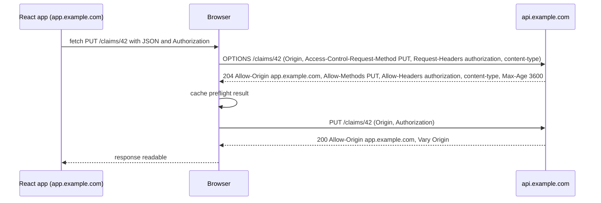
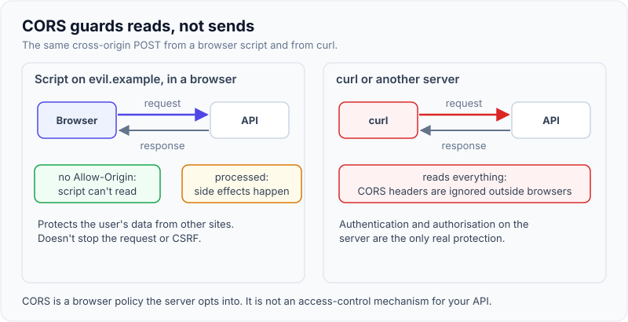

# CORS explained

!!! abstract "Key takeaways"
    - The **same-origin policy** (SOP) stops script on one origin (scheme + host + port) from **reading** responses from another. **CORS** is how a server opts in to letting specific other origins read its responses.
    - CORS is enforced **by the browser, on reads**. It doesn't stop the request reaching your server, and `curl`, mobile apps and other servers ignore it. It is **not** authentication, authorisation or CSRF protection.
    - **Simple requests** (`GET`/`HEAD`/`POST` with safelisted headers and a form-like `Content-Type`) are sent straight away. Anything else (JSON body, `Authorization` header, `PUT`/`DELETE`) triggers an **`OPTIONS` preflight** first.
    - With credentials (`credentials: "include"`), the server must echo an **exact origin** (no `*`) and send `Access-Control-Allow-Credentials: true`. When the allowed origin varies per request, send **`Vary: Origin`** so caches don't mix responses.
    - The classic bug is **reflecting any `Origin` with credentials allowed**: it lets any website read authenticated user data. Use an explicit allow-list, configured once (in Spring Security's `CorsConfigurationSource` or at the gateway, not both).

## Why it matters

Modern apps are split across origins: a React app on `app.example.com`, an API on `api.example.com`, an identity provider on another domain, local development on `localhost:5173`. Every one of those calls crosses an origin boundary, and every developer has seen the console error "has been blocked by CORS policy".

The pressure to "just make it work" produces the most common misconfiguration in API security: `Access-Control-Allow-Origin` reflected from the request with credentials allowed. That turns a browser safety feature into a data-exfiltration channel. CORS misconfiguration falls under [A02 Security Misconfiguration](01-owasp-top-10.md), and interviewers ask about it because the right answer requires knowing what CORS actually protects.

## Core concepts

### Origins and the same-origin policy

An **origin** is the triple *scheme, host, port*. `https://app.example.com` and `https://api.example.com` are different origins (different host); `http://` vs `https://` differ by scheme; `:443` vs `:8443` differ by port.

The SOP, built into browsers since Netscape 2, says: script from origin A may *send* many kinds of requests to origin B (forms, images, scripts always could), but it may not **read** B's responses unless B allows it. Without SOP, any page you visit could `fetch("https://yourbank.example/accounts")` with your cookies and read the result.

Don't confuse origin with **site**. *Site* is the registrable domain plus scheme (`https://example.com`), so `app.example.com` and `api.example.com` are cross-origin but **same-site**. `SameSite` cookies use *site*; CORS uses *origin*.

### Simple requests vs preflight

The Fetch standard divides cross-origin requests into two kinds.

A **simple request** (the spec calls it a request with no preflight) is one an HTML form could already send:

- method `GET`, `HEAD` or `POST`;
- only CORS-safelisted headers (`Accept`, `Accept-Language`, `Content-Language`, `Content-Type`, `Range`);
- `Content-Type` of `application/x-www-form-urlencoded`, `multipart/form-data` or `text/plain`.

The browser sends it immediately with an `Origin` header. If the response lacks a matching `Access-Control-Allow-Origin`, the browser hides the response from script, **but the server already processed it**.

Anything else is **preflighted**: the browser first sends `OPTIONS` with `Access-Control-Request-Method` and `Access-Control-Request-Headers`, and only sends the real request if the answer allows it. A JSON `POST` with an `Authorization` header (that is, every SPA API call) is preflighted.


*Notice the two round trips: the preflight carries no credentials and no body, and the browser decides whether the real request is sent at all.*

{ loading=lazy }
*The preflight is a permission check the browser runs on your behalf; the cached answer saves the second round trip next time.*

### The response headers

| Header | On | Meaning |
|---|---|---|
| `Access-Control-Allow-Origin` | Preflight and actual | The one origin allowed to read, or `*` (only without credentials) |
| `Access-Control-Allow-Methods` | Preflight | Methods allowed for the actual request |
| `Access-Control-Allow-Headers` | Preflight | Request headers allowed (e.g. `Authorization`, `Content-Type`) |
| `Access-Control-Allow-Credentials` | Both | `true` to let the browser expose responses to credentialed requests |
| `Access-Control-Expose-Headers` | Actual | Response headers script may read beyond the safelisted ones (e.g. `ETag`, `Location`) |
| `Access-Control-Max-Age` | Preflight | Seconds to cache the preflight. Default 5 s; Chromium caps at 7,200, Firefox at 86,400 |
| `Vary: Origin` | Both | Tells caches the response depends on the `Origin` request header |

### Credentials

Cross-origin `fetch` doesn't send cookies unless the caller sets `credentials: "include"`. When it does, the browser only exposes the response if the server sends `Access-Control-Allow-Credentials: true` **and** an explicit origin; `*` is rejected for `Allow-Origin`, `Allow-Headers`, `Allow-Methods` and `Expose-Headers`. Third-party cookie blocking can still drop the cookie even when CORS allows it, which is one reason to put the SPA and API on the same site.

### What CORS does not do

{ loading=lazy }
*CORS guards the browser's read path. The server still receives and processes the request, and non-browser clients never see CORS at all.*

- **It doesn't protect your API.** Any non-browser client can call it. Authentication and authorisation still happen server-side.
- **It doesn't stop CSRF.** A cross-site form `POST` is a simple request; it reaches the server with cookies whether or not CORS allows the read. CSRF tokens and `SameSite` handle that ([XSS, CSRF and SQL injection](02-xss-csrf-sql-injection-and-prevention.md)).
- **It isn't a firewall.** Restricting `Allow-Origin` to your SPA doesn't hide the API from attackers.
- **What it does protect:** the *user's* authenticated data from being read by other websites they visit.

## In practice: code & configuration

In Spring Boot 3 with Spring Security, configure CORS once through a `CorsConfigurationSource` bean and enable `http.cors(...)`. Spring Security then handles preflights *before* authentication, so an unauthenticated `OPTIONS` doesn't get a 401.

=== "❌ Common mistake"
    ```java
    @Component
    class CorsFilter extends OncePerRequestFilter {
        @Override
        protected void doFilterInternal(HttpServletRequest req, HttpServletResponse res, FilterChain chain)
                throws ServletException, IOException {
            // Reflects ANY origin and allows cookies: every website can read every user's data.
            res.setHeader("Access-Control-Allow-Origin", req.getHeader("Origin"));
            res.setHeader("Access-Control-Allow-Credentials", "true");
            res.setHeader("Access-Control-Allow-Methods", "*");
            chain.doFilter(req, res);   // and no Vary: Origin, so a CDN may cache one origin's answer
        }
    }
    ```

=== "✅ Correct approach"
    ```java
    @Configuration
    class SecurityConfig {

        @Bean
        SecurityFilterChain api(HttpSecurity http) throws Exception {
            return http
                .cors(Customizer.withDefaults())   // uses the CorsConfigurationSource bean below
                .authorizeHttpRequests(a -> a.anyRequest().authenticated())
                .oauth2ResourceServer(o -> o.jwt(Customizer.withDefaults()))
                .build();
        }

        @Bean
        CorsConfigurationSource corsConfigurationSource(
                @Value("${app.cors.allowed-origins}") List<String> origins) {   // per environment
            CorsConfiguration cfg = new CorsConfiguration();
            cfg.setAllowedOrigins(origins);                    // exact origins, no "*"
            cfg.setAllowedMethods(List.of("GET", "POST", "PUT", "PATCH", "DELETE"));
            cfg.setAllowedHeaders(List.of("Authorization", "Content-Type", "X-XSRF-TOKEN"));
            cfg.setExposedHeaders(List.of("Location", "ETag"));
            cfg.setAllowCredentials(true);                     // only if cookies are really needed
            cfg.setMaxAge(Duration.ofHours(1));                // fewer preflights
            UrlBasedCorsConfigurationSource src = new UrlBasedCorsConfigurationSource();
            src.registerCorsConfiguration("/api/**", cfg);     // Spring adds Vary: Origin for you
            return src;
        }
    }
    ```

```yaml
# application-prod.yml
app:
  cors:
    allowed-origins: https://app.example.com
# application-dev.yml
app:
  cors:
    allowed-origins: http://localhost:5173
```

Notes:

- `setAllowedOriginPatterns("https://*.example.com")` supports wildcards **with** credentials, because Spring echoes the concrete matching origin. Use it carefully: one compromised subdomain can then read your API.
- Validate origins by exact match, not `endsWith("example.com")` (which also matches `evilexample.com`) or regexes with unescaped dots.
- Never allow the `null` origin: sandboxed iframes and `file:` pages send `Origin: null`, so attackers can produce it.
- Don't configure CORS in **two** places (gateway and service, or `@CrossOrigin` plus a filter). Duplicate `Access-Control-Allow-Origin` headers make browsers reject the response.

### Avoiding CORS entirely

The simplest secure option is often **same-origin**: serve the SPA and proxy `/api` from the same host (CloudFront path behaviours, an ingress, or the Vite dev-server proxy locally). No preflights, first-party cookies, and no CORS policy to get wrong.

```ts
// vite.config.ts: dev proxy so the browser only ever talks to localhost:5173
export default defineConfig({
  server: { proxy: { "/api": { target: "http://localhost:8080", changeOrigin: true } } },
});
```

## Real-world usage

- **API gateways and CDNs** (AWS API Gateway, CloudFront, Azure API Management) commonly own CORS so services don't each implement it. API Gateway REST APIs need an explicit `OPTIONS` method or the "Enable CORS" setting; HTTP APIs have a CORS configuration block.
- **Misconfiguration in the wild:** security researchers (PortSwigger's James Kettle, "Exploiting CORS misconfigurations for Bitcoins and bounties", 2016) found many sites reflecting arbitrary origins with credentials, including trusting `null` and suffix-matching domains.
- **Preflight cost:** in a chatty SPA, every unique URL+method gets its own preflight. A long `Max-Age`, fewer custom headers and a same-origin proxy all reduce latency.
- **Healthcare and banking:** member portals with cookie sessions must not reflect origins; partner integrations should use server-to-server calls with OAuth client credentials rather than widening CORS.

## Trade-offs & production gotchas

| Option | Pros | Cons | Use when |
|---|---|---|---|
| Same-origin via proxy / path routing | No CORS, first-party cookies, no preflights | Routing setup at CDN/ingress | Your own SPA and API |
| Explicit origin allow-list | Precise, works with credentials | List per environment to maintain | Few known front-ends |
| Origin patterns (`*.example.com`) | Handles many subdomains | Any subdomain takeover reads your API | Many internal apps on one domain |
| `Access-Control-Allow-Origin: *` | Simple | No credentials; any site can read | Truly public, unauthenticated data (open datasets, public JS) |
| Reflect `Origin` | "Works everywhere" | Same as no SOP for logged-in users | Never with credentials |

!!! warning "Gotcha: 401 on preflight"
    If authentication runs before CORS handling, the `OPTIONS` preflight (which never carries credentials) gets a 401 and the browser reports a CORS error. Use `http.cors(...)` so Spring Security's `CorsFilter` answers preflights first, or permit `OPTIONS` at the gateway.

!!! warning "Gotcha: CORS errors that aren't CORS"
    A 500 or a gateway timeout without CORS headers shows in the console as a CORS failure, because the browser hides the real response. Check the network tab and server logs before changing the CORS policy.

!!! tip "One-liner for interviews"
    "CORS is a relaxation of the same-origin policy that the server opts into; the browser enforces it on reads. It protects users' data from other websites, not my API from attackers."

## How this connects to my experience

- **Where I used it:** not a resume bullet; position as applied knowledge. The OptumRx Meteor work (a React app "built from the ground up" with "a micro-frontend architecture" talking to the GraphQL Consumer Service) is a natural cross-origin setup.
- **Talking points:**
    - Micro-frontends loaded from different origins and calling one GraphQL endpoint, and where CORS was configured. *[confirm: whether micro-frontends and the GraphQL service were same-origin behind a gateway or cross-origin with an allow-list]*
    - GraphQL `POST` with `application/json` is always preflighted; persisted queries over `GET` can reduce that. *[confirm: whether persisted queries or preflight caching were used]*
    - At Deloitte, AWS API Gateway in front of Lambda/ECS services is where CORS is typically configured. *[confirm: whether API Gateway handled CORS on ConvergeHealth]*
- **Likely follow-up chain:** "Why do I get a CORS error in dev but not prod?" → "What's a preflight?" → "Can I use `*` with cookies?" → "Does CORS protect my API?" Answer: origin mismatch on `localhost`, OPTIONS triggers, explicit origin plus credentials flag, and no: it's browser-enforced read protection only.

## Interview questions

### Fundamentals

??? question "Q1. What is an origin and what does the same-origin policy prevent?"
    **Answer:** An origin is scheme + host + port. The SOP prevents script on one origin from reading responses (and DOM, storage) belonging to another origin. It does not prevent many cross-origin *sends* (forms, images, script tags).

    **Interviewer listens for:** all three parts of the origin; reads vs sends.

    **Common wrong answer:** "It blocks all requests to other domains."

??? question "Q2. When does the browser send a preflight?"
    **Answer:** When the request isn't "simple": a method other than GET/HEAD/POST, any non-safelisted header such as `Authorization` or custom `X-` headers, or a `Content-Type` other than form-urlencoded, multipart or `text/plain` (so any `application/json` body). The preflight is an `OPTIONS` request with `Access-Control-Request-Method`/`-Headers` and no credentials.

    **Interviewer listens for:** JSON content type and `Authorization` both trigger it.

    **Common wrong answer:** "Before every cross-origin request."

??? question "Q3. Can you use `Access-Control-Allow-Origin: *` with cookies?"
    **Answer:** No. For credentialed requests the browser requires an explicit origin and `Access-Control-Allow-Credentials: true`; it rejects `*`. Cookies in such responses aren't stored either.

    **Interviewer listens for:** explicit origin and the credentials header.

    **Common wrong answer:** "Yes, `*` allows everything."

### Intermediate

??? question "Q4. Does CORS protect against CSRF?"
    **Answer:** No. A cross-site form `POST` is a simple request, sent with cookies before CORS is consulted; CORS only stops the attacker reading the response, which a CSRF attack doesn't need. Preflighted requests (JSON, custom headers) are harder to forge, which is why requiring a custom header is a weak CSRF mitigation, but tokens and `SameSite` are the real defences.

    **Interviewer listens for:** request still sent; attacker doesn't need the response.

    **Common wrong answer:** "Yes, CORS blocks requests from other sites."

??? question "Q5. Why is `Vary: Origin` important?"
    **Answer:** When the server returns different `Access-Control-Allow-Origin` values for different requesting origins, a shared cache (CDN, proxy) could serve one origin's response to another, either breaking legitimate clients or granting access wrongly. `Vary: Origin` makes caches key on the `Origin` header.

    **Interviewer listens for:** cache poisoning/mixing.

    **Common wrong answer:** "It's optional decoration."

??? question "Q6. A preflight returns 401. What's wrong?"
    **Answer:** Authentication is running before CORS handling. Preflights never carry credentials, so an authenticated-only filter chain rejects them. Let the CORS filter answer `OPTIONS` first (`http.cors()` in Spring Security) or permit `OPTIONS` at the gateway.

    **Interviewer listens for:** preflights are credential-less; filter ordering.

    **Common wrong answer:** "Add the token to the OPTIONS request."

### Senior

??? question "Q7. Why is reflecting the `Origin` header with credentials dangerous?"
    **Answer:** It effectively disables the SOP for authenticated users: any website the user visits can `fetch` your API with `credentials: "include"` and read the response, so a malicious page can exfiltrate account data. Use an exact allow-list; never trust `null`; avoid suffix matching.

    **Interviewer listens for:** concrete exfiltration scenario, allow-list.

    **Common wrong answer:** "It's fine because the user is authenticated."

??? question "Q8. How would you design CORS for a platform with many micro-frontends and APIs?"
    **Answer:** Prefer one public origin with path-based routing at the CDN/ingress so most calls are same-origin. Where cross-origin is unavoidable, centralise CORS at the gateway with per-environment allow-lists in config, a single place emitting headers, long `Max-Age`, and tests asserting that unknown origins get no `Allow-Origin`. Partners call server-to-server with OAuth client credentials, not through widened CORS.

    **Interviewer listens for:** same-origin first, centralisation, no duplication, tests.

    **Common wrong answer:** "`@CrossOrigin(\"*\")` on every controller."

### Scenario-based

??? question "Q9. In development the React app on `localhost:5173` can't call the API on `localhost:8080`. A teammate suggests `allowedOrigins(\"*\")` everywhere. What do you do?"
    **Answer:** Different ports are different origins. Use the Vite dev proxy so the browser talks only to `localhost:5173`, or add `http://localhost:5173` to the dev profile's allow-list. Keep production config separate and explicit; never ship `*` with credentials.

    **Interviewer listens for:** dev proxy, per-profile config.

    **Common wrong answer:** "Install a browser extension that disables CORS."

??? question "Q10. A security scan flags that `Origin: https://evil.example` gets `Access-Control-Allow-Origin: https://evil.example` and `Allow-Credentials: true`. How do you assess and fix it?"
    **Answer:** Critical if the API uses cookie authentication: any site can read user data. Check which endpoints use cookies, review logs for unexpected `Origin` values, replace reflection with an exact allow-list in one place, add `Vary: Origin`, add a regression test, and check other services for the same copied filter.

    **Interviewer listens for:** impact depends on credentials, single fix point, regression test.

    **Common wrong answer:** "Low risk, CORS is just a browser thing."

## Cheat sheet

| Concept | Remember |
|---|---|
| Origin | scheme + host + port; site = scheme + registrable domain |
| SOP | Blocks cross-origin **reads**, not all sends |
| Simple request | GET/HEAD/POST, safelisted headers, form or `text/plain` content type |
| Preflight | `OPTIONS` + `Access-Control-Request-*`, no credentials |
| Credentials | Exact origin + `Allow-Credentials: true`; no `*` |
| Max-Age | Default 5 s; Chromium caps 2 h, Firefox 24 h |
| `Vary: Origin` | Required when origin is echoed |
| Spring | `CorsConfigurationSource` bean + `http.cors(...)`; one place only |
| Not CORS's job | AuthN, AuthZ, CSRF, hiding the API |
| Best option | Same origin through a proxy or path routing |

## Sources

1. [MDN: Cross-Origin Resource Sharing (CORS)](https://developer.mozilla.org/en-US/docs/Web/HTTP/Guides/CORS): simple vs preflighted requests, credentials, wildcard rules, `Vary: Origin`.
2. [MDN: Access-Control-Max-Age](https://developer.mozilla.org/en-US/docs/Web/HTTP/Reference/Headers/Access-Control-Max-Age): 5-second default and browser caps.
3. [MDN: Same-origin policy](https://developer.mozilla.org/en-US/docs/Web/Security/Same-origin_policy): origin definition, cross-origin writes vs reads.
4. [WHATWG Fetch Standard: CORS protocol](https://fetch.spec.whatwg.org/#http-cors-protocol): the normative algorithm.
5. [Spring Security reference: CORS](https://docs.spring.io/spring-security/reference/servlet/integrations/cors.html): `CorsConfigurationSource`, preflight before authentication.
6. [Spring Framework reference: CORS](https://docs.spring.io/spring-framework/reference/web/webmvc-cors.html): `allowedOriginPatterns`, global vs `@CrossOrigin` config.
7. [PortSwigger Web Security Academy: CORS](https://portswigger.net/web-security/cors): reflected origin, `null` origin and suffix-matching vulnerabilities.
8. [OWASP HTML5 Security Cheat Sheet: CORS](https://cheatsheetseries.owasp.org/cheatsheets/HTML5_Security_Cheat_Sheet.html#cross-origin-resource-sharing): configuration guidance.
9. [Vite: server.proxy](https://vite.dev/config/server-options.html#server-proxy): development proxy.
