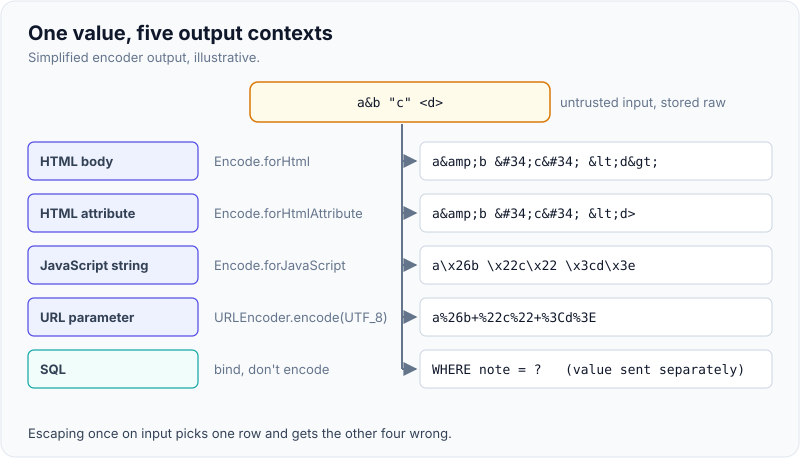
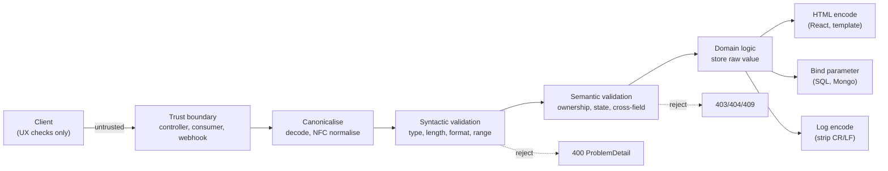

# Input validation & output encoding

!!! abstract "Key takeaways"
    - **Validate input, encode output.** Validation checks that data is what you expect (type, length, format, range, business rules) at the trust boundary. Encoding makes data safe for the **specific interpreter** it's written into (HTML, attribute, JavaScript, URL, CSS, SQL, shell, logs).
    - Validation reduces attack surface but **doesn't prevent injection** on its own: a valid name like `O'Brien` still breaks concatenated SQL, and a valid comment can still contain `<`. Prevention is parameterisation and context-aware encoding.
    - Prefer **allow-lists** (what's permitted) over deny-lists (what's forbidden). Deny-lists miss encodings, case variants and new payloads.
    - Validate **server-side** on every request (client-side checks are UX only), after **canonicalising** (decode, normalise Unicode) and before use. Check both **syntax** (format) and **semantics** (does this member own this claim, is the end date after the start date).
    - Store data **raw** and encode at output for the context. Escaping on input corrupts data and protects only one context.

## Why it matters

Almost every injection class in [OWASP A05](01-owasp-top-10.md) (SQL, NoSQL, OS command, LDAP, XSS, log injection, template injection) comes from the same mistake: untrusted data reaches an interpreter that treats some characters as syntax. Mass assignment and many business-logic bugs come from the opposite gap: no one checked that the input made sense.

Teams often blur the two ideas, either "we validate inputs, so we're safe from XSS" or "we HTML-escape everything on the way in". Both produce bugs. Interviewers ask about this to see whether you know which control stops which problem, and where in the request lifecycle it runs.

## Core concepts

### Validation vs sanitisation vs encoding

| Control | Question it answers | Where | Example |
|---|---|---|---|
| **Validation** | Is this input acceptable? Reject if not. | At the trust boundary (controller, message consumer) | `amount` is a positive decimal ≤ 10,000; `memberId` matches `^M\d{9}$` |
| **Sanitisation** | Can I make this input acceptable by removing parts? | Only where you must accept rich content | DOMPurify strips `<script>` from user HTML |
| **Encoding / escaping** | How do I write this data so the interpreter sees it as data? | At the output, per context | `<` → `&lt;` in HTML; `%3C` in a URL |
| **Parameterisation** | Can I avoid mixing data with code at all? | Database, shell, LDAP calls | `PreparedStatement`, `ProcessBuilder` with an argument list |

{ loading=lazy }
*One value, five interpreters, five different encodings. Escaping once on input can only match one of them.*

### Where validation runs


*Notice that validation happens once at the boundary, but encoding happens separately at every output, each for its own interpreter.*

{ loading=lazy }
*Each gate rejects a different kind of bad input, and the value that passes is stored unchanged.*

**Trust boundaries** include HTTP requests (body, query, headers, cookies, path), Kafka messages from other teams, files, webhooks, upstream API responses, and data read back from the database that was originally user-supplied. "It's an internal service" isn't a boundary exemption; in a zero-trust design each service validates what it receives.

### Allow-list vs deny-list

- **Allow-list:** define what's valid (`^[A-Z]{2}\d{6}$`, an enum, a known set of sort fields, a max length) and reject everything else. New attack payloads fail by default.
- **Deny-list:** look for bad patterns (`<script`, `' OR`, `../`). Fails against encodings (`%3Cscript`), case (`<ScRiPt`), alternative syntax (``), and Unicode tricks.

Use deny-lists only as an extra signal (WAF rules, monitoring), never as the control.

### Syntactic and semantic validation

- **Syntactic:** types, lengths, formats, ranges, enumerations. Jakarta Bean Validation annotations (`@NotBlank`, `@Size`, `@Pattern`, `@Positive`, `@Email`) cover most of this. Use strong types: `UUID`, `LocalDate`, `BigDecimal`, Java `enum` and records parse and reject malformed input for free.
- **Semantic:** does it make sense in context? Start date before end date; claim belongs to the caller; the state transition is allowed; the amount is within the member's limit. This usually lives in the service layer, not annotations.

Two more boundary concerns:

- **Mass assignment:** binding request JSON directly onto an entity lets a client set `role`, `status` or `ownerId`. Bind to a request DTO (a record) containing only the fields the client may set.
- **Size and shape limits:** max body size, max collection sizes, max string lengths and JSON nesting depth protect against resource exhaustion. Regexes need care too: nested quantifiers like `(a+)+$` cause catastrophic backtracking (ReDoS).

### Canonicalisation

Decode and normalise *before* validating, and only once. Otherwise `..%2F..%2Fetc%2Fpasswd` passes a check for `../` and then gets decoded downstream, and Unicode look-alikes (full-width `／`, combining characters) slip past ASCII checks. For file paths, resolve with `Path.normalize()` and check the result `startsWith` the allowed base directory.

### Output encoding by context

| Context | Dangerous characters | Encoder (Java) | Notes |
|---|---|---|---|
| HTML body | `< > &` | `Encode.forHtml` (OWASP Java Encoder); Thymeleaf `th:text`; React text | Default in modern templates |
| HTML attribute (quoted) | `" ' & <` | `Encode.forHtmlAttribute` | Always quote attributes |
| JavaScript string | `' " \ </script>` | `Encode.forJavaScript` | Avoid: pass data via `data-` attributes or JSON |
| URL parameter | Reserved chars, spaces | `URLEncoder.encode(v, UTF_8)`, `UriComponentsBuilder` | Validate the scheme of full URLs separately |
| CSS | Almost everything | `Encode.forCssString` | Avoid user data in CSS |
| SQL | Quotes, comments | None: use bound parameters | Escaping SQL by hand is a last resort |
| OS command | Shell metacharacters | None: `ProcessBuilder(List)` without a shell | Never `sh -c` with user input |
| Logs | CR, LF | Replace `\r\n`; structured JSON logging | Prevents forged log lines (CWE-117) |

## In practice: code & configuration

### Bean Validation at the boundary (Spring Boot 3)

Add `spring-boot-starter-validation` (Hibernate Validator; the `javax` → `jakarta` package move came with Boot 3).

=== "❌ Common mistake"
    ```java
    @RestController
    @RequestMapping("/api/claims")
    class ClaimController {
        private final ClaimRepository repo;
        ClaimController(ClaimRepository repo) { this.repo = repo; }

        @PostMapping
        Claim create(@RequestBody Claim claim) {   // binds onto the JPA entity: client can set status, ownerId
            // Deny-list "validation" that misses , encodings, and corrupts O'Brien
            claim.setNotes(claim.getNotes().replace("<script>", "").replace("'", "''"));
            return repo.save(claim);
        }
    }
    ```

=== "✅ Correct approach"
    ```java
    // Request DTO: only client-settable fields, each with an allow-list constraint.
    record CreateClaimRequest(
            @NotNull UUID policyId,
            @NotNull @Positive @Digits(integer = 6, fraction = 2) BigDecimal amount,
            @NotNull @PastOrPresent LocalDate serviceDate,
            @NotNull ClaimType type,                                    // enum: unknown values rejected
            @Size(max = 2000) String notes) {}                          // stored raw, encoded at output

    @RestController
    @RequestMapping("/api/claims")
    class ClaimController {
        private final ClaimService service;
        ClaimController(ClaimService service) { this.service = service; }

        @PostMapping
        ResponseEntity<ClaimDto> create(@Valid @RequestBody CreateClaimRequest req,
                                        @AuthenticationPrincipal Jwt jwt) {
            // Semantic checks (policy belongs to caller, amount within limit) live in the service.
            ClaimDto created = service.create(jwt.getSubject(), req);
            return ResponseEntity.created(URI.create("/api/claims/" + created.id())).body(created);
        }
    }
    ```

Spring returns `400` with a `MethodArgumentNotValidException`; with `spring.mvc.problemdetails.enabled=true` the body is an RFC 9457 `ProblemDetail`. Tell clients *which field* failed, never echo the rejected value into HTML.

### Custom constraint for a domain format

```java
@Target({ElementType.FIELD, ElementType.PARAMETER, ElementType.RECORD_COMPONENT})
@Retention(RetentionPolicy.RUNTIME)
@Constraint(validatedBy = MemberIdValidator.class)
@interface MemberId {
    String message() default "must be a valid member id";
    Class<?>[] groups() default {};
    Class<? extends Payload>[] payload() default {};
}

class MemberIdValidator implements ConstraintValidator<MemberId, String> {
    private static final Pattern P = Pattern.compile("^M\\d{9}$");   // anchored, no nested quantifiers
    @Override public boolean isValid(String v, ConstraintValidatorContext ctx) {
        return v == null || P.matcher(v).matches();                   // null handled by @NotNull
    }
}
```

### Encoding at output and in logs

```java
// Server-rendered HTML outside a template engine (rare in a React app, common in emails/PDF HTML):
String safe = "<p>Note: " + Encode.forHtml(claim.notes()) + "</p>";

// Building a URL: let the builder encode components.
URI uri = UriComponentsBuilder.fromUriString("https://upstream.example/claims")
        .queryParam("member", memberId)            // encoded for you
        .build().encode().toUri();

// Logging: prefer structured fields over string concatenation (no forged lines from \n).
log.atInfo().addKeyValue("memberId", memberId).log("claim created");
```

In React, keep data in text nodes (`{note}`), which React escapes. For URLs, validate the scheme before using them in `href` (see the `safeUrl` helper on the [XSS page](02-xss-csrf-sql-injection-and-prevention.md)).

### Validating messages, not just HTTP

```java
@KafkaListener(topics = "claims.submitted")
void onClaim(@Payload @Valid ClaimSubmitted event) {   // needs a validator on the listener container factory
    handler.handle(event);
}
```

Configure a `Validator` on the Kafka listener endpoint registrar and route invalid messages to a dead-letter topic rather than retrying them forever.

## Real-world usage

- **Log4Shell (CVE-2021-44228)** was an *output* problem as much as input: logging an attacker-controlled string led Log4j to interpret `${jndi:ldap://…}` lookups. Treating log output as an interpreter context (and patching) is the lesson.
- **Mass assignment** is item API3:2023 (Broken Object Property Level Authorization) in the OWASP API Security Top 10; the 2012 GitHub/Rails incident, where a user added his key to the Rails organisation, is the canonical example.
- **ReDoS:** the 2019 Cloudflare outage was caused by a WAF regex with catastrophic backtracking that pinned CPUs worldwide. Regex validation can itself be an attack surface.
- **Healthcare and banking:** strict formats (member IDs, NPI numbers, IBANs, ISO currency codes) are perfect allow-list candidates; free-text fields (notes, addresses) need length limits and output encoding everywhere they're shown, including staff consoles, PDFs and emails.

## Trade-offs & production gotchas

| Approach | Pros | Cons | Use when |
|---|---|---|---|
| Bean Validation annotations | Declarative, consistent 400s | Can't express most semantic rules | Syntactic checks on DTOs |
| Service-layer semantic checks | Business rules, ownership | More code, must be tested | Anything involving state or the caller |
| Strong types (enum, UUID, `LocalDate`) | Parsing is validation | Need clear error messages | Always for structured fields |
| Allow-list regex | Precise | ReDoS risk if careless | Formats like IDs and codes |
| HTML sanitiser | Allows rich text | Policy must be maintained | Only when rich text is required |
| Encode at output | Correct per context | Every sink must do it | Always; let frameworks do it |
| Escape on input | Feels simple | Corrupts data, wrong for other contexts | Never |

!!! warning "Gotcha: `@Valid` on nested objects and collections"
    Constraints on a nested DTO or list elements only run if the field is annotated `@Valid` (or the element type uses `List<@Valid Item>`). Missing it silently skips validation.

!!! warning "Gotcha: validation isn't authorisation"
    A perfectly formatted `claimId` can still belong to someone else. Ownership is a semantic check (see [IDOR in the OWASP Top 10](01-owasp-top-10.md)).

!!! tip "Interview framing"
    "I validate to reject what doesn't make sense and to shrink the attack surface; I encode and parameterise to make injection impossible. They're complementary, and only the second one stops injection."

## How this connects to my experience

- **Where I used it:** not a single resume bullet; position as applied knowledge from building REST and GraphQL APIs: "Designed and developed microservices using Java, Spring Boot, Kafka, MongoDB, Redis, and GraphQL" and "Owned the GraphQL Consumer Service end-to-end, acting as the integration layer between 5 upstream systems" (OptumRx Meteor).
- **Talking points:**
    - GraphQL's type system gives syntactic validation (types, enums, non-null) for free, but string arguments still need length/format checks and semantic checks in resolvers. *[confirm: whether custom scalars or directive-based validation were used]*
    - Responses from the 5 upstream systems are a trust boundary too: validate and map them into internal types before passing them to clients. *[confirm: how upstream responses were validated or mapped]*
    - Kafka consumers with retry and DLQ: invalid messages go straight to the DLQ instead of being retried. *[confirm: whether validation failures were classified as non-retryable]*
- **Likely follow-up chain:** "Where do you validate?" → "Does validation stop XSS?" → "How do you validate a field that's free text?" → "What about data from internal services?" Answer: at every trust boundary, server-side; no, encoding does; length limits plus output encoding; yes, zero trust between services.

## Interview questions

### Fundamentals

??? question "Q1. What's the difference between input validation and output encoding?"
    **Answer:** Validation checks that input is acceptable (type, length, format, business rules) and rejects it otherwise; it runs at the trust boundary. Encoding transforms data at the point of output so the target interpreter (HTML, URL, JS, SQL) treats it as data. Validation reduces attack surface; encoding (and parameterisation) prevents injection.

    **Interviewer listens for:** different stages, different purposes, encoding is per context.

    **Common wrong answer:** "They're the same thing: cleaning user input."

??? question "Q2. Why prefer allow-lists over deny-lists?"
    **Answer:** An allow-list defines exactly what's acceptable, so unknown or novel payloads fail by default. Deny-lists must anticipate every bad input and miss encodings, case variants, alternative syntax and new techniques.

    **Interviewer listens for:** fail-closed by default.

    **Common wrong answer:** "Deny-lists are more flexible for users."

??? question "Q3. Why isn't client-side validation enough?"
    **Answer:** The client is controlled by the user. Anyone can bypass it with DevTools, `curl` or a proxy. Client checks are for user experience; the server must validate every request independently.

    **Interviewer listens for:** attacker controls the client.

    **Common wrong answer:** "It's enough if you also use HTTPS."

### Intermediate

??? question "Q4. Why is HTML-escaping input before storing it a bad idea?"
    **Answer:** It corrupts the data for other consumers (APIs, CSV exports, search, mobile apps get `&lt;`), it leads to double-encoding bugs, and it only protects the HTML-body context, not attributes, JavaScript, URLs or SQL. Store raw, encode at each output for its context.

    **Interviewer listens for:** context mismatch and data corruption.

    **Common wrong answer:** "It's safer because it's done once."

??? question "Q5. What is mass assignment and how do you prevent it in Spring?"
    **Answer:** Binding request data directly onto domain objects lets clients set fields they shouldn't (`role`, `status`, `ownerId`). Prevent it with request DTOs (records) containing only client-settable fields, mapping explicitly to entities, and setting server-owned fields from the security context.

    **Interviewer listens for:** DTOs, not `@JsonIgnore` sprinkled on entities.

    **Common wrong answer:** "Validate the entity with `@Valid`."

??? question "Q6. What is canonicalisation and why does order matter?"
    **Answer:** Converting input to its simplest standard form (URL-decoding, Unicode normalisation, path normalisation) before validating. If you validate first and decode later, encoded payloads (`%2e%2e%2f`) pass the check and become dangerous after decoding. Decode once, normalise, then validate.

    **Interviewer listens for:** path traversal example, decode once.

    **Common wrong answer:** "Just check for `../`."

### Senior

??? question "Q7. How do you validate safely with regular expressions?"
    **Answer:** Anchor them (`^…$`), keep them simple, avoid nested quantifiers and overlapping alternations that cause catastrophic backtracking (ReDoS), apply a length limit before matching, precompile `Pattern`s, and test with long adversarial inputs. For complex formats, parse instead of regex.

    **Interviewer listens for:** ReDoS awareness and length limits first.

    **Common wrong answer:** "Regex is always safe for validation."

??? question "Q8. How would you standardise validation and encoding across 20 microservices?"
    **Answer:** Shared conventions rather than a shared mega-library: DTO records with Bean Validation, a common `@RestControllerAdvice` producing `ProblemDetail`, contract-first schemas (OpenAPI/GraphQL SDL) with constraints, validation on message consumers with DLQ for poison messages, structured logging to avoid log injection, front-end rules (lint against `dangerouslySetInnerHTML`), and security tests (fuzzing, DAST) in CI.

    **Interviewer listens for:** contracts, consistent errors, every boundary including messaging.

    **Common wrong answer:** "Put a WAF in front."

### Scenario-based

??? question "Q9. A file-download endpoint takes `?name=report.pdf`. How do you make it safe?"
    **Answer:** Don't use the name as a path. Map an ID to a stored file record and check ownership. If a name is unavoidable: allow-list characters and extension, resolve `base.resolve(name).normalize()`, and verify the result still starts with `base`. Set `Content-Disposition` with an encoded filename and `X-Content-Type-Options: nosniff`.

    **Interviewer listens for:** indirect reference, normalise-then-check, ownership.

    **Common wrong answer:** "Strip `../` from the name."

??? question "Q10. Upstream partner data shows up in your React app with embedded HTML. What do you do?"
    **Answer:** Treat it as untrusted. Decide whether HTML is needed: if not, render as text (React escapes it). If yes, sanitise with an allow-list (DOMPurify) at render time, validate any links' schemes, and add a CSP. On the backend, validate and map the partner response into typed DTOs with length limits, and log anomalies.

    **Interviewer listens for:** upstream data as a trust boundary, sanitise only when needed.

    **Common wrong answer:** "It's from a trusted partner, so render it."

## Cheat sheet

| Concept | Remember |
|---|---|
| Rule | Validate input at the boundary; encode output per context; parameterise interpreters |
| Allow-list | Define valid; reject the rest |
| Server-side | Client checks are UX only |
| Order | Canonicalise → syntactic → semantic → store raw → encode at output |
| Spring Boot 3 | `spring-boot-starter-validation`, `jakarta.validation`, `@Valid` DTO records |
| Nested | `@Valid` on nested fields and `List<@Valid T>` |
| Mass assignment | DTOs, never entities, in `@RequestBody` |
| Contexts | HTML body, attribute, JS, URL, CSS, SQL, shell, logs |
| ReDoS | Anchored, no nested quantifiers, length limit first |
| Not a substitute | Validation ≠ authorisation ≠ encoding |

## Sources

1. [OWASP Input Validation Cheat Sheet](https://cheatsheetseries.owasp.org/cheatsheets/Input_Validation_Cheat_Sheet.html): allow-list, syntactic vs semantic, server-side, canonicalisation, regex guidance.
2. [OWASP Cross Site Scripting Prevention Cheat Sheet](https://cheatsheetseries.owasp.org/cheatsheets/Cross_Site_Scripting_Prevention_Cheat_Sheet.html): output encoding rules per context.
3. [OWASP Java Encoder](https://owasp.org/www-project-java-encoder/): `Encode.forHtml`, `forHtmlAttribute`, `forJavaScript`, `forCssString`.
4. [OWASP Mass Assignment Cheat Sheet](https://cheatsheetseries.owasp.org/cheatsheets/Mass_Assignment_Cheat_Sheet.html): DTOs and allow-listed binding.
5. [OWASP API Security Top 10 2023: API3 Broken Object Property Level Authorization](https://owasp.org/API-Security/editions/2023/en/0xa3-broken-object-property-level-authorization/): mass assignment in APIs.
6. [Spring Boot reference: Validation](https://docs.spring.io/spring-boot/reference/io/validation.html): `spring-boot-starter-validation` and method validation.
7. [Jakarta Bean Validation 3.0 specification](https://jakarta.ee/specifications/bean-validation/3.0/): built-in constraints, cascaded validation, container element constraints.
8. [CWE-117: Improper Output Neutralization for Logs](https://cwe.mitre.org/data/definitions/117.html): log injection.
9. [Cloudflare: Details of the Cloudflare outage on July 2, 2019](https://blog.cloudflare.com/details-of-the-cloudflare-outage-on-july-2-2019/): regex catastrophic backtracking.
10. [OWASP: Regular expression Denial of Service (ReDoS)](https://owasp.org/www-community/attacks/Regular_expression_Denial_of_Service_-_ReDoS): ReDoS patterns.
