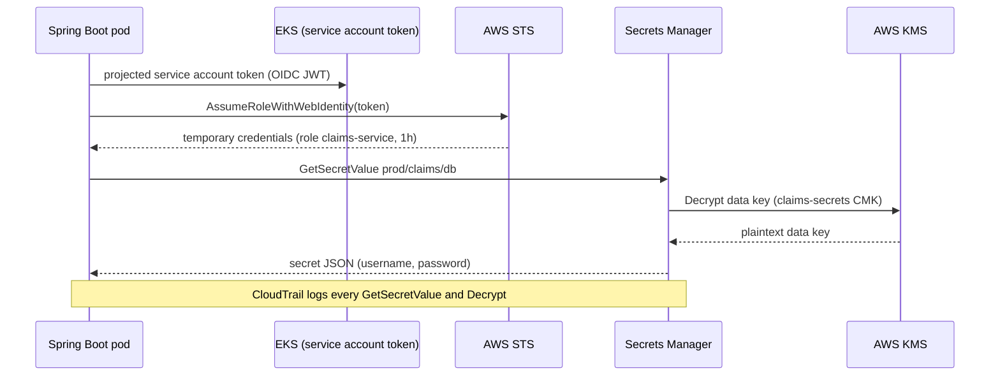

# Secrets management & secure configuration

!!! abstract "Key takeaways"
    - A **secret** is anything that grants access: DB passwords, API keys, OAuth client secrets, signing keys, TLS private keys. Secrets don't belong in **source control, container images, build logs, or plain `application.yml`**. Git history keeps them forever.
    - Use a **secrets manager** (AWS Secrets Manager, Azure Key Vault, HashiCorp Vault) as the source of truth, give each workload an **identity** (IAM role for service accounts / EKS Pod Identity, Azure workload identity) to fetch its own secrets, and grant **least privilege** per secret.
    - Best of all is **no long-lived secret**: IAM roles instead of access keys, OIDC federation from CI to cloud, IAM database authentication, or **dynamic, short-lived credentials** (Vault database engine).
    - **Rotation** must be designed in: two valid versions overlap (`AWSCURRENT` and `AWSPENDING`/`AWSPREVIOUS`, or alternating users), apps re-read on failure or on a refresh, and rotation is tested before it's needed in an incident.
    - **Secure configuration** = hardened defaults as code: Actuator exposes only `health`, no stack traces, TLS everywhere, debug and sample endpoints off, config differences per environment reviewed like code. Misconfiguration is **#2 in the OWASP Top 10:2025**.

## Why it matters

Leaked credentials are one of the most common initial access vectors in breach reports. GitGuardian's 2024 State of Secrets Sprawl report counted **12.8 million** new secrets exposed in public GitHub commits in 2023 alone. Uber's 2016 breach began with AWS credentials committed to a private GitHub repository; Toyota disclosed in 2022 that a data-server access key had sat in a public repo for nearly five years.

Secrets are also an operational problem: a password shared by twenty services can't be rotated without a coordinated outage, so it never gets rotated. Good secrets management makes rotation boring, which is the only way it happens.

Secure configuration matters for the same reason. [A02 Security Misconfiguration](01-owasp-top-10.md) rose to #2 in 2025 because so much behaviour now lives in configuration: IAM policies, Kubernetes manifests, Spring profiles, feature flags.

## Core concepts

### Where secrets leak

| Leak path | Example | Control |
|---|---|---|
| Source code and Git history | `spring.datasource.password=…` committed | Pre-commit and CI secret scanning (gitleaks, GitHub push protection); rotate on any leak |
| Container images | `ENV DB_PASSWORD` or a copied `.env` in a layer | Inject at runtime; scan images; `.dockerignore` |
| CI logs and artifacts | `echo $TOKEN`, test reports with config dumps | Masked variables, OIDC instead of static keys |
| Environment variables | Visible in `/proc/<pid>/environ`, crash dumps, `docker inspect`, Actuator `env` | Mount as files or fetch from the manager; restrict Actuator |
| Kubernetes `Secret` objects | Base64 in etcd, readable by anyone with `get secrets` in the namespace | Encryption at rest with KMS, tight RBAC, external secret stores |
| Application logs and errors | Connection strings in exceptions, request headers logged | Redaction, structured logging, never log `Authorization` |
| Front-end bundles | API keys in React `VITE_*` variables | Nothing secret ships to the browser; use a backend |

### A maturity ladder

{ loading=lazy }
*Each step up shrinks how long a leaked secret is useful and how many people can see it.*

1. **Hard-coded** in code or config files. Leaks with every clone.
2. **Environment variables / CI variables.** Out of Git, but visible to anything that can inspect the process, and rotation means redeploying.
3. **Platform secrets** (Kubernetes `Secret` with etcd encryption via KMS, ECS task definition `secrets` from Secrets Manager/SSM). Access control via RBAC/IAM.
4. **Central secrets manager** with per-workload identity, audit logs (CloudTrail), versioning and automatic rotation.
5. **Dynamic or identity-based credentials:** IAM roles, IAM DB auth tokens (15-minute lifetime), Vault leases, OIDC federation for CI. Nothing long-lived to steal.

### Workload identity: the "secret zero" problem

To fetch a secret, a service must authenticate to the secrets manager. If that needs a static key, you've just moved the problem. Cloud platforms solve this with **workload identity**: the platform vouches for the workload.


*Notice that no long-lived credential exists anywhere: the pod's identity comes from the cluster, and the IAM role scopes it to one secret path.*

The same shape appears elsewhere: ECS task roles, Lambda execution roles, Azure managed identity with Key Vault, and GitLab/GitHub CI exchanging an OIDC token for cloud credentials instead of storing access keys.

### Rotation without downtime

Rotation needs **two valid credentials at once** for a while, because instances don't all pick up the new value at the same instant. AWS Secrets Manager's Lambda rotation runs four steps and moves **staging labels** between versions:

1. `createSecret`: generate a new value and store it as `AWSPENDING`.
2. `setSecret`: apply it to the database or service.
3. `testSecret`: log in with the pending value.
4. `finishSecret`: move `AWSCURRENT` to the new version; the old one becomes `AWSPREVIOUS`.

{ loading=lazy }
*Watch the labels, not the values: clients always ask for AWSCURRENT, and the previous version keeps working until they've switched.*

Two strategies:

- **Single user:** change the password of one DB user. Simple, but connections opening between `setSecret` and the client refresh can fail; clients should retry by re-fetching the secret.
- **Alternating users:** two DB users (`app_a`, `app_b`); rotation updates the one not currently in use, then flips `AWSCURRENT`. The old credential stays valid until the next rotation, so there's no gap.

For **encryption keys**, rotation looks different: new data is encrypted with the new key version while old versions remain available for decryption (see [key rotation strategies](../cryptography-key-management/06-key-rotation-strategies-without-downtime.md) and [envelope encryption](../cryptography-key-management/03-envelope-encryption-and-data-keys.md)).

### Secure configuration

- **Least functionality:** Spring Boot Actuator exposes only `health` over HTTP by default; keep it that way or put other endpoints behind authentication on a separate management port. `env`, `heapdump`, `configprops` and `threaddump` leak secrets.
- **Errors:** `server.error.include-stacktrace=never` and `include-message=never` (Boot defaults); a global `ProblemDetail` handler with a correlation ID.
- **Transport:** TLS to clients and between services (or a mesh with mTLS), TLS to databases (`sslmode=verify-full` for PostgreSQL), HSTS at the edge.
- **Defaults:** no default passwords, sample apps or admin consoles; H2 console and Swagger UI off in production unless intended.
- **Configuration as code:** Terraform, Helm values and Spring profiles reviewed and scanned (Checkov, tfsec, kube-linter), with drift detection. Production config differs from dev only where it must.
- **Separation:** configuration (non-secret, per environment) in ConfigMaps/App Config; secrets in the manager; code identical across environments (12-factor).

## In practice: code & configuration

### Spring Boot 3 with Spring Cloud AWS

`io.awspring.cloud:spring-cloud-aws-starter-secrets-manager` adds a config-data loader. Top-level JSON keys of the secret become properties.

=== "❌ Common mistake"
    ```yaml
    # application-prod.yml, committed to Git
    spring:
      datasource:
        url: jdbc:postgresql://claims-db.prod.internal:5432/claims
        username: claims_app
        password: S3cr3t-Pr0d!        # in Git history forever, shared by every environment's admins
    management:
      endpoints.web.exposure.include: "*"   # /actuator/env and /heapdump expose it again
    ```

=== "✅ Correct approach"
    ```yaml
    # application-prod.yml: references only, no values
    spring:
      config:
        import: aws-secretsmanager:prod/claims/db     # fails startup if missing (no "optional:")
      datasource:
        url: jdbc:postgresql://claims-db.prod.internal:5432/claims?sslmode=verify-full
        username: ${username}                          # keys from the secret's JSON
        password: ${password}
    management:
      endpoints.web.exposure.include: health
      endpoint.health.show-details: never
    server:
      error:
        include-stacktrace: never
    ```

The pod's service account maps to an IAM role whose policy allows `secretsmanager:GetSecretValue` on **that secret's ARN only** (and `kms:Decrypt` on its key). Reload is opt-in (`spring.cloud.aws.secretsmanager.reload.strategy`); only `@ConfigurationProperties` and `@RefreshScope` beans refresh, and a `DataSource` usually needs pool-level handling.

### Surviving rotation in the connection pool

```java
@Configuration
class DataSourceConfig {

    @Bean
    DataSource dataSource(SecretsManagerClient sm, @Value("${app.db.secret-id}") String secretId,
                          @Value("${spring.datasource.url}") String url) {
        HikariConfig cfg = new HikariConfig();
        cfg.setJdbcUrl(url);
        cfg.setMaxLifetime(Duration.ofMinutes(15).toMillis());   // connections recycle well inside the overlap
        // RotatingCredentialsDataSource is a small custom wrapper (sketch): it fetches credentials
        // on each new physical connection, so a rotated password is picked up.
        cfg.setDataSource(new RotatingCredentialsDataSource(url, () -> DbCredentials.fetch(sm, secretId)));
        return new HikariDataSource(cfg);
    }
}
```

An alternative is the AWS Advanced JDBC Wrapper with its Secrets Manager plugin, which re-fetches the secret on authentication failure. Simpler still: **IAM database authentication**, where the app generates a 15-minute token from its role and there's no password at all.

### CI without stored cloud keys (GitLab)

```yaml
deploy:
  image: amazon/aws-cli:2.17.0
  id_tokens:
    AWS_OIDC_TOKEN:
      aud: https://gitlab.example.com
  script:
    # Exchange GitLab's short-lived OIDC token for role credentials; nothing long-lived in CI variables.
    - >
      export $(aws sts assume-role-with-web-identity
      --role-arn "$DEPLOY_ROLE_ARN" --role-session-name "gl-$CI_PIPELINE_ID"
      --web-identity-token "$AWS_OIDC_TOKEN" --duration-seconds 3600
      --query 'Credentials.[AccessKeyId,SecretAccessKey,SessionToken]' --output text
      | awk '{print "AWS_ACCESS_KEY_ID="$1" AWS_SECRET_ACCESS_KEY="$2" AWS_SESSION_TOKEN="$3}')
    - ./deploy.sh
```

The role's trust policy restricts which project and branch (`sub` claim, e.g. `project_path:group/claims:ref_type:branch:ref:main`) may assume it.

### Kubernetes

- Enable **envelope encryption of Secrets in etcd** with a KMS provider (EKS supports this with a KMS key).
- Prefer the **Secrets Store CSI driver** or **External Secrets Operator** to sync from Secrets Manager/Key Vault, mounting as files rather than env vars.
- RBAC: no wildcard `get`/`list` on `secrets`; `list` returns values too.
- See [ConfigMaps, Secrets and volumes](../docker-kubernetes/05-configmaps-secrets-and-volumes.md).

### Detection

```bash
# Pre-commit / CI: fail the build on new secrets, and scan full history once.
gitleaks git --redact --exit-code 1 .
```

If a secret leaks: **revoke and rotate first**, then clean history. Removing the commit doesn't un-leak it; bots scrape public GitHub within minutes.

## Real-world usage

- **Uber (2016):** attackers found AWS credentials in a private GitHub repo and used them to download data on 57 million riders and drivers. Static cloud keys in code are the pattern every scanner now targets.
- **CircleCI (January 2023):** malware on an engineer's laptop stole a session token; CircleCI told all customers to rotate every secret stored in the platform. The lesson: CI is a secrets store, and OIDC federation reduces what's there to steal.
- **AWS Secrets Manager rotation templates** exist for RDS (single and alternating users), Redshift and DocumentDB; RDS can also manage the master password in Secrets Manager directly.
- **Healthcare and banking:** HIPAA and PCI DSS expect access to credentials to be restricted and auditable; CloudTrail logs of `GetSecretValue` plus per-secret IAM policies give that audit trail. PCI DSS v4.0 requires that hard-coded passwords not be used for application and system accounts.

## Trade-offs & production gotchas

| Option | Pros | Cons | Use when |
|---|---|---|---|
| AWS Secrets Manager | Managed rotation, versioning, CloudTrail, cross-account | Per-secret and per-call cost; regional | AWS workloads, DB credentials |
| SSM Parameter Store (SecureString) | Cheap, simple, KMS-encrypted | No built-in rotation, lower throughput | Config plus a few static secrets |
| Azure Key Vault | Managed identity, keys + secrets + certs | Throttling limits; per-vault RBAC design | Azure workloads |
| HashiCorp Vault | Dynamic secrets, multi-cloud, PKI | You run and secure it | Multi-cloud, dynamic DB creds |
| Kubernetes Secrets alone | Native, simple | Base64, broad RBAC exposure | Only with etcd KMS encryption and tight RBAC |
| IAM roles / IAM DB auth | No secret to leak | Cloud-specific, token limits | Whenever the target supports it |

!!! warning "Gotcha: secrets in environment variables"
    Env vars are inherited by child processes, dumped in crash reports and shown by `docker inspect` and Actuator's `env` endpoint (Boot sanitises known keys, but custom names slip through). Prefer files or direct fetches, and keep Actuator `env` unexposed.

!!! warning "Gotcha: rotation that's never been run"
    The first rotation often breaks something: a hard-coded password in a batch job, a pool that never reconnects. Rotate on a schedule in lower environments and test in production before an incident forces it.

!!! tip "Interview framing"
    "My order of preference: no secret (roles and federation), then short-lived dynamic secrets, then a managed secret with automatic rotation fetched by workload identity. Static secrets in Git, images or CI variables are what I remove first."

## How this connects to my experience

- **Where I used it:** "Integrated AWS Personalize recommendation services and implemented security controls using IAM, KMS, and Secrets Manager" (Deloitte, ConvergeHealth Data Asset Explorer); "Implemented automated key rotation workflows and HSM integrations using Thales Luna and SafeNet" and "Worked extensively with AWS KMS, encryption services, and cloud security workflows" (Coriolis, CipherTrust Cloud Key Management); "Automated infrastructure provisioning and deployment processes using Terraform" (Deloitte); "automated deployments through GitLab CI/CD pipelines" (Coriolis).
- **Talking points:**
    - ConvergeHealth: Secrets Manager holding service credentials, IAM roles per Lambda/ECS/EKS workload, KMS keys for encryption. *[confirm: which secrets were stored (RDS credentials, third-party API keys), whether automatic rotation was enabled, and how services read them (SDK, ECS `secrets`, CSI driver)]*
    - Terraform defining secrets, IAM policies and KMS key policies as code, with least-privilege resource ARNs. *[confirm: whether secret values were kept out of Terraform state, e.g. created empty and populated separately]*
    - CCKM: key rotation as a product feature for customers across AWS, Azure and GCP, which is the key-management side of the same discipline: versioned keys, old versions kept for decryption. Be clear this was keys, not application secrets.
    - Meteor: OAuth2 client credentials for PingFederate and Active Directory integration are secrets too. *[confirm: where those client secrets were stored and how they were rotated]*
- **Likely follow-up chain:** "How did services get their secrets?" → "What authenticated them to Secrets Manager?" → "How did rotation work without downtime?" → "What if a secret leaked to Git?" Answer with workload identity (task/IRSA roles), resource-scoped IAM, AWSPENDING/AWSCURRENT overlap or alternating users with pool `maxLifetime`, and revoke-rotate-then-clean, plus scanning to prevent recurrence.

## Interview questions

### Fundamentals

??? question "Q1. Why shouldn't secrets be in source code even in a private repo?"
    **Answer:** Everyone with repo access (and every clone, fork, CI runner and backup) gets them; Git history keeps them after deletion; private repos get leaked or made public; and rotation requires a code change and redeploy. Breaches like Uber 2016 started this way.

    **Interviewer listens for:** history persistence, blast radius, rotation friction.

    **Common wrong answer:** "It's fine if the repo is private."

??? question "Q2. What's the difference between a secrets manager and a key management service?"
    **Answer:** A KMS (AWS KMS, Azure Key Vault keys, HSMs) holds cryptographic keys that never leave it and performs operations (encrypt, decrypt, sign). A secrets manager stores and returns secret *values* (passwords, API keys) to authorised callers, usually encrypting them with a KMS key, and adds rotation, versioning and auditing.

    **Interviewer listens for:** keys used in place vs values returned.

    **Common wrong answer:** "They're the same thing."

??? question "Q3. Are Kubernetes Secrets secure?"
    **Answer:** Not by default: values are base64-encoded (not encrypted) and stored in etcd; anyone with `get`/`list` on secrets in the namespace, or who can create a pod mounting them, can read them. Harden with etcd encryption at rest via a KMS provider, tight RBAC, and preferably an external store synced via CSI driver or External Secrets Operator.

    **Interviewer listens for:** base64 isn't encryption, RBAC, KMS encryption.

    **Common wrong answer:** "Yes, they're encrypted."

### Intermediate

??? question "Q4. How does a pod authenticate to AWS Secrets Manager without a stored key?"
    **Answer:** Workload identity: on EKS, IAM Roles for Service Accounts (or EKS Pod Identity) project a signed service-account token; the SDK exchanges it with STS (`AssumeRoleWithWebIdentity`) for temporary role credentials; the role's policy allows `GetSecretValue` on specific secret ARNs. ECS uses task roles, Lambda execution roles.

    **Interviewer listens for:** secret zero, STS temporary credentials, scoped policy.

    **Common wrong answer:** "Put an access key in a Kubernetes secret."

??? question "Q5. How do you rotate a database password without downtime?"
    **Answer:** Ensure two valid credentials overlap. Either alternating users (rotate the inactive user, then flip which one is current) or single-user rotation with clients that re-fetch on auth failure. Secrets Manager does create, set, test, finish with `AWSPENDING` → `AWSCURRENT`, keeping `AWSPREVIOUS`. Apps read `AWSCURRENT`, connection pools recycle connections (`maxLifetime`) and re-fetch credentials for new connections.

    **Interviewer listens for:** overlap window, staging labels, client behaviour.

    **Common wrong answer:** "Change the password and restart all services at once."

??? question "Q6. What does secure configuration mean for a Spring Boot service?"
    **Answer:** Minimal Actuator exposure (`health` only, others authenticated on a management port), no stack traces or messages in errors, TLS everywhere including to the DB, no default credentials or dev consoles in prod, secrets via a manager not properties files, profile-specific config reviewed and scanned as code, and security headers on. Verify with config scanning and tests.

    **Interviewer listens for:** concrete Spring settings, config as code.

    **Common wrong answer:** "Use the prod profile."

### Senior

??? question "Q7. A developer accidentally pushed an AWS access key to a public GitHub repo. Walk through the response."
    **Answer:** Immediately deactivate and delete the key (assume it's already been harvested; bots scan within minutes). Check CloudTrail for activity by that key and investigate any. Issue replacement access, preferably a role instead of a key. Then rewrite history and invalidate caches, add push protection and pre-commit scanning, and look for the root cause (why did a developer have a long-lived key?).

    **Interviewer listens for:** revoke first, forensics, remove the need for keys.

    **Common wrong answer:** "Delete the commit."

??? question "Q8. How would you design secrets management for 30 microservices across dev, staging and prod?"
    **Answer:** One secrets manager per environment/account, naming `env/service/purpose`, one IAM role per service with access only to its own path, workload identity on the platform, secrets defined in Terraform (values injected outside state), automatic rotation for DB credentials, OIDC federation for CI, secret scanning in pipelines, CloudTrail alerts on unusual `GetSecretValue`, and runbooks for emergency rotation. Prefer IAM auth where possible.

    **Interviewer listens for:** isolation per env and service, automation, audit, emergency rotation.

    **Common wrong answer:** "One shared vault with a master token."

### Scenario-based

??? question "Q9. Your team stores the DB password as an env var in the ECS task definition. What would you change?"
    **Answer:** Move the value into Secrets Manager and reference it via the task definition's `secrets` field (resolved at start by the task execution role), or fetch it in-app with the task role so rotation can be picked up without redeploy. Lock down who can describe task definitions, enable rotation, and consider IAM DB authentication.

    **Interviewer listens for:** ECS `secrets` integration vs in-app fetch and rotation trade-off.

    **Common wrong answer:** "Base64-encode it."

??? question "Q10. After enabling rotation, a nightly batch job fails every 30 days. Why, and how do you fix it?"
    **Answer:** The job probably caches the password at startup, has its own copy in config, or opens connections during the window between `setSecret` and refresh. Fix: have it fetch `AWSCURRENT` at run start and on auth failure, use alternating users so the old credential stays valid, and add rotation to lower-environment schedules so this is caught before prod.

    **Interviewer listens for:** cached credentials, overlap strategy, testing rotation.

    **Common wrong answer:** "Turn rotation off."

## Cheat sheet

| Concept | Remember |
|---|---|
| Never | Git, images, CI logs, front-end bundles, plain properties |
| Preference | No secret (roles, OIDC) → dynamic short-lived → managed + rotated → static |
| Secret zero | Solved by workload identity (IRSA/Pod Identity, task roles, managed identity) |
| Least privilege | One role per service, policy scoped to secret ARNs and KMS key |
| Rotation steps | create → set → test → finish; `AWSPENDING` → `AWSCURRENT` → `AWSPREVIOUS` |
| Zero-downtime | Alternating users or re-fetch on auth failure; pool `maxLifetime` |
| Spring | `spring.config.import=aws-secretsmanager:…`; Actuator `health` only |
| K8s Secrets | Base64, not encrypted; enable KMS encryption, tight RBAC, external store |
| Leak response | Revoke and rotate first, then CloudTrail, then clean history |
| Config | Hardened defaults as code, scanned, reviewed, minimal features |

## Sources

1. [OWASP Secrets Management Cheat Sheet](https://cheatsheetseries.owasp.org/cheatsheets/Secrets_Management_Cheat_Sheet.html): lifecycle, rotation, detection, CI/CD and container guidance.
2. [AWS Secrets Manager: Rotation by Lambda function](https://docs.aws.amazon.com/secretsmanager/latest/userguide/rotate-secrets_lambda.html): the four rotation steps.
3. [AWS Secrets Manager: Lambda function rotation strategies](https://docs.aws.amazon.com/secretsmanager/latest/userguide/rotation-strategy.html): single user vs alternating users.
4. [Spring Cloud AWS reference: Secrets Manager integration](https://docs.awspring.io/spring-cloud-aws/docs/3.4.0/reference/html/index.html#spring-cloud-aws-secrets-manager): `spring.config.import`, JSON key mapping, reload strategies.
5. [Amazon EKS: IAM roles for service accounts](https://docs.aws.amazon.com/eks/latest/userguide/iam-roles-for-service-accounts.html): workload identity on EKS.
6. [Kubernetes: Good practices for Kubernetes Secrets](https://kubernetes.io/docs/concepts/security/secrets-good-practices/): encryption at rest, RBAC, least privilege.
7. [GitLab: Configure OpenID Connect in AWS](https://docs.gitlab.com/ci/cloud_services/aws/): OIDC federation for CI.
8. [Spring Boot reference: Actuator endpoints](https://docs.spring.io/spring-boot/reference/actuator/endpoints.html): default exposure and sanitisation.
9. [GitGuardian: State of Secrets Sprawl 2024](https://www.gitguardian.com/state-of-secrets-sprawl-report-2024): 12.8 million secrets leaked on public GitHub in 2023.
10. [FTC: Uber settlement over 2016 data breach](https://www.ftc.gov/news-events/news/press-releases/2018/04/uber-agrees-expanded-settlement-ftc-related-privacy-security-claims): AWS key in GitHub as entry point.
11. [CircleCI: Incident report for January 4, 2023](https://circleci.com/blog/jan-4-2023-incident-report/): stolen session token, rotate all secrets.
12. [Amazon RDS: IAM database authentication](https://docs.aws.amazon.com/AmazonRDS/latest/UserGuide/UsingWithRDS.IAMDBAuth.html): 15-minute authentication tokens.
