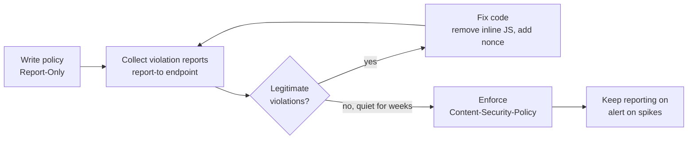

# Security headers & dependency scanning

!!! abstract "Key takeaways"
    - **Security headers** tell the browser to restrict what a page can do. The high-value set: **Content-Security-Policy** (nonce- or hash-based `script-src`, `frame-ancestors`, `object-src 'none'`), **Strict-Transport-Security**, **X-Content-Type-Options: nosniff**, **Referrer-Policy**, **Permissions-Policy**, plus `Cache-Control: no-store` on sensitive responses.
    - **Spring Security 6 defaults:** `Cache-Control`/`Pragma`/`Expires` no-cache, `X-Content-Type-Options: nosniff`, `Strict-Transport-Security: max-age=31536000 ; includeSubDomains` (HTTPS only), `X-Frame-Options: DENY`, `X-XSS-Protection: 0`. **CSP is not set by default**: you add it.
    - `X-XSS-Protection` is obsolete (set `0`); `frame-ancestors` in CSP supersedes `X-Frame-Options`. Roll CSP out with **`Content-Security-Policy-Report-Only`** first.
    - **Dependency scanning (SCA)** matches your dependency tree, including **transitive** dependencies, against vulnerability databases (NVD, GitHub Advisory Database, OSV). Most of your code is other people's code: typical Java and npm apps are mostly third-party libraries.
    - Make it a pipeline: **SBOM** (CycloneDX/SPDX) per build, SCA gate on new high/critical issues, automated update PRs (Dependabot/Renovate), lockfiles, and **prioritise by reachability and exploitation** (CISA KEV, EPSS), not CVSS alone.

## Why it matters

Headers and dependency scanning cover two different [OWASP Top 10:2025](01-owasp-top-10.md) categories that both come down to "the defaults weren't good enough":

- **A02 Security Misconfiguration:** a missing CSP or HSTS header turns an XSS bug or a coffee-shop network into a breach.
- **A03 Software Supply Chain Failures:** a vulnerable or malicious library you never directly chose. Log4Shell (CVE-2021-44228, December 2021) was mostly a *transitive* dependency; teams that had an SBOM could answer "are we affected?" in minutes, others took weeks.

Both are cheap to adopt and easy to automate, which is why interviewers expect a senior engineer to have opinions on them.

## Core concepts

### The headers and what each stops

{ loading=lazy }
*Each header closes one specific door. CSP is the only one that limits the damage of an XSS bug that already got through.*

| Header | Stops | Recommended value |
|---|---|---|
| `Content-Security-Policy` | Execution of injected script, data exfiltration to unknown hosts, clickjacking (`frame-ancestors`) | `default-src 'self'; script-src 'nonce-{random}' 'strict-dynamic'; object-src 'none'; base-uri 'none'; frame-ancestors 'none'` |
| `Strict-Transport-Security` | SSL stripping, accidental HTTP | `max-age=31536000; includeSubDomains` (add `preload` once sure) |
| `X-Content-Type-Options` | MIME sniffing a user upload into script/HTML | `nosniff` |
| `X-Frame-Options` | Clickjacking in older browsers | `DENY` (CSP `frame-ancestors` supersedes it) |
| `Referrer-Policy` | Tokens and IDs in URLs leaking to other sites | `strict-origin-when-cross-origin` (browser default) or `no-referrer` |
| `Permissions-Policy` | Third-party or injected script using camera, geolocation, payment | `camera=(), microphone=(), geolocation=()` |
| `Cache-Control` | Sensitive pages stored in shared or browser caches | `no-store` on authenticated responses |
| `Cross-Origin-Opener-Policy` | Cross-window attacks (XS-Leaks), needed for isolation | `same-origin` |
| `X-XSS-Protection` | Nothing useful now; the old auditor created leaks | `0` |

### Content Security Policy in depth

CSP is an allow-list of where the browser may load and execute resources from. Two styles:

- **Allow-list of hosts** (`script-src 'self' cdn.example.com`): easy to start but often bypassable through JSONP endpoints or old library versions on an allowed CDN. Google's research found most host-based policies offered little protection.
- **Strict CSP** (`script-src 'nonce-r4nd0m' 'strict-dynamic'`): only scripts carrying this response's random nonce (or a known hash) run; `'strict-dynamic'` lets those trusted scripts load further scripts. Inline event handlers and injected `<script>` tags without the nonce are blocked. This is what OWASP and Google recommend.

For a static React SPA served from a CDN, per-response nonces are awkward; use **hashes** of the few inline scripts (or none) with `script-src 'self'`, and avoid inline scripts in the build. For SSR (Next.js, Spring-rendered pages), generate a nonce per response.


*Notice that the policy is enforced only after reports go quiet: switching straight to enforcement breaks analytics, widgets and inline scripts you forgot about.*

### HSTS

HSTS tells the browser: for `max-age` seconds, only ever use HTTPS for this host (and subdomains with `includeSubDomains`). It defeats SSL-stripping on the *next* visit; the first visit is protected only if the domain is on the browser **preload list** (`preload` directive plus submission to hstspreload.org). Preload is hard to undo, so make sure every subdomain serves HTTPS first. Browsers ignore HSTS sent over plain HTTP, which is why Spring only writes it on HTTPS requests; behind a TLS-terminating load balancer, configure `server.forward-headers-strategy` so Spring knows the original request was HTTPS (or set HSTS at the edge).

### Dependency scanning (SCA)

Software composition analysis reads your **resolved** dependency graph (Maven/Gradle, `package-lock.json`, container image packages) and matches each component and version against vulnerability data.

| Tool | Ecosystems | Data source | Notes |
|---|---|---|---|
| OWASP Dependency-Check | Java, .NET, JS and more | NVD (API key strongly recommended since v9) | Maven/Gradle plugins, free |
| GitHub Dependabot | Most | GitHub Advisory Database | Alerts plus automatic update PRs |
| Renovate | Most | Registries plus advisories | Highly configurable grouping, schedules |
| `npm audit` / `pnpm audit` | npm | GitHub Advisory Database | Built in; noisy for dev deps |
| OSV-Scanner | Most | OSV.dev (aggregates GHSA, PyPI, Go, etc.) | Lockfile and SBOM scanning |
| Trivy / Grype | Container images, OS packages, SBOMs | Multiple | Scan the image you actually ship |
| Snyk, Sonatype, Mend | Most | Commercial plus public | Reachability analysis, licence policies |

An **SBOM** (Software Bill of Materials) is the machine-readable inventory of every component in a build: CycloneDX (OWASP) or SPDX (Linux Foundation, ISO/IEC 5962). Generate it at build time, store it with the artifact, and you can re-scan old releases when a new CVE appears without rebuilding. US Executive Order 14028 (2021) made SBOMs an expectation for software sold to the US government.

{ loading=lazy }
*The exposure window is the time from disclosure to deployed fix. Inventory and automation shrink it; the vulnerability is the same in both lanes.*

### Prioritising findings

A large Java app can report hundreds of CVEs, most not exploitable in context. Triage in this order:

1. **Known exploited** (CISA KEV catalogue) and high **EPSS** (probability of exploitation in the next 30 days).
2. **Reachable**: is the vulnerable function actually called, and is the input attacker-controlled? A Jackson polymorphic-typing CVE matters only if default typing is enabled.
3. **Exposure**: internet-facing service vs internal batch job.
4. **CVSS severity** as a tiebreaker, not the only signal.

Record decisions (VEX: Vulnerability Exploitability eXchange, or suppression files with an expiry date and reason) so the same finding isn't re-triaged every build.

### Beyond CVEs: supply chain integrity

Known vulnerabilities are only half of [A03](01-owasp-top-10.md). Malicious packages (typosquats, hijacked maintainer accounts, the 2025 Shai-Hulud npm worm, the 2024 xz-utils backdoor) have no CVE when they arrive. Controls: lockfiles and `npm ci`, pinned versions, a private registry/proxy (Artifactory, Nexus, CodeArtifact), a delay before adopting brand-new versions, `ignore-scripts` for npm installs where possible, signed artifacts and provenance (Sigstore, SLSA), and least-privilege CI tokens.

## In practice: code & configuration

### Headers in Spring Security 6

=== "❌ Common mistake"
    ```java
    @Bean
    SecurityFilterChain web(HttpSecurity http) throws Exception {
        return http
            .headers(h -> h.disable())          // "the iframe embed didn't work", so all headers went
            .authorizeHttpRequests(a -> a.anyRequest().authenticated())
            .build();
    }
    ```

=== "✅ Correct approach"
    ```java
    @Bean
    SecurityFilterChain web(HttpSecurity http) throws Exception {
        return http
            .headers(h -> h
                // Defaults (nosniff, HSTS, X-Frame-Options DENY, no-cache, X-XSS-Protection 0) stay on.
                .contentSecurityPolicy(csp -> csp.policyDirectives(
                    "default-src 'self'; script-src 'self'; object-src 'none'; base-uri 'none'; "
                  + "frame-ancestors 'self' https://portal.partner.example; report-to csp"))  // allow one embedder
                .frameOptions(f -> f.sameOrigin())    // legacy fallback; CSP frame-ancestors wins where supported
                .referrerPolicy(r -> r.policy(ReferrerPolicy.STRICT_ORIGIN_WHEN_CROSS_ORIGIN))
                .permissionsPolicyHeader(p -> p.policy("camera=(), microphone=(), geolocation=()"))
                .httpStrictTransportSecurity(hsts -> hsts.includeSubDomains(true).maxAgeInSeconds(31536000)))
            .authorizeHttpRequests(a -> a.anyRequest().authenticated())
            .build();
    }
    ```

For a React SPA served by a CDN, set the same headers at the edge (CloudFront response headers policy, Nginx `add_header … always`, ingress annotations), since the API's headers don't apply to the HTML document. Pure JSON APIs mostly need `nosniff`, `Cache-Control: no-store` for sensitive data, HSTS, and a restrictive `default-src 'none'; frame-ancestors 'none'` CSP.

Check with `curl -sI https://app.example.com` or Mozilla's HTTP Observatory, and add an integration test so headers can't silently disappear:

```java
@SpringBootTest
@AutoConfigureMockMvc
class SecurityHeadersTest {
    @Autowired MockMvc mvc;

    @Test
    @WithMockUser
    void sendsSecurityHeaders() throws Exception {
        mvc.perform(get("/api/claims").secure(true))
           .andExpect(header().string("X-Content-Type-Options", "nosniff"))
           .andExpect(header().exists("Strict-Transport-Security"))
           .andExpect(header().string("Content-Security-Policy", containsString("object-src 'none'")));
    }
}
```

### Dependency scanning in the pipeline (Maven + GitLab CI)

```xml
<!-- pom.xml: SBOM on every build, Dependency-Check as a gate -->
<plugin>
  <groupId>org.cyclonedx</groupId>
  <artifactId>cyclonedx-maven-plugin</artifactId>
  <executions>
    <execution><phase>package</phase><goals><goal>makeAggregateBom</goal></goals></execution>
  </executions>
</plugin>
<plugin>
  <groupId>org.owasp</groupId>
  <artifactId>dependency-check-maven</artifactId>
  <configuration>
    <failBuildOnCVSS>7</failBuildOnCVSS>                           <!-- gate on high/critical -->
    <nvdApiKeyEnvironmentVariable>NVD_API_KEY</nvdApiKeyEnvironmentVariable>
    <suppressionFile>dependency-check-suppressions.xml</suppressionFile> <!-- reasoned, expiring -->
  </configuration>
</plugin>
```

```yaml
# .gitlab-ci.yml (fragment)
sca:
  stage: test
  script:
    - mvn -B verify -DskipTests org.owasp:dependency-check-maven:check
    - npm ci --ignore-scripts && npm audit --omit=dev --audit-level=high
    - trivy image --exit-code 1 --severity CRITICAL,HIGH "$IMAGE"
  artifacts:
    paths: [target/bom.json, target/dependency-check-report.html]
```

=== "❌ Common mistake"
    ```xml
    <!-- Overriding a transitive version by hand and forgetting it for two years -->
    <dependency>
      <groupId>com.fasterxml.jackson.core</groupId>
      <artifactId>jackson-databind</artifactId>
      <version>2.9.8</version>
    </dependency>
    ```

=== "✅ Correct approach"
    ```xml
    <!-- Let the Spring Boot parent/BOM manage versions; bump Boot regularly via Renovate/Dependabot. -->
    <parent>
      <groupId>org.springframework.boot</groupId>
      <artifactId>spring-boot-starter-parent</artifactId>
      <version>3.5.6</version>
    </parent>
    <!-- If a transitive fix can't wait for Boot, override via a property with a comment and a ticket: -->
    <properties>
      <!-- CVE-XXXX-YYYY, remove after Boot 3.5.x includes it (TICKET-123) -->
      <jackson-bom.version>2.19.2</jackson-bom.version>
    </properties>
    ```

The version numbers above are illustrative; take them from the current Boot release notes.

## Real-world usage

- **Equifax (2017):** an unpatched Apache Struts vulnerability (CVE-2017-5638), with a patch available about two months before the breach. The US GAO report is a standard reference for "why patch cadence matters".
- **Log4Shell (2021):** organisations with SBOMs and SCA answered "where do we use Log4j 2?" quickly; others grepped JARs inside fat JARs and images for weeks. Spring Boot's default logging is Logback, so many Boot apps were unaffected unless they switched to Log4j 2.
- **Header adoption:** large sites (Google, GitHub) run strict, nonce-based CSPs and publish their approach; Mozilla's HTTP Observatory grades sites on these headers.
- **Healthcare and banking:** auditors and customer questionnaires ask for SCA evidence, SBOMs and patch SLAs (for example critical within 15–30 days). Having reports as CI artifacts makes that evidence free.

## Trade-offs & production gotchas

| Choice | Pros | Cons | Use when |
|---|---|---|---|
| Host allow-list CSP | Easy start | Often bypassable via allowed hosts | Transitional step |
| Nonce/hash strict CSP | Strong XSS mitigation | Needs build/SSR support, no inline handlers | New apps, SSR |
| HSTS with `preload` | Protects first visit | Hard to reverse; all subdomains must do HTTPS | Mature HTTPS-only domains |
| Fail build on any CVE | Simple rule | Blocks delivery on unreachable findings | Small codebases |
| Fail on new high/critical, track the rest | Practical | Needs triage discipline | Most teams |
| Dependabot/Renovate auto-PRs | Small, frequent upgrades | PR noise without grouping and tests | Always, with good test coverage |

!!! warning "Gotcha: headers on error and redirect responses"
    Nginx `add_header` without `always` skips 4xx/5xx responses, and some gateways strip or duplicate headers. Test the headers on error pages and redirects too.

!!! warning "Gotcha: scanning source, not the image"
    The JAR may be clean while the base image has a vulnerable OpenSSL or glibc. Scan the built image (Trivy/Grype), use minimal or distroless bases, and rebuild regularly even when your code hasn't changed.

!!! tip "Interview framing"
    "Headers are cheap, defence-in-depth controls; CSP is the one that matters most and needs a report-only rollout. For dependencies, I want an SBOM per build, an SCA gate on new high-risk issues, automatic update PRs, and triage by exploitability and reachability."

## How this connects to my experience

- **Where I used it:** not a single resume bullet; position as applied knowledge. Relevant: "Established engineering standards around testing, CI/CD, code quality, and deployment practices" (OptumRx Meteor), "Implemented Spring Security authorization controls and API security mechanisms" (Johnson Controls, Metasys), and GitLab CI/CD and Jenkins in the skills list.
- **Talking points:**
    - Meteor CI standards as the place where SCA and SBOM gates belong. *[confirm: which scanner ran (Snyk, Dependabot, Sonar, Dependency-Check, Checkmarx, Black Duck) and whether builds failed on high/critical]*
    - Security headers for the React app: set at the CDN/edge or by the serving layer. *[confirm: how the React app was hosted and whether a CSP was configured]*
    - Upgrades: Spring Boot version bumps as the main vehicle for patching transitive dependencies. *[confirm: patch cadence or SLA for critical CVEs]*
- **Likely follow-up chain:** "What headers would you set?" → "How do you roll out CSP without breaking things?" → "How did you handle Log4Shell?" → "How do you avoid alert fatigue from SCA?" Answer with the default set plus CSP, report-only first, SBOM-driven impact search, and KEV/EPSS/reachability triage with expiring suppressions. *[confirm: what you actually did for Log4Shell in December 2021 at Deloitte]*

## Interview questions

### Fundamentals

??? question "Q1. Which security headers would you set on a web application and why?"
    **Answer:** CSP (restrict script sources, `object-src 'none'`, `frame-ancestors`), HSTS (force HTTPS), `X-Content-Type-Options: nosniff` (no MIME sniffing), `Referrer-Policy` (don't leak URLs), `Permissions-Policy` (disable unused features), `Cache-Control: no-store` for sensitive responses. `X-Frame-Options` for older browsers; `X-XSS-Protection: 0`.

    **Interviewer listens for:** CSP first, each header tied to an attack.

    **Common wrong answer:** Listing `X-XSS-Protection: 1; mode=block` as important.

??? question "Q2. What is software composition analysis?"
    **Answer:** Automated identification of third-party components (including transitive ones) in your build and matching them against vulnerability and licence databases. It runs in CI and on SBOMs, and produces findings plus upgrade suggestions.

    **Interviewer listens for:** transitive dependencies, CI integration.

    **Common wrong answer:** "It scans our own code for bugs." (That's SAST.)

??? question "Q3. What is an SBOM and why does it matter?"
    **Answer:** A Software Bill of Materials: a machine-readable inventory of components and versions in a build (CycloneDX or SPDX). It lets you answer "are we affected?" instantly when a new CVE appears, supports customer and regulatory requirements, and enables re-scanning old releases.

    **Interviewer listens for:** incident response speed, standard formats.

    **Common wrong answer:** "It's the `pom.xml`." (Declared deps, not the resolved transitive tree.)

### Intermediate

??? question "Q4. How does CSP mitigate XSS, and why prefer nonces over host allow-lists?"
    **Answer:** The browser only executes scripts permitted by the policy, so an injected inline script or event handler is blocked. Host allow-lists are often bypassable through JSONP or outdated libraries on allowed domains; a nonce (random per response) or hash ties permission to specific script content, and `'strict-dynamic'` propagates trust to scripts they load.

    **Interviewer listens for:** per-response nonce, bypassable allow-lists.

    **Common wrong answer:** "CSP prevents XSS completely, so encoding isn't needed."

??? question "Q5. Why doesn't HSTS protect the very first visit, and what fixes that?"
    **Answer:** The browser only learns the policy from an HTTPS response, so a first visit typed as `http://` can be intercepted. The preload list, built into browsers, closes that gap; it requires `includeSubDomains`, `preload`, a long `max-age`, and submission. It's hard to reverse.

    **Interviewer listens for:** trust on first use, preload trade-off.

    **Common wrong answer:** "HSTS encrypts traffic."

??? question "Q6. How do you deal with hundreds of SCA findings?"
    **Answer:** Fix what's known exploited (CISA KEV) and likely exploited (EPSS) first, then reachable and internet-exposed, using CVSS as a tiebreaker. Upgrade the framework BOM to clear many at once; suppress unreachable ones with a reason and expiry (or VEX); gate the build only on new high-risk findings so the backlog shrinks without blocking delivery.

    **Interviewer listens for:** risk-based triage, expiring suppressions, BOM upgrades.

    **Common wrong answer:** "Fix them in CVSS order."

### Senior

??? question "Q7. How would you roll out CSP across an existing React and Spring application?"
    **Answer:** Inventory scripts and third parties; deploy `Content-Security-Policy-Report-Only` with a reporting endpoint; remove inline scripts and handlers, add nonces or hashes; iterate until reports are quiet (filtering extension noise); then enforce, keep reporting, and alert on spikes. Add tests asserting the header and lint rules against inline scripts.

    **Interviewer listens for:** report-only, iteration, monitoring after enforcement.

    **Common wrong answer:** "Turn on a strict policy in production and fix what breaks."

??? question "Q8. Dependency scanning only finds known CVEs. How do you defend against malicious packages?"
    **Answer:** Lockfiles and `npm ci`, pinned and reviewed upgrades, a proxy registry with policies (block new versions for a few days, block typosquats), disable install scripts where possible, minimal CI token permissions, artifact signing and provenance (Sigstore, SLSA), and monitoring for unexpected network calls in builds.

    **Interviewer listens for:** supply-chain integrity beyond CVEs.

    **Common wrong answer:** "Snyk catches those."

### Scenario-based

??? question "Q9. A critical CVE in a widely used Java library is announced on Friday afternoon. What happens next?"
    **Answer:** Query SBOMs or the SCA platform for affected versions across services and images; assess exposure and reachability; apply mitigations (WAF rule, config flag, disabling a feature) where immediate; upgrade via BOM override or library bump, run tests, deploy prioritising internet-facing services; check logs for exploitation indicators; communicate status. Afterwards, close inventory gaps you found.

    **Interviewer listens for:** inventory first, mitigation vs patch, forensics, comms.

    **Common wrong answer:** "Wait for the next Spring Boot release."

??? question "Q10. A partner needs to embed your app in an iframe and the team proposes disabling headers. What do you do?"
    **Answer:** Keep the headers and allow exactly that embedder: CSP `frame-ancestors 'self' https://partner.example` (with `X-Frame-Options` removed or `SAMEORIGIN` as fallback for old browsers), consider `SameSite=None; Secure` implications for cookies inside the iframe, and add clickjacking-sensitive confirmations for critical actions.

    **Interviewer listens for:** targeted allowance, cookie implications.

    **Common wrong answer:** "`headers().disable()`."

## Cheat sheet

| Concept | Remember |
|---|---|
| Spring defaults | no-cache, nosniff, HSTS (HTTPS only), X-Frame-Options DENY, X-XSS-Protection 0 |
| Not default | CSP, Referrer-Policy override, Permissions-Policy |
| Strict CSP | `script-src 'nonce-…' 'strict-dynamic'; object-src 'none'; base-uri 'none'` |
| CSP rollout | Report-Only → fix → enforce → keep reporting |
| Clickjacking | CSP `frame-ancestors` supersedes X-Frame-Options |
| HSTS | Not first visit; preload fixes that, hard to undo |
| SCA | Resolved transitive tree vs NVD/GHSA/OSV |
| SBOM | CycloneDX or SPDX, per build, stored with the artifact |
| Triage | KEV → EPSS → reachability → exposure → CVSS |
| Supply chain | Lockfiles, proxy registry, provenance, minimal CI tokens |

## Sources

1. [Spring Security reference: Security HTTP Response Headers](https://docs.spring.io/spring-security/reference/features/exploits/headers.html): default header block and values.
2. [Spring Security reference: Headers (servlet configuration)](https://docs.spring.io/spring-security/reference/servlet/exploits/headers.html): CSP, HSTS, frame options and Permissions-Policy configuration.
3. [OWASP HTTP Headers Cheat Sheet](https://cheatsheetseries.owasp.org/cheatsheets/HTTP_Headers_Cheat_Sheet.html): recommended values, deprecated headers.
4. [OWASP Content Security Policy Cheat Sheet](https://cheatsheetseries.owasp.org/cheatsheets/Content_Security_Policy_Cheat_Sheet.html): strict CSP, nonces, hashes, rollout.
5. [web.dev: Mitigate XSS with a strict CSP](https://web.dev/articles/strict-csp): nonce and `'strict-dynamic'` approach, weaknesses of allow-lists.
6. [MDN: Strict-Transport-Security](https://developer.mozilla.org/en-US/docs/Web/HTTP/Reference/Headers/Strict-Transport-Security): HSTS semantics and preload.
7. [OWASP Dependency-Check](https://owasp.org/www-project-dependency-check/): SCA tool and NVD usage.
8. [CycloneDX specification](https://cyclonedx.org/specification/overview/): SBOM format.
9. [CISA Known Exploited Vulnerabilities Catalog](https://www.cisa.gov/known-exploited-vulnerabilities-catalog) and [FIRST EPSS](https://www.first.org/epss/): exploitation-based prioritisation.
10. [OWASP Top 10:2025 A03 Software Supply Chain Failures](https://top10.owasp.org/2025/A03_2025-Software_Supply_Chain_Failures/): supply-chain controls.
11. [US GAO-18-559: Equifax data breach](https://www.gao.gov/products/gao-18-559): unpatched Struts vulnerability.
12. [Apache Log4j security vulnerabilities](https://logging.apache.org/security.html): CVE-2021-44228 details.
