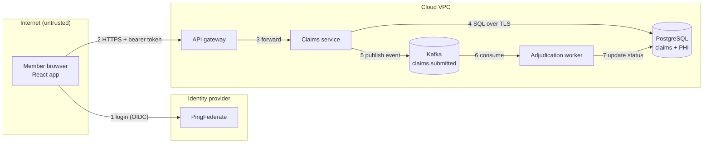

# Threat modelling basics

!!! abstract "Key takeaways"
    - Threat modelling is structured thinking about **what can go wrong** in a design, done early and repeated as the design changes. It's the main control for [A06 Insecure Design](01-owasp-top-10.md), which no scanner finds.
    - Use Adam Shostack's **four questions**: *What are we working on? What can go wrong? What are we going to do about it? Did we do a good enough job?*
    - Model the system as a **data-flow diagram** (DFD): external entities, processes, data stores, data flows, and **trust boundaries**. Threats concentrate where data crosses a boundary.
    - **STRIDE** prompts for threats per element: **S**poofing (authentication), **T**ampering (integrity), **R**epudiation (non-repudiation/audit), **I**nformation disclosure (confidentiality), **D**enial of service (availability), **E**levation of privilege (authorisation).
    - Output is **actions**, not a document: each threat gets a decision (mitigate, eliminate, transfer, accept with an owner) and mitigations become backlog items with tests. Keep it lightweight: an hour per feature beats a 40-page model nobody updates.

## Why it matters

Most of the expensive security bugs are design bugs: a password-reset flow with no rate limit, an internal API that trusts a `userId` header from anywhere, an export job that writes unencrypted PHI to a shared bucket. Fixing those after release means redesign, migration and sometimes breach notification. Fixing them on a whiteboard costs an hour.

OWASP added **Insecure Design** to the Top 10 in 2021 specifically to push threat modelling and secure design patterns "left". Regulated customers increasingly ask for it: healthcare and finance security reviews ask whether new features get a security design review, and the US FDA expects threat models in premarket submissions for connected medical devices.

In interviews, threat modelling questions test whether you think like an attacker at the design stage and can turn that into concrete engineering work, which is exactly what a technical lead does in design reviews.

## Core concepts

### The four questions

{ loading=lazy }
*The loop matters more than any single pass: re-run it when the design changes, not on a calendar.*

From the **Threat Modeling Manifesto** (2020) and Shostack's *Threat Modeling: Designing for Security*:

1. **What are we working on?** Draw the system: a DFD, sequence diagram or architecture sketch. Agree on scope, assets (PHI, payment data, credentials) and assumptions.
2. **What can go wrong?** Use a structure such as STRIDE, attack trees, abuse cases or a library like OWASP's or MITRE ATT&CK/CAPEC to generate threats.
3. **What are we going to do about it?** For each threat: mitigate, eliminate (remove the feature or data), transfer (to a provider, insurance) or accept with a named owner.
4. **Did we do a good enough job?** Review coverage, check that mitigations were built and tested, and update the model when the design changes.

### Data-flow diagrams and trust boundaries

| DFD element | Shape (conventional) | Example |
|---|---|---|
| External entity | Rectangle | Member's browser, PingFederate, partner system |
| Process | Circle / rounded box | Claims API, GraphQL gateway, Kafka consumer |
| Data store | Parallel lines / cylinder | PostgreSQL, S3 bucket, Redis, Kafka topic |
| Data flow | Arrow | HTTPS request, Kafka event, JDBC query |
| Trust boundary | Dashed line | Internet ↔ VPC, service ↔ database, tenant ↔ tenant |

A **trust boundary** is any place where the level of trust changes: different principals, privilege levels, networks or organisations. Every flow that crosses one deserves STRIDE questions.


*Notice the boundaries: flow 2 crosses from the internet into the VPC, flow 1 crosses to a third party, and flows 5–7 cross between services that each need to authenticate and validate what they receive.*

{ loading=lazy }
*STRIDE letters cluster on the arrows that cross dashed lines: that's where to spend the hour.*

### STRIDE

STRIDE was created at Microsoft in 1999 (Loren Kohnfelder and Praerit Garg). Each letter is the violation of a security property:

| Threat | Property violated | Question to ask | Typical mitigations |
|---|---|---|---|
| **S**poofing | Authentication | Can someone pretend to be a user, service or server? | OIDC/OAuth2, mTLS between services, signed tokens, MFA |
| **T**ampering | Integrity | Can data be modified in transit or at rest? | TLS, signatures/HMAC, DB permissions, immutable logs |
| **R**epudiation | Non-repudiation | Can someone deny doing something because we can't prove it? | Audit logs with identity and time, tamper-evident storage |
| **I**nformation disclosure | Confidentiality | Can data leak to someone not authorised? | Authorisation per object, encryption, minimisation, error hygiene |
| **D**enial of service | Availability | Can someone exhaust or block the service? | Rate limits, quotas, timeouts, autoscaling, backpressure |
| **E**levation of privilege | Authorisation | Can someone do more than allowed? | Least privilege, server-side checks, input validation, sandboxing |

Applying it **per element** (STRIDE-per-element) keeps it manageable: external entities mostly face S and R; processes face all six; data stores face T, I, D (and R for logs); data flows face T, I, D.

### Ranking and deciding

You'll find more threats than you can fix. Rank them simply:

- **Likelihood × impact** on a 3×3 grid (low/medium/high) is enough for most teams.
- **DREAD** (Damage, Reproducibility, Exploitability, Affected users, Discoverability) was used at Microsoft but dropped there as too subjective; mention it, don't rely on it.
- **CVSS** scores vulnerabilities in existing software, not design threats; don't force it onto a whiteboard model.

Then decide: **mitigate** (most), **eliminate** (don't store the SSN at all), **transfer** (let the IdP handle MFA), or **accept** (documented, owned, revisited).

### Other techniques worth naming

- **Attack trees** (Bruce Schneier, 1999): a goal at the root ("read another member's claims"), ways to achieve it as branches. Good for one high-value asset.
- **PASTA** (Process for Attack Simulation and Threat Analysis): a seven-stage, risk-centric method tied to business objectives. Heavier.
- **LINDDUN:** privacy threats (Linkability, Identifiability, Non-repudiation, Detectability, Disclosure, Unawareness, Non-compliance). Useful for PHI/GDPR features.
- **Abuse cases / evil user stories:** "As an attacker, I want to enumerate claim IDs so I can read others' claims." These fit naturally into agile backlogs.
- **Tools:** OWASP Threat Dragon, Microsoft Threat Modeling Tool, `pytm`/Threagile (threat models as code). A whiteboard photo and a table in the design doc are fine.

## In practice: code & configuration

Threat modelling is mostly a process, but its output should land in code and tests. A worked example for one feature: *members download a PDF of their claim history*.

**1. What are we working on?** React → API gateway → Claims service → PostgreSQL; a PDF generator writes to S3; the member gets a pre-signed URL.

**2. What can go wrong? (STRIDE excerpt)**

| # | Element | STRIDE | Threat | Rank |
|---|---|---|---|---|
| T1 | `GET /exports/{id}` | I, E | Member requests another member's export by guessing the ID (IDOR) | High |
| T2 | S3 pre-signed URL | I | URL forwarded or logged; valid for days | Medium |
| T3 | Export endpoint | D | Member triggers thousands of exports, exhausting the PDF workers | Medium |
| T4 | PDF generator | T, E | Member name containing HTML/JS injected into the PDF HTML template | Medium |
| T5 | Export action | R | Member claims they never downloaded the data; no audit record | Low |

**3. What are we going to do about it?** Each mitigation becomes a story with an acceptance test:

=== "❌ Threat model as a document"
    ```text
    Threat model v1 (Confluence, 2023-03-02)
    - IDOR possible. Recommendation: add authorisation.
    - DoS possible. Recommendation: consider rate limiting.
    Status: reviewed.
    ```

=== "✅ Threats become tested backlog items"
    ```java
    // T1: object-level authorisation, enforced in the query and covered by a cross-user test.
    @Test
    void memberCannotDownloadAnotherMembersExport() throws Exception {
        UUID aliceExport = exports.createFor("member-alice");
        mvc.perform(get("/api/exports/{id}", aliceExport).with(jwt().jwt(j -> j.claim("member_id", "member-bob"))))
           .andExpect(status().isNotFound());                     // 404, not 403: don't confirm existence
    }

    // T2: short-lived pre-signed URL, never logged.
    PresignedGetObjectRequest url = presigner.presignGetObject(r -> r
            .signatureDuration(Duration.ofMinutes(5))
            .getObjectRequest(g -> g.bucket(bucket).key(key)));

    // T3: per-member rate limit on export creation (e.g. Bucket4j, or the API gateway's usage plan).
    // T4: render the PDF template with a context-escaping engine (Thymeleaf th:text), never string concatenation.
    // T5: audit event {memberId, exportId, action=DOWNLOAD, ts, sourceIp} to an append-only store.
    ```

**4. Did we do a good enough job?** Tests T1–T5 pass in CI; the model is linked from the design doc and the PR; a follow-up is scheduled for when exports become shareable with caregivers (a new trust boundary).

## Real-world usage

- **Microsoft SDL** made threat modelling a mandatory design-phase activity, and STRIDE came out of that work. Microsoft's Threat Modeling Tool still uses STRIDE-per-element on DFDs.
- **Agile teams** keep it lightweight: a 30–60 minute session per significant feature (new external interface, new data store, new trust boundary, new sensitive data), with the output as tickets. OWASP's Threat Modeling Cheat Sheet recommends integrating it into the SDLC rather than doing it once.
- **Threat modelling as code:** some teams keep models in the repo (pytm, Threagile) so they're reviewed in PRs and diffed when the architecture changes.
- **Healthcare and banking:** the assets drive the model: PHI, payment data, credentials, audit logs. Repudiation matters more than in consumer apps because regulators expect proof of who accessed what (HIPAA audit controls). Third-party integrations (clearing houses, payment processors, identity providers) are where trust boundaries multiply.

## Trade-offs & production gotchas

| Approach | Pros | Cons | Use when |
|---|---|---|---|
| Lightweight four questions + STRIDE per feature | Fast, repeatable, team-owned | Depends on facilitator skill | Default for product teams |
| Full system model with tooling | Comprehensive, auditable | Expensive, goes stale | Regulated systems, major architecture changes |
| Attack trees | Deep on one goal | Narrow | Protecting one critical asset |
| PASTA | Ties to business risk | Heavyweight | Large programmes with security teams |
| LINDDUN | Privacy coverage | Extra pass | PHI, personal data features |
| Threat model as code | Versioned with the system | Tool learning curve | Platform teams, many services |

!!! warning "Gotcha: modelling once"
    A threat model from the initial design review is wrong by the third sprint. Trigger re-modelling on design changes (new endpoint exposed externally, new data store, new integration, new data classification), not on a schedule.

!!! warning "Gotcha: only security people in the room"
    The engineers who build the feature know where the shortcuts are. Run sessions with developers, QA and a product owner; a security champion facilitates.

!!! tip "Interview framing"
    "I draw a DFD, mark trust boundaries, walk STRIDE per element on the flows that cross them, rank by likelihood and impact, and turn the top threats into stories with tests. Then I re-run it when the design changes."

## How this connects to my experience

- **Where I used it:** not a resume bullet as such; position as applied knowledge from design work: "Collaborated with senior architects to design scalable service architecture, API strategies, and data integration patterns" and "Owned the GraphQL Consumer Service end-to-end, acting as the integration layer between 5 upstream systems and multiple downstream consumers" (OptumRx Meteor), plus "Mentored 5+ engineers through code reviews, design reviews".
- **Talking points:**
    - The GraphQL Consumer Service sits on several trust boundaries at once: browser to service, service to 5 upstreams, PingFederate/AD for identity. STRIDE on those flows: spoofed upstream responses, query-depth DoS, per-member authorisation in resolvers. *[confirm: whether a formal security design review or threat model was done for the service, and by whom]*
    - Kafka retry/DLQ workflows: tampering and information disclosure on topics (ACLs, encryption, PHI in DLQ messages). *[confirm: whether Kafka ACLs/TLS were in place and whether DLQ payloads contained PHI]*
    - CCKM: key-management features are a natural STRIDE example (spoofing the cloud API caller, elevation via over-broad KMS permissions, repudiation of key deletions). *[confirm: whether CCKM had a documented threat model]*
- **Likely follow-up chain:** "Have you done threat modelling?" → "Walk me through one" → "What was the top threat and what did you change?" → "How do you keep it current?" If you haven't run a formal one, say so and walk through how you'd model the GraphQL service live using the four questions; it's better than inventing one.

## Interview questions

### Fundamentals

??? question "Q1. What is threat modelling and when do you do it?"
    **Answer:** A structured way to identify what can go wrong in a system's design and decide what to do about it. Do it during design (before code), and again when the design changes: new external interface, data store, integration or sensitive data type.

    **Interviewer listens for:** early, iterative, outputs decisions.

    **Common wrong answer:** "It's a pen test before release."

??? question "Q2. What does STRIDE stand for?"
    **Answer:** Spoofing (authentication), Tampering (integrity), Repudiation (non-repudiation), Information disclosure (confidentiality), Denial of service (availability), Elevation of privilege (authorisation). Each is the violation of a security property.

    **Interviewer listens for:** the property each letter maps to.

    **Common wrong answer:** Six words with no mapping to properties or mitigations.

??? question "Q3. What is a trust boundary?"
    **Answer:** A line in the system where the trust level changes: between the internet and your network, between a user and a service, between services with different privileges, between tenants, or between you and a third party. Data crossing it must be authenticated, authorised and validated.

    **Interviewer listens for:** examples beyond "the firewall".

    **Common wrong answer:** "The network perimeter."

### Intermediate

??? question "Q4. Walk me through threat modelling a new feature in one hour."
    **Answer:** Ten minutes drawing the DFD and listing assets; twenty minutes STRIDE on elements and flows that cross trust boundaries; ten minutes ranking by likelihood × impact; fifteen minutes deciding actions and writing tickets with acceptance tests; five minutes on what's out of scope and when to revisit.

    **Interviewer listens for:** timeboxing, focus on boundaries, tickets as output.

    **Common wrong answer:** "Fill in a template and send it to security."

??? question "Q5. How do you prioritise the threats you find?"
    **Answer:** Likelihood × impact with simple levels, informed by exposure (internet-facing?), asset sensitivity (PHI, money), attacker effort and existing controls. Mitigate highs before release, schedule mediums, and accept lows explicitly with an owner. DREAD exists but is subjective; CVSS is for vulnerabilities, not design threats.

    **Interviewer listens for:** pragmatic ranking, explicit acceptance.

    **Common wrong answer:** "Fix everything."

??? question "Q6. How does threat modelling relate to the OWASP Top 10?"
    **Answer:** It's the primary control for A06 Insecure Design, and it surfaces A01 (authorisation gaps), A07 (authentication flows), A09 (missing audit/alerting, i.e. repudiation) and A10 (failure modes) before they're coded. Scanners find implementation bugs; threat modelling finds missing controls.

    **Interviewer listens for:** design vs implementation flaws.

    **Common wrong answer:** "They're unrelated."

### Senior

??? question "Q7. How would you introduce threat modelling to a team that's never done it?"
    **Answer:** Start small: pick an upcoming feature, run a one-hour four-questions session with the whole team, keep the output in tickets. Train a security champion per team, define triggers (new boundary, new data class), add a design-doc section, and track mitigations to completion. Show value with one concrete finding fixed early.

    **Interviewer listens for:** lightweight, team-owned, triggers, champions.

    **Common wrong answer:** "Mandate a 30-page template for every change."

??? question "Q8. What's the difference between STRIDE, attack trees and PASTA?"
    **Answer:** STRIDE is a mnemonic for generating threats per element of a DFD; quick and broad. Attack trees decompose one attacker goal into ways to achieve it; deep and narrow. PASTA is a seven-stage, risk-centric methodology linking threats to business impact; comprehensive and heavy. Use STRIDE by default, attack trees for crown jewels, PASTA when the organisation needs business-risk alignment.

    **Interviewer listens for:** when to use which.

    **Common wrong answer:** "They're all the same thing."

### Scenario-based

??? question "Q9. Threat model a service-to-service call where the claims service trusts an `X-User-Id` header from the gateway."
    **Answer:** Spoofing: anything that can reach the claims service directly (another pod, SSRF) can set the header. Elevation: forge any user. Repudiation: logs record a forged ID. Mitigations: network policy so only the gateway can reach it, mTLS between services, and better, propagate the signed JWT and validate it in the service (or a gateway-signed internal token), never trust identity from a plain header.

    **Interviewer listens for:** network position isn't identity; signed tokens.

    **Common wrong answer:** "It's internal, so it's fine."

??? question "Q10. You're adding a feature that lets caregivers view a member's claims. What threats do you look for?"
    **Answer:** A new trust relationship: how is caregiver access granted, verified and revoked (spoofing, elevation)? Object-level checks now involve delegation (IDOR via a member ID the caregiver isn't linked to). Information disclosure scope (all claims or some; sensitive categories like mental health). Repudiation (audit who viewed what as whom). Privacy (LINDDUN, consent). DoS is minor. Mitigations: explicit delegation records with expiry, authorisation via a policy check including delegation, audit logs, consent capture.

    **Interviewer listens for:** delegation as a new boundary, audit, sensitive categories.

    **Common wrong answer:** "Give caregivers the member role."

## Cheat sheet

| Concept | Remember |
|---|---|
| Four questions | What are we working on? What can go wrong? What will we do? Did we do a good job? |
| DFD elements | External entity, process, data store, data flow, trust boundary |
| STRIDE | Spoofing/AuthN, Tampering/Integrity, Repudiation/Audit, Info disclosure/Confidentiality, DoS/Availability, EoP/AuthZ |
| Focus | Flows that cross trust boundaries |
| Rank | Likelihood × impact; DREAD is subjective; CVSS is for vulns |
| Decide | Mitigate, eliminate, transfer, accept (with owner) |
| Output | Tickets with tests, not a document |
| When | Design time + on change triggers |
| Other methods | Attack trees, PASTA, LINDDUN (privacy), abuse cases |
| Tools | Threat Dragon, MS Threat Modeling Tool, pytm, Threagile, whiteboard |

## Sources

1. [Threat Modeling Manifesto](https://www.threatmodelingmanifesto.org/): the four questions, values and principles.
2. [OWASP Threat Modeling Cheat Sheet](https://cheatsheetseries.owasp.org/cheatsheets/Threat_Modeling_Cheat_Sheet.html): DFDs, STRIDE, ranking, SDLC integration.
3. [OWASP Threat Modeling Process](https://owasp.org/www-community/Threat_Modeling_Process): decompose, determine threats, countermeasures.
4. [Microsoft: Threat Modeling Tool threats (STRIDE)](https://learn.microsoft.com/en-us/azure/security/develop/threat-modeling-tool-threats): STRIDE categories and per-element application.
5. Adam Shostack, *Threat Modeling: Designing for Security* (Wiley, 2014): four-question framework, STRIDE-per-element, DFDs.
6. [OWASP Top 10:2021 A04 Insecure Design](https://owasp.org/Top10/2021/A04_2021-Insecure_Design/): rationale for threat modelling and secure design patterns.
7. [Bruce Schneier, "Attack Trees", Dr. Dobb's Journal (1999)](https://www.schneier.com/academic/archives/1999/12/attack_trees.html): attack tree method.
8. [LINDDUN privacy threat modeling](https://linddun.org/): privacy threat categories.
9. [OWASP Threat Dragon](https://owasp.org/www-project-threat-dragon/): open-source modelling tool.
10. [US FDA: Cybersecurity in Medical Devices guidance (2023)](https://www.fda.gov/regulatory-information/search-fda-guidance-documents/cybersecurity-medical-devices-quality-system-considerations-and-content-premarket-submissions): threat modelling expected in premarket submissions.
