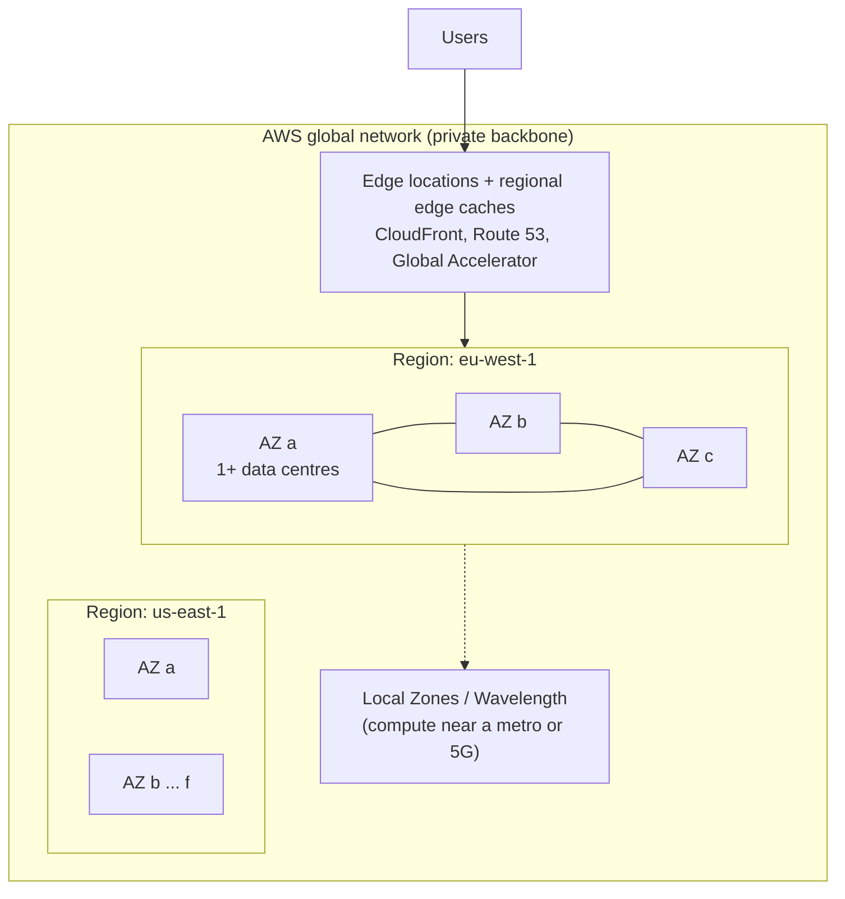
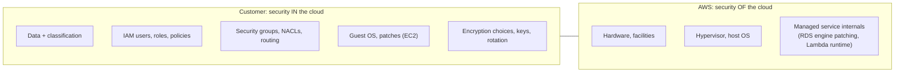

# Global Infrastructure & Well-Architected Framework

!!! abstract "TL;DR"
    - **Region:** a separate geographic area with its own control plane. Choose it by **data residency/compliance, latency to users, service availability and price**. Data doesn't leave a Region unless you move it.
    - **Availability Zone (AZ):** one or more data centres with independent power, cooling and networking, linked to the other AZs in the Region by low-latency links. Most Regions have 3 or more. **Multi-AZ is the default for anything production.**
    - **Edge locations** (CloudFront, Route 53, Global Accelerator) bring traffic closer to users. **Local Zones** and **Wavelength** put compute near specific cities or 5G networks. **Outposts** put AWS hardware in your data centre.
    - **Shared responsibility:** AWS secures *the cloud* (hardware, facilities, hypervisor, managed-service internals). You secure what you put *in* the cloud (data, IAM, network rules, OS patches on EC2, encryption choices). The line moves as services become more managed.
    - **Well-Architected's six pillars:** Operational Excellence, Security, Reliability, Performance Efficiency, Cost Optimisation, Sustainability. Use them as the checklist for every design answer and every trade-off.

## Why it matters

Every AWS design question starts here: "Where does this run, and what happens when part of it fails?" An interviewer who hears "I'd put it in two AZs behind an ALB, with RDS Multi-AZ, because a single AZ can fail" knows you've run production systems. Answers that never mention failure domains sound like tutorials.

The **Well-Architected Framework** gives your answer a structure. Instead of listing services, you explain decisions against pillars: "this improves reliability but costs more; here's why it's worth it for 750K healthcare users."

## Core concepts

### The physical hierarchy


*Notice the failure domains: an AZ failure should be absorbed **inside** a Region (Multi-AZ). Surviving a Region failure needs a deliberate **multi-Region** design (see DR in subtopic 12). Edge locations are for latency and DDoS absorption, not for running your app.*

| Construct | What it is | Failure domain | Typical use |
|---|---|---|---|
| Region | Separate geography, separate control plane | Very rare full-Region events | Data residency, latency, DR target |
| AZ | Isolated data centre group in a Region | Power, network or flood events | Multi-AZ HA for every tier |
| Edge location | CDN/DNS point of presence | n/a | CloudFront, Route 53, Shield |
| Local Zone | AWS compute in a metro area | Single location | Single-digit-ms latency (media, gaming) |
| Outposts | AWS racks on your premises | Your site | Data that must stay on-site, low latency to plant systems |

!!! tip "AZ names are per account"
    `us-east-1a` in your account may be a different physical AZ from `us-east-1a` in another account. Use **AZ IDs** (`use1-az1`) when coordinating across accounts, for example for shared VPC endpoints or cross-account latency.

### Choosing a Region: the four questions

1. **Compliance and data residency.** Healthcare and banking data often must stay in a country (GDPR, HIPAA BAAs, RBI or local regulations). This is usually the deciding factor.
2. **Latency** to users and dependent systems.
3. **Service availability.** Not every service or instance type is in every Region; new features often launch in `us-east-1` first.
4. **Cost.** Prices differ by Region, and so does inter-Region data transfer.

### Global vs regional vs zonal services

- **Global:** IAM, Route 53, CloudFront, AWS Organizations, WAF for CloudFront. Their control planes are often in `us-east-1`, so designs should depend on their **data plane**, not the control plane, during failures.
- **Regional:** S3 (buckets live in a Region), DynamoDB, Lambda, SQS, SNS, API Gateway, KMS.
- **Zonal:** EC2 instances, EBS volumes, subnets, a single RDS instance. You make these highly available by deploying across AZs.

!!! warning "Control plane vs data plane"
    During large events, *creating* or *changing* resources (control plane) can fail while existing resources keep serving (data plane). AWS's own resilience guidance: **don't make recovery depend on control-plane calls**. Pre-provision standby capacity, and use Route 53 health checks (data plane) rather than API calls to fail over.

### Shared responsibility model


*Notice that the boundary moves: on EC2 you patch the OS, on RDS AWS patches the engine (you choose the maintenance window), and on Lambda AWS manages the runtime. Data, identity and access are **always** yours.*

### The six Well-Architected pillars

| Pillar | Key question | Design principles you should say out loud |
|---|---|---|
| **Operational Excellence** | Can we run, observe and change it safely? | Infrastructure as code, small reversible changes, runbooks, learn from failures |
| **Security** | Who can do what, and is data protected? | Strong identity and least privilege, traceability, security at every layer, encryption at rest and in transit, automate security |
| **Reliability** | Does it recover from failure and meet demand? | Recover automatically, test recovery, scale horizontally, stop guessing capacity, manage change through automation |
| **Performance Efficiency** | Are we using the right resources efficiently? | Use managed services, go global in minutes, serverless, experiment, mechanical sympathy |
| **Cost Optimisation** | Are we paying only for value? | Cloud financial management, consumption model, measure efficiency, attribute costs (tags) |
| **Sustainability** (added 2021) | Are we minimising environmental impact? | Right-size, use managed services, maximise utilisation, efficient hardware such as Graviton |

The framework also has **lenses** (Serverless, SaaS, Financial Services, Healthcare, Container Build and others) and the **Well-Architected Tool** for running reviews against a workload.

## In practice: code & configuration

A Terraform pattern that spreads every tier across AZs instead of hard-coding one:

=== "❌ Common mistake"
    ```hcl
    # One subnet in one AZ: an AZ outage takes the whole service down.
    resource "aws_subnet" "app" {
      vpc_id            = aws_vpc.main.id
      cidr_block        = "10.0.1.0/24"
      availability_zone = "eu-west-1a"   # hard-coded single AZ
    }
    resource "aws_db_instance" "db" {
      engine   = "postgres"
      multi_az = false                   # no standby
      # ...
    }
    ```

=== "✅ Correct approach"
    ```hcl
    data "aws_availability_zones" "available" { state = "available" }

    locals { azs = slice(data.aws_availability_zones.available.names, 0, 3) }

    # One private subnet per AZ, CIDRs derived, not hand-typed.
    resource "aws_subnet" "app" {
      for_each          = toset(local.azs)
      vpc_id            = aws_vpc.main.id
      availability_zone = each.value
      cidr_block        = cidrsubnet(aws_vpc.main.cidr_block, 8, index(local.azs, each.value) + 10)
      tags = { Name = "app-${each.value}", tier = "app" }
    }

    resource "aws_db_instance" "db" {
      engine                  = "postgres"
      multi_az                = true      # synchronous standby in another AZ
      backup_retention_period = 7
      deletion_protection     = true
      storage_encrypted       = true
      # ...
    }

    # Tag everything: cost allocation (Cost pillar) and ownership (Ops pillar).
    provider "aws" {
      region = "eu-west-1"
      default_tags { tags = { app = "data-explorer", env = "prod", owner = "platform" } }
    }
    ```

## Real-world usage

- **Netflix, Amazon retail and others** run active-active across AZs as the baseline and test it constantly (Chaos Monkey, AZ evacuation drills).
- **Large public incidents** (for example the `us-east-1` events of 2017 S3, 2021 and October 2025) showed that hidden dependencies on one Region's control planes, or on one global service, break "Multi-AZ" designs. Senior answers mention **static stability**: keep working without needing to make changes during the event.
- **Healthcare and banking** pick Regions mainly for **data residency**. They often add a second Region in the same jurisdiction for DR, and use **AWS Artifact** for compliance reports (SOC 2, ISO 27001, HIPAA eligibility).
- **Well-Architected reviews** are a standard gate before go-live in many enterprises. Findings become a backlog (high-risk issues first).

## Trade-offs & production gotchas

| Option | Pros | Cons | Use when |
|---|---|---|---|
| Single AZ | Cheapest, simplest, no cross-AZ data charges | One AZ event = outage | Dev/test, batch jobs that can rerun |
| Multi-AZ (one Region) | Survives AZ failure, synchronous replication possible | Cross-AZ data transfer cost, ~2× some resources | **Default for production** |
| Multi-Region active-passive | Survives a Region event, meets strict DR | Async replication (RPO > 0), failover runbooks, cost | Regulated workloads, strict RTO |
| Multi-Region active-active | Lowest RTO, latency for global users | Conflict resolution, data consistency, highest cost | Global products with a business case |

!!! warning "Gotcha: cross-AZ data transfer isn't free"
    Traffic between AZs is charged in both directions. Chatty microservices spread across AZs, or Kafka replication across AZs, can quietly become a big line on the bill. Mitigations: AZ-aware routing, rack-aware Kafka consumers (`client.rack`), and keeping caches local to the AZ.

!!! question "Interview angle"
    "Design X on AWS." Open with: Region choice and why → Multi-AZ for every stateful and stateless tier → what fails and how it recovers → which pillar each choice serves → what you'd add for multi-Region if the RTO/RPO requires it.

## How this connects to my experience

- **Where I used it:** ConvergeHealth Data Asset Explorer (Deloitte): cloud-native services on AWS (Lambda, EC2, ECS, EKS, API Gateway, RDS, DynamoDB, SQS, SNS, S3) provisioned with Terraform. Also the **AWS Certified Solutions Architect – Associate (2023)**, which tests this material directly.
- **Talking points:**
    - "Every tier was Multi-AZ: subnets per AZ, RDS Multi-AZ, ECS/EKS spread across AZs. Terraform derived the AZ list rather than hard-coding it." *[confirm: Region(s) used, Multi-AZ RDS, DR setup]*
    - "Healthcare data drove Region choice. Residency and HIPAA-eligible services came first." *[confirm]*
    - "We used tags for cost allocation and ownership, enforced in Terraform with `default_tags`." *[confirm]*
- **Likely follow-up chain:** "Why that Region?" → "What happens if an AZ fails?" → "And if the whole Region fails?" → "What's your RTO/RPO, and what does that cost?" Answer: compliance and latency → Multi-AZ auto-recovery → DR strategy from subtopic 12 (backup/restore vs pilot light vs warm standby) chosen against the business RTO/RPO.

## Interview questions

### Fundamentals

??? question "Q1. Region vs Availability Zone vs edge location?"
    **Answer:**
    - **Region:** an isolated geography with its own control plane and multiple AZs.
    - **AZ:** one or more data centres with independent power and network, connected to the other AZs by low-latency links.
    - **Edge location:** a CloudFront, Route 53 or Global Accelerator point of presence for caching, DNS and DDoS absorption. Your app servers don't run there.

    **Interviewer listens for:** failure-domain thinking. AZs are for HA; Regions are for DR and residency.

    **Common wrong answer:** "An AZ is a single data centre". It can be several.

??? question "Q2. How do you choose a Region?"
    **Answer:** Compliance and data residency first, then latency to users and dependencies, then service and feature availability, then cost (including data transfer).

    **Interviewer listens for:** compliance mentioned first for healthcare and banking.

    **Common wrong answer:** "the cheapest one".

??? question "Q3. Explain the shared responsibility model with an example."
    **Answer:** AWS secures the infrastructure; you secure what you configure. On EC2 you patch the OS and manage security groups. On RDS, AWS patches the engine and you manage access, encryption and parameters. On S3, AWS runs storage, but bucket policies, Block Public Access and encryption settings are yours.

    **Interviewer listens for:** the boundary moving with service abstraction. Data and IAM are always the customer's.

    **Common wrong answer:** "AWS is responsible for security in managed services".

??? question "Q4. Name the six Well-Architected pillars."
    **Answer:** Operational Excellence, Security, Reliability, Performance Efficiency, Cost Optimisation, Sustainability.

    **Interviewer listens for:** all six, including Sustainability (added in 2021), and one design principle for each.

    **Common wrong answer:** listing five, or inventing "Scalability" as a pillar.

### Intermediate

??? question "Q5. Which AWS services are global, regional or zonal, and why does it matter?"
    **Answer:**
    - **Global:** IAM, Route 53, CloudFront, Organizations.
    - **Regional:** S3, DynamoDB, Lambda, SQS, KMS.
    - **Zonal:** EC2, EBS, subnets, single-AZ RDS.

    It matters because zonal resources need an explicit multi-AZ deployment, and regional ones are usually multi-AZ by design. Global services often have control planes in one Region.

    **Interviewer listens for:** EBS is zonal (a volume can't attach across AZs; use snapshots to move it).

    **Common wrong answer:** "S3 is global". The namespace is global, but buckets live in a Region.

??? question "Q6. What is static stability?"
    **Answer:** The system keeps working through a failure **without needing to make changes**. For example, pre-provision enough capacity in the remaining AZs instead of relying on Auto Scaling to launch instances during the event, and fail over with data-plane mechanisms (Route 53 health checks) instead of API calls.

    **Interviewer listens for:** the control-plane vs data-plane distinction.

    **Common wrong answer:** "auto scaling will handle it".

??? question "Q7. What does a Well-Architected review produce?"
    **Answer:** Answers to the pillar questions for one workload, high- and medium-risk issues (HRIs/MRIs), and an improvement plan, tracked in the WA Tool. Lenses (Serverless, Financial Services, Healthcare) add domain questions.

    **Interviewer listens for:** that it's a recurring process, not a one-time audit.

    **Common wrong answer:** "it's an AWS certification".

??? question "Q8. Why use AZ IDs instead of AZ names?"
    **Answer:** AZ names are mapped randomly per account to balance load. `use1-az1` is the same physical AZ in every account, so AZ IDs are what you use to co-locate resources across accounts (shared services, PrivateLink, latency-sensitive peers).

    **Interviewer listens for:** awareness of multi-account setups.

    **Common wrong answer:** "names are the same everywhere".

### Senior

??? question "Q9. What are Local Zones, Wavelength and Outposts, and when would you use each?"
    **Answer:**
    - **Local Zones:** AWS compute and storage in a metro area for single-digit-ms latency (media rendering, gaming, local regulatory needs).
    - **Wavelength:** compute inside telecom 5G networks for mobile edge.
    - **Outposts:** AWS-managed racks in your own data centre, for data that must stay on-site or needs very low latency to on-premises systems, using the same APIs.

    **Interviewer listens for:** that each has its own failure domain and a reduced set of services.

    **Common wrong answer:** confusing Local Zones with edge locations.

??? question "Q10. Cost drivers that architects often miss?"
    **Answer:**
    - Cross-AZ and inter-Region data transfer.
    - NAT Gateway processing charges.
    - Idle provisioned capacity.
    - Over-sized instances.
    - CloudWatch Logs ingestion.
    - Unattached EBS volumes and old snapshots.

    Mitigate with VPC endpoints, right-sizing, Savings Plans, lifecycle rules, log retention policies and tag-based cost allocation.

    **Interviewer listens for:** data transfer and NAT, which are the classic surprises.

    **Common wrong answer:** "just use Reserved Instances".

??? question "Q11. How do Well-Architected pillars conflict? Give an example."
    **Answer:** Reliability vs Cost: Multi-Region active-active is expensive. Security vs Performance: TLS inspection and encryption add latency. Performance vs Cost: provisioned concurrency. Resolve conflicts using business RTO/RPO, SLOs and data classification, and write the trade-off down in an ADR.

    **Interviewer listens for:** that the decision comes from business requirements, not personal preference.

    **Common wrong answer:** "maximise every pillar".

### Scenario-based

??? question "Q12. A healthcare client wants 'zero downtime'. How do you respond?"
    **Answer:**
    1. Turn the request into numbers: an availability SLO (99.9% ≈ 43 minutes of downtime a month, 99.99% ≈ 4.3 minutes), plus RTO and RPO for each data class.
    2. Propose Multi-AZ for everything as the baseline.
    3. Add a DR strategy in a second Region in the same jurisdiction (warm standby for core flows, backup/restore for analytics).
    4. Show the cost of each extra "nine".
    5. Add residency constraints, encryption, audit logging (CloudTrail) and regular failover tests.

    **Interviewer listens for:** negotiating requirements into numbers, plus compliance.

    **Common wrong answer:** "multi-Region active-active for everything".

??? question "Q13. After an AZ outage, your service stayed up but latency spiked and some requests failed. Why?"
    **Answer:**
    - The remaining AZs didn't have spare capacity (no static stability), and Auto Scaling was slow or throttled during the event.
    - Clients kept routing to unhealthy targets (DNS TTLs, connection pools).
    - Cross-AZ dependencies such as a primary DB in the failed AZ took time to fail over.

    Fixes: over-provision to N+1 AZs, use health-check-driven load balancing, run zonal shift drills (ARC zonal shift), and fail faster with short timeouts and retries.

    **Interviewer listens for:** capacity headroom plus testing the failure.

    **Common wrong answer:** "AWS should have handled it".

## Cheat sheet

| Concept | Remember |
|---|---|
| Region | Separate geography + control plane. Choose by compliance → latency → services → cost |
| AZ | 1+ DCs, independent power/network. Most Regions have ≥ 3. Multi-AZ = production default |
| Edge | CloudFront, Route 53, Global Accelerator. Latency + DDoS, not app hosting |
| Zonal | EC2, EBS, subnet, single-AZ RDS: you make these HA |
| Global | IAM, Route 53, CloudFront, Organizations (control planes often in `us-east-1`) |
| Shared responsibility | AWS = OF the cloud. You = IN the cloud (data, IAM, network rules, OS on EC2) |
| Pillars | OpEx, Security, Reliability, Performance, Cost, Sustainability |
| Static stability | Pre-provisioned capacity, fail over through the data plane |
| Nines | 99.9% ≈ 43 min/month. 99.99% ≈ 4.3 min/month |
| Hidden costs | Cross-AZ/Region transfer, NAT GW, logs, idle capacity |

## Sources
1. [AWS Global Infrastructure: Regions and AZs](https://aws.amazon.com/about-aws/global-infrastructure/regions_az/): Region and AZ definitions.
2. [AWS Well-Architected Framework](https://docs.aws.amazon.com/wellarchitected/latest/framework/welcome.html): the six pillars and design principles.
3. [Shared Responsibility Model](https://aws.amazon.com/compliance/shared-responsibility-model/): division of security duties.
4. [AZ IDs for your AWS resources](https://docs.aws.amazon.com/ram/latest/userguide/working-with-az-ids.html): name vs ID mapping per account.
5. [Static stability using Availability Zones (Amazon Builders' Library)](https://aws.amazon.com/builders-library/static-stability-using-availability-zones/): static stability, control vs data plane.
6. [AWS Fault Isolation Boundaries whitepaper](https://docs.aws.amazon.com/whitepapers/latest/aws-fault-isolation-boundaries/abstract-and-introduction.html): zonal, regional and global service scopes.
7. [AWS Local Zones](https://aws.amazon.com/about-aws/global-infrastructure/localzones/) and [AWS Outposts](https://aws.amazon.com/outposts/): edge compute options.
8. [Amazon Application Recovery Controller zonal shift](https://docs.aws.amazon.com/r53recovery/latest/dg/arc-zonal-shift.html): moving traffic away from an impaired AZ.
