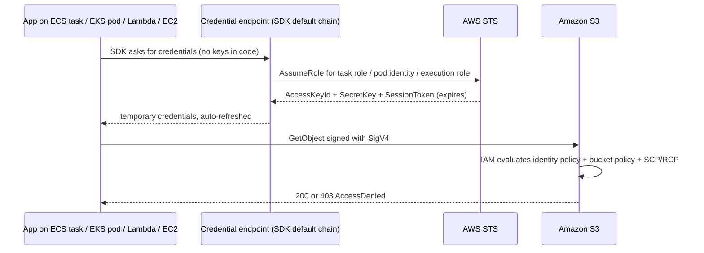
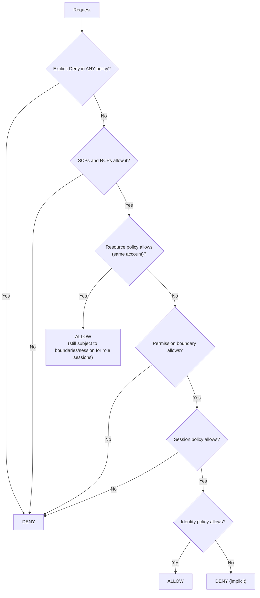

# IAM: Users, Roles, Policies & Least Privilege

!!! abstract "Key takeaways"
    - **Every AWS API call is authenticated and authorised by IAM.** A request has a **principal**, an **action**, a **resource** and a **context** (IP, MFA, tags, time, VPC endpoint).
    - **Prefer roles over users.** Roles give **temporary credentials** through STS (`AssumeRole`). Humans come in through **IAM Identity Center** (SSO). Workloads use **instance profiles, ECS task roles, EKS Pod Identity/IRSA and Lambda execution roles**. Long-lived access keys are a last resort.
    - **Evaluation rule:**
        - An **explicit Deny always wins**.
        - Otherwise you need an **Allow**, and it must get past every applicable guardrail: SCPs, RCPs, permission boundaries and session policies.
        - With nothing that allows the request, the default is **implicit deny**.
    - **Identity policies** attach to a principal. **Resource policies** (S3 bucket, KMS key, SQS queue, Lambda) attach to the resource and name principals. **Cross-account** access needs both sides (except role trust, where the role's trust policy is the resource policy).
    - **Least privilege is a process:** start from AWS managed or broad-but-scoped policies, use **IAM Access Analyzer** (policy generation from CloudTrail, unused-access findings) to tighten, add **conditions** (`aws:PrincipalOrgID`, `aws:SourceVpce`, tags), and enforce guardrails with **SCPs/RCPs**.

## Why it matters

Most cloud breaches are **identity failures**, not exotic exploits: leaked access keys in Git, over-broad `*:*` policies, public S3 buckets, or a compromised workload role that could read everything. In healthcare and banking, IAM design is also what auditors examine first.

Interviewers use IAM to separate people who have *clicked through the console* from people who can explain **why a request was denied** and **how to give a Lambda exactly the access it needs, and nothing more**.

## Core concepts

### Principals and credentials

| Principal | Credentials | Use for |
|---|---|---|
| Root user | Email + password + MFA | Only the few root-only tasks. Lock it away, no access keys |
| IAM user | Password and/or **long-lived** access keys | Legacy, break-glass, rare third-party tools. Avoid |
| IAM role | **Temporary** STS credentials (15 min to 12 h) | Humans via SSO, workloads, cross-account access |
| Federated identity | SAML/OIDC → `AssumeRoleWithSAML` / `AssumeRoleWithWebIdentity` | Enterprise IdP (AD, PingFederate, Okta), GitHub Actions/GitLab OIDC |
| AWS service | Service principal (`lambda.amazonaws.com`) | Services acting on your behalf |

A **role** has two policies:

- a **trust policy**: *who can assume me* (a resource policy on the role)
- **permission policies**: *what I can do once assumed*

### How a workload gets credentials


*Notice that the application code never sees a long-lived secret. The SDK's **default credential provider chain** finds the role credentials and refreshes them before they expire.*

| Compute | Mechanism |
|---|---|
| EC2 | **Instance profile** → IMDS. Enforce **IMDSv2** (session tokens) to block SSRF credential theft |
| ECS | **Task role** (app permissions) vs **task execution role** (pull image, write logs, fetch secrets for the agent) |
| EKS | **EKS Pod Identity** (newer, simpler) or **IRSA** (OIDC provider + service-account annotation) |
| Lambda | **Execution role** |
| CI/CD | **OIDC federation** (GitHub Actions, GitLab) → `AssumeRoleWithWebIdentity`. No stored keys |

### Policy anatomy

```json
{
  "Version": "2012-10-17",
  "Statement": [{
    "Sid": "ReadPatientExports",
    "Effect": "Allow",
    "Action": ["s3:GetObject"],
    "Resource": "arn:aws:s3:::hc-exports-prod/reports/*",
    "Condition": {
      "StringEquals": { "aws:PrincipalOrgID": "o-abc123" },
      "Bool": { "aws:SecureTransport": "true" }
    }
  }]
}
```

- **Effect** is Allow or Deny.
- **Action** is service:API.
- **Resource** is an ARN, and can include wildcards and policy variables such as `${aws:PrincipalTag/team}`.
- **Condition** checks request context keys.
- `NotAction` and `NotResource` exist. They're powerful but easy to get wrong.

### Policy types

| Type | Attached to | Grants? | Purpose |
|---|---|---|---|
| Identity-based (managed/inline) | User, group, role | Yes | What this principal may do |
| Resource-based | S3, KMS, SQS, SNS, Lambda, Secrets Manager, role trust | Yes | Who may access this resource (incl. cross-account) |
| Permission boundary | User or role | **No**, caps only | Delegate role creation safely |
| SCP (Organizations) | OU/account | **No**, caps only | Max permissions for **principals** in accounts |
| RCP (Organizations, Nov 2024) | OU/account | **No**, caps only | Max permissions on **resources** in accounts, incl. external principals (S3, STS, KMS, SQS, Secrets Manager and more) |
| Session policy | Passed in AssumeRole | **No**, caps only | Narrow one session |
| VPC endpoint policy | Gateway/interface endpoint | Caps only | Restrict what traffic through the endpoint can access |

### Evaluation logic


*Notice the asymmetry: guardrails (SCP, RCP, boundary, session) can only **remove** permissions. Something must still **grant** the action. For **cross-account** access, **both** the identity policy in account A **and** the resource policy in account B must allow.*

### Least privilege workflow

1. Start with a **scoped** policy: the specific actions the code calls, on the specific ARNs.
2. Use **IAM Access Analyzer**:
    - **policy generation** from CloudTrail activity
    - **unused access** findings (unused roles, keys, permissions)
    - **external access** findings (resources shared outside your org)
    - **policy validation** and custom policy checks in CI
3. Add **conditions**: `aws:PrincipalOrgID`, `aws:SourceVpce`/`aws:SourceVpc`, `aws:SecureTransport`, `aws:RequestedRegion`, tags (ABAC).
4. Enforce **guardrails** with SCPs (deny leaving the org, deny disabling CloudTrail/GuardDuty, deny regions you don't use) and RCPs (data perimeter: only your org's principals can access your S3/KMS/SQS).
5. **Review continuously**: last-accessed info, unused-access findings, quarterly access reviews.

### RBAC vs ABAC

- **RBAC:** one role per job function, with policies listing resources. Simple, but the number of policies grows with resources.
- **ABAC:** permissions based on **tags**. For example, allow `dynamodb:*` where `aws:ResourceTag/project == ${aws:PrincipalTag/project}`. It scales with fewer policies, but needs **tag governance**: who may set tags, and denying tag changes.

## In practice: code & configuration

A Lambda that reads one S3 prefix and decrypts with one KMS key:

=== "❌ Common mistake"
    ```hcl
    resource "aws_iam_role_policy" "lambda" {
      role = aws_iam_role.lambda.id
      policy = jsonencode({
        Version = "2012-10-17"
        Statement = [{
          Effect   = "Allow"
          Action   = ["s3:*", "kms:*"]   # every S3 and KMS action
          Resource = "*"                 # on every bucket and key in the account
        }]
      })
    }
    # Plus: access keys in environment variables "because the SDK needed them"
    ```

=== "✅ Correct approach"
    ```hcl
    data "aws_iam_policy_document" "trust" {
      statement {
        actions = ["sts:AssumeRole"]
        principals { type = "Service", identifiers = ["lambda.amazonaws.com"] }
        condition {                      # confused-deputy protection
          test     = "StringEquals"
          variable = "aws:SourceAccount"
          values   = [data.aws_caller_identity.me.account_id]
        }
      }
    }

    resource "aws_iam_role" "exporter" {
      name               = "report-exporter"
      assume_role_policy = data.aws_iam_policy_document.trust.json
    }

    data "aws_iam_policy_document" "exporter" {
      statement {
        sid       = "ReadReports"
        actions   = ["s3:GetObject"]
        resources = ["${aws_s3_bucket.exports.arn}/reports/*"]   # one prefix
      }
      statement {
        sid       = "DecryptWithReportKey"
        actions   = ["kms:Decrypt"]
        resources = [aws_kms_key.reports.arn]                     # one key
        condition {
          test     = "StringEquals"
          variable = "kms:ViaService"                             # only via S3
          values   = ["s3.${var.region}.amazonaws.com"]
        }
      }
    }

    resource "aws_iam_role_policy" "exporter" {
      role   = aws_iam_role.exporter.id
      policy = data.aws_iam_policy_document.exporter.json
    }
    # Logging: attach AWSLambdaBasicExecutionRole (CloudWatch Logs only).
    ```

```java
// Java: no keys in code. The SDK default chain finds the execution role credentials.
S3Client s3 = S3Client.builder()
        .region(Region.EU_WEST_1)
        .build();                       // DefaultCredentialsProvider under the hood
```

An SCP guardrail at the organisation level:

```json
{
  "Version": "2012-10-17",
  "Statement": [{
    "Sid": "DenyOutsideApprovedRegions",
    "Effect": "Deny",
    "NotAction": ["iam:*", "organizations:*", "route53:*", "cloudfront:*", "sts:*", "support:*"],
    "Resource": "*",
    "Condition": { "StringNotEquals": { "aws:RequestedRegion": ["eu-west-1", "eu-west-2"] } }
  }]
}
```

## Real-world usage

- **Capital One (2019):** an SSRF in a misconfigured WAF on EC2 reached the **instance metadata service (IMDSv1)**, took the instance role's credentials, and that role could list and read many S3 buckets. About 100 million customer records were exposed. The lessons: **IMDSv2**, least-privilege instance roles, and data-perimeter conditions.
- **Leaked access keys** on GitHub are found by bots within minutes. AWS and GitHub secret scanning now auto-quarantine many of them, but the fix is to **not have long-lived keys**: use SSO for humans and OIDC for CI.
- **Multi-account landing zones** (Control Tower / Organizations) are standard in enterprises: separate accounts for prod, non-prod, security, logging and shared services. SCPs are the guardrails and IAM Identity Center is the single sign-on.
- **Healthcare and banking:** auditors expect least privilege, quarterly access reviews, MFA, CloudTrail in an immutable log archive account, and break-glass procedures.

## Trade-offs & production gotchas

| Option | Pros | Cons | Use when |
|---|---|---|---|
| AWS managed policies | Fast, maintained by AWS | Often too broad | Bootstrapping, then replace |
| Customer managed policies | Reusable, versioned | You maintain them | Standard per-workload roles |
| Inline policies | Strict 1:1 with the role | Not reusable, harder to audit | Truly role-specific exceptions |
| RBAC | Simple to reason about | Policy count grows with resources | Small or medium estates |
| ABAC (tags) | Scales, fewer policies | Needs strict tag governance | Many teams/projects, dynamic resources |

!!! warning "Gotchas"
    - **ECS task role vs execution role:** the app's permissions go on the **task role**. Putting them on the execution role "works" for the agent but the app gets 403.
    - **`iam:PassRole`** is needed to give a role to a service (for example, creating a Lambda with role X). Unscoped `PassRole` on `*` is a privilege-escalation path.
    - **Cross-account KMS:** both the key policy and the caller's IAM policy must allow. Many "S3 cross-account 403" bugs are actually KMS.
    - **Explicit deny with `NotAction`/`NotPrincipal`** can lock out admins, including you. Test with the policy simulator first.
    - **IAM is eventually consistent:** a newly created role may not be usable for a few seconds. Add a retry in automation.

## How this connects to my experience

- **Where I used it:**
    - ConvergeHealth Data Asset Explorer (Deloitte): "implemented security controls using **IAM, KMS, and Secrets Manager**", with services on Lambda, ECS, EKS and API Gateway provisioned by Terraform.
    - CipherTrust CCKM (Coriolis): cloud key management across AWS, Azure and GCP, which requires cross-account IAM and KMS key policies.
- **Talking points:**
    - "Each service had its own role: Lambda execution roles, ECS task roles, and IRSA or Pod Identity on EKS. Policies were scoped to specific bucket prefixes, tables and keys, and defined in Terraform so they went through review." *[confirm: IRSA vs Pod Identity, and which services]*
    - "No long-lived keys in apps. CI used OIDC federation to assume a deploy role." *[confirm: GitLab/Jenkins OIDC or stored keys]*
    - "For CCKM, the product needed permissions on customers' KMS keys in *their* accounts. That's cross-account role assumption with an external ID to prevent the confused-deputy problem, plus key policies that allow our role." *[confirm: external ID usage]*
- **Likely follow-up chain:** "How did your Lambda get access to S3?" → "Why did you get a 403 cross-account?" → "How do you stop a developer creating an admin role?" → "How do you prove least privilege to an auditor?" Answer: execution role + scoped policy → both sides must allow, KMS key policy → permission boundaries + scoped `iam:PassRole` + SCPs → Access Analyzer findings, CloudTrail, access reviews.

## Interview questions

### Fundamentals

??? question "Q1. IAM user vs role?"
    **Answer:** A user is a long-lived identity with a password and/or access keys. A role has no long-lived credentials: a trusted principal assumes it through STS and gets **temporary** credentials. Workloads and humans (via SSO) should use roles.

    **Interviewer listens for:** temporary credentials, trust policy, and avoiding access keys.

    **Common wrong answer:** "a role is a group of users".

??? question "Q2. Identity-based vs resource-based policy?"
    **Answer:** Identity policies attach to a principal and say what it can do. Resource policies attach to a resource (S3 bucket, KMS key, SQS queue, Lambda) and say who can access it. They have a `Principal` element. Resource policies make cross-account access possible.

    **Interviewer listens for:** the `Principal` element, and that cross-account access needs both sides.

    **Common wrong answer:** "they're the same thing written in different places".

??? question "Q3. How does IAM evaluate a request?"
    **Answer:** Default deny. An explicit Deny anywhere wins. Otherwise an Allow is needed, and it must also be allowed by every applicable SCP, RCP, permission boundary and session policy. Within one account, a resource policy Allow can be enough on its own for some principals. Cross-account, both identity and resource policies must allow.

    **Interviewer listens for:** "explicit deny wins", and guardrails don't grant.

    **Common wrong answer:** "the most specific policy wins".

??? question "Q4. What is the root user for?"
    **Answer:** Only root-only tasks: closing the account, changing the support plan, some billing settings, restoring IAM admin access. Use MFA, no access keys, and monitor root sign-ins. With Organizations you can centrally manage and remove member-account root credentials.

    **Interviewer listens for:** locking it down.

    **Common wrong answer:** "daily admin".

### Intermediate

??? question "Q5. ECS task role vs task execution role?"
    **Answer:** The **execution role** is used by the ECS agent and Fargate to pull images from ECR, write logs, and fetch secrets and parameters injected into the container definition. The **task role** is what your application code uses at runtime (S3, DynamoDB, SQS).

    **Interviewer listens for:** a 403 in the app means checking the task role.

    **Common wrong answer:** "they're interchangeable".

??? question "Q6. IRSA vs EKS Pod Identity?"
    **Answer:**
    - **IRSA:** the cluster's OIDC provider is registered in IAM. A Kubernetes service account is annotated with a role ARN. The pod gets a projected token, and the SDK calls `AssumeRoleWithWebIdentity`. The trust policy references the OIDC provider and the `sub` claim.
    - **EKS Pod Identity:** an agent DaemonSet plus *associations* (namespace/service account → role) managed by the EKS API. No per-cluster OIDC trust to edit, roles are reusable across clusters, and session tags are supported.

    **Interviewer listens for:** pod-level identity rather than node-role sharing.

    **Common wrong answer:** "give the node instance role all the permissions".

??? question "Q7. What is a permission boundary and when do you use it?"
    **Answer:** A managed policy that sets the **maximum** permissions an identity policy can grant to a user or role. Use it to let developers create roles for their apps without being able to escalate. Require that any role they create has the boundary attached, and scope `iam:PassRole`.

    **Interviewer listens for:** delegation without privilege escalation.

    **Common wrong answer:** "it grants permissions".

??? question "Q8. SCP vs RCP?"
    **Answer:**
    - **SCPs** cap what **principals in your accounts** can do.
    - **RCPs** (since November 2024) cap what can be done **to resources in your accounts**, including by external principals.

    Together they build a **data perimeter**: only trusted identities, accessing trusted resources, from expected networks. Neither grants anything. SCPs don't affect the management account; RCPs don't apply to service-linked roles.

    **Interviewer listens for:** data-perimeter language.

    **Common wrong answer:** "SCPs grant permissions to accounts".

### Senior

??? question "Q9. What is the confused deputy problem and how do you prevent it?"
    **Answer:**
    - **Cross-account:** a third-party service with a role in your account could be tricked by another customer into acting on your resources. Fix: require an **external ID** (`sts:ExternalId`) in the trust policy.
    - **Service-to-service:** use `aws:SourceArn` / `aws:SourceAccount` conditions in trust and resource policies, for example SNS → SQS or S3 → Lambda.

    **Interviewer listens for:** external ID, SourceArn and SourceAccount.

    **Common wrong answer:** "use MFA".

??? question "Q10. How would you reach least privilege for 50 existing services that use broad policies?"
    **Answer:**
    1. Inventory roles and their last-accessed data.
    2. Generate policies from **CloudTrail** with Access Analyzer for each role.
    3. Replace broad policies gradually, starting in non-prod.
    4. Watch AccessDenied in CloudTrail and alarm on it.
    5. Add Access Analyzer custom policy checks to CI so new policies can't add `*`.
    6. Add SCP/RCP guardrails.
    7. Schedule quarterly reviews of unused-access findings.

    **Interviewer listens for:** data-driven and incremental, with a safety net.

    **Common wrong answer:** "rewrite all policies by hand in one go".

??? question "Q11. What does IMDSv2 protect against?"
    **Answer:** SSRF-based theft of EC2 instance-role credentials. IMDSv2 requires a PUT to get a session token, with a hop limit and a header that most SSRF primitives can't add. Enforce it with `HttpTokens=required` on instances and launch templates, plus an SCP or the account-level default.

    **Interviewer listens for:** the Capital One link and how to enforce it.

    **Common wrong answer:** "it encrypts metadata".

??? question "Q12. When would you use ABAC, and what's the risk?"
    **Answer:** When many teams or projects share accounts and resources are created dynamically. One policy can match `aws:ResourceTag/project` to `aws:PrincipalTag/project`. The risk is tag tampering: deny `TagResource`/`UntagResource` on the controlling tags except for automation, and require tags on creation (`aws:RequestTag`).

    **Interviewer listens for:** tag governance.

    **Common wrong answer:** "ABAC is always better".

### Scenario-based

??? question "Q13. Account A's Lambda gets 403 reading an S3 object in account B. How do you debug it?"
    **Answer:** Check in order:
    1. The Lambda role's identity policy allows `s3:GetObject` on B's ARN.
    2. B's bucket policy allows A's role.
    3. **Object ownership:** objects written by another account may be owned by the writer. Set Object Ownership to "Bucket owner enforced".
    4. **KMS:** if SSE-KMS, the key policy in B allows A's role to `kms:Decrypt`, and A's identity policy allows that key.
    5. SCPs or RCPs in either org deny it.
    6. The VPC endpoint policy, if traffic goes through an endpoint.

    Use the CloudTrail error details, and the IAM policy simulator or Access Analyzer.

    **Interviewer listens for:** both sides, plus KMS and object ownership.

    **Common wrong answer:** "make the bucket public".

??? question "Q14. A developer's access key was committed to a public repo. What do you do?"
    **Answer:**
    1. **Deactivate and delete** the key immediately.
    2. Check CloudTrail for activity by that key ID: unusual Regions, IAM changes, new users or keys, and EC2 launches (crypto mining).
    3. Revoke sessions and remove anything the attacker created.
    4. Rotate any secrets the key could read.
    5. Rewrite git history if needed. The key must be treated as compromised regardless.
    6. Root cause: move the developer to SSO with short-lived credentials, add pre-commit secret scanning, and use SCPs to deny high-risk actions.

    **Interviewer listens for:** containment first, then investigation, then prevention.

    **Common wrong answer:** "delete the commit".

??? question "Q15. How do you let GitLab CI deploy to AWS without storing keys?"
    **Answer:** Register GitLab as an **OIDC identity provider** in IAM. Create a deploy role whose trust policy allows `AssumeRoleWithWebIdentity` from that provider, with conditions on `aud` and on `sub` (project path, and branch or protected ref). In the job, exchange the CI ID token for STS credentials. Scope the role per environment and protect prod with branch conditions.

    **Interviewer listens for:** sub-claim conditions so other projects can't assume the role.

    **Common wrong answer:** "store the keys in CI variables".

## Cheat sheet

| Concept | Remember |
|---|---|
| Request | Principal + action + resource + context |
| Order | Explicit Deny > (SCP ∧ RCP ∧ boundary ∧ session) caps > some Allow needed > implicit deny |
| Cross-account | Identity policy (A) **and** resource policy (B). KMS key policy too |
| Role | Trust policy (who) + permission policies (what). STS temp creds 15 min–12 h |
| Workloads | EC2 instance profile (IMDSv2), ECS task role ≠ execution role, EKS Pod Identity/IRSA, Lambda execution role |
| Humans | IAM Identity Center + IdP (AD/PingFederate), MFA, no access keys |
| CI | OIDC → `AssumeRoleWithWebIdentity`, condition on `sub` |
| Guardrails | SCP (principals), RCP (resources, 2024), permission boundary, session policy |
| Confused deputy | External ID. `aws:SourceArn` / `aws:SourceAccount` |
| Tools | Access Analyzer (generate, unused, external, validate), policy simulator, CloudTrail |
| Escalation paths | `iam:PassRole` on `*`, `iam:CreatePolicyVersion`, `iam:AttachRolePolicy` |

## Sources
1. [IAM policy evaluation logic](https://docs.aws.amazon.com/IAM/latest/UserGuide/reference_policies_evaluation-logic.html): the decision flow, cross-account evaluation.
2. [IAM roles and temporary credentials](https://docs.aws.amazon.com/IAM/latest/UserGuide/id_roles.html): roles, trust policies, STS.
3. [Permissions boundaries for IAM entities](https://docs.aws.amazon.com/IAM/latest/UserGuide/access_policies_boundaries.html): delegation with caps.
4. [Resource control policies (RCPs)](https://docs.aws.amazon.com/organizations/latest/userguide/orgs_manage_policies_rcps.html) and [announcement](https://aws.amazon.com/about-aws/whats-new/2024/11/resource-control-policies-restrict-access-aws-resources): RCPs, supported services.
5. [Service control policies](https://docs.aws.amazon.com/organizations/latest/userguide/orgs_manage_policies_scps.html): SCP behaviour and limits.
6. [IAM Access Analyzer](https://docs.aws.amazon.com/IAM/latest/UserGuide/what-is-access-analyzer.html): policy generation, unused and external access findings.
7. [The confused deputy problem](https://docs.aws.amazon.com/IAM/latest/UserGuide/confused-deputy.html): external ID and source conditions.
8. [Amazon ECS task IAM role](https://docs.aws.amazon.com/AmazonECS/latest/developerguide/task-iam-roles.html) and [task execution role](https://docs.aws.amazon.com/AmazonECS/latest/developerguide/task_execution_IAM_role.html).
9. [EKS Pod Identity](https://docs.aws.amazon.com/eks/latest/userguide/pod-identities.html) and [IRSA](https://docs.aws.amazon.com/eks/latest/userguide/iam-roles-for-service-accounts.html).
10. [Use IMDSv2](https://docs.aws.amazon.com/AWSEC2/latest/UserGuide/configuring-instance-metadata-service.html): session-oriented metadata access.
11. [Data perimeters on AWS](https://aws.amazon.com/identity/data-perimeters-on-aws/): trusted identities, resources and networks.
