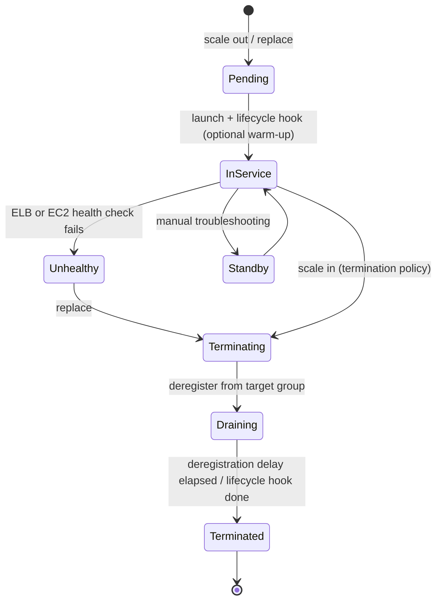
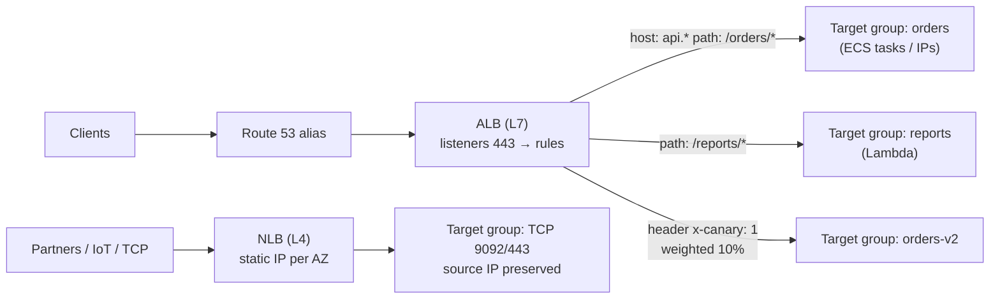

# Compute: EC2, Auto Scaling, ELB/ALB/NLB

!!! abstract "TL;DR"
    - **EC2 instance types:** family + generation + options. For example `m7g.large` is general purpose, 7th gen, **Graviton** (ARM, ~20–40% better price/performance for Java). Other families: C (compute), R (memory), M (general), T (burstable credits), I (storage-optimised), G/P (GPU).
    - **Pricing:** On-Demand < **Savings Plans / Reserved** (1–3 years, up to ~72% off) < **Spot** (up to ~90% off, 2-minute interruption notice). Mix them in an ASG.
    - **Auto Scaling group (ASG):** a **launch template**, subnets in **multiple AZs**, min/desired/max capacity and health checks (use ELB health checks, not only EC2 status). Scaling policies:
        - **Target tracking**, e.g. CPU 50% or requests per target. This is the default choice.
        - Step scaling.
        - Scheduled scaling.
        - **Predictive** scaling.
    - **ALB (Layer 7):** HTTP/HTTPS/gRPC, host/path/header routing, target groups (instances, IPs, Lambda), auth (OIDC/Cognito), WAF. **NLB (Layer 4):** TCP/UDP/TLS, millions of requests per second, **static IP per AZ**, preserves the source IP, PrivateLink. **GWLB:** inserts firewall appliances.
    - **Production essentials:** connection draining (deregistration delay), health-check grace period, **instance refresh** for rolling AMI updates, IMDSv2, and spreading across ≥ 2 AZs with cross-zone balancing understood.

## Why it matters

Even teams that run "everything on containers or Lambda" have EC2 underneath (ECS on EC2, EKS nodes) and almost always a load balancer in front. Interviewers ask "ALB or NLB?", "How do you scale on traffic, not CPU?", "How do you deploy without dropping requests?" and "How would you cut this compute bill?". These questions test whether you've operated a fleet, not just launched an instance.

## Core concepts

### EC2 building blocks

- **AMI:** the machine image (OS + baked software). Golden AMIs are built by a pipeline (EC2 Image Builder, Packer).
- **Instance type:** CPU, memory, network and storage profile. **Nitro** is the modern hypervisor: near bare-metal performance, plus Nitro Enclaves for isolated processing.
- **Storage:** **EBS** (network block storage, zonal, persists) or **instance store** (local NVMe, lost on stop/terminate).
- **Placement groups:**
    - **cluster:** low latency within one AZ, for HPC
    - **spread:** separate racks, up to 7 instances per AZ, for critical small sets
    - **partition:** for Kafka, HDFS and Cassandra rack awareness
- **User data** runs at first boot. **IMDSv2** serves instance metadata and role credentials.

### Purchase options

| Option | Discount | Commitment | Use for |
|---|---|---|---|
| On-Demand | None | None | Spiky or unknown workloads, short-term |
| Compute Savings Plan | Up to ~66% | $/hour for 1–3 yrs, any family/Region, also Fargate and Lambda | Baseline steady usage (most flexible) |
| EC2 Instance Savings Plan / RI | Up to ~72% | Family + Region | Very stable fleets |
| Spot | Up to ~90% | None, can be reclaimed with **2 min notice** | Stateless, fault-tolerant work: batch, CI, stateless web tiers with mixed instances |
| Dedicated Hosts | n/a | n/a | Licensing (BYOL), compliance |

### Auto Scaling group lifecycle


*Notice the two points where you can lose requests: **draining** (set the target group's deregistration delay longer than your longest request) and **pending** (the health-check grace period and warm-up stop new instances getting traffic, or being killed, before the JVM is ready).*

Scaling policy choice:

- **Target tracking:** "keep `ALBRequestCountPerTarget` at 1,000" or "CPU at 50%". AWS creates the alarms. Best default.
- **Step scaling:** different adjustments for different alarm breaches. Useful for queue depth thresholds.
- **Scheduled:** known peaks such as 9am logins or month-end batch.
- **Predictive:** ML forecast from 14 days of history to scale **ahead** of daily cycles.
- **Warm pools:** keep pre-initialised (stopped) instances to cut scale-out time for slow-booting apps.

### Load balancers


*Notice that the ALB makes routing decisions on HTTP content (host, path, header, weights). The NLB just forwards connections, which is why it's faster, supports static IPs and passes TLS through.*

| | **ALB** | **NLB** | **GWLB** |
|---|---|---|---|
| OSI layer | 7 (HTTP/1.1, HTTP/2, gRPC, WebSocket) | 4 (TCP, UDP, TLS) | 3 (GENEVE to appliances) |
| Routing | Host, path, header, query, method, source IP, weighted | Port-based | Flow hashing to appliances |
| Static IP | No (use Global Accelerator) | **Yes**, one EIP per AZ | n/a |
| Client IP | `X-Forwarded-For` header | **Preserved** (or Proxy Protocol v2) | Preserved |
| TLS | Terminates (ACM certs, SNI) | Terminate or **pass-through** | n/a |
| Targets | Instances, IPs, **Lambda**, containers | Instances, IPs, ALB | Appliances |
| Extras | WAF, OIDC/Cognito auth, redirects, fixed responses, mTLS | PrivateLink endpoint service, very low latency, security groups (since 2023) | Inline firewalls/IDS |
| Use for | Web apps, REST/gRPC microservices | Non-HTTP, extreme throughput, static IPs, PrivateLink | Third-party security appliances |

**Cross-zone load balancing** spreads traffic evenly across all targets in all AZs. It is on by default for ALB (no charge) and off by default for NLB (cross-AZ data charges apply if enabled). With it off, each AZ's node only sends to its own AZ's targets, so uneven target counts per AZ cause hot spots.

**Health checks:** path, interval, healthy/unhealthy thresholds. Point them at a **readiness** endpoint (Spring Boot `/actuator/health/readiness`), not just "process is up". Don't include downstream dependencies in the LB health check, or one DB blip takes every target out of service.

## In practice: code & configuration

=== "❌ Common mistake"
    ```hcl
    resource "aws_autoscaling_group" "api" {
      min_size            = 1
      max_size            = 4
      vpc_zone_identifier = [aws_subnet.private_a.id]   # one AZ
      health_check_type   = "EC2"                        # only "VM is running"
      launch_configuration = aws_launch_configuration.api.name  # deprecated
    }
    resource "aws_lb_target_group" "api" {
      port = 8080
      protocol = "HTTP"
      health_check { path = "/" }                        # 200 even when the app isn't ready
      # deregistration_delay default 300s, with no thought about long requests
    }
    ```

=== "✅ Correct approach"
    ```hcl
    resource "aws_launch_template" "api" {
      image_id      = data.aws_ami.golden.id
      instance_type = "m7g.large"                      # Graviton
      metadata_options { http_tokens = "required" }    # IMDSv2 only
      iam_instance_profile { name = aws_iam_instance_profile.api.name }
    }

    resource "aws_autoscaling_group" "api" {
      min_size                  = 3                     # one per AZ = static stability baseline
      max_size                  = 30
      vpc_zone_identifier       = local.private_subnet_ids   # 3 AZs
      health_check_type         = "ELB"                 # replace if the app is unhealthy
      health_check_grace_period = 120                   # JVM warm-up
      target_group_arns         = [aws_lb_target_group.api.arn]

      mixed_instances_policy {
        launch_template {
          launch_template_specification { launch_template_id = aws_launch_template.api.id }
          override { instance_type = "m7g.large" }
          override { instance_type = "m6g.large" }      # diversify for Spot capacity
        }
        instances_distribution {
          on_demand_base_capacity                  = 3   # baseline on On-Demand (covered by Savings Plan)
          on_demand_percentage_above_base_capacity = 25
          spot_allocation_strategy                 = "price-capacity-optimized"
        }
      }
      instance_refresh {                                # rolling AMI updates
        strategy = "Rolling"
        preferences { min_healthy_percentage = 90 }
      }
    }

    resource "aws_autoscaling_policy" "rps" {
      autoscaling_group_name = aws_autoscaling_group.api.name
      policy_type            = "TargetTrackingScaling"
      target_tracking_configuration {
        predefined_metric_specification {
          predefined_metric_type = "ALBRequestCountPerTarget"
          resource_label         = "${aws_lb.api.arn_suffix}/${aws_lb_target_group.api.arn_suffix}"
        }
        target_value = 800                              # from a load test
      }
    }

    resource "aws_lb_target_group" "api" {
      port                 = 8080
      protocol             = "HTTP"
      deregistration_delay = 30                         # > longest normal request
      health_check {
        path                = "/actuator/health/readiness"
        healthy_threshold   = 2
        unhealthy_threshold = 3
        interval            = 10
      }
    }
    ```

```yaml
# Spring Boot side: graceful shutdown so in-flight requests finish during draining.
server:
  shutdown: graceful
spring:
  lifecycle:
    timeout-per-shutdown-phase: 25s     # less than the deregistration delay
management:
  endpoint.health.probes.enabled: true  # /readiness and /liveness
```

## Real-world usage

- **Spot at scale:** companies run CI fleets, batch and even stateless web tiers on Spot with **many instance types** and `price-capacity-optimized`. They handle the 2-minute interruption notice and EC2 **rebalance recommendations** by draining.
- **Graviton migrations** (Java, Node, Go) commonly report 20–40% cost savings. JVM workloads usually need only a multi-arch image.
- **Failure modes:**
    - Scaling on CPU when the app is I/O-bound, so it never scales.
    - Health checks that include the database, so all targets go unhealthy together and the ALB **fails open** (sends to all of them).
    - A thundering herd after scale-out against a cold cache.
    - 502/504s from mismatched keep-alive timeouts: the app's idle timeout must be **longer** than the ALB's (default 60s).
- **Banking and healthcare:** NLBs with static IPs for partner allow-lists, mTLS on ALB for B2B APIs, and WAF on ALB for OWASP rules.

## Trade-offs & production gotchas

| Choice | Pros | Cons | Use when |
|---|---|---|---|
| ALB | Content routing, Lambda targets, WAF, auth | No static IP, L7 overhead | HTTP/gRPC services |
| NLB | Static IP, extreme throughput, TLS pass-through, PrivateLink | No content routing | TCP/UDP, partners, PrivateLink |
| Target tracking on CPU | Simple | Wrong signal for I/O-bound apps | CPU-bound services |
| Target tracking on RPS/target | Tracks real load | Needs load-tested target value | HTTP APIs |
| Spot | Up to 90% cheaper | Interruptions | Stateless, diversified, graceful drain |

!!! warning "Gotchas"
    - **Keep-alive mismatch:** if the backend closes idle connections before the ALB does, you get intermittent 502s. Set Tomcat/Netty keep-alive above the ALB idle timeout.
    - **ALB fail-open:** if every target is unhealthy, the ALB routes to all of them anyway. Good for availability, but it can hide a broken deep health check.
    - **Scale-in kills work:** use lifecycle hooks or scale-in protection for instances processing long jobs.
    - **The ALB scales gradually:** for a known massive spike (a launch event), pre-warm through support or LCU reservation, or use an NLB.

## How this connects to my experience

- **Where I used it:** ConvergeHealth Data Asset Explorer: "microservices on AWS using Lambda, **EC2**, ECS, EKS, API Gateway…", with infrastructure in Terraform.
- **Talking points:**
    - "Services ran behind an ALB with path-based routing to target groups, with readiness health checks and graceful shutdown, so deployments didn't drop requests." *[confirm: ALB vs NLB, what ran on raw EC2 vs containers]*
    - "ASGs spanned AZs, scaled on request count per target, and used instance refresh for AMI updates." *[confirm]*
    - If EC2 use was limited: "Most compute was ECS/EKS/Lambda. EC2 was mainly worker nodes or specific workloads, but the ASG and load-balancer principles are the same ones I applied to the node groups." *[confirm]*
- **Likely follow-up chain:** "ALB or NLB for your services, and why?" → "How did you scale?" → "How do you deploy without errors?" → "How would you cut the cost?" Answer: L7 routing → target tracking on RPS with a load-tested target → readiness checks + deregistration delay + graceful shutdown → Graviton + Savings Plan baseline + Spot above it.

## Interview questions

### Fundamentals

??? question "Q1. ALB vs NLB?"
    **Answer:** ALB is Layer 7: HTTP-aware routing (host, path, header, weights), TLS termination, WAF, auth and Lambda targets. NLB is Layer 4: TCP/UDP/TLS, very high throughput, low latency, static IPs, source-IP preservation, PrivateLink. Choose ALB for HTTP microservices and NLB for non-HTTP traffic, static IP needs or PrivateLink.

    **Interviewer listens for:** layer, static IP and use cases.

    **Common wrong answer:** "NLB is just a faster ALB".

??? question "Q2. EC2 purchase options?"
    **Answer:**
    - **On-Demand:** pay per second, no commitment.
    - **Savings Plans / Reserved Instances:** a 1–3 year commitment for up to ~72% off.
    - **Spot:** spare capacity for up to ~90% off, reclaimable with 2 minutes' notice.
    - **Dedicated Hosts:** for licensing or compliance.

    A common mix is a Savings Plan for the baseline, Spot for elastic stateless capacity, and On-Demand for the rest.

    **Interviewer listens for:** combining options.

    **Common wrong answer:** "Spot for databases".

??? question "Q3. What does an Auto Scaling group need?"
    **Answer:** A launch template, subnets in multiple AZs, min/desired/max capacity, health-check type (ELB for apps), a grace period, target groups and scaling policies. It replaces unhealthy instances and rebalances across AZs.

    **Interviewer listens for:** ELB health checks and multi-AZ.

    **Common wrong answer:** "it only adds instances when CPU is high".

??? question "Q4. EBS vs instance store?"
    **Answer:** EBS is network-attached, persistent and zonal, with snapshots to S3. Instance store is local NVMe: very fast, but **ephemeral**, lost on stop or terminate. Use instance store for caches, scratch space and replicated data stores.

    **Interviewer listens for:** ephemerality.

    **Common wrong answer:** "instance store survives reboots, so it's persistent". It survives a reboot, but not a stop.

### Intermediate

??? question "Q5. Which metric would you scale an API on?"
    **Answer:**
    - Requests per target (`ALBRequestCountPerTarget`) or latency for HTTP APIs.
    - CPU only if the service is CPU-bound.
    - Queue depth per instance (backlog per instance) for workers.

    Set the target value from a load test, and add scheduled or predictive scaling for known cycles.

    **Interviewer listens for:** a metric that tracks real load.

    **Common wrong answer:** "always CPU 70%".

??? question "Q6. How do you deploy to an ASG without dropping requests?"
    **Answer:**
    - New instances pass readiness checks before receiving traffic.
    - Old instances are deregistered with a deregistration delay and shut down gracefully.
    - Use instance refresh with a minimum healthy percentage, or blue/green with two target groups and weighted ALB rules.
    - Align keep-alive timeouts with the ALB.

    **Interviewer listens for:** both ends of the lifecycle.

    **Common wrong answer:** "terminate and relaunch".

??? question "Q7. What is cross-zone load balancing?"
    **Answer:** Each load-balancer node distributes across targets in **all** AZs instead of only its own. It's on for ALB by default (free). It's off for NLB by default, and enabling it adds cross-AZ data charges. With it off and uneven targets per AZ, per-target load becomes uneven.

    **Interviewer listens for:** defaults and cost.

    **Common wrong answer:** "it routes users to the closest AZ".

??? question "Q8. Sticky sessions: when, and what's the risk?"
    **Answer:** The ALB uses a cookie (duration-based or app-based) to pin a client to a target. Use it only for legacy stateful apps. Risks: uneven load and lost sessions when the target dies. Prefer stateless services with session state in Redis or in tokens.

    **Interviewer listens for:** preferring statelessness.

    **Common wrong answer:** "always enable it for logins".

### Senior

??? question "Q9. How do you run a stateless tier on Spot safely?"
    **Answer:**
    - Use a mixed-instances ASG with many instance types and AZs and `price-capacity-optimized`.
    - Keep an On-Demand base capacity.
    - Enable capacity rebalancing.
    - Handle the 2-minute interruption notice by deregistering and draining.
    - Make work idempotent and keep it short.
    - Never put stateful singletons on Spot.

    **Interviewer listens for:** diversification and drain handling.

    **Common wrong answer:** "Spot is unreliable, so avoid it".

??? question "Q10. Intermittent 502s behind an ALB. Causes?"
    **Answer:**
    - The backend closes keep-alive connections before the ALB idle timeout.
    - Targets crash or restart mid-request.
    - No graceful shutdown during deploys.
    - Malformed responses or headers that are too large.
    - Security group or NACL issues on the return path.

    Check ALB access logs (`elb_status_code` vs `target_status_code`) and target logs.

    **Interviewer listens for:** keep-alive first, plus using access logs.

    **Common wrong answer:** "scale up".

??? question "Q11. When would you put an NLB in front of an ALB?"
    **Answer:** When you need **static IPs** (partner allow-lists) or **PrivateLink** exposure but still want L7 routing. NLB supports ALB as a target type. Global Accelerator is an alternative that gives static anycast IPs in front of an ALB.

    **Interviewer listens for:** knowing both options.

    **Common wrong answer:** "you can't".

### Scenario-based

??? question "Q12. Traffic spikes 10× at 9:00 every weekday and the first 5 minutes are slow. Fix it."
    **Answer:**
    - Add **scheduled** or **predictive** scaling to be at capacity before 9:00.
    - Use warm pools or faster boot: a pre-baked AMI, a smaller JVM start-up footprint, AppCDS/CRaC.
    - Keep target tracking for the unexpected.
    - Pre-warm caches.
    - Check the ALB isn't the bottleneck.
    - Alarm on p95 latency, not only CPU.

    **Interviewer listens for:** proactive scaling rather than reactive.

    **Common wrong answer:** "lower the CPU threshold".

??? question "Q13. Cut a $50K/month EC2 bill by 40% without hurting reliability."
    **Answer:**
    1. Right-size using Compute Optimizer.
    2. Move to Graviton.
    3. Put a Savings Plan on the steady baseline.
    4. Use Spot for stateless and elastic parts.
    5. Turn off non-prod at night.
    6. Remove idle instances and unattached EBS volumes.
    7. Check data transfer and NAT costs.
    8. Use gp3 instead of gp2.

    Measure with Cost Explorer and tags per team.

    **Interviewer listens for:** a prioritised plan with data.

    **Common wrong answer:** "buy RIs for everything".

## Cheat sheet

| Concept | Remember |
|---|---|
| Families | M general, C compute, R memory, T burst, I storage, G/P GPU. `g` = Graviton |
| Pricing | On-Demand. Savings Plans/RI ≤ ~72%. Spot ≤ ~90% with 2-min notice |
| ASG | Launch template + multi-AZ subnets + ELB health check + grace period |
| Scaling | Target tracking (default), step, scheduled, predictive, warm pools |
| ALB | L7, host/path/header/weights, Lambda targets, WAF, OIDC auth, cross-zone on |
| NLB | L4, static IP per AZ, source IP preserved, TLS pass-through, PrivateLink, cross-zone off |
| GWLB | L3 appliance insertion (GENEVE) |
| Zero-downtime | Readiness check + deregistration delay + graceful shutdown + instance refresh |
| 502s | Keep-alive mismatch: backend idle timeout > ALB idle timeout (60s default) |
| Security | IMDSv2 required, instance profile, private subnets |

## Sources
1. [Amazon EC2 instance types](https://aws.amazon.com/ec2/instance-types/): families and naming.
2. [EC2 pricing options: Savings Plans, Spot](https://aws.amazon.com/ec2/pricing/): discounts and commitments.
3. [Spot Instance interruptions](https://docs.aws.amazon.com/AWSEC2/latest/UserGuide/spot-interruptions.html): 2-minute notice, rebalance recommendations.
4. [Amazon EC2 Auto Scaling user guide](https://docs.aws.amazon.com/autoscaling/ec2/userguide/what-is-amazon-ec2-auto-scaling.html): lifecycle, policies, instance refresh, warm pools.
5. [Target tracking scaling policies](https://docs.aws.amazon.com/autoscaling/ec2/userguide/as-scaling-target-tracking.html): metrics such as `ALBRequestCountPerTarget`.
6. [Application Load Balancer guide](https://docs.aws.amazon.com/elasticloadbalancing/latest/application/introduction.html): listeners, rules, target groups, idle timeout.
7. [Network Load Balancer guide](https://docs.aws.amazon.com/elasticloadbalancing/latest/network/introduction.html): static IPs, cross-zone defaults, security groups.
8. [Troubleshoot ALB HTTP 502 errors](https://repost.aws/knowledge-center/elb-alb-troubleshoot-502-errors): keep-alive and other causes.
9. [Spring Boot graceful shutdown](https://docs.spring.io/spring-boot/reference/web/graceful-shutdown.html): draining in-flight requests.
