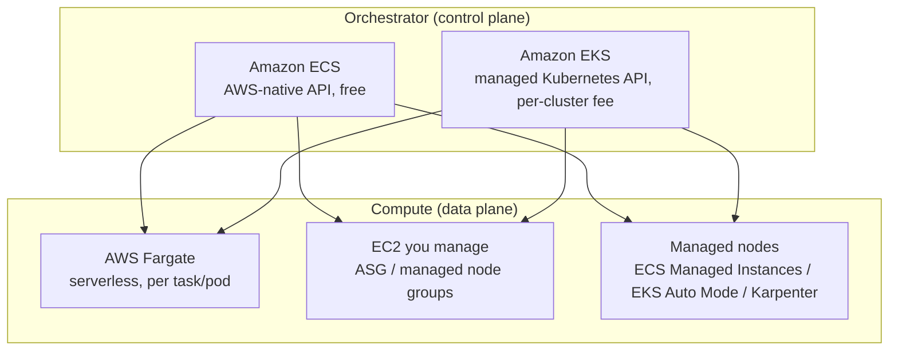
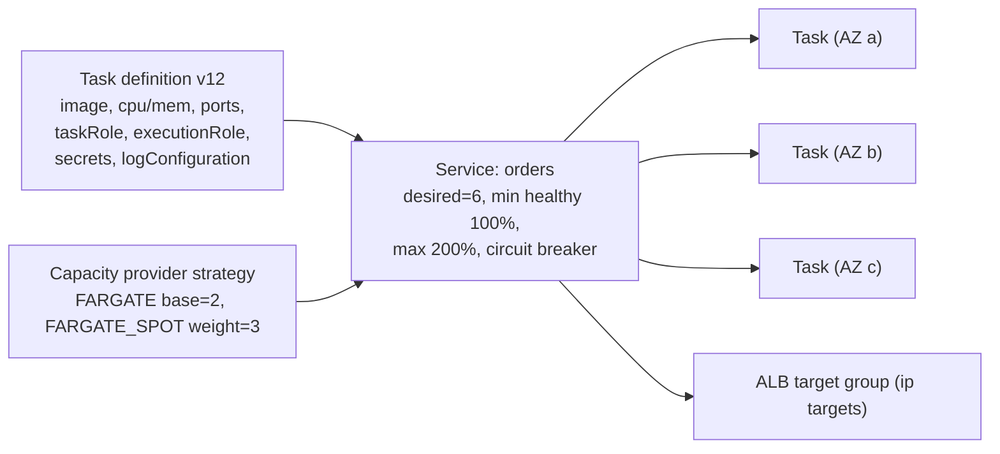
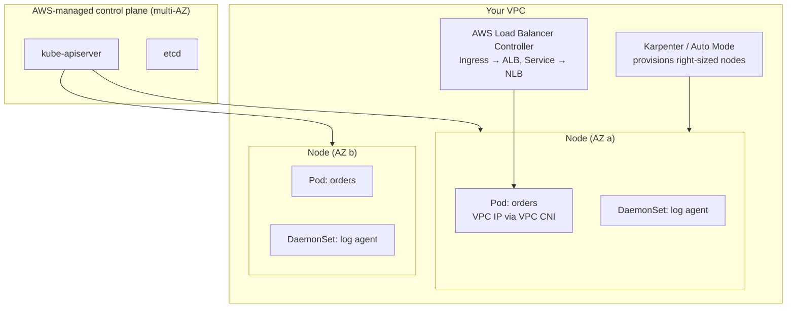

# Containers: ECS vs EKS vs Fargate

!!! abstract "TL;DR"
    - **Two orchestrators, several compute choices.**
        - **ECS** is AWS's own orchestrator: simple, deeply integrated, and free (you pay only for compute).
        - **EKS** is managed **Kubernetes**: portable, with a huge ecosystem, more moving parts, and a per-cluster fee.
        - **Fargate** is **serverless compute** for either one: no nodes to patch or scale, but you pay per task/pod vCPU-GB.
    - **ECS model:** a **task definition** (containers, CPU/memory, roles, logging) runs as a **service** (desired count, load balancer, deployment config) on a **cluster**. Capacity providers supply the compute: Fargate, Fargate Spot, EC2 ASGs, or ECS Managed Instances.
    - **EKS model:** AWS runs the control plane across 3 AZs. You run data-plane options: managed node groups, **Karpenter**, **EKS Auto Mode** (AWS manages nodes, Karpenter-based), or Fargate profiles. Pods get **VPC IPs** through the VPC CNI.
    - **IAM per workload:** ECS **task role** vs **execution role**. EKS **Pod Identity** or IRSA. Never rely on node or instance roles for app permissions.
    - **Choose ECS + Fargate** for a small team or AWS-only work that needs the least ops. **Choose EKS** when you need Kubernetes portability, its ecosystem (operators, Helm, service mesh, GitOps) or multi-cloud consistency, or you already have the platform skills.

## Why it matters

"Why did you choose EKS over ECS?" is one of the most common AWS interview questions, and "because Kubernetes is popular" fails it. A senior answer weighs **operational load, team skills, portability, ecosystem needs and cost**, and knows what Fargate gives up (DaemonSets, privileged containers, GPUs in most cases, node-level tuning).

## Core concepts

### Layers: orchestrator vs compute


*Notice that ECS vs EKS (how you describe and schedule workloads) and Fargate vs EC2 (who manages the servers) are **two independent decisions**.*

### ECS in one diagram


*Notice that each Fargate or `awsvpc` task gets its **own ENI and private IP**, so security groups apply per task and the ALB registers **IP** targets.*

ECS features to know:

- **Deployment types:**
    - **Rolling update:** `minimumHealthyPercent` / `maximumPercent`, with a **deployment circuit breaker** that auto-rolls back.
    - **Native blue/green** (added July 2025, no CodeDeploy needed), with lifecycle hooks and bake time. Linear and canary strategies were added later.
    - **CodeDeploy** blue/green (the older approach).
- **Service Connect / Cloud Map** for service discovery and service-to-service traffic with retries and metrics.
- **Service auto scaling** (Application Auto Scaling): target tracking on CPU, memory or ALB requests per target, step scaling on SQS depth.
- **Secrets:** `secrets` in the task definition pulls from Secrets Manager or Parameter Store at start-up (this uses the **execution role**).
- **ECS Exec** for a shell into tasks (audited through CloudTrail).

### EKS in one diagram


*Notice what you still own on EKS (unless you use Auto Mode or Fargate): the nodes, add-on versions (CNI, CoreDNS, kube-proxy), **Kubernetes version upgrades** (about every 14 months before extended support costs more), and the cluster add-ons ecosystem.*

EKS essentials:

- **Upgrades:** EKS supports a Kubernetes version for about 14 months under standard support, then extended support at a higher hourly cluster fee. Plan regular upgrades.
- **Networking:**
    - The **VPC CNI** gives pods real VPC IPs, which is fast but uses up subnet IPs. Mitigate with prefix delegation or a secondary CIDR.
    - Security groups for pods are available when needed.
- **Scaling:**
    - **HPA:** pods on CPU, memory or custom metrics.
    - **KEDA:** event-driven, for example Kafka lag or SQS depth.
    - **Karpenter:** nodes, bin-packing, Spot, consolidation.
    - **EKS Auto Mode** (re:Invent 2024): AWS manages compute, networking and storage add-ons, with Karpenter-based nodes.
- **Ingress:** the AWS Load Balancer Controller turns `Ingress` into an ALB and `Service type=LoadBalancer` into an NLB.
- **Access:** EKS access entries map IAM principals to Kubernetes RBAC (replacing the `aws-auth` ConfigMap).

### Fargate trade-offs

| You gain | You give up |
|---|---|
| No nodes to patch, scale or bin-pack | DaemonSets (EKS Fargate), privileged containers, host networking |
| Per-task isolation (its own kernel boundary) | GPUs (in general), node-level tuning, custom AMIs |
| Pay only for the requested task vCPU/GB | Higher unit price than well-packed EC2. Limited sizes (up to 16 vCPU / 120 GB) |
| Fast to start | Slower task start than a warm node. Image pull on every start (use smaller images, SOCI lazy loading) |

**Fargate Spot** (ECS) gives roughly 70% off for interruptible tasks.

### ECS vs EKS decision table

| Factor | ECS | EKS |
|---|---|---|
| Learning curve / ops | Low | High (K8s, add-ons, upgrades) |
| Control plane cost | Free | Per cluster per hour (more on extended support) |
| Portability | AWS-only | Any Kubernetes (on-prem, other clouds) |
| Ecosystem | AWS integrations | Helm, operators, Argo CD/Flux, Istio/Linkerd, KEDA, OPA/Kyverno |
| IAM per workload | Task role | Pod Identity / IRSA |
| Service discovery | Service Connect / Cloud Map | Kubernetes Services/DNS, mesh |
| Deployments | Rolling, native blue/green, canary/linear | Rolling, Argo Rollouts/Flagger for canary |
| Best for | AWS-first teams, small platform team | Platform teams, multi-cloud, K8s skills or tooling already in place |

## In practice: code & configuration

=== "❌ Common mistake"
    ```json
    {
      "family": "orders",
      "executionRoleArn": "arn:aws:iam::123:role/ecsTaskExecutionRole",
      "containerDefinitions": [{
        "name": "orders",
        "image": "123.dkr.ecr.eu-west-1.amazonaws.com/orders:latest",
        "environment": [
          { "name": "DB_PASSWORD", "value": "SuperSecret123" },
          { "name": "AWS_ACCESS_KEY_ID", "value": "AKIA..." }
        ]
      }]
    }
    ```
    The image uses `:latest`, secrets are in plain env vars, there's no task role so static keys are passed instead, there are no logs, and there are no CPU or memory limits.

=== "✅ Correct approach"
    ```json
    {
      "family": "orders",
      "requiresCompatibilities": ["FARGATE"],
      "networkMode": "awsvpc",
      "cpu": "1024", "memory": "2048",
      "runtimePlatform": { "cpuArchitecture": "ARM64", "operatingSystemFamily": "LINUX" },
      "taskRoleArn": "arn:aws:iam::123:role/orders-task",
      "executionRoleArn": "arn:aws:iam::123:role/orders-exec",
      "containerDefinitions": [{
        "name": "orders",
        "image": "123.dkr.ecr.eu-west-1.amazonaws.com/orders@sha256:4f1c...",
        "portMappings": [{ "containerPort": 8080 }],
        "secrets": [
          { "name": "DB_PASSWORD", "valueFrom": "arn:aws:secretsmanager:eu-west-1:123:secret:orders/db-AbCd:password::" }
        ],
        "environment": [{ "name": "JAVA_TOOL_OPTIONS", "value": "-XX:MaxRAMPercentage=75" }],
        "logConfiguration": {
          "logDriver": "awslogs",
          "options": { "awslogs-group": "/ecs/orders", "awslogs-region": "eu-west-1", "awslogs-stream-prefix": "app" }
        },
        "healthCheck": { "command": ["CMD-SHELL", "curl -f http://localhost:8080/actuator/health/liveness || exit 1"] },
        "stopTimeout": 30
      }]
    }
    ```
    The image is pinned by digest, the secret comes from Secrets Manager through the execution role, the app uses the task role, the JVM heap is sized from the container limit, and logs are configured.

The EKS equivalent of per-workload IAM with Pod Identity:

```yaml
apiVersion: v1
kind: ServiceAccount
metadata: { name: orders, namespace: orders }
---
# Terraform/CLI: aws eks create-pod-identity-association \
#   --cluster-name prod --namespace orders --service-account orders \
#   --role-arn arn:aws:iam::123:role/orders-app
apiVersion: apps/v1
kind: Deployment
metadata: { name: orders, namespace: orders }
spec:
  replicas: 3
  selector: { matchLabels: { app: orders } }
  template:
    metadata: { labels: { app: orders } }
    spec:
      serviceAccountName: orders
      topologySpreadConstraints:          # spread across AZs
        - maxSkew: 1
          topologyKey: topology.kubernetes.io/zone
          whenUnsatisfiable: DoNotSchedule
          labelSelector: { matchLabels: { app: orders } }
      containers:
        - name: orders
          image: 123.dkr.ecr.eu-west-1.amazonaws.com/orders@sha256:4f1c...
          resources:
            requests: { cpu: "500m", memory: "1Gi" }
            limits:   { memory: "1Gi" }
          readinessProbe: { httpGet: { path: /actuator/health/readiness, port: 8080 } }
          livenessProbe:  { httpGet: { path: /actuator/health/liveness,  port: 8080 } }
```

## Real-world usage

- **ECS on Fargate** is the common choice for teams without a dedicated platform group: fewer upgrades, no node patching, and good integration with ALB, Secrets Manager and CloudWatch.
- **EKS** is common in enterprises standardising on Kubernetes across clouds or on-prem, often with Argo CD (GitOps), Karpenter and a service mesh.
- **Failure modes:**
    - **Pod IP exhaustion** in small subnets with the VPC CNI.
    - Forgotten EKS upgrades leading to extended-support costs.
    - JVM containers OOM-killed because the heap ignored the container memory limit.
    - Image pull throttling from Docker Hub. Use ECR pull-through cache.
- **Healthcare and banking:** Fargate's per-task isolation and no node access simplify compliance evidence. EKS needs node hardening (CIS benchmarks, Bottlerocket) and policy engines.

## Trade-offs & production gotchas

| Option | Pros | Cons | Use when |
|---|---|---|---|
| ECS + Fargate | Least ops, per-task isolation | Higher unit cost, fewer knobs | Most AWS-only service teams |
| ECS + EC2 | Cheaper at scale, GPUs, daemon tasks | Patch and scale nodes | Large steady fleets |
| EKS + managed nodes/Karpenter | Full K8s, ecosystem, efficient bin-packing | Upgrades, add-ons, skills | Platform team, portability |
| EKS Auto Mode | K8s API with AWS-managed nodes and add-ons | Less control, extra fee per node | K8s without node ops |
| EKS + Fargate | No nodes | No DaemonSets, slower starts | Small or isolated workloads |

!!! warning "Gotchas"
    - **Execution role vs task role**: see the IAM page. This is the #1 ECS permission bug.
    - **`:latest` tags** make rollbacks and audits impossible. Pin by digest or immutable tags, and turn on ECR **tag immutability** and **scan on push**.
    - **JVM memory:** use `-XX:MaxRAMPercentage` and leave headroom for metaspace, threads and direct buffers. Set a memory **limit** equal to the request on Kubernetes to avoid noisy-neighbour OOMs.
    - **Graceful shutdown:** ECS sends SIGTERM, waits `stopTimeout` (default 30s, max 120s on Fargate), then sends SIGKILL. Align it with Spring's `timeout-per-shutdown-phase` and the target group's deregistration delay.

## How this connects to my experience

- **Where I used it:** ConvergeHealth Data Asset Explorer: microservices on AWS using "**ECS, EKS**", Lambda and others, provisioned with Terraform. Skills also list Kubernetes (EKS/AKS) and Docker.
- **Talking points:**
    - "We ran some services on ECS and some on EKS. ECS for simpler AWS-native services, EKS where we needed Kubernetes tooling." *[confirm: which services ran where, and why both]*
    - "Each service had its own IAM role (task role / IRSA), secrets injected from Secrets Manager, and images pinned and scanned in ECR." *[confirm]*
    - "Deployments were rolling with health checks and a circuit breaker or rollback." *[confirm: deployment strategy, CI/CD tool]*
- **Likely follow-up chain:** "Why both ECS and EKS?" → "Fargate or EC2 nodes?" → "How did pods get AWS permissions?" → "How did you upgrade EKS?" Answer honestly. If the split was historical, say so, and say what you'd standardise on now and why. Then cover Pod Identity/IRSA and the upgrade process (non-prod first, add-on compatibility, managed node group rolling update). *[confirm]*

## Interview questions

### Fundamentals

??? question "Q1. ECS vs EKS?"
    **Answer:** Both orchestrate containers. ECS is AWS-proprietary and simpler, with no control-plane fee and tight AWS integration. EKS is managed Kubernetes: portable, with a large ecosystem, but more operational work (upgrades, add-ons) and a cluster fee. Choose based on team skills, portability needs and the ecosystem you need.

    **Interviewer listens for:** trade-offs, not hype.

    **Common wrong answer:** "EKS is always better because it's Kubernetes".

??? question "Q2. What is Fargate?"
    **Answer:** Serverless compute for ECS and EKS. You specify CPU and memory per task or pod, and AWS runs it in an isolated environment without you managing EC2. You give up DaemonSets, privileged mode and node tuning, and pay a higher unit price.

    **Interviewer listens for:** that it's compute, not an orchestrator.

    **Common wrong answer:** "Fargate is a third orchestrator".

??? question "Q3. Task definition vs task vs service?"
    **Answer:** A task definition is the versioned blueprint (containers, resources, roles, logging). A task is a running instance of it. A service keeps N tasks running, integrates with the load balancer, and manages deployments and auto scaling.

    **Interviewer listens for:** the Kubernetes analogy: Pod spec, Pod, Deployment + Service.

    **Common wrong answer:** mixing up task and service.

### Intermediate

??? question "Q4. How do ECS tasks get secrets?"
    **Answer:** The `secrets` field in the container definition references a Secrets Manager or SSM Parameter Store ARN. The **execution role** fetches the value at task start and injects it as an env var. Alternatively, the app fetches secrets at runtime with its **task role**, which supports rotation without a restart.

    **Interviewer listens for:** which role does what, and rotation implications.

    **Common wrong answer:** "bake them into the image".

??? question "Q5. What is awsvpc networking mode?"
    **Answer:** Each task gets its own ENI and private IP in your subnet. Security groups apply per task, the ALB registers IP targets, and it's required on Fargate. Watch subnet IP capacity and ENI limits per instance on EC2 (ENI trunking helps).

    **Interviewer listens for:** per-task security groups, and IP planning.

    **Common wrong answer:** "tasks share the host IP".

??? question "Q6. How does EKS pod networking work, and what's the classic problem?"
    **Answer:** The VPC CNI assigns real VPC IPs to pods from node ENIs, so pods are routable without overlays. The problem is **IP exhaustion** in small subnets. Fixes: prefix delegation, a secondary CIDR (100.64.0.0/10) for pods, or larger subnets.

    **Interviewer listens for:** IP planning.

    **Common wrong answer:** "Kubernetes uses NAT for pods, so IPs don't matter".

??? question "Q7. How do you auto scale on EKS?"
    **Answer:**
    - **Pods:** HPA on CPU, memory or custom metrics; **KEDA** for event-driven metrics (Kafka lag, SQS depth).
    - **Nodes:** **Karpenter** provisions right-sized nodes quickly with Spot and consolidation. Cluster Autoscaler is the older ASG-based option. **EKS Auto Mode** manages this for you.

    **Interviewer listens for:** the two levels, and event-driven scaling.

    **Common wrong answer:** "HPA adds nodes".

### Senior

??? question "Q8. How do you upgrade an EKS cluster safely?"
    **Answer:**
    1. Read the Kubernetes deprecations and check for removed APIs (pluto, kubent).
    2. Upgrade non-prod first.
    3. Upgrade the control plane, one minor version at a time.
    4. Update add-ons (VPC CNI, CoreDNS, kube-proxy, LB controller) to compatible versions.
    5. Roll nodes (managed node group update, Karpenter drift, or Auto Mode).
    6. Use PodDisruptionBudgets so drains respect availability.
    7. Do it at least yearly to avoid extended-support fees.

    **Interviewer listens for:** PDBs, add-on compatibility, and doing it regularly.

    **Common wrong answer:** "click upgrade in prod".

??? question "Q9. What are ECS deployment options and safety nets?"
    **Answer:**
    - **Rolling** (min healthy / max percent) with the **deployment circuit breaker** and alarm-based rollback.
    - **Native blue/green** with test traffic, bake time and lifecycle hooks; linear and canary strategies are also available now.
    - **CodeDeploy** blue/green (older).

    Pair each with readiness checks and graceful shutdown.

    **Interviewer listens for:** automatic rollback.

    **Common wrong answer:** "stop all tasks and start new ones".

??? question "Q10. When is Fargate the wrong choice?"
    **Answer:**
    - Large, steady, well-packed workloads where EC2 + Savings Plans is clearly cheaper.
    - Workloads that need GPUs, DaemonSets, privileged access or kernel tuning.
    - Very large images with frequent cold starts.
    - Strict start-up latency requirements.

    **Interviewer listens for:** cost at scale plus feature gaps.

    **Common wrong answer:** "never, Fargate is always best".

### Scenario-based

??? question "Q11. A new team of 5 needs to run 8 Spring Boot services on AWS. ECS or EKS?"
    **Answer:** **ECS on Fargate** by default:
    - no control-plane fee and no Kubernetes upgrades
    - task roles, Secrets Manager integration, ALB, Service Connect
    - native blue/green deployments
    - Terraform modules per service

    Revisit EKS if the company runs a shared Kubernetes platform, needs multi-cloud portability, or needs operators or Helm-based tooling.

    **Interviewer listens for:** team size and skills driving the choice.

    **Common wrong answer:** "EKS for future-proofing".

??? question "Q12. Java tasks on Fargate keep getting OOM-killed. What do you check?"
    **Answer:**
    1. The container memory limit vs JVM heap: use `MaxRAMPercentage` around 70–75%.
    2. Non-heap memory: metaspace, thread stacks, direct buffers (Netty), the code cache.
    3. Native memory tracking.
    4. A recent change in traffic or payload size.
    5. Memory leaks (heap dump on OOM to EFS or S3).

    Check the exit code (137) in stopped-task reasons and Container Insights memory metrics.

    **Interviewer listens for:** knowing heap vs non-heap.

    **Common wrong answer:** "just double the memory".

## Cheat sheet

| Concept | Remember |
|---|---|
| Decisions | Orchestrator (ECS/EKS) × compute (Fargate/EC2/managed nodes) |
| ECS | Task def → task → service → cluster. Capacity providers. Free control plane |
| ECS roles | Execution role = pull image, logs, inject secrets. Task role = app's AWS calls |
| ECS deploys | Rolling + circuit breaker, native blue/green (2025), canary/linear |
| EKS | Managed control plane (fee). Nodes: MNG, Karpenter, Auto Mode, Fargate |
| EKS IAM | Pod Identity (simpler) / IRSA (OIDC). Access entries for RBAC |
| EKS networking | VPC CNI = real VPC IPs. Watch IP exhaustion (prefix delegation) |
| Scaling | HPA/KEDA pods. Karpenter/CA nodes. ECS Application Auto Scaling |
| Fargate | No DaemonSets/privileged/GPU. ≤ 16 vCPU/120 GB. Fargate Spot ~70% off |
| Shutdown | SIGTERM → `stopTimeout` (30s default) → SIGKILL |
| Images | ECR, pin digest, tag immutability, scan on push |

## Sources
1. [Amazon ECS developer guide](https://docs.aws.amazon.com/AmazonECS/latest/developerguide/Welcome.html): task definitions, services, capacity providers, awsvpc.
2. [Amazon ECS blue/green deployments](https://docs.aws.amazon.com/AmazonECS/latest/developerguide/deployment-type-blue-green.html) and [InfoQ: native ECS blue/green, July 2025](https://www.infoq.com/news/2025/07/aws-blue-green-ecs/).
3. [ECS deployment circuit breaker](https://docs.aws.amazon.com/AmazonECS/latest/developerguide/deployment-circuit-breaker.html): automatic rollback.
4. [Amazon EKS user guide](https://docs.aws.amazon.com/eks/latest/userguide/what-is-eks.html): control plane, node options, add-ons.
5. [EKS Kubernetes version lifecycle](https://docs.aws.amazon.com/eks/latest/userguide/kubernetes-versions.html): standard and extended support.
6. [EKS Auto Mode](https://docs.aws.amazon.com/eks/latest/userguide/automode.html): AWS-managed compute.
7. [EKS Pod Identity](https://docs.aws.amazon.com/eks/latest/userguide/pod-identities.html): per-pod IAM.
8. [AWS Fargate considerations](https://docs.aws.amazon.com/AmazonECS/latest/developerguide/AWS_Fargate.html) and [Fargate on EKS](https://docs.aws.amazon.com/eks/latest/userguide/fargate.html): limits and unsupported features.
9. [Karpenter documentation](https://karpenter.sh/docs/): node provisioning and consolidation.
10. [EKS best practices guide](https://docs.aws.amazon.com/eks/latest/best-practices/introduction.html): networking, scaling, upgrades.
