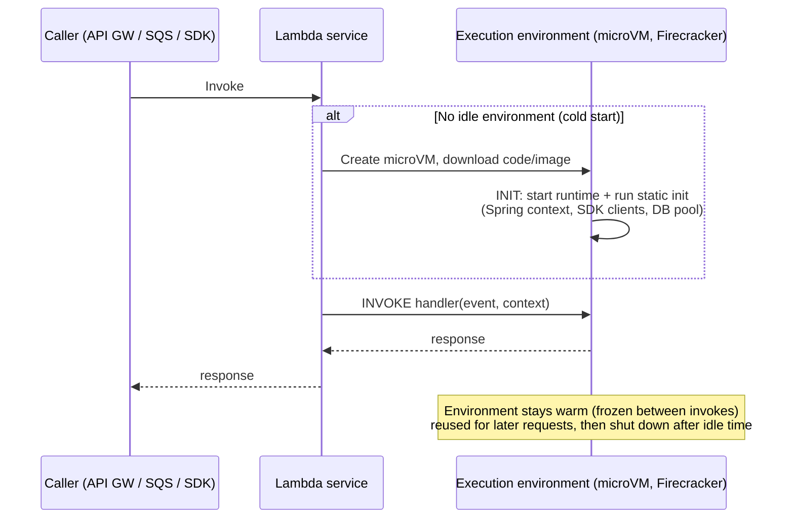
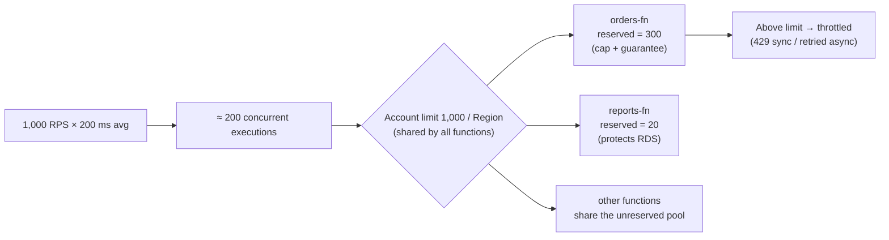
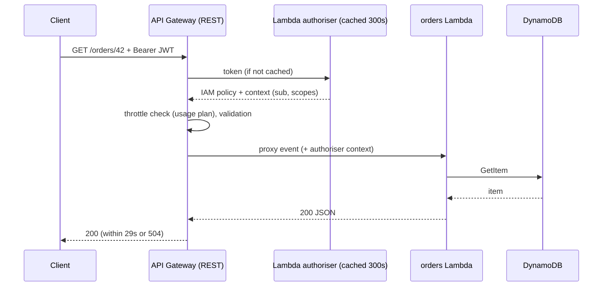

# Serverless: Lambda (Cold Starts, Concurrency, Limits) & API Gateway

!!! abstract "Key takeaways"
    - **Execution environment lifecycle:** INIT (download code, start the runtime, run your static/constructor code) → INVOKE (many times, reused while warm) → SHUTDOWN. A **cold start** is the INIT phase on a new environment. **One environment handles one request at a time.**
    - **Concurrency** is the number of in-flight requests (≈ RPS × duration):
        - Default account limit is **1,000 per Region** (raisable).
        - Each function scales by **1,000 environments every 10 seconds**.
        - **Reserved concurrency** caps a function and also guarantees it that capacity.
        - **Provisioned concurrency** keeps environments pre-initialised (no cold starts, extra cost).
    - **Java cold starts:** use **SnapStart** (Java 11+ including 25, Python 3.12+, .NET 8+), keep init lean, prime in `beforeCheckpoint`, and avoid heavy reflection or classpath scanning (or use GraalVM native images).
    - **Key limits:**
        - 15 min timeout; 128 MB–10 GB memory (CPU scales with it, 1 vCPU ≈ 1,769 MB); `/tmp` up to 10 GB.
        - Packages: 250 MB unzipped (zip + layers) or a 10 GB container image.
        - Payloads: **6 MB** synchronous, **1 MB** asynchronous (raised from 256 KB in late 2025), **200 MB** with response streaming.
    - **API Gateway:**
        - **HTTP API** is cheaper, faster and simpler, with JWT authorisers.
        - **REST API** has usage plans/API keys, request validation, caching, WAF, private endpoints and transformations.
        - Default throttle is 10,000 RPS with 5,000 burst per account per Region.
        - Integration timeout is **29 s** by default; Regional and private REST APIs can raise it up to 300 s through a quota increase, with a lower throttle.

## Why it matters

Lambda changes the questions you have to answer: no servers, but **cold starts**, **concurrency limits**, **timeouts**, **idempotency** and **downstream protection** (1,000 concurrent Lambdas can flatten an RDS instance). Interviewers probe whether you understand the **execution model**, not just "it's serverless". This is a resume topic (Lambda + API Gateway at Deloitte), so expect "why Lambda there, and what went wrong?"

## Core concepts

### Execution environment lifecycle


*Notice that INIT runs **once per environment** and INVOKE runs many times. Put expensive set-up (clients, connection pools, config) in INIT and reuse it. But one environment serves **one request at a time**, so concurrency equals the number of environments.*

Cold start drivers:

- runtime (Java and .NET are slower than Node, Python and Go)
- package size
- init work such as Spring context start-up or classpath scanning
- VPC attachment, which is now fast thanks to Hyperplane ENIs (no longer a big factor)

Since August 2025 the INIT phase is **billed** for on-demand functions too, so a slow init costs money as well as latency.

### Cold start mitigation

| Technique | How | Trade-off |
|---|---|---|
| **SnapStart** | Snapshot the initialised microVM after INIT, restore from cache | Restore hooks for uniqueness (random seeds, connections), versions/aliases only |
| **Provisioned concurrency** | N environments pre-initialised on an alias | Paid while idle. Combine with scheduled scaling |
| Lean init | Lazy-load, smaller frameworks (Micronaut, Quarkus, Spring Cloud Function + AOT), avoid scanning | Engineering effort |
| More memory | More CPU, so faster init | Higher cost per ms (often net cheaper) |
| GraalVM native image | Near-instant start | Build complexity, reflection config |
| Lambda Managed Instances (2025) | Run functions on EC2 capacity you choose, multi-concurrency per environment | Steady high-volume workloads, a different cost model |

### Concurrency and scaling


*Notice that concurrency is shared across the Region. One runaway function can starve the others unless you use **reserved concurrency** as a bulkhead. It also works as a **throttle to protect downstream systems**.*

### Invocation types and error handling

| Type | Examples | On error |
|---|---|---|
| **Synchronous** | API Gateway, ALB, SDK `RequestResponse` | Caller gets the error and decides whether to retry |
| **Asynchronous** | S3 events, SNS, EventBridge, SDK `Event` | Lambda retries **2×** (configurable 0–2) with backoff, max event age up to 6 h. Then **on-failure destination** (SQS/SNS/EventBridge/Lambda/S3) or DLQ |
| **Event source mapping (poll-based)** | SQS, Kinesis, DynamoDB Streams, MSK/Kafka | SQS: the message becomes visible again after the visibility timeout → redrive to DLQ after `maxReceiveCount`. Use **partial batch response** (`ReportBatchItemFailures`). Streams: retry, bisect batch, max retry attempts, on-failure destination |

Everything can be delivered **at least once**, so handlers must be **idempotent**. Use Powertools Idempotency with a DynamoDB table, or conditional writes.

### Newer capabilities to know (2025)

- **Lambda durable functions:** checkpoint and resume inside a function, for multi-step workflows that wait (approvals, callbacks) for up to a year without paying for idle time. An alternative to Step Functions for code-first workflows.
- **Lambda Managed Instances:** Lambda's programming model on EC2 instances in your VPC, with EC2 pricing options, for steady high-throughput workloads.
- **Response streaming** up to 200 MB, to reduce time to first byte.

### API Gateway: REST vs HTTP vs WebSocket

| | **HTTP API** | **REST API** |
|---|---|---|
| Cost / latency | Lower (roughly 70% cheaper per million) | Higher |
| Auth | **JWT authoriser** (OIDC/OAuth2), Lambda, IAM | Cognito, Lambda (token/request), IAM, resource policies |
| Throttling | Route-level throttling | **Usage plans + API keys** per client, stage/method throttling |
| Features | Simple proxy, CORS, auto-deploy | Request validation, **mapping templates**, caching, **WAF**, private endpoints, edge-optimised, X-Ray, canary stages |
| Timeout | 30 s max | 29 s default (raisable for Regional/private) |
| Payload | 10 MB | 10 MB |

**WebSocket APIs** handle bidirectional connections, with `$connect`, `$disconnect` and `$default` routes and a 2-hour connection limit.


*Notice that authoriser **caching** keeps auth latency and cost low. The 29-second integration timeout is why long work should be **asynchronous** (accept → queue → poll or callback).*

## In practice: code & configuration

=== "❌ Common mistake"
    ```java
    public class OrderHandler implements RequestHandler<APIGatewayProxyRequestEvent, APIGatewayProxyResponseEvent> {
        @Override
        public APIGatewayProxyResponseEvent handleRequest(APIGatewayProxyRequestEvent req, Context ctx) {
            // New client and new DB connection on EVERY invocation: slow, and exhausts RDS connections
            DynamoDbClient ddb = DynamoDbClient.create();
            Connection conn = DriverManager.getConnection(System.getenv("DB_URL"), "admin", "hardcoded");
            // Long synchronous work behind API Gateway: 504 after 29 s
            generateLargeReport(conn);
            return new APIGatewayProxyResponseEvent().withStatusCode(200);
        }
    }
    ```

=== "✅ Correct approach"
    ```java
    public class OrderHandler implements RequestHandler<APIGatewayProxyRequestEvent, APIGatewayProxyResponseEvent> {
        // INIT phase: created once per environment, reused across invocations (and captured by SnapStart)
        private static final DynamoDbClient DDB = DynamoDbClient.builder()
                .httpClient(UrlConnectionHttpClient.create())   // lighter than Apache client for cold starts
                .build();
        private static final SqsClient SQS = SqsClient.create();
        private static final String QUEUE_URL = System.getenv("REPORT_QUEUE_URL");

        @Override
        public APIGatewayProxyResponseEvent handleRequest(APIGatewayProxyRequestEvent req, Context ctx) {
            String reportId = UUID.randomUUID().toString();     // generated per request, NOT in static init
            // Long work goes async: enqueue and return 202 with a status URL
            SQS.sendMessage(b -> b.queueUrl(QUEUE_URL)
                    .messageBody("{\"reportId\":\"" + reportId + "\"}"));
            return new APIGatewayProxyResponseEvent()
                    .withStatusCode(202)
                    .withHeaders(Map.of("Location", "/reports/" + reportId));
        }
    }
    ```

```yaml
# AWS SAM: SnapStart + alias + reserved concurrency + SQS consumer with partial batch failures
Resources:
  OrderFn:
    Type: AWS::Serverless::Function
    Properties:
      Runtime: java25
      Architectures: [arm64]
      MemorySize: 2048                  # more CPU → faster init and execution
      Timeout: 10                       # well under API GW's 29 s
      SnapStart: { ApplyOn: PublishedVersions }
      AutoPublishAlias: live            # SnapStart works on versions/aliases
      ReservedConcurrentExecutions: 200 # bulkhead + protects downstream
      Events:
        Api:
          Type: HttpApi
          Properties: { Path: /orders/{id}, Method: GET }
  ReportWorker:
    Type: AWS::Serverless::Function
    Properties:
      Runtime: java25
      Timeout: 300
      Events:
        Queue:
          Type: SQS
          Properties:
            Queue: !GetAtt ReportQueue.Arn
            BatchSize: 10
            FunctionResponseTypes: [ReportBatchItemFailures]   # retry only failed messages
            ScalingConfig: { MaximumConcurrency: 20 }          # cap pollers → protect RDS
```

!!! tip "SQS visibility timeout"
    Set the queue's visibility timeout to at least **6× the function timeout** (AWS guidance for Lambda event source mappings). Otherwise messages reappear while still being processed and get handled twice.

## Real-world usage

- **Good fits:**
    - event-driven glue (S3 → process, EventBridge rules)
    - spiky or low-traffic APIs
    - scheduled jobs
    - stream processing
    - webhooks
- **Poor fits:**
    - long-running or steady very high throughput work (consider containers or Managed Instances)
    - latency-critical paths without SnapStart or provisioned concurrency
    - workloads that hold many DB connections (use **RDS Proxy**)
- **Classic incidents:**
    - A Lambda scales to hundreds of concurrent executions and exhausts RDS connections. Fix with RDS Proxy plus reserved or maximum concurrency.
    - **Recursive loops**: a Lambda writes to the same S3 bucket that triggers it. Lambda now detects and stops some recursive loops.
    - A 29-second API timeout on report generation.
- **Healthcare and banking:** Lambda in a VPC with private subnets and VPC endpoints, KMS-encrypted environment variables, and secrets fetched with caching from Secrets Manager.

## Trade-offs & production gotchas

| Option | Pros | Cons | Use when |
|---|---|---|---|
| Lambda + HTTP API | Cheapest, simple, JWT auth | Fewer features | Most new APIs |
| Lambda + REST API | Usage plans, WAF, caching, validation, private | Cost, complexity | Partner/public APIs, B2B |
| Lambda behind ALB | Mix with containers, no API GW cost at high RPS | Fewer API features | Internal, high-RPS |
| Provisioned concurrency | No cold starts | Pay for idle | Latency SLOs with steady baseline |
| SnapStart | Big Java cold-start cut, low cost | Uniqueness/restore hooks | Java APIs |

!!! warning "Gotchas"
    - **Uniqueness after SnapStart:** anything random or unique created during INIT (UUIDs, seeds, tokens with expiry, open connections) is **shared by every restored environment**. Generate it per invocation, or refresh it in `afterRestore` hooks.
    - **Timeouts must nest:** client > API Gateway (29 s) > Lambda timeout > SDK/HTTP client timeouts > DB query timeout.
    - **Concurrency is shared per Region:** reserve capacity for critical functions and cap noisy ones.
    - **Async retries + non-idempotent handler = duplicate side effects.** Use idempotency keys.

## How this connects to my experience

- **Where I used it:** ConvergeHealth Data Asset Explorer: "cloud-native microservices on AWS using **Lambda**… **API Gateway**", plus SQS/SNS/S3 for event-driven healthcare analytics workflows.
- **Talking points:**
    - "Lambda handled event-driven steps (S3 uploads, SQS consumers, scheduled jobs). Longer-running or steady services ran on ECS/EKS." *[confirm: which workloads were Lambda]*
    - "Fronted by API Gateway with authorisers, timeouts nested under 29 s, and long operations moved to async with 202 + status polling." *[confirm: REST vs HTTP API, authoriser type]*
    - "SQS consumers used partial batch failures, DLQs and idempotent handlers." *[confirm]*
    - "Java cold starts: we mitigated with … " *[confirm: SnapStart, provisioned concurrency, memory tuning, or runtime choice]*
- **Likely follow-up chain:** "What about cold starts?" → "How did you protect RDS?" → "What happens when the consumer fails?" → "How do you make retries safe?" Answer: SnapStart/provisioned concurrency → RDS Proxy + reserved concurrency → retries/DLQ/destinations → idempotency keys with DynamoDB conditional writes.

## Interview questions

### Fundamentals

??? question "Q1. What is a cold start and what causes it?"
    **Answer:** The INIT phase when Lambda creates a new execution environment: starting the microVM, downloading code, starting the runtime and running static init. It happens on first invoke, on scale-out, after idle reclaim and after deployments. It's worse with large packages, heavy frameworks and JVM/.NET start-up.

    **Interviewer listens for:** that INIT is per environment, and that scale-out causes cold starts too.

    **Common wrong answer:** "only the first request ever is cold".

??? question "Q2. What are the key Lambda limits?"
    **Answer:**
    - 15 min timeout; 128 MB–10 GB memory; `/tmp` up to 10 GB.
    - 250 MB unzipped package (with layers) or a 10 GB image.
    - Payloads: 6 MB sync, 1 MB async, 200 MB streamed response.
    - Concurrency: 1,000 per Region by default; scaling of 1,000 environments per 10 s per function.

    **Interviewer listens for:** current numbers, and knowing which are soft limits.

    **Common wrong answer:** "5 min timeout" (an old limit), "256 KB async" (raised in late 2025).

??? question "Q3. Reserved vs provisioned concurrency?"
    **Answer:** **Reserved** sets a max (and guarantees that capacity from the account pool). It's a throttle and bulkhead, and it's free. **Provisioned** keeps N environments pre-initialised to remove cold starts, and is billed while idle. They are often used together.

    **Interviewer listens for:** cap vs warm.

    **Common wrong answer:** "they're the same".

??? question "Q4. HTTP API vs REST API?"
    **Answer:** HTTP API is cheaper, lower-latency and simpler, with native JWT authorisers. REST API adds usage plans and API keys, request validation, mapping templates, caching, WAF, private and edge endpoints, and canary stages. Default to HTTP API unless you need REST features.

    **Interviewer listens for:** a feature-driven choice.

    **Common wrong answer:** "REST API is for REST, HTTP API is for HTTP".

### Intermediate

??? question "Q5. How do you reduce Java Lambda cold starts?"
    **Answer:**
    - **SnapStart** on a published version or alias, with priming in `beforeCheckpoint`.
    - More memory (more CPU).
    - Lighter HTTP clients.
    - Avoid classpath scanning; consider Micronaut, Quarkus or Spring AOT.
    - GraalVM native image.
    - Provisioned concurrency for strict SLOs.

    Measure `Init Duration` in REPORT logs.

    **Interviewer listens for:** SnapStart and its uniqueness caveats.

    **Common wrong answer:** "ping it every 5 minutes". That only keeps one environment warm.

??? question "Q6. What happens when an async invocation fails?"
    **Answer:** Lambda retries up to 2 more times with backoff, within the maximum event age (up to 6 h). Then it sends the event to the **on-failure destination** (or DLQ) if configured; otherwise the event is dropped. Throttled events are retried over the event age.

    **Interviewer listens for:** destinations over a DLQ (they carry more context).

    **Common wrong answer:** "it retries forever".

??? question "Q7. How does Lambda process SQS messages, and how do you avoid reprocessing a whole batch?"
    **Answer:** The event source mapping long-polls and invokes with batches. If the function throws, the whole batch becomes visible again. Use **`ReportBatchItemFailures`** and return the failed message IDs so only those are retried. Configure a DLQ with `maxReceiveCount`, set visibility timeout ≥ 6× the function timeout, and cap `MaximumConcurrency`.

    **Interviewer listens for:** partial batch response and visibility timeout.

    **Common wrong answer:** "Lambda deletes failed messages".

??? question "Q8. How do you stop Lambda overwhelming RDS?"
    **Answer:**
    - **RDS Proxy** pools and multiplexes connections, and reuses them across environments.
    - Reserved concurrency or ESM maximum concurrency caps parallelism.
    - Reuse connections from INIT.
    - Short timeouts.
    - Consider DynamoDB for very spiky access.

    **Interviewer listens for:** RDS Proxy plus a concurrency cap.

    **Common wrong answer:** "increase max_connections".

### Senior

??? question "Q9. API needs 2 minutes to generate a report. Design it."
    **Answer:**
    1. Accept with **202** and a job ID.
    2. Enqueue to SQS, or start Step Functions or a durable function.
    3. A worker generates the report and writes it to S3.
    4. The client polls `GET /jobs/{id}`, or gets a WebSocket or webhook notification.
    5. Return a **pre-signed S3 URL** for download.

    Raising the REST API timeout to 120 s is possible but ties up connections and lowers throttle limits.

    **Interviewer listens for:** an async pattern and pre-signed URLs.

    **Common wrong answer:** "raise the Lambda timeout to 15 min".

??? question "Q10. What are the risks of SnapStart?"
    **Answer:**
    - Uniqueness: random seeds, UUIDs and cached credentials or tokens created during INIT are duplicated across restored environments.
    - Stale network connections after restore. Re-establish them in `afterRestore`.
    - It only works on published versions or aliases.
    - Snapshot creation adds time to deployments.

    Use CRaC `Resource` hooks or Powertools.

    **Interviewer listens for:** uniqueness and restore hooks.

    **Common wrong answer:** "no downsides".

??? question "Q11. When would you NOT use Lambda?"
    **Answer:**
    - Steady high throughput, where containers or Managed Instances are cheaper.
    - Jobs longer than 15 minutes.
    - Long-lived connections or stateful workloads.
    - Very low, predictable latency without provisioned concurrency.
    - Heavy GPU work.
    - When the team needs local parity or full runtime control.

    **Interviewer listens for:** cost crossover and workload shape.

    **Common wrong answer:** "never, it's always cheaper".

### Scenario-based

??? question "Q12. A traffic spike makes other functions in the account throttle. Why, and how do you fix it?"
    **Answer:** Account concurrency is shared per Region, so one function took the pool. Fixes:
    - Reserved concurrency for critical functions.
    - Caps on noisy ones.
    - Raise the account quota.
    - Put SQS in front to buffer.
    - Separate accounts for workload isolation.
    - Alarm on `Throttles` and `ConcurrentExecutions`.

    **Interviewer listens for:** using reserved concurrency as a bulkhead.

    **Common wrong answer:** "add memory".

??? question "Q13. The SQS consumer processes some orders twice. Why, and what's the fix?"
    **Answer:** At-least-once delivery. Causes:
    - The visibility timeout is shorter than processing time, so a message reappears.
    - A batch failure retries messages that had already succeeded.
    - Async retries.

    Fixes:
    - Visibility timeout ≥ 6× the function timeout.
    - Partial batch response.
    - **Idempotency**: an idempotency key in DynamoDB with a conditional put, or Powertools Idempotency.
    - FIFO + deduplication ID where ordering and exactly-once *sends* matter.

    **Interviewer listens for:** idempotency as the real fix.

    **Common wrong answer:** "use FIFO, which guarantees exactly once processing".

## Cheat sheet

| Concept | Remember |
|---|---|
| Lifecycle | INIT (once per environment, billed since Aug 2025) → INVOKE (reused) → SHUTDOWN. 1 request per environment |
| Concurrency | ≈ RPS × duration. 1,000/Region default. +1,000 environments/10 s per function |
| Reserved / provisioned | Cap + guarantee (free) / pre-warmed (paid) |
| Limits | 15 min, 10 GB memory, 10 GB `/tmp`, 250 MB zip / 10 GB image |
| Payload | 6 MB sync, **1 MB async**, 200 MB streamed |
| Java | SnapStart (versions/aliases, uniqueness hooks), more memory, lean init |
| Async errors | 2 retries, max event age ≤ 6 h, on-failure destination/DLQ |
| SQS ESM | Partial batch response, visibility ≥ 6× timeout, `MaximumConcurrency`, DLQ |
| API GW | HTTP API (cheap, JWT) vs REST (usage plans, WAF, cache, validation, private) |
| API GW limits | 10k RPS / 5k burst per account-Region. 29 s timeout (REST Regional/private up to 300 s by quota). 10 MB payload |
| DB | RDS Proxy + concurrency cap |
| 2025 additions | Durable functions, Managed Instances, 200 MB streaming |

## Sources
1. [Lambda quotas](https://docs.aws.amazon.com/lambda/latest/dg/gettingstarted-limits.html): memory, timeout, payload, package sizes.
2. [Lambda scaling behaviour](https://docs.aws.amazon.com/lambda/latest/dg/scaling-behavior.html): 1,000 environments per 10 s per function.
3. [Lambda execution environment lifecycle](https://docs.aws.amazon.com/lambda/latest/dg/lambda-runtime-environment.html): INIT, INVOKE, SHUTDOWN.
4. [Lambda SnapStart](https://docs.aws.amazon.com/lambda/latest/dg/snapstart.html): supported runtimes, uniqueness, hooks.
5. [Lambda async payload raised to 1 MB](https://aws.amazon.com/about-aws/whats-new/2025/10/aws-lambda-payload-size-256-kb-1-mb-invocations): async limit change.
6. [Lambda response streaming 200 MB](https://aws.amazon.com/about-aws/whats-new/2025/07/aws-lambda-response-streaming-200-mb-payloads): streamed payload limit.
7. [Using Lambda with Amazon SQS](https://docs.aws.amazon.com/lambda/latest/dg/with-sqs.html): partial batch response, visibility timeout guidance, maximum concurrency.
8. [Asynchronous invocation](https://docs.aws.amazon.com/lambda/latest/dg/invocation-async.html): retries, max event age, destinations.
9. [API Gateway: choose between REST and HTTP APIs](https://docs.aws.amazon.com/apigateway/latest/developerguide/http-api-vs-rest.html): feature comparison.
10. [API Gateway quotas](https://docs.aws.amazon.com/apigateway/latest/developerguide/api-gateway-execution-service-limits-table.html) and [raising the integration timeout](https://repost.aws/knowledge-center/api-gateway-timeout-limit): 29 s default, up to 300 s.
11. [re:Invent 2025: Lambda durable functions](https://repost.aws/articles/ARc8wmu4l9TKywZCHX-_nn6w/re-invent-2025-deep-dive-on-aws-lambda-durable-functions) and [Managed Instances overview](https://cloudvisor.co/aws-lambda-managed-instances-vs-durable-functions/).
12. [Powertools for AWS Lambda (Java): Idempotency](https://docs.powertools.aws.dev/lambda/java/utilities/idempotency/): idempotent handlers.
