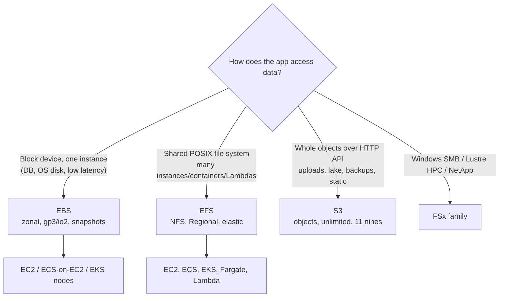
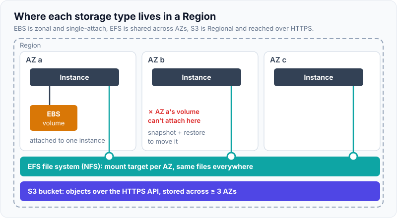
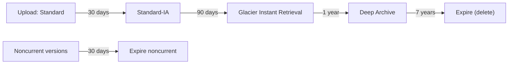
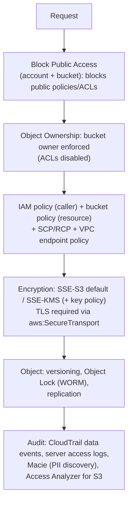

# Storage: S3 (Classes, Consistency, Security), EBS vs EFS

!!! abstract "Key takeaways"
    - **S3 is object storage:** a key → object (up to **50 TB** since December 2025, multipart required above 5 GB). It's designed for **11 nines durability**, data is stored across ≥ 3 AZs (except One Zone classes), and it has **strong read-after-write consistency** for all PUTs, DELETEs and LISTs since December 2020.
    - **Storage classes** trade access cost and latency for storage price:
        - Standard → Intelligent-Tiering → Standard-IA / One Zone-IA (30-day minimum)
        - Glacier Instant Retrieval (90-day minimum, ms access) → Glacier Flexible Retrieval (minutes–hours) → Deep Archive (12–48 h, 180-day minimum)
        - Express One Zone: single-digit ms, directory buckets

        **Lifecycle rules** move or expire objects automatically.
    - **Performance:** at least **3,500 writes and 5,500 reads per second per prefix**, scaling automatically. Use multipart upload and byte-range GETs for large objects, and CloudFront for reads.
    - **Security defaults** (since 2023): **Block Public Access on**, **ACLs disabled** (bucket owner enforced), **SSE-S3 encryption by default**. SSE-C is disabled by default on new buckets since April 2026. Add SSE-KMS with **bucket keys**, bucket policies that deny non-TLS access and enforce org/VPC endpoint, **versioning + Object Lock** (WORM) for ransomware and regulatory retention, and **pre-signed URLs** for temporary access.
    - **EBS:** block storage, **zonal**, attached to one instance (except Multi-Attach io2). Use gp3 by default (up to 80,000 IOPS / 2,000 MiB/s / 64 TiB since September 2025). **EFS:** managed **NFS**, Regional (multi-AZ), shared by thousands of clients, elastic. **S3:** objects over HTTP, unlimited, the cheapest at scale.

## Why it matters

Almost every AWS system stores something in S3: uploads, exports, data lakes, backups, static sites, logs. The **misconfigured public bucket** is one of the most famous cloud breach patterns, which is why interviewers ask about S3 security in detail. They also check whether you'd pick the right storage type (block vs file vs object) and whether you know the cost traps: retrieval fees, minimum storage durations, request costs and KMS request costs.

## Core concepts

### Choosing a storage type


*Notice that the decision comes from the **access pattern**, not the size. S3 is not a file system (no partial in-place updates or POSIX locks); EBS can't be shared across AZs.*

{ loading=lazy }
*Notice the scope of each one: EBS stays inside one AZ, EFS reaches every AZ through mount targets, and S3 isn't mounted at all.*

| | **EBS** | **EFS** | **S3** |
|---|---|---|---|
| Type | Block | File (NFSv4.1) | Object (HTTP API) |
| Scope | **One AZ**, one instance (Multi-Attach io2 in an AZ) | **Regional** (multi-AZ) or One Zone | Regional (≥ 3 AZs) |
| Latency | Sub-ms (io2) / ~ms | Low ms | Tens of ms first byte (Express One Zone: single-digit ms) |
| Scale | Up to 64 TiB per gp3 volume | Petabytes, elastic | Unlimited, 50 TB per object |
| Price (rough order) | $$ per provisioned GB | $$$ per used GB (IA tiers cheaper) | $ per used GB + requests |
| Backup | Snapshots (incremental, to S3) | AWS Backup | Versioning, replication, Backup |
| Use for | DB volumes, boot disks | Shared content, CMS, ML data, legacy apps | Everything else: lake, uploads, static, archives |

### S3 data model and consistency

- **Bucket** (in a Region, globally unique name) → **key** (`reports/2026/10/a.pdf`) → **object** (data + metadata + version ID).
- Prefixes aren't folders. They're part of the key, and the console just displays them as folders.
- **Strong consistency:** after a successful PUT or DELETE, any later GET or LIST sees it. This applies to overwrites too. There's no locking between concurrent writers: last writer wins, unless you use **conditional writes** (`If-None-Match: *` to create only if absent; `If-Match: <etag>` for optimistic concurrency, added 2024).
- **Versioning** keeps every version. A DELETE adds a *delete marker*. Required for replication and Object Lock.

### Storage classes

| Class | Availability design | Min duration | Retrieval | Use for |
|---|---|---|---|---|
| Standard | Multi-AZ | none | ms | Hot data |
| Intelligent-Tiering | Multi-AZ | none (monitoring fee per object) | ms (optional archive tiers) | **Unknown or changing patterns** |
| Standard-IA | Multi-AZ | 30 days, 128 KB min billable | ms + per-GB retrieval fee | Monthly-accessed data |
| One Zone-IA | **One AZ** | 30 days | ms + fee | Re-creatable data |
| Glacier Instant Retrieval | Multi-AZ | 90 days | **ms** + fee | Quarterly-accessed archives (medical images) |
| Glacier Flexible Retrieval | Multi-AZ | 90 days | Minutes to 12 h | Backups |
| Glacier Deep Archive | Multi-AZ | 180 days | 12–48 h | Compliance retention (7–10 years) |
| Express One Zone | One AZ, directory buckets | none | **single-digit ms** | ML training, high-request analytics |


*Notice that lifecycle rules encode the **retention policy**. Also expire **noncurrent versions** and **incomplete multipart uploads**, or versioned buckets grow forever.*

### Performance

- Each **prefix** supports ≥ **3,500 PUT/COPY/POST/DELETE** and **5,500 GET/HEAD** requests per second, and S3 scales out automatically. Spreading keys across prefixes multiplies the throughput. A brief 503 *SlowDown* can happen while S3 scales; SDKs retry with backoff.
- **Multipart upload:** parts of 5 MB–5 GB, up to 10,000 parts, uploaded in parallel and retried individually. Use it above ~100 MB. **Byte-range GETs** parallelise downloads.
- **Transfer Acceleration** speeds up long-distance uploads through edge locations. **CloudFront** caches reads.

### The S3 security model, in layers


*Notice the defence in depth: even if someone writes a public bucket policy, **Block Public Access** overrides it. Even with access, **SSE-KMS** needs a separate key permission, and every access is auditable.*

- **Encryption at rest:**
    - **SSE-S3** (AES-256, S3-managed keys) is on by default since January 2023.
    - **SSE-KMS** gives key-level access control and CloudTrail audit of key use. Enable **S3 Bucket Keys** to cut KMS request costs by up to 99%.
    - **DSSE-KMS** applies two layers.
    - **SSE-C** uses customer-provided keys. It's disabled by default for new buckets since April 2026, partly because attackers have abused it for ransomware.
    - Client-side encryption is also an option.
- **Pre-signed URLs** give time-limited GET/PUT access signed by the creator's credentials. They're valid only as long as both the expiry and the signer's credentials are valid. A role-signed URL dies when the session expires.
- **Object Lock:**
    - **Governance mode**: privileged users can bypass it.
    - **Compliance mode**: nobody can delete it before the retain-until date, not even root.
    - **Legal hold**: an indefinite hold.

    Used for SEC 17a-4, HIPAA retention and ransomware protection.
- **Access points** give each application or team its own policy and network origin (VPC-only) for shared datasets.

{ loading=lazy }
*Watch the file token: it goes from the browser to S3 and never touches your API. The API only checks who the user is and signs a short-lived URL.*

## In practice: code & configuration

=== "❌ Common mistake"
    ```java
    // Proxying a 2 GB upload through your API (memory, timeouts, cost),
    // and a bucket policy that opens everything to fix a 403.
    @PostMapping("/upload")
    public void upload(@RequestBody byte[] file) {               // whole file in heap
        s3.putObject(b -> b.bucket("exports").key("f.bin"), RequestBody.fromBytes(file));
    }
    // bucket policy: { "Effect":"Allow", "Principal":"*", "Action":"s3:*", "Resource":"arn:aws:s3:::exports/*" }
    ```

=== "✅ Correct approach"
    ```java
    // Client uploads directly to S3 with a short-lived pre-signed PUT URL.
    @PostMapping("/uploads")
    public UploadTicket createUpload(@AuthenticationPrincipal Jwt user, @RequestBody UploadRequest req) {
        String key = "incoming/%s/%s".formatted(user.getSubject(), UUID.randomUUID());
        PutObjectRequest put = PutObjectRequest.builder()
                .bucket(bucket).key(key)
                .contentType(req.contentType())
                .serverSideEncryption(ServerSideEncryption.AWS_KMS)  // must match what the client sends
                .build();
        PresignedPutObjectRequest p = presigner.presignPutObject(r -> r
                .signatureDuration(Duration.ofMinutes(5))             // short expiry
                .putObjectRequest(put));
        return new UploadTicket(key, p.url().toString());            // client PUTs bytes straight to S3
    }
    // S3 → EventBridge/SQS "ObjectCreated" → scanner/processor validates type and size, then moves to clean/
    ```

```json
{
  "Version": "2012-10-17",
  "Statement": [
    { "Sid": "DenyInsecureTransport", "Effect": "Deny", "Principal": "*", "Action": "s3:*",
      "Resource": ["arn:aws:s3:::hc-exports-prod", "arn:aws:s3:::hc-exports-prod/*"],
      "Condition": { "Bool": { "aws:SecureTransport": "false" } } },
    { "Sid": "DenyOutsideOrg", "Effect": "Deny", "Principal": "*", "Action": "s3:*",
      "Resource": ["arn:aws:s3:::hc-exports-prod", "arn:aws:s3:::hc-exports-prod/*"],
      "Condition": { "StringNotEquals": { "aws:PrincipalOrgID": "o-abc123" },
                     "Bool": { "aws:PrincipalIsAWSService": "false" } } }
  ]
}
```

```hcl
resource "aws_s3_bucket_lifecycle_configuration" "exports" {
  bucket = aws_s3_bucket.exports.id
  rule {
    id     = "tiering-and-retention"
    status = "Enabled"
    filter {}
    transition {
      days          = 30
      storage_class = "STANDARD_IA"
    }
    transition {
      days          = 90
      storage_class = "GLACIER_IR"
    }
    expiration { days = 2555 }                                     # ~7 years retention
    noncurrent_version_expiration { noncurrent_days = 30 }
    abort_incomplete_multipart_upload { days_after_initiation = 7 }
  }
}
```

## Real-world usage

- **Public bucket breaches:** many incidents (voter rolls, health records, defence contractor data) came from buckets opened by ACLs or `Principal: *` policies. AWS's 2023 defaults (Block Public Access on, ACLs off) were a direct response.
- **Ransomware on S3:** attackers with stolen credentials re-encrypt objects with SSE-C or delete them. The defences are **versioning + Object Lock**, MFA delete, backups in a separate account, least privilege, and denying SSE-C.
- **Data lakes:** S3 + Glue catalog + Athena/EMR/Redshift Spectrum, Parquet files partitioned by date, now also **S3 Tables** (managed Apache Iceberg) for analytics.
- **Healthcare:** DICOM images in Glacier Instant Retrieval (rarely read, but needed in milliseconds when they are), PHI buckets with SSE-KMS, Macie scanning for PII, and Object Lock for retention.

## Trade-offs & production gotchas

| Option | Pros | Cons | Use when |
|---|---|---|---|
| SSE-S3 | Free, automatic | No key-level access control or per-key audit | Non-sensitive data |
| SSE-KMS (+ bucket key) | Key policy access control, CloudTrail audit, rotation | KMS request cost and quotas (bucket key mitigates) | PHI/PII, regulated data |
| Intelligent-Tiering | No guessing access patterns | Monitoring fee per object (objects < 128 KB aren't tiered) | Unknown patterns, large objects |
| Standard-IA | Cheaper storage | Retrieval fee, 30-day and 128 KB minimums | Known infrequent access |
| EFS | Shared, elastic, multi-AZ | Higher $/GB, NFS latency | Shared POSIX needs |
| EBS gp3 | Cheap, tunable IOPS and throughput independently | Zonal, single attach | DB and boot volumes |

!!! warning "Gotchas"
    - **Minimum durations and sizes:** small or short-lived objects in IA or Glacier cost **more** than Standard.
    - **KMS throttling:** high-request SSE-KMS workloads without bucket keys can hit KMS request quotas.
    - **Cross-account writes:** without "bucket owner enforced", objects uploaded by another account may be unreadable by the bucket owner.
    - **Listing is slow and costly at scale.** Use **S3 Inventory** or keep an index in DynamoDB instead of `ListObjects` scans.
    - **EBS is zonal:** to move a volume across AZs, snapshot it and restore in the target AZ. Prefer gp3 over gp2 (cheaper, with IOPS decoupled from size).

## How this connects to my experience

- **Where I used it:** ConvergeHealth Data Asset Explorer: "**S3**" among the core services, event-driven healthcare analytics workflows, and security controls with **KMS**. CCKM: "AWS KMS, encryption services".
- **Talking points:**
    - "Healthcare datasets in S3 with SSE-KMS, Block Public Access, TLS-only and org-only bucket policies. Uploads went direct to S3 through pre-signed URLs, and S3 events triggered processing." *[confirm: upload flow, event trigger (S3 → SQS/Lambda/EventBridge)]*
    - "Lifecycle rules tiered old exports and expired temporary files." *[confirm]*
    - "From CCKM, I understand the key side: envelope encryption, key policies, and why bucket keys matter for cost." (factual from the resume)
- **Likely follow-up chain:** "How did you secure the buckets?" → "How do clients upload big files?" → "How do you guard against ransomware or deletion?" → "How do you cut storage cost?" Answer: layered model → pre-signed URLs + event processing → versioning, Object Lock, cross-account backup → lifecycle and Intelligent-Tiering.

## Interview questions

### Fundamentals

??? question "Q1. Is S3 eventually consistent?"
    **Answer:** No. Since December 2020, S3 gives **strong read-after-write consistency** for PUTs (new and overwrite), DELETEs and LISTs, automatically and at no extra cost. Concurrent writers to the same key still follow last-writer-wins. Use conditional writes for coordination.

    **Interviewer listens for:** knowing the 2020 change, and the concurrency nuance.

    **Common wrong answer:** "eventual consistency for overwrites" (outdated).

??? question "Q2. Name the S3 storage classes and when to use each."
    **Answer:**
    - **Standard:** hot data.
    - **Intelligent-Tiering:** unknown patterns.
    - **Standard-IA / One Zone-IA:** infrequent access; One Zone only for re-creatable data.
    - **Glacier Instant Retrieval:** archives that need ms access.
    - **Glacier Flexible Retrieval:** backups, minutes to hours.
    - **Deep Archive:** compliance retention, 12–48 h.
    - **Express One Zone:** ultra-low latency.

    **Interviewer listens for:** minimum durations and retrieval fees.

    **Common wrong answer:** "Glacier always takes hours". Instant Retrieval doesn't.

??? question "Q3. EBS vs EFS vs S3?"
    **Answer:** EBS is zonal block storage for one instance (DBs, boot disks). EFS is a managed NFS file system shared across AZs and many clients. S3 is object storage over HTTP: unlimited, cheapest, and for whole-object access.

    **Interviewer listens for:** access pattern, and that EBS is zonal.

    **Common wrong answer:** "S3 can be mounted like a disk for a database".

??? question "Q4. What is a pre-signed URL?"
    **Answer:** A URL signed with the creator's credentials that grants time-limited access to a specific object operation (GET/PUT). The client talks to S3 directly. It's valid until it expires **or** the signing credentials expire.

    **Interviewer listens for:** direct-to-S3 uploads, and the credential-lifetime caveat.

    **Common wrong answer:** "it makes the object public".

### Intermediate

??? question "Q5. How do you secure an S3 bucket holding PHI?"
    **Answer:**
    - Block Public Access (account and bucket), ACLs disabled.
    - SSE-KMS with a customer managed key and a bucket key.
    - A bucket policy that denies non-TLS access and principals outside the org, and optionally requires a VPC endpoint.
    - Least-privilege IAM.
    - Versioning + Object Lock if retention requires it.
    - CloudTrail data events, Macie, Access Analyzer.
    - Replication or backup to a separate account.

    **Interviewer listens for:** layers, plus audit.

    **Common wrong answer:** "just encryption".

??? question "Q6. What does S3 throughput look like, and how do you scale it?"
    **Answer:** At least 3,500 writes and 5,500 reads per second per prefix, scaling automatically. Spread keys across prefixes, use multipart and byte-range requests, put CloudFront in front for reads, and retry 503 SlowDown with backoff.

    **Interviewer listens for:** per-prefix limits, and that modern S3 no longer needs random key prefixes.

    **Common wrong answer:** "S3 has a fixed 100 RPS limit".

??? question "Q7. SSE-S3 vs SSE-KMS vs SSE-C?"
    **Answer:**
    - **SSE-S3:** S3 manages the keys. Default and free.
    - **SSE-KMS:** KMS keys give a separate permission layer, an audit trail and rotation control. It costs KMS requests (use bucket keys).
    - **SSE-C:** the client supplies the key with each request, and AWS doesn't store it. Disabled by default on new buckets since April 2026.

    **Interviewer listens for:** the separate permission layer is the main reason to choose KMS.

    **Common wrong answer:** "SSE-KMS is stronger encryption". It's the same AES-256; the difference is control.

??? question "Q8. Versioning vs Object Lock vs replication?"
    **Answer:** Versioning keeps prior versions and protects against overwrite or accidental delete. **Object Lock** (WORM) prevents deletion until a retain-until date: compliance mode can't be bypassed even by root. Replication (CRR/SRR) copies objects to another bucket, Region or account, for DR, latency or compliance. Replication doesn't protect against deletes unless delete-marker replication is configured carefully.

    **Interviewer listens for:** that ransomware protection needs Object Lock or a separate-account copy.

    **Common wrong answer:** "versioning makes data immutable".

### Senior

??? question "Q9. Design large-file upload for a web app (up to 5 GB)."
    **Answer:**
    1. The API authorises the user and issues pre-signed URLs for a **multipart upload** (create → presign each part → complete).
    2. The browser uploads parts in parallel and retries failed parts.
    3. The S3 event goes to EventBridge or SQS, then a processor validates type and size and runs malware scanning.
    4. The processor moves the file to a "clean" prefix and updates the DB.
    5. Lifecycle aborts incomplete uploads.
    6. Encrypt with SSE-KMS, and set CORS rules on the bucket.

    **Interviewer listens for:** no proxying through the API, plus validation after upload.

    **Common wrong answer:** "stream through API Gateway". It has a 10 MB limit.

??? question "Q10. How do you protect S3 data from ransomware?"
    **Answer:**
    - Least privilege, with no broad `s3:DeleteObject` or `PutObject` on critical buckets.
    - Versioning + **Object Lock** (compliance mode for critical data).
    - AWS Backup or replication to a **separate account** with restrictive policies (vault lock).
    - Deny SSE-C.
    - GuardDuty S3 protection.
    - Alarms on mass deletes or encryption changes.

    **Interviewer listens for:** isolation plus immutability.

    **Common wrong answer:** "enable encryption". Attackers can encrypt too.

??? question "Q11. Your S3 + KMS workload is getting ThrottlingException. Why, and what's the fix?"
    **Answer:** Each SSE-KMS PUT or GET calls KMS (GenerateDataKey/Decrypt), and KMS has per-Region request quotas. Enable **S3 Bucket Keys**: S3 then uses a bucket-level data key derived from the KMS key, which cuts KMS calls dramatically. Or request a quota increase.

    **Interviewer listens for:** bucket keys.

    **Common wrong answer:** "switch to SSE-S3" without considering the compliance impact.

### Scenario-based

??? question "Q12. The storage bill doubled in 3 months. Where do you look?"
    **Answer:**
    1. S3 Storage Lens and Cost Explorer by bucket, class and request type.
    2. Noncurrent versions piling up.
    3. Incomplete multipart uploads.
    4. Small objects in IA or Glacier (minimums).
    5. Retrieval fees from scanning cold data.
    6. Request costs from chatty LIST/GET calls.
    7. Cross-Region replication and data transfer.
    8. Unattached EBS volumes and old snapshots.

    Fix with lifecycle rules, Intelligent-Tiering, compaction and inventory.

    **Interviewer listens for:** versioning and multipart cleanup.

    **Common wrong answer:** "move everything to Glacier".

??? question "Q13. Several containers need to share uploaded files. EFS or S3?"
    **Answer:**
    - **S3**, if the app can read and write whole objects through the SDK. It's cheaper, unlimited and event-driven.
    - **EFS**, if it needs POSIX semantics (legacy libraries, file locks, in-place appends), for example shared assets for a CMS.
    - Avoid S3 FUSE mounts for write-heavy POSIX workloads.

    **Interviewer listens for:** access semantics.

    **Common wrong answer:** "EBS Multi-Attach". That's same-AZ only, needs a cluster-aware file system, and is io2-only.

## Cheat sheet

| Concept | Remember |
|---|---|
| Durability | 11 nines, ≥ 3 AZs (except One Zone) |
| Consistency | Strong read-after-write (since 2020). Conditional writes for concurrency |
| Object size | Up to 50 TB (Dec 2025). Single PUT ≤ 5 GB. Multipart 5 MB–5 GB parts, ≤ 10,000 |
| Throughput | 3,500 writes / 5,500 reads per second per prefix |
| Classes | Standard, Int-Tiering, IA (30d), One Zone-IA, Glacier IR (90d, ms), Flexible (90d), Deep Archive (180d, 12–48 h), Express One Zone |
| Defaults | Block Public Access on, ACLs off, SSE-S3 on (2023), SSE-C off for new buckets (Apr 2026) |
| KMS | SSE-KMS + **bucket keys**. Key policy is a separate permission layer |
| Object Lock | Governance (bypassable) vs Compliance (not even root) + legal hold |
| Pre-signed | Time-limited, valid only while the signer's credentials are valid |
| EBS | Zonal block. gp3 default (≤ 80k IOPS, 2,000 MiB/s, 64 TiB). Snapshots to S3 |
| EFS | NFS, Regional, shared, elastic, IA tiers |

## Sources
1. [Amazon S3 strong consistency](https://aws.amazon.com/s3/consistency/): read-after-write for all operations.
2. [S3 storage classes](https://docs.aws.amazon.com/AmazonS3/latest/userguide/storage-class-intro.html): classes, minimum durations, retrieval.
3. [S3 maximum object size 50 TB](https://aws-news.com/article/2025-12-02-amazon-s3-increases-the-maximum-object-size-to-50-tb): Dec 2025 change.
4. [S3 performance guidelines](https://docs.aws.amazon.com/AmazonS3/latest/userguide/optimizing-performance.html): per-prefix request rates, multipart, byte-range.
5. [S3 security best practices](https://docs.aws.amazon.com/AmazonS3/latest/userguide/security-best-practices.html): Block Public Access, policies, encryption.
6. [Default encryption and Block Public Access defaults (2023)](https://docs.aws.amazon.com/AmazonS3/latest/userguide/default-bucket-encryption.html): SSE-S3 default.
7. [SSE-C disabled by default from April 2026](https://aws.amazon.com/blogs/storage/advanced-notice-amazon-s3-to-disable-the-use-of-sse-c-encryption-by-default-for-all-new-buckets-and-select-existing-buckets-in-april-2026): SSE-C change.
8. [S3 Bucket Keys](https://docs.aws.amazon.com/AmazonS3/latest/userguide/bucket-key.html): reducing KMS request costs.
9. [S3 Object Lock](https://docs.aws.amazon.com/AmazonS3/latest/userguide/object-lock.html): governance, compliance, legal hold.
10. [S3 conditional writes](https://docs.aws.amazon.com/AmazonS3/latest/userguide/conditional-requests.html): If-None-Match and If-Match.
11. [EBS volume types](https://docs.aws.amazon.com/ebs/latest/userguide/ebs-volume-types.html) and [gp3 limits raised (Sept 2025)](https://aws.amazon.com/about-aws/whats-new/2025/09/amazon-ebs-size-provisioned-performance-gp3-volumes).
12. [Amazon EFS user guide](https://docs.aws.amazon.com/efs/latest/ug/whatisefs.html): NFS, Regional vs One Zone, throughput modes.
