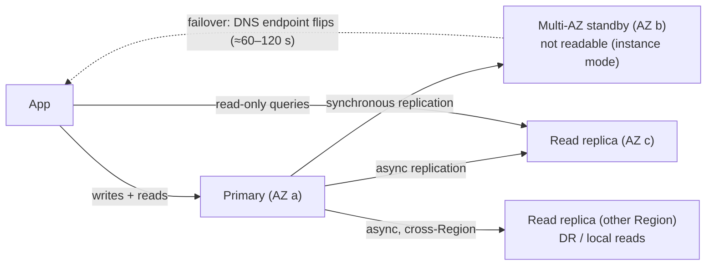
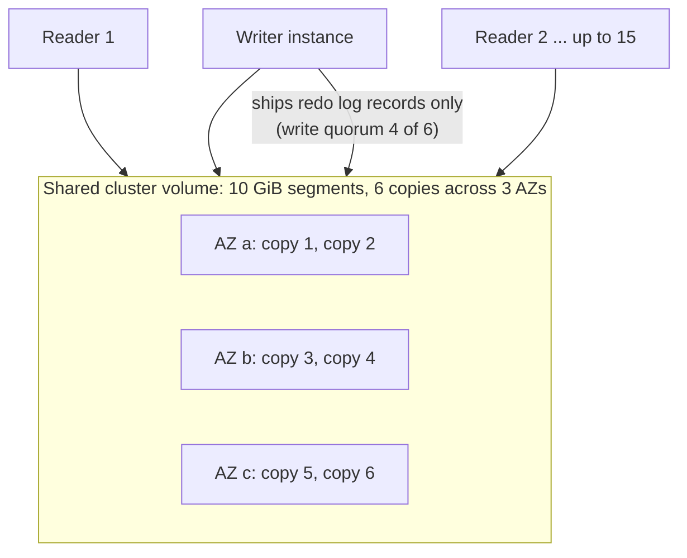
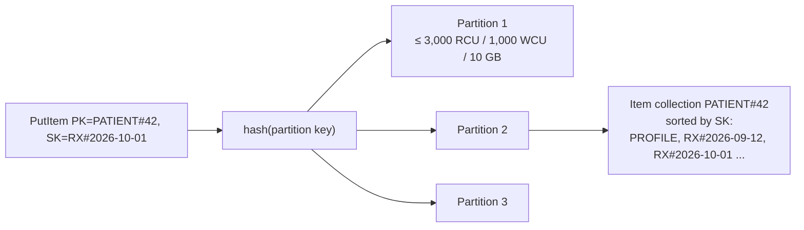

# Databases: RDS/Aurora, DynamoDB (Keys, GSI/LSI, Capacity)

!!! abstract "Key takeaways"
    - **RDS** is managed relational databases (PostgreSQL, MySQL, MariaDB, Oracle, SQL Server, Db2).
        - **Multi-AZ** is a synchronous standby for **HA**, with automatic failover in about a minute or two. A *Multi-AZ DB cluster* has 2 readable standbys and faster failover.
        - **Read replicas** are **async** copies used to scale **reads** (and for cross-Region DR).
        - Automated backups give **point-in-time recovery** (retention up to 35 days).
    - **Aurora:**
        - Compute is separate from a **shared, distributed storage volume**: 6 copies across 3 AZs, with 4/6 write and 3/6 read quorums. Storage grows to **256 TiB**.
        - Up to **15 replicas** share that storage (millisecond lag), and failover is typically under 30 s.
        - **Serverless v2** scales in ACUs (and can scale to zero).
        - **Global Database** replicates across Regions with typically under 1 s lag.
    - **DynamoDB** is a key-value/document store with single-digit-ms latency at any scale.
        - **The partition key decides which partition holds the data.** Each partition handles up to **3,000 RCU / 1,000 WCU / 10 GB**, so key design determines scalability.
        - The sort key enables range queries within a partition. Items are up to **400 KB**.
    - **GSI vs LSI:**
        - **GSI:** a different partition and sort key, can be added any time, **eventually consistent only**, has its own throughput, 20 per table by default.
        - **LSI:** same partition key with a different sort key, **must be created with the table**, max 5, can be strongly consistent, and limits each item collection to **10 GB**.
    - **Capacity:**
        - **On-demand:** pay per request, instant scaling. The default choice since its 2024 price cut.
        - **Provisioned:** RCU/WCU with auto scaling, cheaper for steady load.
        - 1 RCU = one strongly consistent read of 4 KB per second (or two eventually consistent reads). 1 WCU = one 1 KB write per second. Transactions cost 2×.

## Why it matters

"SQL or NoSQL?" and "how would you model this in DynamoDB?" come up in nearly every AWS interview. RDS questions test **HA vs read scaling** (people often confuse Multi-AZ and read replicas). DynamoDB questions test whether you design **from access patterns**: hot partitions, GSIs and single-table design are where people fail.

## Core concepts

### RDS: HA vs read scaling


*Notice the two different purposes: Multi-AZ = **availability** (synchronous, automatic failover, same endpoint). Read replicas = **read scale and DR** (asynchronous, so they can lag, and promotion is a manual or scripted step).*

| | Multi-AZ (instance) | Multi-AZ DB cluster | Read replica |
|---|---|---|---|
| Replication | Synchronous | Semi-sync to 2 standbys | Asynchronous |
| Readable | No | **Yes** (reader endpoint) | Yes |
| Failover | Automatic, ~1–2 min | Automatic, typically < 35 s | Manual promotion |
| Purpose | HA | HA + some read scale | Read scale, cross-Region DR |

Other RDS essentials:

- **RDS Proxy** pools connections, which matters for Lambda.
- **Blue/green deployments** for major-version upgrades with fast switchover.
- **Performance Insights / Database Insights** for query-level performance.
- **IAM database authentication**.
- Storage autoscaling.
- Encryption with KMS must be chosen at creation. To encrypt an existing database, snapshot → copy with encryption → restore.

### Aurora architecture


*Notice that replicas don't replay a full copy of the data. They read the **same storage**, so replica lag is usually in milliseconds and failover only needs to promote a reader. Losing a whole AZ (2 copies) still leaves write quorum.*

Aurora features:

- **Endpoints:** cluster (writer), reader (load-balanced), custom.
- **Serverless v2:** fine-grained capacity in ACUs, mixable with provisioned instances.
- **Global Database:** storage-level replication to up to 10 secondary Regions, with managed switchover and failover.
- **Backtrack** (MySQL).
- **Fast cloning.**
- **I/O-Optimized** pricing for I/O-heavy workloads.
- **Aurora DSQL** (GA 2025): serverless, distributed, PostgreSQL-compatible, active-active across Regions with strong consistency. It's a different engine with its own limitations.

### DynamoDB: how keys map to partitions


*Notice that every item with the same partition key lives together, sorted by sort key. That makes `Query PK = PATIENT#42 AND SK begins_with RX#` cheap. But **one popular partition key can't exceed one partition's limits**: that's a hot partition.*

Key design rules:

1. **List the access patterns first**, then design keys. DynamoDB has no ad-hoc joins.
2. Use **high-cardinality partition keys** with evenly spread traffic (userId, orderId), not status or date.
3. Use **sort keys for hierarchy and ranges**: `ORDER#2026-10-01#123`, and `begins_with` / `between` queries.
4. **Adaptive capacity** and split-for-heat help with uneven load, but they can't fix a single key needing more than 1,000 WCU. Use **write sharding** (a suffix `#0..N`) for extreme hot keys.
5. **Single-table design** puts multiple entity types in one table with generic `PK`/`SK` attributes and overloaded GSIs. It's efficient but harder to read. Multi-table is fine when access patterns are simple.

### GSI vs LSI

| | **GSI** | **LSI** |
|---|---|---|
| Keys | Any partition + sort key | **Same** partition key, different sort key |
| When | Add or remove any time | **Only at table creation** |
| Consistency | **Eventually** consistent | Eventual or **strong** |
| Throughput | Own capacity (provisioned) / own usage | Shares the table's |
| Size limit | None | **10 GB per partition key value** (item collection) |
| Quota | 20 per table (default) | 5 per table |
| Gotcha | An under-provisioned GSI **throttles base-table writes** | The 10 GB collection cap can block writes |

**Sparse indexes:** only items that have the GSI key attribute are indexed. Use this for "open orders" or "flagged records" queries.

### Capacity, consistency and features

- **Reads:**
    - Eventually consistent (default, half the cost) or strongly consistent (not on GSIs or across Regions).
    - `GetItem`/`Query` are efficient. **`Scan` reads the whole table**; avoid it in hot paths.
- **Capacity maths:**
    - Reading 10 items/s of 6 KB with strong consistency needs `10 × ceil(6/4) = 20 RCU`. With eventual consistency it's 10 RCU.
    - Writing 5 items/s of 2.5 KB needs `5 × 3 = 15 WCU`.
- **Transactions** (`TransactWriteItems`, up to 100 items) are ACID across items and tables, and cost 2×.
- **Conditional writes** give optimistic locking (version attribute) and idempotency (`attribute_not_exists(PK)`).
- **Streams** (24 h ordered change log per item) feed Lambda for CDC, outbox-style events and aggregates.
- **TTL** deletes expired items for free (asynchronously, usually within days, so filter on reads).
- **Global tables:** multi-Region, multi-active. Last-writer-wins by default; a multi-Region strong consistency mode is also available.
- **DAX** is an in-memory read cache (microseconds).
- **PITR** (configurable 1–35 days) and on-demand backups.

## In practice: code & configuration

=== "❌ Common mistake"
    ```java
    // Table keyed by status → every "PENDING" order hits ONE partition (hot key),
    // and finding a patient's prescriptions needs a Scan with a filter.
    Table orders  (PK = status)                 // "PENDING", "SHIPPED" → hot partitions
    ScanRequest scan = ScanRequest.builder()
        .tableName("prescriptions")
        .filterExpression("patientId = :p")     // reads EVERY item, filters afterwards
        .build();
    ```

=== "✅ Correct approach"
    ```java
    // Access patterns first:
    // AP1 get patient profile          → PK=PATIENT#<id>, SK=PROFILE
    // AP2 list a patient's Rx by date  → PK=PATIENT#<id>, SK begins_with RX#
    // AP3 list pending Rx for pharmacy → GSI1: PK=PHARMACY#<id>#PENDING, SK=<createdAt> (sparse)
    QueryRequest q = QueryRequest.builder()
        .tableName("care")
        .keyConditionExpression("PK = :pk AND begins_with(SK, :rx)")
        .expressionAttributeValues(Map.of(
            ":pk", AttributeValue.fromS("PATIENT#42"),
            ":rx", AttributeValue.fromS("RX#")))
        .scanIndexForward(false)                // newest first
        .limit(20)                              // paginate with LastEvaluatedKey
        .build();

    // Idempotent create + optimistic locking
    PutItemRequest put = PutItemRequest.builder()
        .tableName("care")
        .item(Map.of("PK", s("PATIENT#42"), "SK", s("RX#2026-10-01#9f3"), "version", n("1")))
        .conditionExpression("attribute_not_exists(PK)")  // fails on duplicate → safe retry
        .build();
    ```

```hcl
resource "aws_dynamodb_table" "care" {
  name         = "care"
  billing_mode = "PAY_PER_REQUEST"           # on-demand
  hash_key     = "PK"
  range_key    = "SK"
  attribute {
    name = "PK"
    type = "S"
  }
  attribute {
    name = "SK"
    type = "S"
  }
  attribute {
    name = "GSI1PK"
    type = "S"
  }
  attribute {
    name = "GSI1SK"
    type = "S"
  }
  global_secondary_index {
    name            = "GSI1"
    hash_key        = "GSI1PK"
    range_key       = "GSI1SK"
    projection_type = "INCLUDE"
    non_key_attributes = ["drug", "status"]  # project only what the query needs
  }
  point_in_time_recovery { enabled = true }
  server_side_encryption {
    enabled     = true
    kms_key_arn = aws_kms_key.data.arn
  }
  stream_enabled   = true
  stream_view_type = "NEW_AND_OLD_IMAGES"
  ttl {
    attribute_name = "expiresAt"
    enabled        = true
  }
}
```

## Real-world usage

- **Amazon retail** moved much of its order and cart workload to DynamoDB. Prime Day publishes peak figures in the tens of millions of requests per second. Lyft, Disney+ and Capital One use it for high-scale key-value access.
- **Aurora** is the default managed relational choice for many enterprises: MySQL/PostgreSQL compatibility, with fast failover and replicas.
- **Failure modes:**
    - **Hot partitions** from low-cardinality keys or a celebrity user.
    - **GSI back-pressure** throttling base-table writes.
    - **Read replica lag** causing read-your-writes bugs.
    - **Failover DNS caching** in the JVM (set `networkaddress.cache.ttl` low, or use the AWS JDBC wrapper for fast failover).
    - Connection storms from Lambda.
- **Healthcare and banking:** relational databases for transactions with integrity constraints (claims, ledgers). DynamoDB for high-scale lookups, sessions, idempotency keys and event state. KMS customer managed keys and PITR everywhere.

## Trade-offs & production gotchas

| Option | Pros | Cons | Use when |
|---|---|---|---|
| RDS PostgreSQL/MySQL | Full SQL, familiar, cheaper than Aurora at small scale | Slower failover, replica lag, storage I/O tied to instance | Standard OLTP |
| Aurora | Fast failover, 15 low-lag replicas, 256 TiB, Global Database | Higher cost, I/O pricing choices | Critical OLTP, read-heavy, multi-Region DR |
| Aurora Serverless v2 | Scales with load, can go to zero | Price per ACU-hour above well-sized provisioned | Variable or dev/test workloads |
| DynamoDB on-demand | No capacity planning | Higher cost per request at steady high load | New, spiky or unknown workloads |
| DynamoDB provisioned + auto scaling | Cheaper for steady load, reserved capacity | Scaling lags spikes, throttling risk | Predictable traffic |

!!! warning "Gotchas"
    - **Multi-AZ ≠ read scaling** (the instance-mode standby isn't readable). **Read replicas ≠ HA** (async, manual promotion).
    - **DynamoDB `Limit` applies before the `FilterExpression`**, so a filtered query can return 0 items plus a `LastEvaluatedKey`. Keep paginating.
    - **LSIs can't be added later** and impose the 10 GB item-collection limit. Prefer GSIs unless you need strongly consistent alternate-sort queries.
    - **Large items** (close to 400 KB) burn capacity. Put blobs in S3 and store a pointer.
    - **TTL isn't instant.** Filter out expired items when reading.

## How this connects to my experience

- **Where I used it:**
    - ConvergeHealth Data Asset Explorer: "**RDS, DynamoDB**" plus Liquibase migrations.
    - OptumRx Meteor: MongoDB + Redis (document modelling transfers to DynamoDB thinking).
    - Skills list PostgreSQL, MySQL, DynamoDB.
- **Talking points:**
    - "Relational data (catalog metadata, relationships) lived in RDS with Liquibase-managed schema changes. DynamoDB held high-volume key-value access patterns." *[confirm: what was stored where, engine (PostgreSQL/MySQL), Multi-AZ]*
    - "DynamoDB tables were designed from access patterns, with GSIs for alternate lookups, conditional writes for idempotency, and streams to trigger downstream processing." *[confirm]*
    - "Liquibase changesets were applied in the pipeline, with backward-compatible expand/contract migrations for zero-downtime deploys." *[confirm]*
- **Likely follow-up chain:** "Why DynamoDB for X instead of RDS?" → "What's your partition key and why?" → "How did you query by another attribute?" → "What happens at 10× traffic?" Answer: access pattern and scale → high-cardinality key → GSI (eventual consistency) → on-demand scaling, hot-key mitigation, capacity alarms.

## Interview questions

### Fundamentals

??? question "Q1. Multi-AZ vs read replicas?"
    **Answer:** Multi-AZ keeps a synchronous standby in another AZ for **availability**, with automatic failover on the same endpoint. The standby isn't readable in instance mode. Read replicas are **asynchronous** copies for **read scaling** and cross-Region DR, and need promotion.

    **Interviewer listens for:** sync vs async and their different purposes.

    **Common wrong answer:** "read replicas give HA automatically".

??? question "Q2. What's different about Aurora's architecture?"
    **Answer:** Compute is separate from a distributed storage layer: 6 copies across 3 AZs with quorum writes and reads. The writer ships only redo log records. Up to 15 replicas share the volume (low lag), failover is fast, storage auto-grows to 256 TiB, and Global Database replicates across Regions.

    **Interviewer listens for:** the shared storage and quorum.

    **Common wrong answer:** "it's MySQL with more RAM".

??? question "Q3. Partition key vs sort key?"
    **Answer:** The partition key is hashed to choose the physical partition. Items with the same partition key form an item collection ordered by sort key, which enables range queries (`begins_with`, `between`). Together they make up the primary key.

    **Interviewer listens for:** that the hash determines distribution.

    **Common wrong answer:** "sort key sorts the whole table".

??? question "Q4. GSI vs LSI?"
    **Answer:**
    - **GSI:** a different partition and sort key, added any time, eventually consistent, its own throughput.
    - **LSI:** same partition key and a different sort key, only at table creation, can be strongly consistent, shares table throughput, and imposes a 10 GB limit per partition key.

    **Interviewer listens for:** creation time, consistency and the 10 GB limit.

    **Common wrong answer:** "LSIs are local to a Region".

### Intermediate

??? question "Q5. Calculate RCUs: 50 reads/s of 9 KB items, strongly consistent. Eventually?"
    **Answer:** `ceil(9/4) = 3` RCU per read, so `50 × 3 = 150 RCU` strongly consistent, and **75 RCU** eventually consistent. Transactional reads would be 300.

    **Interviewer listens for:** rounding up to 4 KB units.

    **Common wrong answer:** 112.5 (no rounding).

??? question "Q6. What is a hot partition and how do you fix it?"
    **Answer:** One partition key gets more traffic than one partition can serve (1,000 WCU / 3,000 RCU), so requests are throttled even when table capacity is spare. Fixes:
    - A higher-cardinality key.
    - **Write sharding** with a random or calculated suffix, plus scatter-gather reads.
    - Caching hot reads (DAX).
    - Spreading time-based keys.

    Adaptive capacity helps but has limits.

    **Interviewer listens for:** that the per-partition limits are the cause.

    **Common wrong answer:** "increase table capacity".

??? question "Q7. On-demand vs provisioned capacity?"
    **Answer:** On-demand: pay per request, instant scaling up to previous peaks and beyond, no planning. It's the default for new or spiky workloads. Provisioned + auto scaling is cheaper for steady, predictable load (plus reserved capacity), but scaling lags sudden spikes. You can switch modes (limited number of switches per day).

    **Interviewer listens for:** using traffic shape to decide.

    **Common wrong answer:** "provisioned is always cheaper".

??? question "Q8. How do you do optimistic locking and idempotency in DynamoDB?"
    **Answer:** Keep a `version` attribute and use `ConditionExpression version = :expected` on update, incrementing it. For idempotency, put with `attribute_not_exists(PK)` using an idempotency key. A `ConditionalCheckFailedException` means a duplicate or conflict. Use transactions when several items must change atomically.

    **Interviewer listens for:** conditional expressions.

    **Common wrong answer:** "use a lock table".

### Senior

??? question "Q9. Model a prescription platform in DynamoDB."
    **Answer:**
    - **Access patterns:** patient profile, a patient's prescriptions by date, a prescription by ID, pharmacy queue of pending prescriptions, prescriber's recent prescriptions.
    - **Table:** `PK=PATIENT#id, SK=PROFILE | RX#date#rxId`.
    - **GSI1:** `PK=RX#rxId` (lookup by ID).
    - **GSI2 (sparse):** `PK=PHARMACY#id#PENDING, SK=createdAt` (removed when filled).
    - **GSI3:** `PK=PRESCRIBER#id, SK=date`.
    - Streams feed events (refill reminders); TTL for temporary holds.
    - Put audit history in a separate append-only table or S3.

    **Interviewer listens for:** access patterns first, sparse GSIs, history.

    **Common wrong answer:** "one table per entity, like SQL, with joins in code".

??? question "Q10. How do you minimise downtime during RDS failover for a Spring Boot app?"
    **Answer:**
    - Use Multi-AZ (or a Multi-AZ DB cluster / Aurora for faster failover).
    - Connect through the cluster endpoint.
    - Set a low JVM DNS TTL, or use the **AWS Advanced JDBC Wrapper** for fast failover.
    - Use Hikari with `maxLifetime` and a connection-validation timeout.
    - Retry idempotent transactions.
    - RDS Proxy keeps client connections while the database fails over.
    - Test with a reboot-with-failover.

    **Interviewer listens for:** DNS caching and drivers.

    **Common wrong answer:** "Multi-AZ makes failover invisible".

??? question "Q11. When choose Aurora Global Database vs DynamoDB global tables for multi-Region?"
    **Answer:**
    - **Aurora Global:** one writer Region with fast cross-Region replication (typically < 1 s) and managed failover or switchover, keeping full SQL. Good for active-passive DR.
    - **DynamoDB global tables:** multi-active writes in every Region, with last-writer-wins or a multi-Region strong consistency option. Good for globally distributed low-latency writes when the data model fits key-value.
    - **Aurora DSQL** is the newer option for active-active SQL.

    **Interviewer listens for:** write topology and conflict handling.

    **Common wrong answer:** "both are the same".

### Scenario-based

??? question "Q12. DynamoDB writes are throttled but table metrics show capacity left. Diagnose it."
    **Answer:**
    - A hot partition key. Use **CloudWatch Contributor Insights** to see the top keys.
    - An under-provisioned **GSI** applying back-pressure (check per-index throttle metrics).
    - A burst above on-demand's previous peak doubling rate.
    - A large-item write amplifying WCU.

    Fix the key design or GSI capacity, and shard hot keys.

    **Interviewer listens for:** Contributor Insights and GSI back-pressure.

    **Common wrong answer:** "AWS issue".

??? question "Q13. Users see stale data right after saving. The app reads from a replica. Fix it."
    **Answer:** That's replica lag (async). Options:
    - Route reads that follow a write (for that user or session) to the primary for N seconds.
    - Read-your-writes via a session token or LSN check.
    - On Aurora lag is low but still non-zero; for consistent reads use the writer.
    - On DynamoDB use `ConsistentRead=true` on the base table (not GSIs).

    **Interviewer listens for:** naming the consistency model.

    **Common wrong answer:** "add more replicas".

## Cheat sheet

| Concept | Remember |
|---|---|
| RDS Multi-AZ | Sync standby, HA, auto failover ~1–2 min. DB cluster: 2 readable standbys, < 35 s |
| Read replica | Async, read scale, cross-Region DR, promote manually |
| Backups | Automated up to 35 days, PITR. Encryption set at creation |
| Aurora | 6 copies / 3 AZs, quorum 4/6 write, 15 replicas, < 30 s failover, 256 TiB, Serverless v2, Global DB |
| DynamoDB item | ≤ 400 KB. Partition ≤ 3,000 RCU / 1,000 WCU / 10 GB |
| RCU / WCU | 4 KB strong read (½ for eventual) / 1 KB write. Transactions 2× |
| GSI | Any keys, any time, eventual only, own capacity, 20 default |
| LSI | Same PK, at creation only, strong OK, 10 GB per item collection, max 5 |
| Patterns | Access patterns first, high-cardinality PK, sparse GSI, write sharding, conditional writes |
| Features | Streams (24 h), TTL, transactions (100 items), global tables, DAX, PITR |
| Lambda → RDS | RDS Proxy + concurrency cap |

## Sources
1. [Amazon RDS Multi-AZ deployments](https://docs.aws.amazon.com/AmazonRDS/latest/UserGuide/Concepts.MultiAZ.html): instance vs DB cluster, failover.
2. [Working with read replicas](https://docs.aws.amazon.com/AmazonRDS/latest/UserGuide/USER_ReadRepl.html): async replication, promotion.
3. [Amazon Aurora storage and reliability](https://docs.aws.amazon.com/AmazonRDS/latest/AuroraUserGuide/Aurora.Overview.StorageReliability.html): 6-way replication, quorum.
4. [Aurora 256 TiB storage (2025)](https://aws.amazon.com/about-aws/whats-new/2025/07/amazon-aurora-postgresql-database-clusters-256-tib-storage-volume/): storage limit.
5. [Aurora Global Database](https://docs.aws.amazon.com/AmazonRDS/latest/AuroraUserGuide/aurora-global-database.html): cross-Region replication and failover.
6. [DynamoDB core components and partitions](https://docs.aws.amazon.com/amazondynamodb/latest/developerguide/HowItWorks.Partitions.html): partition key hashing, limits.
7. [DynamoDB read/write capacity modes](https://docs.aws.amazon.com/amazondynamodb/latest/developerguide/capacity-mode.html): on-demand vs provisioned, RCU/WCU.
8. [DynamoDB secondary indexes](https://docs.aws.amazon.com/amazondynamodb/latest/developerguide/SecondaryIndexes.html): GSI vs LSI.
9. [DynamoDB service quotas](https://docs.aws.amazon.com/amazondynamodb/latest/developerguide/ServiceQuotas.html): item size, index counts, transaction limits.
10. [Best practices for designing partition keys](https://docs.aws.amazon.com/amazondynamodb/latest/developerguide/bp-partition-key-design.html): write sharding, adaptive capacity.
11. *The DynamoDB Book*, Alex DeBrie: single-table design and access-pattern modelling.
12. [AWS Advanced JDBC Wrapper](https://github.com/aws/aws-advanced-jdbc-wrapper): fast failover for RDS/Aurora.
