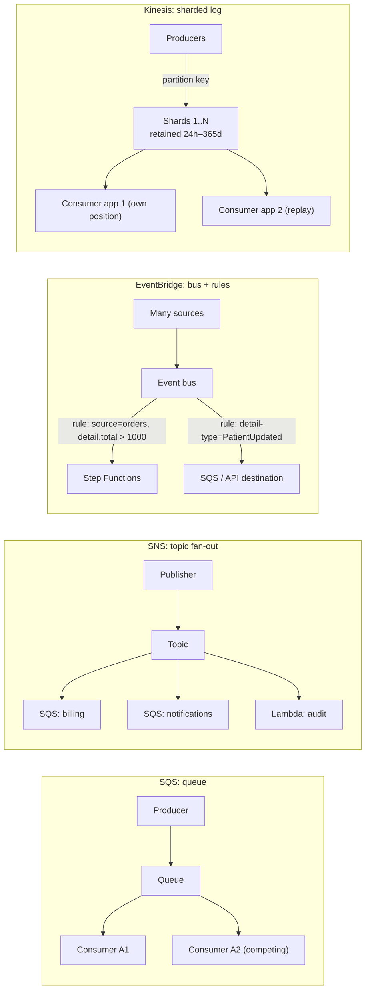
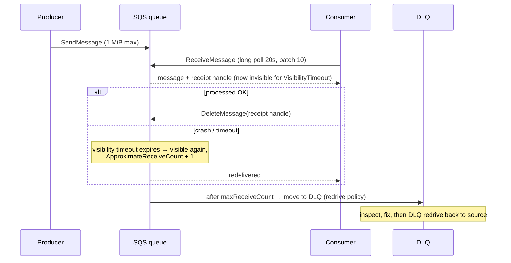

# Messaging: SQS vs SNS vs EventBridge vs Kinesis

!!! abstract "Key takeaways"
    - **SQS = queue (point-to-point, pull).** Consumers poll and delete. A message goes to **one** consumer group.
        - **Standard:** at-least-once, best-effort order, practically unlimited throughput.
        - **FIFO:** ordered per **message group**, with deduplication in a 5-minute window.
        - Messages up to **1 MiB** (raised from 256 KB in 2025).
    - **SNS = pub/sub topic (push).** One publish is **fanned out** to many subscribers (SQS, Lambda, HTTP, email/SMS, Firehose), with **filter policies** per subscription. The classic pattern is **SNS → many SQS queues** (fan-out plus buffering).
    - **EventBridge = event bus (routing).**
        - Content-based **rules** route events from your apps, 200+ AWS services and SaaS partners to targets.
        - Also offers a **schema registry**, **archive & replay**, **Pipes** (source → filter → enrich → target) and **Scheduler**.
        - Best for **integration and loose coupling**, not for very high throughput.
    - **Kinesis Data Streams = ordered, replayable log (like Kafka).**
        - **Shards**, each 1 MB/s or 1,000 records/s in and 2 MB/s out.
        - **Ordering per partition key**, retention from 24 h up to 365 days.
        - Multiple independent consumers, enhanced fan-out.
        - Use it for streaming analytics and replay. **MSK** if you want Kafka itself.
    - **Choosing:**
        - One consumer, work distribution → SQS.
        - Many subscribers, simple fan-out → SNS (+SQS).
        - Many event types routed by content across teams or accounts → EventBridge.
        - High-volume ordered stream with replay → Kinesis/MSK.

## Why it matters

"Why SQS and not SNS?" "How do you guarantee ordering?" "What happens when the consumer fails?" Messaging questions test whether you understand **delivery semantics, ordering, back-pressure and failure handling**, the same ideas as Kafka, but in managed AWS form. This is a resume topic (SQS + SNS at Deloitte, Kafka with retry/DLQ at Publicis Sapient), so expect comparisons.

## Core concepts

### Four models side by side


*Notice the key difference: in **SQS** a message is consumed once and deleted. In **SNS** and **EventBridge** each subscriber or target gets its own copy, pushed. In **Kinesis** the data **stays** and each consumer tracks its own position, which is what makes **replay** possible.*

| | **SQS Standard** | **SQS FIFO** | **SNS** | **EventBridge** | **Kinesis Data Streams** |
|---|---|---|---|---|---|
| Model | Queue, pull | Queue, pull | Pub/sub, push | Bus + rules, push | Log, pull |
| Delivery | At-least-once | Exactly-once *processing* within dedup window | At-least-once (FIFO topics exist) | At-least-once | At-least-once (per consumer) |
| Ordering | Best effort | Per message group | None (FIFO topics: per group) | None | Per partition key (shard) |
| Throughput | Nearly unlimited | 300 msg/s per API action (3,000 batched); high-throughput mode much higher | Very high | Soft quotas per Region (thousands/s) | Scales with shards / on-demand |
| Retention | 1 min–14 days (default 4) | Same | None (no storage) | Archive (optional, replay) | 24 h–365 days |
| Replay | No | No | No | **Archive & replay** | **Yes** (by sequence/time) |
| Filtering | No | No | **Filter policies** | **Rich event patterns** | Consumer-side (or Lambda ESM filters) |
| Consumers | Competing consumers | One per group at a time | Many subscribers | Up to 5 targets per rule, many rules | Many independent apps |

### SQS mechanics


*Notice that SQS never knows whether you finished. It only knows you didn't **delete** the message before the visibility timeout ran out. So set the timeout above the worst-case processing time (or extend it with `ChangeMessageVisibility`) and make consumers **idempotent**.*

{ loading=lazy }
*Watch the receive count climb each time the timeout runs out without a delete. At `maxReceiveCount` the redrive policy moves the message to the DLQ instead of retrying forever.*

Key settings:

- **Visibility timeout:** default 30 s, max 12 h. For Lambda, ≥ 6× the function timeout.
- **Long polling** (`WaitTimeSeconds` up to 20) cuts empty receives and cost.
- **Delay queues and message timers:** up to 15 min.
- **DLQ** through a redrive policy (`maxReceiveCount`), with a **redrive** back to the source after fixing.
- **FIFO:**
    - `MessageGroupId` sets ordering and parallelism: one in-flight batch per group.
    - `MessageDeduplicationId` (or content-based dedup) gives a 5-minute dedup window.
    - A failing message **blocks its group** until it succeeds or goes to the DLQ.
- **Fair queues** (2025) reduce noisy-neighbour effects in multi-tenant standard queues by using a tenant group ID.
- Large payloads go in **S3**, with a pointer in the message (the claim-check pattern, or the Extended Client Library).

{ loading=lazy }
*Notice that only group B stalls. Ordering and blocking are both per `MessageGroupId`, so a poison message holds up one customer, not the whole queue.*

### SNS fan-out with filtering

```json
{
  "eventType": ["PrescriptionFilled"],
  "region": ["EU"],
  "amount": [{ "numeric": [">", 100] }]
}
```

This is a subscription **filter policy**, applied to message attributes or (with `FilterPolicyScope: MessageBody`) to the payload. Each SQS subscriber receives only matching messages, so producers don't need to know who's listening.

### EventBridge in practice

- **Event shape:** `source`, `detail-type`, `detail` (your JSON), `account`, `region`, `time`.
- **Rules** match on any field, with prefix, numeric, exists and anything-but operators. Each rule can have up to 5 targets, with **input transformers**, retries (up to 24 h) and a DLQ.
- **Cross-account/Region buses:** central event hubs in multi-account organisations.
- **Archive & replay** for reprocessing or testing new consumers.
- **Pipes:** point-to-point integration from SQS, Kinesis, DynamoDB Streams, MSK or MQ to targets, with filtering and enrichment and no glue Lambda.
- **Scheduler:** millions of one-off or cron schedules, with time zones.
- **API destinations:** call SaaS HTTP endpoints with auth and rate limits.

### Kinesis vs Kafka (MSK)

| | Kinesis Data Streams | Amazon MSK (Kafka) |
|---|---|---|
| Unit | Shard (1 MB/s in, 2 MB/s out) or on-demand | Partition on brokers you size (or MSK Serverless/Express) |
| Ordering | Per partition key within shard | Per key within partition |
| Ops | Fully managed, AWS API | Managed brokers, Kafka API, more knobs |
| Ecosystem | KCL, Firehose, Lambda, Managed Flink | Kafka Connect, Streams, Schema Registry, everything Kafka |
| Pick when | AWS-native streaming, simple ops | Kafka skills/tools in place, portability, exactly-once with Kafka transactions |

## In practice: code & configuration

=== "❌ Common mistake"
    ```java
    // Producer writes to DB, then sends to SQS: dual write, so a crash in between loses the event.
    orderRepo.save(order);
    sqs.sendMessage(b -> b.queueUrl(url).messageBody(json(order)));

    // Consumer deletes BEFORE processing: a crash loses the message.
    for (Message m : sqs.receiveMessage(r -> r.queueUrl(url)).messages()) {
        sqs.deleteMessage(d -> d.queueUrl(url).receiptHandle(m.receiptHandle()));
        process(m);   // not idempotent; the visibility timeout (default 30s) is shorter than processing time
    }
    ```

=== "✅ Correct approach"
    ```java
    // Producer: transactional outbox (DB row in the same transaction), relayed to SNS/SQS/EventBridge
    // by a poller or CDC. Or DynamoDB Streams → EventBridge Pipes for DynamoDB-based services.

    // Consumer (Spring Cloud AWS 3.x): ack only after success, idempotent handler.
    @SqsListener(value = "${queues.prescriptions}",
                 maxConcurrentMessages = "10", maxMessagesPerPoll = "10")
    public void onMessage(PrescriptionFilled evt, @Header("MessageId") String messageId) {
        if (!idempotency.firstTime(evt.eventId())) return;   // conditional put in DynamoDB/Redis
        fulfilment.handle(evt);                              // exception → not acked → redelivered → DLQ after N
    }
    ```

```hcl
resource "aws_sqs_queue" "rx_dlq" {
  name                      = "rx-filled-dlq"
  message_retention_seconds = 1209600            # 14 days to investigate
}
resource "aws_sqs_queue" "rx" {
  name                       = "rx-filled"
  visibility_timeout_seconds = 180               # > worst-case processing (6× Lambda timeout)
  receive_wait_time_seconds  = 20                # long polling
  sqs_managed_sse_enabled    = true
  redrive_policy = jsonencode({
    deadLetterTargetArn = aws_sqs_queue.rx_dlq.arn
    maxReceiveCount     = 5
  })
}
resource "aws_sns_topic_subscription" "rx" {
  topic_arn            = aws_sns_topic.pharmacy_events.arn
  protocol             = "sqs"
  endpoint             = aws_sqs_queue.rx.arn
  raw_message_delivery = true
  filter_policy        = jsonencode({ eventType = ["PrescriptionFilled"] })
}
# Also needed: an SQS queue policy allowing sns.amazonaws.com with aws:SourceArn = topic ARN.
```

## Real-world usage

- **SNS → SQS fan-out** is the most common AWS event pattern. Each downstream service gets its own queue, so it can buffer, retry and use its own DLQ independently.
- **EventBridge** is the backbone of many multi-account event-driven architectures: domain events published to a central bus, with each team owning rules into its own account.
- **Kinesis** powers clickstream, IoT telemetry and log pipelines (Kinesis → Firehose → S3 data lake, or Managed Flink for real-time aggregates).
- **Failure modes:**
    - Visibility timeout shorter than processing, causing duplicates.
    - Poison messages blocking a FIFO group.
    - DLQs nobody monitors.
    - Missing SQS queue policy for SNS, so messages are silently not delivered.
    - Hot Kinesis shards from skewed partition keys.
    - EventBridge rules matching too broadly.
- **Healthcare and banking:** encryption with KMS customer managed keys, FIFO for per-account ordering (ledger events per account ID as the message group), DLQ alarms paged to on-call, and audit through archives or S3.

## Trade-offs & production gotchas

| Need | Choose | Why |
|---|---|---|
| Buffer work for one consumer service | SQS Standard | Simple, scales, DLQ |
| Ordered processing per entity | SQS FIFO (group = entityId) or Kinesis/MSK (key = entityId) | Per-key ordering |
| Notify many services of one event | SNS → SQS per subscriber | Fan-out + isolation |
| Route many event types by content across teams/accounts | EventBridge | Rules, schema registry, cross-account, replay |
| High-volume stream, multiple readers, replay | Kinesis / MSK | Retained log |
| Kafka ecosystem, existing skills | MSK | Kafka API, Connect, Streams |

!!! warning "Gotchas"
    - **FIFO "exactly once"** means deduplication of *sends* within 5 minutes plus ordered delivery. Your consumer can still process twice after a crash, so **idempotency is still required**.
    - **SNS → SQS needs a queue policy** that allows the topic (`aws:SourceArn`). Without it, deliveries fail silently from the publisher's view (check SNS delivery metrics).
    - **EventBridge is not a stream.** There's no consumer offset and no ordering. Throughput quotas exist (soft limits per Region). Check them for high-volume paths.
    - **Kinesis Lambda consumers:** one bad record can block a shard. Use `BisectBatchOnFunctionError`, `MaximumRetryAttempts` and an on-failure destination.

## How this connects to my experience

- **Where I used it:**
    - ConvergeHealth Data Asset Explorer: "**SQS, SNS**", "event-driven healthcare analytics workflows".
    - OptumRx Meteor: "Kafka-based event-driven workflows with **retry and DLQ** handling".
- **Talking points:**
    - "At Deloitte, SNS topics fanned out to per-service SQS queues. Consumers were idempotent, DLQs were alarmed, and visibility timeouts were tuned to processing time." *[confirm: SNS→SQS fan-out, Lambda vs container consumers]*
    - "At Publicis Sapient we used Kafka for ordered, replayable streams with retry topics and DLQs. I can compare the two directly: SQS for task queues, Kafka/Kinesis when ordering per key and replay matter."
    - "Events were published using an outbox or an after-commit approach to avoid dual-write loss." *[confirm]*
- **Likely follow-up chain:** "Why SQS there and Kafka at Optum?" → "How do you guarantee order?" → "How do you handle poison messages?" → "How would you replay events?" Answer: workload shape (task queue vs event log) → FIFO groups / partition keys → maxReceiveCount + DLQ + alarm + redrive → SQS can't replay (EventBridge archive or Kinesis/Kafka can).

## Interview questions

### Fundamentals

??? question "Q1. SQS vs SNS?"
    **Answer:** SQS is a **queue**: consumers pull, each message is processed by one consumer and deleted, and it buffers when consumers are slow. SNS is **pub/sub**: it pushes each message to all subscribers immediately and doesn't store it. They're often combined: SNS fans out to multiple SQS queues.

    **Interviewer listens for:** pull vs push, storage vs none, the fan-out pattern.

    **Common wrong answer:** "SNS is the FIFO version of SQS".

??? question "Q2. Standard vs FIFO queue?"
    **Answer:**
    - **Standard:** at-least-once, best-effort ordering, nearly unlimited throughput.
    - **FIFO:** strict ordering per message group, deduplication within 5 minutes, and lower throughput (300 msg/s per action, 3,000 batched, higher in high-throughput mode).

    Use FIFO only when ordering or deduplication matters.

    **Interviewer listens for:** message groups as the unit of ordering and parallelism.

    **Common wrong answer:** "FIFO orders the whole queue globally and is exactly-once end to end".

??? question "Q3. What is the visibility timeout?"
    **Answer:** After a receive, the message is hidden from other consumers for this period. If it isn't deleted in time, it reappears and is redelivered. Default 30 s, max 12 h. Set it above processing time, and extend it for long work.

    **Interviewer listens for:** the link to duplicates.

    **Common wrong answer:** "how long the message is stored".

??? question "Q4. What is a DLQ and how do you use it?"
    **Answer:** A queue that receives messages that failed `maxReceiveCount` times (configured through a redrive policy). Alarm on its depth, inspect and fix the cause, then **redrive** messages back to the source. Keep DLQ retention long (14 days).

    **Interviewer listens for:** monitoring plus redrive.

    **Common wrong answer:** "messages are deleted after failures".

### Intermediate

??? question "Q5. When EventBridge instead of SNS?"
    **Answer:** EventBridge offers content-based routing on any event field, many AWS and SaaS sources, a schema registry, archive & replay, cross-account buses, Pipes and Scheduler. It suits domain events across many teams. SNS has higher throughput, lower latency, mobile/SMS/email delivery and simple fan-out.

    **Interviewer listens for:** routing richness vs raw throughput.

    **Common wrong answer:** "they're the same".

??? question "Q6. How do you get ordering per customer while still processing in parallel?"
    **Answer:** SQS FIFO with `MessageGroupId = customerId`: different customers process in parallel, and each customer's messages are in order. In Kinesis or Kafka, use `customerId` as the partition key. Watch for hot keys and blocked groups (poison messages).

    **Interviewer listens for:** group/key as the unit of both ordering and parallelism.

    **Common wrong answer:** "use a single consumer".

??? question "Q7. How do you send a 5 MB payload through SQS?"
    **Answer:** Use the claim-check pattern: store the payload in S3 (encrypted) and send a pointer plus metadata. The Extended Client Library automates this. Since 2025 the inline limit is 1 MiB, but small messages are still cheaper and faster.

    **Interviewer listens for:** claim check.

    **Common wrong answer:** "compress it".

??? question "Q8. Kinesis shards: what are the limits, and how do you scale?"
    **Answer:** Each shard takes 1 MB/s or 1,000 records/s in and gives 2 MB/s out, shared across standard consumers (enhanced fan-out gives each consumer its own 2 MB/s). Scale by splitting or merging shards, or use **on-demand** mode. Ordering is per partition key within a shard. Retention is 24 h by default, up to 365 days.

    **Interviewer listens for:** per-shard numbers and hot keys.

    **Common wrong answer:** "Kinesis auto-scales infinitely with no keys".

### Senior

??? question "Q9. SQS vs Kafka (MSK): how do you choose?"
    **Answer:**
    - **SQS:** task distribution, competing consumers, per-message ack, DLQ built in, zero ops. But no replay, and no multiple independent consumer groups without fan-out.
    - **Kafka:** a durable ordered log, multiple consumer groups, replay, stream processing, Connect ecosystem, but more operations and tuning.

    Choose by workload shape: commands/jobs → SQS; event log/streams → Kafka/Kinesis.

    **Interviewer listens for:** semantics over brand.

    **Common wrong answer:** "Kafka is just faster SQS".

??? question "Q10. Design reliable event publishing from a service that writes to RDS."
    **Answer:**
    1. Use a **transactional outbox**: insert an event row in the same DB transaction.
    2. A relay (poller, or Debezium CDC → MSK/Kinesis) publishes to SNS, EventBridge or Kafka and marks the row sent.
    3. Consumers are idempotent (events can be published twice).
    4. Add tracing and an event schema in a registry.

    For DynamoDB, use Streams → Pipes/Lambda instead.

    **Interviewer listens for:** avoiding dual writes.

    **Common wrong answer:** "send after commit and hope".

??? question "Q11. How do you avoid one tenant's backlog delaying others in a shared queue?"
    **Answer:**
    - Separate queues per tier or tenant.
    - **SQS fair queues** with a tenant group ID (2025).
    - FIFO with groups per tenant.
    - Concurrency limits per tenant in consumers.
    - Shuffle sharding.

    Monitor age of oldest message per tenant.

    **Interviewer listens for:** noisy-neighbour awareness.

    **Common wrong answer:** "add more consumers".

### Scenario-based

??? question "Q12. Messages are processed twice and some go to the DLQ during peaks. Why?"
    **Answer:** At peak, processing slows past the **visibility timeout**, so messages reappear (duplicates) and receive counts climb until they hit `maxReceiveCount` (DLQ). Fixes:
    - Raise the visibility timeout, or extend it while processing.
    - Cap concurrency to what downstream can take.
    - Scale consumers on `ApproximateAgeOfOldestMessage` or backlog per worker.
    - Make processing idempotent.

    **Interviewer listens for:** a correct diagnosis using the metrics.

    **Common wrong answer:** "SQS bug".

??? question "Q13. A new analytics team needs last month's order events. Your pipeline is SNS → SQS. What now, and what's the future fix?"
    **Answer:**
    - **Now:** SQS doesn't keep consumed messages. Reconstruct from the source of truth (DB export or CDC snapshot, S3 audit copies if they exist).
    - **Future:** add an **archive** (EventBridge archive, SNS → Firehose → S3) or move domain events to a retained log (Kinesis/MSK with suitable retention, or a tiered S3 copy) so new consumers can replay.

    **Interviewer listens for:** knowing that queues aren't logs.

    **Common wrong answer:** "re-read the DLQ".

## Cheat sheet

| Concept | Remember |
|---|---|
| SQS | Pull queue, delete after success. Standard = at-least-once + best-effort order |
| FIFO | Order per `MessageGroupId`, dedup 5 min, 300/s (3,000 batched), poison blocks group |
| Limits | 1 MiB message, retention 1 min–14 d (default 4 d), visibility default 30 s/max 12 h, long poll 20 s, delay 15 min |
| DLQ | Redrive policy `maxReceiveCount`, alarm on depth, redrive back to source |
| SNS | Push fan-out, filter policies, SNS → SQS needs a queue policy |
| EventBridge | Bus + content rules, 5 targets/rule, archive & replay, Pipes, Scheduler, cross-account |
| Kinesis | Shards: 1 MB/s in, 2 MB/s out. Order per key. 24 h–365 d retention. Replay |
| MSK | Kafka API, consumer groups, Connect, transactions |
| Always | Idempotent consumers, claim check for big payloads, outbox for publishing |

## Sources
1. [Amazon SQS developer guide](https://docs.aws.amazon.com/AWSSimpleQueueService/latest/SQSDeveloperGuide/welcome.html): standard vs FIFO, visibility timeout, DLQs, quotas.
2. [SQS FIFO queues: message groups and deduplication](https://docs.aws.amazon.com/AWSSimpleQueueService/latest/SQSDeveloperGuide/FIFO-queues.html): ordering and throughput.
3. [Serverless payloads up to 1 MB (SQS, Lambda async, EventBridge)](https://aws-news.com/article/2026-01-29-more-room-to-build-serverless-services-now-support-payloads-up-to-1-mb): payload limit change.
4. [Amazon SNS message filtering](https://docs.aws.amazon.com/sns/latest/dg/sns-message-filtering.html): filter policies on attributes and body.
5. [Fanout to SQS queues](https://docs.aws.amazon.com/sns/latest/dg/sns-sqs-as-subscriber.html): queue policy requirements.
6. [Amazon EventBridge user guide](https://docs.aws.amazon.com/eventbridge/latest/userguide/eb-what-is.html): rules, targets, archive and replay, Pipes, Scheduler.
7. [Amazon Kinesis Data Streams quotas](https://docs.aws.amazon.com/streams/latest/dev/service-sizes-and-limits.html): shard throughput and retention.
8. [Amazon MSK](https://docs.aws.amazon.com/msk/latest/developerguide/what-is-msk.html): managed Kafka options.
9. [Spring Cloud AWS SQS integration](https://docs.awspring.io/spring-cloud-aws/docs/3.2.0/reference/html/index.html#sqs-integration): `@SqsListener`, acknowledgement.
10. [AWS Prescriptive Guidance: transactional outbox pattern](https://docs.aws.amazon.com/prescriptive-guidance/latest/cloud-design-patterns/transactional-outbox.html).
