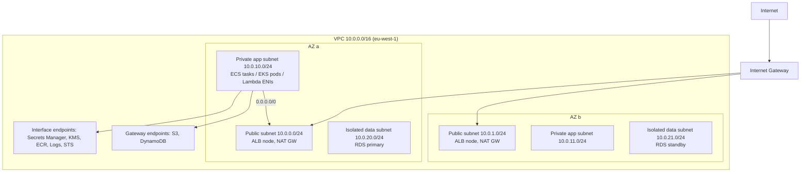
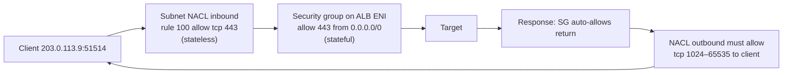
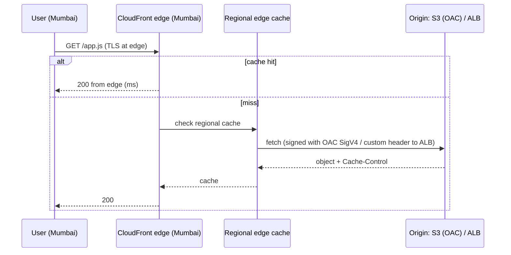

# Networking: VPC, Subnets, Security Groups vs NACLs, Route 53, CloudFront

!!! abstract "Key takeaways"
    - **VPC basics:**
        - A **VPC** is your private network in one Region (CIDR, e.g. `10.0.0.0/16`).
        - **Subnets** live in **one AZ**. A subnet is "public" only because its **route table** sends `0.0.0.0/0` to an **Internet Gateway**.
        - **Private** subnets reach out through a **NAT Gateway** (per AZ, or the newer Regional NAT Gateway). AWS reserves 5 IPs per subnet.
    - **Security groups vs NACLs:**
        - **Security groups** are **stateful**, **allow-only** and attached to ENIs (instances, tasks, Lambda ENIs, RDS). They can reference **other security groups**.
        - **NACLs** are **stateless**, support allow and deny with numbered rules, and apply at the **subnet** level. Return traffic (ephemeral ports) must be allowed explicitly.
    - **Private access to AWS services without the internet:**
        - **Gateway endpoints** (S3, DynamoDB) are free and work through route tables.
        - **Interface endpoints** (PrivateLink) are ENIs with private IPs for most other services and for your own services exposed through an NLB.
        - Endpoints cut NAT cost and keep traffic private.
    - **Connecting networks:** **VPC peering** (1:1, non-transitive), **Transit Gateway** (hub-and-spoke, transitive, multi-account), **PrivateLink** (expose one service, not the whole network), and **Site-to-Site VPN / Direct Connect** for on-premises.
    - **Route 53** is DNS with routing policies (simple, weighted, latency, failover, geolocation/geoproximity, multivalue) plus **health checks**. **CloudFront** is the CDN: edge caching, TLS, **OAC** to keep S3 private, WAF/Shield, and cache keys and policies.

## Why it matters

Networking is where "it works in dev" breaks in production: a Lambda that can't reach the internet, an RDS that's publicly accessible, a NAT bill bigger than the compute bill, or a timeout caused by a NACL that forgot ephemeral ports. Interviewers use it to test **security fundamentals** (what is exposed, and to whom) and **troubleshooting**.

## Core concepts

### A standard three-tier VPC


*Notice that "public" and "private" are **routing** decisions: only the public subnets route to the IGW. App subnets reach the internet only through NAT (outbound only). Data subnets have **no** internet route at all. AWS services are reached through **endpoints**, not NAT.*

{ loading=lazy }
*Notice that the subnets differ only in their route tables. Delete the 0.0.0.0/0 line and a public subnet becomes isolated.*

### Route tables, gateways and NAT

| Component | Purpose | Notes |
|---|---|---|
| Internet Gateway | Two-way internet for resources with public IPs | One per VPC, horizontally scaled, free |
| NAT Gateway | Outbound-only internet for private subnets | Charged per hour **and per GB processed**. Zonal: one per AZ for HA. A **Regional NAT Gateway** (Nov 2025) spans AZs automatically |
| Egress-only IGW | Outbound-only for IPv6 | IPv6 addresses are globally unique, so there's no NAT |
| Route table | Per subnet. Most specific prefix wins | `local` route for the VPC CIDR always exists |
| VPC endpoints | Private path to AWS services | Gateway (S3/DynamoDB, free) vs interface (PrivateLink, hourly + per GB) |

### Security groups vs NACLs


*Notice that the security group remembers the connection, so the response is allowed automatically. The NACL doesn't remember, so its **outbound** rules must allow the client's **ephemeral port** range. Forgetting this is the classic "timeouts but the security group looks fine" bug.*

{ loading=lazy }
*Watch the response in the top row stop at the NACL. The security group let it out because it remembers the connection; the NACL checks the response as a brand-new packet.*

| | Security group | Network ACL |
|---|---|---|
| Level | ENI (instance/task/endpoint) | Subnet |
| State | **Stateful** | **Stateless** |
| Rules | Allow only | Allow **and deny**, numbered, first match wins |
| References | CIDRs, prefix lists, **other SGs** | CIDRs only |
| Default | New SG: deny all in, allow all out | Default NACL: allow all. Custom NACL: deny all |
| Typical use | Primary control: "app SG may reach DB SG on 5432" | Coarse subnet guardrails, blocking specific CIDRs |

**Security-group chaining** is the idiomatic pattern: the ALB SG allows 443 from the internet, the app SG allows 8080 **from the ALB SG**, and the DB SG allows 5432 **from the app SG**. No IP lists to maintain.

### Connecting VPCs and on-premises

| Option | Topology | Transitive? | Use when |
|---|---|---|---|
| VPC peering | 1:1 | **No** | Few VPCs, simple, cheapest. No overlapping CIDRs |
| Transit Gateway | Hub-and-spoke, multi-account, inter-Region peering | **Yes** | Many VPCs, central inspection, on-prem attachment |
| PrivateLink | Consumer endpoint → provider NLB service | n/a (one service) | Expose one service across accounts or tenants. Overlapping CIDRs OK |
| VPC Lattice | Service-to-service networking with auth policies | Service level | App-layer connectivity across VPCs/accounts without managing routing |
| Site-to-Site VPN | IPsec over the internet | via TGW | Quick, cheap hybrid connectivity |
| Direct Connect | Dedicated private link (1–100 Gbps) | via DX Gateway/TGW | Consistent latency and bandwidth, regulated data |

### Route 53

- **Hosted zones:** public or private (resolved inside associated VPCs).
- **Alias records** point to AWS resources (ALB, CloudFront, S3 website, API Gateway). They're free to query and work at the zone apex.
- **Routing policies:**
    - **simple**
    - **weighted** (canary, blue/green)
    - **latency** (nearest Region)
    - **failover** (primary/secondary with health checks)
    - **geolocation** (compliance or content by country)
    - **geoproximity** (with bias)
    - **multivalue** (up to 8 healthy records)
    - **IP-based**
- **Health checks:** endpoint checks (HTTP/HTTPS/TCP from many locations), calculated checks, and checks based on CloudWatch alarms. Failover routing uses them. The Route 53 data plane is designed for 100% availability, so it's a good DR mechanism.
- **Resolver endpoints** handle hybrid DNS (inbound and outbound rules to on-prem DNS). **DNS Firewall** blocks malicious domains.

### CloudFront


*Notice the layers of caching, and that the origin stays **private**: S3 accepts only requests signed by CloudFront's **Origin Access Control**, and an ALB can be restricted to CloudFront's managed prefix list plus a secret header.*

CloudFront essentials:

- **Cache policies** (what goes in the cache key: headers, cookies, query strings; keep it minimal) vs **origin request policies** (what to forward without changing the key).
- **TTL** from `Cache-Control`. Use invalidations sparingly; prefer **versioned file names** (`app.3f9a.js`).
- **Security:** ACM certificates (must be in `us-east-1` for CloudFront), TLS policies, **WAF**, Shield Standard (free DDoS protection), signed URLs and cookies for private content, field-level encryption, geo restriction.
- **Edge compute:** CloudFront Functions (lightweight JS, header and URL rewrites) and Lambda@Edge (heavier, can call the network).

## In practice: code & configuration

=== "❌ Common mistake"
    ```hcl
    resource "aws_security_group" "db" {
      ingress {
        from_port   = 5432
        to_port     = 5432
        protocol    = "tcp"
        cidr_blocks = ["0.0.0.0/0"]        # database open to the internet
      }
    }
    resource "aws_db_instance" "db" {
      publicly_accessible = true           # gets a public IP
      # in a public subnet "so the Lambda can reach it"
    }
    # Lambda in a VPC calls S3 and Secrets Manager through a NAT Gateway:
    # pays per GB processed, and traffic leaves the VPC.
    ```

=== "✅ Correct approach"
    ```hcl
    resource "aws_security_group" "app" { vpc_id = aws_vpc.main.id }
    resource "aws_security_group" "db"  { vpc_id = aws_vpc.main.id }

    resource "aws_vpc_security_group_ingress_rule" "db_from_app" {
      security_group_id            = aws_security_group.db.id
      referenced_security_group_id = aws_security_group.app.id   # SG chaining, no CIDRs
      from_port                    = 5432
      to_port                      = 5432
      ip_protocol                  = "tcp"
    }

    resource "aws_db_instance" "db" {
      publicly_accessible    = false
      db_subnet_group_name   = aws_db_subnet_group.isolated.name  # no internet route
      vpc_security_group_ids = [aws_security_group.db.id]
    }

    resource "aws_vpc_endpoint" "s3" {                 # gateway endpoint: free
      vpc_id            = aws_vpc.main.id
      service_name      = "com.amazonaws.${var.region}.s3"
      vpc_endpoint_type = "Gateway"
      route_table_ids   = local.private_route_table_ids
    }

    resource "aws_vpc_endpoint" "secrets" {            # interface endpoint (PrivateLink)
      vpc_id              = aws_vpc.main.id
      service_name        = "com.amazonaws.${var.region}.secretsmanager"
      vpc_endpoint_type   = "Interface"
      subnet_ids          = local.private_app_subnet_ids
      security_group_ids  = [aws_security_group.endpoints.id]
      private_dns_enabled = true                       # SDK uses the normal hostname
    }
    ```

## Real-world usage

- **NAT Gateway bills:** container image pulls, S3 traffic and logs through NAT are a common surprise. Fixes: gateway endpoints for S3/DynamoDB, interface endpoints for ECR, CloudWatch Logs and STS, and ECR pull-through cache.
- **Multi-account networking:** large organisations use a **network account** with Transit Gateway, centralised egress (inspection with Network Firewall) and shared VPCs through AWS RAM. IPAM prevents CIDR overlaps.
- **CloudFront** fronts static React apps (S3 + OAC) and APIs (ALB/API Gateway) for TLS, WAF and caching at the edge. This applies directly to a React app plus API stack.
- **Failure modes:**
    - Overlapping CIDRs block peering or TGW later. Plan IP space with IPAM.
    - A forgotten NACL ephemeral port range.
    - DNS TTLs too long for failover.
    - Cache keys that include cookies, so the hit ratio drops to near 0%.
    - ACM certificate in the wrong Region for CloudFront.
- **Healthcare and banking:** no public subnets for data tiers, VPC endpoint policies plus `aws:SourceVpce` conditions on S3 and KMS (data perimeter), VPC Flow Logs to a security account, and Direct Connect for hospital or bank on-prem links.

## Trade-offs & production gotchas

| Option | Pros | Cons | Use when |
|---|---|---|---|
| NAT GW per AZ | AZ-independent egress | Cost × AZs | Production egress (or Regional NAT GW) |
| Single NAT GW | Cheap | Cross-AZ dependency and charges | Dev/test |
| Gateway endpoints | Free, private | Only S3/DynamoDB, same Region | Always for S3/DynamoDB |
| Interface endpoints | Private access to most services | Hourly + per-GB cost per AZ | Regulated workloads, heavy service traffic |
| Peering | Simple, no hourly cost | Non-transitive, mesh explodes | 2–5 VPCs |
| Transit Gateway | Scales, central control | Per-attachment and per-GB cost | Many VPCs/accounts |

!!! warning "Gotchas"
    - **Lambda in a VPC has no internet** unless it's in a private subnet with NAT (or uses endpoints). It never gets a public IP, even in a public subnet.
    - **Subnet sizing:** EKS (VPC CNI) and Lambda ENIs use IPs. A /24 fills up fast. Plan /19–/20 app subnets or secondary CIDRs.
    - **Security groups are allow-only.** To *block* one IP, use a NACL or WAF.
    - **CloudFront and S3 website endpoints** can't use OAC (the website endpoint is HTTP). Use the REST endpoint with OAC, and handle SPA routing with CloudFront error responses or functions.

## How this connects to my experience

- **Where I used it:** ConvergeHealth Data Asset Explorer: AWS services across Lambda, ECS, EKS, RDS and API Gateway, provisioned with Terraform. All of them need VPC, subnet and security group design. On OptumRx Meteor, I built the React app from the ground up and set up its micro-frontend architecture, which is typically served through a CDN.
- **Talking points:**
    - "Services ran in private subnets across AZs. RDS in isolated subnets, SG chaining from app to DB, VPC endpoints for S3/Secrets Manager/KMS so data never crossed the internet." *[confirm: endpoint usage, NAT setup]*
    - "Terraform modules created the VPC layout consistently across environments." *[confirm: module source, e.g. terraform-aws-modules/vpc]*
    - "React/micro-frontend assets were served from a CDN with long-cache, versioned file names and a short-cache HTML shell." *[confirm: CloudFront or another CDN at Optum]*
- **Likely follow-up chain:** "Your Lambda can't reach Secrets Manager. Why?" → "Security group or NACL?" → "How do you reduce NAT cost?" → "How do you serve the SPA securely?" Answer: VPC without NAT/endpoint → stateful vs stateless → endpoints → CloudFront + OAC + WAF + cache policies.

## Interview questions

### Fundamentals

??? question "Q1. What makes a subnet public?"
    **Answer:** Its route table has a route `0.0.0.0/0 → Internet Gateway`. Resources in it also need a public IP or EIP to be reachable. Private subnets route outbound through NAT, or not at all.

    **Interviewer listens for:** routing, not naming.

    **Common wrong answer:** "the subnet has a public flag".

??? question "Q2. Security group vs NACL?"
    **Answer:**
    - **Security group:** stateful, allow-only, attached to ENIs, can reference other SGs.
    - **NACL:** stateless, allow and deny, numbered rules evaluated in order, applied per subnet. Return traffic must be allowed explicitly.

    Use SGs as the main control and NACLs as coarse guardrails.

    **Interviewer listens for:** stateful vs stateless, and ephemeral ports.

    **Common wrong answer:** "NACLs are just subnet-level security groups".

??? question "Q3. What's a NAT Gateway for?"
    **Answer:** It lets resources in private subnets make **outbound** connections to the internet (patches, external APIs) without accepting inbound connections. It's zonal, so deploy one per AZ (or use the Regional NAT Gateway). It's charged per hour and per GB processed.

    **Interviewer listens for:** outbound only, plus cost.

    **Common wrong answer:** "it lets the internet reach private instances".

??? question "Q4. Gateway vs interface VPC endpoint?"
    **Answer:** **Gateway endpoints** (S3, DynamoDB) are a route-table target and free. **Interface endpoints** are ENIs with private IPs powered by PrivateLink, used for most services. They're charged hourly and per GB, and support endpoint policies and private DNS.

    **Interviewer listens for:** which services, and cost.

    **Common wrong answer:** "they're the same".

### Intermediate

??? question "Q5. Peering vs Transit Gateway vs PrivateLink?"
    **Answer:**
    - **Peering:** 1:1, non-transitive, no overlapping CIDRs, cheap.
    - **TGW:** a transitive hub for many VPCs, accounts and on-prem, with central routing and inspection.
    - **PrivateLink:** exposes **one service** through an NLB to consumers' endpoints, with no network-level connectivity and overlapping CIDRs allowed.

    **Interviewer listens for:** transitivity, and service vs network connectivity.

    **Common wrong answer:** "peering is transitive".

??? question "Q6. Route 53 routing policies: which for blue/green, DR and global latency?"
    **Answer:**
    - **Weighted** (shift 10% → 100%) for blue/green and canary.
    - **Failover** with health checks for active-passive DR.
    - **Latency-based** for multi-Region users.
    - Geolocation for residency rules.

    Use short TTLs for fast shifts, and alias records for AWS targets.

    **Interviewer listens for:** health checks plus TTL.

    **Common wrong answer:** "simple routing with multiple IPs".

??? question "Q7. How do you keep an S3 origin private behind CloudFront?"
    **Answer:** Use **Origin Access Control** (OAC). CloudFront signs requests with SigV4, and the bucket policy allows only the `cloudfront.amazonaws.com` principal with `aws:SourceArn` = the distribution ARN. Keep Block Public Access on. OAC replaces the legacy OAI and supports SSE-KMS.

    **Interviewer listens for:** OAC, plus the SourceArn condition.

    **Common wrong answer:** "make the bucket public-read".

??? question "Q8. How do you improve a CloudFront cache hit ratio?"
    **Answer:**
    - Minimise the cache key: only the headers, cookies and query strings that change the response.
    - Use versioned asset names with long TTLs.
    - Normalise query strings.
    - Turn on Origin Shield for many edges hitting one origin.
    - Separate static and dynamic behaviours.

    Monitor the cache statistics reports.

    **Interviewer listens for:** cache-key discipline.

    **Common wrong answer:** "invalidate more often".

### Senior

??? question "Q9. Design network security for a regulated workload."
    **Answer:**
    - Private and isolated subnets.
    - SG chaining.
    - VPC endpoints with **endpoint policies**, plus `aws:SourceVpce` conditions on S3 and KMS.
    - Central egress with Network Firewall (domain allow-lists).
    - VPC Flow Logs and Route 53 Resolver query logs to a log archive account.
    - WAF on CloudFront/ALB.
    - Shield Advanced for critical endpoints.
    - Direct Connect + VPN backup for on-prem.
    - IPAM for CIDRs.
    - No public IPs on workloads (enforced with SCPs or Config rules).

    **Interviewer listens for:** a data perimeter plus egress control.

    **Common wrong answer:** "SGs are enough".

??? question "Q10. A Lambda in a VPC times out calling an external API. Debug it."
    **Answer:** Check in order:
    1. Is the Lambda in **private** subnets whose route table has `0.0.0.0/0 → NAT`? (Public subnets don't work for Lambda.)
    2. Does the NAT live in a public subnet that routes to the IGW?
    3. Does the SG allow outbound traffic?
    4. Does the NACL allow outbound 443 **and inbound ephemeral ports**?
    5. Does DNS resolve?
    6. Check the external API's allow-list (it needs the NAT EIP).

    Use VPC Reachability Analyzer and Flow Logs.

    **Interviewer listens for:** a methodical path, plus the Lambda public-subnet trap.

    **Common wrong answer:** "increase the Lambda timeout".

??? question "Q11. How would you cut a $20K/month NAT Gateway bill?"
    **Answer:**
    1. Use Flow Logs or Cost Explorer to find who's talking to what.
    2. Add a gateway endpoint for S3/DynamoDB.
    3. Add interface endpoints for ECR, Logs and STS, which carry heavy traffic.
    4. Use ECR pull-through cache and smaller images.
    5. Keep traffic in the same AZ (a NAT per AZ avoids cross-AZ charges).
    6. Compress or batch external calls.
    7. Consider IPv6 + egress-only IGW where possible.

    **Interviewer listens for:** endpoints first, and measuring before acting.

    **Common wrong answer:** "use a NAT instance".

### Scenario-based

??? question "Q12. Two acquired companies' VPCs both use 10.0.0.0/16 and must talk. Options?"
    **Answer:** Peering and TGW don't allow overlapping CIDRs between connected VPCs. Options:
    - **PrivateLink**, exposing specific services through an NLB. Overlap doesn't matter.
    - **VPC Lattice** for service-level connectivity.
    - Private NAT Gateway to translate to non-overlapping ranges.
    - Re-IP over time with IPAM.

    **Interviewer listens for:** connecting services rather than networks.

    **Common wrong answer:** "peer them".

??? question "Q13. Users in Asia complain the React SPA is slow, and the origin is in eu-west-1. Fix it."
    **Answer:**
    - Put CloudFront in front: static assets cached at edge with long TTLs and versioned names, HTML with a short TTL, Brotli/gzip compression, HTTP/2/3.
    - For APIs: CloudFront for TLS termination and connection reuse to the origin, cache GETs where safe, consider a regional read replica or a second Region with latency routing.
    - Measure with real-user monitoring.

    **Interviewer listens for:** splitting static from dynamic.

    **Common wrong answer:** "bigger EC2 instances".

## Cheat sheet

| Concept | Remember |
|---|---|
| VPC | Regional, CIDR /16–/28, 5 reserved IPs per subnet |
| Subnet | One AZ. Public = route to IGW |
| NAT GW | Outbound only, per hour + per GB, one per AZ (or Regional NAT GW, 2025) |
| SG | Stateful, allow-only, ENI-level, reference SGs (chaining) |
| NACL | Stateless, allow + deny, ordered, subnet-level, ephemeral ports 1024–65535 |
| Endpoints | Gateway (S3, DynamoDB, free) vs interface (PrivateLink, paid) + endpoint policies |
| Connect | Peering (non-transitive), TGW (hub, transitive), PrivateLink (one service), Lattice, VPN, DX |
| Route 53 | Alias, weighted/latency/failover/geo/multivalue, health checks, short TTL for DR |
| CloudFront | Edge cache, OAC for S3, WAF/Shield, cache vs origin request policy, ACM in us-east-1 |
| Lambda in VPC | Private subnet + NAT/endpoints. Never a public IP |

## Sources
1. [Amazon VPC user guide](https://docs.aws.amazon.com/vpc/latest/userguide/what-is-amazon-vpc.html): subnets, route tables, gateways.
2. [Security groups](https://docs.aws.amazon.com/vpc/latest/userguide/vpc-security-groups.html) and [network ACLs](https://docs.aws.amazon.com/vpc/latest/userguide/vpc-network-acls.html): stateful vs stateless, ephemeral ports.
3. [NAT gateways](https://docs.aws.amazon.com/vpc/latest/userguide/vpc-nat-gateway.html) and [Regional NAT Gateway (Nov 2025)](https://aws.amazon.com/about-aws/whats-new/2025/11/aws-nat-gateway-regional-availability).
4. [VPC endpoints / AWS PrivateLink](https://docs.aws.amazon.com/vpc/latest/privatelink/what-is-privatelink.html): gateway vs interface endpoints.
5. [Transit Gateway](https://docs.aws.amazon.com/vpc/latest/tgw/what-is-transit-gateway.html) and [VPC peering](https://docs.aws.amazon.com/vpc/latest/peering/what-is-vpc-peering.html).
6. [Route 53 routing policies](https://docs.aws.amazon.com/Route53/latest/DeveloperGuide/routing-policy.html) and [health checks](https://docs.aws.amazon.com/Route53/latest/DeveloperGuide/dns-failover.html).
7. [CloudFront: restricting access to S3 with OAC](https://docs.aws.amazon.com/AmazonCloudFront/latest/DeveloperGuide/private-content-restricting-access-to-s3.html).
8. [CloudFront cache key and policies](https://docs.aws.amazon.com/AmazonCloudFront/latest/DeveloperGuide/controlling-the-cache-key.html).
9. [Lambda VPC networking](https://docs.aws.amazon.com/lambda/latest/dg/configuration-vpc-internet.html): internet access for VPC functions.
