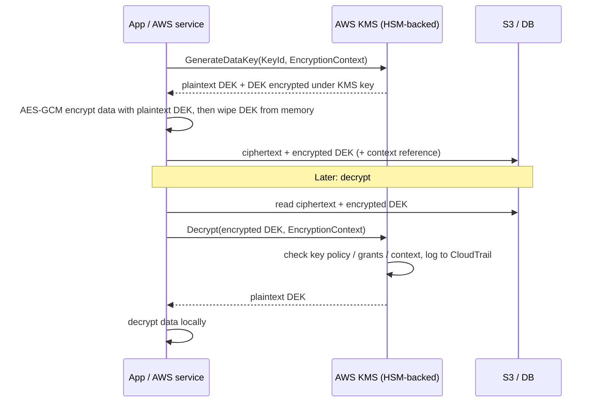
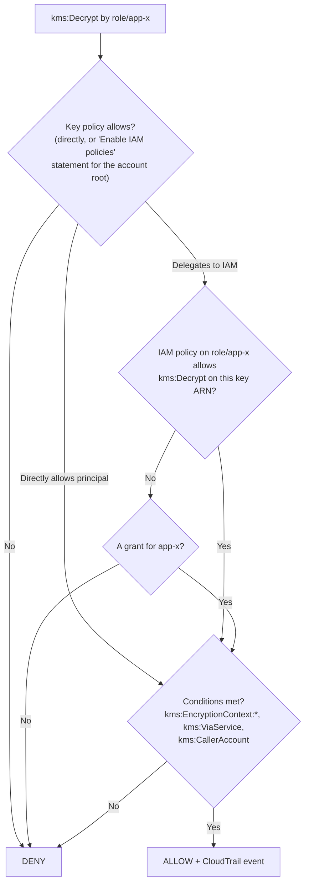

# Security: KMS, Secrets Manager, Encryption at Rest & in Transit

!!! abstract "TL;DR"
    - **KMS keys never leave KMS's HSMs** (FIPS 140-3 Level 3 validated) in plaintext. You call `Encrypt` (≤ **4 KB**), `Decrypt`, `GenerateDataKey`, `Sign` and so on. Every use is logged in **CloudTrail**.
    - **Envelope encryption:** `GenerateDataKey` returns a **plaintext data key** (encrypt your data locally, then discard it) and the **same key encrypted** under the KMS key (store it next to the data). Decrypting means sending the encrypted data key to KMS. S3, EBS, RDS and DynamoDB all work this way.
    - **Access control:**
        - Every key has a **key policy**, and it's the root of access. IAM policies only count if the key policy delegates to the account.
        - **Grants** give temporary or delegated use (AWS services use them).
        - **Encryption context** (non-secret key/value AAD) binds ciphertext to its purpose and shows up in CloudTrail and policy conditions.
    - **Key types and rotation:**
        - Key types: AWS owned, AWS managed (`aws/s3`, rotated yearly, can't change the policy), and **customer managed** (you control the policy, rotation and deletion).
        - Automatic rotation for customer managed symmetric keys is **configurable from 90 to 2,560 days** (default 365), with **on-demand rotation** too. Old key material is kept so old ciphertext still decrypts.
        - Other options: **multi-Region keys**, **imported key material (BYOK)**, **CloudHSM custom key store**, **external key store (XKS)**.
    - **Secrets Manager:**
        - Stores, **rotates** (Lambda-based or managed rotation for RDS/Aurora/Redshift, as often as every 4 hours), versions (`AWSCURRENT`/`AWSPENDING`/`AWSPREVIOUS`) and replicates secrets.
        - **Parameter Store SecureString** is cheaper, with no built-in rotation.
        - **In transit:** TLS 1.2+ everywhere (AWS API endpoints require ≥ 1.2), ACM certificates, mTLS for B2B, and `aws:SecureTransport` deny statements.

## Why it matters

Encryption questions separate people who tick "encrypt at rest" from people who can explain **who can decrypt, how that's enforced and audited, and what happens during rotation or a key compromise**. In healthcare and banking, key management is a compliance requirement (HIPAA, PCI DSS, SOC 2). It's also the area of my resume with the deepest background: **CipherTrust Cloud Key Management** (multi-cloud key lifecycle, rotation, HSMs) and **IAM/KMS/Secrets Manager** at Deloitte.

## Core concepts

### Envelope encryption


*Notice that bulk data **never goes to KMS**, only the small data key does. That avoids the 4 KB limit, the latency and the request quotas. Revoking access to the **KMS key** cuts off decryption of every data key it protects. That is the power of the hierarchy.*

Why envelope encryption?

- **Performance:** encrypt gigabytes locally.
- **Blast radius:** a unique data key per object, file or record.
- **Central control:** one KMS key policy governs everything.
- **Rotation:** rotating the KMS key doesn't require re-encrypting data (old backing keys still decrypt).

**Data key caching** (AWS Encryption SDK) reuses a data key for N messages or T seconds to cut KMS calls, at the cost of a bigger blast radius per key.

### Key types and ownership

| | AWS owned | AWS managed (`aws/service`) | Customer managed (CMK) |
|---|---|---|---|
| Visible in your account | No | Yes | Yes |
| Key policy control | No | No (read-only) | **Yes** |
| Rotation | AWS | Every year (fixed) | Optional, 90–2,560 days + on demand |
| Cross-account use | No | **No** | **Yes** (key policy + IAM) |
| Cost | Free | No monthly fee (usage fees may apply) | Monthly per key + requests |
| Use when | Default convenience | Simple per-service encryption | **Regulated data, cross-account, audit, separation of duties** |

### Who can use a key: key policy, IAM and grants


*Notice that the **key policy comes first**. Unlike most resources, an IAM policy alone can't grant access to a KMS key unless the key policy delegates to the account. This gives a separation-of-duties boundary: key administrators can manage keys without being able to use them, and users can use keys without being able to manage them.*

Key policy roles to separate:

- **Key administrators:** `kms:Create*`, `Describe*`, `Enable*`, `Put*`, `ScheduleKeyDeletion` and so on, but **not** `Encrypt`/`Decrypt`.
- **Key users:** `Encrypt`, `Decrypt`, `ReEncrypt*`, `GenerateDataKey*`, `DescribeKey`.
- **Service integration:** `CreateGrant` with `kms:GrantIsForAWSResource = true`, so services like EBS and RDS can create grants.
- **Conditions:**
    - `kms:ViaService`: only through S3 or RDS in this Region.
    - `kms:EncryptionContext:tenantId`: per-tenant isolation.
    - `aws:PrincipalOrgID`.

### Rotation, deletion and advanced key stores

- **Automatic rotation** creates new **backing key material** under the same key ID and ARN. KMS decrypts with whichever version encrypted the data, so no re-encryption is needed. **On-demand rotation** is for policy-driven or incident rotations.
- **Rotation does NOT help if a plaintext data key leaked.** Data encrypted with that DEK must be re-encrypted. Rotation limits the *amount of data per key version*; it isn't incident response for exposed data.
- **Deletion:** scheduled with a 7–30 day waiting period. Deleting a key makes its data **unrecoverable**. Prefer **disabling** first, and alarm on `ScheduleKeyDeletion` events.
- **Multi-Region keys:** same key ID and material replicated in other Regions. Encrypt in one Region and decrypt in another, for DR and global tables. Each replica has its own policy.
- **Imported key material (BYOK):** you generate the key and import it with an expiry option. You're responsible for durability (keep a copy). Used for compliance or key-origin requirements.
- **CloudHSM custom key store:** KMS keys backed by your single-tenant CloudHSM cluster.
- **External key store (XKS):** key material stays in **your HSM outside AWS** (for example Thales CipherTrust or Luna, Fortanix). KMS calls your external key manager through an XKS proxy for every operation. This gives "hold your own key" sovereignty, at the cost of availability and latency.

### Secrets Manager vs Parameter Store

| | Secrets Manager | SSM Parameter Store (SecureString) |
|---|---|---|
| Rotation | **Built in**: managed rotation (RDS/Aurora/Redshift) or Lambda. As often as every 4 h | None built in |
| Versioning | Staging labels `AWSCURRENT`/`AWSPENDING`/`AWSPREVIOUS` | Parameter versions |
| Cross-Region replication | Yes | No (copy yourself) |
| Resource policy / cross-account | Yes | Advanced tier sharing (RAM) |
| Size | 64 KB | 4 KB standard / 8 KB advanced |
| Cost | Per secret per month + API calls | Standard tier free |
| Use for | DB credentials, API keys that rotate | Config values, non-rotating secrets |

Rotation flow (four Lambda steps): `createSecret` (generate AWSPENDING) → `setSecret` (apply it in the DB) → `testSecret` → `finishSecret` (move AWSCURRENT). Clients must **re-fetch on authentication failure** or use a caching client with a short TTL, because cached credentials go stale after rotation. RDS can also **manage the master password in Secrets Manager** natively.

### Encryption in transit

- **TLS 1.2+**: AWS API endpoints require at least TLS 1.2. Enforce it on your side with `aws:SecureTransport` denies (S3, SNS, SQS policies), ALB/CloudFront security policies (TLS 1.2/1.3), and `rds.force_ssl` / `require_secure_transport` for databases.
- **ACM:** free public certificates for ALB, CloudFront and API Gateway with automatic renewal. **ACM Private CA** for internal mTLS. CloudFront certificates must be in `us-east-1`.
- **mTLS:** ALB mutual TLS (verify or passthrough), API Gateway mTLS with a truststore in S3. Common for B2B healthcare and banking integrations.
- **Inside the VPC:** Nitro instances encrypt traffic between supported instance types automatically. Service mesh mTLS (App Mesh/Istio/Lattice) for zero-trust east-west traffic.

## In practice: code & configuration

=== "❌ Common mistake"
    ```java
    // Calling KMS Encrypt on every record (4 KB limit, throttling, latency),
    // with no encryption context, and the DB password hard-coded or in plain env vars.
    for (Patient p : patients) {
        EncryptResponse r = kms.encrypt(b -> b.keyId(KEY).plaintext(SdkBytes.fromUtf8String(p.toJson())));
        repo.save(p.id(), r.ciphertextBlob().asByteArray());
    }
    String dbPassword = "P@ssw0rd!";
    ```

=== "✅ Correct approach"
    ```java
    // AWS Encryption SDK (Java): envelope encryption with an encryption context.
    AwsCrypto crypto = AwsCrypto.builder()
            .withCommitmentPolicy(CommitmentPolicy.RequireEncryptRequireDecrypt)
            .build();
    MasterKeyProvider<KmsMasterKey> keys = KmsMasterKeyProvider.builder()
            .buildStrict(KEY_ARN);                                      // strict mode: only this key

    Map<String, String> ctx = Map.of("tenantId", tenantId, "purpose", "patient-record");
    CryptoResult<byte[], KmsMasterKey> enc =
            crypto.encryptData(keys, patientJson.getBytes(UTF_8), ctx); // DEK per message
    repo.save(id, enc.getResult());                                     // ciphertext includes the encrypted DEK

    CryptoResult<byte[], KmsMasterKey> dec = crypto.decryptData(keys, stored);
    if (!dec.getEncryptionContext().entrySet().containsAll(ctx.entrySet()))   // verify context on decrypt
        throw new SecurityException("encryption context mismatch");

    // Secrets: fetched at runtime with caching (refreshes after rotation)
    SecretCache cache = new SecretCache();                              // AWS Secrets Manager caching client
    DbCreds creds = mapper.readValue(cache.getSecretString("prod/orders/db"), DbCreds.class);
    ```

```hcl
resource "aws_kms_key" "phi" {
  description             = "PHI data key"
  enable_key_rotation     = true
  rotation_period_in_days = 180
  deletion_window_in_days = 30
  policy = jsonencode({
    Version = "2012-10-17"
    Statement = [
      { Sid = "AccountRootDelegation", Effect = "Allow",
        Principal = { AWS = "arn:aws:iam::${local.account}:root" }, Action = "kms:*", Resource = "*" },
      { Sid = "KeyAdminsCannotDecrypt", Effect = "Allow",
        Principal = { AWS = aws_iam_role.key_admin.arn },
        Action = ["kms:Create*", "kms:Describe*", "kms:Enable*", "kms:List*", "kms:Put*", "kms:Update*",
                  "kms:Revoke*", "kms:Disable*", "kms:Get*", "kms:TagResource", "kms:ScheduleKeyDeletion",
                  "kms:CancelKeyDeletion", "kms:RotateKeyOnDemand"],
        Resource = "*" },
      { Sid = "AppUseViaS3Only", Effect = "Allow",
        Principal = { AWS = aws_iam_role.app.arn },
        Action = ["kms:Decrypt", "kms:GenerateDataKey"], Resource = "*",
        Condition = { StringEquals = { "kms:ViaService" = "s3.${var.region}.amazonaws.com" } } }
    ]
  })
}
```

## Real-world usage

- **Every AWS storage service** encrypts with KMS through envelope encryption: EBS, S3, RDS, DynamoDB, SQS, Secrets Manager. "Encryption at rest" is mostly a checkbox. **Key policy design** is the real work.
- **Multi-tenant SaaS** uses per-tenant encryption context, or per-tenant keys for premium tenants, so a bug or misconfiguration can't decrypt another tenant's data. This also enables **crypto-shredding**: deleting a tenant's key renders their data unreadable (useful for GDPR erasure).
- **Banks** often require keys generated in or backed by their own HSMs: CloudHSM custom key stores, imported material, or XKS with an on-prem HSM (Thales, Entrust). That's exactly the space CipherTrust CCKM covers.
- **Failure modes:**
    - Throttling from per-record KMS calls (use data keys or bucket keys).
    - A deleted key leading to permanent data loss.
    - Cross-account 403s from a missing key policy statement.
    - Apps breaking after secret rotation because credentials were cached forever.
    - Certificates expiring on non-ACM endpoints.

## Trade-offs & production gotchas

| Option | Pros | Cons | Use when |
|---|---|---|---|
| AWS managed key | Zero setup | No policy control, no cross-account | Low-sensitivity data |
| Customer managed key | Policy, rotation, audit, cross-account | Cost per key, you must design policies | Regulated data |
| Multi-Region key | Cross-Region decrypt for DR | More keys to govern | DR, global tables, cross-Region replication |
| Imported material | You control the key origin | You own durability, more ops | Compliance-mandated BYOK |
| XKS (external) | Key never in AWS | Latency, your HSM becomes a dependency for every decrypt | Sovereignty requirements |
| Secrets Manager | Rotation, replication | Cost per secret | Credentials |
| Parameter Store | Free tier, simple | No rotation | Config, static secrets |

!!! warning "Gotchas"
    - **KMS request quotas** are per account per Region (thousands of requests per second, varying by Region and operation). High-volume S3 + SSE-KMS needs **bucket keys**. Apps need data keys and caching.
    - **Encryption context must match exactly** on decrypt. It's not secret, so don't put PHI in it (it appears in CloudTrail).
    - **Cross-account KMS** needs both the key policy (key owner) and the IAM policy (caller). AWS managed keys **can't** be used cross-account, so cross-account S3 or snapshot sharing needs a CMK.
    - **Snapshots encrypted with a key you can't access are unusable.** Plan key policies before sharing EBS/RDS snapshots.

## How this connects to my experience

- **Where I used it:**
    - **CipherTrust Cloud Key Management (Coriolis):** "enterprise key management capabilities supporting AWS, Azure, and GCP", "automated key rotation workflows and HSM integrations using Thales Luna and SafeNet", "worked extensively with AWS KMS, encryption services, and cloud security workflows".
    - **Deloitte:** "security controls using IAM, KMS, and Secrets Manager".
- **Talking points:**
    - "In CCKM I worked on the lifecycle side of cloud keys: creating and importing key material (BYOK) into AWS KMS and other clouds, scheduling rotation, and integrating with Luna/SafeNet HSMs as the key source." *[confirm: BYOK import flow, XKS/HYOK support, your specific components]*
    - "So I think about KMS from both sides: as a consumer (envelope encryption, key policies, encryption context) and as a key-management vendor (import, rotation, revocation, audit)."
    - "At Deloitte, services read secrets from Secrets Manager at runtime with caching, data was encrypted with customer managed keys, and key policies separated admins from users." *[confirm: rotation enabled? CMKs per environment/data class?]*
- **Likely follow-up chain:** "Explain envelope encryption." → "What does rotation actually do?" → "How does BYOK differ from XKS?" → "A data key leaked. What now?" Answer: the DEK/KEK hierarchy → new backing material, old kept for decrypt, no re-encryption → import (key lives in KMS after import) vs external (key never leaves your HSM) → re-encrypt the affected data with a new DEK, rotate, investigate via CloudTrail. Rotation alone doesn't fix it.

## Interview questions

### Fundamentals

??? question "Q1. What is envelope encryption and why use it?"
    **Answer:** Encrypt data with a data key (DEK), then encrypt the DEK with a key-encryption key (the KMS key). Store the encrypted DEK with the data. It's fast (bulk crypto is local), scalable (KMS sees only small requests), limits blast radius (a DEK per object) and centralises control in the KMS key policy.

    **Interviewer listens for:** DEK vs KEK, and that data never goes to KMS.

    **Common wrong answer:** "KMS encrypts the whole file".

??? question "Q2. AWS managed key vs customer managed key?"
    **Answer:** AWS managed keys (`aws/s3`) are created by services. You can't edit their policy or use them cross-account, and they rotate yearly. Customer managed keys give you control of the key policy, rotation period, grants, cross-account use, disabling and deletion, with full audit.

    **Interviewer listens for:** policy control, and cross-account needing a CMK.

    **Common wrong answer:** "customer managed keys are stored on-prem".

??? question "Q3. What happens when a KMS key rotates?"
    **Answer:** KMS generates new backing key material under the same key ID and ARN. New encryptions use it. Old material is kept so existing ciphertext still decrypts transparently, and nothing needs re-encrypting. Automatic rotation runs every 90–2,560 days (default 365), plus on-demand rotation.

    **Interviewer listens for:** "same key ID, old material kept".

    **Common wrong answer:** "all data is re-encrypted with the new key".

??? question "Q4. Secrets Manager vs Parameter Store?"
    **Answer:** Secrets Manager does built-in rotation (managed for RDS, or Lambda), staging labels, cross-Region replication and resource policies, and costs per secret. Parameter Store SecureString is KMS-encrypted and cheap or free, with no rotation. Use Secrets Manager for credentials and Parameter Store for config.

    **Interviewer listens for:** rotation as the deciding factor.

    **Common wrong answer:** "Parameter Store isn't encrypted".

### Intermediate

??? question "Q5. Why can't an IAM admin decrypt with a key even though their IAM policy says `kms:*`?"
    **Answer:** KMS checks the **key policy first**. If the key policy doesn't include the account-root delegation statement, or doesn't name that principal, IAM policies don't matter. This is by design, to separate key control from account administration.

    **Interviewer listens for:** that key policies are the primary control.

    **Common wrong answer:** "an SCP is blocking it" (possible, but not the primary reason).

??? question "Q6. What is encryption context?"
    **Answer:** Non-secret key/value pairs bound to the ciphertext as additional authenticated data. Decrypt fails unless the same context is supplied. It's logged in CloudTrail (useful for audit) and usable in key policy conditions (`kms:EncryptionContext:tenantId`). Don't put sensitive data in it.

    **Interviewer listens for:** integrity binding plus audit plus policy use.

    **Common wrong answer:** "it's a password for the key".

??? question "Q7. What are grants, and when are they used?"
    **Answer:** Grants are programmatic, delegated permissions on a key for a grantee principal, with specific operations and optional constraints. They're easy to create and revoke without editing the key policy. AWS services (EBS, RDS) create grants to use your key on your behalf. Restrict with `kms:GrantIsForAWSResource`.

    **Interviewer listens for:** delegation, and service use.

    **Common wrong answer:** "the same as IAM policies".

??? question "Q8. How do you rotate a DB password without downtime?"
    **Answer:** Use Secrets Manager rotation (managed for RDS, or the **alternating users** strategy: two DB users, rotate the inactive one, then flip `AWSCURRENT`). Clients use a caching client and **re-fetch on authentication failure**. RDS Proxy can read the secret too. Test rotation in non-prod first.

    **Interviewer listens for:** the alternating-users strategy and client refresh.

    **Common wrong answer:** "restart all apps after changing the password".

### Senior

??? question "Q9. BYOK (imported key material) vs CloudHSM key store vs external key store (XKS)?"
    **Answer:**
    - **Imported:** you generate the material in your HSM and import it into KMS (wrapped). It then lives in KMS HSMs. You can set an expiry, and you must keep a copy for durability.
    - **CloudHSM key store:** KMS keys backed by your dedicated CloudHSM cluster in AWS.
    - **XKS:** the key **never leaves your external HSM**. KMS calls your XKS proxy for each operation. This gives the strongest sovereignty, but adds latency and an availability dependency on your infrastructure.

    **Interviewer listens for:** where the key material lives, and the trade-offs.

    **Common wrong answer:** "they're all the same BYOK".

??? question "Q10. A plaintext data key may have been logged. What do you do?"
    **Answer:**
    1. Identify the data encrypted under that DEK.
    2. **Re-encrypt it** with a new DEK. KMS key rotation alone doesn't help, because the leaked DEK still decrypts that data.
    3. Purge and contain the logs.
    4. Rotate the KMS key on demand if policy requires.
    5. Review CloudTrail for misuse.
    6. Fix the logging (redaction, no DEK in memory dumps).

    **Interviewer listens for:** knowing what rotation does and doesn't fix.

    **Common wrong answer:** "rotate the KMS key and we're done".

??? question "Q11. How do you design keys for a multi-tenant healthcare SaaS?"
    **Answer:**
    - **Options:** a shared key with **tenantId encryption context** and key-policy conditions (cheap, scalable), or **a key per tenant** for regulated or premium tenants (isolation, crypto-shredding, customer-controlled BYOK/XKS).
    - Separate keys per data class (PHI vs operational) and per environment.
    - CloudTrail plus alarms on unusual decrypt volume.
    - Plan for KMS quotas with data key caching.

    **Interviewer listens for:** isolation vs cost, and crypto-shredding.

    **Common wrong answer:** "one key for everything".

### Scenario-based

??? question "Q12. Cross-account: account B can't read an SSE-KMS object shared from account A. Fix it."
    **Answer:**
    - The **object** must be encrypted with a **customer managed** key. AWS managed `aws/s3` can't be shared.
    - A's key policy allows B's role `kms:Decrypt` (optionally `kms:ViaService` = S3).
    - B's IAM policy allows `kms:Decrypt` on A's key ARN, plus `s3:GetObject`.
    - A's bucket policy allows B.
    - No SCPs or RCPs deny it.

    **Interviewer listens for:** the AWS managed key limitation and both-sides policies.

    **Common wrong answer:** "just update the bucket policy".

??? question "Q13. A security team wants proof that only the claims service can decrypt claims data. How?"
    **Answer:**
    - A dedicated CMK with a key policy naming only the claims role as user, with `kms:ViaService` and encryption context conditions.
    - Admins can't decrypt.
    - SCPs/RCPs deny decrypt outside the org.
    - Evidence: the key policy, CloudTrail decrypt events (who, when, context), Access Analyzer findings, Config rules for key rotation, and alarms on policy changes or deletion scheduling.

    **Interviewer listens for:** prevention plus evidence.

    **Common wrong answer:** "we encrypt the database".

## Cheat sheet

| Concept | Remember |
|---|---|
| KMS | HSM-backed (FIPS 140-3 L3), keys never exported, every call in CloudTrail |
| Encrypt API | ≤ 4 KB. Use `GenerateDataKey` for envelope encryption |
| Envelope | DEK encrypts data locally. KMS key encrypts the DEK. Store the encrypted DEK with the data |
| Access | **Key policy first** → IAM (if delegated) → grants. Conditions: ViaService, EncryptionContext, CallerAccount |
| Key types | AWS owned / AWS managed (no policy control, no cross-account) / customer managed |
| Rotation | New backing material, same ARN, old kept. 90–2,560 days + on demand. Doesn't fix leaked DEKs |
| Deletion | 7–30 day wait. Irreversible data loss. Disable first |
| Advanced | Multi-Region keys, imported (BYOK), CloudHSM key store, XKS (HYOK) |
| Secrets Manager | Rotation (managed/Lambda, ≥ every 4 h), labels CURRENT/PENDING/PREVIOUS, replication, 64 KB |
| Parameter Store | SecureString, free standard tier, no rotation |
| In transit | TLS 1.2+, `aws:SecureTransport` deny, ACM (CloudFront certs in us-east-1), Private CA, mTLS |

## Sources
1. [AWS KMS concepts](https://docs.aws.amazon.com/kms/latest/developerguide/concepts.html): key types, envelope encryption, encryption context.
2. [Key policies in AWS KMS](https://docs.aws.amazon.com/kms/latest/developerguide/key-policies.html): default key policy, delegation to IAM, separation of duties.
3. [Grants in AWS KMS](https://docs.aws.amazon.com/kms/latest/developerguide/grants.html): delegated permissions.
4. [Rotating AWS KMS keys](https://docs.aws.amazon.com/kms/latest/developerguide/rotate-keys.html): rotation periods, on-demand rotation.
5. [Multi-Region keys](https://docs.aws.amazon.com/kms/latest/developerguide/multi-region-keys-overview.html).
6. [Importing key material](https://docs.aws.amazon.com/kms/latest/developerguide/importing-keys.html) and [external key stores (XKS)](https://docs.aws.amazon.com/kms/latest/developerguide/keystore-external.html).
7. [AWS KMS cryptographic details (FIPS validation)](https://docs.aws.amazon.com/kms/latest/cryptographic-details/intro.html).
8. [AWS Encryption SDK for Java](https://docs.aws.amazon.com/encryption-sdk/latest/developer-guide/java.html): envelope encryption, commitment policy, context.
9. [Secrets Manager rotation](https://docs.aws.amazon.com/secretsmanager/latest/userguide/rotating-secrets.html): rotation strategies, schedules, staging labels.
10. [Parameter Store vs Secrets Manager](https://docs.aws.amazon.com/systems-manager/latest/userguide/systems-manager-parameter-store.html).
11. [AWS Certificate Manager](https://docs.aws.amazon.com/acm/latest/userguide/acm-overview.html) and [ALB mutual TLS](https://docs.aws.amazon.com/elasticloadbalancing/latest/application/mutual-authentication.html).
12. [TLS 1.2 minimum for AWS service endpoints](https://aws.amazon.com/blogs/security/tls-1-2-required-for-aws-endpoints/).
