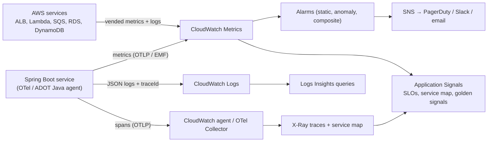
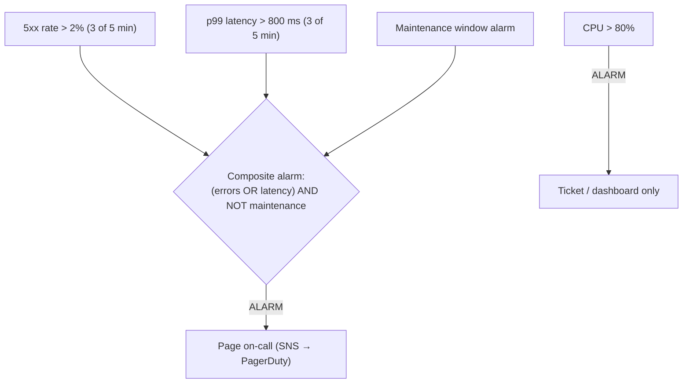
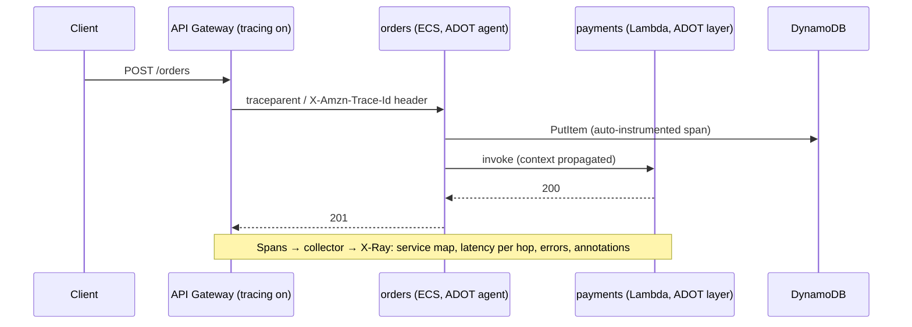

# Observability: CloudWatch, X-Ray

!!! abstract "TL;DR"
    - **CloudWatch Metrics:** time series in **namespaces** with **dimensions**. Standard resolution is 1 minute (high-resolution down to 1 s), and data is retained for 15 months with roll-ups. Publish custom metrics cheaply with the **Embedded Metric Format (EMF)**: structured log lines that become metrics.
    - **CloudWatch Logs:** log groups → streams. **Set retention** (the default is *never expire*). Query with **Logs Insights**, filter with **metric filters** and **subscription filters** (to Lambda, Firehose or OpenSearch), and use **data protection policies** to mask PII/PHI.
    - **Alarms:** static threshold, **anomaly detection**, **composite** alarms (cut noise), **metric math**, M-of-N datapoints, and **missing-data** handling. Actions go to SNS, Auto Scaling, EC2, or Systems Manager incidents.
    - **Tracing:** X-Ray service maps and traces. The **X-Ray SDKs and daemon entered maintenance mode on 25 Feb 2026** (end of support 25 Feb 2027). Instrument with **OpenTelemetry / AWS Distro for OpenTelemetry (ADOT)** and send through the CloudWatch agent or the OTel Collector. X-Ray as a backend continues, and **CloudWatch Application Signals** adds SLOs and service dashboards on top.
    - **Practice:** alert on **symptoms** (SLO burn rate, error rate, p99 latency, queue age), not on every cause. Correlate metrics → traces → logs with a **trace ID in every log line**.

## Why it matters

Production readiness questions ("how would you know it's broken before customers tell you?") come up for every senior role. On AWS that means knowing what CloudWatch gives you for free, what you must add (custom metrics, structured logs, traces), how to keep costs down (log ingestion is a classic budget surprise), and how tracing is changing (X-Ray SDK → OpenTelemetry).

## Core concepts

### The signals and where they live


*Notice the three pillars converge: **metrics** tell you *something* is wrong, **traces** tell you *where* (which hop), and **logs** tell you *why*. The trace ID is what joins them.*

### Metrics essentials

- **Vended metrics** (free, mostly 1-minute):
    - ALB: `TargetResponseTime`, `HTTPCode_Target_5XX_Count`
    - Lambda: `Duration`, `Errors`, `Throttles`, `ConcurrentExecutions`
    - SQS: `ApproximateAgeOfOldestMessage`
    - RDS: `CPUUtilization`, `DatabaseConnections`
    - DynamoDB: `ThrottledRequests`

    EC2 memory and disk need the **CloudWatch agent**.
- **Statistics:** Average hides tail pain, so use **percentiles** (p90/p99) for latency. Use `Sum` for counts.
- **Dimensions cost money:** each unique combination is a separate custom metric. Don't put user IDs or request IDs in dimensions (cardinality explosion).
- **EMF:** write one JSON log line with `_aws` metadata, and CloudWatch extracts metrics asynchronously. There are no `PutMetricData` API calls in the hot path, and it's ideal for Lambda.
- **Metric Streams** push near-real-time metrics to Firehose (Datadog, New Relic, S3).

### Logs essentials

- Log in **structured JSON** with `timestamp`, `level`, `service`, `traceId`, `spanId`, `requestId`, `tenantId`. Never log PHI, PII or secrets. Back that up with **data protection policies** that detect and mask sensitive data.
- **Retention:** default is *never expire*, so always set it (for example 30 days hot, then export to S3 for long-term compliance).
- **Log classes:** Standard vs **Infrequent Access** (cheaper ingestion, fewer features).
- **Logs Insights** example:

```text
fields @timestamp, traceId, path, status, durationMs
| filter service = "orders" and status >= 500
| stats count() as errors, pct(durationMs, 99) as p99 by bin(5m), path
| sort errors desc
```

- **Metric filters** turn log patterns into metrics (for example `"ERROR"` count). **Subscription filters** stream logs to Lambda, Firehose or OpenSearch.

### Alarms that don't page you for nothing


*Notice that the page fires on **user-facing symptoms**. Causes like CPU go to tickets. Composite alarms and M-of-N datapoints cut flapping. Set **TreatMissingData** deliberately: missing data from a dead service shouldn't count as "OK".*

**SLO burn-rate alerting:** for a 99.9% SLO (0.1% error budget), alert when the budget burns fast. For example, a burn rate of 14.4 over 1 h (with 5 min confirmation) spends 2% of a 30-day budget in an hour. **Application Signals** can define SLOs and burn-rate alarms for you.

### Tracing: X-Ray and OpenTelemetry


*Notice that **context propagation** (W3C `traceparent` or the X-Ray header) is what links the hops. Auto-instrumentation covers HTTP, AWS SDK and JDBC calls. Sampling keeps cost under control.*

- **Concepts:**
    - **trace** → **segments/spans** → **subsegments**
    - **annotations** (indexed, searchable) vs **metadata** (not indexed)
    - **sampling rules** (for example 1 request/s plus 5%)
    - **service map**
    - Transaction Search for indexing all spans.
- **2026 change:** the X-Ray SDKs and daemon are in maintenance mode (critical fixes only) from **25 Feb 2026**, with end of support on **25 Feb 2027**. Use **OpenTelemetry** with ADOT or upstream SDKs and agents. X-Ray keeps accepting traces. Spring Boot 3 apps can use Micrometer Tracing with the OTel bridge, or the OTel Java agent.

### Other CloudWatch features worth naming

- **Container Insights** (ECS/EKS): CPU, memory and restarts per task or pod.
- **Lambda Insights.**
- **Application Signals:** auto-discovered services, golden signals, SLOs.
- **Synthetics** canaries for scripted user journeys.
- **RUM** for real-user monitoring in browsers (useful for a React app).
- **Contributor Insights** for top-N talkers (hot DynamoDB keys).
- **ServiceLens.**
- **Cross-account observability** (a monitoring account).
- **Investigations** (AI-assisted root cause).

## In practice: code & configuration

=== "❌ Common mistake"
    ```java
    // Unstructured logs, no trace ID, PHI in logs, and a synchronous PutMetricData per request.
    log.info("Order " + order.getId() + " for patient " + patient.getName() + " failed: " + e);
    cloudWatch.putMetricData(r -> r.namespace("Orders")
        .metricData(MetricDatum.builder().metricName("Failures")
            .dimensions(Dimension.builder().name("userId").value(userId).build())  // cardinality explosion
            .value(1.0).build()));
    ```

=== "✅ Correct approach"
    ```java
    // Structured JSON logs (logback + logstash encoder / Spring Boot 3.4+ structured logging),
    // trace context injected automatically by the OTel/Micrometer bridge into MDC.
    log.atWarn()
       .addKeyValue("orderId", order.id())
       .addKeyValue("errorCode", e.code())            // no names, no PHI
       .log("order.payment_failed");

    // Metrics through Micrometer → OTLP/CloudWatch: low-cardinality tags only.
    meterRegistry.counter("orders.payment.failures", "reason", e.code(), "channel", channel).increment();
    ```

```yaml
# application.yml (Spring Boot 3.x)
logging:
  structured:
    format:
      console: ecs                       # JSON logs to stdout → awslogs / FireLens
management:
  tracing:
    sampling:
      probability: 0.1                   # 10% head sampling, errors kept by tail rules in the collector
  otlp:
    tracing:
      endpoint: http://localhost:4318/v1/traces   # ADOT / CloudWatch agent sidecar
  metrics:
    distribution:
      percentiles-histogram:
        http.server.requests: true       # enables p99 from histograms
```

```hcl
resource "aws_cloudwatch_log_group" "orders" {
  name              = "/ecs/orders"
  retention_in_days = 30                 # never leave the default "never expire"
  kms_key_id        = aws_kms_key.logs.arn
}

resource "aws_cloudwatch_metric_alarm" "orders_5xx" {
  alarm_name          = "orders-5xx-rate"
  comparison_operator = "GreaterThanThreshold"
  evaluation_periods  = 5
  datapoints_to_alarm = 3                # 3 of 5 minutes
  threshold           = 2
  treat_missing_data  = "breaching"      # silence from a dead service is bad
  metric_query {
    id          = "rate"
    expression  = "100 * errors / MAX([errors, requests])"
    label       = "5xx %"
    return_data = true
  }
  metric_query {
    id = "errors"
    metric {
      namespace   = "AWS/ApplicationELB"
      metric_name = "HTTPCode_Target_5XX_Count"
      period      = 60
      stat        = "Sum"
      dimensions  = { LoadBalancer = aws_lb.api.arn_suffix, TargetGroup = aws_lb_target_group.orders.arn_suffix }
    }
  }
  metric_query {
    id = "requests"
    metric {
      namespace   = "AWS/ApplicationELB"
      metric_name = "RequestCount"
      period      = 60
      stat        = "Sum"
      dimensions  = { LoadBalancer = aws_lb.api.arn_suffix, TargetGroup = aws_lb_target_group.orders.arn_suffix }
    }
  }
  alarm_actions = [aws_sns_topic.oncall.arn]
}
```

## Real-world usage

- **Amazon's own practice** (Builders' Library): instrument everything, use percentiles, and alarm on customer-facing symptoms. "Dashboards for diagnosis, alarms for action."
- **Cost surprises:**
    - Debug-level logging in prod.
    - Never-expiring log groups.
    - High-cardinality custom metrics.
    - VPC Flow Logs to CloudWatch at scale.

    Fixes: retention, sampling, IA log class, Flow Logs to S3, EMF.
- **Hybrid stacks:** many teams use CloudWatch for AWS-vended metrics and alarms, and Grafana, Datadog or Prometheus (Amazon Managed Prometheus/Grafana) for app dashboards. OTel makes the backend swappable.
- **Healthcare:** log data protection policies to mask PHI, KMS-encrypted log groups, audit logs (CloudTrail) kept separately and immutable.

## Trade-offs & production gotchas

| Option | Pros | Cons | Use when |
|---|---|---|---|
| CloudWatch native | Zero setup for AWS metrics, alarms integrate with Auto Scaling | Query UX, cost at high log volumes | AWS-centric teams |
| EMF metrics | No API calls, metrics + logs in one | Ingestion cost of the log line | Lambda, high-throughput services |
| OTel + ADOT | Vendor-neutral, one SDK for traces/metrics/logs | Collector to run and tune | All new instrumentation (X-Ray SDK is in maintenance) |
| Third-party APM | Rich UX, correlation | License cost, data egress | Large orgs with existing tools |

!!! warning "Gotchas"
    - **Average latency lies.** Alarm on p99 or on SLO burn.
    - **Missing data:** a crashed service sends no metrics. `notBreaching` would hide it. Use `breaching`, or a heartbeat or synthetic canary.
    - **Logs cost more than metrics.** Sample debug logs, aggregate before logging, and set retention.
    - **Trace sampling** can miss rare errors. Use tail-based sampling in the OTel collector to keep all error traces.

## How this connects to my experience

- **Where I used it:** ConvergeHealth Data Asset Explorer (AWS services, so CloudWatch was the default telemetry backend), and production support for OptumRx Meteor ("release management, and production support").
- **Talking points:**
    - "Services logged structured JSON with correlation and trace IDs. Alarms on 5xx rate, latency, DLQ depth and Lambda throttles went to the on-call channel." *[confirm: which alarms existed, tooling such as CloudWatch, Splunk, Dynatrace or Datadog]*
    - "For Kafka consumers at Optum, the key signals were consumer lag, DLQ rate and processing latency." *[confirm: monitoring stack]*
    - "Today I'd instrument with OpenTelemetry (ADOT) because the X-Ray SDKs are in maintenance mode."
- **Likely follow-up chain:** "How did you know about incidents?" → "Which alarms page and which don't?" → "How do you trace a request across Lambda and ECS?" → "How do you keep logging costs down?" Answer: symptom-based alarms and SLOs → composite/M-of-N → OTel context propagation + trace ID in logs → retention, sampling, EMF.

## Interview questions

### Fundamentals

??? question "Q1. Metrics vs logs vs traces?"
    **Answer:**
    - **Metrics:** cheap aggregated numbers over time, for alerting and trends.
    - **Logs:** detailed discrete events, for root cause.
    - **Traces:** a request's path across services with timing per hop, for finding *where*.

    They're correlated by trace ID.

    **Interviewer listens for:** what each is for, and correlation.

    **Common wrong answer:** "logs are enough".

??? question "Q2. Which EC2 metrics does CloudWatch not provide by default?"
    **Answer:** Memory and disk-space utilisation (inside the OS). Install the **CloudWatch agent**. CPU, network and status checks are vended.

    **Interviewer listens for:** knowing the agent is needed.

    **Common wrong answer:** "memory is built in".

??? question "Q3. What is the CloudWatch Logs default retention, and why does it matter?"
    **Answer:** **Never expire**. Costs grow forever and you may break data-minimisation rules. Set retention per log group, and export to S3/Glacier for long-term compliance needs.

    **Interviewer listens for:** cost and compliance awareness.

    **Common wrong answer:** "30 days".

??? question "Q4. What's the status of X-Ray in 2026?"
    **Answer:** The X-Ray **service** continues. The X-Ray **SDKs and daemon** are in maintenance mode from 25 Feb 2026, with end of support on 25 Feb 2027. Instrument new code with OpenTelemetry (ADOT) and export through the CloudWatch agent or OTel Collector. Application Signals and Transaction Search build on that.

    **Interviewer listens for:** being current with the change.

    **Common wrong answer:** "use the X-Ray SDK for new services".

### Intermediate

??? question "Q5. How do you publish custom metrics from Lambda efficiently?"
    **Answer:** **Embedded Metric Format**: log one structured JSON line with metric definitions, and CloudWatch extracts the metrics. There are no synchronous API calls, and it batches naturally. Use Powertools Metrics. Keep dimensions low-cardinality.

    **Interviewer listens for:** EMF, and avoiding the cardinality trap.

    **Common wrong answer:** "PutMetricData on every invocation".

??? question "Q6. Composite alarms: why use them?"
    **Answer:** They combine alarms with AND/OR/NOT to cut noise. For example: page only if (5xx high OR latency high) AND NOT in a maintenance window, or suppress child alarms when a parent dependency alarm is firing. Fewer, more meaningful pages.

    **Interviewer listens for:** reducing alert fatigue.

    **Common wrong answer:** "to show more charts".

??? question "Q7. Which signals would you alarm on for an SQS + Lambda pipeline?"
    **Answer:**
    - `ApproximateAgeOfOldestMessage` (the latency of the backlog).
    - DLQ `ApproximateNumberOfMessagesVisible` > 0.
    - Lambda `Errors` and `Throttles`.
    - `IteratorAge` for streams.
    - Downstream errors.

    Queue depth alone is less useful than age.

    **Interviewer listens for:** age of oldest message, plus DLQ.

    **Common wrong answer:** "CPU".

??? question "Q8. How do you correlate a slow request across services?"
    **Answer:** Propagate W3C trace context (OTel auto-instrumentation). Every service logs the trace ID in its structured logs. From an alarm, open exemplar traces in X-Ray or Application Signals, find the slow span, then use Logs Insights with `filter traceId = ...` across log groups.

    **Interviewer listens for:** that the trace ID in logs is the glue.

    **Common wrong answer:** "grep each service's logs by timestamp".

### Senior

??? question "Q9. Design SLO-based alerting for an API with a 99.9% availability SLO."
    **Answer:**
    - **SLI:** good requests / valid requests (non-5xx and under 500 ms).
    - **Error budget:** 0.1% over 30 days.
    - **Multi-window, multi-burn-rate alerts:**
        - page on fast burn (14.4× over 1 h, confirmed over 5 min)
        - ticket on slow burn (6× over 6 h, or 1× over 3 days)
    - Implement with metric math or Application Signals SLOs.
    - Review the budget in planning and freeze features when it's exhausted.

    **Interviewer listens for:** burn rates, and the link to engineering decisions.

    **Common wrong answer:** "alert if any error happens".

??? question "Q10. Your CloudWatch bill tripled. Investigate and fix."
    **Answer:**
    1. Use Cost Explorer by usage type: log ingestion, storage, custom metrics, API calls.
    2. Find the noisy log groups (debug logs, health-check logs, Flow Logs).
    3. Set retention, and move some groups to the IA class or S3.
    4. Sample logs.
    5. Cut metric cardinality.
    6. Use EMF instead of PutMetricData.
    7. Reduce dashboard API polling.

    **Interviewer listens for:** a data-driven approach to the drivers.

    **Common wrong answer:** "turn off logging".

### Scenario-based

??? question "Q11. Customers report intermittent slowness, but average latency looks fine. What do you do?"
    **Answer:**
    1. Look at p99/p99.9 and latency by dimension (endpoint, tenant, AZ).
    2. Check the latency histogram for bimodality (cold starts, GC, retries).
    3. Look at traces for slow requests.
    4. Correlate with deployments, cache miss rates and DB metrics.
    5. Add RUM or Synthetics to see the client side.
    6. Alarm on percentiles going forward.

    **Interviewer listens for:** tails over averages.

    **Common wrong answer:** "averages are fine, so it's the client's network".

??? question "Q12. How would you migrate 30 services from the X-Ray SDK to OpenTelemetry?"
    **Answer:**
    1. Deploy a collector (CloudWatch agent or ADOT collector) that accepts OTLP and exports to X-Ray.
    2. Switch services one at a time to the OTel Java agent or Micrometer Tracing + OTel bridge, using W3C `traceparent` (keep X-Ray propagation during the transition).
    3. Verify the service map and sampling.
    4. Move custom subsegments and annotations to span attributes.
    5. Remove the X-Ray daemon.
    6. Finish before end of support (Feb 2027).

    **Interviewer listens for:** incremental migration with mixed propagation.

    **Common wrong answer:** "big-bang rewrite".

## Cheat sheet

| Concept | Remember |
|---|---|
| Metrics | Namespace + dimensions. 1-min standard / 1-s high-res. 15-month retention. Percentiles for latency |
| Agent | Needed for EC2 memory/disk and custom logs |
| EMF | JSON log line → metrics, no API calls |
| Logs | Set retention (default never!), JSON + traceId, data protection masking, IA class |
| Insights | `fields / filter / stats / sort` queries |
| Alarms | Static, anomaly, composite, metric math, M-of-N, TreatMissingData |
| SLO | Burn-rate alerts (14.4× / 1 h page), Application Signals |
| X-Ray | SDK/daemon maintenance from 25 Feb 2026, EoS 25 Feb 2027 → OTel/ADOT |
| Extras | Container/Lambda Insights, Synthetics, RUM, Contributor Insights, cross-account observability |
| Alert on | Symptoms: 5xx %, p99, queue age, DLQ > 0, throttles |

## Sources
1. [Amazon CloudWatch concepts](https://docs.aws.amazon.com/AmazonCloudWatch/latest/monitoring/cloudwatch_concepts.html): metrics, dimensions, statistics, retention.
2. [Embedded Metric Format specification](https://docs.aws.amazon.com/AmazonCloudWatch/latest/monitoring/CloudWatch_Embedded_Metric_Format_Specification.html).
3. [CloudWatch Logs Insights query syntax](https://docs.aws.amazon.com/AmazonCloudWatch/latest/logs/CWL_QuerySyntax.html).
4. [Log data protection](https://docs.aws.amazon.com/AmazonCloudWatch/latest/logs/mask-sensitive-log-data.html): masking sensitive data.
5. [Composite alarms](https://docs.aws.amazon.com/AmazonCloudWatch/latest/monitoring/Create_Composite_Alarm.html) and [missing data handling](https://docs.aws.amazon.com/AmazonCloudWatch/latest/monitoring/AlarmThatSendsEmail.html#alarms-and-missing-data).
6. [X-Ray SDK/daemon end-of-support and OpenTelemetry migration](https://docs.aws.amazon.com/xray/latest/devguide/xray-sdk-migration.html) and [InfoQ coverage](https://www.infoq.com/news/2025/11/aws-opentelemetry/).
7. [AWS Distro for OpenTelemetry](https://aws-otel.github.io/docs/introduction).
8. [CloudWatch Application Signals](https://docs.aws.amazon.com/AmazonCloudWatch/latest/monitoring/CloudWatch-Application-Monitoring-Sections.html): SLOs and service maps.
9. [Google SRE Workbook: Alerting on SLOs](https://sre.google/workbook/alerting-on-slos/): burn-rate alerting.
10. [Amazon Builders' Library: Instrumenting distributed systems for operational visibility](https://aws.amazon.com/builders-library/instrumenting-distributed-systems-for-operational-visibility/).
