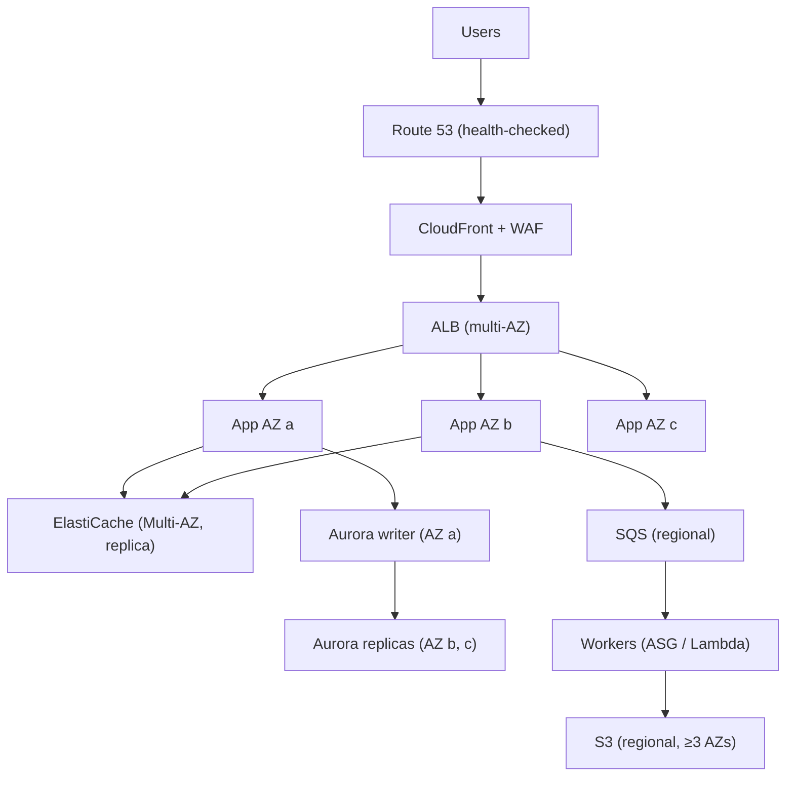
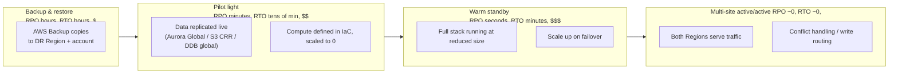
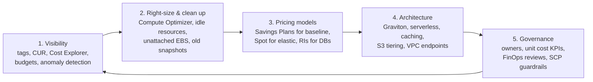

# Architecture Scenarios: HA, DR Strategies, Cost Optimisation

!!! abstract "Key takeaways"
    - **HA ≠ DR.** **High availability** keeps you running through *component and AZ failures* inside a Region (Multi-AZ, health checks, auto-recovery). **Disaster recovery** restores service after a *Region-level or data-destroying* event (a bad deploy that corrupts data, ransomware, a Region outage).
    - **RPO** = how much data you can lose (time). **RTO** = how long until you're back. Get them from the **business, per workload**, and design and price against them.
    - **Four DR strategies**, cheapest to most expensive:

        | Strategy | RPO / RTO | What's running in the DR Region |
        |---|---|---|
        | **Backup & restore** | Hours | Only backups |
        | **Pilot light** | Minutes / tens of minutes | Data replicated, compute off |
        | **Warm standby** | Seconds–minutes / minutes | Data replicated, scaled-down full stack running |
        | **Multi-site active/active** | Near zero / near zero | Full stack serving traffic |

    - **Make failover boring:** data-plane failover (Route 53 health checks, ARC routing controls), pre-provisioned capacity, IaC for the whole stack, **regular game days**, and backups in a **separate account** with vault lock (ransomware).
    - **Cost optimisation is continuous:** visibility (tags, CUR, Cost Explorer, budgets) → right-size (Compute Optimizer) → pricing models (Savings Plans, Spot) → architecture (Graviton, serverless, storage tiering, VPC endpoints, caching) → governance (anomaly detection, owners).

## Why it matters

"Design X to survive a Region outage" and "our AWS bill is too high, what do you do?" are the two most common senior AWS scenario questions. They test whether you can turn **business requirements into numbers** (SLO, RTO, RPO, budget) and **choose trade-offs** instead of reaching for active-active everywhere.

{ loading=lazy }
*Notice the two gaps point in opposite directions from the disaster: RPO back to the last recovery point, RTO forward to recovery.*

## Core concepts

### Availability building blocks


*Notice that every tier is either **regional by design** (S3, SQS, DynamoDB) or **deployed across AZs** (ALB, app, cache, DB). There's no single point of failure inside the Region. Queues **decouple** the workers, so a slow dependency doesn't break the request path.*

Availability maths:

- **Serial dependencies multiply:** three 99.9% components in series give ≈ 99.7%.
- **Redundancy improves it:** two independent 99% instances in parallel give 99.99%, *if* failures are independent and failover works.
- So reduce hard dependencies, add redundancy, and make failure detection and failover fast.

Patterns that raise availability:

- **Static stability:** pre-provision for losing one AZ (N+1).
- **Timeouts, retries with jitter, circuit breakers, bulkheads.**
- **Graceful degradation:** serve cached or default data when a dependency fails.
- **Load shedding** under overload.
- **Cell-based architecture:** split customers into independent cells to limit blast radius.
- **Shuffle sharding.**
- **Deployment safety:** canary, automatic rollback on alarms, one AZ or cell at a time.

### DR strategies


*Notice that the cost grows with **how much is already running** in the DR Region. The hard part of active/active is **data**: write conflicts, consistency and routing each user to a "home" Region.*

| | Backup & restore | Pilot light | Warm standby | Active/active |
|---|---|---|---|---|
| Data in DR | Backups (snapshots) | Live replication | Live replication | Live, bi-directional or partitioned |
| Compute in DR | None | Off (AMIs/images ready) | Running, scaled down | Full |
| Failover | Restore from backups + deploy via IaC | Scale up + promote DB + DNS | Scale up + promote + DNS | Route away from the failed Region |
| Typical RPO/RTO | Hours / 24 h | Minutes / < 1 h | Seconds / minutes | ~0 / ~0 |
| AWS tools | AWS Backup (cross-Region/account copies) | Aurora Global DB, S3 CRR, DynamoDB global tables, **Elastic Disaster Recovery** (block-level replication) | Same + ASG/ECS min capacity | Global tables, Aurora Global write forwarding / DSQL, Route 53 latency, ARC |

**Failover mechanics:**

- Use **data-plane** controls: Route 53 failover records with health checks, or **Application Recovery Controller** routing controls.
- Avoid control-plane-dependent steps where possible. **Pre-scale** if you can.
- **Database promotion:** Aurora Global switchover (planned, no data loss) vs failover (unplanned, may lose recent data).
- **Fail back** is a separate, practised procedure.

**Data corruption and ransomware:** replication copies bad writes too, so DR also needs **point-in-time backups** (PITR, AWS Backup with **vault lock**, S3 versioning + Object Lock) in an **isolated account**.

{ loading=lazy }
*Watch the replica turn red right after the primary. Replication protects against losing a Region, not against bad data; only the backup timeline goes back far enough.*

### Cost optimisation playbook


*Notice the order: you can't optimise what you can't attribute. And committing to Savings Plans **before** right-sizing locks in waste.*

Biggest levers (typical):

1. **Compute:** right-size, Graviton (better price/performance), Savings Plans (up to ~66–72%), Spot (up to ~90%), turn off non-prod at night (~65% fewer hours).
2. **Data transfer:** VPC endpoints instead of NAT, same-AZ traffic, CloudFront for egress, compress.
3. **Storage:** gp2 → gp3, S3 lifecycle and Intelligent-Tiering, delete orphaned snapshots, log retention.
4. **Databases:** right-size, Aurora I/O-Optimized for I/O-heavy workloads, reserved instances, DynamoDB on-demand vs provisioned per traffic shape.
5. **Unit economics:** cost per order, per patient or per tenant, so engineering can see the effect of design choices.

## In practice: code & configuration

=== "❌ Common mistake"
    ```text
    "We have DR": nightly RDS snapshots in the SAME Region and SAME account,
    never restored or tested, no IaC for the network, no documented RTO/RPO,
    DNS TTL 86400, and the runbook lives on a wiki hosted in the failed Region.
    ```

=== "✅ Correct approach"
    ```hcl
    # AWS Backup: daily + PITR, copied to another Region AND another account, with vault lock.
    resource "aws_backup_vault" "primary" { name = "prod-primary" }

    resource "aws_backup_plan" "prod" {
      name = "prod-critical"
      rule {
        rule_name                = "daily"
        target_vault_name        = aws_backup_vault.primary.name
        schedule                 = "cron(0 3 * * ? *)"
        enable_continuous_backup = true                  # PITR for supported services
        lifecycle { delete_after = 35 }
        copy_action {
          destination_vault_arn = "arn:aws:backup:eu-west-2:${var.dr_account}:backup-vault:dr-locked"
          lifecycle { delete_after = 90 }
        }
      }
    }

    resource "aws_backup_selection" "prod" {
      name         = "tagged-critical"
      plan_id      = aws_backup_plan.prod.id
      iam_role_arn = aws_iam_role.backup.arn
      selection_tag {
        type  = "STRINGEQUALS"
        key   = "backup"
        value = "critical"
      }
    }
    # In the DR account: aws_backup_vault_lock_configuration (compliance mode, min retention)
    # plus a Route 53 failover record with a health check, short TTL (60s),
    # and a quarterly game day that restores and fails over for real.
    ```

```yaml
# DR decision record (ADR) per workload: the artifact interviewers love to hear about
workload: prescription-api
business_owner: pharmacy-ops
slo_availability: 99.95%
rpo: 5 minutes
rto: 30 minutes
strategy: warm standby (eu-west-2), Aurora Global Database, ECS min 2 tasks in DR
failover: Route 53 ARC routing control → promote Aurora secondary → scale ECS
data_corruption: AWS Backup PITR + cross-account vault lock (35 d)
test_cadence: quarterly game day, last: [confirm]
cost_delta: +28% of primary Region run-rate [confirm]
```

## Real-world usage

- **Region events** (e.g. `us-east-1` in 2017, 2021 and October 2025) showed that hidden single-Region dependencies (control planes, global services, third-party SaaS) break DR plans. Teams that **regularly practised** failover recovered fastest.
- **Cell-based architectures** at AWS (and at many SaaS companies) limit blast radius, so one bad deployment or poison request affects a small share of customers.
- **Ransomware recovery:** organisations that kept immutable, cross-account backups recovered. Those relying on in-account snapshots often couldn't.
- **FinOps:** mature teams publish cost per unit (per transaction or customer), review anomalies weekly, and make engineering teams own their cloud spend through tags and showback.
- **Healthcare and banking:** regulators expect documented and tested DR (RTO/RPO per critical service), backups that are immutable and isolated, and DR Regions within the same jurisdiction.

## Trade-offs & production gotchas

| Choice | Pros | Cons | Use when |
|---|---|---|---|
| Multi-AZ only | Covers most real failures, cheap | No Region DR | Most internal and non-critical systems |
| Backup & restore | Cheapest DR | Hours of downtime | Analytics, internal tools |
| Pilot light | Low cost, data safe | Scale-up time, untested surprises | Important but tolerant systems |
| Warm standby | Fast, testable | Ongoing cost (~20–50% extra) | Customer-facing critical services |
| Active/active | Lowest RTO/RPO, latency benefits | Data complexity, highest cost | Global, revenue-critical, with a business case |

!!! warning "Gotchas"
    - **Untested DR is not DR.** Quotas, AMIs, secrets, certificates and KMS keys missing in the DR Region are the usual failures. Use multi-Region keys and replicated secrets.
    - **Replication isn't backup.** Corruption and deletes replicate instantly.
    - **DNS caching:** long TTLs and clients that cache DNS (the JVM) delay failover.
    - **Savings Plans before right-sizing** lock in waste. **Spot for stateful** workloads causes outages.

## How this connects to my experience

- **Where I used it:**
    - OptumRx Meteor: "enterprise healthcare applications serving **750K+ users**", "release management, and production support".
    - Deloitte: AWS cloud-native platform with Terraform.
    - Collaborated "with senior architects on platform architecture and enterprise system design".
- **Talking points:**
    - "For healthcare workloads we designed every tier for Multi-AZ, with RTO/RPO agreed per service, and DR tested via … " *[confirm: actual DR strategy, Region pair, test cadence, numbers]*
    - "Terraform defined the whole stack, so a DR environment could be rebuilt from code." *[confirm]*
    - "Cost: tags per service and environment, right-sizing, non-prod schedules, and Savings Plans." *[confirm: any concrete saving achieved and its size]*
    - If you weren't directly responsible for DR, say so and explain how you'd do it. Don't claim ownership.
- **Likely follow-up chain:** "What were your RTO and RPO?" → "How did you test DR?" → "What breaks during a real failover?" → "How much did DR cost, and was it worth it?" Answer: numbers from the business → game days → quotas, DNS, keys, secrets, data promotion → the cost delta against the cost of downtime.

## Interview questions

### Fundamentals

??? question "Q1. RTO vs RPO?"
    **Answer:** RPO is the maximum acceptable data loss, measured as time since the last recoverable point. RTO is the maximum acceptable downtime until service is restored. They come from the business per workload, and they drive the DR strategy and its cost.

    **Interviewer listens for:** that they're business-driven and set per workload.

    **Common wrong answer:** mixing them up.

??? question "Q2. Name the four DR strategies."
    **Answer:** Backup & restore (hours), pilot light (core data live, compute off, tens of minutes), warm standby (scaled-down full stack, minutes), and multi-site active/active (near zero). Cost increases with how much is running in the DR Region.

    **Interviewer listens for:** RTO/RPO and cost for each.

    **Common wrong answer:** "hot, cold, warm" with no detail.

??? question "Q3. HA vs DR?"
    **Answer:** HA keeps service up through component or AZ failures within a Region, usually automatically. DR recovers from large-scale events (Region loss, data corruption, ransomware) and often involves a deliberate failover to another Region or a restore from backups.

    **Interviewer listens for:** different failure scopes.

    **Common wrong answer:** "Multi-AZ is DR".

??? question "Q4. First three steps to reduce an AWS bill?"
    **Answer:**
    1. **Visibility:** tags, Cost Explorer and the CUR to find the top services and owners.
    2. **Remove waste and right-size:** idle resources, Compute Optimizer, gp3, log retention.
    3. **Commit:** Savings Plans for the remaining steady baseline, then architecture changes (Graviton, Spot, endpoints).

    **Interviewer listens for:** measure first, commit last.

    **Common wrong answer:** "buy RIs".

### Intermediate

??? question "Q5. Why is replication not a backup?"
    **Answer:** Replication copies every change, including accidental deletes, corruption and ransomware encryption, within seconds. Backups (PITR, snapshots, versioning + Object Lock) let you go back to a point **before** the bad change. Keep them in a separate account with vault lock.

    **Interviewer listens for:** corruption scenarios and isolation.

    **Common wrong answer:** "Aurora Global is our backup".

??? question "Q6. How do you fail over traffic between Regions reliably?"
    **Answer:**
    - Route 53 failover or latency records with health checks.
    - For controlled failover, **ARC routing controls** (data-plane on/off switches backed by a highly available cluster).
    - Short TTLs.
    - Clients that respect DNS.
    - Pre-scaled capacity.
    - A runbook that covers database promotion, and avoids depending on the failed Region's control plane.

    **Interviewer listens for:** data-plane control, and pre-provisioning.

    **Common wrong answer:** "change the DNS record in the console during the outage".

??? question "Q7. What is a cell-based architecture?"
    **Answer:** Split the system into identical, independent cells (each a full stack), each serving a subset of customers. A thin routing layer maps customers to cells. Failures and bad deploys affect only one cell, and capacity scales by adding cells. The trade-offs are routing complexity and cross-cell operations.

    **Interviewer listens for:** blast radius.

    **Common wrong answer:** "just microservices".

??? question "Q8. Savings Plans vs Reserved Instances vs Spot?"
    **Answer:**
    - **Compute Savings Plans:** a flexible $/hour commitment across EC2 families, Regions, Fargate and Lambda.
    - **EC2 Instance Savings Plans / RIs:** deeper discount, tied to a family and Region. RIs are still used for RDS, ElastiCache and OpenSearch.
    - **Spot:** the biggest discount, but can be interrupted.

    Cover the steady baseline with SPs and use Spot for elastic, stateless work.

    **Interviewer listens for:** a layered strategy.

    **Common wrong answer:** "RIs for Lambda".

### Senior

??? question "Q9. Design DR for a prescription platform: RPO 5 min, RTO 30 min, data must stay in the EU."
    **Answer:** **Warm standby** in a second EU Region:
    - Aurora Global Database (RPO typically seconds).
    - S3 CRR for documents, DynamoDB global tables for session/idempotency data.
    - ECS services running at minimum size in the DR Region.
    - Multi-Region KMS keys and replicated secrets.
    - Route 53 ARC routing controls.
    - IaC parity checks.
    - AWS Backup PITR + a cross-account vault lock for corruption.
    - Quarterly game days.
    - Monitoring in both Regions.

    Show the cost delta and get sign-off.

    **Interviewer listens for:** a residency-aware Region choice, data + keys + secrets, and testing.

    **Common wrong answer:** "active/active in us-east-1 and eu-west-1" (breaks residency).

??? question "Q10. Active/active multi-Region: what are the hard problems?"
    **Answer:**
    - **Write conflicts:** last-writer-wins can lose updates. Use home-Region routing per user, or conflict-free data types.
    - **Consistency guarantees** for transactions (payments) and uniqueness constraints.
    - Global IDs.
    - Cross-Region latency for synchronous calls.
    - Cache invalidation.
    - Testing.
    - Double the cost.

    Often the answer is **active/active for reads and stateless parts, with a single write Region per partition**.

    **Interviewer listens for:** naming the data problems specifically.

    **Common wrong answer:** "global tables solve it".

??? question "Q11. How do you design for an AZ failure without auto-scaling in time?"
    **Answer:** **Static stability**: run enough capacity so that losing one AZ still leaves enough (with 3 AZs, run at most ~66% utilisation, or N+1). Use AZ-independent dependencies (NAT per AZ, a cache replica per AZ), zonal shift (ARC) to evacuate an impaired AZ, and health checks that detect gray failures.

    **Interviewer listens for:** pre-provisioning, plus gray failures.

    **Common wrong answer:** "ASG will replace instances".

### Scenario-based

??? question "Q12. Monthly AWS spend jumped 40% with no traffic change. Walk through it."
    **Answer:**
    1. Cost Anomaly Detection and Cost Explorer by service, usage type, account and tag.
    2. Common culprits:
        - new NAT data processing from an image pull loop or traffic moved off endpoints
        - log ingestion from a debug flag
        - cross-AZ traffic after a deployment change
        - forgotten load tests or dev clusters
        - Savings Plan expiry
        - S3 request costs from a new job
    3. Fix the cause, add budgets and alerts per team, and add guardrails (SCP Region restrictions, mandatory tags).

    **Interviewer listens for:** a systematic drill-down.

    **Common wrong answer:** "AWS raised prices".

??? question "Q13. Leadership asks for '100% uptime' for a 750K-user healthcare app. Respond."
    **Answer:**
    1. Explain that 100% isn't achievable or affordable.
    2. Propose an SLO (for example 99.95%) with an error budget.
    3. Map critical user journeys and set RTO/RPO per journey.
    4. Baseline: Multi-AZ, static stability and safe deploys.
    5. Add warm-standby DR for core journeys and backup-and-restore for the rest.
    6. Show cost per nine and the testing cadence.
    7. Report SLOs monthly.

    **Interviewer listens for:** turning the request into SLOs and a costed plan.

    **Common wrong answer:** "active/active everything".

## Cheat sheet

| Concept | Remember |
|---|---|
| HA vs DR | AZ/component failures (in Region) vs Region loss or corruption |
| RPO / RTO | Data loss tolerance / downtime tolerance, per workload |
| DR ladder | Backup & restore (h) → pilot light (10s of min) → warm standby (min) → active/active (~0) |
| Tools | AWS Backup (cross-Region/account, vault lock), Aurora Global, S3 CRR, DDB global tables, Elastic Disaster Recovery, ARC |
| Failover | Data plane (Route 53 health checks, ARC), short TTL, pre-scaled, practised |
| Not backup | Replication. Keep PITR + immutable cross-account copies |
| Availability maths | Serial multiplies down, parallel redundancy up |
| Static stability | N+1 AZ capacity, no control-plane calls needed to survive |
| Cost order | Visibility → clean up/right-size → commit (SP/RI) → architecture → governance |
| Big levers | Graviton, Savings Plans, Spot, gp3, S3 tiering, VPC endpoints, log retention, non-prod schedules |

## Sources
1. [Disaster Recovery of Workloads on AWS (whitepaper)](https://docs.aws.amazon.com/whitepapers/latest/disaster-recovery-workloads-on-aws/disaster-recovery-options-in-the-cloud.html): the four strategies, RTO/RPO.
2. [Well-Architected Reliability Pillar](https://docs.aws.amazon.com/wellarchitected/latest/reliability-pillar/welcome.html): availability design, static stability, testing.
3. [Amazon Application Recovery Controller](https://docs.aws.amazon.com/r53recovery/latest/dg/what-is-route53-recovery.html): routing controls and zonal shift.
4. [AWS Backup cross-account and cross-Region copy](https://docs.aws.amazon.com/aws-backup/latest/devguide/cross-region-backup.html) and [vault lock](https://docs.aws.amazon.com/aws-backup/latest/devguide/vault-lock.html).
5. [AWS Elastic Disaster Recovery](https://docs.aws.amazon.com/drs/latest/userguide/what-is-drs.html): block-level replication, RPO seconds.
6. [Aurora Global Database switchover and failover](https://docs.aws.amazon.com/AmazonRDS/latest/AuroraUserGuide/aurora-global-database-disaster-recovery.html).
7. [Reducing the scope of impact with cell-based architecture (whitepaper)](https://docs.aws.amazon.com/wellarchitected/latest/reducing-scope-of-impact-with-cell-based-architecture/reducing-scope-of-impact-with-cell-based-architecture.html).
8. [Well-Architected Cost Optimisation Pillar](https://docs.aws.amazon.com/wellarchitected/latest/cost-optimization-pillar/welcome.html) and [Savings Plans](https://docs.aws.amazon.com/savingsplans/latest/userguide/what-is-savings-plans.html).
9. [AWS Cost Anomaly Detection](https://docs.aws.amazon.com/cost-management/latest/userguide/manage-ad.html) and [Compute Optimizer](https://docs.aws.amazon.com/compute-optimizer/latest/ug/what-is-compute-optimizer.html).
