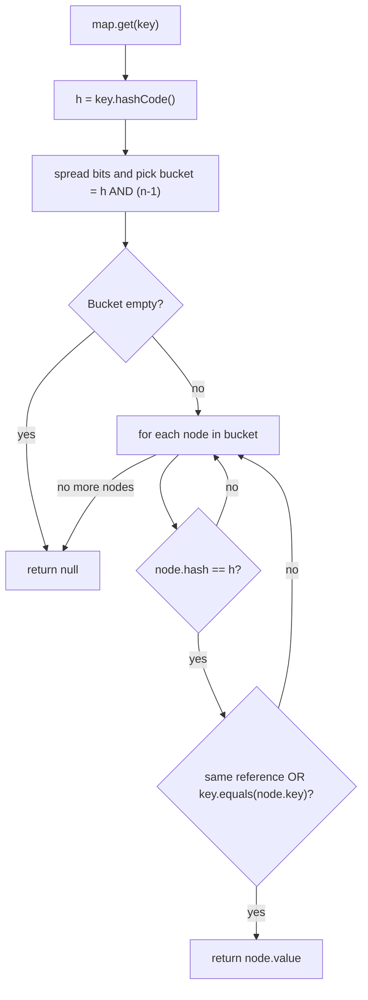
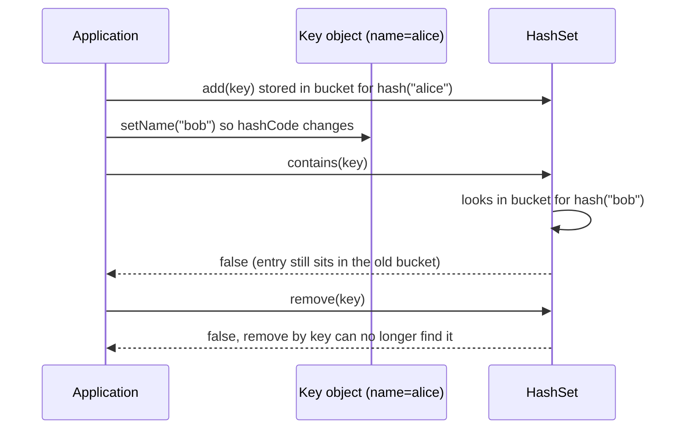
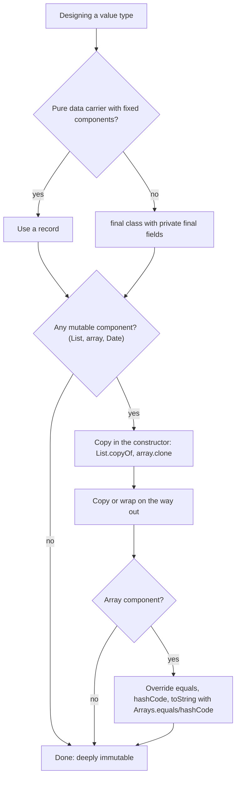

# OOP Principles, equals/hashCode Contract & Immutability

!!! abstract "TL;DR"
    - **OOP pillars:** encapsulation (hide state behind behaviour), abstraction (depend on contracts), inheritance (reuse via "is-a"), polymorphism (one call, many runtime implementations through **dynamic dispatch**). Prefer **composition over inheritance**.
    - **equals contract:** reflexive, symmetric, transitive, consistent, and `x.equals(null) == false`. **hashCode contract:** equal objects **must** have equal hash codes. Unequal objects *may* collide.
    - **Override both or neither.** `HashMap`/`HashSet` look up by `hashCode()` first to pick a bucket, then by `equals()` inside the bucket. Break the link and lookups silently fail.
    - **Never mutate a field used in `hashCode()` while the object is a key** in a hash collection. The entry becomes unreachable (a memory leak that looks like a "missing" entry).
    - **Immutable class recipe:** `final` class (or sealed), `private final` fields, no setters, defensive copies in and out, no `this` escape in the constructor. In Java 16+, a **`record`** gives you most of this for free, but it is only **shallowly** immutable.

## Why it matters

Almost every senior Java interview opens with "what is the equals/hashCode contract?" because the answer reveals whether you understand **how `HashMap` actually works**, not just how to call it. The bugs that come from getting this wrong are among the hardest to find in production: nothing throws, nothing logs, a cache just "misses", a `Set` just holds duplicates, or memory slowly grows.

Immutability matters for the same reason at a larger scale. An immutable object:

- is **thread-safe without locks** (nothing to race on),
- is safe to use as a **map key or cache key**,
- can be **shared and cached freely** (no defensive copying by callers),
- makes event-driven systems easier to reason about (a Kafka event, once built, never changes).

## Core concepts

### The four OOP pillars, as the JVM sees them

| Pillar | Plain meaning | How Java implements it |
|---|---|---|
| **Encapsulation** | Keep state private; expose behaviour | Access modifiers (`private`, package-private, `protected`, `public`), modules (JPMS) for package-level hiding |
| **Abstraction** | Callers depend on *what*, not *how* | Interfaces, abstract classes, sealed hierarchies |
| **Inheritance** | A subtype reuses and specialises a supertype | `extends` (single class inheritance), `implements` (many interfaces), default methods |
| **Polymorphism** | One call site, many behaviours | **Runtime:** virtual method dispatch (overriding). **Compile time:** overloading |

Two details interviewers probe:

1. **Overriding vs overloading.** Overriding is resolved at **runtime** from the object's actual class (dynamic dispatch, via the class's method table). Overloading is resolved at **compile time** from the *declared* types of the arguments. This is exactly why `public boolean equals(Money other)` is a bug: it *overloads* `equals(Object)` instead of overriding it, so `HashMap` (which calls `equals(Object)`) never sees it. Always put `@Override` on it so the compiler catches this.
2. **Liskov Substitution Principle (LSP).** A subtype must be usable anywhere its supertype is expected without surprising the caller. Inheritance that breaks LSP (the classic `Square extends Rectangle`) is a design smell. *Effective Java* Item 18 says **favour composition over inheritance**: inheritance couples you to the superclass's implementation details (the "fragile base class" problem).

!!! tip "Modern Java angle"
    Java 17's **sealed classes** plus Java 21's **pattern matching for switch** give you "closed" abstraction: the compiler knows every subtype, so a `switch` over a sealed interface can be exhaustive. Full details are on the *Modern Java 9–25* page of this topic.

### Identity vs equality

Java has two notions of "same":

- **Identity (`==`)**: the two references point to the same object on the heap.
- **Logical equality (`equals`)**: the two objects represent the same *value* (same account number, same amount and currency).

`Object.equals` defaults to identity (`this == obj`). `Object.hashCode` defaults to an identity-based value (not a memory address in modern JVMs, but derived per object and then stored in the object header). Classes that represent **values** (money, IDs, coordinates, DTOs used as keys) must override both. Classes that represent **entities with identity** (a thread, a socket, a service bean) usually should not.

### The equals contract

From the `Object.equals` Javadoc, for non-null references `x`, `y`, `z`:

| Property | Rule | Classic way to break it |
|---|---|---|
| Reflexive | `x.equals(x)` is true | Rare; usually only by bizarre code |
| Symmetric | `x.equals(y)` ⇔ `y.equals(x)` | A class that compares equal to `String` (case-insensitive string wrapper), or a subclass that adds a field and uses `instanceof` |
| Transitive | `x.equals(y)` and `y.equals(z)` ⇒ `x.equals(z)` | Subclass that "ignores the extra field when comparing with the parent" |
| Consistent | Repeated calls give the same result if nothing used by equals changed | Depending on mutable or external state (`java.net.URL.equals` resolves host names over the network) |
| Non-null | `x.equals(null)` is false | Casting before checking the type → `NullPointerException` / `ClassCastException` |

### The hashCode contract

Also from the `Object` Javadoc:

1. Called repeatedly on the same object, `hashCode()` must return the same value **as long as no information used by `equals` changes**.
2. If `a.equals(b)`, then `a.hashCode() == b.hashCode()`. **This is the rule people break.**
3. Unequal objects are **not** required to have different hash codes. Collisions are legal, they just cost performance.

Rule 2 only works in one direction. Equal hash codes say nothing about equality (`"Aa".hashCode() == "BB".hashCode()`, both are 2112).

### Why hash collections need both methods


*Notice that `equals()` is never even called if `hashCode()` sends you to the wrong bucket. Two "equal" objects with different hash codes land in different buckets, so `get` returns `null` and `HashSet` stores both as duplicates.*

That is the whole reason for the "override both" rule. The deeper internals (treeification when a bucket reaches 8 nodes and the table has at least 64 buckets, resize, `ConcurrentHashMap`) are on the *HashMap & ConcurrentHashMap internals* page.

### The mutable-key trap


*Notice that the object is still inside the set and still reachable from it, so it is never garbage-collected. This is how mutable keys cause both "missing" cache entries and slow memory leaks.*

### getClass() vs instanceof in equals

*Effective Java* (Item 10) makes a strong point: **there is no way to extend an instantiable class and add a value component while keeping the equals contract**, unless you give up on object-oriented abstraction.

- `instanceof` check: allows subclasses to equal parents. If the subclass adds a field (`ColorPoint extends Point`), you break **symmetry** (point equals colorPoint, but colorPoint does not equal point) or **transitivity** (if you try to "ignore colour when comparing with a plain Point").
- `getClass() != o.getClass()` check: keeps the contract but breaks LSP. A harmless subclass (for example a Hibernate proxy, or a subclass that adds only behaviour) is never equal to its parent.

**Practical senior answer:** make value classes `final` (or `record`), so the question never arises. Use composition ("a `ColorPoint` *has a* `Point`") instead of extending a value class. For JPA entities, where proxies are subclasses, use `instanceof` and compare by the identifier through getters.

### Writing a good hashCode

- Use exactly the **same fields** as `equals` (a subset is legal but weakens distribution; a superset is a bug).
- `Objects.hash(a, b, c)` is readable but allocates a varargs array on each call. For hot keys, hand-write `31 * result + field.hashCode()` or let a record or IDE generate it.
- For immutable objects with expensive hashes, **cache** the hash in a field (like `String` does).
- Never derive it from mutable state, timestamps, or `System.identityHashCode` of a field.

### Immutability: what it really means

An object is immutable if its **observable state cannot change after construction**. The recipe (based on *Effective Java* Item 17 and the Java Language Specification's final field rules):

1. **Do not provide mutators** (no setters, no methods that change fields).
2. **Prevent subclassing**: make the class `final`, use a `record`, or use a private constructor with static factories. A mutable subclass could otherwise override methods and expose changing state.
3. **Make all fields `private final`.**
4. **Defensive-copy mutable inputs** in the constructor (copy *before* validating, to avoid time-of-check/time-of-use attacks), and **never return internal mutable objects** (return copies or unmodifiable views).
5. **Don't let `this` escape during construction** (no registering listeners or starting threads from the constructor).

Why `final` fields matter for threads: JLS §17.5 guarantees that once a constructor finishes, any thread that sees a reference to the object sees the **correctly initialised values of its `final` fields**, without synchronization, provided `this` didn't escape. Non-final fields have no such guarantee under a data race. This "safe publication" guarantee is why immutable objects are inherently thread-safe.


*Notice that a `record` is only the first step. Records are shallowly immutable: a `List` or array component can still be changed through the original reference unless you copy it in the compact constructor.*

### Records and equality

Records (final since Java 16, JEP 395) generate `equals`, `hashCode` and `toString` from all components. Per the `Record.equals` Javadoc:

- Reference components are compared with `Objects.equals(this.c, r.c)`.
- Primitive components are compared with the wrapper's `compare` method (`Double.compare(a, b) == 0`), so `NaN` equals `NaN` and `0.0` does not equal `-0.0`, unlike `==`.
- **Arrays are compared by reference** (because `Objects.equals` on two arrays is `==`). Two records holding equal-content arrays are not equal.

Records are implicitly `final`, their fields are `private final`, and they cannot declare extra instance fields. They are the default choice for DTOs, value objects, Kafka event payloads and composite map keys in Java 21+.

## In practice: code & configuration

### A value object with a correct contract

=== "❌ Common mistake"
    ```java
    public class Money {
        private BigDecimal amount;          // mutable field, used in equals
        private String currency;

        public Money(BigDecimal amount, String currency) {
            this.amount = amount;
            this.currency = currency;
        }

        // BUG 1: overloads equals(Object) instead of overriding it.
        // HashMap/HashSet call equals(Object), so this method is never used by them.
        public boolean equals(Money other) {
            // BUG 2: BigDecimal.equals compares scale, so 10.0 != 10.00
            return amount.equals(other.amount) && currency.equals(other.currency);
        }

        // BUG 3: no hashCode override -> equal objects get identity hash codes
        // -> they land in different buckets.

        public void setAmount(BigDecimal amount) { // BUG 4: mutating a key breaks hash collections
            this.amount = amount;
        }
    }
    ```

=== "✅ Correct approach"
    ```java
    import java.math.BigDecimal;
    import java.math.RoundingMode;
    import java.util.Currency;
    import java.util.Objects;

    /** Immutable value object. Safe as a HashMap key and safe to share across threads. */
    public record Money(BigDecimal amount, Currency currency) {

        public Money {                                         // compact constructor: validate + normalise
            Objects.requireNonNull(amount, "amount");
            Objects.requireNonNull(currency, "currency");
            // Normalise scale so 10.0 and 10.00 become the same value -> equals/hashCode agree.
            // UNNECESSARY throws ArithmeticException if the amount has more decimals than the currency allows.
            // (Pseudo-currencies such as XXX return -1 fraction digits; reject or special-case them in real code.)
            amount = amount.setScale(currency.getDefaultFractionDigits(), RoundingMode.UNNECESSARY);
        }

        public Money plus(Money other) {                       // "mutators" return NEW instances
            requireSameCurrency(other);
            return new Money(amount.add(other.amount), currency);
        }

        private void requireSameCurrency(Money other) {
            if (!currency.equals(other.currency)) {
                throw new IllegalArgumentException("Currency mismatch: " + currency + " vs " + other.currency);
            }
        }
        // equals/hashCode/toString are generated from (amount, currency) and are consistent.
    }
    ```

### A hand-written final class (when you need more control than a record)

```java
public final class PatientId {                                   // final: no subclass can break equals
    private final String system;                                 // e.g. issuing system
    private final String value;
    private int hash;                                            // cached, like String; 0 = not computed

    private PatientId(String system, String value) {
        this.system = Objects.requireNonNull(system);
        this.value = Objects.requireNonNull(value).strip();
    }

    public static PatientId of(String system, String value) {    // static factory: room for caching/validation
        return new PatientId(system, value);
    }

    @Override                                                    // @Override catches the equals(PatientId) overload bug
    public boolean equals(Object o) {
        if (this == o) return true;                              // fast path, also guarantees reflexivity
        if (!(o instanceof PatientId other)) return false;       // pattern matching; handles null too
        return system.equals(other.system) && value.equals(other.value);
    }

    @Override
    public int hashCode() {
        int h = hash;
        if (h == 0) {                                            // benign race (same trick as String): worst case we compute twice
            h = 31 * system.hashCode() + value.hashCode();       // same fields as equals, no varargs allocation
            hash = h;
        }
        return h;
    }

    @Override public String toString() { return system + "|" + value; }
}
```

### Defensive copying with collections and arrays

=== "❌ Common mistake"
    ```java
    public record Prescription(String rxId, List<String> drugCodes, byte[] signature) {}

    var codes = new ArrayList<>(List.of("A01"));
    var rx = new Prescription("rx-1", codes, sig);
    codes.add("B02");             // rx.drugCodes() now contains B02 too: the record was NOT immutable
    rx.signature()[0] = 0;        // caller corrupted internal state through the accessor
    // and two records with identical signature bytes are NOT equal (arrays compare by reference)
    ```

=== "✅ Correct approach"
    ```java
    public record Prescription(String rxId, List<String> drugCodes, byte[] signature) {

        public Prescription {
            Objects.requireNonNull(rxId);
            drugCodes = List.copyOf(drugCodes);       // unmodifiable copy; also rejects null elements
            signature = signature.clone();            // copy the array in
        }

        @Override public byte[] signature() {         // copy the array out
            return signature.clone();
        }

        @Override public boolean equals(Object o) {   // arrays need content equality
            return o instanceof Prescription p
                && rxId.equals(p.rxId)
                && drugCodes.equals(p.drugCodes)
                && Arrays.equals(signature, p.signature);
        }

        @Override public int hashCode() {
            return 31 * Objects.hash(rxId, drugCodes) + Arrays.hashCode(signature);
        }
    }
    ```

!!! tip "`List.copyOf` vs `Collections.unmodifiableList`"
    `Collections.unmodifiableList(list)` is a **view**: it blocks writes through the wrapper, but changes made to the original list still show through. `List.copyOf(list)` makes a real unmodifiable **copy** (and may return the same instance if the input is already an unmodifiable `List.of` list). Use `copyOf` for immutability.

### JPA entities: the special case

```java
@Entity
public class Member {
    @Id @GeneratedValue
    private Long id;                       // null until persisted!
    // ... mutable fields managed by Hibernate

    public Long getId() { return id; }

    @Override
    public boolean equals(Object o) {
        if (this == o) return true;
        if (!(o instanceof Member other)) return false;   // instanceof, because Hibernate proxies are subclasses
        return id != null && id.equals(other.getId());    // getter, not other.id: a proxy's own fields are unset,
                                                          // but getId() is answered by the proxy (without loading the row)
    }

    @Override
    public int hashCode() {
        return getClass().hashCode();      // constant per class: stays stable before and after persist.
                                           // Called on a proxy, this runs on the real entity, so proxy and entity agree.
    }
}
```

The hash is constant because the id changes from `null` to a value when the entity is saved. An id-based hash would move the entity to another bucket if it was put into a `HashSet` before `persist()`. A constant hash costs bucket performance, but entity sets are usually small. The alternative is a **natural/business key** (for example a member number) that is assigned before persistence and never changes.

## Real-world usage

- **The JDK itself** follows these rules: `String`, `Integer`, `BigDecimal`, `LocalDate`, `UUID` and `java.time` types are all immutable value classes, which is why they are safe as map keys and in caches. `String` caches its hash code.
- **JDK documented gotchas you should know by name:**
    - `java.net.URL.equals`/`hashCode` resolve the host name, which is a **blocking network call**, and two hosts are considered equal if they resolve to the same IP. Putting `URL`s in a `HashSet` can trigger DNS lookups. Use `java.net.URI` for keys.
    - `java.sql.Timestamp.equals` is documented as **not symmetric** with `java.util.Date.equals`. This is the textbook example of a subclass adding a field (nanoseconds) and breaking the contract.
    - `BigDecimal.equals` considers **scale** (`2.0` ≠ `2.00`) while `compareTo` does not, so a `HashSet` and a `TreeSet` of the same values can have **different sizes**.
- **Frameworks depend on the contract:** JPA/Hibernate (the persistence context and `Set` associations), Spring's caching abstraction (the default `SimpleKeyGenerator` for `@Cacheable` uses the single argument itself as the key, or wraps several arguments in a `SimpleKey`; either way it relies on the arguments' `equals`/`hashCode`), Caffeine and `ConcurrentHashMap` caches, Spring for GraphQL `@BatchMapping` (which returns `Map<Parent, Value>`, so parent types need sound equality).
- **Banking and healthcare relevance:** money must be a value type with a normalised scale (or compared with `compareTo`); patient, member and claim identifiers are classic value objects used as cache and dedup keys. A broken `equals` in a dedup step can mean a duplicate claim or payment is processed twice, or a valid one is dropped as a "duplicate". Immutable events also make **audit trails** trustworthy: the record you logged is the record you processed.

## Trade-offs & production gotchas

| Option | Pros | Cons | Use when |
|---|---|---|---|
| `record` | Concise; correct `equals`/`hashCode`/`toString` generated; final; works with pattern matching | Shallow immutability; arrays compared by reference; all components exposed via accessors; can't extend a class | DTOs, value objects, events, composite keys |
| Hand-written `final` class | Full control (cached hash, hidden fields, custom equality) | Boilerplate; easy to forget fields when the class evolves | Hot-path keys, values with derived or hidden state |
| `getClass()` in `equals` | Strict contract even with subclasses | Breaks LSP; fails with proxies | Rarely; only for non-final classes you can't redesign |
| `instanceof` in `equals` | Works with proxies and pattern matching | Breaks symmetry if a subclass adds state | `final` classes and JPA entities |
| Identity equality (no override) | Fast, always correct for entities with identity | Two copies of the "same" value aren't equal | Services, resources, stateful objects |
| Mutable value objects | Less allocation | Not thread-safe; unsafe as keys | Builders, local scratch objects only |

!!! warning "Gotcha: mutating a key"
    If a field used in `hashCode` changes while the object is in a `HashMap`/`HashSet`, `get`/`contains`/`remove` stop finding it, but the entry is still referenced. Symptoms: cache misses, duplicates and a slow memory leak. Make keys immutable.

!!! warning "Gotcha: equals without hashCode"
    Static analysis (SonarQube, SpotBugs, IntelliJ inspections) flags this, but it still reaches production through hand-edited classes. Equal objects with identity hash codes go to different buckets: `HashSet` keeps both, `map.get(equalKey)` returns `null`.

!!! warning "Gotcha: `equals` consistent with `compareTo`"
    `TreeMap`/`TreeSet` use `compareTo` (or a `Comparator`), not `equals`. If the two disagree (as with `BigDecimal`), sorted and hashed collections give different answers for the same data. The `Comparable` Javadoc strongly recommends keeping them consistent.

!!! warning "Gotcha: `final` is not immutable"
    `private final List<String> items` only makes the **reference** final. The list can still change. Immutability needs final fields **and** immutable (or copied) contents.

## How this connects to my experience

- **Where I used it:**
    - **OptumRx Meteor, Redis caching** ("Implemented Redis-based caching for frequently accessed queries and UI reference data"): cache keys must be stable values. Redis keys are strings, so the key-building function must be deterministic, and any in-process layer (a `Map` or Caffeine cache in front of Redis) relies directly on `equals`/`hashCode`. *[confirm whether there was an in-process cache layer and how keys were built]*
    - **GraphQL Consumer Service** (integration layer over 5 upstream systems): batch loading returns `Map<Parent, Value>`, and deduplicating upstream calls relies on key equality. Upstream DTOs modelled as immutable records are safe to share across concurrent resolvers. *[confirm DTO style: records vs Lombok classes]*
    - **Kafka event-driven workflows with retry and DLQ**: events should be immutable; a retried event must be exactly what was first consumed. Idempotency or dedup keys need correct equality. *[confirm whether dedup/idempotency keys were used]*
    - **CipherTrust CCKM (key management)**: key material is `byte[]`, which is the textbook case for defensive copying (`clone()` in and out) and `Arrays.equals`. *[confirm how key material objects were modelled]*
    - **Leadership**: "Mentored 5+ engineers through code reviews" and "Established engineering standards around ... code quality". equals/hashCode and immutability are good examples of review checklist items. *[confirm if these were on the checklist]*
- **Talking points:**
    - "In a healthcare platform, identifiers like member and prescription IDs are value objects. We make them records so equality is generated, not hand-written, and can't drift when fields are added." *[confirm]*
    - "Our DTOs crossing threads (async resolvers, Kafka consumers) are immutable, so we never needed locks around them." *[confirm]*
    - "For JPA entities I avoid Lombok `@Data`. I use id-based `equals` with a constant `hashCode`, or a business key." *[confirm: OptumRx Meteor used MongoDB; say which project used JPA/Hibernate entities]*
- **Likely follow-up chain:** "What's the equals/hashCode contract?" → "What happens in a HashMap if you override only equals?" (walk the bucket lookup) → "What if a key is mutated after insertion?" (unreachable entry, leak) → "How do you design an immutable class? Are records immutable?" (shallow; copy in the compact constructor) → "How would you implement equals for a JPA entity?" (id null before persist, proxies, constant hash).

## Interview questions

### Fundamentals

??? question "Q1. What is the equals/hashCode contract?"
    **Answer:** `equals` must be reflexive, symmetric, transitive, consistent, and return false for `null`. `hashCode` must be consistent across calls while equals-relevant state is unchanged, and **equal objects must have equal hash codes**. Unequal objects may share a hash code. Whenever you override `equals`, override `hashCode` using the same fields.

    **Interviewer listens for:** all five equals properties, the one-directional nature of the hash rule, "same fields in both".

    **Common wrong answer:** "Equal hash codes mean the objects are equal" or "unequal objects must have different hash codes".

??? question "Q2. What happens if you override equals but not hashCode?"
    **Answer:** Two logically equal objects get different identity hash codes, so they map to different buckets. `HashSet.add` stores both (duplicates), and `map.get(equalKey)` returns `null` because the lookup searches the wrong bucket and never calls `equals`. Nothing throws.

    **Interviewer listens for:** the bucket-then-equals lookup order; "silent failure".

??? question "Q3. Explain the four OOP pillars with a Java example of each."
    **Answer:** Encapsulation: `private` fields with methods that enforce invariants (an `Account` that rejects negative withdrawals). Abstraction: code depends on `PaymentGateway`, not a concrete provider. Inheritance: `SavingsAccount extends Account`. Polymorphism: `gateway.charge()` dispatches at runtime to the actual implementation. Add that composition is usually preferred over inheritance.

    **Interviewer listens for:** runtime vs compile-time polymorphism, composition over inheritance, LSP.

??? question "Q4. Overloading vs overriding. Which one is resolved at runtime?"
    **Answer:** Overriding (same signature in a subclass) is resolved at **runtime** by the object's actual class. Overloading (same name, different parameters) is resolved at **compile time** from the declared argument types. Static methods are hidden, not overridden.

    **Interviewer listens for:** link to the `equals(MyType)` overload bug and the value of `@Override`.

??? question "Q5. What makes a class immutable? Is `final` on fields enough?"
    **Answer:** No mutators, class can't be subclassed (`final`/record/private constructor), all fields `private final`, defensive copies of mutable inputs and outputs, and no `this` escape during construction. `final` on a field only freezes the reference; a `final List` can still be modified.

    **Interviewer listens for:** defensive copying, subclassing risk, deep vs shallow.

### Intermediate

??? question "Q6. Predict the output."
    ```java
    record Point(int x, int y) {}
    class MPoint { int x, y; MPoint(int x, int y){this.x=x;this.y=y;}
        @Override public boolean equals(Object o){ return o instanceof MPoint p && p.x==x && p.y==y; }
        @Override public int hashCode(){ return Objects.hash(x, y); } }

    Set<MPoint> set = new HashSet<>();
    MPoint p = new MPoint(1, 2);
    set.add(p);
    p.x = 5;
    System.out.println(set.contains(p));                    // ?
    System.out.println(set.contains(new MPoint(1, 2)));     // ?
    System.out.println(set.size());                         // ?
    System.out.println(new Point(1,2).equals(new Point(1,2)));  // ?
    ```
    **Answer:** `false`, `false`, `1`, `true`. After mutation, `p` hashes to a new bucket where nothing is stored. `new MPoint(1,2)` hashes to the original bucket, finds the stored node, but `equals` fails because the stored object now has `x == 5`. The entry is still in the set (size 1) but unreachable. The record comparison is `true` because records generate value-based equality.

    **Interviewer listens for:** correct reasoning about both lookups, not just the answers.

??? question "Q7. Predict: `new BigDecimal(\"2.0\")` and `new BigDecimal(\"2.00\")` added to a HashSet and a TreeSet. Sizes?"
    **Answer:** `HashSet` size **2**, `TreeSet` size **1**. `BigDecimal.equals` compares value and scale; `compareTo` compares only numeric value, and `TreeSet` uses `compareTo`. Fix: normalise scale (`setScale` or `stripTrailingZeros`) before using as a key, or compare amounts with `compareTo`.

    **Common wrong answer:** "Both are 1, they are the same number."

??? question "Q8. getClass() or instanceof in equals? Why?"
    **Answer:** `instanceof` allows subclass instances to be equal to parent instances, which breaks symmetry or transitivity if a subclass adds state. `getClass()` keeps the contract but breaks substitutability and fails with framework proxies (Hibernate, Spring CGLIB). Best: make value classes `final` or records and use `instanceof`; use composition rather than extending value classes. For JPA entities use `instanceof` because proxies are subclasses.

    **Interviewer listens for:** the "no way to extend and add a value component" insight from *Effective Java*, and the proxy issue.

??? question "Q9. Are Java records immutable?"
    **Answer:** Shallowly. Fields are `private final`, the class is `final`, and there are no setters. But a component that is a mutable object (`List`, array, `Date`) can still change through the original or returned reference. Make them deeply immutable by copying in the compact constructor (`List.copyOf`, `clone()`) and, for arrays, copying in the accessor and overriding `equals`/`hashCode` with `Arrays.equals`/`Arrays.hashCode`.

    **Common wrong answer:** "Yes, records are fully immutable."

??? question "Q10. Why are immutable objects thread-safe? What does `final` give you in the memory model?"
    **Answer:** No state changes after construction, so there is nothing to race on. Additionally, JLS §17.5 guarantees that any thread that obtains a reference to a properly constructed object (no `this` escape) sees the correct values of its `final` fields without synchronization. Non-final fields could be seen as default values under a data race.

    **Interviewer listens for:** "safe publication", "this escape".

### Senior

??? question "Q11. How do you implement equals/hashCode for a JPA entity with a generated ID?"
    **Answer:** Options: (1) a natural/business key that is immutable and assigned before persist; (2) the generated id in `equals` (`id != null && id.equals(other.getId())`) with a **constant** `hashCode` (e.g. `getClass().hashCode()`), so the hash doesn't change when the id goes from null to assigned. Use `instanceof` and getters because of lazy proxies. Avoid Lombok `@Data`/all-field equality, which can trigger lazy loading and depends on mutable fields.

    **Interviewer listens for:** id is null before persist, hash stability in `Set` associations, proxies.

    **Common wrong answer:** "Use all fields" or "use the id in hashCode" without addressing the transient state.

??? question "Q12. Your hashCode returns a constant 42. Is that legal? What's the impact?"
    **Answer:** Legal: it satisfies the contract (equal objects have equal hashes). But every entry collides into one bucket, so `HashMap` degrades. Since Java 8, a bucket with 8 or more entries (once the table has at least 64 buckets) is converted to a red-black tree (if keys are `Comparable`, lookups become O(log n)); otherwise it is effectively a linear scan, O(n). Good for correctness tests, bad for performance. A constant hash is acceptable only for small collections (the JPA entity case).

??? question "Q13. Why can mutable keys cause a memory leak, and how would you detect it?"
    **Answer:** The mutated entry stays referenced by the map's table but can no longer be found or removed by key (only iteration or `clear()` still reaches it), so it is never collected, and callers re-insert "missing" entries. Detection: heap dump analysis (a map whose size keeps growing, many entries with equal-looking keys), metrics on cache size vs hit rate, and code review for setters on key classes. Prevention: immutable keys (records), or extract an immutable key from the mutable object.

??? question "Q14. Composition vs inheritance: give a concrete example where inheritance broke an invariant."
    **Answer:** The *Effective Java* `InstrumentedHashSet` example: a subclass of `HashSet` overrides `add` and `addAll` to count insertions, but `HashSet.addAll` internally calls `add`, so elements are counted twice. The subclass depended on a superclass implementation detail. A wrapper (composition plus forwarding) that holds a `Set` and delegates avoids it. Another example is `java.sql.Timestamp extends java.util.Date`, which breaks equals symmetry.

    **Interviewer listens for:** "fragile base class", forwarding/decorator.

### Scenario-based

??? question "Q15. A Redis-backed cache has a low hit rate even though the same requests repeat. The local (in-process) layer uses a request DTO as the key. What do you check?"
    **Answer:** (1) Does the DTO override `equals`/`hashCode`, and with the same fields? (2) Does it include volatile fields (timestamp, correlation id, trace id) that differ on every request? (3) Are there collections in different orders (`List` vs `Set` semantics) or `BigDecimal` scale differences? (4) Is the object mutated after being used as a key? (5) For the Redis key string, is serialisation deterministic (field order, map ordering)? Fix by building an explicit, immutable cache-key record with only the fields that define the result.

    **Interviewer listens for:** systematic debugging, a dedicated key type, awareness that Redis keys are strings.

??? question "Q16. Two services deduplicate Kafka events by putting them in a `Set`. Duplicates still get processed. Possible causes?"
    **Answer:** The event class lacks a value-based `equals`/`hashCode` (identity equality, so every deserialised instance is "new"); equality includes fields that differ between redeliveries (consumer timestamp, offset, headers); or equality uses arrays by reference. Also, an in-memory `Set` doesn't survive restarts or span instances. Correct approach: dedup on a stable business idempotency key (event id) stored in a durable store (Redis `SET NX` with TTL, or a unique DB constraint), with the event modelled as an immutable record.

??? question "Q17. A colleague adds a `ColorPoint extends Point` and now some `Set<Point>` operations behave strangely. Explain and fix."
    **Answer:** If `Point.equals` uses `instanceof` and `ColorPoint.equals` also compares colour, then `point.equals(colorPoint)` is true but `colorPoint.equals(point)` is false: symmetry is broken, so set behaviour depends on which object is the argument. "Fixing" it by ignoring colour for plain points breaks transitivity. Fix: make `Point` final (or a record) and model `ColorPoint` with composition (`record ColorPoint(Point point, Color color)`).

## Cheat sheet

| Concept | Remember |
|---|---|
| equals contract | Reflexive, symmetric, transitive, consistent, `equals(null) == false` |
| hashCode contract | Equal ⇒ same hash. Same hash does **not** mean equal |
| HashMap lookup | `hashCode` picks bucket → `==`/`equals` inside bucket |
| Override | Both or neither; same fields; always `@Override` |
| Overload trap | `equals(MyType)` is an overload, ignored by collections |
| Mutable keys | Mutating hash fields makes entries unreachable (leak) |
| getClass vs instanceof | Prefer final classes + `instanceof`; composition over extending value classes |
| Immutable recipe | final class, private final fields, no setters, defensive copies, no `this` escape |
| Records | Generated equals/hashCode; primitives via `PW.compare`; arrays by reference; shallow immutability |
| Collections | `List.copyOf` = copy; `unmodifiableList` = view |
| BigDecimal | `equals` checks scale, `compareTo` doesn't |
| JPA entity | id/business key in equals, constant hashCode, `instanceof` + getters |
| JDK traps | `URL.equals` does DNS; `Timestamp`/`Date` asymmetric |

## Sources

1. [java.lang.Object (Java SE 21 API)](https://docs.oracle.com/en/java/javase/21/docs/api/java.base/java/lang/Object.html): the official equals and hashCode contracts.
2. [java.lang.Record (Java SE 21 API)](https://docs.oracle.com/en/java/javase/21/docs/api/java.base/java/lang/Record.html): how record equals compares reference and primitive components, and the hashCode guarantee.
3. [JEP 395: Records](https://openjdk.org/jeps/395): records finalised in Java 16, shallow immutability, compact constructors.
4. [Java Language Specification §17.5: final Field Semantics](https://docs.oracle.com/javase/specs/jls/se21/html/jls-17.html#jls-17.5): visibility guarantees for final fields and the "this escape" rule.
5. [java.net.URL (Java SE 21 API)](https://docs.oracle.com/en/java/javase/21/docs/api/java.base/java/net/URL.html#equals(java.lang.Object)): equals/hashCode perform host name resolution (blocking).
6. [java.math.BigDecimal (Java SE 21 API)](https://docs.oracle.com/en/java/javase/21/docs/api/java.base/java/math/BigDecimal.html#equals(java.lang.Object)): equals considers scale, unlike compareTo.
7. [Hibernate ORM User Guide: Implementing equals() and hashCode()](https://docs.jboss.org/hibernate/orm/6.6/userguide/html_single/Hibernate_User_Guide.html#mapping-model-pojo-equalshashcode): entity equality with generated identifiers.
8. Joshua Bloch, *Effective Java*, 3rd edition: Items 10 (equals contract), 11 (hashCode), 17 (minimise mutability), 18 (composition over inheritance), 50 (defensive copies).
