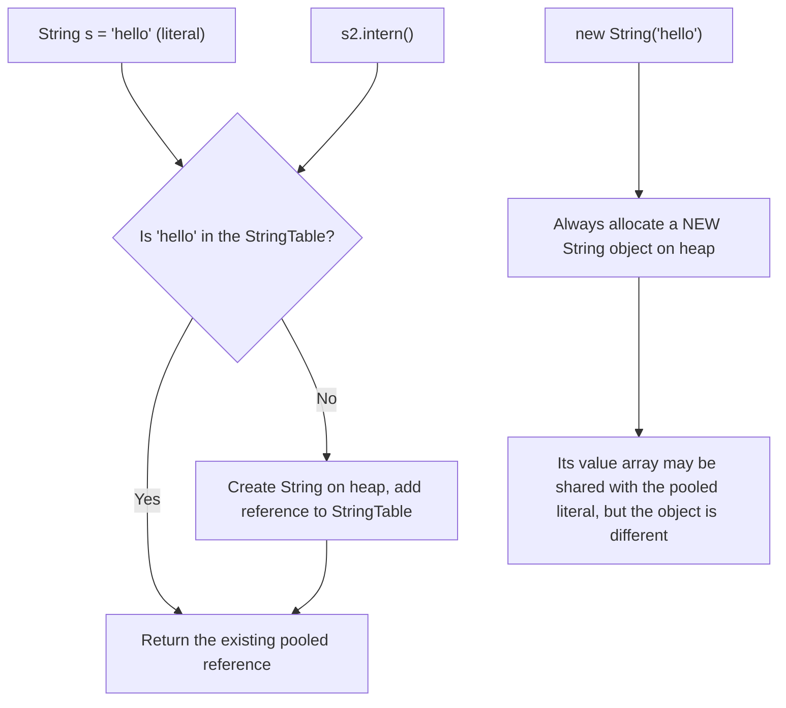
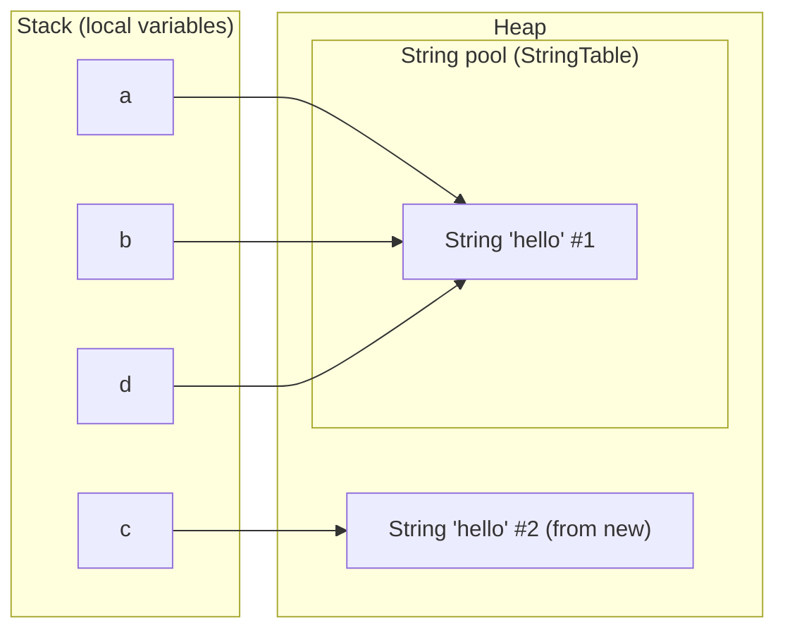
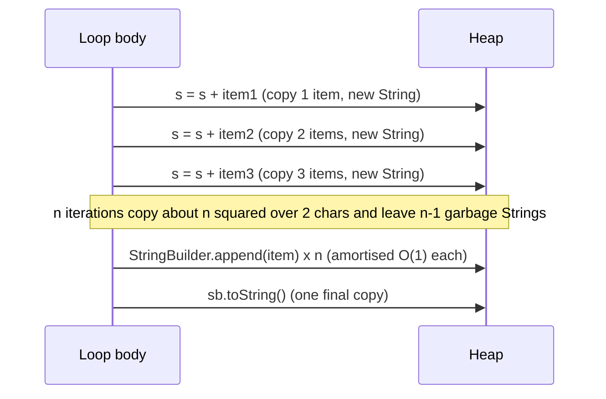

# String Internals (Pool, Immutability, StringBuilder)

!!! abstract "TL;DR"
    - A `String` is an **immutable** object wrapping a `byte[]` plus a `coder` flag (LATIN1 or UTF16) since **Java 9 Compact Strings (JEP 254)**. Before Java 9 it was a `char[]`.
    - **String literals** and compile-time constants are **interned** in the **string pool** (a JVM `StringTable` living on the **heap** since Java 7). `new String("x")` always creates a new object.
    - `==` compares **references**, `equals()` compares **content**. Interview code that "works" with `==` usually works only because both sides are pooled literals.
    - Immutability gives **thread safety, safe hash keys (cached `hashCode`), security and pooling**. The price is that every "modification" creates a new object.
    - `a + b` in one expression is fine (Java 9+ compiles it to **`invokedynamic` / `StringConcatFactory`, JEP 280**). Concatenation **inside a loop** is O(n²): use **`StringBuilder`** (not `StringBuffer`, which is synchronized).

## Why it matters

Strings are the most common object in almost every Java heap. JSON payloads, HTTP headers, Kafka keys, log lines, GraphQL field names, Mongo document keys: nearly all of it is text. Heap dumps of typical business services often show `byte[]` and `String` near the top of the histogram.

So the design decisions of `String` matter a lot:

- **Correctness:** `==` vs `equals()` is one of the oldest Java bugs, and it still slips through code review.
- **Performance:** string concatenation in a loop, careless `intern()`, or regex-heavy `split()`/`replaceAll()` on a hot path can dominate CPU and GC.
- **Security:** immutable strings are why class names, file paths and URLs are safe to pass around, and also why passwords are better held in `char[]`.

Interviewers use this topic to check whether you understand *what the JVM actually does*, not just the API. Expect output-prediction questions on `==`, followed by "why is String immutable?" and "what changed in Java 9?".

## Core concepts

### 1. What a String object looks like

Since Java 9 (JEP 254, Compact Strings), the key fields of `java.lang.String` are roughly:

```java
public final class String implements java.io.Serializable, Comparable<String>, CharSequence,
                                     Constable, ConstantDesc {
    private final byte[] value;   // the characters, encoded
    private final byte coder;     // LATIN1 = 0 (1 byte per char) or UTF16 = 1 (2 bytes per char)
    private int hash;             // cached hashCode, 0 until first computed
    private boolean hashIsZero;   // Java 13+: remembers "hash really is 0" so it is not recomputed
}
```

- If every character fits in ISO-8859-1 (Latin-1), each char takes **1 byte**. Otherwise the whole string uses UTF-16, **2 bytes per char**.
- Before Java 9, `value` was a `char[]`, so even plain ASCII used 2 bytes per char. JEP 254 roughly halves the memory of ASCII-heavy strings (most IDs, JSON keys, enum names).
- Compact Strings can be switched off with `-XX:-CompactStrings`, but there is rarely a reason to.
- The class is `final`, and `value` is `private final` and never exposed. That combination is what makes immutability real.

!!! tip "Java 6 vs Java 7u6 substring"
    Up to Java 7u6, `substring()` shared the parent's `char[]` with an offset and count. A tiny substring of a 10 MB string kept the whole 10 MB alive (a classic memory leak). Since 7u6, `substring()` **copies** the needed range. Interviewers still ask this.

### 2. Why String is immutable

Immutability is a deliberate design choice, not an accident. Each reason supports the others:

| Reason | Explanation |
|---|---|
| **String pool** | Pooling only works if a shared instance can never change. If `"ADMIN"` were mutable, one caller could change every other caller's `"ADMIN"`. |
| **Cached hashCode** | `hash` is computed once and reused. This makes `String` a fast, safe `HashMap` key. A mutable key would get "lost" in its bucket after a change. |
| **Thread safety** | Immutable objects with `final` fields are safely published under the Java Memory Model. Strings can be shared across threads with no locks. |
| **Security** | Class loading, file paths, URLs, DB connection strings and permission checks take `String` arguments. If the value could change after validation, an attacker could swap it (time-of-check vs time-of-use). |

For general immutability rules (final class, final fields, defensive copies), see [OOP principles, equals/hashCode, immutability](01-oop-principles-equals-hashcode-contract-immutability.md).

### 3. The string pool (StringTable)

The **string pool** is a JVM-wide hash table of canonical `String` instances. HotSpot calls it the `StringTable`.

- **Literals are pooled automatically.** Resolution is lazy: the first time an `ldc` instruction for a string constant executes (not at class-load time), the JVM looks it up in the `StringTable`. If found, it reuses the instance. If not, it adds one.
- **Compile-time constants are folded.** `"he" + "llo"` and `final String a = "he"; a + "llo"` are computed by `javac` and become the literal `"hello"`.
- **Runtime-built strings are NOT pooled.** `new String("hello")`, `sb.toString()`, `s1 + s2` with non-final variables, data read from a socket: all create new heap objects.
- **`intern()`** returns the canonical pooled instance, adding this string if no equal one exists.
- **Location:** Java 6 kept the pool in **PermGen** (fixed size, `OutOfMemoryError: PermGen space` was common with heavy `intern()`). **Java 7 moved it to the main heap**, so pooled strings are garbage-collected like other objects when unreferenced. Java 8 removed PermGen entirely (Metaspace holds class metadata, not strings).
- The table's bucket count is tunable with `-XX:StringTableSize`. Check pool stats with `jcmd <pid> VM.stringtable` or `-XX:+PrintStringTableStatistics`.


*Notice that only literals and `intern()` go through the pool lookup. `new String(...)` always skips it and creates a separate object, which is why `new String("hello") == "hello"` is `false`.*

### 4. `==` vs `equals()` in memory

```java
String a = "hello";               // pooled
String b = "hello";               // same pooled instance
String c = new String("hello");   // new heap object
String d = c.intern();            // returns the pooled instance

a == b;        // true  (same reference)
a == c;        // false (different objects)
a.equals(c);   // true  (same content)
a == d;        // true  (intern returned the pooled one)
```


*Notice that `a`, `b` and `d` point to one pooled object, while `c` points to a separate object with equal content. `==` checks the arrows; `equals()` checks the characters.*

`String.equals()` first checks `this == other` (fast path), then the `coder`, then compares the byte arrays. It is an intrinsic in HotSpot, so it is very fast.

### 5. How `+` concatenation compiles

- **Java 5–8:** `javac` turned `a + b + c` into `new StringBuilder().append(a).append(b).append(c).toString()`.
- **Java 9+ (JEP 280, Indify String Concatenation):** `javac` emits a single `invokedynamic` call bootstrapped by `java.lang.invoke.StringConcatFactory`. The JVM picks the concatenation strategy at runtime and can pre-size the result exactly. Libraries can improve concatenation without recompiling your code.

What has **not** changed: each `+=` in a loop is a *separate* expression. Every iteration creates a new `String` and copies all previous characters. For `n` iterations that is O(n²) character copying plus lots of garbage.


*Notice that the cost of `+=` grows with the length already built, while `StringBuilder` appends into one growing buffer and copies only when it resizes or at the final `toString()`.*

### 6. StringBuilder vs StringBuffer

Both extend `AbstractStringBuilder`, which holds a mutable `byte[] value`, a `coder` and a `count`.

- **Default capacity is 16.** `new StringBuilder(String s)` starts at `s.length() + 16`.
- When full, it grows to roughly **`(oldCapacity * 2) + 2`** (or the needed size if larger) and copies the array. Pre-sizing with `new StringBuilder(expectedLength)` avoids repeated copies.
- It starts in LATIN1 and **inflates to UTF16** the first time a non-Latin-1 char is appended.
- `StringBuffer` has the same API but every method is `synchronized`. It dates from Java 1.0. `StringBuilder` (Java 5) is the default choice; a builder is almost always a local variable, so locking adds cost with no benefit.
- `StringBuilder` does **not** override `equals()`/`hashCode()`. Two builders with the same content are not equal. Since Java 11 it implements `Comparable<StringBuilder>`, and you can compare content with `sb1.compareTo(sb2) == 0` or `CharSequence.compare(...)`.

### 7. Useful modern String APIs

| Version | API |
|---|---|
| Java 8 | `String.join`, `StringJoiner`, `chars()` |
| Java 11 | `isBlank()`, `strip()` (Unicode-aware, unlike `trim()`), `lines()`, `repeat(n)` |
| Java 12 | `indent()`, `transform()` |
| Java 15 | Text blocks (`"""`), `formatted()`, `stripIndent()`, `translateEscapes()` |
| Java 21 | `StringBuilder.repeat()`, `String.indexOf(ch, from, to)`, `splitWithDelimiters()` |

Text blocks are covered in [Modern Java 9–25](08-modern-java-9-25-records-sealed-classes-pattern-matching-swi.md).

!!! warning "String Templates were removed"
    String Templates (`STR."Hello \{name}"`) were a preview in Java 21 and 22 (JEP 430, JEP 459) but were **withdrawn in Java 23**. They are not in Java 25. If an interviewer mentions them, say they were previewed and then dropped for redesign.

### 8. GC-level deduplication vs interning

`intern()` makes *String objects* canonical, and you must call it yourself. **String Deduplication** (JEP 192, `-XX:+UseStringDeduplication`) is a GC feature: the collector finds `String` objects with equal content and makes them share **one `value` array**. The `String` objects stay distinct, so `==` is unchanged. It started with G1 (Java 8u20); newer JDKs (18+) support it in the other HotSpot collectors too. It helps services that hold many duplicate strings in long-lived data (caches, parsed payloads) with zero code changes.

## In practice: code & configuration

### Building text in a loop

=== "❌ Common mistake"
    ```java
    // Builds a CSV export of 50k claim rows
    String csv = "";
    for (Claim c : claims) {
        csv += c.id() + "," + c.memberId() + "," + c.amount() + "\n"; // new String every iteration, O(n^2) copying
    }
    return csv;
    ```

=== "✅ Correct approach"
    ```java
    // Pre-size: rough estimate avoids repeated array growth
    var sb = new StringBuilder(claims.size() * 48);
    for (Claim c : claims) {
        sb.append(c.id()).append(',')           // append char, not ",": no extra String
          .append(c.memberId()).append(',')
          .append(c.amount()).append('\n');
    }
    return sb.toString();                        // one final copy

    // Or, when you just join values, let the library do it:
    String header = String.join(",", List.of("id", "memberId", "amount"));
    String ids = claims.stream().map(c -> String.valueOf(c.id()))   // joining needs CharSequence elements
                       .collect(Collectors.joining(",", "[", "]"));
    ```

### Comparing strings

=== "❌ Common mistake"
    ```java
    if (request.getHeader("X-Channel") == "MOBILE") {   // reference comparison: false for runtime strings
        applyMobileRules();
    }
    if (status.equals("ACTIVE")) { ... }               // NPE if status is null
    ```

=== "✅ Correct approach"
    ```java
    if ("MOBILE".equals(request.getHeader("X-Channel"))) {   // content comparison, null-safe
        applyMobileRules();
    }
    if (Objects.equals(status, "ACTIVE")) { ... }           // null-safe on both sides
    if ("active".equalsIgnoreCase(status)) { ... }          // case-insensitive compare, no toLowerCase() copy
    // Better still: parse to an enum once at the boundary and compare enums with ==
    ```

### Bounded interning of repeated values

Interning is useful when you hold **millions** of strings drawn from a **small set** of values (country codes, status codes, plan IDs). Prefer your own map over `String.intern()` so you control size and lifetime:

```java
/** Canonicalises low-cardinality values parsed from upstream payloads to save heap. */
public final class Canonicalizer {
    private static final int MAX = 10_000;                       // guardrail against unbounded growth
    private final ConcurrentHashMap<String, String> pool = new ConcurrentHashMap<>();

    public String canonical(String s) {
        if (s == null || pool.size() >= MAX) return s;           // stop pooling instead of leaking
        String existing = pool.putIfAbsent(s, s);
        return existing != null ? existing : s;
    }
}
```

### Sensitive data: prefer `char[]` and clear it

```java
char[] password = console.readPassword("Password: ");   // Console returns char[], not String
try {
    authenticate(username, password);
} finally {
    Arrays.fill(password, '\0');                         // wipe it; a String cannot be wiped
}
```

A `String` holding a secret stays in memory until GC reclaims it, and you cannot overwrite it. It may also end up in logs or heap dumps. This is why `JPasswordField.getPassword()`, `Console.readPassword()` and `KeyStore` APIs use `char[]`. In practice, frameworks often hand you a `String` anyway; the bigger wins are never logging secrets and keeping them out of `toString()`.

## Real-world usage

- **Heap tuning in large JVM services:** String Deduplication (JEP 192) was introduced because heap analysis showed a large share of live data in typical Java applications is strings, with many duplicates. Teams running large caches or in-memory read models enable it on G1 and verify the saving with GC logs.
- **Hash-flooding DoS (2011):** researchers showed (oCERT-2011-003, presented at 28C3) that attackers could send many POST parameters whose `String.hashCode()` values collide, turning web-server parameter maps into long linked lists and pinning the CPU. Java 7u6 added an opt-in alternative String hash for hash-based maps (`jdk.map.althashing.threshold`) as a stopgap; the long-term fix was in Java 8 (JEP 180): `HashMap` turns long buckets into balanced trees (see [HashMap & ConcurrentHashMap internals](04-hashmap-and-concurrenthashmap-internals.md)). The lesson: `String.hashCode()` is deterministic and public, so never trust it to spread attacker-controlled keys.
- **Logging cost:** `log.debug("Member " + id + " loaded " + data)` builds the string even when DEBUG is off. SLF4J placeholders (`log.debug("Member {} loaded {}", id, data)`) defer formatting, which matters on hot paths.
- **Healthcare and banking:** member IDs, NPI numbers, account numbers and tokens are strings. PII/PHI and card data must not leak via `toString()`, exception messages or logs (HIPAA, PCI DSS). Use masking helpers, override `toString()` on records that hold sensitive fields, and keep secrets out of long-lived `String`s where you can.
- **Unicode correctness:** `length()` counts UTF-16 code units, not user-visible characters. Names with emoji or some scripts contain surrogate pairs, so truncating with `substring(0, n)` can split a character. Use `codePointCount`/`offsetByCodePoints` for user-facing limits.

## Trade-offs & production gotchas

| Option | Pros | Cons | Use when |
|---|---|---|---|
| `+` / `+=` in one expression | Readable; Java 9+ `invokedynamic` is well optimised | Quadratic inside loops | Single-line concatenation |
| `StringBuilder` | Mutable, fast, amortised O(1) append | Not thread-safe; no content `equals()` | Loops, building large text |
| `StringBuffer` | Synchronized methods | Locking overhead; legacy | Almost never (legacy APIs only) |
| `String.join` / `Collectors.joining` / `StringJoiner` | Clear intent, handles delimiters | Slight overhead vs hand-written builder | Joining collections |
| `String.format` / `formatted()` | Readable templates | Parses the format string each call; slow on hot paths | Messages, not tight loops |
| `String.intern()` | Saves heap for many duplicates; enables `==` | Global table, lookup cost, easy to misuse | Rarely; prefer a bounded map or GC dedup |
| GC String Deduplication | No code change, shares arrays | Small GC CPU overhead; objects stay distinct | Large heaps with many duplicate strings |

!!! warning "Gotchas"
    - **`==` "works" in tests** because both sides are literals, then fails in production when one side comes from a request, DB or Kafka message.
    - **`split()` takes a regex.** `"a.b".split(".")` returns an empty array because `.` matches everything. Use `split("\\.")` or `Pattern.quote(".")`. Trailing empty strings are removed unless you pass a negative limit.
    - **`replaceAll()` is also regex**; `replace()` is literal (and still replaces all occurrences).
    - **`toUpperCase()`/`toLowerCase()` are locale-sensitive.** In the Turkish locale, `"title".toUpperCase()` gives a dotted `İ`. Use `Locale.ROOT` for protocol values, keys and enum lookups.
    - **`trim()` vs `strip()`:** `trim()` removes chars `<= ' '`; `strip()` removes Unicode whitespace.
    - **Unbounded `intern()`** on user input (header values, IDs) grows the StringTable and adds lookup cost. Pooled strings can be collected on modern JVMs, but you still pay for the table.
    - **Pattern compilation:** `String.matches()` compiles a new `Pattern` every call. On a hot path, keep a `static final Pattern`.
    - **Sensitive values in `String`** cannot be wiped and may show up in heap dumps.

## How this connects to my experience

String internals are not a resume line, so position this as a deep fundamental you apply in day-to-day backend and review work.

- **Where I used it:**
    - **OptumRx GraphQL Consumer Service** (integration layer between 5 upstream systems): large volumes of JSON text, field names and IDs pass through every request. Natural places for string-handling care are payload mapping, cache keys for the **Redis caching** of queries and reference data, and Kafka message keys. *[confirm which of these you actually tuned]*
    - **Code reviews and mentoring 5+ engineers:** `==` on strings, `+=` in loops, `split(".")`, and logging PHI in string concatenation are typical review catches. *[confirm examples you remember]*
    - **CipherTrust CCKM (Coriolis Technologies) and JWT/SSO work (Johnson Controls, Metasys):** key material and credentials are a real reason to prefer `char[]`/`byte[]` over `String` and to clear buffers after use. *[confirm whether you handled secrets this way]*
- **Talking points:**
    - Cache keys: build Redis keys with one clear format (e.g. `"member:" + id + ":plans"` in a single expression is fine; avoid building them in loops or with `String.format` on hot paths). *[confirm]*
    - PHI safety: masking in `toString()` and log statements for a healthcare app serving 750K+ users. *[confirm you actually implemented masking]*
    - Heap analysis: if you ever looked at a heap dump, mention `byte[]`/`String` dominating and the options (dedup, canonicalising, smaller DTOs). *[confirm]*
- **Likely follow-up chain:** "Why is String immutable?" → "Where is the pool and is it GC'd?" → "Would you use `intern()` in production?" → "How did Java 9 change String?". Answer with the four reasons, heap since Java 7, "rarely, I prefer a bounded map or G1 dedup", then Compact Strings plus `invokedynamic` concatenation.

## Interview questions

### Fundamentals

??? question "Q1. Why is String immutable in Java?"
    **Answer:** Four linked reasons:

    1. The string pool can safely share instances.
    2. The `hashCode` can be cached, which makes Strings fast and safe `HashMap` keys.
    3. Immutable objects are thread-safe without locks.
    4. Security, because values like class names, paths and URLs cannot change after validation.

    It is enforced by a `final` class with a `private final` array that is never exposed.

    **Interviewer listens for:** Pool + hash caching + thread safety + security, and how immutability is enforced.

    **Common wrong answer:** "Because the `value` field is final." A final reference to an array does not stop the array contents changing; the real guarantee is that the array is private, never leaked, and never modified.

??? question "Q2. Predict the output."
    ```java
    String s1 = "java";
    String s2 = "ja" + "va";
    String s3 = "ja";
    String s4 = s3 + "va";
    String s5 = new String("java");
    System.out.println(s1 == s2);
    System.out.println(s1 == s4);
    System.out.println(s1 == s5);
    System.out.println(s1 == s4.intern());
    System.out.println(s1.equals(s5));
    ```
    **Answer:** `true`, `false`, `false`, `true`, `true`. `"ja" + "va"` is a compile-time constant folded to `"java"` (pooled). `s3 + "va"` uses a non-final variable, so it is built at runtime as a new object. `new String` is always a new object. `intern()` returns the pooled `"java"`.

    **Interviewer listens for:** Compile-time constant folding vs runtime concatenation.

    **Common wrong answer:** `s1 == s4` is true "because the content is the same".

??? question "Q3. What changes if s3 is declared `final String s3 = \"ja\";`?"
    **Answer:** `s1 == s4` becomes `true`. A `final` local initialised with a constant is a *constant variable*, so `s3 + "va"` is a constant expression folded by `javac` into the literal `"java"`.

    **Interviewer listens for:** Knowing the JLS "constant expression" rule, not just memorised outputs.

    **Common wrong answer:** "Still false, because concatenation always creates a new String."

??? question "Q4. How many objects does `String s = new String(\"hello\");` create?"
    **Answer:** Up to two. The literal `"hello"` is placed in the pool when the constant is resolved (if not already there), and `new` creates one more `String` object on the heap. If `"hello"` is already pooled, only one new object is created by this line. (Its internal byte array may be shared with the literal.)

    **Common wrong answer:** "Always exactly two" or "one", without explaining the pool lookup.

    **Interviewer listens for:** the literal in the pool plus one heap object, already-pooled case.

??? question "Q5. StringBuilder vs StringBuffer vs String?"
    **Answer:** `String` is immutable. `StringBuilder` is mutable and not synchronized (default choice for building text). `StringBuffer` is mutable with synchronized methods (legacy, Java 1.0). Because builders are almost always local variables, synchronization adds cost without benefit.

    **Interviewer listens for:** Thread-safety reasoning, and that `StringBuffer` is rarely the right answer.

    **Common wrong answer:** "StringBuffer is faster because it is thread-safe." Synchronisation only adds cost.

### Intermediate

??? question "Q6. Where does the string pool live, and can pooled strings be garbage collected?"
    **Answer:** In HotSpot it is the `StringTable`. In Java 6 interned strings lived in PermGen. Since Java 7 they live on the regular heap, and unreferenced interned strings can be collected. Java 8 removed PermGen altogether (Metaspace holds class metadata). The table size is tunable with `-XX:StringTableSize`.

    **Common wrong answer:** "In Metaspace" or "in PermGen" for modern Java.

    **Interviewer listens for:** heap since Java 7, collectable, PermGen gone in 8.

??? question "Q7. Is `s += x` in a loop still bad in Java 9+, given invokedynamic concatenation?"
    **Answer:** Yes. JEP 280 optimises *each concatenation expression* (better strategies, exact pre-sizing), but each loop iteration is still a separate expression that creates a new `String` and copies everything built so far. That is O(n²). Use one `StringBuilder` across the loop, or `Collectors.joining`.

    **Interviewer listens for:** Distinguishing per-expression optimisation from algorithmic complexity.

    **Common wrong answer:** "Java 9+ optimises it away, so it is fine now."

??? question "Q8. What are Compact Strings?"
    **Answer:** JEP 254 (Java 9) changed `String`'s storage from `char[]` to `byte[]` plus a `coder` byte. Latin-1-only strings use 1 byte per char, others use UTF-16 (2 bytes per char). This roughly halves memory for ASCII-heavy strings with no API change. `-XX:-CompactStrings` disables it.

    **Interviewer listens for:** byte[] + coder, Latin-1 vs UTF-16, memory saving with no API change.

    **Common wrong answer:** "Strings now use UTF-8 internally." They use Latin-1 or UTF-16.

??? question "Q9. Why is `char[]` preferred over `String` for passwords?"
    **Answer:** A `String` is immutable and may stay in memory until GC, possibly copied around, and can appear in heap dumps or logs. A `char[]` can be overwritten with `Arrays.fill` right after use. That is why `Console.readPassword()` and `JPasswordField.getPassword()` return `char[]`.

    **Common wrong answer:** "Strings are stored in the pool forever." Only literals and interned strings are pooled; the real point is that you cannot wipe a `String`.

    **Interviewer listens for:** overwriting a char[] after use, Strings linger and leak in dumps.

??? question "Q10. Predict the output: `\"a.b.c\".split(\".\").length` and `\"a,b,,\".split(\",\").length`."
    **Answer:** `0` and `2`. `split` takes a regex; `.` matches every char, so all tokens are empty and trailing empties are removed. In the second case the two trailing empty strings are removed too. Use `split("\\.")` and `split(",", -1)` (negative limit keeps trailing empties, giving 4).

    **Interviewer listens for:** split takes a regex, trailing empties removed, limit -1.

    **Common wrong answer:** "3 and 4."

### Senior

??? question "Q11. Would you use `String.intern()` in production? What are the alternatives?"
    **Answer:** Rarely. It helps only when you keep many long-lived duplicates of a small set of values. Costs: a global native hash table shared by the whole JVM, lookup cost on every call, and unbounded growth if fed user input. Alternatives:

    1. Parse to enums or small value types at the boundary.
    2. A bounded `ConcurrentHashMap` canonicaliser you control.
    3. G1/GC String Deduplication (`-XX:+UseStringDeduplication`), which shares backing arrays with no code changes.

    Measure with a heap dump first.

    **Interviewer listens for:** Measure-first mindset and knowing GC dedup vs interning (dedup does not make `==` true).

    **Common wrong answer:** "Intern every repeated String to save memory." Unbounded input fills a JVM-wide table.

??? question "Q12. How does String.hashCode() work, and why is it cached?"
    **Answer:** `s[0]*31^(n-1) + s[1]*31^(n-2) + ... + s[n-1]`, computed lazily and stored in the `hash` field. Since Java 13 a `hashIsZero` flag avoids recomputing when the real hash is 0. Caching is only safe because the string is immutable. The algorithm is specified in the Javadoc, so it is deterministic and predictable, which enabled hash-flooding attacks before Java 8's tree bins in `HashMap`.

    **Interviewer listens for:** Linking immutability to hash caching, and awareness of collision attacks.

    **Common wrong answer:** "hashCode is random or based on memory address." For String it is a fixed, specified formula.

??? question "Q13. How does `switch` on a String work under the hood?"
    **Answer:** `javac` compiles it to a `switch` on `hashCode()` and then `equals()` checks inside each hash case (to handle collisions), mapping to an index, followed by a second `switch` on that index. A null selector throws `NullPointerException` unless you use a Java 21 pattern switch with `case null`.

    **Interviewer listens for:** hashCode switch then equals, NPE on null without case null.

    **Common wrong answer:** "It compares with equals against every case in order."

??? question "Q14. What did Java 9's indy string concatenation (JEP 280) change, and why?"
    **Answer:** Before, `javac` hard-coded a `StringBuilder` chain into bytecode, so improvements needed recompilation and the builder was often under-sized. Now `javac` emits an `invokedynamic` call bootstrapped by `StringConcatFactory`, and the JVM chooses the strategy at link time (for example, computing the exact length and filling one array). Libraries can improve concatenation without changing your bytecode.

    **Interviewer listens for:** invokedynamic + StringConcatFactory, JVM-chosen strategy without recompiling.

    **Common wrong answer:** "It made concatenation in loops efficient."

### Scenario-based

??? question "Q15. A heap dump of your service shows `byte[]` and `String` using 40% of heap. What do you do?"
    **Answer:** First find *who* holds them (dominator tree, paths to GC roots in Eclipse MAT or similar). Typical causes: oversized caches of raw JSON, duplicate reference data per entry, retained request payloads, large log buffers. Fixes in order: stop holding what you don't need (map to compact DTOs, cache parsed objects not raw text, set cache size limits), canonicalise low-cardinality values (enums or bounded map), enable `-XX:+UseStringDeduplication` and verify with GC logs. Check that Compact Strings is not disabled.

    **Interviewer listens for:** Diagnose before tuning; MAT dominator tree; cache sizing; dedup as a cheap win.

    **Common wrong answer:** "Increase -Xmx." That delays the problem without finding who holds the data.

??? question "Q16. An auth check `if (role == \"ADMIN\")` passed all tests but fails in production. Why?"
    **Answer:** In tests the role came from a literal, so both sides were the same pooled instance. In production it comes from a JWT claim or DB, which is a runtime-created `String`, so `==` compares different references. Fix with `"ADMIN".equals(role)` or, better, map the role to an enum once at the boundary. Add a static-analysis rule (SpotBugs `ES_COMPARING_STRINGS_WITH_EQ`, Sonar) to catch it in review.

    **Interviewer listens for:** literal pooling hides the bug in tests, runtime Strings differ, equals or enums.

    **Common wrong answer:** "Production has a different JVM bug."

??? question "Q17. A service generating large CSV reports gets slow and GC-heavy as row counts grow. What do you suspect?"
    **Answer:** `+=` concatenation in a loop (quadratic copying and garbage), or building the whole report in memory. Fix: a pre-sized `StringBuilder`, or better, stream rows directly to the output (`Writer`/`OutputStream` or a streaming response) so memory stays flat regardless of size. Confirm with a profiler (allocation flame graph via JFR or async-profiler).

    **Interviewer listens for:** quadratic concatenation, whole report in memory, streaming output.

    **Common wrong answer:** "Increase heap and give the GC more threads."

??? question "Q18. In one environment, enum lookups like `Status.valueOf(code.toUpperCase())` fail for codes containing 'i'. Why?"
    **Answer:** `toUpperCase()` with no argument uses the default locale. Under a Turkish locale, `i` becomes dotted `İ`, so `"active".toUpperCase()` is not `"ACTIVE"`. Use `toUpperCase(Locale.ROOT)` for protocol and identifier values.

    **Interviewer listens for:** Locale sensitivity of case conversion; using `Locale.ROOT` for machine values.

    **Common wrong answer:** "The codes in that environment are corrupt." The cause is the default locale.

## Cheat sheet

| Concept | Remember |
|---|---|
| Storage (Java 9+) | `byte[] value` + `coder` (LATIN1/UTF16), JEP 254 |
| Immutability why | Pool, cached hash, thread safety, security |
| Pool location | Heap since Java 7 (`StringTable`); GC-able |
| Pooled automatically | Literals and compile-time constants only |
| `new String("x")` | Always a new object; `== "x"` is false |
| `intern()` | Returns canonical instance; use rarely |
| `==` vs `equals` | Reference vs content; use `"LIT".equals(x)` |
| `+` concatenation | Java 9+ `invokedynamic` (JEP 280); fine outside loops |
| Loops | `StringBuilder` (capacity 16, grows ~2x+2); pre-size |
| `StringBuffer` | Synchronized, legacy |
| `split` / `replaceAll` | Regex; `replace` is literal |
| Case conversion | Use `Locale.ROOT` for keys |
| Secrets | `char[]` + `Arrays.fill`, never log |
| GC dedup | `-XX:+UseStringDeduplication`, shares arrays, `==` unchanged |
| String Templates | Previewed in 21/22, withdrawn in 23 |

## Sources

1. [JEP 254: Compact Strings](https://openjdk.org/jeps/254): `byte[]` + coder storage in Java 9.
2. [JEP 280: Indify String Concatenation](https://openjdk.org/jeps/280): `invokedynamic` / `StringConcatFactory` for `+`.
3. [JEP 192: String Deduplication in G1](https://openjdk.org/jeps/192): GC-level deduplication of backing arrays.
4. [java.lang.String Javadoc (Java 25)](https://docs.oracle.com/en/java/javase/25/docs/api/java.base/java/lang/String.html): `intern()`, `hashCode()` formula, `split`, `strip`, and other API behaviour.
5. [java.lang.StringBuilder Javadoc (Java 25)](https://docs.oracle.com/en/java/javase/25/docs/api/java.base/java/lang/StringBuilder.html): capacity, thread-safety note vs `StringBuffer`.
6. [JLS §15.29 Constant Expressions](https://docs.oracle.com/javase/specs/jls/se21/html/jls-15.html#jls-15.29) and [JLS §3.10.5 String Literals](https://docs.oracle.com/javase/specs/jls/se21/html/jls-3.html#jls-3.10.5): which strings are interned and folded.
7. [JDK-6962931: move interned strings out of the perm gen](https://bugs.openjdk.org/browse/JDK-6962931): pool moved to the heap in Java 7.
8. [JEP 465: String Templates (Third Preview)](https://openjdk.org/jeps/465): the feature's history; it was withdrawn before Java 23.
