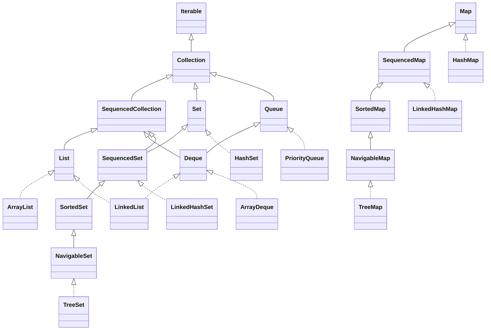
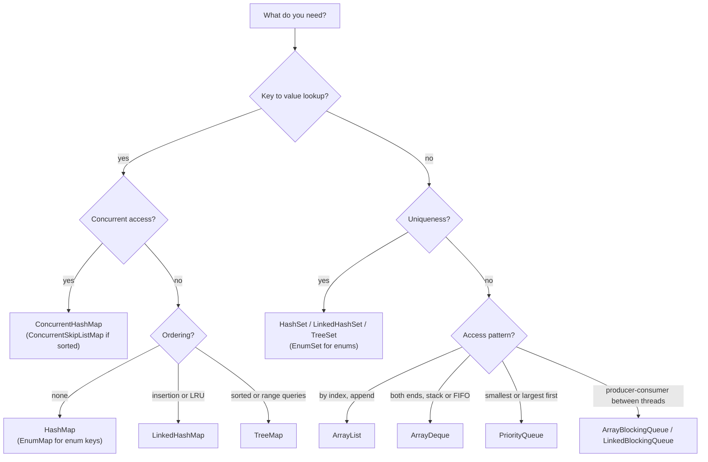

# Collections Framework (List/Set/Map/Queue Implementations and Complexity)

!!! abstract "TL;DR"
    - The framework is **interfaces first**: `Collection` → `List`, `Set`, `Queue`/`Deque`, plus the separate `Map` hierarchy. Java 21 added **`SequencedCollection` / `SequencedSet` / `SequencedMap` (JEP 431)** for anything with a defined encounter order (`getFirst()`, `getLast()`, `reversed()`).
    - **Default picks:** `ArrayList` (list), `HashMap`/`HashSet` (lookup), `ArrayDeque` (stack and queue), `LinkedHashMap` (insertion order or LRU), `TreeMap` (sorted/range queries), `PriorityQueue` (top-K, scheduling).
    - **Complexity to remember:** `ArrayList.get` O(1), add at end amortised O(1), insert/remove in the middle O(n). `HashMap` get/put O(1) average (O(log n) worst case per bucket once treeified, Java 8+). `TreeMap` O(log n). `PriorityQueue` offer/poll O(log n), peek O(1).
    - `LinkedList` is almost never the right answer: O(n) indexed access, poor cache locality, and a 24-byte node per element. Use `ArrayDeque` for queue/stack work.
    - `List.of`/`Set.of`/`Map.of` (Java 9+) are **truly immutable and null-hostile**. `Collections.unmodifiableList` is only a **read-only view**. Iterators of standard collections are **fail-fast** (`ConcurrentModificationException`), the concurrent ones are **weakly consistent**.

## Why it matters

Almost every line of business code moves data through a collection: a list of prescriptions from an upstream API, a map of reference data cached in memory, a set of IDs to batch-load, a queue of retries. Choosing the wrong implementation rarely breaks a unit test. It shows up later as:

- **Latency spikes:** `list.contains(x)` inside a loop over another list is O(n·m). With 10,000 × 10,000 items that is 100 million comparisons on a request thread.
- **Memory bloat:** a `LinkedList<Long>` of a million elements costs roughly twice the heap of an `ArrayList<Long>` (a 24-byte node per element on top of the boxed `Long`) and about five times a plain `long[]`.
- **Production exceptions:** `UnsupportedOperationException` from `Arrays.asList(...).add()` or `List.of(...).add()`, `ConcurrentModificationException` from removing inside a for-each loop, `NullPointerException` from `Map.of("k", null)`.
- **Concurrency bugs:** a plain `HashMap` shared across threads can lose updates or corrupt its internal state.

Before Java 1.2 there were essentially only `Vector` (with `Stack`), `Hashtable` and arrays, all with ad-hoc APIs and synchronization on every call. The Collections Framework (Java 1.2, designed by Joshua Bloch) introduced a small set of interfaces, multiple implementations behind each, and shared algorithms in `Collections`. Later releases added generics (Java 5), `java.util.concurrent` (Java 5), streams and default methods (Java 8), immutable factories (Java 9), and sequenced collections (Java 21).

Interviewers use this subtopic to check two things: do you know the **cost model** of what you type, and can you **justify a choice** under real constraints (ordering, concurrency, memory, nulls).

## Core concepts

### 1. The interface hierarchy


*Notice that `Map` is not a `Collection`, and that since Java 21 `List`, `Deque`, `LinkedHashSet`, `TreeSet`, `LinkedHashMap` and `TreeMap` all share the "sequenced" contract, while `HashSet`, `HashMap` and `PriorityQueue` do not (they have no defined encounter order).*

Key ideas:

- **Program to the interface.** Declare `List<Order> orders = new ArrayList<>();` so you can swap the implementation without touching callers.
- **`Map` is separate** because its unit is a key-value pair, not an element. You get collection views of it: `keySet()`, `values()`, `entrySet()`.
- **Sequenced collections (Java 21, JEP 431)** fixed a long-standing gap. Before, "get the last element" was `list.get(list.size() - 1)`, `deque.getLast()`, `sortedSet.last()` or iterating a `LinkedHashSet` to the end. Now they all share `getFirst()`, `getLast()`, `addFirst()`, `addLast()`, `removeFirst()`, `removeLast()` and `reversed()` (a view, not a copy). `SequencedMap` adds `firstEntry()`, `lastEntry()`, `pollFirstEntry()`, `putFirst()`, `putLast()`.

### 2. List implementations

**`ArrayList`**: a resizable array (`Object[] elementData`) plus a `size`.

- `get(i)`/`set(i, x)`: O(1), a direct array index.
- `add(x)` at the end: **amortised O(1)**. When full, it grows to about **1.5×** (`newCapacity = old + (old >> 1)`) and copies with `Arrays.copyOf` (an O(n) step that happens rarely enough to average out).
- `add(i, x)`/`remove(i)` in the middle: O(n), because `System.arraycopy` shifts the tail. Removing from the end is O(1).
- `contains`/`indexOf`: O(n) linear scan using `equals()`.
- `new ArrayList<>()` starts with a shared empty array and allocates capacity 10 on the first `add` (lazy allocation arrived in a late Java 7 update and is the behaviour in Java 8+). Pass an initial capacity when you know the size.
- `trimToSize()` gives back unused capacity; it never shrinks on its own.

**`LinkedList`**: a doubly linked list of `Node{item, next, prev}`. It implements both `List` and `Deque`.

- Add/remove at either end: O(1).
- `get(i)`: O(n). It walks from whichever end is closer, but that is still linear.
- "O(1) insert in the middle" is only true if you already hold a `ListIterator` at that position. Finding the position is O(n).
- Each element costs a node object (header + 3 references) in addition to the element. Nodes are scattered across the heap, so iteration has poor CPU cache locality compared with a contiguous array.

**`Vector`/`Stack`**: legacy, synchronized on every method. Do not use them in new code. `Stack` extends `Vector`, so it even exposes `get(i)` and `add(i, x)` which break stack semantics. Use `ArrayDeque`.

**`CopyOnWriteArrayList`** (`java.util.concurrent`): every write copies the whole array, reads are lock-free and iterators see a snapshot. Great for read-mostly lists such as listener registries; terrible for write-heavy lists.

### 3. Set implementations

A `Set` is a collection with no duplicates, where "duplicate" is defined by `equals()`/`hashCode()` (hash sets) or by `compareTo()`/`Comparator` (sorted sets). See [OOP, equals/hashCode & immutability](01-oop-principles-equals-hashcode-contract-immutability.md) for the contract.

| Implementation | Backed by | Order | add/contains/remove | Nulls |
|---|---|---|---|---|
| `HashSet` | a `HashMap` (elements are keys, a dummy `PRESENT` object is the value) | none | O(1) average | one null |
| `LinkedHashSet` | `LinkedHashMap` | insertion order | O(1) average | one null |
| `TreeSet` | `TreeMap` (red-black tree) | sorted | O(log n) | no (natural ordering throws NPE) |
| `EnumSet` | a bit vector (`long` or `long[]`) | enum declaration order | O(1), very fast | no |
| `ConcurrentSkipListSet` | skip list | sorted, thread-safe | O(log n) average | no |
| `CopyOnWriteArraySet` | `CopyOnWriteArrayList` | insertion | O(n) | yes |

`TreeSet`/`TreeMap` also give you **navigation**: `floor`, `ceiling`, `higher`, `lower`, `headSet`, `tailSet`, `subSet`. That is the reason to choose them, not just "sorted output".

### 4. Map implementations

| Implementation | Structure | Order | get/put | Notes |
|---|---|---|---|---|
| `HashMap` | array of buckets, linked nodes, red-black tree bins when a bucket's chain grows past `TREEIFY_THRESHOLD` = 8 nodes (and table size ≥ 64) | none | O(1) average | one null key, null values allowed |
| `LinkedHashMap` | `HashMap` + doubly linked list through entries | insertion or **access** order | O(1) average | `removeEldestEntry` → simple LRU cache |
| `TreeMap` | red-black tree | sorted by key | O(log n) | `NavigableMap` range queries |
| `EnumMap` | array indexed by `ordinal()` | enum order | O(1) | compact and fast for enum keys |
| `IdentityHashMap` | open addressing, uses `==` and `System.identityHashCode` | none | O(1) | deliberately breaks the `Map` contract; for graph traversal, serialization |
| `WeakHashMap` | keys held by weak references | none | O(1) | entries vanish when the key is no longer strongly reachable |
| `ConcurrentHashMap` | CAS + per-bin locking | none | O(1) average | thread-safe, **no null keys or values** |
| `ConcurrentSkipListMap` | skip list | sorted | O(log n) | thread-safe sorted map |
| `Hashtable` | legacy, synchronized | none | O(1) | do not use |

The bucket layout, hashing, resizing and treeification of `HashMap`, and the CAS design of `ConcurrentHashMap`, are covered in depth on [HashMap & ConcurrentHashMap internals](04-hashmap-and-concurrenthashmap-internals.md).

### 5. Queue and Deque implementations

The `Queue` API comes in two flavours, which interviewers love to ask about:

| Operation | Throws on failure | Returns special value |
|---|---|---|
| Insert | `add(e)` | `offer(e)` → `false` |
| Remove head | `remove()` | `poll()` → `null` |
| Examine head | `element()` | `peek()` → `null` |

- **`ArrayDeque`**: a circular array with `head` and `tail` indices. O(1) amortised at both ends. No nulls (because `null` is the "empty" signal of `poll()`). It is the recommended stack *and* FIFO queue; the Javadoc says it is likely faster than `Stack` as a stack and faster than `LinkedList` as a queue.
- **`PriorityQueue`**: a binary min-heap in an array. `offer`/`poll` O(log n), `peek` O(1), `remove(Object)`/`contains` O(n). Ordering by natural order or a `Comparator`. **Its iterator is not in priority order**; only repeated `poll()` gives sorted output.
- **Blocking queues** (`java.util.concurrent`): `ArrayBlockingQueue` (bounded, one lock), `LinkedBlockingQueue` (optionally bounded, separate put/take locks), `PriorityBlockingQueue`, `DelayQueue`, `SynchronousQueue` (no capacity, a hand-off). These back `ThreadPoolExecutor`. Add `put`/`take` (block) and `offer(e, timeout)`/`poll(timeout)`.
- **`ConcurrentLinkedQueue`/`ConcurrentLinkedDeque`**: non-blocking, CAS-based, unbounded.


*Notice that `LinkedList` does not appear: for every access pattern there is a better-performing default, and the real decision drivers are lookup vs sequence, ordering and concurrency.*

### 6. Complexity summary

| Operation | ArrayList | LinkedList | HashMap/HashSet | LinkedHashMap | TreeMap/TreeSet | ArrayDeque | PriorityQueue |
|---|---|---|---|---|---|---|---|
| get by index | O(1) | O(n) | – | – | – | – | – |
| get/contains by key or value | O(n) | O(n) | O(1) avg | O(1) avg | O(log n) | O(n) | O(n) |
| add at end / put / offer | O(1) amortised | O(1) | O(1) avg | O(1) avg | O(log n) | O(1) amortised | O(log n) |
| add/remove at front | O(n) | O(1) | – | – | – | O(1) | poll O(log n) |
| remove in middle | O(n) | O(n) to find + O(1) unlink | O(1) avg | O(1) avg | O(log n) | O(n) | O(n) |
| iteration order | index | index | unspecified | insertion/access | sorted | head to tail | heap order (not sorted) |

"O(1) average" for hash structures assumes a good `hashCode()` spread. With a terrible `hashCode()` (say, every key returns 42) Java 8+ degrades a bucket to a red-black tree, so lookups become O(log n) if keys are `Comparable`, otherwise worse.

### 7. Iteration, fail-fast and views

- **Fail-fast iterators.** `ArrayList`, `HashMap` and friends keep a `modCount`. The iterator records it at creation and throws `ConcurrentModificationException` when it changes underneath (except through the iterator's own `remove()`). This is a **best-effort bug detector**, not a thread-safety mechanism. It can also fire in single-threaded code.
- **Weakly consistent iterators.** `ConcurrentHashMap`, `CopyOnWriteArrayList`, `ConcurrentLinkedQueue` never throw CME. They reflect some state at or after iterator creation.
- **Views, not copies.** `subList`, `keySet`, `values`, `entrySet`, `headMap`, `reversed()`, `Collections.unmodifiableX` and `Arrays.asList` are all views over another structure. Writes show through (in both directions where allowed), and structural changes to the backing list invalidate a `subList`.

### 8. Immutable, unmodifiable and fixed-size

| Created by | Add/remove | `set` | Nulls | Reflects source changes? |
|---|---|---|---|---|
| `List.of`, `Set.of`, `Map.of` (Java 9) | throws UOE | throws UOE | **NPE** on create and on `contains(null)` | no source |
| `List.copyOf` (Java 10), `stream.toList()` (Java 16) | throws UOE | throws UOE | `copyOf` rejects nulls; `Stream.toList()` allows them | no, a copy |
| `Collections.unmodifiableList(list)` | throws UOE | throws UOE | allowed | **yes**, it is a view |
| `Arrays.asList(array)` | throws UOE (fixed size) | **allowed** | allowed | yes, writes go into the array |

`Set.of` and `Map.of` also **randomise iteration order per JVM run** on purpose, so code that accidentally depends on order fails early. They throw `IllegalArgumentException` on duplicate elements or keys.

## In practice: code & configuration

### Removing while iterating

=== "❌ Common mistake"
    ```java
    // Throws ConcurrentModificationException on the next iteration
    // (or silently skips an element if the removed one is second-to-last).
    for (Prescription rx : prescriptions) {
        if (rx.isExpired()) {
            prescriptions.remove(rx);          // structural change behind the iterator's back
        }
    }

    // Also wrong: index loop that skips the element after each removal.
    for (int i = 0; i < prescriptions.size(); i++) {
        if (prescriptions.get(i).isExpired()) prescriptions.remove(i);  // i++ jumps past the shifted element
    }
    ```

=== "✅ Correct approach"
    ```java
    // Java 8+: one pass, O(n) for ArrayList (it compacts once instead of shifting per removal).
    prescriptions.removeIf(Prescription::isExpired);

    // Need custom logic per element? Use the iterator's own remove().
    for (Iterator<Prescription> it = prescriptions.iterator(); it.hasNext(); ) {
        Prescription rx = it.next();
        if (rx.isExpired()) {
            audit.log(rx);                     // side effect before removal
            it.remove();                       // keeps modCount in sync, no CME
        }
    }

    // Or build a new list, which is often clearer and keeps the input unchanged.
    List<Prescription> active = prescriptions.stream()
            .filter(rx -> !rx.isExpired())
            .toList();                         // Java 16+, unmodifiable
    ```

### Lookup inside a loop

=== "❌ Common mistake"
    ```java
    // O(n * m): for 20k claims and 20k member IDs this is 400 million equals() calls.
    List<String> eligibleMemberIds = eligibilityClient.fetchIds();
    List<Claim> eligible = claims.stream()
            .filter(c -> eligibleMemberIds.contains(c.memberId()))   // linear scan every time
            .toList();
    ```

=== "✅ Correct approach"
    ```java
    // O(n + m): build a hash index once, then O(1) average lookups.
    Set<String> eligibleMemberIds = new HashSet<>(eligibilityClient.fetchIds());
    List<Claim> eligible = claims.stream()
            .filter(c -> eligibleMemberIds.contains(c.memberId()))
            .toList();

    // Grouping is the same idea: one pass into a Map instead of nested loops.
    Map<String, List<Claim>> claimsByMember = claims.stream()
            .collect(Collectors.groupingBy(Claim::memberId));
    ```

### Pre-sizing a HashMap

```java
// Wrong intuition: new HashMap<>(1000) holds 1000 entries without resizing.
// It does not: capacity is rounded to 1024 and the threshold is 1024 * 0.75 = 768, so it resizes once.
Map<String, Drug> wrong = new HashMap<>(1000);

// Java 19+: the factory computes the capacity for the expected number of mappings.
Map<String, Drug> byNdc = HashMap.newHashMap(1000);       // also LinkedHashMap.newLinkedHashMap, HashSet.newHashSet
```

### A small LRU cache with LinkedHashMap

```java
/** Bounded, single-threaded LRU cache. For concurrent use prefer Caffeine. */
final class LruCache<K, V> extends LinkedHashMap<K, V> {
    private final int maxEntries;

    LruCache(int maxEntries) {
        super(16, 0.75f, true);                // accessOrder = true: get() moves the entry to the tail
        this.maxEntries = maxEntries;
    }

    @Override
    protected boolean removeEldestEntry(Map.Entry<K, V> eldest) {
        return size() > maxEntries;            // called after each put; evicts the head (least recently used)
    }
}
```

### Top-K with a bounded PriorityQueue

```java
/** Returns the k most expensive claims in O(n log k) time and O(k) memory. */
static List<Claim> topK(Collection<Claim> claims, int k) {
    // Min-heap on amount: the root is the smallest of the current top k.
    PriorityQueue<Claim> heap = new PriorityQueue<>(k + 1, Comparator.comparing(Claim::amount));
    for (Claim c : claims) {
        heap.offer(c);                                          // O(log k)
        if (heap.size() > k) heap.poll();                       // drop the smallest
    }
    List<Claim> result = new ArrayList<>(heap);
    result.sort(Comparator.comparing(Claim::amount).reversed()); // heap iteration order is NOT sorted
    return result;
}
```

### Java 21 sequenced collections

```java
List<Event> events = loadEvents();
Event latest  = events.getLast();              // was: events.get(events.size() - 1), which throws on empty with IOOBE
Event oldest  = events.getFirst();             // throws NoSuchElementException if empty
for (Event e : events.reversed()) { ... }      // a reversed VIEW, no copying

LinkedHashMap<String, Session> sessions = new LinkedHashMap<>();
Map.Entry<String, Session> eldest = sessions.pollFirstEntry();   // now available on LinkedHashMap too
```

### Returning collections from a service

```java
public record MemberSummary(String memberId, List<String> planCodes) {
    public MemberSummary {
        planCodes = List.copyOf(planCodes);    // defensive, immutable copy: callers cannot mutate our state
    }
}
```

## Real-world usage

- **Request-path lookups.** In integration layers (GraphQL resolvers, Kafka consumers), the most common performance fix is replacing nested list scans with a `Map`/`Set` index built once per batch. It is a cheap, explainable win in code reviews.
- **In-memory reference data.** Read-mostly lookup tables (drug codes, plan types, currency codes) are usually loaded into an immutable `Map` (`Map.copyOf`) and swapped atomically through a `volatile` field or `AtomicReference` on refresh. Readers never lock, writers replace the whole map.
- **Caching.** `LinkedHashMap` with `removeEldestEntry` is the textbook LRU, but in production services teams use **Caffeine** (which backs Spring's local cache support) because it is concurrent and uses a better eviction policy (Window TinyLFU).
- **Thread pools.** Every `ThreadPoolExecutor` is built on a `BlockingQueue`. `Executors.newFixedThreadPool` uses an **unbounded** `LinkedBlockingQueue`, so a slow downstream lets the queue grow until the JVM runs out of heap. Production pools use a bounded `ArrayBlockingQueue` plus a rejection policy.
- **Hash flooding.** In 2011 researchers showed that many web frameworks (Java among them) could be slowed to a crawl by POST parameters crafted to collide in a hash table (CVE-2011-4858 for Tomcat). Java 8's tree bins in `HashMap` cap the damage per bucket at O(log n) for comparable keys, and servers also limit parameter counts.
- **Banking and healthcare relevance.** Sorted, range-based structures (`TreeMap`, `NavigableMap`) fit time-series questions such as "which rate or plan was effective on date X" (`floorEntry(date)`). `EnumMap`/`EnumSet` model status machines and permissions compactly. Immutable collections in DTOs and records prevent one component mutating data another component already validated, which matters when audit trails must reflect exactly what was processed.

## Trade-offs & production gotchas

| Option | Pros | Cons | Use when |
|---|---|---|---|
| `ArrayList` | O(1) index, compact, cache-friendly | O(n) middle inserts and `contains` | Default list |
| `LinkedList` | O(1) at ends, O(1) unlink via iterator | O(n) index, heavy nodes, poor locality | Almost never; `ArrayDeque` is better |
| `ArrayDeque` | O(1) at both ends, compact | No nulls, no index access | Stacks, FIFO queues, BFS |
| `HashMap`/`HashSet` | O(1) average lookup | No order, depends on good `hashCode` | Default map/set |
| `LinkedHashMap` | Predictable order, LRU via access order | Extra two references per entry | Ordered JSON-like output, small LRU |
| `TreeMap`/`TreeSet` | Sorted, range and floor/ceiling queries | O(log n), comparator must match `equals` | Ranges, leaderboards, effective-date lookups |
| `PriorityQueue` | O(log n) min/max | Unordered iteration, O(n) arbitrary remove | Top-K, scheduling, Dijkstra |
| `EnumMap`/`EnumSet` | Array/bit-vector speed, ordered | Enum keys only | Status, permissions, feature flags |
| `ConcurrentHashMap` | Scales with threads, atomic `compute`/`merge` | No nulls, weakly consistent views | Shared mutable maps |
| `CopyOnWriteArrayList` | Lock-free reads, snapshot iteration | O(n) every write | Listener lists, rarely changed config |
| `Collections.synchronizedX` | Simple drop-in | One lock, must sync manually while iterating | Legacy code only |

!!! warning "Gotcha: `remove(int)` vs `remove(Object)`"
    On a `List<Integer>`, `list.remove(1)` removes the element at **index 1**, not the value 1, because overload resolution prefers the primitive `int` signature. Use `list.remove(Integer.valueOf(1))` to remove by value.

!!! warning "Gotcha: mutable keys"
    If you put an object into a `HashSet`/`HashMap` and then change a field used in `hashCode()`, the entry sits in the wrong bucket. `contains` returns `false`, and `remove` cannot find it, so it leaks. Use immutable keys (records, `String`, IDs).

!!! warning "Gotcha: comparator inconsistent with equals"
    `TreeSet`/`TreeMap` use **only** `compareTo`/`Comparator` to detect duplicates. `new TreeSet<>(Comparator.comparing(Person::lastName))` silently drops two different people with the same last name. Add tie-breakers: `.thenComparing(Person::id)`.

!!! warning "Gotcha: `Arrays.asList` and `List.of`"
    `Arrays.asList(arr).add(x)` throws `UnsupportedOperationException` (fixed size), but `set()` writes through to the array. `Arrays.asList(intArray)` on an `int[]` gives a `List<int[]>` with **one** element. `List.of(...).contains(null)` throws `NullPointerException`.

!!! warning "Gotcha: `subList` and `Collections.unmodifiableList` are views"
    Holding a small `subList` of a huge list keeps the whole backing array alive (a memory leak), and modifying the parent structurally makes the sublist throw CME. Wrapping a list in `unmodifiableList` does not stop the owner from mutating it underneath you. Copy with `List.copyOf` when you need a stable snapshot.

## How this connects to my experience

- **Where I used it:** The GraphQL Consumer Service at OptumRx Meteor, which integrates **5 upstream systems** for an application serving **750K+ users**. An integration layer like this is where aggregation code joins upstream responses, deduplicates IDs before batch calls and builds per-request lookup maps *[confirm which of these patterns the service actually used]*. Collections choices also matter in the **Kafka retry/DLQ workflows** and the **Redis caching of reference data**.
- **Talking points:**
    - Joining data from multiple upstreams by key: build a `Map<String, X>` from one response with `Collectors.toMap`/`groupingBy`, then enrich the other in a single pass, instead of nested loops. *[confirm a concrete example, e.g. prescriptions joined with pharmacy or drug details]*
    - Deduplicating keys into a `LinkedHashSet` before a batch upstream call, so the call is smaller and response order stays deterministic. *[confirm]*
    - Reference data cached in Redis and held in-process as an immutable map for hot lookups. *[confirm whether there was an in-process layer, e.g. Caffeine, on top of Redis]*
    - As the reviewer who established engineering standards and mentored 5+ engineers: typical review comments on `contains` inside loops, returning mutable internal lists from DTOs, and unbounded executor queues. *[confirm specific examples]*
- **Likely follow-up chain:** "Which collection would you use to join two upstream responses?" → "What is the complexity, and why is `HashMap` O(1) only on average?" (bridge to [HashMap internals](04-hashmap-and-concurrenthashmap-internals.md)) → "Your consumer threads now share that map. What changes?" (`ConcurrentHashMap`, or build-then-publish an immutable map) → "How would you bound memory?" (pre-size, cap entries, Caffeine with `maximumSize`).

## Interview questions

### Fundamentals

??? question "Q1. ArrayList vs LinkedList: which do you use and why?"
    **Answer:** `ArrayList` by default. It gives O(1) indexed access, amortised O(1) append, compact memory and excellent cache locality. `LinkedList` only wins for O(1) insert/remove at the ends or through an already-positioned iterator, and for end operations `ArrayDeque` is faster. In practice, even middle inserts are often faster on `ArrayList` for moderate sizes because `System.arraycopy` is very fast while walking linked nodes causes cache misses.

    **Interviewer listens for:** Big-O for get/add/remove, the "you must find the position first" caveat, memory per node, cache locality, `ArrayDeque` as the alternative.

    **Common wrong answer:** "LinkedList is faster for inserts and deletes" without noting that finding the position is O(n).

??? question "Q2. What is the difference between HashSet, LinkedHashSet and TreeSet?"
    **Answer:** All three reject duplicates. `HashSet` is backed by a `HashMap`, has no order and gives O(1) average operations. `LinkedHashSet` adds a linked list through the entries to keep insertion order, at a small memory cost. `TreeSet` is a red-black tree (via `TreeMap`): sorted, O(log n), with navigation methods (`floor`, `ceiling`, `subSet`). `HashSet` uses `equals`/`hashCode`; `TreeSet` uses `compareTo`/`Comparator`.

    **Interviewer listens for:** backing structure, order guarantees, complexity, which method defines "duplicate".

??? question "Q3. Why does Map not extend Collection?"
    **Answer:** A `Map`'s unit is a key-value mapping, not a single element. Methods like `add(E)` make no sense for it. Instead, `Map` offers three collection views: `keySet()`, `values()` and `entrySet()`.

??? question "Q4. What is the difference between `poll()` and `remove()`, and `offer()` and `add()`, on a Queue?"
    **Answer:** They do the same thing but fail differently. `add`/`remove`/`element` throw (`IllegalStateException` for a full bounded queue, `NoSuchElementException` when empty). `offer`/`poll`/`peek` return `false` or `null`. That is also why `ArrayDeque` and most queues forbid `null` elements: `null` from `poll()` must mean "empty".

??? question "Q5. Predict the output."
    ```java
    List<Integer> nums = new ArrayList<>(List.of(10, 20, 30, 1));
    nums.remove(1);
    System.out.println(nums);
    nums.remove(Integer.valueOf(1));
    System.out.println(nums);
    ```
    **Answer:** `[10, 30, 1]` then `[10, 30]`. `remove(1)` binds to `remove(int index)` because an exact primitive match beats boxing. `remove(Integer.valueOf(1))` binds to `remove(Object)`.

    **Interviewer listens for:** overload resolution (exact match before boxing).

    **Common wrong answer:** `[10, 20, 30]` after the first call.

### Intermediate

??? question "Q6. Why is ArrayList.add amortised O(1) and not just O(1)?"
    **Answer:** Most adds write into spare capacity, O(1). When the array is full, it allocates a new array about 1.5× larger and copies everything, O(n). Because capacity grows geometrically, the total copy work across n adds is proportional to n, so the average per add is constant. If growth were by a fixed amount (say +10), total work would be O(n²).

    **Interviewer listens for:** geometric growth, the 1.5× factor, why fixed increments would be quadratic, pre-sizing with `new ArrayList<>(n)` or `ensureCapacity`.

??? question "Q7. What is a fail-fast iterator, and does ConcurrentModificationException mean you have a threading problem?"
    **Answer:** Fail-fast iterators compare the collection's `modCount` with the value captured at creation and throw CME if a structural change happened outside the iterator. It is best-effort and not guaranteed. CME does not mean multithreading: the most common cause is removing from a list inside its own for-each loop on a single thread. Fix with `removeIf`, `Iterator.remove`, or a new list. Concurrent collections use weakly consistent iterators that never throw CME.

    **Common wrong answer:** "Use `Collections.synchronizedList` to fix CME." Synchronization does not stop a single thread from modifying during iteration.

??? question "Q8. List.of vs Collections.unmodifiableList vs Arrays.asList vs Stream.toList?"
    **Answer:** `List.of` creates a truly immutable list that rejects nulls (even `contains(null)` throws NPE). `Collections.unmodifiableList` is a read-only **view**, so changes to the underlying list are visible through it. `Arrays.asList` is a fixed-size view over an array: `set` works and writes through, `add`/`remove` throw. `Stream.toList()` (Java 16) returns an unmodifiable list that does allow nulls, unlike `Collectors.toUnmodifiableList()`. `Collectors.toList()` makes no guarantees about mutability, though today it returns an `ArrayList`.

    **Interviewer listens for:** view vs copy, null handling, which ones throw UOE.

??? question "Q9. How would you implement an LRU cache in Java?"
    **Answer:** For a simple single-threaded case, extend `LinkedHashMap` with `accessOrder = true` and override `removeEldestEntry` to return `size() > max`. `get` moves an entry to the tail, and eviction removes the head. All operations are O(1). For concurrent production use, choose Caffeine (`maximumSize`, `expireAfterWrite`) instead of wrapping the `LinkedHashMap` in a global lock, because with access order every `get` is a structural modification.

    **Interviewer listens for:** access order, `removeEldestEntry`, why `get` mutates, the concurrency caveat.

??? question "Q10. When would you pick TreeMap over HashMap?"
    **Answer:** When you need sorted iteration or navigation: range queries (`subMap`), nearest-key lookups (`floorKey`, `ceilingEntry`), first/last. Example: finding the price or eligibility rule effective on a given date with `floorEntry(date)`. Otherwise `HashMap` is faster (O(1) vs O(log n)). Remember that `TreeMap` uses the comparator for equality and rejects null keys under natural ordering.

### Senior

??? question "Q11. Why is ArrayDeque recommended over Stack and LinkedList?"
    **Answer:** `Stack` extends `Vector`: every call is synchronized (wasted cost when unshared), and it leaks list operations like `add(index, e)` that break stack semantics. `LinkedList` allocates a node per element and has poor locality. `ArrayDeque` is a circular array with O(1) amortised operations at both ends, no per-element allocation and contiguous memory. Its only restrictions are no nulls and no index access.

??? question "Q12. HashMap lookup is described as O(1). When is it not?"
    **Answer:** It is O(1) on average with a good hash spread. With many collisions a bucket's list grows; since Java 8 a bucket whose chain grows past `TREEIFY_THRESHOLD` (8) nodes is converted to a red-black tree (if the table has at least 64 buckets, otherwise the table resizes instead), giving O(log n) for that bucket when keys are `Comparable`. A resize is O(n) but amortised. Bad `hashCode()` implementations, mutable keys, and hash-flooding attacks are the real-world causes. Details on the [HashMap internals page](04-hashmap-and-concurrenthashmap-internals.md).

    **Interviewer listens for:** average vs worst case, treeification thresholds, amortised resizing, the role of `hashCode` quality.

??? question "Q13. What did Java 21 sequenced collections change, and why did it need a new interface?"
    **Answer:** JEP 431 added `SequencedCollection`, `SequencedSet` and `SequencedMap` to describe collections with a defined encounter order. They give uniform `getFirst/getLast/addFirst/addLast/removeFirst/removeLast` and a `reversed()` view (plus `firstEntry`, `pollFirstEntry`, `putFirst` and so on for maps). Before that, each type had its own API, and `LinkedHashSet` had no way to get its last element without iterating. They were retrofitted into the hierarchy (`List`, `Deque`, `LinkedHashSet`, `SortedSet`, `LinkedHashMap`, `SortedMap`). A compatibility note: a class implementing both `List` and `Deque` may now hit conflicting `reversed()` return types, and custom collections with methods like `getFirst()` with a different return type could stop compiling.

??? question "Q14. How do you safely share a lookup map that is refreshed every few minutes and read by many threads?"
    **Answer:** Build a new map off to the side, wrap it as immutable (`Map.copyOf`), and publish it with a single write to a `volatile` field or `AtomicReference`. Readers do one volatile read and then use a fully built, immutable map with no locking. This beats `ConcurrentHashMap` with in-place updates because readers never see a half-refreshed state. Use `ConcurrentHashMap` when updates are incremental and per-key (`compute`, `merge`).

    **Interviewer listens for:** safe publication, immutability, avoiding partial-update visibility, knowing when CHM is the better tool.

### Scenario-based

??? question "Q15. A batch job that reconciles 200k payments against 200k ledger entries takes 40 minutes. The core loop is `for (p : payments) if (ledger.contains(p.ref())) ...`. What do you do?"
    **Answer:** `ledger` is a `List`, so `contains` is O(n) and the loop is O(n²): about 4×10¹⁰ comparisons. Convert it to a `HashSet<String>` (or a `HashMap<String, LedgerEntry>` if you need the entry) once, pre-sized with `HashSet.newHashSet(200_000)`. The loop becomes O(n) and typically runs in well under a second of CPU. Then check the keys: if `ref` is a mutable or poorly hashed object, fix that too.

    **Interviewer listens for:** spotting the hidden O(n) inside the loop, pre-sizing, and choosing Set vs Map based on what is needed.

??? question "Q16. A service OOMs under load. The heap dump shows millions of Runnable objects held by a LinkedBlockingQueue. What happened?"
    **Answer:** The executor was created with `Executors.newFixedThreadPool`, which uses an unbounded `LinkedBlockingQueue`. When the downstream slowed, submissions outpaced processing and the queue grew without limit. Fix: create the `ThreadPoolExecutor` directly with a bounded `ArrayBlockingQueue`, a rejection policy (`CallerRunsPolicy` for back-pressure, or reject and return 503), and metrics on queue depth. Also add timeouts on the downstream call.

??? question "Q17. Users report that some entries in a `Set<Member>` cannot be removed, and the set keeps growing. Member is a mutable class with equals/hashCode based on email. What is going on?"
    **Answer:** Somewhere a member's email is updated after it was added. The entry still sits in the bucket computed from the old hash, so `contains`/`remove` with the updated object look in the new bucket and fail, and adding it again creates a duplicate. Fix: base equality on an immutable identifier (member ID), or make the key a record, and never mutate fields used in `hashCode` while the object is in a hash collection.

??? question "Q18. Predict the behaviour."
    ```java
    Map<String, Integer> m = Map.of("a", 1, "b", 2);
    System.out.println(m.get("c"));
    System.out.println(m.containsKey(null));
    ```
    **Answer:** `null` is printed for `get("c")`, then `containsKey(null)` throws `NullPointerException`. Immutable factory collections reject null both as content and as a query argument. A `HashMap` would have printed `false`.

    **Common wrong answer:** "prints null and false".

## Cheat sheet

| Concept | Remember |
|---|---|
| Default list | `ArrayList`: O(1) get, amortised O(1) append, grows 1.5× |
| Stack / queue | `ArrayDeque`, never `Stack`; no nulls |
| `LinkedList` | O(n) get, heavy nodes; rarely the right choice |
| Hash set/map | O(1) average; quality of `hashCode` matters; treeified bins Java 8+ |
| Order | `LinkedHashMap`/`LinkedHashSet` insertion (or access) order; `TreeMap`/`TreeSet` sorted |
| Sorted lookups | `floorKey`, `ceilingEntry`, `subMap` on `NavigableMap` |
| Heap | `PriorityQueue`: offer/poll O(log n), peek O(1), iteration NOT sorted |
| Enum keys | `EnumMap` / `EnumSet` |
| Immutable | `List.of`/`Map.of` (no nulls, random Set/Map order), `List.copyOf`, `Stream.toList()` |
| Views | `subList`, `keySet`, `unmodifiableList`, `Arrays.asList`, `reversed()` |
| Remove while iterating | `removeIf` or `Iterator.remove()` |
| Fail-fast vs weakly consistent | `java.util` throws CME; `java.util.concurrent` does not |
| Pre-size | `HashMap.newHashMap(n)` (Java 19+), `new ArrayList<>(n)` |
| Java 21 | `getFirst`, `getLast`, `reversed`, `pollFirstEntry` via Sequenced* interfaces |
| Thread pools | Bounded `ArrayBlockingQueue` + rejection policy |

## Sources

1. [Java SE 21 Collections Framework Overview (Oracle)](https://docs.oracle.com/en/java/javase/21/core/java-collections-framework.html): interface hierarchy and design of the framework.
2. [JEP 431: Sequenced Collections](https://openjdk.org/jeps/431): `SequencedCollection`, `SequencedSet`, `SequencedMap` and their compatibility risks.
3. [ArrayList Javadoc (Java 21)](https://docs.oracle.com/en/java/javase/21/docs/api/java.base/java/util/ArrayList.html): amortised constant-time add, fail-fast iterators, capacity.
4. [ArrayDeque Javadoc (Java 21)](https://docs.oracle.com/en/java/javase/21/docs/api/java.base/java/util/ArrayDeque.html): "likely to be faster than Stack ... and faster than LinkedList", null prohibition.
5. [List Javadoc: Unmodifiable Lists (Java 21)](https://docs.oracle.com/en/java/javase/21/docs/api/java.base/java/util/List.html#unmodifiable): behaviour of `List.of` and `List.copyOf`, null rejection.
6. [HashMap Javadoc: newHashMap (Java 21)](https://docs.oracle.com/en/java/javase/21/docs/api/java.base/java/util/HashMap.html#newHashMap(int)): pre-sizing for an expected number of mappings, load factor.
7. [JEP 269: Convenience Factory Methods for Collections](https://openjdk.org/jeps/269): rationale for `List.of`/`Set.of`/`Map.of` (Java 9).
8. Joshua Bloch, *Effective Java*, 3rd edition: items on preferring interfaces, minimising mutability and returning empty collections.
