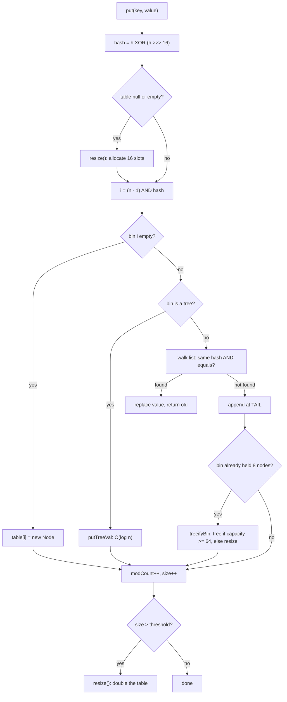
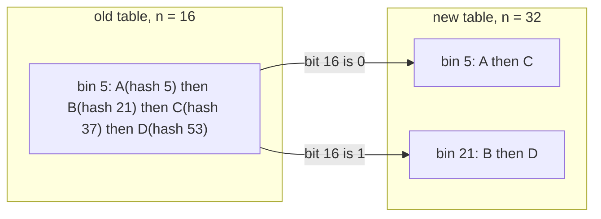
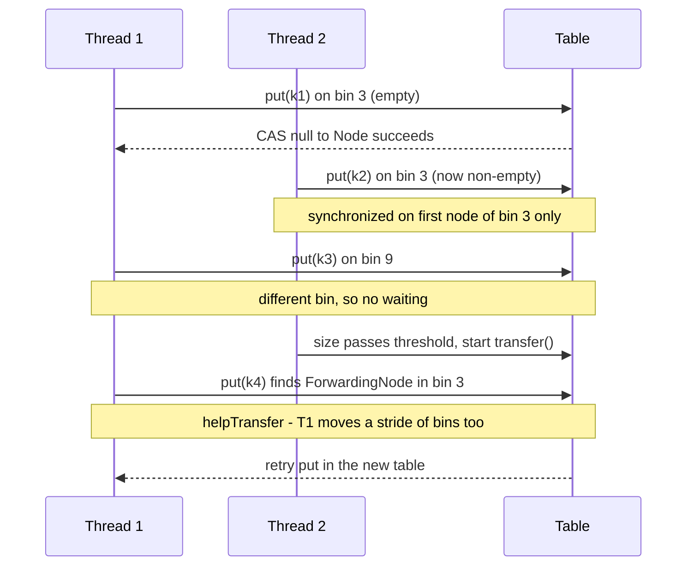

# HashMap & ConcurrentHashMap Internals

!!! abstract "Key takeaways"
    - **HashMap** is an array of buckets ("bins"). Index = `(n - 1) & hash`, where `hash = h ^ (h >>> 16)` spreads the high bits. Defaults: **capacity 16, load factor 0.75**, table created lazily on the first `put`.
    - When `size > capacity × loadFactor` the table **doubles**. Each bin splits into a "low" and "high" list (stay at `i` or move to `i + oldCap`) with no rehash call. A bin that grows **past 8 entries becomes a red-black tree** (only if capacity ≥ 64; the insert into a bin already holding 8 nodes triggers it), giving `O(log n)` worst case instead of `O(n)` (JEP 180, Java 8).
    - HashMap is **not thread-safe**. Concurrent writes lose updates, and in Java 7 a concurrent resize could create a **cycle in a bucket list** (100% CPU in `get`). Never share a mutable HashMap across threads.
    - **ConcurrentHashMap (Java 8+)**: no segments any more. Empty bin → **CAS** insert. Non-empty bin → **`synchronized` on the bin's first node**. Reads are **lock-free** (volatile reads). Resize is **shared by many threads** using `ForwardingNode`s.
    - CHM forbids **null keys and values**, has **weakly consistent** iterators (no `ConcurrentModificationException`), and gives atomic compound operations: `computeIfAbsent`, `merge`, `compute`. `get()` then `put()` is **not** atomic.

## Why it matters

`HashMap` is the most-used data structure in Java backends: request-scoped lookups, JSON objects, caches, de-duplication, grouping in Streams. `ConcurrentHashMap` sits under almost every in-process cache and registry: Spring's bean and metadata caches, `ConcurrentMapCacheManager`, Caffeine's storage, connection pools, rate limiters.

Interviewers use this topic because it tests three things at once:

1. **Data structures**: hashing, collisions, amortised `O(1)`.
2. **The `equals`/`hashCode` contract** in practice (see [OOP principles & equals/hashCode](01-oop-principles-equals-hashcode-contract-immutability.md)).
3. **Concurrency**: visibility, atomicity, lock granularity, and why "thread-safe map" does not mean "thread-safe code".

What came before: `Hashtable` (Java 1.0) and `Collections.synchronizedMap` lock the **whole map** on every call, so only one thread can work at a time. Java 5's `ConcurrentHashMap` split the map into **segments** (16 by default), each with its own `ReentrantLock`. Java 8 rewrote it again to lock at the **bin** level, which is the design you should describe today.

## Core concepts

### 1. The structure: array of bins

```java
transient Node<K,V>[] table;   // length is always a power of two

static class Node<K,V> {
    final int hash;            // cached spread hash, never recomputed
    final K key;
    V value;
    Node<K,V> next;            // collision chain
}
```

Each slot of `table` is a **bin**. A bin is empty, a single `Node`, a linked list of `Node`s, or a `TreeNode` (red-black tree). The table is **not allocated in the constructor**. The first `put` calls `resize()`, which creates it. This saves memory for maps that stay empty.

### 2. From `hashCode()` to bucket index

```java
static final int hash(Object key) {
    int h;
    return (key == null) ? 0 : (h = key.hashCode()) ^ (h >>> 16);  // mix high bits into low bits
}
int index = (table.length - 1) & hash;                              // same as hash % n when n is a power of two
```

Why the XOR with `h >>> 16`? With a 16-slot table only the **lowest 4 bits** pick the bucket. Many `hashCode()`s differ only in high bits (for example `Float` keys, or IDs that are multiples of 65,536). Folding the high half into the low half lets those bits influence the index cheaply.

Why a power-of-two size? `(n - 1) & hash` is a single AND instead of a slow modulo, and it makes resizing simple (next section).

`null` key: HashMap allows **one** null key. Its hash is 0, so it always lives in bin 0.

### 3. `put` step by step


*Notice that `equals()` is only called after the cached hash matches, and that a long chain first triggers a resize when the table is small (< 64). Treeification is the fallback for genuinely colliding keys, not for an undersized table.*

Lookup (`get`) is the same path without the writes: compute hash, pick bin, compare `hash` then `==`/`equals`.

### 4. Load factor, threshold and resize

- `threshold = capacity × loadFactor`. Default: `16 × 0.75 = 12`. The 13th entry triggers a resize to 32.
- `0.75` is a time/space trade-off. Lower means fewer collisions but more empty slots. Higher means a denser table with longer chains.
- `new HashMap<>(n)` sets **capacity** (rounded up to a power of two), not "how many entries fit". To hold 100 entries without resizing you need capacity ≥ 134. Since **Java 19**, use `HashMap.newHashMap(100)` (and `LinkedHashMap.newLinkedHashMap`, `HashSet.newHashSet`), which does that maths for you.

**Resize without rehashing.** When the table doubles from `n` to `2n`, the new index uses one extra bit of the hash. So every entry in old bin `i` goes to either `i` (that bit is 0) or `i + n` (that bit is 1). Java 8 walks each bin once, builds a **lo** list and a **hi** list **keeping the original order**, and drops them into place.


*Notice that the split is decided by a single bit (`hash & oldCap`) and that relative order is preserved. Java 7 instead re-inserted at the head, reversing lists, which is what allowed concurrent resizes to create a cycle.*

### 5. Treeification (JEP 180)

If many keys land in one bin, a linked list makes `get` `O(n)`. Since Java 8:

| Constant | Value | Meaning |
|---|---|---|
| `TREEIFY_THRESHOLD` | 8 | List → red-black tree when an insert lands in a bin that already has this many nodes (so the 9th colliding entry triggers it; most people just say "8") |
| `UNTREEIFY_THRESHOLD` | 6 | Tree → list when a resize split leaves a bin with this many nodes or fewer (removal also untreeifies very small trees) |
| `MIN_TREEIFY_CAPACITY` | 64 | Below this table size, resize instead of treeify |

Tree nodes are ordered by hash first. When hashes are equal, the tree uses `compareTo` **if the keys are `Comparable` and of the same class**, otherwise a tie-break on class name and identity hash. So treeification helps most when keys are `Comparable` (like `String`). With a good `hashCode()` you will almost never see a tree: the `HashMap` source comments note that with random hashes the chance of a bin reaching 8 is about 0.00000006.

The real driver was **hash-flooding denial of service**: in 2011 researchers showed that attacker-chosen keys (for example HTTP form parameter names) with identical hash codes could make a server spend seconds on a single request across many languages, Java included. Tomcat added `maxParameterCount` in response, and JEP 180 made the worst case `O(log n)`.

### 6. Fail-fast iterators and `modCount`

Every structural change increments `modCount`. An iterator remembers the value at creation and throws `ConcurrentModificationException` if it changes, unless the change came through `iterator.remove()`. This is **best-effort bug detection**, not a thread-safety guarantee. It fires in a single thread too:

```java
for (String k : map.keySet()) {
    if (k.startsWith("tmp")) map.remove(k);   // CME on the next iteration
}
map.keySet().removeIf(k -> k.startsWith("tmp")); // correct
```

### 7. ConcurrentHashMap: the Java 8+ design

CHM keeps the same table-of-bins layout but makes each step safe:

| Operation | Mechanism |
|---|---|
| Read `table[i]` | Volatile read (`tabAt`), so no lock and always sees a fully constructed node |
| Insert into an **empty** bin | **CAS** (`casTabAt`) a new node into the slot. If the CAS loses, loop and retry |
| Insert/update in a **non-empty** bin | `synchronized (firstNode)`: locks **only that bin** |
| Tree bin | A `TreeBin` wrapper holds the tree with its own lightweight read/write lock |
| Resize | `transfer()`: threads claim **strides** of bins (min 16) and move them. Finished bins get a `ForwardingNode` (hash `MOVED = -1`) |
| Size | `baseCount` plus a striped `CounterCell[]` (the same idea as `LongAdder`) to avoid one hot counter |
| Coordination | `sizeCtl`: negative while initialising or resizing, otherwise the next resize threshold |


*Notice that writers only contend when they hit the same bin, readers never block, and a writer that runs into a resize helps finish it instead of waiting.*

Readers during a resize: `get` that lands on a `ForwardingNode` follows its pointer to the new table. Because Java 8 moves bins by **copying** nodes (reusing a trailing run where possible) instead of mutating the old list, readers of the old table still see a valid chain.

**Why no nulls?** In a concurrent map, `get(k) == null` must mean "absent". If nulls were allowed you could not tell "absent" from "mapped to null", and you could not check with `containsKey` afterwards because another thread may have changed the map in between. Doug Lea chose to forbid them; `HashMap` can allow them because it is single-threaded.

**Java 7 vs Java 8 CHM** (a classic question):

| | Java 7 | Java 8+ |
|---|---|---|
| Lock unit | `Segment`s (`ReentrantLock`), 16 by default, count fixed at construction | Each bin's first node (`synchronized`) |
| Empty-bin insert | Locks segment | CAS, no lock |
| `concurrencyLevel` | Number of segments | Only a sizing hint |
| Collisions | Linked list | List, then `TreeBin` |
| Resize | Per segment, by the lock holder | Whole table, cooperative, many threads |
| Count | Sum segments, retry, then lock all | `baseCount` + `CounterCell`s |

### 8. Atomic compound operations

Thread-safe individual calls do not make a **sequence** of calls atomic. CHM provides atomic alternatives:

- `putIfAbsent(k, v)`, `remove(k, v)`, `replace(k, old, new)`: conditional updates.
- `computeIfAbsent(k, fn)`: runs `fn` **at most once per absent key**, while holding the bin lock.
- `compute`, `computeIfPresent`, `merge(k, v, remapFn)`: atomic read-modify-write.
- Bulk parallel ops: `forEach`, `search`, `reduce` with a `parallelismThreshold`.
- `ConcurrentHashMap.newKeySet()` for a concurrent `Set`.

Rules for the functions you pass in (from the Javadoc): keep them **short and simple**, and they **must not update any other mapping of this map**. Calling `computeIfAbsent` recursively on the same map from inside the function can throw `IllegalStateException("Recursive update")` (Java 9+) or, in Java 8, could hang.

## In practice: code & configuration

=== "❌ Common mistake"
    ```java
    // Shared, Spring-singleton service: a request counter per tenant
    @Service
    public class TenantMetrics {
        private final Map<String, Long> counts = new HashMap<>();       // not thread-safe at all

        public void record(String tenantId) {
            Long current = counts.get(tenantId);                         // read
            counts.put(tenantId, current == null ? 1 : current + 1);     // write: lost updates
        }
    }

    // "Fixed" by switching the type, but still wrong
    private final Map<String, Long> counts = new ConcurrentHashMap<>();
    public void record(String tenantId) {
        if (!counts.containsKey(tenantId)) {                             // check...
            counts.put(tenantId, 0L);                                    // ...then act: race window
        }
        counts.put(tenantId, counts.get(tenantId) + 1);                  // get + put is not atomic
    }
    ```

=== "✅ Correct approach"
    ```java
    @Service
    public class TenantMetrics {
        // Pre-size if you know roughly how many tenants exist. CHM treats this as
        // "elements to hold", not raw table capacity.
        private final ConcurrentHashMap<String, LongAdder> counts = new ConcurrentHashMap<>(256);

        public void record(String tenantId) {
            counts.computeIfAbsent(tenantId, id -> new LongAdder())     // atomic create-once
                  .increment();                                         // striped counter: no hot spot
        }

        public Map<String, Long> snapshot() {
            Map<String, Long> out = HashMap.newHashMap(counts.size());  // Java 19+: sized for N entries
            counts.forEach((k, v) -> out.put(k, v.sum()));              // weakly consistent view
            return out;
        }
    }
    ```

A simple `merge` is fine when values are immutable and contention is low:

```java
counts.merge(tenantId, 1L, Long::sum);    // atomic per key
```

A **per-key memoising cache** with CHM. It has **no eviction**, so it is only fine for small, fixed key sets such as reference data. For size bounds and TTL, use Caffeine instead of rolling your own:

```java
private final ConcurrentHashMap<String, CompletableFuture<Formulary>> cache = new ConcurrentHashMap<>();

CompletableFuture<Formulary> formulary(String planId) {
    // Store a future, not the value: the slow remote call happens OUTSIDE the bin lock,
    // and concurrent callers for the same planId share one in-flight request.
    // In real code, remove the entry if the future fails, or the error stays cached forever.
    return cache.computeIfAbsent(planId, id -> client.fetchFormularyAsync(id));
}
```

!!! tip "Key design"
    Use **immutable keys** with a correct `equals`/`hashCode` (records are ideal: `record PlanKey(String planId, int year) {}`). If a key's hash changes after insertion, the entry sits in the wrong bin and becomes unreachable, which is a memory leak.

## Real-world usage

- **The Java 7 HashMap infinite loop.** Many teams hit 100% CPU in production with threads stuck in `HashMap.get` or `put`. The cause was concurrent `resize()` with head insertion forming a cycle in a bucket. Java 8's order-preserving split removed the loop, but concurrent HashMap writes are **still** broken (lost entries, wrong size, corrupt tree bins). The fix is always a concurrent map, not a newer JDK.
- **Hash-flooding DoS (2011).** Attackers sent POST bodies with thousands of colliding parameter names, which made servers in Java, PHP, Python and others burn CPU on hash table inserts. Java's long-term fix was tree bins (JEP 180). Web servers also cap parameter counts. This is why banking and healthcare APIs should still limit request body size and field counts.
- **Frameworks.** Spring uses `ConcurrentHashMap` widely for metadata caches (and `ConcurrentReferenceHashMap` where entries must be garbage-collectable). Spring's simple `ConcurrentMapCacheManager` is backed by CHM. Caffeine, the local cache Spring Boot auto-configures when it is on the classpath, uses CHM as its underlying store and adds eviction on top.
- **Healthcare/banking relevance.** Per-tenant or per-member counters, idempotency-key sets, in-flight request de-duplication, and reference-data caches are typical. The common bug in reviews is a `HashMap` field in a singleton `@Service` or a check-then-act on a CHM.

## Trade-offs & production gotchas

| Option | Pros | Cons | Use when |
|---|---|---|---|
| `HashMap` | Fastest, allows null, low memory | Not thread-safe | Local variables, request scope, confined to one thread |
| `Collections.synchronizedMap` / `Hashtable` | Simple, consistent iteration under manual lock | One lock for everything, poor scaling, must lock manually to iterate | Legacy code, very low contention |
| `ConcurrentHashMap` | Lock-free reads, per-bin writes, atomic `compute`/`merge` | No nulls, weakly consistent iteration, `size()` is an estimate under load | Shared mutable maps, counters, registries |
| `Map.copyOf` / immutable map | Thread-safe by design, no locking | Rebuild on change | Config and reference data loaded at startup |
| Caffeine (on CHM) | Eviction, TTL, stats, async loading | Extra dependency | Real caches with size or time bounds |
| `ConcurrentSkipListMap` | Sorted, concurrent | `O(log n)`, more memory | Need ordering or range queries concurrently |

!!! warning "Gotchas"
    - **Mutable keys**: changing a field used in `hashCode()` after `put` makes the entry unfindable. Use records or immutable classes as keys.
    - **`new HashMap<>(100)` is a capacity, not an entry count**: it rounds up to 128 slots with threshold 96, so the 97th entry resizes (and `new HashMap<>(16)` resizes at the 13th). Use `HashMap.newHashMap(100)` (Java 19+).
    - **Check-then-act on CHM** (`containsKey` then `put`, `get` then `put`) is a race. Use `putIfAbsent`, `computeIfAbsent`, `merge`.
    - **Slow work inside `computeIfAbsent`** (a REST or DB call) holds the bin lock and blocks every other writer on that bin, and anything else hashing there. Store a `CompletableFuture` or use Caffeine's async loader.
    - **Recursive `computeIfAbsent`** on the same map (classic memoised Fibonacci) throws `IllegalStateException: Recursive update` on Java 9+ (best-effort detection; Java 8 could hang instead).
    - **`size()` under concurrent writes** is a moment-in-time estimate. Don't use it for control flow like "if size < limit then put". Use `mappingCount()` for very large maps.
    - **Iterating a CHM** does not throw CME but may or may not show concurrent changes. Don't assume a snapshot.
    - **Bad `hashCode()`** (for example returning a constant) turns every operation into a tree or list walk. Tree bins only save you if keys are `Comparable`.

## How this connects to my experience

- **Where I used it:** the resume doesn't name these classes, but the work relies on them. At OptumRx Meteor I *designed and developed microservices using Java, Spring Boot, Kafka, MongoDB, Redis, and GraphQL* and *owned the GraphQL Consumer Service* that integrates 5 upstream systems. Spring singletons in that service share state across request threads, so any in-process map there must be concurrent or immutable.
- **Talking points:**
    - Layered caching: Redis for cross-instance query and UI reference data (resume bullet), plus an in-process `ConcurrentHashMap`/Caffeine layer for small, hot lookups. *[confirm whether a local cache layer existed]*
    - In-flight de-duplication: caching a `CompletableFuture` per key with `computeIfAbsent` so concurrent GraphQL requests for the same upstream resource share one call. *[confirm, or present as how you would do it]*
    - Code reviews as a mentor of 5+ engineers: flagging `HashMap` fields in `@Service` beans, check-then-act races, and mutable keys. *[confirm a concrete example]*
    - CipherTrust CCKM: per-cloud or per-key-ID state (for example rotation status) accessed by concurrent workers is a natural CHM use case. *[confirm]*
- **Likely follow-up chain:** "How does HashMap work?" → "What happens on resize, and why was Java 7 dangerous?" → "How is ConcurrentHashMap thread-safe without locking the whole map?" → "Suppose your service cached upstream responses in a CHM. What if two requests miss at the same time?" Answer the last one with `computeIfAbsent` storing a future, then mention Caffeine for eviction and Redis for cross-pod sharing.

## Interview questions

### Fundamentals

??? question "Q1. How does HashMap store and find an entry?"
    **Answer:** It keeps an array of bins. `put` computes `hash = key.hashCode() ^ (h >>> 16)`, picks index `(n - 1) & hash`, then either places a new node in an empty bin or walks the bin comparing the cached hash and then `equals`. If found it replaces the value, otherwise it appends a node (or inserts into a tree bin). `get` follows the same path read-only. Average `O(1)`, worst case `O(log n)` since Java 8 (for `Comparable` keys; non-comparable keys with identical hashes can still degrade towards `O(n)`).

    **Interviewer listens for:** buckets, hash spreading, power-of-two index masking, `hashCode` then `equals`, collisions.

    **Common wrong answer:** "It uses `hashCode` as the array index directly" or "it calls `equals` on every entry".

??? question "Q2. What are the default capacity and load factor, and when does a resize happen?"
    **Answer:** Capacity 16, load factor 0.75, so the threshold is 12. The table is allocated lazily on the first `put`. When `size` exceeds the threshold, the table doubles. Capacity is always a power of two.

    **Interviewer listens for:** lazy init, threshold maths, doubling.

    **Common wrong answer:** "The map resizes when it is full." It resizes when size exceeds capacity × load factor.

??? question "Q3. Why must you override both `equals` and `hashCode` for keys?"
    **Answer:** HashMap uses `hashCode` to find the bin and `equals` to find the key in it. If two equal objects have different hash codes they land in different bins, so `get` with an equal key returns null and duplicates appear. Overriding `hashCode` but not `equals` means identity comparison, so a new but equal key is never found.

    **Interviewer listens for:** the contract (equal objects must have equal hash codes), and the effect on both lookup and duplicates.

    **Common wrong answer:** "equals alone is enough because HashMap compares keys with equals." It only calls equals inside the bin chosen by hashCode.

??? question "Q4. Can HashMap and ConcurrentHashMap hold null keys or values?"
    **Answer:** HashMap allows one null key (stored in bin 0) and any number of null values. ConcurrentHashMap allows neither and throws `NullPointerException`. In a concurrent map, null from `get` must unambiguously mean "absent", because you can't safely follow up with `containsKey` while other threads change the map.

    **Common wrong answer:** "CHM forbids null because of hashing" (the reason is ambiguity under concurrency).

    **Interviewer listens for:** one null key in HashMap, none in CHM, ambiguity of null under concurrency.

### Intermediate

??? question "Q5. Why is the table size always a power of two, and why the `h ^ (h >>> 16)` step?"
    **Answer:** Power of two lets the index be `hash & (n - 1)`, a cheap AND instead of `%`, and makes resize splitting a one-bit decision. Because only the low bits are used for small tables, XOR-ing the upper 16 bits into the lower 16 makes keys that differ only in high bits spread across bins.

    **Interviewer listens for:** bit masking, high-bit spreading, link to resize.

    **Common wrong answer:** "Powers of two use less memory."

??? question "Q6. What is treeification and when does it happen?"
    **Answer:** Since Java 8 (JEP 180), when a single bin grows past 8 nodes (an insert into a bin already holding `TREEIFY_THRESHOLD` = 8) and the table has at least 64 slots, the list becomes a red-black tree, making lookups in that bin `O(log n)`. If the table is smaller than 64, HashMap resizes instead. Trees convert back to lists at 6 nodes or fewer (during resize). Ordering uses hash, then `compareTo` for `Comparable` keys of the same class, then a tie-break.

    **Interviewer listens for:** the three thresholds, why 64, hash-flooding motivation, `Comparable` matters.

    **Common wrong answer:** "It treeifies at 8 entries in the map" (it's per bin), or forgetting the minimum capacity rule.

??? question "Q7. Output prediction: what does this print?"
    ```java
    record Point(int x, int y) {}
    class MutablePoint { int x; MutablePoint(int x){this.x=x;}
        public boolean equals(Object o){ return o instanceof MutablePoint m && m.x==x; }
        public int hashCode(){ return x; } }

    Map<Object,String> m = new HashMap<>();
    m.put(new Point(1, 2), "p");
    MutablePoint mp = new MutablePoint(1);
    m.put(mp, "mp");
    mp.x = 99;
    System.out.println(m.get(new Point(1, 2)) + " " + m.get(mp) + " " + m.size());
    ```
    **Answer:** `p null 2`. The record gets value-based `equals`/`hashCode`, so a new equal `Point` finds the entry. After mutating `mp`, its hash is 99, so the lookup goes to a different bin and finds nothing, yet the entry is still counted in `size`. It is effectively leaked.

    **Interviewer listens for:** cached hash in the node, mutable key danger, records as safe keys.

    **Common wrong answer:** Assuming a mutated key can still be found by its new value.

??? question "Q8. What does fail-fast mean? Is it a thread-safety mechanism?"
    **Answer:** HashMap iterators check `modCount` and throw `ConcurrentModificationException` if the map was structurally modified other than through the iterator. It's best-effort bug detection and is not guaranteed under concurrency. It also fires in single-threaded code (removing inside a for-each). Use `iterator.remove()` or `removeIf`. CHM iterators are weakly consistent and never throw CME.

    **Common wrong answer:** "CME means another thread modified the map."

    **Interviewer listens for:** modCount, best-effort detection, single-threaded cases.

??? question "Q9. HashMap vs Hashtable vs synchronizedMap vs ConcurrentHashMap?"
    **Answer:** HashMap: unsynchronised, nulls allowed. Hashtable: legacy, every method `synchronized`, no nulls. `synchronizedMap`: wrapper with one mutex, and you must lock it yourself while iterating. ConcurrentHashMap: lock-free reads, per-bin locking for writes, cooperative resize, atomic compound methods, weakly consistent iteration, no nulls. For shared mutable maps use CHM.

    **Interviewer listens for:** locking granularity, null rules, compound actions, CHM as the default.

    **Common wrong answer:** "Hashtable and synchronizedMap are as good as CHM." One global lock serialises every access.

### Senior

??? question "Q10. How does ConcurrentHashMap (Java 8+) achieve thread safety? How is it different from Java 7?"
    **Answer:** Java 8+ reads bins with volatile semantics, so `get` never locks. Inserting into an empty bin uses CAS. Updating a non-empty bin synchronises on that bin's first node only, so contention is limited to keys in the same bin. Tree bins use a `TreeBin` with its own read/write lock. Counting uses `baseCount` plus striped `CounterCell`s. Java 7 used a fixed array of `Segment`s (16 by default, each a `ReentrantLock` with its own sub-table), so at most `concurrencyLevel` writers ran in parallel. In Java 8+ `concurrencyLevel` is only a sizing hint.

    **Interviewer listens for:** CAS on empty bin, synchronized on first node, lock-free reads, no segments, LongAdder-style counting.

    **Common wrong answer:** "CHM locks segments" (outdated), or "reads lock too".

??? question "Q11. Explain how ConcurrentHashMap resizes while other threads keep reading and writing."
    **Answer:** The thread that pushes size past the threshold sets `sizeCtl` negative and creates `nextTable` (double size). Bins are transferred in strides from the end of the table. Each finished bin is replaced with a `ForwardingNode` (hash `MOVED`) pointing to the new table. A reader hitting it follows the forward. A writer hitting it calls `helpTransfer` and claims a stride itself, so resizing is parallel. Nodes are copied, not mutated, so readers of old bins still see consistent chains. When all bins are moved, the new table is published and `sizeCtl` set to the new threshold.

    **Interviewer listens for:** ForwardingNode, helpTransfer, strides, sizeCtl, readers unaffected.

    **Common wrong answer:** "CHM locks the whole table to resize." Transfer is cooperative and bin by bin.

??? question "Q12. Why was concurrent use of HashMap in Java 7 able to cause an infinite loop, and is Java 8 HashMap safe now?"
    **Answer:** Java 7's `transfer` re-inserted nodes at the head of the new bin, reversing list order. Two threads resizing at once could each reverse part of a chain and leave `a.next = b` and `b.next = a`. A later `get` then looped forever. Java 8 preserves order with lo/hi splitting, so that specific cycle is gone, but HashMap is still not thread-safe: you can lose entries, get wrong sizes, or corrupt tree bins (other hang reports exist). The answer is CHM or confinement, not "upgrade to Java 8".

    **Common wrong answer:** "Java 8 fixed it, so HashMap is OK for concurrent use."

    **Interviewer listens for:** head insertion caused cycles in Java 7, Java 8 still unsafe (lost updates, corrupted trees).

??? question "Q13. What are the rules and pitfalls of `computeIfAbsent` on ConcurrentHashMap?"
    **Answer:** The mapping function runs atomically at most once per absent key, while the bin is locked. So it must be short, must not block on I/O, and must not modify other mappings in the same map. A recursive call on the same map throws `IllegalStateException("Recursive update")` on Java 9+ (Java 8 could hang). For expensive loads, store a `CompletableFuture` so the work runs outside the lock, or use Caffeine's `LoadingCache`/`AsyncLoadingCache`. Note that `computeIfAbsent` still takes the lock path on a hit in some cases, so for very hot read paths try `get` first and fall back to `computeIfAbsent`.

    **Interviewer listens for:** atomicity scope, lock held during function, no recursion, future-based memoisation.

    **Common wrong answer:** Calling a remote service or another computeIfAbsent on the same map inside the mapping function.

### Scenario-based

??? question "Q14. A Spring service holds a `HashMap` cache. In production, after a traffic spike, some keys are missing and one pod showed a thread stuck at 100% CPU in `HashMap`. Diagnose and fix."
    **Answer:** A singleton bean is shared across request threads, so concurrent `put`s raced: lost updates during resize and a corrupted bin (cycle or broken tree) causing the spin. Confirm with a thread dump (several dumps showing the same thread in `HashMap.getNode`/`putTreeVal`/`resize`). Fix: switch to `ConcurrentHashMap` with atomic methods, or Caffeine if it is a real cache with size and TTL limits. If data is reference data loaded once, build it at startup and publish an immutable `Map.copyOf` via a `volatile` field. Add a review rule: no mutable non-concurrent collections in singleton fields.

    **Interviewer listens for:** thread dump evidence, root cause (shared singleton), right replacement, bounded caching.

    **Common wrong answer:** "Make the map volatile." That only publishes the reference, not safe concurrent updates.

??? question "Q15. You need a per-member rate counter for an API handling thousands of requests per second. Which structure and why?"
    **Answer:** `ConcurrentHashMap<String, LongAdder>` with `computeIfAbsent(id, k -> new LongAdder()).increment()`. CHM gives atomic create-once per key and per-bin locking only on first insert; after that increments touch only the `LongAdder`, which stripes contention across cells. `merge(k, 1L, Long::sum)` also works but locks the bin on every increment. Add eviction (scheduled cleanup or Caffeine with expiry) so the map doesn't grow without bound. For limits across pods, the counter must live in Redis instead.

    **Interviewer listens for:** LongAdder, unbounded growth concern, local vs distributed.

    **Common wrong answer:** "Use AtomicLong in a synchronizedMap." It works but serialises every request on one lock.

??? question "Q16. Two concurrent GraphQL requests miss the cache for the same upstream key and both call the slow upstream. How do you stop the duplicate call?"
    **Answer:** This is a cache stampede. Locally: `cache.computeIfAbsent(key, k -> client.fetchAsync(k))` storing a `CompletableFuture`, so the first caller creates the future and others share it, and the remote call doesn't run while holding the bin lock. Remove failed futures so errors aren't cached. Caffeine's `AsyncLoadingCache` does this for you with expiry. Across pods, use a short Redis lock or accept one call per pod.

    **Interviewer listens for:** single-flight via futures, error eviction, local vs distributed.

    **Common wrong answer:** "Put a synchronized block around the upstream call." That serialises all keys, not just the hot one.

??? question "Q17. Gotcha: a teammate writes `if (!chm.containsKey(k)) chm.put(k, create());`. The map is a ConcurrentHashMap, so it's safe, right?"
    **Answer:** No. Each call is thread-safe, but the pair is check-then-act. Two threads can both see the key missing, both call `create()`, and the second `put` overwrites the first. Use `putIfAbsent` (if creating is cheap) or `computeIfAbsent` (creates once).

    **Common wrong answer:** "Yes, CHM is thread-safe."

    **Interviewer listens for:** check-then-act race, putIfAbsent or computeIfAbsent.

## Cheat sheet

| Concept | Remember |
|---|---|
| Index | `(n - 1) & (h ^ (h >>> 16))`, `n` power of two |
| Defaults | Capacity 16, load factor 0.75, threshold 12, lazy table |
| Resize | Double. Entry goes to `i` or `i + oldCap` by one bit. Order kept (Java 8) |
| Treeify | Bin grows past 8 (`TREEIFY_THRESHOLD` = 8) and table ≥ 64 → red-black tree. Back to list at ≤ 6 |
| Presize | `HashMap.newHashMap(n)` (Java 19+), not `new HashMap<>(n)` |
| Nulls | HashMap: one null key OK. CHM: no null keys or values |
| Iterators | HashMap fail-fast (CME). CHM weakly consistent |
| CHM write | Empty bin → CAS. Else `synchronized` on first node |
| CHM read | Lock-free volatile reads |
| CHM resize | `ForwardingNode` + `helpTransfer`, multi-threaded |
| CHM count | `baseCount` + `CounterCell`s. `mappingCount()` returns long |
| Atomic ops | `putIfAbsent`, `computeIfAbsent`, `compute`, `merge` |
| Never | Shared HashMap, check-then-act, slow work in `compute*`, mutable keys |

## Sources

1. [HashMap (Java SE 21 API)](https://docs.oracle.com/en/java/javase/21/docs/api/java.base/java/util/HashMap.html): defaults, load factor, `Comparable` tie-breaking, fail-fast iterators, `newHashMap` (since 19).
2. [ConcurrentHashMap (Java SE 21 API)](https://docs.oracle.com/en/java/javase/21/docs/api/java.base/java/util/concurrent/ConcurrentHashMap.html): no nulls, non-blocking retrieval, weakly consistent iterators, `computeIfAbsent` rules, `concurrencyLevel` as a hint, `mappingCount`.
3. [JEP 180: Handle Frequent HashMap Collisions with Balanced Trees](https://openjdk.org/jeps/180): treeification and the hash-flooding motivation.
4. [OpenJDK source: HashMap.java](https://github.com/openjdk/jdk/blob/master/src/java.base/share/classes/java/util/HashMap.java): `hash()`, resize split, treeify thresholds and implementation notes.
5. [OpenJDK source: ConcurrentHashMap.java](https://github.com/openjdk/jdk/blob/master/src/java.base/share/classes/java/util/concurrent/ConcurrentHashMap.java): CAS insertion, bin locking, `ForwardingNode`, `transfer`, `CounterCell`s.
6. [Java Concurrency in Practice (Goetz et al.), ch. 5 and 13](https://jcip.net/): concurrent collections, check-then-act races, lock striping.
