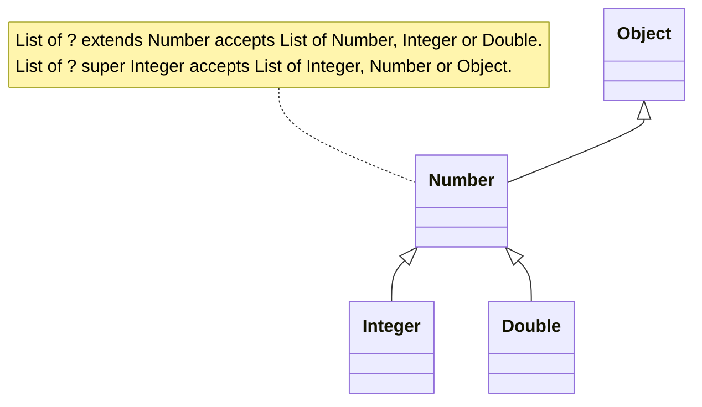
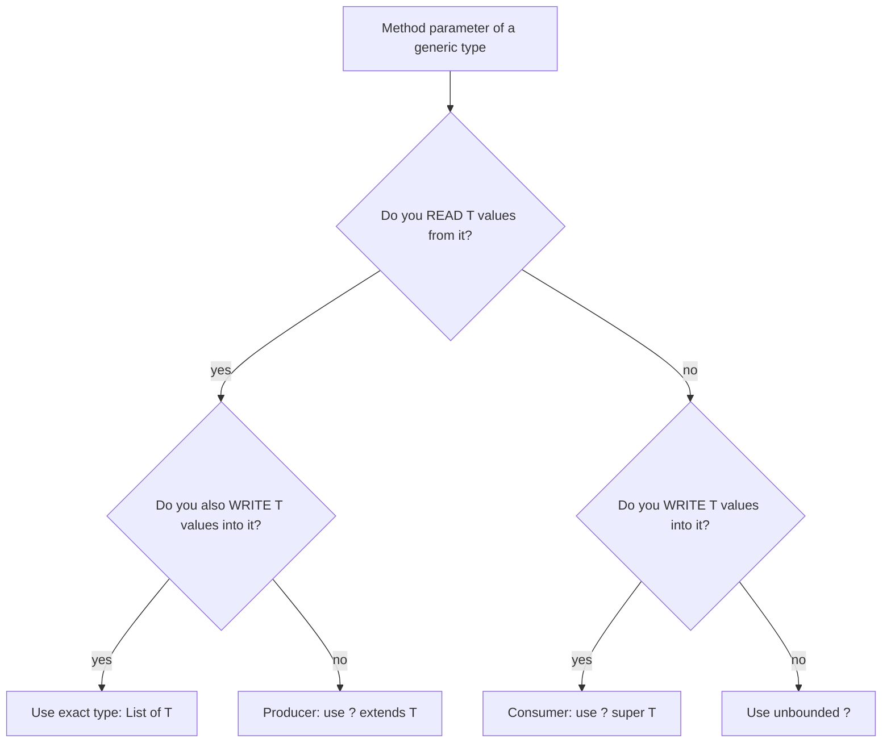
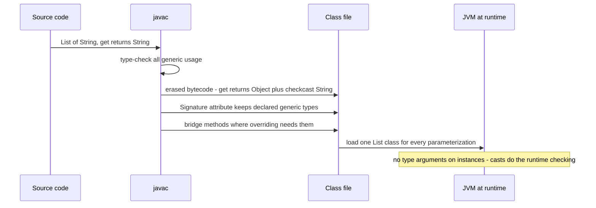

# Generics (Wildcards, PECS, Type Erasure)

!!! abstract "Key takeaways"
    - Generics move type checks from **runtime casts** to **compile time**. They were added in Java 5 (JSR 14) and implemented by **type erasure**: the compiler checks types, inserts casts, and the bytecode mostly forgets the type arguments (`List<String>` and `List<Integer>` share one `List.class`).
    - Generics are **invariant**: `List<Integer>` is *not* a `List<Number>`. Arrays are **covariant** (`Integer[]` *is* a `Number[]`), which is why arrays fail at runtime with `ArrayStoreException` while generics fail at compile time.
    - **Wildcards** add flexibility: `? extends T` (you can read `T` out, cannot add), `? super T` (you can add `T` in, reads give `Object`), `?` (read as `Object`, add nothing but `null`).
    - **PECS: Producer `extends`, Consumer `super`** (Effective Java, Item 31). Example: `Collections.copy(List<? super T> dest, List<? extends T> src)`.
    - Erasure consequences: no `new T()`, no `new T[]`, no `instanceof List<String>`, no primitives as type arguments (`List<int>`), no overloads that differ only by type argument, and **heap pollution** with generic varargs. Frameworks recover types with **super type tokens** (`ParameterizedTypeReference`, Jackson `TypeReference`) because generic info in *declarations* survives in class-file `Signature` attributes.

## Why it matters

Before Java 5, every collection held `Object`. You wrote this:

```java
List names = new ArrayList();          // raw: holds anything
names.add("alice");
names.add(42);                         // compiles fine
String first = (String) names.get(1);  // ClassCastException at runtime, far from the bug
```

The bug (adding an `Integer`) and the crash (the cast) were in different places, maybe different services. Generics let the compiler reject `names.add(42)` on a `List<String>`, and they remove the casts from your code.

Where it shows up in real systems:

- **API design.** Every reusable library method you write (`Result<T>`, `Page<T>`, `ApiResponse<T>`, a Kafka `Serializer<T>`, a Spring `Converter<S, T>`) is a generics design decision. Get the wildcards wrong and callers can't pass a `List<Integer>` where you take `List<Number>`.
- **Framework internals.** Spring resolves generic types to inject `Repository<Patient>` vs `Repository<Claim>`. Jackson needs a type token to deserialize `List<Prescription>`. `RestClient`/`WebClient` need `ParameterizedTypeReference` for generic response bodies.
- **Interviews.** This is a favourite area for "does it compile?" and "what is printed?" questions, and for checking whether a senior candidate can read a signature like `<T extends Comparable<? super T>> void sort(List<T> list)`.

Cross-references: the collection classes themselves are covered in [Collections framework](03-collections-framework.md). `Function<? super T, ? extends R>` in streams is covered in Functional Java (subtopic 7). Reflection APIs are covered in Serialization, reflection & annotations (subtopic 9).

## Core concepts

### 1. Type parameters, type arguments and generic methods

```java
public final class Box<T> {                         // T is a type PARAMETER
    private final T value;
    public Box(T value) { this.value = value; }
    public T get() { return value; }
}

Box<String> b = new Box<>("hi");                    // String is the type ARGUMENT; <> is the diamond (Java 7)

public static <T> T firstOrNull(List<T> list) {     // generic METHOD: <T> declared before the return type
    return list.isEmpty() ? null : list.get(0);
}
String s = firstOrNull(List.of("a", "b"));          // T inferred as String
```

Naming convention: `T` type, `E` element, `K`/`V` key/value, `R` result, `S`/`U` additional types.

A class's type parameter belongs to **instances**. That is why a `static` field or `static` method cannot use the class's `T`: there is only one static field shared by `Box<String>` and `Box<Integer>`. A static method must declare its own type parameter (`static <T> Box<T> of(T v)`).

### 2. Bounded type parameters

```java
public static <T extends Comparable<T>> T max(List<T> list) { ... }   // upper bound: T must be Comparable
<T extends Number & Serializable>                                       // multiple bounds: one class first, then interfaces
```

A bound lets you call methods of the bound on `T` (`compareTo`, `doubleValue`). There is no `T super X` for type parameters; lower bounds exist only on wildcards.

### 3. Invariance, and why arrays are different

Is `List<Integer>` a subtype of `List<Number>`? No. If it were, this would compile:

```java
List<Integer> ints = new ArrayList<>();
List<Number> nums = ints;          // compile error - and this is why
nums.add(3.14);                    // would put a Double into a list of Integers
Integer i = ints.get(0);           // ClassCastException
```

Arrays chose the opposite (covariance) in Java 1.0, so the check has to happen at runtime:

```java
Object[] objs = new Integer[1];    // compiles: arrays are covariant
objs[0] = "boom";                  // ArrayStoreException at runtime
```

Arrays are **reified** (they know their element type at runtime and check every store). Generics are **erased** (they don't know, so the compiler must guarantee safety up front). This mismatch is why you cannot create a generic array (`new T[10]`, `new List<String>[10]`).

### 4. Wildcards: `? extends`, `? super`, `?`

Invariance is safe but rigid. Wildcards give controlled flexibility on the **use site**.


*Notice that `? extends` looks DOWN the hierarchy from the bound, while `? super` looks UP from it. That direction decides whether you can safely read or safely write.*

| Declaration | What you can assign to it | Read gives | Can add |
|---|---|---|---|
| `List<Number>` | only `List<Number>` | `Number` | `Number` and subtypes |
| `List<? extends Number>` | `List<Number>`, `List<Integer>`, `List<Double>` | `Number` | nothing (only `null`) |
| `List<? super Integer>` | `List<Integer>`, `List<Number>`, `List<Object>` | `Object` | `Integer` and subtypes |
| `List<?>` | any `List<X>` | `Object` | nothing (only `null`) |

Why can't you add to `List<? extends Number>`? The compiler only knows "some unknown subtype of Number". It might be a `List<Double>`, so adding an `Integer` could corrupt it. Why do reads from `List<? super Integer>` give `Object`? It might be a `List<Object>` holding anything.

{ loading=lazy }
*Notice that each wildcard gives up one direction: `extends` can't write because the real list might be a narrower type, `super` can only read `Object` because it might be a wider one.*

`List<?>` vs raw `List`: `List<?>` is type-safe (you can't add anything wrong); raw `List` turns off checking and only produces warnings. `List<Object>` is different again: it accepts only `List<Object>`, not `List<String>`.

### 5. PECS: Producer `extends`, Consumer `super`

Joshua Bloch's mnemonic from *Effective Java* (Item 31):

- If a parameter **produces** `T` values for you to read, use `? extends T`.
- If a parameter **consumes** `T` values you write into it, use `? super T`.
- If it does both, use exact `T`. If it does neither (you only call `size()` or `clear()`), use `?`.


*Notice that the decision is made from the method's point of view: what the method does with the argument, not what the caller does.*

The JDK is full of PECS:

```java
// java.util.Collections
public static <T> void copy(List<? super T> dest, List<? extends T> src)
// java.util.Collections - note the double bound
public static <T extends Object & Comparable<? super T>> T max(Collection<? extends T> coll)
// java.util.function.Function
<V> Function<T, V> andThen(Function<? super R, ? extends V> after)
// java.util.stream.Stream
<R> Stream<R> map(Function<? super T, ? extends R> mapper)
```

{ loading=lazy }
*Watch the direction: values only come out of the `extends` side and only go into the `super` side. That is why the two lists can have different element types.*

Two senior-level details hidden in `Collections.max`:

1. `Comparable<? super T>`: lets `T` be a subclass whose comparison is inherited from a parent. `java.sql.Timestamp`-style hierarchies, or `class Child extends Parent implements Comparable<Parent>`, work only because of `? super T`. A `Comparator` or `Comparable` is a **consumer** of `T`.
2. `T extends Object & Comparable<...>`: the erasure of a type variable is its **first** bound. Adding `Object` first makes the erased signature `Object max(Collection)`, which kept binary compatibility with the pre-generics method. Without it the erased return type would have been `Comparable`.

!!! tip "Return types"
    Don't use wildcards in **return types**. They force every caller to deal with `? extends` and lose the ability to add. Wildcards belong on parameters; return concrete parameterized types (`List<T>`).

### 6. Wildcard capture

You can't write to a `List<?>`, so how does `Collections.swap(List<?> list, int i, int j)` work? It delegates to a private generic helper. The compiler "captures" the unknown type as a fresh type variable (shown in errors as `CAP#1`):

```java
public static void swap(List<?> list, int i, int j) { swapHelper(list, i, j); }
private static <E> void swapHelper(List<E> list, int i, int j) {   // ? captured as E
    list.set(i, list.set(j, list.get(i)));
}
```

The public signature stays simple; the helper does the typed work. (The JDK's real `Collections.swap` simply assigns the list to a raw `List` local variable and swaps through it, but the capture-helper pattern is the textbook approach from the Java Tutorials and *Effective Java*.)

### 7. Type erasure: what the compiler actually does

Erasure (JLS §4.6) means:

1. Replace each type parameter with its **leftmost bound** (`Object` if unbounded).
2. Insert **casts** where values come out (`(String) list.get(0)`).
3. Generate **bridge methods** to keep polymorphism working after erasure.


*Notice that the type argument of an object never reaches the JVM, but the generic declarations of classes, fields and methods are kept as metadata. That is the loophole frameworks use.*

**Bridge methods** example:

```java
class PatientId implements Comparable<PatientId> {
    public int compareTo(PatientId o) { ... }        // what you wrote
    // compiler-generated, synthetic:
    // public int compareTo(Object o) { return compareTo((PatientId) o); }
}
```

After erasure `Comparable` has `compareTo(Object)`. Your method takes `PatientId`, so it would not override it. The compiler adds a synthetic bridge that casts and delegates. You see bridges in stack traces and via `Method.isBridge()`.

**Why erasure?** Migration compatibility. In 2004 there were millions of lines of raw-type code and pre-compiled libraries. Erasure let generic and non-generic code interoperate on the same JVM without a new class-file format for collections. C# chose reification (`List<int>` is a real distinct runtime type) because .NET generics shipped with a runtime change. Java's Project Valhalla is working on value classes and, later, generics over primitive/value types, but as of Java 25 type arguments are still erased and must be reference types.

### 8. What erasure forbids

| You can't | Why | Workaround |
|---|---|---|
| `new T()` | no `T` at runtime | pass a `Supplier<T>` or `Class<T>` |
| `new T[n]`, `new List<String>[n]` | arrays need a reified element type | `List<T>`, or `(T[]) Array.newInstance(cls, n)` |
| `x instanceof List<String>` | no type argument at runtime | `x instanceof List<?>` |
| `List<int>` | erasure to `Object` needs a reference type | `List<Integer>` (boxing) or primitive streams / arrays |
| `catch (MyEx<T> e)`, generic `Throwable` subclass | catch dispatch is runtime | non-generic exceptions |
| `void f(List<String>)` + `void f(List<Integer>)` | same erasure: name clash | different method names |
| static field of type `T` | one static field for all parameterizations | static generic method |

Since Java 16 (pattern matching for `instanceof`, JEP 394), `instanceof` with a parameterized type **is** allowed when the cast is provably safe, e.g. `List<String> l; if (l instanceof ArrayList<String> al)`. It is still rejected when the compiler cannot prove it, such as `Object o instanceof List<String>`.

### 9. Raw types, unchecked warnings and heap pollution

A **raw type** is a generic type used without arguments (`List`). It exists only for pre-Java 5 compatibility. Mixing raw and generic code produces **unchecked warnings**, and ignoring them leads to **heap pollution**: a variable of type `List<String>` that actually refers to a list containing non-Strings.

```java
List<String> strings = new ArrayList<>();
List raw = strings;              // raw alias - warning only
raw.add(42);                     // unchecked warning; the list is now polluted
String s = strings.get(0);       // ClassCastException HERE, at the compiler-inserted cast
```

**Generic varargs** can create pollution too. Varargs needs an array, the parameter `T...` erases to `Object[]`, and an array whose element type is non-reifiable (for example `List<String>[]`) cannot check its stores at runtime, so the compiler warns at the declaration:

```java
@SafeVarargs                                       // promise: I don't store into or expose the array
static <T> List<T> listOf(T... items) { return List.copyOf(Arrays.asList(items)); }
```

`@SafeVarargs` (Java 7) is allowed on `static` methods, `final` instance methods and constructors, and since Java 9 also on `private` instance methods, i.e. only on things that cannot be overridden. Only use it when the method doesn't write to the array and doesn't leak it (returning `items` directly is the classic unsafe case).

### 10. Recovering erased types: super type tokens

Erasure removes type arguments from **objects**, but `Signature` attributes keep them on **declarations**: superclasses, fields, method parameters and return types. Reflection exposes them via `getGenericSuperclass()`, `Field.getGenericType()` and `Method.getGenericReturnType()`.

{ loading=lazy }
*Notice that type tokens work because they move the type argument from an object, where it is erased, into a superclass declaration, where it is kept.*

Neal Gafter's "super type token" trick uses an anonymous subclass to freeze a type argument into a superclass declaration:

```java
// new TypeReference<List<Prescription>>() {}  creates an anonymous subclass
// whose generic superclass is TypeReference<List<Prescription>> - readable at runtime
Type t = ((ParameterizedType) getClass().getGenericSuperclass()).getActualTypeArguments()[0];
```

That is exactly how Jackson's `TypeReference`, Spring's `ParameterizedTypeReference` and Gson's `TypeToken` work. Spring's `ResolvableType` is not a type token itself, but it reads the same `Signature` metadata (from fields, method parameters, return types and superclass/interface declarations).

## In practice: code & configuration

### Designing a PECS-correct utility

=== "❌ Common mistake"
    ```java
    // Too strict: callers with List<Integer> or Comparator<Object> can't use it.
    public static <T> void addAllSorted(List<T> target,
                                        Collection<T> source,
                                        Comparator<T> order) {
        List<T> sorted = new ArrayList<>(source);
        sorted.sort(order);
        target.addAll(sorted);
    }

    List<Number> numbers = new ArrayList<>();
    List<Integer> ints = List.of(3, 1, 2);
    Comparator<Number> byDouble = Comparator.comparingDouble(Number::doubleValue);
    addAllSorted(numbers, ints, byDouble);   // compile error: T can't be both Number and Integer
    ```

=== "✅ Correct approach"
    ```java
    // target CONSUMES T, source PRODUCES T, comparator CONSUMES T  ->  super / extends / super
    public static <T> void addAllSorted(List<? super T> target,
                                        Collection<? extends T> source,
                                        Comparator<? super T> order) {
        List<T> sorted = new ArrayList<>(source);  // exact T internally
        sorted.sort(order);
        target.addAll(sorted);                     // ok: target accepts T
    }

    addAllSorted(numbers, ints, byDouble);         // T inferred as Integer - compiles
    ```

### Deserializing generic JSON and HTTP responses (Spring Boot 3.x)

=== "❌ Common mistake"
    ```java
    // List.class has no element type: Jackson builds List<LinkedHashMap>.
    List<Prescription> rx = objectMapper.readValue(json, List.class);  // unchecked
    rx.get(0).drugName();   // ClassCastException: LinkedHashMap cannot be cast to Prescription
    ```

=== "✅ Correct approach"
    ```java
    // Super type token: the anonymous subclass carries List<Prescription> in its Signature.
    List<Prescription> rx = objectMapper.readValue(json, new TypeReference<List<Prescription>>() {});

    // Same idea for Spring's RestClient (Spring Framework 6.1+ / Boot 3.2+)
    List<Prescription> fromApi = restClient.get()
        .uri("/members/{id}/prescriptions", memberId)
        .retrieve()
        .body(new ParameterizedTypeReference<List<Prescription>>() {});
    ```

### Generic repositories and Spring injection by generic type

```java
public interface EventHandler<E extends DomainEvent> {          // bounded type parameter
    Class<E> eventType();
    void handle(E event);
}

@Component
class PrescriptionFilledHandler implements EventHandler<PrescriptionFilled> {
    public Class<PrescriptionFilled> eventType() { return PrescriptionFilled.class; }
    public void handle(PrescriptionFilled e) { /* ... */ }
}

@Service
class EventRouter {
    private final Map<Class<?>, EventHandler<?>> handlers;      // heterogeneous map: wildcard values

    EventRouter(List<EventHandler<?>> all) {                    // Spring injects every EventHandler bean
        this.handlers = all.stream().collect(Collectors.toMap(EventHandler::eventType, h -> h));
    }

    <E extends DomainEvent> void route(E event) {
        @SuppressWarnings("unchecked")                          // safe: map is keyed by eventType()
        EventHandler<E> h = (EventHandler<E>) handlers.get(event.getClass());
        if (h == null) throw new IllegalStateException("No handler for " + event.getClass());
        h.handle(event);
    }
}

// Spring also resolves generics as qualifiers (since Spring 4):
@Autowired EventHandler<PrescriptionFilled> filledHandler;      // picks the matching bean by type argument
```

Notes on the code:

- The `Map<Class<?>, EventHandler<?>>` plus a `Class<E>` key is Bloch's **typesafe heterogeneous container** pattern (*Effective Java*, Item 33). The single unchecked cast is isolated, justified and suppressed on the smallest scope (the local variable). Note the lookup uses the exact runtime class, so an event subclass needs its own handler or a superclass walk.
- Spring uses `ResolvableType` to read `EventHandler<PrescriptionFilled>` from the bean class's generic interface declaration, which survives erasure.

## Real-world usage

- **JDK collections and streams** are the largest generics API in Java. Their signatures (`Collections.copy`, `Stream.map`, `Comparator.comparing`) are the canonical PECS examples, and reading them fluently is the practical skill interviewers test.
- **Spring Framework** resolves generic types throughout: generic-type-as-qualifier injection, `ApplicationListener<E>` event matching, `Converter<S, T>`, and `ParameterizedTypeReference` for HTTP clients. All built on `ResolvableType`.
- **Jackson / Gson** solved erased JSON deserialization with super type tokens (`TypeReference`, `TypeToken`). Missing a type token is one of the most common real bugs: you get `LinkedHashMap` objects instead of DTOs, and the failure appears far from the parse call.
- **Spring Data** repositories (`JpaRepository<Patient, Long>`, `MongoRepository<Claim, String>`) read the entity and ID types from the interface's generic declaration at startup.
- **Healthcare and banking relevance (honest view):** there are no famous outages blamed on generics alone. The realistic failure is a **polluted collection or wrong deserialized type** that passes compilation thanks to a raw type or a suppressed warning and then throws `ClassCastException` in a payment or claims batch. Strict "no raw types, no unexplained `@SuppressWarnings`" rules in code review and `-Xlint:unchecked -Werror` in the build prevent this class of bug.

## Trade-offs & production gotchas

| Option | Pros | Cons | Use when |
|---|---|---|---|
| Exact type `List<T>` | Read and write; simplest | Inflexible for callers | Method both reads and writes; return types |
| `? extends T` | Accepts subtype lists | Can't add (only `null`) | Parameter is a producer |
| `? super T` | Accepts supertype lists/comparators | Reads give `Object` | Parameter is a consumer |
| `?` | Most flexible | Can't add; reads `Object` | Only size/iteration as `Object`/`clear` |
| Raw type `List` | Legacy compatibility | No type safety; heap pollution | Never in new code (except `List.class` literals) |
| `Class<T>` token | Simple runtime type | Can't express `List<X>` | Simple DTO types |
| Super type token | Captures full parameterized type | Anonymous class per use | Generic JSON/HTTP bodies |
| `List<Integer>` vs `int[]` | Generics, collections API | Boxing cost, more heap | Small/medium data; use primitive arrays or `IntStream` for hot numeric paths |

!!! warning "Gotchas"
    - **`@SuppressWarnings("unchecked")` on a whole class** hides real bugs. Suppress on the narrowest declaration (a local variable) and add a comment explaining why it is safe.
    - **Mixing raw and generic types** makes the compiler fall back to erasure for the *whole* expression: calling a generic method on a raw receiver erases even unrelated generic return types (`rawBox.getNames()` returns raw `List`).
    - **`Arrays.asList(intArray)`** gives `List<int[]>` of size 1, not a list of ints, because `T` can't be `int`.
    - **Overloading by type argument** (`process(List<Claim>)` and `process(List<Member>)`) is a compile error: both erase to `process(List)`.
    - **Generic exceptions are illegal**, and a generic method `throws T` (where `T extends Exception`) can be abused for "sneaky throws" of checked exceptions; frameworks like Lombok's `@SneakyThrows` rely on it. Know it, don't spread it.
    - **Generic singletons and caches** keyed only by `Class<?>` lose the type argument: `Class<List<String>>` doesn't exist, so a cache keyed by `List.class` can't distinguish `List<Claim>` from `List<Member>`. Key by `Type`/`JavaType` instead.

## How this connects to my experience

Generics are not a resume line on their own, but they underpin nearly every Java service on it.

- **Where I used it:**
    - **OptumRx Meteor, GraphQL Consumer Service** ("integration layer between 5 upstream systems", "Java, Spring Boot, Kafka, MongoDB, Redis, and GraphQL"): typed upstream client responses (`ParameterizedTypeReference<List<...>>`), generic `@BatchMapping` loaders returning `Map<K, V>`, and Spring Data `MongoRepository<Entity, ID>` repositories. *[confirm: which GraphQL framework (Spring for GraphQL `@BatchMapping` vs DGS/graphql-java data loaders) and HTTP client (`RestClient`/`WebClient`/`RestTemplate`) the service used, and whether you built a shared generic upstream-client or response-wrapper abstraction]*
    - **"Kafka-based event-driven workflows with retry and DLQ handling":** generic serializers/deserializers (`Deserializer<T>`) and `KafkaTemplate<K, V>` / `ConsumerRecord<K, V>` typing. *[confirm: whether you wrote a generic JSON serde or used Spring Kafka's JsonDeserializer with trusted packages / type mapping]*
    - **"Redis-based caching for frequently accessed queries and UI reference data":** typed cache reads need the generic type to deserialize collections correctly (e.g. `List<ReferenceItem>`), the same erasure issue as Jackson. *[confirm: serializer used - GenericJackson2JsonRedisSerializer vs typed Jackson2JsonRedisSerializer]*
    - **"Established engineering standards around ... code quality"** and **"Mentored 5+ engineers through code reviews":** a natural place for rules like "no raw types", "PECS on public utility signatures", "narrow `@SuppressWarnings`". *[confirm: whether these were explicit review rules]*
- **Talking points:**
    - "In an integration layer most of the bugs I've seen in this area were deserialization bugs, not compile errors: someone passes `List.class`, gets `LinkedHashMap`s, and it blows up later. Type tokens fix it." *[confirm: that you have actually hit this bug, and where]*
    - "When I design a shared utility, I apply PECS to parameters and return concrete types, so callers never have to think about wildcards."
    - "Erasure is why Spring can inject `EventHandler<PrescriptionFilled>`: declaration-site generics survive in class metadata even though instance type arguments don't."
- **Likely follow-up chain:** "What is type erasure?" → "Then how does Jackson know it's `List<Prescription>`?" (super type token / `Signature` attribute) → "Why can't you add to `List<? extends Number>`?" (unknown subtype, could be `List<Double>`) → "Explain `<T extends Comparable<? super T>>`" (comparator is a consumer; supports inherited `compareTo`). Answer each with one sentence of principle and one concrete example from the integration layer.

## Interview questions

### Fundamentals

??? question "Q1. What problem do generics solve, and what is type erasure?"
    **Answer:** Generics give compile-time type safety and remove manual casts from collection and API code. Java implements them by type erasure: the compiler checks generic types, replaces type parameters with their bounds (`Object` if unbounded), inserts casts, and emits bridge methods. At runtime `ArrayList<String>` and `ArrayList<Integer>` are the same class.

    **Interviewer listens for:** compile-time safety, casts inserted by the compiler, backward compatibility with pre-Java-5 code as the reason.

    **Common wrong answer:** "The JVM checks generic types at runtime." It doesn't; runtime failures come from the inserted casts.

??? question "Q2. Output prediction: what does this print?"
    ```java
    List<String> a = new ArrayList<>();
    List<Integer> b = new ArrayList<>();
    System.out.println(a.getClass() == b.getClass());
    ```
    **Answer:** `true`. Both are `java.util.ArrayList` at runtime because type arguments are erased.

    **Interviewer listens for:** immediate link to erasure.

    **Common wrong answer:** `false`, assuming `List<String>` is a distinct runtime class (true in C#, not in Java).

??? question "Q3. Is `List<Integer>` a subtype of `List<Number>`? Why not, when `Integer[]` is a subtype of `Number[]`?"
    **Answer:** No, generics are invariant. If it were a subtype you could add a `Double` through the `List<Number>` reference and corrupt the `List<Integer>`. Arrays are covariant, so Java must check array stores at runtime and throws `ArrayStoreException`. Generics catch the same mistake at compile time.

    **Interviewer listens for:** a concrete corruption example, "invariant", "reified vs erased".

    **Common wrong answer:** "Yes, because Integer extends Number."

??? question "Q4. Difference between `List<?>`, `List<Object>` and raw `List`?"
    **Answer:** `List<Object>` accepts only a `List<Object>` and allows adding anything. `List<?>` accepts any `List<X>` but you can add only `null`; it is fully type-safe. Raw `List` disables generic checking, accepts anything and allows unsafe adds with only a warning. Use `List<?>` when you don't care about the element type.

    **Interviewer listens for:** `List<String>` is assignable to `List<?>` but not to `List<Object>`.

    **Common wrong answer:** "List<?> and List<Object> are the same." You cannot pass a List<String> to a List<Object> parameter.

??? question "Q5. Which of these compile?"
    ```java
    List<? extends Number> a = new ArrayList<Integer>();  // 1
    a.add(1);                                             // 2
    Number n = a.get(0);                                  // 3
    List<? super Integer> b = new ArrayList<Number>();    // 4
    b.add(1);                                             // 5
    Integer i = b.get(0);                                 // 6
    ```
    **Answer:** 1 yes, 2 no (unknown subtype, might be `List<Double>`), 3 yes, 4 yes, 5 yes, 6 no (`get` returns `Object`; it could be a `List<Object>`).

    **Interviewer listens for:** the reasoning for 2 and 6, not just the verdicts.

    **Common wrong answer:** "a.add(1) compiles because Integer is a Number." The list might be a List<Double>.

### Intermediate

??? question "Q6. Explain PECS with a JDK example."
    **Answer:** Producer `extends`, Consumer `super`. A parameter you read `T` from is a producer and should be `? extends T`; one you write `T` into is a consumer and should be `? super T`. `Collections.copy(List<? super T> dest, List<? extends T> src)`: `src` produces, `dest` consumes, so you can copy a `List<Integer>` into a `List<Number>`. `Comparator<? super T>` is a consumer because it takes `T` values in.

    **Interviewer listens for:** it's about flexibility for callers; a `Comparator` counts as a consumer.

    **Common wrong answer:** "extends is for reading lists and super is for writing lists" without being able to apply it to `Comparator` or `Function`.

??? question "Q7. Why can't you write `new T()` or `new T[10]`? How do you work around it?"
    **Answer:** `T` is erased, so at runtime there is no class to instantiate, and arrays need a reified element type for their store checks. Workarounds: accept a `Supplier<T>` (`Box(Supplier<T> factory)`) or a `Class<T>` and use reflection; for arrays use `List<T>` or `(T[]) Array.newInstance(type, n)` with a `Class<T>`. `ArrayList` itself stores an `Object[]` and casts on read.

    **Interviewer listens for:** `Supplier<T>` as the modern idiom; awareness that `ArrayList` uses `Object[]` internally.

    **Common wrong answer:** "Use T.class." There is no T.class at runtime because of erasure.

??? question "Q8. What are bridge methods?"
    **Answer:** Synthetic methods the compiler generates so overriding still works after erasure. If `PatientId implements Comparable<PatientId>` defines `compareTo(PatientId)`, the erased interface method is `compareTo(Object)`, so javac adds `compareTo(Object o) { return compareTo((PatientId) o); }`. They also appear for covariant return types. `Method.isBridge()` identifies them, and they show up in stack traces.

    **Interviewer listens for:** "synthetic", "preserve polymorphism after erasure", the cast inside the bridge.

    **Common wrong answer:** "Bridge methods are a JVM optimisation." They are generated by javac to keep overriding working after erasure.

??? question "Q9. Does this compile? `void save(List<Claim> c) {}` and `void save(List<Member> m) {}` in the same class."
    **Answer:** No. Both erase to `save(List)`, a name clash, even though the parameter types differ at source level. Rename them (`saveClaims`, `saveMembers`) or use one generic method.

    **Interviewer listens for:** "same erasure".

    **Common wrong answer:** "Yes, it's valid overloading."

??? question "Q10. What is heap pollution, and what does `@SafeVarargs` promise?"
    **Answer:** Heap pollution is when a variable of a parameterized type refers to an object that isn't of that type, e.g. a `List<String>` that contains an `Integer` after a raw-type write. It surfaces later as a `ClassCastException` at a compiler-inserted cast. A generic varargs parameter (`T...`) erases to `Object[]`, and an array of a non-reifiable type cannot check its stores, so the compiler warns. `@SafeVarargs` is the author's promise that the method neither stores into the varargs array nor exposes it. It is only allowed on things that can't be overridden: `static` methods, `final` methods, constructors, and `private` methods (Java 9+).

    **Interviewer listens for:** the delay between cause and `ClassCastException`; the "don't leak the array" rule.

    **Common wrong answer:** "@SafeVarargs makes the warning go away safely in any method." It is a promise you must be able to keep: no writes into, and no exposure of, the varargs array.

### Senior

??? question "Q11. Read this signature and explain every part: `public static <T extends Object & Comparable<? super T>> T max(Collection<? extends T> coll)`."
    **Answer:** `T` must be comparable to itself or a supertype (`Comparable<? super T>`), so a subclass that inherits `compareTo` from its parent qualifies. `Collection<? extends T>` lets you pass a collection of any subtype of `T` (a producer). `Object &` makes `Object` the first bound, so the erasure of `T` is `Object` and the erased signature `Object max(Collection)` matches the pre-generics method for binary compatibility.

    **Interviewer listens for:** the binary-compatibility reason for `Object &` (rarely known), and PECS applied to `Comparable`.

    **Common wrong answer:** Reading `Object &` as redundant. It keeps the erased return type as Object for binary compatibility.

??? question "Q12. If types are erased, how do Jackson's `TypeReference` and Spring's `ParameterizedTypeReference` know the element type?"
    **Answer:** Erasure removes type arguments from object instances, but the class file keeps generic declarations in `Signature` attributes. `new TypeReference<List<Prescription>>() {}` creates an anonymous subclass whose declared superclass is `TypeReference<List<Prescription>>`. The library calls `getClass().getGenericSuperclass()`, casts to `ParameterizedType` and reads the actual type argument. This is the "super type token" pattern (Neal Gafter). Spring's `ResolvableType` uses the same metadata for generic-qualified injection.

    **Interviewer listens for:** "declarations keep generic info, instances don't", the anonymous subclass, `getGenericSuperclass`.

    **Common wrong answer:** "Jackson inspects the list elements at runtime."

??? question "Q13. Why did Java choose erasure instead of reified generics like C#? What would change with reification?"
    **Answer:** Migration compatibility. Java 5 had to run alongside huge raw-type codebases and existing compiled libraries, and erasure let generic and non-generic code share the same classes without a new runtime representation. Costs: no `new T()`, no generic arrays, no `instanceof List<String>`, no primitive type arguments (boxing overhead), overloading limits. Reification (as in .NET) would give runtime type checks and primitive specialization. Project Valhalla (value classes, and later generic specialization) aims to address primitives/values without breaking compatibility; as of Java 25 that is not part of the language.

    **Interviewer listens for:** a balanced trade-off answer and awareness of Valhalla without overclaiming its status.

    **Common wrong answer:** "Erasure was chosen for performance." It was chosen for migration compatibility.

??? question "Q14. When would you deliberately use `@SuppressWarnings(\"unchecked\")`, and how would you review it?"
    **Answer:** Only when you can prove the cast is safe but the type system can't express it: a typesafe heterogeneous container keyed by `Class<T>`, a capture helper, or `(T[]) new Object[n]` inside a class that never exposes the array. Rules: put it on the smallest scope (a local variable declaration), add a comment explaining why it's safe, keep the unchecked code private, and fail the build on new unchecked warnings (`-Xlint:unchecked -Werror`).

    **Interviewer listens for:** narrow scope, justification comment, build enforcement. This is a code-review/leadership signal.

    **Common wrong answer:** Putting it on the whole class to silence the build.

### Scenario-based

??? question "Q15. A service reads cached data from Redis as `List<ReferenceItem>` and crashes with `ClassCastException: LinkedHashMap cannot be cast to ReferenceItem`, but only on cache hits. What happened?"
    **Answer:** On a miss the code returns real `ReferenceItem` objects from the source. On a hit it deserializes JSON with only the raw type (`List.class`, or a serializer without type information), so Jackson creates `LinkedHashMap`s. The unchecked assignment compiles; the failure appears at the first compiler-inserted cast when an element is used. Fix: deserialize with a `TypeReference<List<ReferenceItem>>`/`JavaType`, or wrap the list in a typed DTO, or configure the Redis serializer with type information. Add a test that exercises the cache-hit path.

    **Interviewer listens for:** erasure as root cause, why it's hit-only, the type-token fix, a regression test.

    **Common wrong answer:** "Redis corrupted the data." The deserialiser had no element type, so it built maps.

??? question "Q16. A junior writes `public void notifyAll(List<Notification> items)` and teammates can't pass their `List<SmsNotification>`. How do you fix it and explain it in review?"
    **Answer:** Change the parameter to `List<? extends Notification>`, since the method only reads items (producer). Explain invariance: `List<SmsNotification>` isn't a `List<Notification>` because otherwise the method could add an `EmailNotification` into the caller's SMS list. If the method also needs to add arbitrary `Notification`s, the parameter has to stay `List<Notification>` (or `List<? super Notification>`) and callers must own such a list; a generic `<N extends Notification> void notifyAll(List<N> items)` only helps when you need to name the element type (e.g. to put the same `N` values back), not to add other subtypes. Also rename it: `notifyAll` clashes with `Object.notifyAll()` (a final method; this overload with a parameter compiles but is confusing).

    **Interviewer listens for:** PECS applied in a review context, teaching tone, spotting the naming hazard.

    **Common wrong answer:** "Cast the list to List<Notification>." That needs an unchecked cast and can corrupt the caller's list.

??? question "Q17. You're designing a generic `ApiResponse<T>` wrapper returned by your GraphQL integration layer's upstream clients. What decisions do you make?"
    **Answer:** Make it immutable (a `record ApiResponse<T>(T data, List<ApiError> errors, Metadata meta)`). Return concrete types, not wildcards. Provide static factories (`static <T> ApiResponse<T> ok(T data)`, `static <T> ApiResponse<T> failed(List<ApiError> errors)`) so `T` is inferred at the call site and intent is named. When deserializing from HTTP use `ParameterizedTypeReference<ApiResponse<List<Prescription>>>`. Provide PECS-friendly helpers: `<R> ApiResponse<R> map(Function<? super T, ? extends R> f)`. Avoid raw `ApiResponse` anywhere, and keep `T` non-primitive (boxed IDs are fine).

    **Interviewer listens for:** records, factories, type tokens for nested generics, PECS on functional parameters.

    **Common wrong answer:** Returning wildcard types such as `ApiResponse<?>` to callers, which forces casts everywhere.

## Cheat sheet

| Concept | Remember |
|---|---|
| Purpose | Compile-time type safety, no manual casts (Java 5) |
| Erasure | Type params → leftmost bound; casts inserted; bridges generated |
| Runtime | `List<String>.class` doesn't exist; `getClass()` equal for all parameterizations |
| Variance | Generics invariant; arrays covariant (`ArrayStoreException`) |
| `? extends T` | Read `T`, add nothing (producer) |
| `? super T` | Add `T`, read `Object` (consumer) |
| `?` | Read `Object`, add only `null` |
| PECS | Producer `extends`, Consumer `super`; `Comparator<? super T>` |
| Return types | No wildcards; return `List<T>` |
| Can't | `new T()`, `new T[]`, `List<int>`, overload by type arg, generic exceptions |
| Workarounds | `Supplier<T>`, `Class<T>`, `Array.newInstance`, type tokens |
| Heap pollution | Raw types / generic varargs; fix with no raw types, `@SafeVarargs` only when safe |
| Type tokens | `TypeReference`, `ParameterizedTypeReference`, `ResolvableType`, read `Signature` metadata |
| Static | Static members can't use the class's `T`; declare `<T>` on the method |
| `Object & Comparable` | First bound decides erasure; kept `Collections.max` binary compatible |

## Sources

1. [The Java Language Specification, Java SE 25: §4.6 Type Erasure, §4.5.1 Type Arguments and Wildcards, §4.7 Reifiable Types](https://docs.oracle.com/javase/specs/jls/se25/html/jls-4.html#jls-4.6): erasure rules, wildcards, reifiable types.
2. [The Java Tutorials: Generics (Oracle)](https://docs.oracle.com/javase/tutorial/java/generics/index.html): wildcards, guidelines for wildcard use, type erasure, bridge methods, restrictions on generics, heap pollution.
3. Joshua Bloch, *Effective Java*, 3rd edition (Addison-Wesley, 2018), Chapter 5: Items 26 (no raw types), 27 (eliminate unchecked warnings), 28 (lists over arrays), 31 (bounded wildcards / PECS), 32 (generics and varargs), 33 (typesafe heterogeneous containers).
4. [Java SE 25 API: `java.util.Collections`](https://docs.oracle.com/en/java/javase/25/docs/api/java.base/java/util/Collections.html): `copy`, `max`, `swap` signatures.
5. [JEP 394: Pattern Matching for instanceof](https://openjdk.org/jeps/394): generic `instanceof` allowed when the cast is checked-safe (Java 16).
6. [Spring Framework reference: `ParameterizedTypeReference` with RestClient](https://docs.spring.io/spring-framework/reference/integration/rest-clients.html) and [`ResolvableType` Javadoc](https://docs.spring.io/spring-framework/docs/current/javadoc-api/org/springframework/core/ResolvableType.html): runtime resolution of generic types in Spring.
7. [Neal Gafter, "Super Type Tokens" (2006)](https://gafter.blogspot.com/2006/12/super-type-tokens.html): origin of the type-token pattern used by Jackson and Spring.
