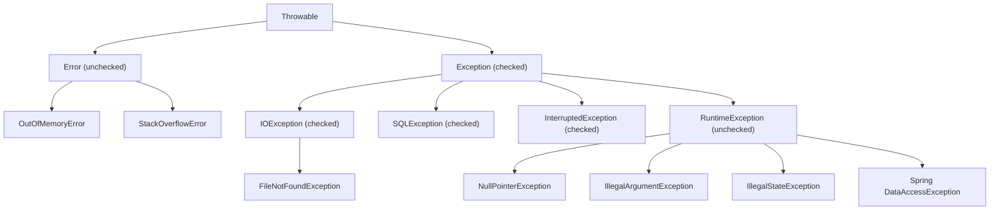
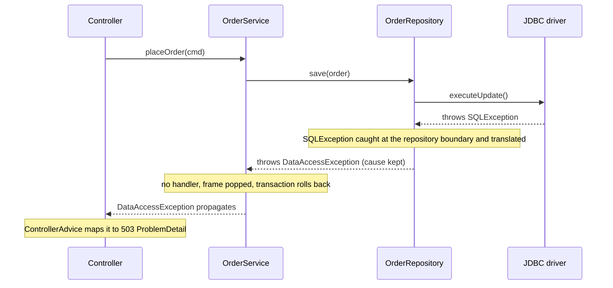
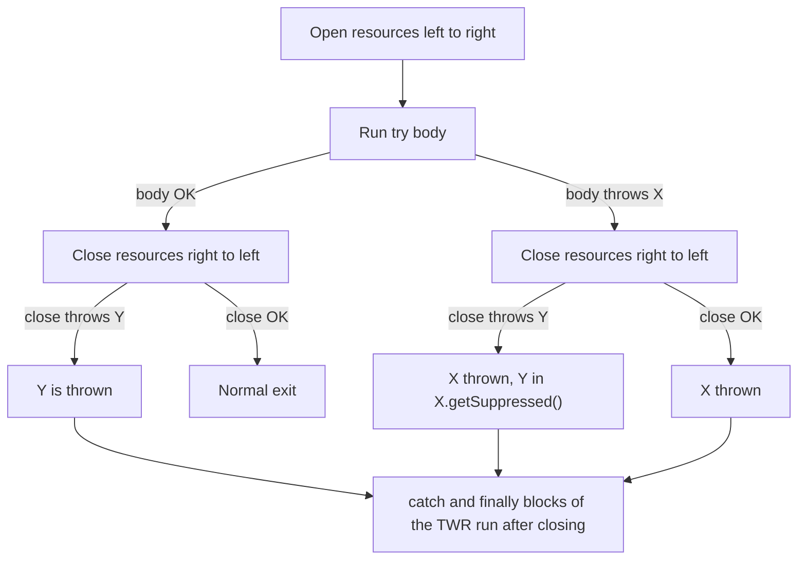

# Exceptions: Checked vs Unchecked, try-with-resources, Best Practices

!!! abstract "TL;DR"
    - **Hierarchy:** `Throwable` → `Error` (JVM/system problems, don't catch) and `Exception`. `RuntimeException` and `Error` (and their subclasses) are **unchecked**. Every other `Throwable` is **checked**: the compiler forces you to catch it or declare it with `throws`.
    - Checked-ness is **only a compiler rule**. The JVM does not know about it, which is why Kotlin has no checked exceptions and why "sneaky throw" works.
    - **try-with-resources** (Java 7) closes resources in **reverse order**, even on failure. If both the body and `close()` throw, the body's exception wins and the close exception is attached via `getSuppressed()`. Java 9 lets you use an existing *effectively final* variable as the resource.
    - The expensive part of an exception is **capturing the stack trace** (`fillInStackTrace`), not `throw` itself. Exceptions are for exceptional paths, not control flow.
    - **Best practices:** throw early, catch late (at a boundary that can act), **always keep the cause**, never swallow, restore the interrupt flag on `InterruptedException`, and translate low-level exceptions into domain exceptions. In Spring, unchecked exceptions roll back `@Transactional` by default and **checked ones do not**.

## Why it matters

Every production incident ends with someone reading a stack trace. How a team throws, wraps, logs and translates exceptions decides whether that trace points straight to the root cause or hides it behind `NullPointerException at line 1 of a log message that says "Something went wrong"`.

Interviewers use exceptions to test three things:

1. **Language precision:** the hierarchy, checked vs unchecked, `finally` semantics, try-with-resources, suppressed exceptions.
2. **API design judgement:** when should a method throw a checked exception? Should a repository leak `SQLException`? What does a REST/GraphQL client receive?
3. **Production maturity:** swallowed exceptions, lost causes, missed transaction rollbacks, poison-pill messages, logging the same error five times.

What came before: C-style error codes. Every caller had to check a return value, and forgetting to check meant silently continuing with bad state. Java's designers (1995) made exceptions part of the type system with **checked exceptions** so the compiler would enforce handling. Thirty years later most modern frameworks (Spring, Hibernate/JPA, Kotlin, most of the JDK's newer APIs) lean towards **unchecked** exceptions. Knowing *why* is a senior-level answer.

## Core concepts

### 1. The hierarchy


*Notice that "unchecked" is defined by two branches, `RuntimeException` and `Error`. Everything else under `Throwable`, including `Exception` itself, is checked.*

| Category | Meaning | Examples | Should you catch it? |
|---|---|---|---|
| **Checked** (`Exception` but not `RuntimeException`) | A *recoverable* condition outside the program's control that the caller is expected to handle | `IOException`, `SQLException`, `InterruptedException`, `TimeoutException` | Yes, where you can do something useful (retry, fallback, translate) |
| **Unchecked** (`RuntimeException`) | Usually a **programming error** or a violated precondition | `NullPointerException`, `IllegalArgumentException`, `IllegalStateException`, `ArithmeticException` | Usually no. Fix the bug, or let a global handler turn it into a response |
| **Error** | Serious problems the application should not try to handle | `OutOfMemoryError`, `StackOverflowError`, `NoClassDefFoundError` | Almost never. Let the process fail fast and restart |

Rule in the JLS (§11.1.1): the unchecked exception classes are `RuntimeException`, `Error` and their subclasses. All other exception classes are checked.

### 2. What the compiler checks (and what it does not)

For a checked exception, the compiler requires the **catch-or-declare** rule:

```java
void read(Path p) throws IOException {        // declare it ...
    Files.readString(p);
}

void readSafe(Path p) {
    try { Files.readString(p); }
    catch (IOException e) { throw new UncheckedIOException(e); }   // ... or catch it
}
```

This is purely a **javac** rule. In bytecode, the `throws` clause is just metadata (the `Exceptions` attribute) and the JVM never verifies it. Consequences:

- Kotlin, Scala and Groovy compile to the same bytecode with no checked exceptions.
- A generic trick ("sneaky throw", used by Lombok's `@SneakyThrows`) can throw a checked exception from a method that does not declare it. Callers then cannot `catch (IOException e)` it directly, because javac says that block is unreachable. This is why sneaky throw is a code smell in shared libraries.

### 3. How `throw` works inside the JVM

When you write `throw e`, javac emits an `athrow` instruction. Each method has an **exception table**: rows of `[startPc, endPc, handlerPc, catchType]`. The JVM:

1. Looks in the current method's exception table for a row whose range covers the current instruction and whose `catchType` is a supertype of the thrown object.
2. If found, clears the operand stack, pushes the exception and jumps to `handlerPc`.
3. If not found, **pops the frame** and repeats in the caller (stack unwinding).
4. If the stack is empty, the thread's `UncaughtExceptionHandler` runs (default: print the stack trace) and the thread dies.


*Notice that a frame without a matching handler (here the service) is simply popped. Only two places did real work: the repository boundary that translated the exception and the web boundary that turned it into a response.*

**Cost:** creating a `Throwable` calls `fillInStackTrace()`, which walks the thread's stack. That is the expensive part, and it grows with stack depth (deep Spring/proxy stacks are 100+ frames). Throwing and catching a pre-created exception is relatively cheap. So:

- Don't use exceptions for normal control flow (e.g. "user not found" in a hot loop where absence is common; return `Optional` instead).
- For high-volume, expected failures you can create a lightweight exception with the protected constructor `Throwable(String message, Throwable cause, boolean enableSuppression, boolean writableStackTrace)` and pass `writableStackTrace = false`. Use this sparingly: you lose the trace.

!!! tip "HotSpot fast-throw"
    For implicit exceptions thrown very often from the same JIT-compiled code (NPE, `ArithmeticException`, `ArrayIndexOutOfBoundsException`, `ClassCastException`), HotSpot can replace them with a **pre-allocated exception that has no stack trace**. Logs then show `java.lang.NullPointerException` with no frames. Disable with `-XX:-OmitStackTraceInFastThrow`, or search older logs for the first occurrence, which still has a full trace.

### 4. `try` / `catch` / `finally` rules

- **Catch order:** more specific types first. `catch (Exception e)` before `catch (IOException e)` is a **compile error** (unreachable catch).
- **Multi-catch (Java 7):** `catch (IOException | SQLException e)`. The alternatives cannot be subclasses of each other, and `e` is implicitly `final`.
- **Precise rethrow (Java 7):** if you catch `Exception e` and rethrow `e` without reassigning it, the compiler knows only the checked types the `try` body can actually throw, so the method only needs to declare those.
- **`finally` always runs** when control leaves the `try` (normal exit, `return`, `break`, exception), except when the JVM halts (`System.exit`, crash, `kill -9`) or the thread never leaves the block.
- **`return` in `finally` overrides everything:** it replaces the `try` block's return value **and discards any in-flight exception**. Never return from `finally`. javac warns about it with `-Xlint:finally`.
- A `return x` in `try` evaluates `x` **before** `finally` runs. Changing a primitive `x` in `finally` does not change the returned value (but mutating an object it points to does).

### 5. try-with-resources (TWR)

Any object implementing `AutoCloseable` (or its subtype `Closeable`) can be a resource:

```java
try (var in = Files.newInputStream(src);
     var out = Files.newOutputStream(dst)) {
    in.transferTo(out);
}   // out.close() runs first, then in.close(), even if transferTo throws
```


*Notice that the body's exception always wins over a close exception, and that any `catch`/`finally` attached to a try-with-resources runs **after** the resources are already closed.*

Key details interviewers probe:

- **Reverse order** of closing, matching the dependency order (a `ResultSet` closes before its `Statement`, which closes before its `Connection`).
- **Suppressed exceptions** (Java 7, `Throwable.addSuppressed/getSuppressed`): before Java 7 a `finally { close(); }` that threw would **replace** the real exception, a classic source of misleading logs.
- **If opening the second resource fails**, the first one is still closed.
- **Java 9 (JEP 213):** you can write `try (conn)` when `conn` is a final or effectively final variable declared earlier.
- `AutoCloseable.close()` throws `Exception` and is not required to be idempotent; `Closeable.close()` throws `IOException` and **must** be idempotent. Make your own `close()` idempotent and declare a narrower exception (or none).
- Common non-I/O resources: `ExecutorService` (implements `AutoCloseable` since **Java 19**, `close()` waits for tasks), `StructuredTaskScope`, `Lock` wrappers, OpenTelemetry `Scope`, `MDC.MDCCloseable`, JDBC objects, `Stream`s backed by files (`Files.lines`).

### 6. Chaining and translation

Wrap a low-level exception into one that makes sense at your layer, and **pass the cause**:

```java
catch (SQLException e) {
    throw new PaymentPersistenceException("Could not save payment " + paymentId, e);   // cause kept
}
```

The log then shows `Caused by: java.sql.SQLException: ...` with the original trace. Losing the cause (`new X(e.getMessage())`) is the single most common exception bug in code reviews.

This is exactly what Spring does with `SQLException`: its `SQLExceptionTranslator` implementations convert SQLState values and vendor error codes into the unchecked `DataAccessException` hierarchy (`DuplicateKeyException`, `DataIntegrityViolationException`, `CannotAcquireLockException`, ...). Services then catch meaningful types without depending on JDBC.

### 7. Checked vs unchecked: the design debate

| Argument for checked | Argument for unchecked |
|---|---|
| Visible in the signature: the caller cannot forget | Signatures leak implementation (`throws SQLException` from a service) |
| Good for genuinely recoverable, expected conditions | Most callers can't recover anyway, so they wrap or rethrow (boilerplate) |
| Compiler-enforced documentation | Checked exceptions don't compose with lambdas/Streams (`Function` can't throw `IOException`) |
| | Adding a new checked exception to an interface breaks every implementer and caller |

Effective Java's guidance (Item 70) is a good rule: use **checked** exceptions for conditions the caller can reasonably recover from, and **runtime** exceptions for programming errors. In practice, modern service code uses mostly unchecked domain exceptions plus a global handler, and keeps checked exceptions at the edges (I/O, `InterruptedException`).

Java 8 added `UncheckedIOException` for exactly this reason: `Files.lines()` returns a `Stream`, and stream operations cannot throw `IOException`. See the Functional Java page for patterns that wrap checked exceptions inside lambdas.

### 8. Exceptions across threads and async code

Exceptions do not cross thread boundaries by themselves:

- `Future.get()` wraps the task's failure in `ExecutionException`. Unwrap with `getCause()`.
- `CompletableFuture.join()` throws `CompletionException`; inside `exceptionally`/`handle` the throwable is often a `CompletionException` wrapping the real cause.
- `executor.execute(runnable)` failures go to the thread's `UncaughtExceptionHandler`; `executor.submit(runnable)` failures are stored in the `Future` and **silently lost** if nobody calls `get()`.
- `InterruptedException` means "someone asked this thread to stop". Catching it **clears** the interrupt flag, so either rethrow it or call `Thread.currentThread().interrupt()` before returning.
- Java 21 virtual threads use the same model. Structured concurrency (`StructuredTaskScope`, still a preview API through Java 25) is designed so a subtask failure cancels siblings and surfaces in the parent.

### 9. Helpful NullPointerExceptions

Since Java 14 (JEP 358, enabled by default from Java 15) NPE messages name the null expression:

```
Cannot invoke "String.length()" because "member.address().city()" is null
```

Local variable names appear only if the class was compiled with `-g` (otherwise you see `"<local4>"`). Interviewers like this as a "what changed in modern Java" question.

## In practice: code & configuration

### Swallowing vs translating

=== "❌ Common mistake"
    ```java
    public Optional<Member> findMember(String id) {
        try {
            return Optional.of(memberClient.fetch(id));
        } catch (Exception e) {                       // too broad: also catches NPEs and bugs
            log.error("Error: " + e.getMessage());    // stack trace and cause lost
            return Optional.empty();                  // caller thinks "member doesn't exist"
        }
    }

    public void process(BlockingQueue<Event> q) {
        try {
            handle(q.take());
        } catch (InterruptedException e) {
            // swallowed: interrupt flag is now cleared, shutdown hangs
        }
    }
    ```

=== "✅ Correct approach"
    ```java
    public Optional<Member> findMember(String id) {
        try {
            return Optional.of(memberClient.fetch(id));
        } catch (MemberNotFoundException e) {         // the one expected, recoverable case
            return Optional.empty();
        } catch (HttpServerErrorException | ResourceAccessException e) {
            // translate: callers see a domain exception, original cause preserved
            throw new UpstreamUnavailableException("member-service", id, e);
        }
        // anything else (bugs) propagates to the global handler
    }

    public void process(BlockingQueue<Event> q) {
        try {
            handle(q.take());
        } catch (InterruptedException e) {
            Thread.currentThread().interrupt();       // restore the flag for the caller
            throw new CancellationException("Interrupted while waiting for events");
        }
    }
    ```

### A small domain exception hierarchy

```java
// Base for all business errors: unchecked, carries a stable error code for clients
public abstract sealed class DomainException extends RuntimeException
        permits NotFoundException, BusinessRuleException, UpstreamUnavailableException {

    private final String code;

    protected DomainException(String code, String message, Throwable cause) {
        super(message, cause);                         // always support a cause
        this.code = code;
    }
    public String code() { return code; }
}

public final class NotFoundException extends DomainException {
    public NotFoundException(String type, String id) {
        super("NOT_FOUND", type + " " + id + " not found", null);
    }
}

public final class BusinessRuleException extends DomainException {
    public BusinessRuleException(String code, String message) {
        super(code, message, null);                    // e.g. "REFILL_TOO_SOON"
    }
}

public final class UpstreamUnavailableException extends DomainException {
    public UpstreamUnavailableException(String system, String id, Throwable cause) {
        super("UPSTREAM_UNAVAILABLE", system + " unavailable for " + id, cause);
    }
}
```

Using a `sealed` hierarchy (Java 17) lets a pattern-matching `switch` over `DomainException` (Java 21) be checked for exhaustiveness. Messages must **not** contain PII or PHI (no names, dates of birth, card numbers) because they end up in logs and responses.

### One global handler: ProblemDetail (Spring Boot 3)

```java
@RestControllerAdvice
class ApiExceptionHandler extends ResponseEntityExceptionHandler {   // handles Spring MVC's own exceptions too

    private static final Logger log = LoggerFactory.getLogger(ApiExceptionHandler.class);

    @ExceptionHandler(NotFoundException.class)
    ProblemDetail notFound(NotFoundException ex) {
        var pd = ProblemDetail.forStatusAndDetail(HttpStatus.NOT_FOUND, ex.getMessage());
        pd.setProperty("code", ex.code());             // stable, machine-readable
        return pd;                                     // no log at ERROR: expected client condition
    }

    @ExceptionHandler(UpstreamUnavailableException.class)
    ProblemDetail upstream(UpstreamUnavailableException ex) {
        log.warn("Upstream failure code={}", ex.code(), ex);   // log ONCE, here, with the throwable
        var pd = ProblemDetail.forStatusAndDetail(HttpStatus.SERVICE_UNAVAILABLE, "Please retry later");
        pd.setProperty("code", ex.code());
        return pd;
    }

    @ExceptionHandler(Exception.class)
    ProblemDetail unexpected(Exception ex) {
        log.error("Unhandled exception", ex);          // full trace in logs ...
        return ProblemDetail.forStatusAndDetail(
                HttpStatus.INTERNAL_SERVER_ERROR, "Unexpected error");  // ... nothing internal in the response
    }
}
```

`ProblemDetail` (Spring Framework 6) implements the `application/problem+json` format from RFC 9457, which obsoletes RFC 7807. Setting `spring.mvc.problemdetails.enabled=true` makes Spring Boot render its own built-in exceptions in the same format.

### Transactions: the checked-exception trap

```java
@Transactional                                         // rolls back ONLY on RuntimeException and Error
public void transfer(Transfer t) throws InsufficientFundsException {
    debit(t.from(), t.amount());
    if (balance(t.from()).signum() < 0) {
        throw new InsufficientFundsException(t.from());   // checked: debit is COMMITTED!
    }
    credit(t.to(), t.amount());
}

@Transactional(rollbackFor = InsufficientFundsException.class)   // fix: explicit rollback rule
public void transferSafe(Transfer t) throws InsufficientFundsException { /* same body */ }
```

Also remember: catching the exception **inside** the `@Transactional` method means the proxy never sees it, so nothing rolls back.

## Real-world usage

- **Spring's exception translation** is the best-known case study in "checked to unchecked". Spring wraps JDBC's checked `SQLException` into the unchecked `DataAccessException` hierarchy so business code stays storage-agnostic. Spring's `RestClient`/`WebClient` errors (`RestClientException`, `WebClientException`) and JPA's `PersistenceException` follow the same unchecked style. Jackson is a useful contrast: in Jackson 2 `JsonProcessingException` extends `IOException` (checked), so Spring MVC wraps it in the unchecked `HttpMessageNotReadableException`; Jackson 3 made its base `JacksonException` unchecked.
- **Kafka consumers (Spring for Apache Kafka):** `DefaultErrorHandler` retries a failed record (default `FixedBackOff(0L, 9)`, i.e. 10 delivery attempts) and then hands it to a recoverer such as `DeadLetterPublishingRecoverer`. Some exceptions are classified as **not retryable** by default, including `DeserializationException`, `MessageConversionException`, `ClassCastException` and `NoSuchMethodException`, because retrying a malformed record never helps. Your own permanent failures (validation, business rule violations) should be added with `addNotRetryableExceptions(...)` so a poison pill goes to the DLQ immediately instead of blocking the partition.
- **GraphQL:** a thrown exception in a data fetcher becomes an entry in the response's `errors` array while other fields still resolve. Spring for GraphQL's `DataFetcherExceptionResolverAdapter` maps domain exceptions to `ErrorType`s (`NOT_FOUND`, `BAD_REQUEST`, `INTERNAL_ERROR`), and anything unmapped is reported as `INTERNAL_ERROR` without leaking internals.
- **Common failure modes seen across the industry** (general patterns, not specific incidents):
    - Connection-pool exhaustion caused by connections not closed on an exception path (fixed by try-with-resources or framework-managed resources).
    - "Log and rethrow" at every layer, producing the same stack trace five times and hiding the real signal.
    - Partial writes because a checked exception escaped a `@Transactional` method without a rollback rule.
- **Healthcare and banking:** exception messages and logs are a data-leak channel. HIPAA (healthcare) and PCI DSS (payments) both restrict where patient data and card data may appear. Keep identifiers opaque, send generic messages to clients, and put details only in access-controlled logs. OWASP lists improper error handling (stack traces in responses) as an information-disclosure risk.

## Trade-offs & production gotchas

| Option | Pros | Cons | Use when |
|---|---|---|---|
| Checked exception | Caller is forced to handle; visible in API | Boilerplate, breaks lambdas, leaks layers | Library/SDK APIs with a recoverable condition the caller must decide on |
| Unchecked domain exception + global handler | Clean signatures, one place to map to HTTP/GraphQL | Easy to forget a case; needs documentation and tests | Spring Boot services (the default choice) |
| `Optional` / empty result | No exception cost; explicit absence | Only says "absent", not *why* | Lookups where "not found" is normal |
| Result/Either type (sealed interface) | Errors are values; exhaustive `switch` with Java 21 pattern matching | Unfamiliar to many Java teams; verbose without library support | Validation pipelines, many expected failure kinds |
| Stackless exception (`writableStackTrace=false`) | Cheap to create | No trace for debugging | Very hot, expected failures only |

!!! warning "Gotchas"
    - **`return` (or `throw`) in `finally`** silently discards the original exception.
    - **`catch (Exception e)` around business code** also catches `NullPointerException` and other bugs, hiding them as "business" outcomes.
    - **`catch (Throwable t)`** catches `OutOfMemoryError` and `StackOverflowError`. After those the JVM may be in a bad state; let it die and restart.
    - **`executor.submit()` swallows exceptions** until someone calls `Future.get()`. Prefer `execute()` with an `UncaughtExceptionHandler`, or always inspect the future.
    - **Checked exceptions do not roll back `@Transactional`** unless you configure `rollbackFor`.
    - **Stack traces vanish** (`OmitStackTraceInFastThrow`) for very frequent NPEs; look for the earliest occurrence or disable the optimisation.
    - **Logging `e.getMessage()` only** drops the stack trace and the cause chain. Pass the exception as the last logger argument: `log.error("msg {}", id, e)`.

## How this connects to my experience

- **Where I used it:**
    - *OptumRx Meteor:* "Designed Kafka-based event-driven workflows with retry and DLQ handling." Retry vs DLQ is an exception-classification decision: which exceptions are transient (retry) and which are permanent (send to DLQ now).
    - *OptumRx Meteor:* "Owned the GraphQL Consumer Service end-to-end, acting as the integration layer between 5 upstream systems." Every upstream failure has to be translated into a consistent GraphQL error without leaking internals.
    - *OptumRx Meteor:* "Established engineering standards around testing, CI/CD, code quality." Exception-handling conventions are a natural part of such standards.
    - *Coriolis (CCKM):* REST APIs over AWS KMS and HSMs (Thales Luna, SafeNet), where vendor SDK exceptions need translating into clean API errors.
- **Talking points:**
    - "In the GraphQL Consumer Service we mapped upstream failures to domain exceptions and resolved them centrally into GraphQL error types, so a failing upstream degraded one field instead of the whole response." *[confirm: the exact mechanism, e.g. `DataFetcherExceptionResolverAdapter` or a DGS exception handler]*
    - "For Kafka consumers we classified exceptions: deserialization and validation errors were non-retryable and went straight to the DLQ, while timeouts and 5xx from upstreams were retried with back-off." *[confirm: the back-off settings and which exceptions you classified]*
    - "In code reviews I flag swallowed exceptions, lost causes and log-and-rethrow, and we added a team convention: translate at the boundary, log once at the edge." *[confirm: whether this was a written standard]*
    - For key-management work: "an HSM or KMS call failing must never leave a key half-rotated, so failures were surfaced, not swallowed, and rotation steps were made retry-safe." *[confirm]*
- **Likely follow-up chain:** "Checked vs unchecked, which do you prefer?" → answer with the recoverable vs programming-error rule and why Spring services use unchecked domain exceptions → "How do they reach the client?" → `@RestControllerAdvice` + `ProblemDetail`, or the GraphQL exception resolver → "How do you decide what to retry in Kafka?" → transient vs permanent classification, `addNotRetryableExceptions`, DLQ with headers holding the original exception → "What about transactions?" → `rollbackFor` for checked exceptions, and catching inside the method prevents rollback.

## Interview questions

### Fundamentals

??? question "Q1. What is the difference between checked and unchecked exceptions?"
    **Answer:** Checked exceptions are subclasses of `Throwable` that are not `RuntimeException` or `Error` (and not their subclasses). The compiler enforces catch-or-declare for them. Unchecked exceptions (`RuntimeException`, `Error` and subclasses) need no declaration. Checked ones are meant for recoverable conditions outside the program's control (I/O, network); unchecked ones usually signal programming errors (null dereference, bad arguments, illegal state).

    **Interviewer listens for:** that `Error` is also unchecked; "compiler-only rule"; a sensible guideline on when to use each.

    **Common wrong answer:** "Checked exceptions happen at compile time and unchecked at runtime." All exceptions happen at runtime; only the *checking* is at compile time.

??? question "Q2. Exception vs Error. Should you ever catch `Error`?"
    **Answer:** `Error` represents serious problems an application should not try to handle: `OutOfMemoryError`, `StackOverflowError`, linkage errors. Catching them usually leaves the JVM in an unknown state. Legitimate exceptions: a top-level framework handler that logs before exiting, or catching a specific `LinkageError`/`NoClassDefFoundError` around optional plugin loading.

    **Interviewer listens for:** "fail fast and let the orchestrator restart the pod"; awareness that `catch (Throwable)` includes `Error`.

    **Common wrong answer:** "Catch Throwable everywhere so the app never crashes." The JVM may be in a broken state after an Error.

??? question "Q3. Does `finally` always run?"
    **Answer:** It runs whenever control leaves the `try` block: normal completion, `return`, `break`, `continue` or an exception. It does not run if the JVM stops first (`System.exit`, `Runtime.halt`, a crash, the process being killed) or if the `try` block never completes (infinite loop, deadlock). A daemon thread killed at JVM shutdown also won't run it.

    **Common wrong answer:** "Always, no exceptions."

    **Interviewer listens for:** every exit path, JVM halt cases, infinite loops or blocked threads.

??? question "Q4. Output prediction: what does `test()` return?"
    ```java
    static int test() {
        int x = 1;
        try {
            return x;
        } finally {
            x = 2;
        }
    }
    ```
    **Answer:** `1`. The return value is evaluated and saved before `finally` runs; changing the local primitive afterwards doesn't affect it. If the method returned a `List` and `finally` called `list.add(...)`, the caller would see the change, because the saved value is a reference. If `finally` itself had `return 2`, the method would return `2` and discard any exception from the `try`.

    **Interviewer listens for:** "value saved before finally", and the reference vs primitive difference.

    **Common wrong answer:** "2, because finally runs last." The return value was already evaluated and saved.

### Intermediate

??? question "Q5. How does try-with-resources work and what are suppressed exceptions?"
    **Answer:** Resources declared in the `try (...)` header must implement `AutoCloseable`. They are closed automatically in reverse order of declaration, whether the body succeeds or throws. If the body throws X and a `close()` throws Y, X is propagated and Y is added with `X.addSuppressed(Y)`, readable via `getSuppressed()`. If only `close()` throws, that exception propagates. Null resources are skipped. Any `catch`/`finally` attached to the TWR runs after the resources are closed. Java 9 allows an effectively final variable declared earlier as the resource.

    **Interviewer listens for:** reverse order, suppressed exceptions, why this beats `finally { close(); }` (which could mask the original exception).

    **Common wrong answer:** "The exception from close replaces the original." The original is propagated and close's is added as suppressed.

??? question "Q6. Output prediction: what is printed?"
    ```java
    record R(String name) implements AutoCloseable {
        R { System.out.println("open " + name); }
        public void close() { System.out.println("close " + name); }
    }
    try (var a = new R("A"); var b = new R("B")) {
        System.out.println("body");
        throw new IllegalStateException("boom");
    } catch (IllegalStateException e) {
        System.out.println("catch " + e.getMessage());
    } finally {
        System.out.println("finally");
    }
    ```
    **Answer:** `open A`, `open B`, `body`, `close B`, `close A`, `catch boom`, `finally`. Resources close in reverse order and **before** the catch block runs.

    **Common wrong answer:** printing `catch boom` before the close lines.

    **Interviewer listens for:** opening in declaration order, closing in reverse, body exception primary.

??? question "Q7. What happens if you put `catch (Exception e)` before `catch (IOException e)`?"
    **Answer:** Compile error: the second catch is unreachable because `IOException` is already handled by the broader `Exception`. Catch blocks are tested top to bottom, so order from most specific to most general. In a multi-catch, the alternatives may not be in a subclass relationship either (`catch (IOException | Exception e)` does not compile).

    **Interviewer listens for:** compile-time unreachable catch, specific before general.

    **Common wrong answer:** "The second catch is just never reached at runtime." It does not compile.

??? question "Q8. Can an overriding method throw a broader checked exception?"
    **Answer:** No. It can throw the same checked exceptions, narrower ones, or none at all, plus any unchecked exceptions. Otherwise code written against the parent type (`catch (IOException e)`) could receive a checked exception it never planned for, breaking substitutability.

    **Interviewer listens for:** Liskov substitution, narrower or none, unchecked allowed.

    **Common wrong answer:** "Yes, as long as it is a subclass of Exception."

??? question "Q9. Why is creating exceptions expensive and what can you do about it?"
    **Answer:** The `Throwable` constructor calls `fillInStackTrace()`, which walks the current thread's stack and records frames. Deep framework stacks make it costlier. The throw/unwind itself is cheaper, especially when the JIT can optimise it. Mitigations: don't use exceptions for expected control flow (return `Optional` or a result type), and for very frequent expected failures use the constructor with `writableStackTrace = false` or override `fillInStackTrace()`. Also know that HotSpot's `OmitStackTraceInFastThrow` can drop traces for hot implicit exceptions.

    **Interviewer listens for:** stack trace capture as the main cost, and no premature optimisation: normal error paths should keep full traces.

    **Common wrong answer:** "try/catch blocks are slow." Entering a try costs almost nothing; creating the exception (stack trace) is the cost.

### Senior

??? question "Q10. Checked exceptions: good or bad design? Where do you use them?"
    **Answer:** They are good for forcing callers to deal with expected, recoverable conditions, but in practice they cause problems at scale: they leak implementation details through layers (`throws SQLException` in a service interface), they don't compose with lambdas and Streams, and adding one to an interface is a breaking change. Most callers can't recover and end up wrapping them. So in Spring Boot services I use an unchecked domain exception hierarchy with stable error codes and a global handler, translate checked exceptions at the boundary where they occur (with the cause kept), and keep checked exceptions for library APIs where the caller genuinely must choose (and for `InterruptedException`, which must be respected).

    **Interviewer listens for:** a balanced view, Effective Java's recoverable vs programming-error rule, Spring's `DataAccessException` as precedent.

    **Common wrong answer:** "Checked exceptions are always bad" or "always use checked so nothing is missed", with no reasoning.

??? question "Q11. How should you handle `InterruptedException`?"
    **Answer:** Interruption is a cooperative cancellation request. When a blocking call throws `InterruptedException`, the thread's interrupt flag is cleared. Either propagate it (declare `throws InterruptedException`) or, if you can't, call `Thread.currentThread().interrupt()` to restore the flag and then exit or throw an unchecked exception. Swallowing it makes executors and graceful shutdown hang because the thread never notices it was asked to stop.

    **Interviewer listens for:** "restore the flag", link to `ExecutorService.shutdownNow()` and Kubernetes graceful shutdown.

    **Common wrong answer:** Catching InterruptedException and doing nothing, which loses the cancellation request.

??? question "Q12. Design error handling for a Spring Boot REST + GraphQL service."
    **Answer:**

    1. A small sealed unchecked hierarchy (`NotFound`, `BusinessRule`, `UpstreamUnavailable`, `Conflict`) with stable codes.
    2. Translate third-party exceptions at the edge adapters (HTTP clients, repositories, Kafka) and keep the cause.
    3. One `@RestControllerAdvice` producing RFC 9457 `ProblemDetail`, plus a GraphQL `DataFetcherExceptionResolverAdapter` mapping the same exceptions to GraphQL `ErrorType`s.
    4. Log once, at the edge: 4xx at INFO/WARN without traces, 5xx at ERROR with traces and a correlation/trace ID.
    5. Never return stack traces or internal messages to clients; no PII/PHI in messages.
    6. `rollbackFor` on any `@Transactional` method that throws checked exceptions.
    7. Test each mapping.

    **Interviewer listens for:** consistent contracts, log once, security (no information disclosure), observability (trace IDs).

    **Common wrong answer:** Returning stack traces or internal messages to clients, or one generic 500 for every failure.

??? question "Q13. Exceptions in `CompletableFuture` and executors: what goes wrong?"
    **Answer:** `submit()` captures the exception inside the `Future`; if no one calls `get()`, it is lost. `get()` wraps it in `ExecutionException`; `join()` wraps it in `CompletionException`, so handlers must unwrap `getCause()`. In a `CompletableFuture` chain, `exceptionally`/`handle` must be added where recovery is wanted, otherwise the failure only surfaces at `join()`. Also, thread-local context (MDC, security context) isn't automatically present in pool threads, so logged errors may lack correlation IDs unless you propagate context.

    **Interviewer listens for:** unwrapping, `submit` vs `execute`, context propagation.

    **Common wrong answer:** "The exception will appear in the logs." Exceptions inside a Future are invisible until someone calls get or join.

### Scenario-based

??? question "Q14. A transfer debited one account but didn't credit the other. The method is `@Transactional`. Why?"
    **Answer:** Likely causes:

    1. A **checked** exception was thrown between the two writes, and Spring by default only rolls back for `RuntimeException`/`Error`, so the debit was committed.
    2. The exception was **caught inside** the method, so the proxy saw a normal return.
    3. The method was called via `this.transfer()` from the same class, so the proxy and transaction were bypassed.

    Fixes: `@Transactional(rollbackFor = ...)` or switch to an unchecked exception, don't swallow inside the method (or call `setRollbackOnly()`), and call through the proxy.

    **Interviewer listens for:** all three causes, especially the checked-exception rule.

    **Common wrong answer:** "@Transactional rolls back on any exception." By default only on unchecked exceptions and errors.

??? question "Q15. Production logs show `java.lang.NullPointerException` with no stack trace at all. What's happening?"
    **Answer:** HotSpot's fast-throw optimisation: after a hot compiled method throws the same implicit exception many times, the JIT replaces it with a preallocated, stackless exception. Find the first occurrences in older logs (they have full traces) or restart with `-XX:-OmitStackTraceInFastThrow`. Another cause: code logging only `e.toString()` or `e.getMessage()` instead of passing the exception to the logger.

    **Interviewer listens for:** JIT fast-throw, stackless preallocated exceptions, find early occurrences or -XX:-OmitStackTraceInFastThrow.

    **Common wrong answer:** "Logback is truncating the stack trace."

??? question "Q16. A Kafka consumer is stuck: the same offset fails forever and lag keeps growing. How do you handle it?"
    **Answer:** It's a poison pill: a record that can never be processed (bad schema, invalid data). Configure `DefaultErrorHandler` with a bounded back-off and a `DeadLetterPublishingRecoverer`, and classify permanent failures (validation, deserialization via `ErrorHandlingDeserializer`, business rule violations) as not retryable so they go to the DLQ immediately. Transient failures (timeouts, 503s) get retries with exponential back-off. Monitor DLQ volume and build a replay path once the bug or data is fixed.

    **Interviewer listens for:** transient vs permanent classification, `ErrorHandlingDeserializer`, DLQ monitoring and replay.

    **Common wrong answer:** "Increase retries until it succeeds." A poison record never succeeds; it needs a DLQ.

??? question "Q17. During a code review you find `catch (Exception e) { log.error(msg); }` in a payment service. What do you say?"
    **Answer:** Three problems: it's too broad (catches bugs like NPE), it swallows the failure (the caller thinks the payment succeeded, a correctness and possibly financial issue), and it loses the stack trace and cause. Ask: what is the expected failure here, and what should the caller do? Catch only that type, translate it into a domain exception with the cause, and let the rest propagate to the global handler that logs once with a trace ID. Also check the message carries no card data.

    **Interviewer listens for:** mentoring tone, business impact, concrete fix.

    **Common wrong answer:** Only asking for a stack trace in the log while keeping the swallowed failure.

## Cheat sheet

| Concept | Remember |
|---|---|
| Unchecked | `RuntimeException` + `Error` and their subclasses |
| Checked | Everything else; catch-or-declare; compiler-only rule |
| Catch order | Specific first; wrong order = compile error |
| Multi-catch | Types joined with a pipe; `e` is final; types must be unrelated |
| `finally` | Runs unless JVM halts; never `return` from it |
| `return x` + `finally` | Value saved before `finally` runs |
| TWR | `AutoCloseable`; reverse close order; closes before catch/finally |
| Suppressed | Body exception wins; close failures in `getSuppressed()` |
| Java 9 TWR | `try (existingEffectivelyFinalVar)` |
| Chaining | Always pass the cause: `new X(msg, e)` |
| Cost | `fillInStackTrace()`; don't use exceptions for control flow |
| Interrupted | Rethrow or `Thread.currentThread().interrupt()` |
| Async | `ExecutionException` / `CompletionException`: unwrap `getCause()` |
| Spring tx | Rolls back on unchecked only; use `rollbackFor` for checked |
| REST | `@RestControllerAdvice` + `ProblemDetail` (RFC 9457) |
| Kafka | Retry transient, DLQ permanent (`addNotRetryableExceptions`) |
| Logging | Log once at the boundary, pass the exception object |

## Sources

1. [JLS Chapter 11: Exceptions](https://docs.oracle.com/javase/specs/jls/se21/html/jls-11.html): checked vs unchecked definitions, compile-time checking, overriding rules.
2. [JLS §14.20: The try statement (including try-with-resources)](https://docs.oracle.com/javase/specs/jls/se21/html/jls-14.html#jls-14.20): `finally`, try-with-resources translation, suppressed exceptions.
3. [The Java Tutorials: Exceptions](https://docs.oracle.com/javase/tutorial/essential/exceptions/): the try-with-resources statement and the checked vs unchecked controversy.
4. [JEP 358: Helpful NullPointerExceptions](https://openjdk.org/jeps/358) and [JEP 213: Milling Project Coin](https://openjdk.org/jeps/213): helpful NPE messages, effectively final resources in TWR.
5. [Spring Framework: Rolling back a declarative transaction](https://docs.spring.io/spring-framework/reference/data-access/transaction/declarative/rolling-back.html): default rollback only for `RuntimeException` and `Error`.
6. [Spring Framework: Error Responses (ProblemDetail)](https://docs.spring.io/spring-framework/reference/web/webmvc/mvc-ann-rest-exceptions.html) and [RFC 9457: Problem Details for HTTP APIs](https://www.rfc-editor.org/rfc/rfc9457).
7. [Spring for Apache Kafka: Handling Exceptions (DefaultErrorHandler)](https://docs.spring.io/spring-kafka/reference/kafka/annotation-error-handling.html): default back-off and non-retryable exceptions.
8. *Effective Java*, 3rd ed., Joshua Bloch, Chapter 10 (Items 69-77): checked vs runtime exceptions, exception translation, failure atomicity, don't ignore exceptions.
