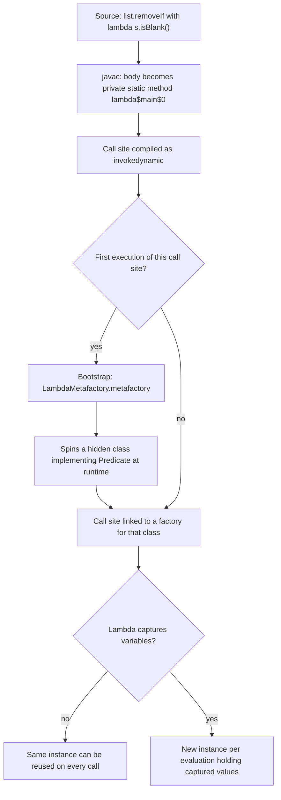
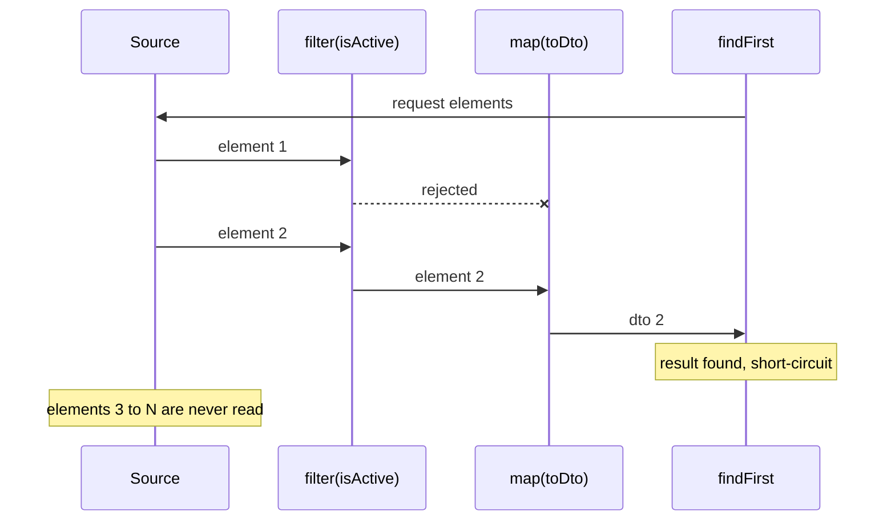

# Functional Java: Lambdas, Functional Interfaces, Streams, Optional

!!! abstract "TL;DR"
    - A **lambda** is an implementation of a **functional interface** (exactly one abstract method). It is compiled to a private method plus an `invokedynamic` call site, **not** to an anonymous inner class file.
    - Lambdas can capture only **effectively final** locals, and `this` inside a lambda means the **enclosing** object (unlike an anonymous class).
    - A **Stream** is a lazy, single-use pipeline: *source → zero or more intermediate ops → one terminal op*. Nothing runs until the terminal op, and elements flow **one at a time through the whole chain** (vertical, not stage by stage).
    - Know the collector traps: `Collectors.toMap` throws on **duplicate keys** and on **null values**. `Stream.toList()` (Java 16) returns an **unmodifiable** list.
    - **Optional** is for **return types** that may have no value. Do not use it for fields, parameters or collections, and never call `get()` without checking. Prefer `map`/`orElseGet`/`orElseThrow`.

## Why it matters

Before Java 8, passing behaviour meant anonymous inner classes: six lines of ceremony for one line of logic. Processing collections meant hand-written loops with mutable accumulators, which are verbose and hard to parallelise safely. Java 8 (2014) added lambdas, method references, `java.util.function`, the Stream API and `Optional`, and these now appear in nearly every modern codebase: Spring's `RestClient` and `WebClient` builders, `CompletableFuture` chains, Kafka Streams topologies, Reactor operators, `Comparator.comparing(...)`, and every `repository.findById(id).orElseThrow(...)`.

Interviewers at Senior/Lead level are not checking whether you can write `.filter().map()`. They check whether you understand:

- **Laziness and evaluation order** (why `peek` sometimes prints nothing).
- **Side effects and thread safety** (why `forEach` into an `ArrayList` from a parallel stream corrupts data).
- **Collector edge cases** that cause production `IllegalStateException`s and `NullPointerException`s.
- **When not to use streams** (hot loops, checked exceptions, simple mutations) and **when not to use Optional**.

## Core concepts

### Functional interfaces

A **functional interface** has exactly **one abstract method** (SAM, single abstract method). It may have any number of `default` and `static` methods, and methods inherited from `Object` (like `equals`) don't count. `@FunctionalInterface` is optional, but it makes the compiler reject a second abstract method, so always add it to your own interfaces.

The core interfaces in `java.util.function`:

| Interface | Method | Shape | Typical use |
|---|---|---|---|
| `Supplier<T>` | `T get()` | `() → T` | Lazy values, `orElseGet`, factories |
| `Consumer<T>` | `void accept(T)` | `T → void` | `forEach`, `ifPresent` |
| `Function<T,R>` | `R apply(T)` | `T → R` | `map`, transformations |
| `Predicate<T>` | `boolean test(T)` | `T → boolean` | `filter`, validation rules |
| `UnaryOperator<T>` | `T apply(T)` | `T → T` | `replaceAll`, `Stream.iterate` |
| `BinaryOperator<T>` | `T apply(T,T)` | `(T,T) → T` | `reduce`, `toMap` merge function |
| `BiFunction<T,U,R>` | `R apply(T,U)` | `(T,U) → R` | `Map.compute`, `merge` |

There are also **primitive specialisations** (`IntPredicate`, `ToLongFunction`, `IntUnaryOperator`, ...) that avoid boxing an `int` into an `Integer` on every call. That matters in hot paths.

Interfaces also have useful **default methods for composition**: `Predicate.and/or/negate`, `Predicate.not(...)` (Java 11), `Function.andThen/compose`, `Comparator.comparing(...).thenComparing(...).reversed()`.

Older interfaces like `Runnable`, `Callable` and `Comparator` are functional interfaces too. That is why you can pass a lambda to `executor.submit(...)`.

### Lambdas and method references

A lambda is an anonymous function whose type is inferred from its **target type** (the functional interface the context expects). The same lambda text can be a `Predicate<String>` in one place and a `Function<String, Boolean>` in another.

Four kinds of method reference:

| Kind | Example | Equivalent lambda |
|---|---|---|
| Static | `Integer::parseInt` | `s -> Integer.parseInt(s)` |
| Bound instance | `log::info` | `msg -> log.info(msg)` |
| Unbound instance | `String::toUpperCase` | `s -> s.toUpperCase()` |
| Constructor | `ArrayList::new` | `() -> new ArrayList<>()` |

A subtle difference: a **bound** reference like `obj::method` evaluates `obj` **once, when the reference is created**. If `obj` is null, you get the `NullPointerException` immediately, not when the lambda runs.

### Capture rules: effectively final and `this`

A lambda can read local variables from the enclosing scope only if they are **final or effectively final** (never reassigned). Why? A captured local is **copied** into the lambda instance. If Java allowed reassignment, the copy and the original could diverge, and with a lambda running on another thread you'd have a data race on a stack variable. Instance fields are not copied (the lambda captures `this`), so they *can* be mutated, which is exactly why mutating fields from lambdas is a thread-safety risk.

`this` inside a lambda refers to the **enclosing instance**. Inside an anonymous class, `this` is the anonymous class instance itself. Lambdas also don't introduce a new scope, so you can't redeclare a local variable name that already exists in the enclosing method.

### How lambdas are compiled (the internals)

Java did **not** implement lambdas as syntactic sugar for anonymous classes (which would create one `.class` file per lambda, each loaded and verified from the jar, and would lock the implementation strategy into the bytecode forever). Instead:


*Notice that the implementation strategy is decided at runtime by the JVM, not baked into the bytecode. This is why lambdas don't bloat the jar with class files, and why a non-capturing lambda usually costs no allocation after the first call (an implementation detail, not a language guarantee).*

Consequences worth saying in an interview:

- Stack traces show frames like `lambda$process$3`, which is the synthetic method.
- **Never rely on lambda identity** (`==`) or use lambdas as locks. The spec leaves identity unspecified.
- Serialising lambdas is fragile. It only works when the target type is `Serializable`, and it depends on the synthetic method names. Avoid it.

### Streams: the pipeline model

A `Stream` is **not a data structure**. It is a description of a computation over a source (a collection, an array, `Files.lines`, a generator).

- **Intermediate operations** (`filter`, `map`, `flatMap`, `sorted`, `distinct`, `limit`, `peek`) return a new stream and are **lazy**: they only record a stage.
- **Terminal operations** (`collect`, `toList`, `forEach`, `reduce`, `count`, `findFirst`, `anyMatch`) trigger execution and close the stream.
- A stream can be consumed **only once**. A second terminal op throws `IllegalStateException: stream has already been operated upon or closed`.

Intermediate ops are either **stateless** (`filter`, `map`: each element handled independently) or **stateful** (`sorted` must buffer all elements before emitting anything; `distinct` emits as it goes but must remember every element seen so far). Some ops are **short-circuiting** (`limit`, `findFirst`, `anyMatch`, `takeWhile`) and can finish without reading the whole source, which is what makes infinite streams usable.

### Lazy, vertical evaluation

Elements are pushed **one at a time through the entire chain** of stateless stages. Stages are fused into a chain of `Sink` objects, so there are no intermediate collections between `filter` and `map`.


*Notice that element 2 travels all the way to the terminal op before element 3 is even read, and the pipeline stops as soon as `findFirst` is satisfied. A stage-by-stage mental model (filter everything, then map everything) gives wrong answers to output-prediction questions.*

A stateful op like `sorted()` breaks this flow: it is a barrier that buffers **all** upstream elements before passing anything on. So `sorted().findFirst()` still reads the whole source (use `min(comparator)` instead).

### Collectors

`collect(Collector)` is a **mutable reduction**. A collector is four functions: `supplier` (new container), `accumulator` (add an element), `combiner` (merge two containers, used in parallel) and `finisher` (final transform), plus characteristics.

The ones you must know cold:

- `toList()`, `toSet()`, `toMap(k, v)`, `toMap(k, v, merge)`, `toMap(k, v, merge, TreeMap::new)`
- `groupingBy(classifier)`, `groupingBy(classifier, downstream)` with downstream `counting()`, `mapping(...)`, `summingLong(...)`, `toSet()`
- `partitioningBy(predicate)` (always returns both `true` and `false` keys)
- `joining(", ", "[", "]")`, `teeing(c1, c2, merger)` (Java 12), `collectingAndThen(...)`

### Stream API additions by version

| Version | Addition |
|---|---|
| 8 | Streams, lambdas, `Optional`, `java.util.function` |
| 9 | `takeWhile`, `dropWhile`, `Stream.ofNullable`, 3-arg `Stream.iterate`; `Optional.or/ifPresentOrElse/stream` |
| 10 | `Optional.orElseThrow()` (no-arg), `Collectors.toUnmodifiableList/Set/Map` |
| 11 | `Optional.isEmpty()`, `Predicate.not` |
| 12 | `Collectors.teeing` |
| 16 | `Stream.toList()`, `mapMulti` |
| 24 | **Stream Gatherers** finalised (JEP 485): `stream.gather(...)` for custom intermediate ops such as `Gatherers.windowFixed(n)` and `Gatherers.mapConcurrent(...)` |

### Optional

`Optional<T>` is a container that holds either one non-null value or nothing. It was designed (in the JDK architects' words) as a limited mechanism for **library method return types** where "no result" must be represented and `null` is likely to cause errors. It makes absence explicit in the method signature, so the caller cannot forget to handle it.

Rules that come straight from that intent:

- **Do** return `Optional<T>` from finders: `Optional<Member> findByMemberId(String id)`.
- **Don't** use it for fields (it is not `Serializable`, and it adds an extra object per field), method parameters (callers can still pass `null` for the Optional itself), or collections (return an empty list, not `Optional<List<T>>`).
- **Never** return `null` from a method declared to return `Optional`.
- `orElse(x)` **always evaluates** `x`, even when a value is present. `orElseGet(() -> x)` evaluates lazily. Use `orElseGet` when the default is expensive or has side effects.
- Prefer `map`, `flatMap`, `filter`, `orElseThrow(...)`, `ifPresentOrElse` over `isPresent()` + `get()`.
- Use `OptionalInt`/`OptionalLong`/`OptionalDouble` for primitives.

## In practice: code & configuration

A realistic service method: aggregating prescription data, grouping and handling absence.

```java
public record Prescription(String id, String memberId, String drugCode,
                           Status status, BigDecimal copay, Instant filledAt) {}

@Service
class PrescriptionSummaryService {

    private final PrescriptionRepository repo;
    private final DrugCatalogClient catalog;

    PrescriptionSummaryService(PrescriptionRepository repo, DrugCatalogClient catalog) {
        this.repo = repo;
        this.catalog = catalog;
    }

    /** Copay totals per drug for active prescriptions, highest first. */
    Map<String, BigDecimal> copayByDrug(String memberId) {
        return repo.findByMemberId(memberId).stream()
            .filter(rx -> rx.status() == Status.ACTIVE)                     // stateless, lazy
            .collect(Collectors.groupingBy(
                Prescription::drugCode,
                Collectors.reducing(BigDecimal.ZERO, Prescription::copay, BigDecimal::add)))
            .entrySet().stream()
            .sorted(Map.Entry.<String, BigDecimal>comparingByValue().reversed())
            .collect(Collectors.toMap(
                Map.Entry::getKey, Map.Entry::getValue,
                (a, b) -> a,                                                // keys are unique here, but be explicit
                LinkedHashMap::new));                                       // keep the sorted order
    }

    /** Latest fill for a member, or 404 via a domain exception. */
    Prescription latestFill(String memberId) {
        return repo.findByMemberId(memberId).stream()
            .filter(rx -> rx.filledAt() != null)
            .max(Comparator.comparing(Prescription::filledAt))               // not sorted().findFirst()
            .orElseThrow(() -> new NotFoundException("No fills for " + memberId));
    }

    /** Display name with a lazy, expensive fallback. */
    String drugName(String drugCode) {
        return catalog.findByCode(drugCode)                                  // Optional<Drug>
            .map(Drug::displayName)
            .filter(Predicate.not(String::isBlank))
            .orElseGet(() -> catalog.legacyLookup(drugCode));                // only called when empty
    }
}
```

### Mistake 1: `toMap` with duplicate keys or null values

=== "❌ Common mistake"
    ```java
    // Throws IllegalStateException("Duplicate key ...") if a member has two plans,
    // and NullPointerException if any planName is null (toMap rejects null values:
    // Objects.requireNonNull in the 2-arg form, Map.merge in the merge-function forms).
    Map<String, String> planByMember = enrollments.stream()
        .collect(Collectors.toMap(Enrollment::memberId, Enrollment::planName));
    ```

=== "✅ Correct approach"
    ```java
    // Decide the duplicate policy explicitly and keep nulls out of the value position.
    Map<String, String> planByMember = enrollments.stream()
        .filter(e -> e.planName() != null)
        .collect(Collectors.toMap(
            Enrollment::memberId,
            Enrollment::planName,
            (existing, replacement) -> replacement));   // latest wins, documented choice

    // Or, if duplicates are legitimate data, keep them all:
    Map<String, List<String>> plansByMember = enrollments.stream()
        .collect(Collectors.groupingBy(Enrollment::memberId,
                 Collectors.mapping(Enrollment::planName, Collectors.toList())));
    ```

### Mistake 2: side effects into shared state

=== "❌ Common mistake"
    ```java
    List<String> ids = new ArrayList<>();
    events.parallelStream()
          .filter(Event::isValid)
          .forEach(e -> ids.add(e.id()));   // ArrayList is not thread-safe: lost elements,
                                            // ArrayIndexOutOfBoundsException, or nulls in the list
    ```

=== "✅ Correct approach"
    ```java
    // Let the collector own the mutable container. In parallel, each thread gets its own
    // container and the combiner merges them, so no shared mutation happens.
    List<String> ids = events.parallelStream()
          .filter(Event::isValid)
          .map(Event::id)
          .toList();                        // Java 16+, unmodifiable, keeps encounter order
    ```

### Mistake 3: Optional misuse

=== "❌ Common mistake"
    ```java
    class Member {
        private Optional<String> middleName;              // field: not Serializable, extra object
    }

    Optional<Member> m = repo.findById(id);
    if (m.isPresent()) {                                  // null check with extra steps
        return m.get().email();
    }
    String fallback = m.map(Member::email)
        .orElse(directory.lookupEmail(id));               // remote call runs EVERY time
    ```

=== "✅ Correct approach"
    ```java
    class Member {
        private String middleName;                        // nullable field, Optional getter
        Optional<String> middleName() { return Optional.ofNullable(middleName); }
    }

    String email = repo.findById(id)
        .map(Member::email)
        .orElseGet(() -> directory.lookupEmail(id));      // runs only when empty

    Member member = repo.findById(id)
        .orElseThrow(() -> new MemberNotFoundException(id));
    ```

### Checked exceptions in lambdas

`Function.apply` doesn't declare checked exceptions, so `paths.stream().map(Files::readString)` does not compile (`IOException`). Options, in order of preference:

```java
// 1. Wrap at the boundary and rethrow as unchecked (UncheckedIOException exists for exactly this).
List<String> contents = paths.stream()
    .map(p -> {
        try { return Files.readString(p); }
        catch (IOException e) { throw new UncheckedIOException(e); }
    })
    .toList();

// 2. Extract the try/catch into a named private method and use a method reference: cleaner to read.
// 3. For "some items may fail" batch jobs, map to a result type instead of throwing
//    (declare these at top level: local sealed types are not allowed):
sealed interface ReadResult permits Ok, Failed {}
record Ok(Path path, String content) implements ReadResult {}
record Failed(Path path, Exception error) implements ReadResult {}
```

## Real-world usage

- **Spring Framework** is built around functional interfaces: `RestClient`/`WebClient` builder customisers, `RouterFunction` (WebFlux functional endpoints), `@Bean Function<String,String>` in Spring Cloud Function and Spring Cloud Stream, where a `java.util.function.Function` or `Consumer` bean **is** the message handler for a Kafka binding.
- **Kafka Streams** topologies (`stream.filter(...).mapValues(...).groupByKey().count()`) use the same functional, lazy pipeline idea, but over an unbounded stream with state stores.
- **Reactor/RxJava** (`Flux`, `Mono`) reuse the vocabulary (`map`, `flatMap`, `filter`) but are push-based, asynchronous and support backpressure. Java Streams are pull-based, synchronous and finite (or short-circuited).
- **Known failure modes** seen in many production codebases:
    - Parallel streams in web servers all share `ForkJoinPool.commonPool()`. One slow, blocking parallel stream (for example making HTTP calls inside `map`) starves every other parallel stream and `CompletableFuture.supplyAsync` call without an executor in the JVM.
    - `Collectors.toMap` crashing on duplicate keys after an upstream data change (two active records for one member). This is a frequent cause of "it worked in test" incidents.
    - Unclosed `Files.lines(...)` / `Files.walk(...)` streams leaking file handles. These streams hold an OS resource and must be used in try-with-resources.
- **Healthcare/banking relevance:** stream code often aggregates money and clinical data. Use `BigDecimal` with `reduce(BigDecimal.ZERO, BigDecimal::add)` rather than `double` sums, and make duplicate/null policies explicit, because a silent "latest wins" merge on claims or transactions is a data-correctness decision that should be reviewed, not an accident.

## Trade-offs & production gotchas

| Option | Pros | Cons | Use when |
|---|---|---|---|
| Stream pipeline | Declarative, composable, easy to read for transform/filter/group | Harder to debug, extra allocations, awkward with checked exceptions | Transforming and aggregating collections |
| Plain `for` loop | Fastest in tight loops, easy `break`/`continue`, checked exceptions OK | More boilerplate, mutable accumulators | Hot paths, complex control flow, index-based logic |
| `parallelStream()` | Easy data parallelism for CPU-bound work | Shared common pool, overhead for small data, order and side-effect pitfalls | Large (10k+ elements as a rough guide; measure), CPU-bound, stateless work on splittable sources (`ArrayList`, arrays) |
| Reactor `Flux` | Async, non-blocking I/O, backpressure | Steeper learning curve, different debugging model | I/O-heavy, streaming or WebFlux services |
| `Optional` return | Absence visible in API, fluent handling | Allocation, misuse as field/param | Finder methods that may not find |
| Nullable return + annotations | Zero overhead | Easy to forget the null check | Performance-critical internals, JPA fields |

!!! warning "Gotcha: `peek` and `count()`"
    Since Java 9, `count()` may skip executing the pipeline entirely if it can compute the size directly from the source. `List.of(1,2,3).stream().peek(System.out::println).count()` can print **nothing**. `peek` is documented as mainly for debugging. Never put business logic in it.

!!! warning "Gotcha: `Stream.toList()` vs `Collectors.toList()`"
    `stream.toList()` returns an **unmodifiable** list (it permits nulls). `Collectors.toList()` makes no guarantee about mutability (in practice it is an `ArrayList`). Swapping one for the other during a "Java 17 cleanup" can break a caller that later calls `list.add(...)` with `UnsupportedOperationException`.

!!! warning "Gotcha: parallel streams and blocking I/O"
    `parallelStream()` runs on `ForkJoinPool.commonPool()`, whose default parallelism is `availableProcessors() - 1`. In a container limited to 2 CPUs that is a single worker thread (plus the calling thread, which also takes part in the work). Blocking calls inside it nearly serialise the work and starve other users of the common pool. For concurrent I/O use an executor (on Java 21+, virtual threads via `Executors.newVirtualThreadPerTaskExecutor()`), or on Java 24+ `Gatherers.mapConcurrent(n, fn)`.

!!! warning "Gotcha: infinite streams"
    `Stream.iterate(1, i -> i * 2).filter(i -> i < 100).toList()` never completes normally: `filter` cannot know no more matches are coming, so it keeps pulling from the infinite source (here the `int` eventually overflows to 0, every 0 passes the filter, and the job dies with `OutOfMemoryError`). Use `takeWhile(i -> i < 100)` or `limit(n)`.

!!! tip "Debugging"
    IntelliJ's *Stream Trace* (Java Stream Debugger) shows each stage's elements. For logs, extract complex lambdas into named private methods, so stack traces show `toDto` instead of `lambda$handle$7`.

## How this connects to my experience

The resume doesn't call out "Java Streams" by name, but every Java/Spring Boot service listed uses this daily. Position it as everyday fluency plus senior-level judgement.

- **Where I used it:**
    - *OptumRx Meteor, GraphQL Consumer Service* ("integration layer between 5 upstream systems"): aggregating and reshaping upstream responses into GraphQL types is classic stream work (`groupingBy`, `toMap` keyed by ID, `flatMap` over nested lists). The same `List<K> → Map<K,V>` shape appears in DataLoader batch functions. *[confirm specific transforms you wrote]*
    - *Kafka-based workflows with retry and DLQ*: Spring Kafka listeners and error handlers are configured with lambdas (for example a `DefaultErrorHandler` wrapping a `DeadLetterPublishingRecoverer`, whose DLQ destination resolver is a `BiFunction<ConsumerRecord<?, ?>, Exception, TopicPartition>`). *[confirm whether you used Spring Kafka's DefaultErrorHandler / DeadLetterPublishingRecoverer]*
    - *Redis caching for reference data*: `cache.get(key).orElseGet(() -> loadAndCache(key))`-style lazy loading is where `orElse` vs `orElseGet` matters. *[confirm]*
    - *Mentoring 5+ engineers and code reviews*: good place to talk about the review rules you enforce (no side effects in `forEach`/`peek`, explicit `toMap` merge functions, no `Optional` fields, no `parallelStream()` in request paths without a benchmark). *[confirm these were actual standards you set]*
- **Talking points:**
    - "I treat streams as a readability tool, not a performance tool. In hot paths I measure, and I'll happily use a loop."
    - "In review I flag `toMap` without a merge function on data that comes from another system, because upstream duplicates are a matter of when, not if." *[confirm]*
    - "We avoided `parallelStream()` in request-handling code because it shares the common pool across the whole JVM. For concurrent upstream calls we used explicit executors / reactive clients." *[confirm]*
    - Money and healthcare data: `BigDecimal` reductions and explicit null/duplicate policies.
- **Likely follow-up chain:** "Stream vs loop?" → "How are streams evaluated?" (lazy, vertical, short-circuit) → "When would you use parallel streams?" (CPU-bound, large, splittable, stateless, measure, common-pool caveat) → "How would you call 5 upstream services concurrently instead?" (CompletableFuture with a dedicated executor or virtual threads, timeouts, partial failure handling) → "How does `Optional` change your API design?"

## Interview questions

### Fundamentals

??? question "Q1. What is a functional interface? Is `Comparator` one, given it declares `equals`?"
    **Answer:** An interface with exactly one abstract method, which lambdas and method references can implement. `Comparator` is one: its only abstract method that counts is `compare`. `equals(Object)` is a public `Object` method, so it doesn't count, and all the other methods (`reversed`, `thenComparing`, `comparing`) are `default` or `static`. `@FunctionalInterface` is optional but makes the compiler enforce the rule.

    **Interviewer listens for:** single abstract method; default/static/Object methods excluded; annotation is a compile-time check, not a requirement.

    **Common wrong answer:** "It must be annotated with `@FunctionalInterface`" or "it can only have one method."

??? question "Q2. Why must captured local variables be effectively final?"
    **Answer:** The lambda gets a **copy** of the local's value, because the lambda may outlive the stack frame (it could run later or on another thread). If reassignment were allowed, the copy and the original could disagree, and concurrent access to a stack variable would be a data race. Fields aren't copied; the lambda captures `this`, so fields can be mutated (which is a thread-safety concern, not a compiler error).

    **Interviewer listens for:** copy semantics, lifetime beyond the stack frame, the difference with fields.

    **Common wrong answer:** "Because lambdas are anonymous classes" (they aren't), or the workaround `int[] counter = {0}` presented as good practice.

??? question "Q3. What is the difference between intermediate and terminal operations? What happens if you reuse a stream?"
    **Answer:** Intermediate operations (`filter`, `map`, `sorted`) are lazy and return a new stream. Terminal operations (`collect`, `forEach`, `count`, `findFirst`) start the computation and consume the stream. A stream can be traversed only once. A second terminal op throws `IllegalStateException`. If you need to reuse, keep a `Supplier<Stream<T>>` or collect into a list first.

    **Interviewer listens for:** laziness, single use, the exception type.

??? question "Q4. `orElse` vs `orElseGet` vs `orElseThrow`?"
    **Answer:** `orElse(value)` takes an already-computed value, so its argument is **always evaluated**, even when the Optional is non-empty. `orElseGet(supplier)` runs the supplier only when empty. `orElseThrow()` (Java 10) throws `NoSuchElementException` when empty and is the preferred replacement for `get()`. `orElseThrow(supplier)` throws your own exception.

    **Interviewer listens for:** eager vs lazy evaluation and a concrete example of a costly default (a DB or remote call).

    **Common wrong answer:** "They're the same, `orElseGet` is just for lambdas."

### Intermediate

??? question "Q5. Predict the output."
    ```java
    Stream.of("a", "b", "c")
        .filter(s -> { System.out.println("filter " + s); return !s.equals("a"); })
        .map(s -> { System.out.println("map " + s); return s.toUpperCase(); })
        .findFirst();
    ```
    **Answer:**
    ```
    filter a
    filter b
    map b
    ```
    Elements flow one at a time through the whole chain. `a` is rejected by `filter`. `b` passes `filter`, goes through `map`, reaches `findFirst`, which short-circuits. `c` is never read. Without a terminal operation, nothing would print at all.

    **Interviewer listens for:** vertical evaluation and short-circuiting.

    **Common wrong answer:** "filter a, filter b, filter c, map b, map c" (stage-by-stage thinking).

??? question "Q6. What does this print, and why might it surprise people? `List.of(1, 2, 3).stream().peek(System.out::println).count();`"
    **Answer:** On Java 9+ it typically prints **nothing** and returns 3. The source is SIZED and no stage changes the size, so `count()` computes the result directly without traversing the elements. On Java 8 it printed 1, 2, 3. Add a `filter` and the elements are traversed again. Lesson: `peek` is for debugging, and side effects inside streams are not guaranteed to run.

    **Interviewer listens for:** knowledge that the implementation may skip stages, and the rule "no logic in peek".

??? question "Q7. `Collectors.toMap` throws in production. What are the two common causes and fixes?"
    **Answer:** (1) **Duplicate keys** → `IllegalStateException: Duplicate key`. Fix: a merge function `(a, b) -> ...` with a deliberate policy, or `groupingBy` if duplicates are valid. (2) **Null values** → `NullPointerException`, because `toMap` rejects null values (the 2-arg form calls `Objects.requireNonNull` on the mapped value; the merge-function forms accumulate with `Map.merge`, which throws on a null value). Fix: filter nulls, map to a sentinel, or collect manually with `collect(HashMap::new, (m, e) -> m.put(...), Map::putAll)`. Also pass a map supplier (`LinkedHashMap::new`, `TreeMap::new`) if order matters.

    **Interviewer listens for:** both causes, the merge function, and treating duplicates as a business decision.

??? question "Q8. `Stream.toList()` vs `Collectors.toList()` vs `Collectors.toUnmodifiableList()`?"
    **Answer:** `Stream.toList()` (Java 16) returns an unmodifiable list and **allows** null elements. `Collectors.toUnmodifiableList()` (Java 10) is also unmodifiable but **throws NPE on nulls**. `Collectors.toList()` gives no guarantee on type or mutability (an `ArrayList` in practice). Choose based on whether callers will mutate and whether nulls can appear.

    **Interviewer listens for:** mutability and null-handling differences, and the migration risk.

??? question "Q9. `map` vs `flatMap`, for both Stream and Optional?"
    **Answer:** `map` applies `T → R` and wraps each result: a function returning a `List` gives `Stream<List<R>>`. `flatMap` applies `T → Stream<R>` and flattens, giving `Stream<R>`. For Optional, `map` with a function that returns an `Optional` gives `Optional<Optional<R>>`. `flatMap` avoids the nesting, which is how you chain finder calls: `findMember(id).flatMap(this::findPrimaryPlan)`. Java 16's `mapMulti` is an imperative alternative to `flatMap` that avoids creating small streams per element.

    **Interviewer listens for:** flattening, the Optional chaining use case.

### Senior

??? question "Q10. How are lambdas implemented in the JVM? Are they anonymous inner classes?"
    **Answer:** No. `javac` moves the lambda body into a private synthetic method (for example `lambda$process$0`) and emits an `invokedynamic` instruction at the creation site. On first execution, the bootstrap method `LambdaMetafactory.metafactory` generates a hidden class implementing the functional interface that delegates to the synthetic method, and links the call site. Non-capturing lambdas can then reuse one instance; capturing lambdas allocate an instance holding the captured values. Benefits: no class file per lambda, lazy linkage, and the JVM can change the strategy without recompiling code. Consequences: lambda identity is unspecified, `this` refers to the enclosing instance, and stack traces show `lambda$...` frames.

    **Interviewer listens for:** `invokedynamic`, `LambdaMetafactory`, runtime class generation, identity not guaranteed.

    **Common wrong answer:** "The compiler turns each lambda into an anonymous inner class."

??? question "Q11. When would you use parallel streams, and why are they often banned in web services?"
    **Answer:** Use them when the work is **CPU-bound**, the data set is **large**, the source **splits well** (arrays, `ArrayList`, `IntStream.range`, not `LinkedList` or `Stream.iterate`), operations are **stateless and non-interfering**, and the combine step is cheap. And only after measuring (JMH). They're often banned in request paths because every parallel stream in the JVM shares `ForkJoinPool.commonPool()` (default parallelism `availableProcessors() - 1`). Blocking I/O inside one request's stream starves others, and many concurrent requests each going parallel just causes contention. Ordered operations like `limit`, `findFirst` and `forEachOrdered` also reduce the benefit. Running a parallel stream inside a custom `ForkJoinPool.submit(...)` works in practice but relies on behaviour that isn't part of the Stream API contract.

    **Interviewer listens for:** common pool, CPU vs I/O, splittability, measure-first, alternatives (executors, virtual threads, `mapConcurrent`).

??? question "Q12. Why shouldn't `Optional` be used as a field or method parameter?"
    **Answer:** It was designed as a return-type mechanism. As a field: it's not `Serializable` (a problem for JPA entities, session state, caches), it adds an object per field, and frameworks like Jackson and JPA need extra support for it. As a parameter: callers can still pass `null` for the `Optional` itself, so you now have three states (null, empty, present), and overloading or a nullable parameter is clearer. For collections, return an empty collection. Keep the field nullable and expose an `Optional` getter instead.

    **Interviewer listens for:** design intent, serialization, the three-state problem, empty collections.

??? question "Q13. What are Stream Gatherers (Java 24) and what problem do they solve?"
    **Answer:** Before Java 24 you could write custom terminal operations (via `Collector`) but not custom **intermediate** operations. JEP 485 adds `Stream.gather(Gatherer)`, where a gatherer can keep state, transform one-to-many or many-to-one, and short-circuit. Built-ins in `java.util.stream.Gatherers` include `windowFixed`, `windowSliding`, `fold`, `scan` and `mapConcurrent` (which runs a function concurrently on virtual threads with a concurrency limit while preserving order). Example: batching IDs into groups of 100 for an upstream bulk API with `ids.stream().gather(Gatherers.windowFixed(100))`.

    **Interviewer listens for:** intermediate vs terminal extensibility, a concrete use case. Bonus for knowing it was preview in 22/23 and final in 24, so it's available on Java 25 LTS.

### Scenario-based

??? question "Q14. A nightly job builds `Map<memberId, Plan>` with `toMap` and started failing after an upstream release. How do you diagnose and fix it?"
    **Answer:** Read the exception: `IllegalStateException: Duplicate key X (attempted merging values A and B)` means the upstream now sends multiple plans per member (for example overlapping coverage periods); a `NullPointerException` thrown from inside `Collectors.toMap` (`Objects.requireNonNull` or `HashMap.merge` in the stack trace) means a null plan. Don't just add `(a, b) -> b`, because "last wins" on enrollment data is a business decision. Confirm the expected cardinality with the upstream/product owner, then either pick a rule (latest effective date via `BinaryOperator.maxBy(comparing(Plan::effectiveFrom))`) or switch to `groupingBy` to keep all plans. Add a test with duplicate and null fixtures, and log/metric the count of duplicates so data drift is visible next time.

    **Interviewer listens for:** reading the error precisely, refusing to silently pick a winner, contract clarification, tests and observability.

??? question "Q15. A teammate parallelised `ids.parallelStream().map(client::fetch).toList()` to speed up 200 HTTP calls. Latency of unrelated endpoints went up. Explain and fix."
    **Answer:** The HTTP calls block threads of `ForkJoinPool.commonPool()`, which has only `cores - 1` workers by default (the calling request thread helps too). The 200 calls barely run in parallel, and every other user of the common pool (other parallel streams, `CompletableFuture.supplyAsync` without an executor) queues behind them. Fix: use a dedicated bounded executor or virtual threads (`Executors.newVirtualThreadPerTaskExecutor()` on Java 21) with a concurrency limit (semaphore) to protect the upstream, plus per-call timeouts. Better still, ask for a bulk endpoint. On Java 24+, `Gatherers.mapConcurrent(20, client::fetch)` is a neat option. Use a reactive client if the service is already reactive.

    **Interviewer listens for:** common pool starvation, I/O vs CPU, bounded concurrency, timeouts, upstream protection.

??? question "Q16. Code review: `List<Dto> out = new ArrayList<>(); orders.stream().filter(o -> o.total() > 100).forEach(o -> out.add(toDto(o)));` What would you say?"
    **Answer:** It works sequentially, but it uses a stream as a loop with a side effect. It becomes a data race if someone later adds `.parallel()`, and it hides the intent. Prefer `orders.stream().filter(o -> o.total() > 100).map(this::toDto).toList()` (or `collect(Collectors.toList())` if callers need to mutate). If the logic needs complex control flow, a plain `for` loop is fine too. Also check whether `total()` is a `double` comparison on money, which should be `BigDecimal.compareTo`.

    **Interviewer listens for:** side-effect-free pipelines, mutability of result, pragmatism (a loop is acceptable), spotting domain issues.

??? question "Q17. Predict the outcome of this Optional chain when `getManager()` returns null."
    ```java
    Optional.of(user)
        .map(User::getManager)
        .map(Manager::getEmail)
        .orElse("none");
    ```
    **Answer:** It returns `"none"`. `Optional.map` wraps the mapper's result with `Optional.ofNullable`, so a null result becomes an empty Optional and the following `map` is skipped. By contrast, `Optional.of(null)` itself throws `NullPointerException`, so if `user` were null you'd need `Optional.ofNullable(user)`.

    **Interviewer listens for:** `map` uses `ofNullable` semantics; `of` vs `ofNullable`.

    **Common wrong answer:** "It throws NullPointerException at `getEmail`."

## Cheat sheet

| Concept | Remember |
|---|---|
| Functional interface | One abstract method; `@FunctionalInterface` is a compile check |
| Big five | `Supplier`, `Consumer`, `Function`, `Predicate`, `BinaryOperator` (+ primitive variants to avoid boxing) |
| Capture | Effectively final locals only; `this` = enclosing instance |
| Lambda internals | Synthetic method + `invokedynamic` + `LambdaMetafactory`; identity unspecified |
| Stream model | Lazy, single-use, vertical evaluation, short-circuit ops stop early |
| Stateful ops | `sorted` buffers everything, `distinct` remembers everything seen; `min/max` beat `sorted().findFirst()` |
| `toMap` | Duplicate key → `IllegalStateException`; null value → NPE; pass merge fn + map supplier |
| `toList()` (16) | Unmodifiable, allows nulls; `Collectors.toList()` = no guarantee |
| `peek` | Debug only; may not run (`count()` on sized source) |
| Parallel | Common pool, `cores - 1`; CPU-bound + large + splittable + stateless; never blocking I/O |
| Checked exceptions | Wrap (`UncheckedIOException`) or map to a result type |
| Optional | Return types only; `orElseGet` is lazy; `orElseThrow()` over `get()`; `map` treats null as empty |
| Java 24 | Gatherers: custom intermediate ops, `windowFixed`, `mapConcurrent` |

## Sources

1. [java.util.stream package summary (Java SE 21 API)](https://docs.oracle.com/en/java/javase/21/docs/api/java.base/java/util/stream/package-summary.html): laziness, statelessness, non-interference, side effects, parallelism and reduction semantics.
2. [java.util.function package (Java SE 21 API)](https://docs.oracle.com/en/java/javase/21/docs/api/java.base/java/util/function/package-summary.html): functional interface definitions.
3. [Optional (Java SE 21 API)](https://docs.oracle.com/en/java/javase/21/docs/api/java.base/java/util/Optional.html): intended use as a return type, `map`/`orElse`/`orElseGet` semantics.
4. [Collectors (Java SE 21 API)](https://docs.oracle.com/en/java/javase/21/docs/api/java.base/java/util/stream/Collectors.html): `toMap` duplicate-key and null behaviour, `groupingBy`, `teeing`.
5. [Stream (Java SE 21 API)](https://docs.oracle.com/en/java/javase/21/docs/api/java.base/java/util/stream/Stream.html): `toList()`, `peek` note on `count()`, `mapMulti`.
6. [LambdaMetafactory (Java SE 21 API)](https://docs.oracle.com/en/java/javase/21/docs/api/java.base/java/lang/invoke/LambdaMetafactory.html) and Brian Goetz, [Translation of Lambda Expressions](https://cr.openjdk.org/~briangoetz/lambda/lambda-translation.html): `invokedynamic` implementation strategy.
7. [JEP 485: Stream Gatherers](https://openjdk.org/jeps/485): custom intermediate operations, final in Java 24.
8. [ForkJoinPool (Java SE 21 API)](https://docs.oracle.com/en/java/javase/21/docs/api/java.base/java/util/concurrent/ForkJoinPool.html): common pool and its default parallelism.
