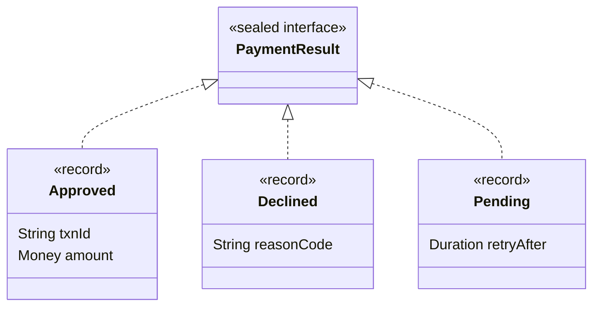
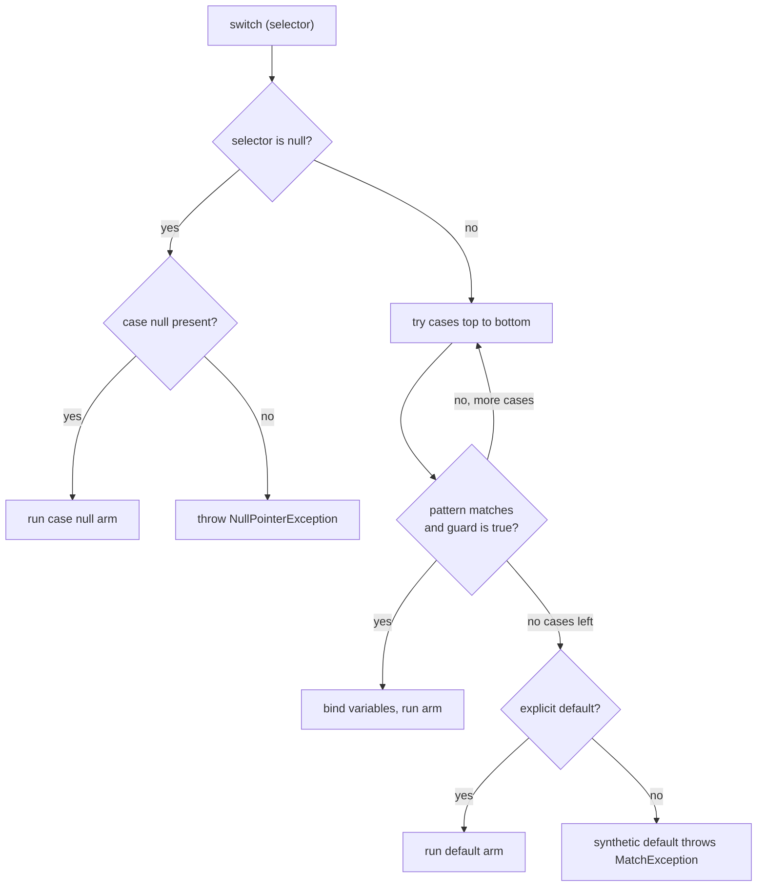

# Modern Java 9–25: Records, Sealed Classes, Pattern Matching, Switch Expressions, Text Blocks

!!! abstract "TL;DR"
    - **Records** (final in Java 16) are transparent, shallowly immutable data carriers: the compiler generates private final fields, a canonical constructor, accessors (`name()`, not `getName()`), `equals`, `hashCode` and `toString`. Validate and defensively copy in a **compact constructor**.
    - **Sealed classes/interfaces** (Java 17) restrict who may extend a type with `permits`. Every permitted subclass must be `final`, `sealed` or `non-sealed`. This gives the compiler a **closed set** of subtypes.
    - **Switch expressions** (Java 14) return a value, use `->` with no fall-through, and must be **exhaustive**. `yield` returns a value from a block.
    - **Pattern matching** (`instanceof` in Java 16, `switch` and **record patterns** in Java 21, unnamed `_` in Java 22) tests a type and binds variables in one step, and can deconstruct records. Over a sealed type, the switch needs no `default`, and adding a subtype becomes a **compile error** wherever it isn't handled.
    - **Text blocks** (Java 15) are multi-line `"""` strings. The position of the closing `"""` decides how much indentation is stripped. They are ordinary `String`s, with no interpolation (String Templates were previewed in 21 and 22, then withdrawn).

## Why it matters

For 20 years, a plain data class in Java meant 50+ lines of fields, constructor, getters, `equals`, `hashCode` and `toString`, or a Lombok dependency. Modelling "one of N shapes" (a payment is a card **or** UPI **or** bank transfer) meant either the Visitor pattern or `instanceof` chains with casts, where the compiler could not tell you that you forgot a case.

Java 14–21 fixed this with a set of features that are designed to work together. Brian Goetz (the Java language architect) calls the result **data-oriented programming**:

- **Records** model *the data* (product types: "A **and** B").
- **Sealed types** model *the alternatives* (sum types: "A **or** B").
- **Pattern matching + switch** *process* the data safely and exhaustively.

Interviewers for Senior/Lead roles use this area to check whether you have kept up since Java 8. "What changed after Java 8 that you actually use?" is a very common opener. They also probe edge cases such as record immutability, JPA entities as records, switch exhaustiveness and `null` handling.

Where it shows up in real systems: DTOs and API payloads, Kafka event types, GraphQL result types, domain commands and results, `@ConfigurationProperties`, and any "status / result / error" hierarchy.

## Core concepts

### Feature timeline (what landed when)

The feature you are asked about almost always has a preview phase first. Interviewers care about the **final** (standard) version.

```mermaid
flowchart LR
    J9["Java 9<br/>modules, List.of, JShell,<br/>private interface methods"] --> J10["Java 10<br/>var"]
    J10 --> J11["Java 11 LTS<br/>HttpClient, String.strip/isBlank"]
    J11 --> J14["Java 14<br/>switch expressions,<br/>helpful NPEs"]
    J14 --> J15["Java 15<br/>text blocks"]
    J15 --> J16["Java 16<br/>records,<br/>instanceof patterns"]
    J16 --> J17["Java 17 LTS<br/>sealed classes"]
    J17 --> J21["Java 21 LTS<br/>switch patterns, record patterns,<br/>virtual threads, sequenced collections"]
    J21 --> J22["Java 22<br/>unnamed variables _"]
    J22 --> J25["Java 25 LTS<br/>flexible constructor bodies,<br/>compact source files, module imports"]
```


*Notice that the data-oriented trio (records, sealed types, pattern matching) only became complete in Java 21. That is why Java 21 is the version most teams target when they say "modern Java".*

A short list of other post-8 features worth naming (each has its own page or topic): `var` local type inference (10), `List.of`/`Map.of` immutable factories (9), `Stream.toList()` (16), helpful `NullPointerException` messages (14), virtual threads (21, see the concurrency topic), sequenced collections (21, see [Collections](03-collections-framework.md)), stream gatherers (24), and scoped values (final in 25).

### Records: transparent data carriers

```java
public record Money(BigDecimal amount, Currency currency) { }
```

The compiler generates:

| Generated member | Detail |
|---|---|
| `private final` fields | One per component. You **cannot** add other instance fields. |
| Canonical constructor | Takes all components in declaration order. |
| Accessors | `amount()`, `currency()`. No `get` prefix. |
| `equals` / `hashCode` | Component-wise. Reference components use `Objects.equals`; primitives compare via the wrapper's `compare` (so for `double`/`float`, `NaN` equals `NaN` and `0.0` does not equal `-0.0`). |
| `toString` | `Money[amount=10.00, currency=INR]`. |

Rules to remember:

- A record is implicitly **`final`** and implicitly extends **`java.lang.Record`**, so it cannot extend another class. It **can** implement interfaces.
- It can have static fields, static methods, instance methods, nested types and extra constructors (each must start by calling another constructor with `this(...)`, so every path ends at the canonical one).
- A nested record is implicitly `static`. Local records (declared inside a method) are allowed and are handy for intermediate stream results.
- **Compact constructor**: a constructor with no parameter list. It runs before the fields are assigned, so you validate or normalise the parameters and the compiler assigns them at the end.

```java
public record Money(BigDecimal amount, Currency currency) {
    public Money {                                       // compact canonical constructor
        Objects.requireNonNull(currency, "currency");
        if (amount.signum() < 0) throw new IllegalArgumentException("negative amount");
        amount = amount.setScale(currency.getDefaultFractionDigits(), RoundingMode.HALF_EVEN); // reassign the parameter
    }                                                    // fields are assigned here, implicitly
}
```

**Internals.** `equals`, `hashCode` and `toString` are not emitted as ordinary bytecode bodies. `javac` generates `invokedynamic` calls bootstrapped by `java.lang.runtime.ObjectMethods`, which lets the JVM choose and optimise the implementation. The class file carries a `Record` attribute listing the components, which reflection exposes through `Class.isRecord()` and `getRecordComponents()`. Serialization treats records specially: deserialization always goes through the **canonical constructor**, so your validation runs. That closes a classic hole where ordinary classes were rebuilt without calling any constructor (see the Serialization, reflection & annotations page).

**"Shallowly immutable"** is the key interview phrase. The fields are final, but if a component is a mutable `List` or an array, the contents can still change. Fix it with `List.copyOf(...)` in the compact constructor. For the full `equals`/`hashCode` contract and immutability rules, see [OOP principles, equals/hashCode, immutability](01-oop-principles-equals-hashcode-contract-immutability.md).

### Sealed classes and interfaces

```java
public sealed interface PaymentMethod permits Card, Upi, BankTransfer { }

public record Card(String last4, String network) implements PaymentMethod { }   // records are final
public record Upi(String vpa) implements PaymentMethod { }
public non-sealed class BankTransfer implements PaymentMethod { }               // re-opens this branch
```

Rules:

- Each permitted subclass must say **`final`**, **`sealed`** (with its own `permits`) or **`non-sealed`** (open again to anyone). Records and enums are implicitly final, so they satisfy this for free.
- Permitted subclasses must be in the **same module**, or in the **same package** if the code is in the unnamed module (classpath).
- `permits` can be omitted when all subclasses are declared in the same source file.
- The JVM enforces it too: the class file has a `PermittedSubclasses` attribute, so another class cannot sneak in at runtime by bytecode tricks. `Class.getPermittedSubclasses()` exposes the list.

Why not just `final` or package-private constructors? `final` allows **zero** subclasses. Package-private constructors hide the hierarchy from callers, so the compiler still cannot reason about it. Sealing keeps the type **public and usable** while making the set of subtypes **known**, which is exactly what exhaustive switch needs.


*Notice that the sealed interface plus records forms a closed "sum of products": the compiler knows there are exactly three shapes, and each shape knows its exact fields. This is what lets a switch be checked for completeness.*

### Switch expressions (Java 14)

The old `switch` statement had fall-through, needed `break` everywhere, and could not return a value. The new form fixes all three:

```java
int days = switch (month) {
    case FEBRUARY -> 28;
    case APRIL, JUNE, SEPTEMBER, NOVEMBER -> 30;           // multiple labels, no fall-through
    default -> {
        log.debug("31-day month {}", month);
        yield 31;                                          // yield returns a value from a block
    }
};
```

- `->` arms never fall through. You can still use the `:` form with `yield` in an expression, but mixing `->` and `:` in one switch is not allowed.
- A switch **expression** must be **exhaustive**. Over an enum, listing every constant is enough, so you can omit `default`. The compiler then adds a hidden default that throws `MatchException` (Java 21+) if a new constant appears in a recompiled enum but not in your compiled switch.
- `yield` is a context-sensitive keyword, not `return`. `return` inside a switch expression is a compile error.

### Pattern matching for `instanceof` (Java 16)

```java
// Before: test, then cast (repeating the type and risking a wrong cast)
if (obj instanceof String) { String s = (String) obj; use(s.length()); }

// After: type pattern with a binding variable
if (obj instanceof String s && !s.isBlank()) { use(s.length()); }
```

The binding `s` is in scope only where the match is **definitely true** ("flow scoping"). It works with `&&` but not with `||`. A common idiom is `if (!(obj instanceof String s)) return;` and then `s` is in scope for the rest of the method. A neat `equals` implementation: `return o instanceof Money m && amount.equals(m.amount) && currency.equals(m.currency);`.

### Pattern matching for `switch` and record patterns (Java 21)

Java 21 lets `case` labels hold **patterns**, not just constants, and lets patterns **deconstruct** records:

```java
String describe(PaymentResult r) {
    return switch (r) {
        case Approved(var txnId, var amount) -> "OK " + txnId + " " + amount;       // record pattern
        case Declined(String code) when code.startsWith("51") -> "Insufficient funds"; // guard
        case Declined(String code) -> "Declined " + code;
        case Pending p -> "Retry in " + p.retryAfter();                              // type pattern
    };                                                                               // no default: sealed + exhaustive
}
```

Key rules:

- **Guards**: `case Type t when condition`. A guarded case only matches if the condition is true.
- **Order matters, and the compiler checks it.** A case is a compile error if an earlier case **dominates** it (for example `case CharSequence cs` before `case String s`, or an unguarded `Declined d` before a guarded `Declined d when ...`). The JEP's advice: constants first, then guarded patterns, then unguarded patterns.
- **`null`**: a switch without `case null` still throws `NullPointerException` (backward compatible). You may now write `case null ->` or `case null, default ->`.
- **Exhaustiveness**: over a sealed type, covering every permitted subtype is enough. If a new subtype appears at runtime from separate compilation, the compiler-inserted default throws **`MatchException`**.
- **Nested patterns**: `case Approved(var id, Money(var amt, var cur))` deconstructs several levels at once. Record patterns are type-inferred for generics (`case Box(var v)` works for `Box<T>`).
- **Unnamed patterns `_`** (Java 22): `case Pending _ ->` or `case Approved(var id, _)` when you don't need a component.
- **Primitive types in patterns** (`case int i when i > 100`) are still **preview** in Java 25 (JEP 507, third preview). Don't present it as standard.

Internally, a pattern switch compiles to an `invokedynamic` call to `java.lang.runtime.SwitchBootstraps.typeSwitch`, which returns the index of the first matching case. Because the dispatch strategy lives in the runtime rather than in your bytecode, the JDK can improve it without recompiling your code. Don't claim it is faster than a hand-written `instanceof` chain: the benefit is safety and readability, and performance is roughly comparable.


*Notice that null is checked before any pattern, and that a `default`-free switch over a sealed type is not "unsafe": the compiler proved it exhaustive at compile time, and the synthetic default only fires if the hierarchy changed after compilation.*

### Text blocks (Java 15)

```java
String query = """
    query Member($id: ID!) {
      member(id: $id) { name prescriptions { drugName } }
    }
    """;                         // closing delimiter at 4 spaces → 4 spaces of incidental indentation stripped
```

How the compiler processes a text block, in order:

1. **Line terminators** are normalised to `\n`, whatever the source file uses.
2. **Incidental whitespace** is removed: the smallest common indentation across all non-blank lines **and the closing `"""` line** is stripped. Move the closing delimiter left to keep more indentation. Trailing spaces on each line are removed.
3. **Escape sequences** are interpreted last. New ones: `\<newline>` joins lines (no `\n` inserted), and `\s` is a single space that survives trailing-space stripping.

The result is a normal compile-time constant `String`, interned like any literal (see [String internals](02-string-internals.md)). There is **no interpolation**: use `.formatted(...)` (Java 15) or `String.format`. String Templates (`STR."..."`) were previewed in Java 21 and 22 and then **withdrawn**, so they do not exist in Java 23+.

### Java 25 LTS additions worth knowing

- **Flexible constructor bodies** (JEP 513, final): statements such as argument validation may now appear **before** `super(...)` or `this(...)`, as long as they don't read from or call methods on the object under construction (assigning to its own uninitialised fields is allowed). Useful in records' non-canonical constructors and in subclasses that need to validate before calling the parent.
- **Compact source files and instance main methods** (JEP 512, final): `void main() { IO.println("hi"); }` is a complete program. Good for scripts and teaching, not relevant to services.
- **Module import declarations** (JEP 511, final): `import module java.base;` imports all packages exported by a module (and by the modules it requires transitively).

## In practice: code & configuration

A typical service: a Kafka consumer receives a payment event and maps the result to an API response. The common mistake is an open hierarchy plus `instanceof` chains with a `default` that hides missing cases.

=== "❌ Common mistake"
    ```java
    // Open hierarchy: anyone can add a subclass, compiler can't help.
    public abstract class PaymentResult { }
    public class Approved extends PaymentResult { public String txnId; public List<String> tags; }
    public class Declined extends PaymentResult { public String code; }
    // Later someone adds: public class Pending extends PaymentResult { ... }

    public ResponseEntity<?> toResponse(PaymentResult r) {
        if (r instanceof Approved) {
            Approved a = (Approved) r;                        // redundant cast
            return ResponseEntity.ok(a.txnId);
        } else if (r instanceof Declined) {
            return ResponseEntity.unprocessableEntity().body(((Declined) r).code);
        } else {
            return ResponseEntity.internalServerError().build(); // Pending silently becomes a 500
        }
    }
    ```

=== "✅ Correct approach"
    ```java
    public sealed interface PaymentResult permits Approved, Declined, Pending { }

    public record Approved(String txnId, Money amount, List<String> tags) implements PaymentResult {
        public Approved {
            Objects.requireNonNull(txnId, "txnId");
            tags = List.copyOf(tags);                         // defensive copy: deep enough to stay immutable
        }
    }
    public record Declined(String code, String message) implements PaymentResult { }
    public record Pending(Duration retryAfter) implements PaymentResult { }

    @RestController
    class PaymentController {
        ResponseEntity<?> toResponse(PaymentResult r) {
            return switch (r) {                                // exhaustive: no default on purpose
                case Approved(var id, var amount, _) -> ResponseEntity.ok(new ApprovedDto(id, amount)); // _ needs Java 22+; on 21 write `var tags`
                case Declined(var code, var msg) when code.startsWith("5") -> ResponseEntity.status(502).body(msg);
                case Declined(var code, var msg) -> ResponseEntity.unprocessableEntity().body(msg);
                case Pending(var after) -> ResponseEntity.accepted()
                        .header("Retry-After", String.valueOf(after.toSeconds())).build();
            };  // adding a 4th permitted type breaks compilation HERE, not production
        }
    }
    ```

Records also fit Spring Boot configuration and DTOs directly:

```java
@ConfigurationProperties(prefix = "pharmacy.client")       // constructor binding is automatic for records
public record PharmacyClientProperties(
        URI baseUrl,
        @DefaultValue("2s") Duration timeout,               // default when the property is missing
        @DefaultValue("3") int maxRetries) { }

public record MemberDto(String id, String name, LocalDate dob) { }  // Jackson 2.12+ (de)serialises records natively
```

## Real-world usage

- **The JDK itself** uses sealed types and records internally, and `java.lang.constant.ConstantDesc` is a sealed interface, which shows the pattern at platform level.
- **Spring Boot 3** (Java 17 baseline) and **Spring Boot 4** support records for `@ConfigurationProperties`, request/response bodies via Jackson, Spring Data projections, and Spring for GraphQL types. Records are now the default choice for DTOs in new Spring code.
- **JPA/Hibernate**: an `@Entity` **cannot** be a record (entities need a no-arg constructor, mutable state and proxyable non-final classes). Records work well as **DTO projections** (`select new com.x.MemberDto(m.id, m.name) ...`) and, from Hibernate 6.2 / Jakarta Persistence 3.2, as `@Embeddable` value types.
- **Event-driven systems** model event envelopes as `sealed interface MemberEvent permits Enrolled, PlanChanged, Terminated` with record payloads. A consumer's `switch` then fails to compile when a new event type is added, instead of dropping messages into a DLQ at runtime.
- **Banking and healthcare relevance**: domain states (claim status, payment outcome, prior-authorisation decision) are regulated and auditable. Exhaustive handling is a real correctness win: a forgotten "Pending" or "Partially approved" case is exactly the kind of bug that causes wrong patient or customer communication. Immutable records also make audit snapshots and concurrent sharing safe.
- **Upgrade reality**: many enterprises moved from 8 or 11 to 17 or 21 because Spring Boot 3 requires Java 17. Lombok `@Value` classes are often migrated to records during that upgrade.

## Trade-offs & production gotchas

| Option | Pros | Cons | Use when |
|---|---|---|---|
| Record | Zero boilerplate, value semantics, safe deserialization via canonical constructor | Can't extend a class, no extra instance fields, shallow immutability, accessor names differ from JavaBeans | DTOs, events, value objects, config, map keys |
| Lombok `@Value` / `@Builder` | Builders, `toBuilder`, JavaBean getters | Annotation processor dependency, hidden generated code, IDE/build tooling support required | Many optional fields, frameworks that require getters |
| Plain class | Full control, mutability, inheritance | Boilerplate, easy to break `equals`/`hashCode` | JPA entities, stateful objects |
| Sealed + pattern switch | Compile-time exhaustiveness, no Visitor boilerplate | All subtypes in one module/package; adding a subtype touches every switch (by design) | Closed domain alternatives you own |
| Visitor pattern | Works on old Java | Verbose, double dispatch hard to read | Pre-17 codebases |
| Open interface + polymorphism | Easy to add new types | Hard to add new operations across types | Plugins, extension points owned by others |

!!! warning "Gotcha: records are only shallowly immutable"
    `record Order(List<Item> items)` exposes the caller's list. `order.items().add(x)` mutates it, and so does the original caller's reference. Use `items = List.copyOf(items)` in the compact constructor (this also rejects `null` elements). Array components are worse: `equals` compares arrays by **reference**, so two records with equal array contents are **not equal**.

!!! warning "Gotcha: `default` defeats exhaustiveness"
    Adding `default -> throw new IllegalStateException()` to a switch over a sealed type compiles fine, but now a new subtype goes to `default` at runtime instead of failing at compile time. Leave `default` out for sealed hierarchies you own.

!!! warning "Gotcha: switch and null"
    A pattern switch without `case null` still throws `NullPointerException`, even if it has `default`. `default` does **not** match `null`. Use `case null, default ->` if you really want both together.

!!! warning "Gotcha: frameworks expecting JavaBeans"
    Some older libraries (JSP EL, some mappers, old Jackson versions before 2.12) look for `getX()`. Records expose `x()`. Check versions before migrating. MapStruct supports records in recent versions.

!!! warning "Gotcha: text block trailing newline"
    Placing the closing `"""` on its own line adds a final `\n`. Placing it right after the last character does not, but then it also stops controlling the indentation. This matters for signatures, hashes and exact-match tests.

## How this connects to my experience

The resume doesn't name specific Java versions, so position this as "how I'd write it in current Java" and confirm what you actually used.

- **Where I used it:**
    - **OptumRx Meteor (GraphQL Consumer Service)**: integration layer between 5 upstream systems. Natural fit for records as immutable DTOs for upstream responses and GraphQL types, and text blocks for GraphQL query strings in tests. *[confirm: Java version (17 or 21?) and whether records were used for DTOs]*
    - **Kafka event-driven workflows with retry and DLQ**: model event types as a sealed interface with record payloads, and use an exhaustive pattern switch in the consumer so a new event type can't silently fall to the DLQ. *[confirm: whether you used sealed types or a type field plus if/else]*
    - **Redis caching of reference data**: records make good cache values and keys because of value-based `equals`/`hashCode` and immutability.
    - **Spring Boot 3 migration**, if any project moved from Boot 2 to Boot 3 (Java 17 baseline). *[confirm: did you lead or take part in a Java 8/11 → 17/21 upgrade?]*
- **Talking points:**
    - "I prefer records for DTOs and events because immutability and value equality come for free, and deserialization goes through the canonical constructor so validation always runs."
    - "Sealed interfaces plus pattern switch turn 'did we handle every case?' into a compile-time check. In a regulated healthcare domain, an unhandled status is a correctness issue, not just a bug."
    - As a reviewer/mentor (resume: mentored 5+ engineers, set engineering standards): you can push team standards like "records for DTOs, no `default` on sealed switches, `List.copyOf` in compact constructors". *[confirm: whether this was an actual standard you set]*
- **Likely follow-up chain:** "What's new since Java 8 that you use?" → "Why records over Lombok?" → "Can a JPA entity be a record?" (no, and why) → "How do sealed types and switch work together?" → "What happens if a new subtype is added after compilation?" (`MatchException` from the synthetic default). Answer each in one or two sentences, then give a concrete example from the payment or prescription domain.

## Interview questions

### Fundamentals

??? question "Q1. What is a record, and what does the compiler generate for it?"
    **Answer:** A record is a final, transparent carrier for a fixed set of values. For each component the compiler generates a `private final` field and a public accessor with the same name (`amount()`). It also generates a canonical constructor and component-based `equals`, `hashCode` and `toString`. It implicitly extends `java.lang.Record`.

    **Interviewer listens for:** final class, no extra instance fields, accessors without `get`, value-based equality, can implement interfaces.

    **Common wrong answer:** "Records are deeply immutable" or "records can extend other classes."

??? question "Q2. What is a compact constructor?"
    **Answer:** A canonical constructor declared without a parameter list: `public Money { ... }`. The parameters are implicitly available. You validate or normalise them (you may reassign the parameter, not the field), and the compiler assigns the fields at the end. It's the right place for `requireNonNull`, range checks and `List.copyOf`.

    **Common wrong answer:** Writing `this.amount = amount` inside it. That is a compile error, because field assignment happens implicitly.

    **Interviewer listens for:** implicit parameters, validation and normalisation, fields assigned automatically.

??? question "Q3. Switch statement vs switch expression?"
    **Answer:** A switch expression produces a value, uses `->` arms with no fall-through, allows multiple labels per arm (`case A, B ->`), uses `yield` to return a value from a block, and must be exhaustive. The old statement form falls through without `break` and needs no exhaustiveness (except for pattern switches).

    **Interviewer listens for:** exhaustiveness, `yield` vs `return`, no fall-through.

    **Common wrong answer:** "Switch expressions still fall through without break."

??? question "Q4. What does a sealed class give you that `final` doesn't?"
    **Answer:** `final` allows no subclasses. `sealed ... permits A, B` allows exactly the listed subclasses, each of which must be `final`, `sealed` or `non-sealed`. The type stays public and extensible in a controlled way, and the compiler knows the full set of subtypes, which enables exhaustive pattern matching.

    **Interviewer listens for:** exact permitted subclasses, final/sealed/non-sealed, exhaustive switches.

    **Common wrong answer:** "sealed is just final with exceptions." The point is that the compiler knows the full set of subtypes.

??? question "Q5. Output prediction: what does this print?"
    ```java
    record Point(int x, int[] tags) { }
    var a = new Point(1, new int[]{1, 2});
    var b = new Point(1, new int[]{1, 2});
    System.out.println(a.equals(b) + " " + (a.hashCode() == b.hashCode()));
    ```
    **Answer:** Almost certainly `false false`. The generated `equals` compares reference components with `Objects.equals`, which for arrays is reference equality. The two arrays are different objects. (The hash codes use the array's identity hash, so they differ in practice.)

    **Interviewer listens for:** knowing equality is per-component and arrays don't override `equals`; suggesting `List<Integer>` or a custom `equals` using `Arrays.equals`.

    **Common wrong answer:** "true true, because records compare all fields." They compare arrays by reference.

### Intermediate

??? question "Q6. Can a JPA entity be a record? Where do records fit with JPA?"
    **Answer:** No. Entities need a no-arg constructor, mutable state for dirty checking and lazy-loading proxies (which require non-final classes). Records are final with final fields and only a canonical constructor. Records do fit as DTO projections (`select new ...Dto(...)` or Spring Data interface/class projections) and, from Hibernate 6.2 / Jakarta Persistence 3.2, as `@Embeddable` values.

    **Common wrong answer:** "Yes, just add `@Entity`."

    **Interviewer listens for:** no-arg constructor, mutability and proxies needed; records as projections and embeddables.

??? question "Q7. Explain flow scoping of pattern variables."
    **Answer:** A binding variable from `instanceof` is in scope only where the match is definitely true. `if (o instanceof String s && s.length() > 3)` works. `if (o instanceof String s || s.isEmpty())` does not compile. `if (!(o instanceof String s)) return;` puts `s` in scope after the `if`.

    **Interviewer listens for:** in scope only where the match is definitely true, negated-if pattern.

    **Common wrong answer:** "The variable is in scope for the whole method."

??? question "Q8. What is dominance in a pattern switch? Give an example of a compile error."
    **Answer:** A case is dominated if an earlier case matches everything it matches. `case CharSequence cs -> ...; case String s -> ...` fails because `String` is a `CharSequence`. An unguarded `case Declined d` before `case Declined d when ...` also fails. Order: constants, then guarded patterns, then unguarded patterns.

    **Interviewer listens for:** earlier case matching everything a later case matches, order specific first.

    **Common wrong answer:** "The compiler picks the most specific case automatically."

??? question "Q9. Gotcha: what happens here when `status` is null?"
    ```java
    String label = switch (status) {    // status is an Object, value null
        case String s -> "text";
        default -> "other";
    };
    ```
    **Answer:** It throws `NullPointerException`. `default` does not match `null`. To handle it, add `case null -> ...` or combine `case null, default -> "other"`.

    **Common wrong answer:** "It returns `other`."

    **Interviewer listens for:** default does not match null, case null or case null, default.

??? question "Q10. How do text blocks handle indentation?"
    **Answer:** The compiler normalises line endings to `\n`, then strips incidental whitespace: the minimum indentation across non-blank lines and the closing delimiter line. Trailing spaces are removed. Escapes are processed last. `\` at line end joins lines and `\s` keeps a space. The result is an ordinary interned `String`. There is no interpolation, so use `.formatted()`.

    **Interviewer listens for:** incidental whitespace stripped by the minimum indent and closing delimiter position.

    **Common wrong answer:** "The text keeps exactly the indentation you see in the source."

### Senior

??? question "Q11. How do records, sealed types and pattern matching work together? Why is this better than the Visitor pattern?"
    **Answer:** Records model product types (fields), sealed types model sum types (alternatives), and pattern switch deconstructs and dispatches over them with compile-time exhaustiveness. This is data-oriented programming. Compared with Visitor, there is no `accept`/`visit` double dispatch boilerplate, operations live where they are used, and adding a new subtype still produces compile errors wherever it's unhandled (the main benefit Visitor gave). Classic OO polymorphism is still better when the set of *types* changes often and the set of *operations* is stable, which is the expression problem.

    **Interviewer listens for:** sum vs product types, exhaustiveness, knowing when polymorphism is still the right call.

    **Common wrong answer:** "It is just shorter syntax." The gain is compile-time exhaustiveness when types are added.

??? question "Q12. A switch over a sealed interface has no default. A new permitted subclass is added and shipped in a library, but your service isn't recompiled. What happens?"
    **Answer:** The compiler inserted a synthetic default in your switch. At runtime, the new subtype matches no case, so it throws `MatchException`. (Exhaustive enum switch expressions also throw `MatchException` from Java 21, instead of the older `IncompatibleClassChangeError`.) Recompiling then shows a compile error pointing to the missing case. Lesson: sealed hierarchies shared across deployable units are a contract, so version them carefully.

    **Interviewer listens for:** synthetic default, MatchException at runtime, separate compilation.

    **Common wrong answer:** "It fails to compile." Only code compiled against the new library version fails to compile.

??? question "Q13. How do records behave with Java serialization and why is that safer?"
    **Answer:** Record serialization writes only the component values, and deserialization always calls the canonical constructor. So invariants in the compact constructor are enforced, unlike normal classes where deserialization creates objects without running constructors (a known source of gadget attacks and broken invariants). You can't customise it with `writeObject`/`readObject`. Jackson (2.12+) also binds records through the canonical constructor.

    **Interviewer listens for:** only components written, canonical constructor on read, invariants enforced.

    **Common wrong answer:** "Records cannot be serialised."

??? question "Q14. Records vs Lombok: what would you standardise on for a team, and why?"
    **Answer:** Records for immutable DTOs, events, config properties and value objects: they're language-level, need no annotation processor, and have safe deserialization. Keep Lombok (or hand-written classes) where you need builders for many optional fields, JavaBean getters for older frameworks, or mutable JPA entities. Many teams use records plus a static factory or small builder for complex cases. The decision is about consistency and tool risk, not taste.

    **Interviewer listens for:** records for immutable data, Lombok only where builders or JPA need it, consistency.

    **Common wrong answer:** "Remove Lombok everywhere at once." Entities and builder-heavy types still need it or hand-written code.

### Scenario-based

??? question "Q15. Kafka consumer: new event types keep getting added and some end up in the DLQ because the consumer didn't handle them. How would you redesign this?"
    **Answer:** Model the events as a `sealed interface MemberEvent permits ...` with record payloads. Deserialize to the right record using a type header and Jackson polymorphic config (`@JsonTypeInfo`/`@JsonSubTypes`). Dispatch with an exhaustive pattern switch without `default`. Adding a new event type now fails compilation in every consumer that doesn't handle it. For events from *other* teams' services, also keep an explicit "unknown type" path (log, metric, DLQ) at the deserialization boundary, because the compiler can't protect you across deployment boundaries.

    **Interviewer listens for:** compile-time safety inside the service plus defensive handling at the network boundary.

    **Common wrong answer:** Adding a default branch that logs and skips unknown events, which hides the gap.

??? question "Q16. A teammate's record DTO is used as a Redis cache value and a HashMap key, and cache results are occasionally wrong. What would you check?"
    **Answer:**

    1. Mutable components: a `List` or array inside the record mutated after it was used as a key changes its `hashCode`, so it is lost in the map. Fix with `List.copyOf`.
    2. Array components: equality by reference, so lookups miss.
    3. Custom `equals` overridden without `hashCode`.
    4. Serialization format changes: renaming or reordering record components changes the JSON/serialized shape, so old cached entries fail to deserialize. Version keys or flush the cache on deploy.

    **Interviewer listens for:** mutable components, arrays, custom equals, serialisation shape.

    **Common wrong answer:** "Records are immutable, so they cannot cause this."

??? question "Q17. You're upgrading a Spring Boot 2 / Java 11 service to Spring Boot 3 / Java 21. Which modern-Java features would you adopt first, and what would you avoid?"
    **Answer:** Adopt incrementally: records for new DTOs and `@ConfigurationProperties`, switch expressions and `instanceof` patterns in touched code, text blocks for SQL/GraphQL/JSON in tests, sealed hierarchies for result and event types. Avoid preview features in production (they need `--enable-preview` and can change, as String Templates showed). Don't mass-rewrite stable code just for style. Watch for `javax` → `jakarta` package changes, which are the real migration effort in Boot 3, and check that mappers (MapStruct, Jackson) support records.

    **Interviewer listens for:** incremental adoption, records/patterns/text blocks, no preview features, tests first.

    **Common wrong answer:** "Rewrite every class to use records in the upgrade PR." Large unrelated changes make the upgrade risky to review.

## Cheat sheet

| Concept | Remember |
|---|---|
| Record | Final, extends `Record`, private final fields, accessors `x()`, value `equals`/`hashCode` (Java 16) |
| Compact constructor | `Rec { validate; param = copy; }`, reassign the parameter (not `this.x`), fields assigned after it |
| Immutability | Shallow. Use `List.copyOf`. Arrays compare by reference |
| Sealed | `sealed ... permits`. Subclasses are `final` / `sealed` / `non-sealed`. Same module/package (Java 17) |
| Switch expression | `->`, no fall-through, `yield`, must be exhaustive (Java 14) |
| `instanceof` pattern | `o instanceof String s && ...`, flow scoping (Java 16) |
| Pattern switch | Type/record patterns, `when` guards, dominance, `case null` (Java 21) |
| No default | Sealed/enum exhaustive. Synthetic default throws `MatchException` |
| Unnamed `_` | Ignore components or bindings (Java 22) |
| Text block | `"""`, closing delimiter sets indentation, `\s`, `\<newline>`, no interpolation (Java 15) |
| Preview in 25 | Primitive patterns (JEP 507). String Templates withdrawn |
| Java 25 final | Flexible constructor bodies, compact source files, module imports, scoped values |
| JPA | Entity ≠ record. Records for projections and embeddables |

## Sources

1. [JEP 395: Records](https://openjdk.org/jeps/395): record semantics, compact constructors, serialization behaviour.
2. [JEP 409: Sealed Classes](https://openjdk.org/jeps/409): `permits`, `final`/`sealed`/`non-sealed` rules, module and package constraints.
3. [JEP 361: Switch Expressions](https://openjdk.org/jeps/361): arrow labels, `yield`, exhaustiveness.
4. [JEP 441: Pattern Matching for switch](https://openjdk.org/jeps/441) and [JEP 440: Record Patterns](https://openjdk.org/jeps/440): guards, dominance, `case null`, synthetic default and `MatchException`.
5. [JEP 378: Text Blocks](https://openjdk.org/jeps/378): incidental whitespace algorithm and new escapes.
6. [JDK 25 project page](https://openjdk.org/projects/jdk/25/): Java 25 JEP list and status (JEP 507 third preview, JEPs 511–513 final).
7. [Brian Goetz, "Data Oriented Programming in Java" (InfoQ)](https://www.infoq.com/articles/data-oriented-programming-java/): records + sealed types + patterns as a design approach.
8. [Spring Boot reference: Constructor binding for @ConfigurationProperties](https://docs.spring.io/spring-boot/reference/features/external-config.html#features.external-config.typesafe-configuration-properties.constructor-binding): records as configuration properties.
