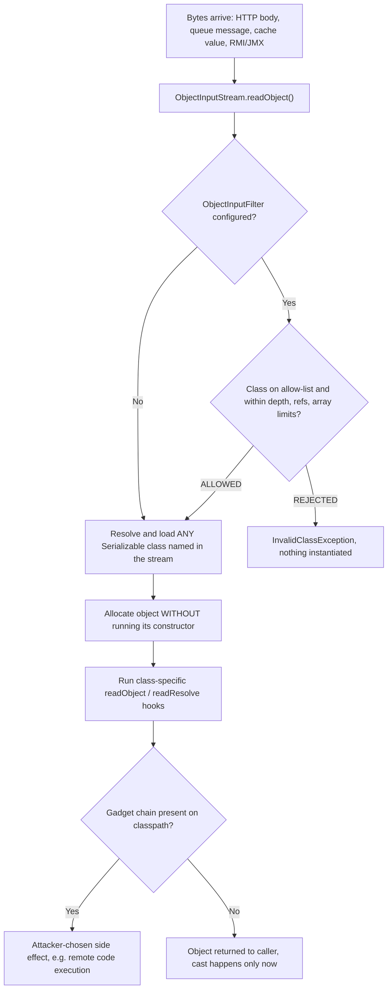
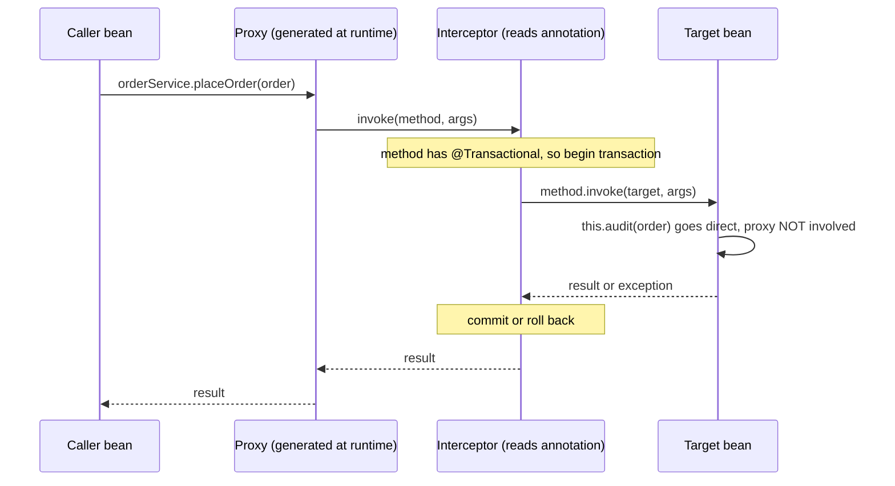
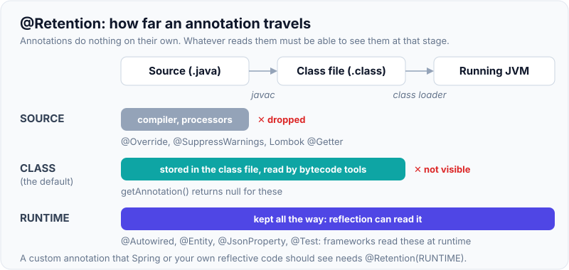

# Serialization, Reflection & Annotations

!!! abstract "Key takeaways"
    - **Java native serialization** (`Serializable`) writes an object graph as bytes. Deserialization **builds objects without calling their constructors**, so it bypasses your validation. It is a hidden, public "constructor" that accepts attacker-controlled bytes.
    - **Never deserialize untrusted data with `ObjectInputStream`.** Prefer JSON/Avro/Protobuf. If you must, use an allow-list **`ObjectInputFilter`** (JEP 290, Java 9; context-specific filters in JEP 415, Java 17).
    - **Reflection** lets code inspect classes and call members by name at runtime. It powers Spring DI, Jackson, Hibernate and JUnit. Costs: no compile-time safety, broken encapsulation, slower than direct calls, and friction with modules (strong encapsulation since Java 17) and GraalVM native images.
    - **Annotations are metadata only. They do nothing by themselves.** Something must read them: the compiler, an annotation processor (Lombok, MapStruct) or runtime reflection (Spring). `@Retention(RUNTIME)` is required for reflection to see them; the default is `CLASS`.
    - **Records and enums serialize safely by design:** records are rebuilt through the canonical constructor, enums by name. For ordinary classes use `serialVersionUID`, `transient`, `readResolve` or the serialization proxy pattern.

## Why it matters

These three features are the machinery under every framework you use daily. When an interviewer asks "how does `@Autowired` work?", "why does `@Transactional` not work on a private method?", "why did your Redis cache break after a deployment?" or "what is a deserialization vulnerability?", they are testing this page.

For a senior or lead role, the bar is not "what is `transient`". It is: do you understand why native serialization is dangerous, what you use instead, and what reflection costs you in security, performance and startup time.

## Core concepts

### Serialization: object graph to bytes

A class opts in by implementing the marker interface `java.io.Serializable` (no methods). `ObjectOutputStream.writeObject` then walks the **whole object graph**, writing each object's class descriptor and its non-static, non-transient fields. Shared references and cycles are preserved through back-reference handles.

What is and is not written:

| Element | Serialized? | Notes |
|---|---|---|
| Instance fields | Yes | Including `private` and `final` |
| `transient` fields | No | Come back as `null` / `0` / `false` |
| `static` fields | No | They belong to the class, not the object |
| A non-null field whose runtime object is not `Serializable` | Fails | `NotSerializableException` at runtime, not compile time (a `null` reference is fine) |
| Superclass state | Only if the superclass is `Serializable` | Otherwise its no-arg constructor runs on read |

### Deserialization does not call your constructor

This is the single most important fact. For a `Serializable` class, the JVM allocates the object without running its constructor, then sets fields directly from the stream. The only constructor that runs is the **no-arg constructor of the first non-serializable superclass** (often `Object`).

Consequences:

- Invariants checked in constructors (`if (end < start) throw ...`) are **not enforced**.
- Field initialisers (`private List<String> x = new ArrayList<>()`) do not run, so a `transient` field with an initialiser comes back `null`.
- A "singleton" gets a second instance.
- `final` fields are set by the JVM anyway.

{ loading=lazy }
*Watch the bottom path jump over the constructor. The same invalid data that `new` rejects comes back from `readObject()` as a normal object.*

### `serialVersionUID`

Every serializable class has a version number stored in the stream. On read, the stream's value must equal the local class's value, otherwise you get `InvalidClassException`.

If you do not declare it, the JVM **computes one from the class structure** (name, modifiers, interfaces, and non-private fields, constructors and methods). Adding a non-private method or a field then changes the value, and every previously serialized object becomes unreadable. So always declare it:

```java
private static final long serialVersionUID = 1L;
```

With a fixed UID, compatible changes work: a newly added field simply gets its default value when reading old data, and a removed field is ignored. Changing a field's type or moving the class in the hierarchy is still incompatible.

### Customising the form

| Hook | Purpose |
|---|---|
| `private void writeObject(ObjectOutputStream)` / `readObject(ObjectInputStream)` | Custom wire format; `readObject` is where you re-validate invariants and make defensive copies |
| `Object readResolve()` | Replace the deserialized object (keep singletons single) |
| `Object writeReplace()` | Write a different object instead (basis of the serialization proxy) |
| `Externalizable` | You write and read everything yourself; requires a **public no-arg constructor**, which *is* called |
| `ObjectInputFilter` | Accept or reject classes, array sizes, graph depth *before* they are instantiated |

**Serialization proxy pattern** (Effective Java, Item 90): `writeReplace` returns a small private static nested class holding the logical state; the proxy's `readResolve` calls the real public constructor. The real class's `readObject` throws. This restores constructor-based validation.

**Records and enums** do this for you:

- A record is serialized as its components and **deserialized by calling the canonical constructor**, so validation in a compact constructor runs. You cannot customise a record with `writeObject`/`readObject`; `writeReplace` is still allowed.
- An enum constant is serialized as its **name** only and resolved with `Enum.valueOf`, so there is never a second instance. This is why "enum singleton" is the safe singleton.

See [Modern Java 9–25](08-modern-java-9-25-records-sealed-classes-pattern-matching-swi.md) for records in depth.

### Why native deserialization is a security problem

`readObject()` will instantiate **any `Serializable` class on the classpath** that the stream names. It does this before your code gets the result back and casts it. An attacker does not need to upload code. They chain together classes that already exist in your dependencies (a "gadget chain") whose `readObject`, `hashCode` or `compare` methods do something useful to them, ending in a call such as `Runtime.exec`.


*Notice that the cast in your code happens at the very end. All the dangerous work (class loading, `readObject` hooks) is finished before your code can check the type, which is why a filter must run inside the stream.*

The defence, in order of preference:

1. **Do not use native serialization for data crossing a trust boundary.** Use JSON, Avro or Protobuf with explicit schemas and concrete target types.
2. If you cannot avoid it, set an **allow-list filter**. JEP 290 (Java 9) added `ObjectInputFilter`, configurable per stream or JVM-wide with `-Djdk.serialFilter`. JEP 415 (Java 17) added a JVM-wide **filter factory** (`ObjectInputFilter.Config.setSerialFilterFactory`) that picks a filter per deserialization, so library code that creates its own streams is covered too.
3. Keep dependencies patched and remove unused ones (fewer gadgets).

### Reflection: code that inspects code

Every loaded class has a `java.lang.Class` object. From it you can list and use members by name at runtime:

```java
Class<?> c = Class.forName("com.acme.PaymentService");      // load by name
Object svc = c.getDeclaredConstructor().newInstance();      // create
Method m = c.getDeclaredMethod("charge", BigDecimal.class); // look up
m.setAccessible(true);                                      // bypass 'private' (if allowed)
Object result = m.invoke(svc, new BigDecimal("10.00"));     // call
```

Key distinctions interviewers check:

| API | Returns |
|---|---|
| `getMethods()` / `getFields()` | **Public** members, **including inherited** ones |
| `getDeclaredMethods()` / `getDeclaredFields()` | **All** access levels, but **only this class** (no inherited) |
| `Class.forName(name)` | Loads **and initialises** the class (runs static blocks) |
| `Foo.class` / `loader.loadClass(name)` | Does not initialise it |
| `method.invoke(...)` | Wraps any exception from the target in `InvocationTargetException` (use `getCause()`) |

**Costs of reflection:**

- **No compile-time checking.** A rename becomes a runtime `NoSuchMethodException`.
- **Performance.** Lookup is expensive (cache `Method`/`Field` objects). Invocation boxes arguments, does access checks and is harder for the JIT to inline. Since Java 18 (JEP 416) core reflection is implemented on top of method handles; the JEP reports no measurable regression in real serialization libraries such as Jackson.
- **Encapsulation.** `setAccessible(true)` breaks `private`. Since Java 17 (JEP 403), JDK internals are **strongly encapsulated**: reflecting into a non-opened package of another module throws `InaccessibleObjectException` unless the module declares `opens` or you start the JVM with `--add-opens`.
- **Generics are mostly erased.** You cannot ask a `List<String>` instance for its element type, but declarations keep it: `field.getGenericType()`, `method.getGenericReturnType()` and `clazz.getGenericSuperclass()` return a `ParameterizedType`. Jackson's `TypeReference` and Spring's `ParameterizedTypeReference` use the last one: you create an anonymous subclass (`new TypeReference<List<String>>() {}`) and they read its generic superclass. See [Generics](05-generics.md).
- **Closed-world tooling.** GraalVM native image must know at build time which classes are accessed reflectively. Spring Boot 3's AOT engine generates these hints; for your own reflective code you register them (`RuntimeHintsRegistrar`, `@RegisterReflectionForBinding`).

**Faster, safer alternatives:** `MethodHandle` / `VarHandle` (access checked once at lookup, JIT-friendly), `LambdaMetafactory`, and compile-time code generation (MapStruct, annotation processors).

### Dynamic proxies

`java.lang.reflect.Proxy` creates, at runtime, a class that implements a set of **interfaces** and routes every call to one `InvocationHandler`. Spring AOP uses JDK proxies for interfaces and CGLIB-generated **subclasses** for concrete classes. This single mechanism explains several classic Spring behaviours.


*Notice that the annotation is only honoured when the call passes through the proxy. The self-call `this.audit(...)` never reaches the interceptor, which is why `@Transactional`, `@Cacheable` and `@Async` are ignored on self-invocation, and on private methods.*

### Annotations: metadata that something else must read

An annotation is a special interface (`@interface`). It carries constants; it has **no behaviour**. Three kinds of consumer exist, selected by retention:

| `@Retention` | Kept in | Read by | Examples |
|---|---|---|---|
| `SOURCE` | Source only | Compiler, annotation processors | `@Override`, `@SuppressWarnings`, Lombok's `@Getter` |
| `CLASS` (**default**) | `.class` file, not visible to reflection | Bytecode tools | Some nullness and static-analysis annotations |
| `RUNTIME` | `.class` file and loaded into the JVM | Reflection | `@Autowired`, `@Entity`, `@JsonProperty`, `@Test` |

{ loading=lazy }
*Notice that the default, `CLASS`, stops one step short of what Spring and other reflection-based frameworks need.*

Meta-annotations you must know:

- **`@Target`**: where it may be placed (`TYPE`, `METHOD`, `FIELD`, `PARAMETER`, `TYPE_USE`, `RECORD_COMPONENT`, ...).
- **`@Retention`**: as above.
- **`@Inherited`**: subclasses inherit it, but **only for annotations on classes**. Not on methods, not from interfaces.
- **`@Repeatable`**: allows the same annotation several times (stored in a container annotation).
- **`@Documented`**: appears in Javadoc.

Element types are restricted to primitives, `String`, `Class`, enums, other annotations and arrays of those. `null` is not a legal value, which is why you see defaults like `""`.

**Compile time vs runtime processing:**

- **Annotation processors (JSR 269)** run inside `javac` and generate new source files. MapStruct and Dagger work this way. Zero runtime cost, errors at build time. (Lombok also runs as a processor but modifies the compiler's AST through internal APIs, which is why it sometimes breaks on new JDKs.)
- **Runtime reflection** scans classes at startup (`clazz.isAnnotationPresent(...)`). Flexible, but adds startup time and hides wiring errors until runtime.

**Composed annotations are a Spring feature, not a Java feature.** `@RestController` is annotated with `@Controller`, which is annotated with `@Component`. Plain `getAnnotation(Component.class)` on your class returns `null`. Spring's `AnnotatedElementUtils` / `MergedAnnotations` walk the meta-annotation hierarchy.

## In practice: code & configuration

### A class with invariants: mistake vs fix

=== "❌ Common mistake"
    ```java
    public final class CoveragePeriod implements Serializable {
        // No serialVersionUID: any change to the class breaks old data
        private final LocalDate start;
        private final LocalDate end;
        private final String ssn;                        // sensitive, written in clear bytes
        private final List<String> notes = new ArrayList<>();

        public CoveragePeriod(LocalDate start, LocalDate end, String ssn) {
            if (end.isBefore(start)) throw new IllegalArgumentException("end < start");
            this.start = start; this.end = end; this.ssn = ssn;
        }
        // Deserialization skips the constructor: a crafted stream can create
        // a CoveragePeriod with end < start. The invariant is gone.
    }

    // Somewhere in a consumer:
    try (var in = new ObjectInputStream(request.getInputStream())) {
        var period = (CoveragePeriod) in.readObject();   // any class is instantiated BEFORE this cast
    }
    ```

=== "✅ Correct approach"
    ```java
    // 1. Prefer a record: deserialization goes through the canonical constructor.
    public record CoveragePeriod(LocalDate start, LocalDate end) implements Serializable {
        public CoveragePeriod {                           // compact constructor runs on deserialization too
            Objects.requireNonNull(start); Objects.requireNonNull(end);
            if (end.isBefore(start)) throw new IllegalArgumentException("end < start");
        }
    }

    // 2. If you must read native serialization, allow-list what may be created.
    ObjectInputFilter filter = ObjectInputFilter.Config.createFilter(
        "com.acme.coverage.*;java.time.*;" +              // allowed packages (".*" = this package only, ".**" = subpackages too)
        "maxdepth=10;maxrefs=1000;maxarray=10000;" +      // resource limits against DoS
        "!*");                                            // reject everything else

    try (var in = new ObjectInputStream(source)) {
        in.setObjectInputFilter(filter);                  // checked BEFORE instantiation
        var period = (CoveragePeriod) in.readObject();
    }
    ```

JVM-wide safety net (covers streams created by libraries):

```bash
java -Djdk.serialFilter='com.acme.**;java.base/*;!*' -jar app.jar
```

### Keeping a singleton single

```java
public final class KeyRegistry implements Serializable {
    private static final long serialVersionUID = 1L;
    public static final KeyRegistry INSTANCE = new KeyRegistry();
    private KeyRegistry() {}

    @Serial                                    // Java 14+: javac -Xlint:serial checks the signature is right
    private Object readResolve() {             // replaces the freshly deserialized copy
        return INSTANCE;
    }
}
// Simpler and also reflection-proof: public enum KeyRegistry { INSTANCE }
```

### A custom runtime annotation, the Spring way

```java
@Target(ElementType.METHOD)
@Retention(RetentionPolicy.RUNTIME)            // without this, reflection cannot see it
public @interface Audited {
    String action();                           // required element
    boolean includeArgs() default false;       // optional element
}

@Aspect
@Component
class AuditAspect {
    private final AuditLog auditLog;
    AuditAspect(AuditLog auditLog) { this.auditLog = auditLog; }

    @Around("@annotation(audited)")            // binds the annotation instance to the parameter
    public Object audit(ProceedingJoinPoint pjp, Audited audited) throws Throwable {
        var started = Instant.now();
        try {
            return pjp.proceed();              // call the real method
        } finally {
            // never log arguments by default: they may contain PHI/PII
            auditLog.record(audited.action(), started,
                audited.includeArgs() ? pjp.getArgs() : null);
        }
    }
}

@Service
class PrescriptionService {
    @Audited(action = "PRESCRIPTION_VIEW")     // only works when called through the Spring proxy
    public Prescription view(String id) { /* ... */ }
}
```

### Reflection done responsibly

```java
// Cache lookups: finding a Method is far more expensive than invoking it.
private static final ClassValue<Map<String, MethodHandle>> GETTERS = new ClassValue<>() {
    @Override protected Map<String, MethodHandle> computeValue(Class<?> type) {
        var lookup = MethodHandles.lookup();
        var map = new HashMap<String, MethodHandle>();
        for (RecordComponent rc : type.getRecordComponents()) {         // records only: returns null for non-records
            try {
                map.put(rc.getName(), lookup.unreflect(rc.getAccessor())); // access checked once, here
            } catch (IllegalAccessException e) {
                throw new IllegalStateException(e);
            }
        }
        return Map.copyOf(map);
    }
};
```

`ClassValue` ties the cache to the class's lifetime, so it does not leak class loaders the way a static `Map<Class<?>, ...>` can.

### Safe JSON instead of native serialization

```java
// Redis: do not rely on RedisTemplate's default JDK serializer.
@Bean
RedisTemplate<String, MemberProfile> memberTemplate(RedisConnectionFactory cf, ObjectMapper mapper) {
    var template = new RedisTemplate<String, MemberProfile>();
    template.setConnectionFactory(cf);
    template.setKeySerializer(RedisSerializer.string());
    // Concrete target type: no class names in the payload, nothing for an attacker to choose
    template.setValueSerializer(new Jackson2JsonRedisSerializer<>(mapper, MemberProfile.class));
    return template;
}
```

```yaml
# Spring Kafka: restrict which classes the JSON deserializer may create
spring:
  kafka:
    consumer:
      value-deserializer: org.springframework.kafka.support.serializer.JsonDeserializer
      properties:
        spring.json.trusted.packages: "com.acme.events"   # never "*" in production
```

!!! note "Spring Boot 4 / Jackson 3 naming"
    The class names above are the Jackson 2 ones used with Spring Boot 3.x. Spring Boot 4 (Spring Data Redis 4, Spring Kafka 4) moves to Jackson 3 and adds `JacksonJsonRedisSerializer` and `JacksonJsonSerializer` / `JacksonJsonDeserializer`; the Jackson 2 based classes (`Jackson2JsonRedisSerializer`, `JsonSerializer` / `JsonDeserializer`) are deprecated there. The security rules are unchanged: concrete target types and restricted trusted packages.

## Real-world usage

- **Spring Framework** is reflection plus annotations end to end: classpath scanning for `@Component`, constructor resolution for injection, proxies for `@Transactional`/`@Cacheable`/`@Async`, and `@ConfigurationProperties` binding. Spring Boot 3's AOT processing moves much of this to build time so applications can run as GraalVM native images.
- **Jackson** discovers constructors, fields and accessors reflectively and caches the result per type. Reuse one `ObjectMapper`; creating one per request throws that cache away.
- **Hibernate/JPA** needs a no-arg constructor because it instantiates entities reflectively and creates proxy subclasses for lazy loading (so entities should not be `final`).
- **The 2015 Apache Commons Collections gadget chain.** Researchers (Frohoff and Lawrence, with the `ysoserial` tool) showed that a widely used library on the classpath was enough to turn any endpoint that deserialized untrusted Java objects into remote code execution. WebLogic, WebSphere, JBoss and Jenkins were all affected. This is the incident that led to JEP 290.
- **Jackson polymorphic typing.** A long series of jackson-databind CVEs came from "default typing", where the JSON itself names the class to instantiate. It is the same flaw as native deserialization in a different format. Jackson 2.10 added `PolymorphicTypeValidator` to force an allow-list.
- **OWASP** listed "Insecure Deserialization" in the 2017 Top 10 and folded it into "Software and Data Integrity Failures" (A08) in 2021.
- **Healthcare and banking relevance.** Serialized blobs in caches, sessions and queues may contain PHI or account data in readable form. `transient` or explicit DTOs keep secrets and identifiers out of the wire format. Runtime annotations are a common way to implement audit trails and field masking consistently.

## Trade-offs & production gotchas

| Option | Pros | Cons | Use when |
|---|---|---|---|
| Java native serialization | Zero effort, handles cycles and any graph | Insecure with untrusted input, Java-only, brittle versioning, verbose | Legacy APIs that require it (HTTP session replication, some caches), trusted data only |
| JSON (Jackson) | Human readable, cross-language, tolerant of added fields | Larger, slower than binary, no enforced schema | REST/GraphQL payloads, cache values, most service-to-service calls |
| Avro / Protobuf | Compact, fast, explicit schema evolution rules | Schema management and tooling needed | Kafka events, high-volume RPC |
| Reflection at runtime | Flexible, no build step | Slow startup, runtime failures, native-image hints | Frameworks, generic libraries |
| Annotation processing at compile time | No runtime cost, build-time errors | More build complexity, generated code | Mappers, DI in startup-sensitive apps |
| `MethodHandle` / `VarHandle` | Near direct-call speed when held in `static final` | More awkward API | Hot paths that need dynamic access |

!!! warning "Gotchas"
    - **Spring Data Redis's `RedisTemplate` defaults to JDK serialization.** Values are unreadable in `redis-cli`, every cached class must be `Serializable`, and a class change during a rolling deployment can make old entries fail with `InvalidClassException`. Configure a JSON serializer and version your cache keys.
    - **No `serialVersionUID`** means a harmless refactor invalidates all stored sessions or cache entries.
    - **`transient` fields with initialisers come back `null`**, because initialisers do not run on deserialization. Re-create them in `readObject` or lazily.
    - **Inner (non-static) and anonymous classes** hold a hidden reference to the outer instance. Serializing them drags in the outer object or fails. Lambdas are only serializable when the target type is `Serializable`, and their serialized form is fragile. Use static nested classes.
    - **`@Transactional` / `@Cacheable` / `@Async` on a private method or via `this.method()` do nothing**: the proxy is bypassed, and there is no error.
    - **A custom annotation without `@Retention(RUNTIME)`** compiles, and `isAnnotationPresent` silently returns `false`.
    - **`setAccessible(true)` on JDK internals** throws `InaccessibleObjectException` on Java 17+. `--add-opens` is a workaround, not a fix; upgrade the library.
    - **Jackson default typing or `spring.json.trusted.packages=*`** reintroduces the deserialization vulnerability in JSON form.
    - **Mutating `final` fields by reflection** is being restricted: JDK 26 warns about it by default (JEP 500, "Prepare to Make Final Mean Final") and a future release will deny it by default. The Java 21 and 25 LTS releases do not warn yet. Do not build on it.

## How this connects to my experience

- **Where I used it:**
    - *OptumRx Meteor (Publicis Sapient):* "Implemented Redis-based caching for frequently accessed queries and UI reference data" and "Designed Kafka-based event-driven workflows with retry and DLQ handling". Both are serialization decisions: what format the cached values and the event payloads use.
    - *GraphQL Consumer Service:* Spring for GraphQL maps schema fields to controller methods through annotations (`@QueryMapping`, `@SchemaMapping`, `@BatchMapping`) and reflection. *[confirm the service used Spring for GraphQL and not another library such as Netflix DGS]*
    - *Metasys and OptumRx security work:* Spring Security's method security (`@PreAuthorize`) is proxy-based, the same mechanism as the diagram above. *[confirm method-level security annotations were used, not only URL-based rules]*
- **Talking points:**
    - Which serializer the Redis cache used (JSON vs JDK) and how cached entries stayed compatible across deployments, for example versioned keys or tolerant JSON readers. *[confirm the serializer and the versioning approach]*
    - Kafka payload format (JSON with trusted packages, or Avro with a schema registry) and how a message that fails deserialization is handled, for example `ErrorHandlingDeserializer` routing the poison record to the DLQ instead of blocking the partition. *[confirm format and whether ErrorHandlingDeserializer was used]*
    - A custom annotation or aspect for audit logging, PHI masking or metrics, if one existed. *[confirm]* If not, say honestly: "I have used framework annotations heavily and understand how to build one with `@Retention(RUNTIME)` plus an aspect."
    - As a lead, the standard I would set in code review: no `ObjectInputStream` on external input, no Jackson default typing, explicit DTOs at every boundary. This follows from "Established engineering standards around ... code quality".
- **Likely follow-up chain:** "How does `@Transactional` work?" → "Why does it fail on self-invocation?" → "JDK proxy vs CGLIB?" → "What changes for a GraalVM native image?" Answer in that order: annotation is metadata, a bean post-processor wraps the bean in a proxy, the interceptor runs only for calls through the proxy, JDK proxies need interfaces while CGLIB subclasses the class, and native images need reflection and proxy metadata at build time, which Spring AOT generates.

## Interview questions

### Fundamentals

??? question "Q1. What is serialization, and what does implementing `Serializable` actually do?"
    **Answer:** Serialization converts an object graph into a byte stream so it can be stored or sent; deserialization rebuilds it. `Serializable` is a marker interface with no methods. It simply tells `ObjectOutputStream` that it is permitted to write this class. The stream writes the class descriptor (name and `serialVersionUID`) and all non-static, non-transient fields, recursively for referenced objects.

    **Interviewer listens for:** marker interface, whole graph, runtime (not compile-time) failure with `NotSerializableException` if a referenced object is not serializable.

    **Common wrong answer:** "It adds `writeObject` and `readObject` methods to the class."

??? question "Q2. What is `serialVersionUID`, and what happens if you do not declare it?"
    **Answer:** It is the version of the class's serialized form. On deserialization the stream's UID must match the local class's UID, otherwise `InvalidClassException` is thrown. If you do not declare it, the JVM computes one from the class's structure, so adding a field or method changes it and old data becomes unreadable. Declare it explicitly and change it only when you intentionally break compatibility.

    **Interviewer listens for:** default is computed and fragile; with a fixed UID, added fields get default values and removed fields are ignored.

    **Common wrong answer:** "It is optional and only a warning." Without it, harmless changes can break deserialisation of stored data.

??? question "Q3. What do `transient` and `static` mean for serialization?"
    **Answer:** Neither is written. `transient` marks instance state that should be skipped (secrets, caches, derived values, non-serializable resources). `static` fields belong to the class. After deserialization a transient field holds its type's default (`null`, `0`, `false`), **not** its initialiser value, because initialisers do not run.

    **Common wrong answer:** "A `transient int count = 5` comes back as 5."

    **Interviewer listens for:** neither written, defaults after read, static belongs to the class.

??? question "Q4. What is reflection? Name three places you rely on it every day."
    **Answer:** The ability to inspect classes, fields, methods and annotations at runtime and to create objects or invoke members by name, through `java.lang.Class` and `java.lang.reflect`. Daily examples: Spring dependency injection and component scanning, Jackson mapping JSON to objects, Hibernate instantiating entities, JUnit finding `@Test` methods.

    **Interviewer listens for:** that you also know the costs (no compile-time safety, performance, encapsulation).

    **Common wrong answer:** "Reflection is rarely used in modern Java." Spring, Jackson, Hibernate and JUnit all depend on it.

??? question "Q5. What are the three retention policies, and which is the default?"
    **Answer:** `SOURCE` (discarded by the compiler, e.g. `@Override`), `CLASS` (stored in the class file but not available to reflection; **this is the default**), and `RUNTIME` (available to reflection, e.g. `@Autowired`). A custom annotation read by a framework at runtime must be declared `@Retention(RetentionPolicy.RUNTIME)`.

    **Common wrong answer:** "The default is `RUNTIME`."

    **Interviewer listens for:** SOURCE/CLASS/RUNTIME, CLASS is the default, RUNTIME needed for frameworks.

### Intermediate

??? question "Q6. Predict the output."
    ```java
    class Base {                                  // NOT Serializable
        int a = 10;
        Base() { System.out.println("Base()"); }
    }
    class Child extends Base implements Serializable {
        private static final long serialVersionUID = 1L;
        int b = 20;
        transient int c = 30;
        static int d = 40;
        Child() { System.out.println("Child()"); }
    }

    Child x = new Child();
    x.a = 11; x.b = 21; x.c = 31; Child.d = 41;
    byte[] bytes = serialize(x);
    Child.d = 99;
    Child y = (Child) deserialize(bytes);
    System.out.println(y.a + " " + y.b + " " + y.c + " " + Child.d);
    ```

    **Answer:**

    ```
    Base()
    Child()
    Base()
    10 21 0 99
    ```

    Creating `x` prints `Base()` and `Child()`. On deserialization only the no-arg constructor of the first non-serializable superclass runs, so `Base()` prints again and `Child()` does not. `a` belongs to `Base`, which is not serializable, so it is re-initialised to 10. `b` is restored (21). `c` is transient, so 0. `d` is static and never part of the stream, so it shows the current value 99.

    **Interviewer listens for:** the constructor rule and the reason for each of the four values.

    **Common wrong answer:** Expecting a = 10 to be restored from the stream. The non-serialisable parent's constructor runs and re-initialises it.

??? question "Q7. How can serialization break a singleton, and how do you fix it?"
    **Answer:** Deserialization creates a new object without using the private constructor, so you end up with two instances. Fix it with `readResolve()` returning the existing instance, or better, use a single-element enum: enums are serialized by name and resolved with `valueOf`, and they cannot be instantiated reflectively either.

    **Interviewer listens for:** reflection (`setAccessible` on the private constructor) as the second way to break a singleton, and enum handling both.

    **Common wrong answer:** "Make the constructor private." Deserialisation does not call the constructor.

??? question "Q8. `getMethods()` vs `getDeclaredMethods()`, and `Class.forName()` vs `.class`?"
    **Answer:** `getMethods()` returns public methods including inherited ones. `getDeclaredMethods()` returns methods of every access level but only those declared in that class. To find a private method in a superclass you walk up with `getSuperclass()`. `Class.forName(name)` loads and initialises the class, so static initialisers run (this is how old JDBC drivers registered themselves). `Foo.class` gives the `Class` object without triggering initialisation.

    **Interviewer listens for:** public + inherited vs all-access declared-only, initialisation behaviour of forName vs .class.

    **Common wrong answer:** "getDeclaredMethods includes inherited methods."

??? question "Q9. Annotations have no behaviour. So how does `@Autowired` or `@Transactional` do anything?"
    **Answer:** Something reads them. At startup, Spring's bean post-processors inspect each bean class reflectively. `AutowiredAnnotationBeanPostProcessor` finds `@Autowired` members and injects dependencies. For `@Transactional`, an auto-proxy creator wraps the bean in a proxy (JDK dynamic proxy for interfaces, CGLIB subclass otherwise) whose interceptor starts and commits or rolls back the transaction around the call. Compile-time annotations such as Lombok's are read by an annotation processor inside `javac` instead.

    **Interviewer listens for:** the distinction between runtime reflection and compile-time processing, and the word "proxy".

    **Common wrong answer:** "The compiler generates the transaction code." Runtime proxies and post-processors do the work.

??? question "Q10. Does a subclass inherit its parent's annotations? Does an overriding method?"
    **Answer:** Only class-level annotations that are themselves marked `@Inherited` are visible on subclasses through `getAnnotation`. It does not apply to annotations on interfaces, methods, fields or constructors. An overriding method does not inherit the overridden method's annotations in plain Java. Frameworks often add their own lookup: Spring's `AnnotatedElementUtils.findMergedAnnotation` searches superclasses, interfaces and meta-annotations.

    **Common wrong answer:** "Yes, annotations are inherited like methods."

    **Interviewer listens for:** @Inherited only for class annotations, Spring's merged-annotation lookup.

### Senior

??? question "Q11. Why is Java deserialization considered dangerous? Explain a gadget chain."
    **Answer:** `ObjectInputStream.readObject` instantiates whatever serializable class the stream names and runs that class's deserialization hooks before the caller can check the type. An attacker who controls the bytes builds a graph out of classes already on the classpath whose `readObject`, `hashCode`, `compareTo` or `toString` methods call into each other and end in something harmful, such as reflective method invocation leading to `Runtime.exec`. No malicious code is uploaded; existing library code is reused. The 2015 Commons Collections chain made this practical against many application servers. Even without code execution, a crafted stream can exhaust memory or CPU (deeply nested collections).

    Mitigations: do not deserialize untrusted data natively; use data-only formats with concrete target types; apply an allow-list `ObjectInputFilter` per stream and JVM-wide (`jdk.serialFilter`, and a filter factory since Java 17); set depth, reference and array limits; keep the classpath lean and patched.

    **Interviewer listens for:** "the cast is too late", allow-list rather than deny-list, and that JSON with polymorphic typing has the same problem.

    **Common wrong answer:** "It is safe if I cast the result to my own type" or "we block the known bad classes".

??? question "Q12. How do records change the serialization story?"
    **Answer:** A record's serialized form is exactly its components. On deserialization the JVM reads the component values and calls the **canonical constructor**, so compact-constructor validation and defensive copies always run. Records cannot customise the process with `writeObject`, `readObject` or `Externalizable` methods (they are ignored), though `writeReplace` and `readResolve` are still supported. That removes the "hidden constructor" problem for the record itself. It does not make untrusted streams safe: the stream can still name other, non-record classes, so filters are still needed.

    **Interviewer listens for:** components only, canonical constructor on read, invariants always checked.

    **Common wrong answer:** "Records use the same serialisation as normal classes."

??? question "Q13. What does reflection cost, and how do you reduce that cost?"
    **Answer:** Costs: member lookup is slow; `invoke` boxes arguments into an `Object[]`, checks access and is hard to inline; errors move from compile time to runtime; it breaks encapsulation; it needs `opens` under the module system; and it needs build-time metadata for native images.

    Reductions: cache `Method`/`Field`/`Constructor` objects (frameworks do this per class); use `MethodHandle`/`VarHandle` held in `static final` fields, which the JIT can treat as constants; generate code at build time (MapStruct, Spring AOT) instead of reflecting at runtime; reuse expensive reflective objects like `ObjectMapper`. Since Java 18, core reflection itself is built on method handles (JEP 416).

    **Interviewer listens for:** "lookup once, invoke many", and awareness of startup time as well as per-call time.

    **Common wrong answer:** "Reflection is always too slow to use." Cached MethodHandles and framework metadata make it cheap enough.

??? question "Q14. What changed for reflection with the module system and Java 17?"
    **Answer:** Java 9 introduced modules: `exports` makes a package's public types accessible at compile time and runtime; `opens` gives runtime-only access that also permits deep reflection (`setAccessible` on non-public members). Java 9 to 15 only warned about illegal reflective access to JDK internals. Java 16 denied it by default (JEP 396), and Java 17 (JEP 403) removed the `--illegal-access` escape hatch, so the result is `InaccessibleObjectException`. The remaining workaround is an explicit `--add-opens module/package=ALL-UNNAMED`. Code on the classpath (the unnamed module) can still reflect freely on other classpath code, which is why most Spring applications are unaffected for their own classes. The direction continues: JDK 26 starts warning when `final` fields are mutated through deep reflection (JEP 500).

    **Interviewer listens for:** exports vs opens, strong encapsulation since Java 16/17, --add-opens as a temporary fix.

    **Common wrong answer:** "setAccessible(true) still works on JDK internals." Since Java 17 it is blocked without --add-opens.

??? question "Q15. JDK dynamic proxy vs CGLIB proxy: what are the differences and the limits?"
    **Answer:** A JDK proxy is a runtime-generated class implementing given interfaces; calls go to an `InvocationHandler`. It can only be injected by interface type. CGLIB generates a subclass of the concrete class and overrides its methods, so it cannot proxy `final` classes or intercept `final`, `static` or `private` methods. Spring Boot defaults to class-based proxies (`proxyTargetClass=true`). Both share the self-invocation limit: a call through `this` does not pass the proxy. Options are to move the method to another bean, inject the bean's own proxy, or use AspectJ weaving, which changes the bytecode itself.

    **Interviewer listens for:** a real consequence, for example "Kotlin classes are final by default" or "`@Transactional` on a private method is silently ignored".

    **Common wrong answer:** "CGLIB can proxy final methods." It cannot, which silently skips @Transactional on them.

### Scenario-based

??? question "Q16. After a rolling deployment, some pods throw `InvalidClassException` (or `SerializationException`) when reading from Redis. What happened and how do you fix it?"
    **Answer:** The cache stores JDK-serialized objects (the `RedisTemplate` default). The new version changed a cached class, and either there is no explicit `serialVersionUID` (so the computed UID changed) or the change was incompatible. Old and new pods now write forms the other cannot read.

    Immediate fix: treat a deserialization failure as a cache miss (catch, evict, reload) so the cache is never a point of failure. Then prefix cache keys with a schema version so old and new pods use separate entries during the rollout.

    Long term: switch to JSON with concrete types and `FAIL_ON_UNKNOWN_PROPERTIES=false`, declare `serialVersionUID` wherever JDK serialization remains, and add a compatibility test that reads a stored sample of the previous version.

    **Interviewer listens for:** rolling deployment means two versions run together; cache must fail soft; versioned keys.

    **Common wrong answer:** "Flush the cache and move on." Without a stable format it will happen again on the next class change.

??? question "Q17. A security scan flags an internal endpoint that accepts `application/x-java-serialized-object`. As tech lead, what is your plan?"
    **Answer:** Treat it as a likely remote-code-execution risk, not a low-priority finding; "internal" is not a trust boundary.

    1. **Contain now:** set a JVM-wide allow-list with `-Djdk.serialFilter` (and a filter factory on Java 17+), restrict network access to the endpoint, and check logs for abuse.
    2. **Fix properly:** replace the contract with JSON or Protobuf DTOs deserialized to concrete types, version the API and migrate callers.
    3. **Prevent recurrence:** a static-analysis rule that flags `ObjectInputStream`, Jackson default typing and wildcard trusted packages; dependency scanning; a short write-up for the team.

    **Interviewer listens for:** containment before redesign, allow-list thinking, and turning one incident into a team standard.

    **Common wrong answer:** "It is internal, so it is low priority." Internal endpoints are reachable after any foothold.

??? question "Q18. A Kafka consumer is stuck: the same offset fails again and again with a deserialization error. Why, and what do you do?"
    **Answer:** Deserialization happens inside `poll()`, before the listener and its error handler run. A record that cannot be deserialized (a "poison pill") throws on every poll, so the consumer never moves past it and lag grows on that partition.

    Fix: wrap the real deserializer in Spring Kafka's `ErrorHandlingDeserializer`. It catches the failure and passes the error to the container's error handler, which can publish the raw bytes to a dead-letter topic with `DeadLetterPublishingRecoverer` and commit the offset. Deserialization errors are not retryable, so do not send them through the retry topics. Longer term, enforce schema compatibility at the producer (schema registry) so bad payloads are rejected at write time.

    **Interviewer listens for:** why the normal error handler never sees it, non-retryable classification, keeping the original bytes for diagnosis.

    **Common wrong answer:** "Catch the exception in the listener." The listener never sees it because poll throws first.

## Cheat sheet

| Concept | Remember |
|---|---|
| `Serializable` | Marker interface; whole graph; fails at runtime if a member is not serializable |
| Constructor on read | **Not called** for serializable classes; first non-serializable superclass's no-arg constructor is |
| `serialVersionUID` | Always declare; default is computed and changes with the class |
| `transient` / `static` | Not written; transient comes back as the default value, initialisers do not run |
| `readResolve` / enum | Keeps singletons single; enum is the safe default |
| Records | Deserialized through the canonical constructor; validation runs |
| Untrusted bytes | Never `ObjectInputStream`; else allow-list `ObjectInputFilter` (JEP 290, JEP 415) |
| JSON equivalent | No Jackson default typing; no `trusted.packages=*` |
| `getX` vs `getDeclaredX` | Public + inherited vs all access levels, this class only |
| `invoke` errors | Wrapped in `InvocationTargetException` |
| Java 17+ | Strong encapsulation: `InaccessibleObjectException` unless `opens` / `--add-opens` |
| Fast reflection | Cache lookups; `MethodHandle` / `VarHandle` in `static final` |
| Retention | `SOURCE`, `CLASS` (default), `RUNTIME` (needed for reflection) |
| `@Inherited` | Class-level only; not methods, not interfaces |
| Annotations | Metadata only; a processor or reflection gives them meaning |
| Proxies | JDK = interfaces, CGLIB = subclass; self-invocation and private methods bypass them |
| Native image | Reflection needs build-time hints (Spring AOT, `RuntimeHints`) |

## Sources

1. [Java Object Serialization Specification (Java SE 21)](https://docs.oracle.com/en/java/javase/21/docs/specs/serialization/index.html): serialized form, `serialVersionUID`, `readObject`/`readResolve`, record and enum serialization.
2. [JEP 290: Filter Incoming Serialization Data](https://openjdk.org/jeps/290) and [JEP 415: Context-Specific Deserialization Filters](https://openjdk.org/jeps/415): `ObjectInputFilter`, `jdk.serialFilter`, filter factory.
3. [OWASP Deserialization Cheat Sheet](https://cheatsheetseries.owasp.org/cheatsheets/Deserialization_Cheat_Sheet.html): gadget chains, allow-listing, safer alternatives.
4. [JEP 403: Strongly Encapsulate JDK Internals](https://openjdk.org/jeps/403) and [JEP 416: Reimplement Core Reflection with Method Handles](https://openjdk.org/jeps/416): reflection access rules and implementation since Java 17/18.
5. [The Java Tutorials: Annotations](https://docs.oracle.com/javase/tutorial/java/annotations/index.html) and [`java.lang.annotation` API](https://docs.oracle.com/en/java/javase/21/docs/api/java.base/java/lang/annotation/package-summary.html): retention, target, `@Inherited`, `@Repeatable`.
6. [Spring Framework: Proxying Mechanisms](https://docs.spring.io/spring-framework/reference/core/aop/proxying.html): JDK vs CGLIB proxies and self-invocation.
7. [Spring Boot: GraalVM Native Image support](https://docs.spring.io/spring-boot/reference/packaging/native-image/index.html): AOT processing and reflection hints.
8. *Effective Java*, 3rd edition, Joshua Bloch, Items 85–90: prefer alternatives to Java serialization, serialization proxy pattern, enum singletons.
