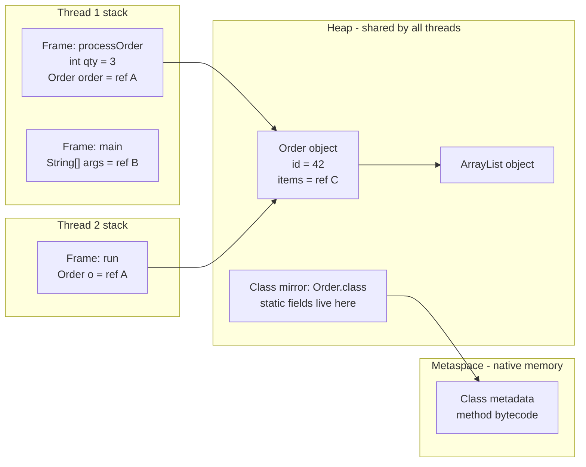
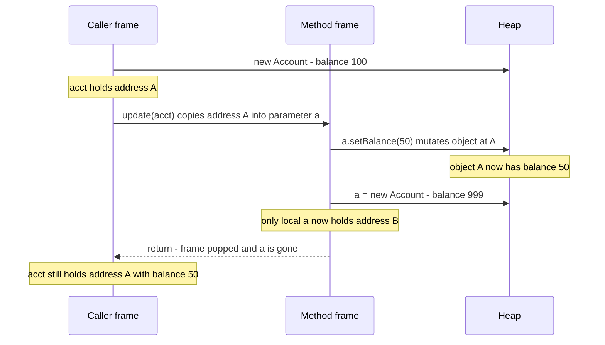
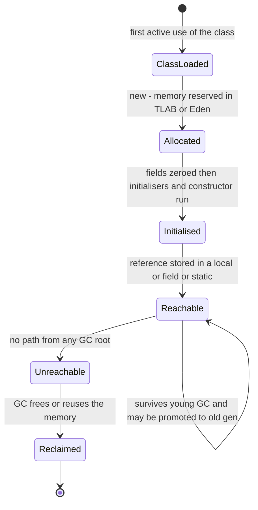

# Java Memory Basics: Stack vs Heap, Pass-by-Value, Object Lifecycle

!!! abstract "TL;DR"
    - **Stack = per thread, per method call.** Each call pushes a *frame* holding local variables (primitives and **references**) and is popped on return. **Heap = shared by all threads**, holds every object and array, and is managed by the garbage collector.
    - **Java is always pass-by-value.** For objects, the value that gets copied is the **reference** (the "address"), not the object. A method can *mutate* the object you passed, but it can never make *your variable* point to a different object.
    - An object is **eligible for GC when it is unreachable from any GC root** (thread stacks, static fields, JNI handles), not when its reference count is zero and not when you set a variable to `null`.
    - A **memory leak in Java** is an object that is still *reachable* but no longer *needed* (static maps, unbounded caches, `ThreadLocal` in pooled threads, listeners never removed).
    - JVM memory is **more than the heap**: Metaspace, thread stacks, code cache and direct buffers are native memory. In a container, `-Xmx` equal to the memory limit gets the pod `OOMKilled`.

## Why it matters

Every hard production problem in a Java service ends up being a memory question sooner or later: an `OutOfMemoryError` at 3 a.m., a pod restarting with exit code 137, a "why did my method not change the value?" bug, or a race condition caused by two threads sharing one object.

Interviewers use this topic as a filter. Juniors recite "primitives on the stack, objects on the heap". Seniors explain **why** the split exists (lifetime and sharing), what it means for **thread safety**, how the JIT can break the simple rule (escape analysis), and how to **diagnose a leak** from a heap dump.

Before garbage-collected languages, C and C++ programmers called `malloc`/`free` by hand, which produced dangling pointers, double frees and leaks. Java's design answer was: the programmer only creates objects, and the runtime decides when to reclaim them by tracing reachability.

## Core concepts

### The JVM run-time data areas

The JVM specification defines these memory areas. The first three are **per thread**; the rest are **shared**.

| Area | Scope | Holds | Error when exhausted |
|---|---|---|---|
| PC register | Per thread | Address of the current bytecode instruction | (none) |
| JVM stack | Per thread | Frames: local variables, operand stack, return info | `StackOverflowError` (or `OutOfMemoryError` if a new stack cannot be allocated) |
| Native method stack | Per thread | Frames of native (JNI) code | `StackOverflowError` (or `OutOfMemoryError`) |
| Heap | Shared | All object instances and arrays | `OutOfMemoryError: Java heap space` |
| Method area (HotSpot: **Metaspace**) | Shared | Class metadata, method bytecode, run-time constant pool | `OutOfMemoryError: Metaspace` |


*Notice that both threads hold their own copy of the reference in their own stack, but both copies point to the same `Order` object on the heap. That single fact is the root of every thread-safety problem.*

### Stack: fast, private, automatic

- Each **thread** gets its own stack when it is created. Each **method call** pushes a frame; each return (or uncaught exception) pops it.
- A frame holds the **local variable array** (parameters and locals), the **operand stack** (scratch space for bytecode) and a link to the class's constant pool.
- Local variables hold either a **primitive value** (`int`, `long`, `boolean`...) or a **reference** to a heap object. The object itself is never in the frame.
- Allocation and release are a pointer move. There is no GC involvement, which is why locals are cheap.
- Stack data is **thread-confined**. A local primitive can never be seen by another thread. This is why local variables are always thread-safe, while the objects they point to may not be.
- Size: on HotSpot, the default thread stack size is platform dependent, **1 MB on 64-bit Linux x86** (`-Xss` / `-XX:ThreadStackSize`). Deep or unbounded recursion throws `StackOverflowError`.

### Heap: shared, garbage-collected

- Every `new`, every array, every boxed value, every lambda that captures state and every `String` lives on the heap.
- **Instance fields live inside the object**, so they are on the heap, even primitive ones. "Primitives are on the stack" is only true for **local** primitives.
- **Static fields** are stored with the `java.lang.Class` mirror object, which is on the heap (since Java 7). Class *metadata* is in Metaspace.
- Allocation is still fast. HotSpot gives each thread a **TLAB** (thread-local allocation buffer) carved out of Eden, so most allocations are a lock-free pointer bump.
- Most collectors are **generational**: new objects go to the young generation (Eden plus survivor spaces); objects that survive several young collections are promoted to the old generation. This exploits the *weak generational hypothesis*: most objects die young.
- Default sizing: maximum heap is **1/4 of available memory** (`-XX:MaxRAMPercentage=25`) and the JVM is container-aware, so "available" means the cgroup limit.
- **G1** has been the default collector since Java 9 (JEP 248), but only on "server-class" machines: with fewer than 2 CPUs or less than about 1792 MB of memory (a small container), HotSpot silently picks **Serial GC** unless you set `-XX:+UseG1GC`. **ZGC** gained a generational mode in Java 21 (JEP 439, opt-in with `-XX:+UseZGC -XX:+ZGenerational`), which became ZGC's default mode in Java 23 (JEP 474); it aims for sub-millisecond pauses.

### What an object costs

On 64-bit HotSpot with compressed class pointers (the default), an object header is **12 bytes** (8-byte mark word plus 4-byte class pointer) and objects are aligned to 8 bytes. So `new Object()` takes 16 bytes and an `Integer` takes 16 bytes to hold a 4-byte `int`. Java 25 productises **compact object headers** (JEP 519, `-XX:+UseCompactObjectHeaders`), which shrink the header to 8 bytes.

This is why `List<Integer>` with a million entries is far heavier than `int[1_000_000]`: each element is a separate object plus a reference to it.

### Stack vs heap side by side

| | Stack | Heap |
|---|---|---|
| Owner | One thread | Whole JVM |
| Holds | Frames: local primitives and references | Objects, arrays, instance and static fields |
| Lifetime | Until the method returns | Until unreachable, then collected |
| Managed by | Push/pop on call/return | Garbage collector |
| Thread safety | Inherently confined | Needs synchronisation or immutability |
| Sizing flag | `-Xss` | `-Xms`, `-Xmx`, `-XX:MaxRAMPercentage` |
| Failure | `StackOverflowError` | `OutOfMemoryError: Java heap space` |

### When the simple rule bends

- **Escape analysis.** The C2 JIT analyses whether an object can *escape* the method that created it. If it cannot, HotSpot may apply **scalar replacement**: the object is never allocated, and its fields become plain locals (registers or stack slots). So "all objects are on the heap" is the language model, not a guarantee about machine code. You cannot rely on it or control it from source.
- **Virtual threads (Java 21, JEP 444).** A virtual thread's stack frames are stored **on the heap** as stack-chunk objects and copied onto a carrier thread's stack when it runs. That is why you can have millions of them: their stacks grow and shrink and are garbage collected, instead of reserving 1 MB each.
- **String pool.** Interned strings live on the heap since Java 7 (see the String internals page).

### Pass-by-value, precisely

The Java Language Specification says that when a method is invoked, the **values of the argument expressions initialise newly created parameter variables**. There is no other mechanism. Java has no pass-by-reference.

The confusion comes from the word "reference". A variable of object type does not contain the object; it contains a reference (think: an address). When you pass it, the **address is copied**.

Consequences:

1. Passing a primitive copies the number. The method cannot change the caller's variable.
2. Passing an object copies the reference. Caller and method now hold two references to **one** object, so **mutations through the parameter are visible to the caller**.
3. **Reassigning the parameter** (`param = new X()`) only changes the method's local copy. The caller's variable is untouched.


*Notice that the mutation through the copied reference is visible to the caller, but the reassignment is not. If Java were pass-by-reference, the caller would see balance 999.*

The classic proof is that you **cannot write a working `swap(a, b)`** for two object variables in Java. In C++ with reference parameters, or C# with `ref`, you can.

### Object lifecycle


*Notice that there is no "destroyed" step the programmer triggers. The only transition you control is making the object unreachable; when the memory is reclaimed is up to the collector.*

Step by step:

1. **Class loading.** On first active use the class is loaded, linked and initialised (static initialisers run once, thread-safely).
2. **Allocation.** `new` reserves memory (usually a TLAB pointer bump) and the JVM **zeroes** it. This is why fields have default values (`0`, `false`, `null`) but local variables do not and must be definitely assigned.
3. **Initialisation.** Order: superclass constructor first, then field initialisers and instance initialiser blocks in textual order, then the rest of the constructor body.
4. **In use.** The object is **strongly reachable** from a GC root.
5. **Unreachable.** No chain of strong references from any root leads to it. Cycles do not matter: two objects pointing at each other but unreachable from roots are both garbage. Java uses **tracing**, not reference counting.
6. **Reclaimed.** The collector frees the space (or, in a copying collector, simply does not copy the object).

**GC roots** are the starting points of the trace: local variables and operand stacks of live threads, static fields of loaded classes, JNI references, and objects used as monitors.

### Reference strengths

| Type | Cleared when | Typical use |
|---|---|---|
| Strong (normal) | Never while reachable | Everything |
| `SoftReference` | Before the JVM throws `OutOfMemoryError` | Memory-sensitive caches (prefer a real cache like Caffeine) |
| `WeakReference` | At the next GC once no strong or soft refs remain (weakly reachable) | `WeakHashMap`, canonicalising maps, listener registries |
| `PhantomReference` | After the object is finalised, enqueued for cleanup | `java.lang.ref.Cleaner`, releasing native resources |

**Finalization is dead.** `Object.finalize()` was deprecated in Java 9 and **deprecated for removal in Java 18 (JEP 421)**. It is unpredictable, slows GC and can resurrect objects. Use **try-with-resources** for deterministic cleanup and `Cleaner` only as a safety net (see the Exceptions page).

## In practice: code & configuration

### Pass-by-value: the bug and the fix

=== "❌ Common mistake"
    ```java
    // Tries to "return" results by reassigning parameters. Nothing reaches the caller.
    void normalise(String memberId, List<Claim> claims) {
        memberId = memberId.trim().toUpperCase();          // reassigns the LOCAL copy only
        claims = claims.stream()                           // new list, local reference only
                       .filter(Claim::isActive)
                       .toList();
    }

    void process(String memberId, List<Claim> claims) {
        normalise(memberId, claims);
        // memberId is still untrimmed, claims still contains inactive claims
        repository.save(memberId, claims);
    }
    ```

=== "✅ Correct approach"
    ```java
    // Return new values. Inputs are untouched, the data flow is explicit.
    record NormalisedRequest(String memberId, List<Claim> claims) {
        NormalisedRequest {
            claims = List.copyOf(claims);                  // defensive, unmodifiable copy
        }
    }

    NormalisedRequest normalise(String memberId, List<Claim> claims) {
        return new NormalisedRequest(
            memberId.trim().toUpperCase(),
            claims.stream().filter(Claim::isActive).toList());
    }

    void process(String memberId, List<Claim> claims) {
        var req = normalise(memberId, claims);             // caller rebinds its own variables
        repository.save(req.memberId(), req.claims());
    }
    ```

The opposite bug is just as common: a method **mutates** a collection it was given (`claims.removeIf(...)`) and the caller, or another thread, is surprised. Prefer returning new values and taking defensive copies at trust boundaries.

### Output prediction (know these cold)

```java
static void change(int n, StringBuilder sb, String s, int[] arr) {
    n = 99;                 // local copy of a primitive
    sb.append(" world");    // mutates the shared object
    s = s + " world";       // creates a NEW String, rebinds local s only
    arr[0] = 99;            // mutates the shared array
    arr = new int[]{7};     // rebinds local arr only
}

public static void main(String[] args) {
    int n = 1;
    var sb = new StringBuilder("hello");
    String s = "hello";
    int[] arr = {1};
    change(n, sb, s, arr);
    System.out.println(n + " | " + sb + " | " + s + " | " + arr[0]);
    // prints: 1 | hello world | hello | 99
}
```

### A real leak: `ThreadLocal` in a pooled thread

=== "❌ Common mistake"
    ```java
    public class RequestContext {
        private static final ThreadLocal<UserSession> CURRENT = new ThreadLocal<>();

        public static void set(UserSession s) { CURRENT.set(s); }
        public static UserSession get()        { return CURRENT.get(); }
    }

    // In a servlet filter:
    RequestContext.set(session);
    chain.doFilter(req, res);
    // Never removed. Tomcat reuses the thread, so the session object stays reachable
    // (thread -> ThreadLocalMap -> value) and the NEXT request may read another user's data.
    ```

=== "✅ Correct approach"
    ```java
    // RequestContext gains:  public static void remove() { CURRENT.remove(); }
    // Always clear in finally so the pooled thread goes back clean.
    try {
        RequestContext.set(session);
        chain.doFilter(req, res);
    } finally {
        RequestContext.remove();          // breaks the thread -> value reference
    }

    // Java 25: ScopedValue (JEP 506) binds a value for a bounded scope and
    // unbinds it automatically. It is immutable and works well with virtual threads.
    private static final ScopedValue<UserSession> SESSION = ScopedValue.newInstance();

    ScopedValue.where(SESSION, session).run(() -> handler.handle(request));
    ```

This is both a **memory leak** and a **data leak**. In healthcare or banking, the second is the serious one.

### JVM settings for a containerised Spring Boot service

```dockerfile
# Kubernetes memory limit: 2Gi. Leave headroom for non-heap memory.
ENV JAVA_TOOL_OPTIONS="\
  -XX:MaxRAMPercentage=70 \
  -XX:+HeapDumpOnOutOfMemoryError \
  -XX:HeapDumpPath=/dumps \
  -XX:+ExitOnOutOfMemoryError \
  -XX:NativeMemoryTracking=summary"
```

- `MaxRAMPercentage=70` sizes the heap from the **container limit**, leaving about 30% for Metaspace, thread stacks, code cache, direct buffers (Netty, Kafka clients) and GC structures.
- `HeapDumpOnOutOfMemoryError` captures the evidence. Mount `/dumps` on a volume, and treat the file as sensitive: **a heap dump contains live PHI/PII, tokens and keys**.
- `ExitOnOutOfMemoryError` makes the JVM die cleanly so Kubernetes restarts the pod, instead of limping on in an undefined state.

Diagnosis commands worth quoting in an interview:

```bash
jcmd <pid> GC.heap_info                 # heap and metaspace usage now
jcmd <pid> GC.class_histogram           # instances and bytes per class (quick leak hint)
jcmd <pid> GC.heap_dump /dumps/app.hprof  # full dump, analyse with Eclipse MAT
jcmd <pid> VM.native_memory summary     # non-heap breakdown (needs NMT enabled)
jcmd <pid> Thread.print                 # thread dump: stacks of all threads
```

## Real-world usage

- **Netflix** moved a large share of its streaming services to **Generational ZGC on JDK 21** and reported that pause-related timeouts and error rates dropped, described in its engineering blog. This is a good example of "GC choice is a product-level latency decision".
- **Kubernetes `OOMKilled` (exit code 137)** is one of the most common Java-on-container failure modes. The JVM did not throw `OutOfMemoryError`; the kernel killed the process because **total resident memory** (heap plus native) exceeded the cgroup limit. There is no heap dump, which is why headroom and Native Memory Tracking matter.
- **Classloader leaks** were the classic `PermGen` failure on application servers with hot redeploys. Java 8 replaced PermGen with **Metaspace** in native memory (JEP 122), which is unbounded by default, so a leak now grows native memory unless you set `-XX:MaxMetaspaceSize`.
- **Regulated domains (healthcare, banking, key management).** Memory is a data-exposure surface:
    - Heap dumps and core dumps contain decrypted records, session tokens and key material. They need the same access controls and retention rules as the database.
    - Secrets held in `String` cannot be wiped (immutable, may be pooled) and stay on the heap until collected. That is why JCA APIs take `char[]`/`byte[]` that you can zero after use. It reduces the exposure window; it is not a guarantee, because the GC may have copied the array.
    - Shared mutable state on the heap (a static field, a singleton bean field, an un-cleared `ThreadLocal`) is how one user's data ends up in another user's response.

## Trade-offs & production gotchas

| Option | Pros | Cons | Use when |
|---|---|---|---|
| Fixed heap (`-Xms` = `-Xmx`) | Predictable, no resize pauses | Memory reserved even when idle | Dedicated VMs, latency-critical services |
| `MaxRAMPercentage` | Follows the container limit automatically | Must leave non-heap headroom | Kubernetes / ECS deployments |
| Larger `-Xss` | Deeper recursion possible | More native memory per platform thread | Rare: deep recursive parsers |
| Platform thread per request | Simple, mature tooling | About 1 MB reserved stack each, limits concurrency | CPU-bound or low-concurrency work |
| Virtual threads | Heap-stored stacks, millions possible | `ThreadLocal`-heavy code multiplies heap use | High-concurrency blocking I/O (Java 21+) |
| Mutate the argument in place | No allocation | Hidden side effects, thread-safety risk | Tight, measured hot paths only |
| Return a new immutable value | Clear data flow, thread-safe | More allocation (usually cheap, dies young) | Default choice |
| G1 (default) | Balanced throughput and pauses | Pauses grow with very large heaps | Most services |
| Generational ZGC | Sub-millisecond pauses | Some throughput and memory overhead | Latency-sensitive, large heaps |

!!! warning "Gotchas"
    - **`-Xmx` is not the process size.** RSS = heap + Metaspace + thread stacks + code cache + direct buffers + GC overhead. Setting `-Xmx` equal to the container limit guarantees an eventual `OOMKilled`.
    - **`OutOfMemoryError` has several flavours** and the message tells you where to look: `Java heap space`, `Metaspace`, `GC overhead limit exceeded` (Parallel GC only; G1 does not raise it), `Direct buffer memory`, `unable to create native thread`. Only the heap-related ones (`Java heap space`, `GC overhead limit exceeded`) can be helped by a bigger heap, and only if there is no leak.
    - **Setting a local to `null` "to help the GC" is almost always useless.** The JIT already knows the variable is dead after its last use. It only matters for long-lived fields, array slots (the `ArrayList.remove` pattern) and static references.
    - **`System.gc()` is a hint**, usually triggers a full collection, and is often disabled with `-XX:+DisableExplicitGC`. Never call it in application code.
    - **`final` freezes the reference, not the object.** A `final List` can still be mutated. Immutability needs an unmodifiable copy as well.
    - **Non-static inner classes (including anonymous classes) always hold a reference to the outer instance; a lambda does so only if it uses `this` or an instance member** (a lambda that captures only locals does not). Handing one to a long-lived executor or listener registry keeps the whole outer object alive.
    - **`==` on boxed types compares references.** `Integer` values from -128 to 127 are cached, so `==` appears to work in tests and fails in production with bigger numbers. Use `equals`.
    - **Catching `OutOfMemoryError` and carrying on** leaves the JVM in an unknown state (another thread may have died mid-update). Fail fast and restart.

## How this connects to my experience

- **Where I used it:** not a named resume bullet, but it sits under everything in *"Designed and developed microservices using Java, Spring Boot, Kafka, MongoDB, Redis, and GraphQL"* on **OptumRx Meteor** (deployed on Kubernetes *[confirm]*), and under *"Led ... production support"*.
- **Talking points:**
    - **GraphQL Consumer Service (750K+ users):** every request allocates many short-lived response objects from 5 upstream systems. That is the ideal case for generational GC (objects die young). The risk is holding large aggregated responses in memory at once, so pagination and bounded batch sizes matter. Heap size, collector and pod limits used in production. *[confirm]*
    - **Redis caching for reference data:** moving the cache out of process keeps the JVM heap small and GC pauses short, at the cost of a network hop and serialisation. An in-heap cache without a size bound is the textbook Java memory leak. Whether an in-process cache (Caffeine) was also used. *[confirm]*
    - **Kafka consumers with retry and DLQ:** the consumer's fetch buffers and the batch from `max.poll.records` live in memory until processed, so large messages multiplied by batch size is a heap sizing input. Any actual OOM or `OOMKilled` incident and how it was diagnosed. *[confirm]*
    - **CipherTrust Cloud Key Management (Coriolis):** key material in memory is a security concern, which is why `char[]`/`byte[]` that can be zeroed are preferred over `String`, and why HSMs keep keys outside the JVM entirely. Whether the code explicitly zeroed buffers. *[confirm]*
    - **Leading code reviews:** pass-by-value mistakes (methods that mutate their arguments, shared mutable fields in singleton Spring beans, `ThreadLocal`/MDC not cleared) are things I look for when reviewing, because singleton beans are heap objects shared by every request thread.
- **Likely follow-up chain:** "Stack vs heap?" → "So is a local variable thread-safe? What about the object it points to?" → "Is Java pass-by-reference?" → "How does a memory leak happen with a GC?" → "Your pod is `OOMKilled` but there is no heap dump. Why, and what do you check?" Answer the last one with: container limit vs `-Xmx`, native memory (NMT), thread count, direct buffers, then heap dump and MAT dominator tree if it is heap.

## Interview questions

### Fundamentals

??? question "Q1. What is the difference between stack and heap memory in Java?"
    **Answer:** The stack is per thread. Each method call pushes a frame holding parameters, local primitives and local references; the frame is popped on return, so its memory is freed automatically. The heap is shared by all threads and holds every object and array, including their instance fields; it is reclaimed by the garbage collector when objects become unreachable. Stack exhaustion gives `StackOverflowError`; heap exhaustion gives `OutOfMemoryError`.

    **Interviewer listens for:** per-thread vs shared; references on the stack, objects on the heap; lifetime tied to method call vs reachability; the two different errors.

    **Common wrong answer:** "Primitives are on the stack and objects are on the heap." A primitive *field* is inside its object on the heap.

??? question "Q2. Is Java pass-by-value or pass-by-reference?"
    **Answer:** Always pass-by-value. For primitives the value is copied. For objects the *reference* is copied, so the method and the caller point to the same object. The method can mutate that object, but reassigning the parameter does not affect the caller's variable. The proof is that you cannot write a `swap` method for two object variables.

    **Interviewer listens for:** the phrase "the reference is passed by value"; the mutate-vs-reassign distinction; the swap example.

    **Common wrong answer:** "Primitives by value, objects by reference."

??? question "Q3. What does this print?"
    ```java
    static void swap(Integer a, Integer b) { Integer t = a; a = b; b = t; }

    public static void main(String[] args) {
        Integer x = 1, y = 2;
        swap(x, y);
        System.out.println(x + " " + y);
    }
    ```
    **Answer:** `1 2`. `swap` exchanges its own local copies of the two references. `x` and `y` in `main` are different variables in a different frame and are not touched.

    **Interviewer listens for:** an explanation in terms of frames and copied references, not "because `Integer` is immutable" (immutability is irrelevant here; the same happens with any class).

??? question "Q4. Where are instance variables, static variables and local variables stored?"
    **Answer:** Local variables and parameters: in the stack frame of the method. Instance variables: inside the object on the heap. Static variables: with the `Class` object of the declaring class, which is on the heap (since Java 7); the class metadata itself is in Metaspace (native memory). In all cases, if the variable is of object type, only the reference is stored there and the object is on the heap.

    **Common wrong answer:** "Static variables are in PermGen/Metaspace." That was roughly true before Java 7.

??? question "Q5. When does an object become eligible for garbage collection?"
    **Answer:** When it is no longer reachable through any chain of strong references from a GC root. Roots are local variables of live threads, static fields of loaded classes, JNI references and similar. Typical ways to become unreachable: the method returns and its locals vanish, a reference is reassigned or set to `null`, or the containing object itself becomes unreachable. Cycles are collected because the JVM traces from roots and does not count references.

    **Interviewer listens for:** "reachability from GC roots"; islands of isolation; eligibility does not mean immediate collection.

### Intermediate

??? question "Q6. What does this print, and why?"
    ```java
    static void update(List<String> list) {
        list.add("b");
        list = new ArrayList<>();
        list.add("c");
    }

    public static void main(String[] args) {
        List<String> names = new ArrayList<>(List.of("a"));
        update(names);
        System.out.println(names);
    }
    ```
    **Answer:** `[a, b]`. `list.add("b")` mutates the object both references point to. `list = new ArrayList<>()` rebinds only the parameter, so `"c"` goes into a new list that becomes garbage when `update` returns.

    **Follow-up:** if `names` were `List.of("a")` the first `add` would throw `UnsupportedOperationException`, which is a good argument for passing unmodifiable collections.

??? question "Q7. StackOverflowError vs OutOfMemoryError: causes and fixes?"
    **Answer:** `StackOverflowError` means one thread's stack is full, almost always from unbounded or very deep recursion (also recursive `toString`/`equals` on cyclic object graphs, or bidirectional JPA entities serialised to JSON). Fix the recursion or convert to iteration; raising `-Xss` is a last resort. `OutOfMemoryError` means a memory area cannot satisfy an allocation: `Java heap space` (leak or undersized heap), `Metaspace` (too many classes, classloader leak), `Direct buffer memory` (NIO buffers), `unable to create native thread` (OS thread or memory limit). Read the message first, then take a heap dump or use NMT.

    **Interviewer listens for:** that both are `Error`s, not exceptions; that the OOM message identifies the area; not reaching for "increase memory" first.

??? question "Q8. How can Java have a memory leak if it has a garbage collector?"
    **Answer:** The GC only frees *unreachable* objects. A leak in Java is an object that is still reachable but no longer needed. Common causes: static collections that only grow, caches with no size or TTL bound, `ThreadLocal` values left on pooled threads, listeners or callbacks never deregistered, inner classes or lambdas pinning an outer object, unclosed resources, and classloader leaks on redeploy. The symptom is old-generation usage after each full GC trending upwards (a sawtooth with a rising floor).

    **Interviewer listens for:** "reachable but unused"; at least three concrete causes; how to recognise it on a GC graph.

??? question "Q9. What is escape analysis? Are objects ever allocated on the stack?"
    **Answer:** Escape analysis is a C2 JIT optimisation that checks whether an object can be reached outside the method (or thread) that created it. If it does not escape, HotSpot can do **scalar replacement** (remove the allocation and keep the fields as locals) and **lock elision** (remove synchronisation on it). HotSpot does not literally put whole objects on the stack, but the effect is similar: no heap allocation. It is an optimisation, not a language guarantee, and it applies only after the code is hot and inlined.

    **Interviewer listens for:** awareness that "all objects are on the heap" is the model, not the machine reality; not claiming you can force it.

??? question "Q10. Explain strong, soft, weak and phantom references."
    **Answer:** Strong: normal references, never cleared while reachable. Soft: cleared only when the JVM is short of memory, guaranteed before an `OutOfMemoryError`. Weak: cleared at the next GC once no strong reference remains; used by `WeakHashMap` and for metadata attached to objects you do not own. Phantom: `get()` always returns `null`; the reference is enqueued after the object is dead so you can release native resources, which is what `Cleaner` is built on.

    **Common wrong answer:** recommending `SoftReference` as a cache. It makes GC behaviour unpredictable and keeps the heap full; a bounded cache with explicit eviction is better.

??? question "Q11. Why should you not use `finalize()`? What replaces it?"
    **Answer:** It runs at an unpredictable time or never, on a finalizer thread, delays reclamation by at least one extra GC cycle, can resurrect the object and swallows exceptions. It has been deprecated since Java 9 and deprecated for removal since Java 18 (JEP 421). Use `AutoCloseable` with try-with-resources for deterministic cleanup, and `java.lang.ref.Cleaner` only as a backstop for native resources.

### Senior

??? question "Q12. A singleton Spring bean has an instance field that is updated per request. What is wrong, in memory terms?"
    **Answer:** A singleton bean is one object on the heap, referenced by every request thread. Each thread has its own stack, but they all hold a reference to the same bean, so the field is shared mutable state. Two concurrent requests overwrite each other's value: a race condition, and in a healthcare or banking app, one user seeing another user's data. Fix: keep per-request state in local variables or method parameters (stack-confined), or in a request-scoped object; keep beans stateless or immutable.

    **Interviewer listens for:** linking "stack is per thread, heap is shared" to thread safety; stack confinement as a thread-safety technique.

??? question "Q13. How do virtual threads change the stack-vs-heap picture?"
    **Answer:** A platform thread reserves a fixed stack in native memory (about 1 MB by default on Linux x64), which caps how many you can have. A virtual thread's frames are stored in heap objects (stack chunks) while it is parked and are mounted onto a carrier thread's stack when it runs. Stacks grow and shrink as needed and are garbage collected, so millions of threads become feasible. Consequences: thread stacks now count toward heap usage and GC work; deep `ThreadLocal` usage multiplied by many threads becomes a heap cost (hence `ScopedValue`); and thread dumps need `jcmd Thread.dump_to_file` to show virtual threads.

    **Interviewer listens for:** JEP 444; "stack on the heap"; the `ThreadLocal` implication.

??? question "Q14. Your service has `-Xmx2g` and the pod limit is 2Gi. It keeps getting OOMKilled with no `OutOfMemoryError` in the logs. Explain."
    **Answer:** The kernel's OOM killer acts on the process's total resident memory, not the Java heap. Heap is only one part: Metaspace, code cache, thread stacks (threads × `-Xss`), direct `ByteBuffer`s used by Netty/Kafka/gRPC, GC bookkeeping and native libraries all sit outside `-Xmx`. With heap equal to the limit, any non-heap usage pushes RSS over and the container is killed with exit code 137, with no chance to write a heap dump. Fix: size the heap to roughly 65 to 75% of the limit via `MaxRAMPercentage`, cap or monitor direct memory and Metaspace, and use Native Memory Tracking (`jcmd VM.native_memory`) to see the breakdown.

    **Interviewer listens for:** JVM OOM vs kernel OOM kill; listing non-heap areas; NMT.

    **Common wrong answer:** "Increase `-Xmx`." That makes it worse.

??? question "Q15. Why are secrets passed as `char[]` instead of `String`? Is that enough?"
    **Answer:** A `String` is immutable, so you cannot overwrite it; it stays on the heap until it is unreachable *and* collected, and it may be interned or logged accidentally. A `char[]` or `byte[]` can be zeroed straight after use, shrinking the window in which a heap dump or memory scrape reveals it. It is not a complete defence: a moving GC may already have copied the array, leaving stale copies in freed memory, and frameworks often convert to `String` anyway. The real controls are restricting who can take heap dumps, encrypting and expiring dumps, keeping keys in an HSM/KMS, and short-lived tokens.

    **Interviewer listens for:** honest limits of the technique; treating heap dumps as sensitive data.

### Scenario-based

??? question "Q16. Heap usage of a Spring Boot service climbs steadily over three days until it crashes. Walk me through your investigation."
    **Answer:**

    1. **Confirm it is a leak:** look at old-gen usage *after* full/mixed GCs (GC logs with `-Xlog:gc*`, or Micrometer `jvm.memory.used`). A rising floor means retained objects; a flat floor with high peaks means just allocation pressure.
    2. **Capture evidence:** `-XX:+HeapDumpOnOutOfMemoryError`, or take two dumps hours apart with `jcmd GC.heap_dump`. A quick `GC.class_histogram` diff often shows the growing class.
    3. **Analyse:** in Eclipse MAT open the dominator tree and the leak-suspects report, find the largest retained size, then "path to GC roots" to see *who* holds it.
    4. **Typical findings:** a static or singleton `Map` used as a cache with no eviction, per-tenant or per-user metrics with unbounded label cardinality, `ThreadLocal` values, a queue whose consumer is slower than its producer.
    5. **Fix and verify:** bound the structure (size and TTL), then watch the post-GC floor stay flat.
    6. **Mitigate meanwhile:** rolling restarts, and handle the dump as sensitive data.

    **Interviewer listens for:** a method, not a guess; "path to GC roots"; distinguishing a leak from an undersized heap.

??? question "Q17. A teammate's method takes a `List<Order>` and calls `sort()` on it. A different part of the app starts failing intermittently. What happened and how do you prevent it?"
    **Answer:** The method received a copy of the reference to the caller's list and mutated the shared object. If that list is also held by a cache, a singleton or another thread, they now see a reordered list, or get `ConcurrentModificationException` when iterating during the sort, or `UnsupportedOperationException` if the list is unmodifiable in some code paths. Prevention: do not mutate arguments; sort a copy (`list.stream().sorted(...).toList()`); expose unmodifiable views or `List.copyOf` from caches and records; document ownership; add a review rule for it.

    **Interviewer listens for:** recognising aliasing as the cause; defensive copies; immutability as the default.

??? question "Q18. In a load test with 2,000 concurrent requests the service fails with `OutOfMemoryError: unable to create native thread`, yet heap usage is 40%. Why?"
    **Answer:** Thread stacks are native memory, not heap. Each platform thread reserves its stack (about 1 MB by default), and the OS or container also limits thread/process counts (`ulimit -u`, cgroup `pids.max`). Something is creating a thread per request or per task, for example an unbounded `newCachedThreadPool`, or a blocking call inside each request with its own executor. Fixes: bounded thread pools with back-pressure, non-blocking I/O, or virtual threads on Java 21+ for blocking I/O workloads. Raising the heap makes it worse because it leaves less native memory for stacks.

    **Interviewer listens for:** heap vs native memory; bounded pools; virtual threads as the modern answer.

## Cheat sheet

| Concept | Remember |
|---|---|
| Stack | Per thread; frames with local primitives and references; freed on return; `-Xss`; `StackOverflowError` |
| Heap | Shared; all objects, arrays, instance and static fields; GC-managed; `-Xmx`; `OutOfMemoryError` |
| Metaspace | Class metadata in native memory since Java 8; unbounded unless `-XX:MaxMetaspaceSize` |
| Pass-by-value | Always. Object arguments copy the reference: mutation visible, reassignment not |
| Swap test | You cannot write `swap(a, b)` for object variables in Java |
| Thread safety | Locals are confined to the stack; heap objects are shared |
| GC eligibility | Unreachable from GC roots; cycles are fine; `null`-ing locals is pointless |
| Memory leak | Reachable but unused: static maps, unbounded caches, `ThreadLocal`, listeners |
| Object header | 12 bytes with compressed class pointers; 8 bytes with compact headers (JEP 519, Java 25) |
| Escape analysis | Non-escaping objects may be scalar-replaced; never rely on it |
| Virtual threads | Stack frames live on the heap; cheap to create; prefer `ScopedValue` over `ThreadLocal` |
| Finalization | Deprecated for removal (JEP 421); use try-with-resources and `Cleaner` |
| Containers | Heap about 70% of the limit; RSS = heap + native; `OOMKilled` = exit 137, no heap dump |
| Diagnosis | `jcmd GC.heap_dump`, `GC.class_histogram`, `VM.native_memory`, Eclipse MAT dominator tree |

## Sources

1. [JVM Specification (Java SE 21), §2.5 Run-Time Data Areas and §2.6 Frames](https://docs.oracle.com/javase/specs/jvms/se21/html/jvms-2.html#jvms-2.5): the official definition of the pc register, stacks, heap, method area and the errors each can raise.
2. [Java Language Specification (Java SE 21), §8.4.1 Formal Parameters](https://docs.oracle.com/javase/specs/jls/se21/html/jls-8.html#jls-8.4.1): argument values initialise newly created parameter variables (pass-by-value).
3. [Java Language Specification (Java SE 21), §12.5 Creation of New Class Instances and §12.6 Finalization](https://docs.oracle.com/javase/specs/jls/se21/html/jls-12.html#jls-12.5): initialisation order and reachability states.
4. [JEP 444: Virtual Threads](https://openjdk.org/jeps/444): virtual thread stacks are stored in the garbage-collected heap as stack chunk objects.
5. [JEP 421: Deprecate Finalization for Removal](https://openjdk.org/jeps/421): why finalizers are harmful and what to use instead.
6. [JEP 519: Compact Object Headers](https://openjdk.org/jeps/519) and [JEP 122: Remove the Permanent Generation](https://openjdk.org/jeps/122): object header size and the move to Metaspace.
7. [HotSpot Virtual Machine Garbage Collection Tuning Guide (JDK 21)](https://docs.oracle.com/en/java/javase/21/gctuning/): generations, default heap sizing (ergonomics), G1 and ZGC.
8. [Netflix Tech Blog: Bending pause times to your will with Generational ZGC](https://netflixtechblog.com/bending-pause-times-to-your-will-with-generational-zgc-256629c9386b): production experience moving services to Generational ZGC on JDK 21.
