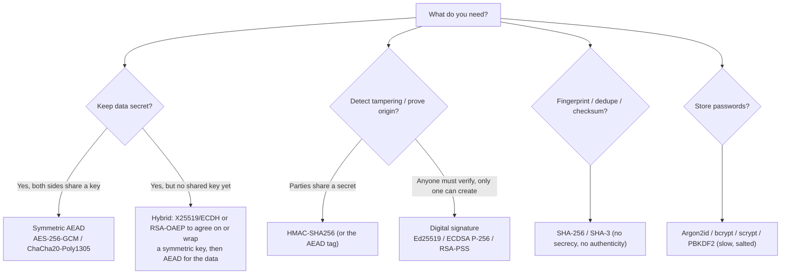
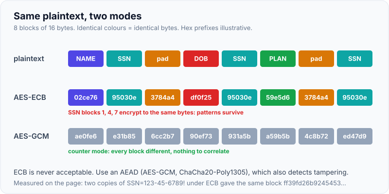
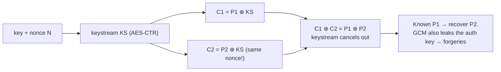
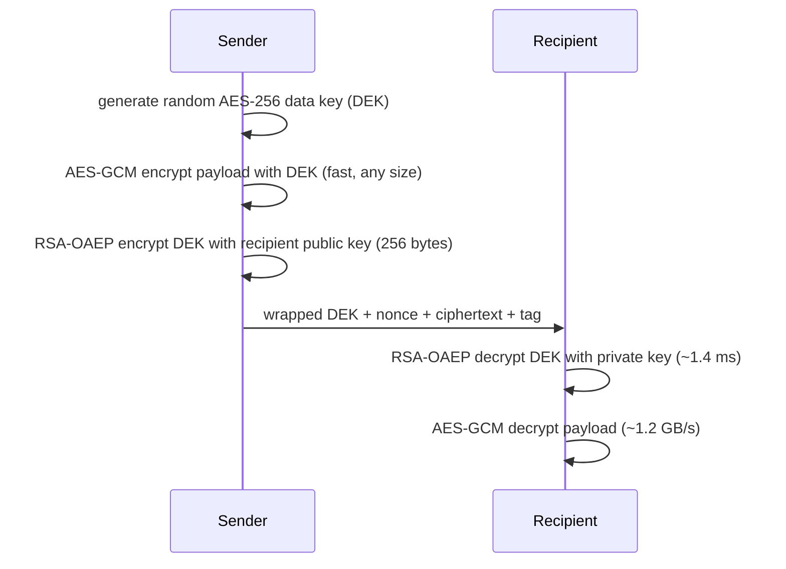
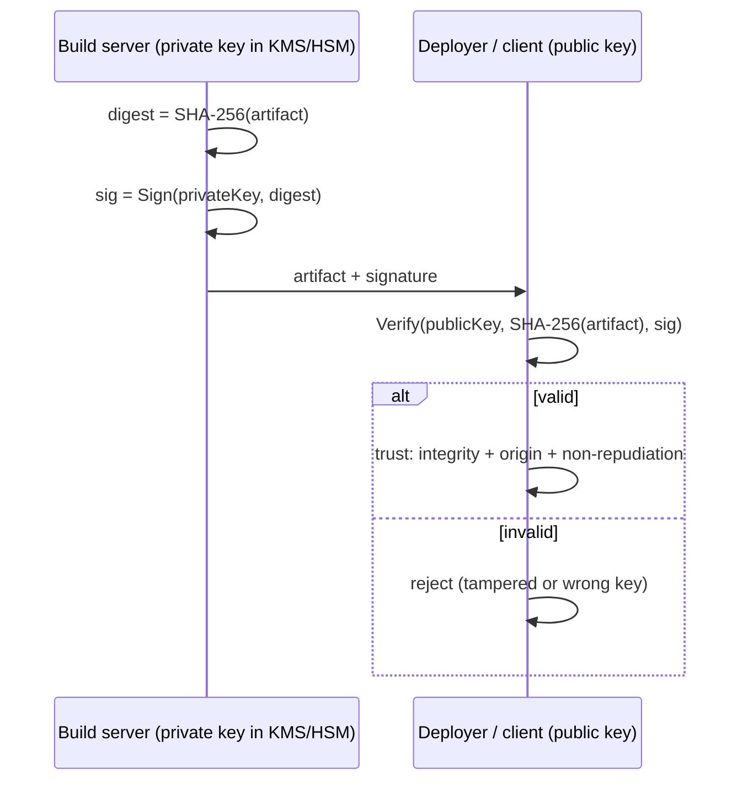

# Symmetric vs Asymmetric Encryption, Hashing, MAC & Digital Signatures

!!! abstract "Key takeaways"
    - Know which **property** you need: **confidentiality** (encryption), **integrity + authenticity with a shared key** (MAC), **integrity + authenticity + non-repudiation with a key pair** (digital signature), or just a **fingerprint** (hash, no key).
    - **Symmetric** (AES) uses one shared key and is fast: AES-256-GCM ran at **~1.2 GB/s** in warmed Java 21 (OpenSSL 3.4 GB/s with AES-NI). Use an **AEAD** mode (AES-GCM, ChaCha20-Poly1305): a one-bit change or wrong associated data raised `AEADBadTagException`. **Never reuse a nonce with the same key**: reusing one let an attacker who knew one plaintext recover the other ("PAY MALLORY 9999999"). **Never use ECB**: identical 16-byte blocks produced identical ciphertext blocks.
    - **Asymmetric** (RSA, elliptic curves) uses a public/private key pair, is slow, and is limited in size: RSA-2048 OAEP can encrypt at most **190 bytes**, and unwrap took **~1.4 ms**. Use it to **exchange or wrap keys** (hybrid encryption, key agreement with X25519/ECDHE) and to **sign**.
    - **Hashes** (SHA-256, SHA-3) give integrity fingerprints, but anyone can recompute them. **HMAC** adds a secret key. Compare tags in **constant time** (`MessageDigest.isEqual`). Passwords need slow, salted hashes (Argon2, bcrypt), not SHA-256 ([password hashing](07-password-hashing-and-secrets-management.md)).
    - **Signatures:** Ed25519 (64-byte signature), ECDSA P-256 (~72 bytes, DER) and RSA-PSS (256/384 bytes). Measured in Java: RSA-2048 **verify 50 µs** but **sign 1.4 ms**, ECDSA sign 275 µs. Choose by ecosystem and verify/sign ratio.

## Why it matters

Cryptography fails through misuse, not broken algorithms: ECB mode, reused GCM nonces, unauthenticated CBC (padding oracles), encrypting with RSA directly, comparing MACs with `equals`, hashing passwords with SHA-256, or confusing encryption with signing. Interviewers for security-sensitive domains (healthcare, payments, key management) ask you to pick the right primitive for a scenario and explain why. This page is the foundation for TLS, envelope encryption, KMS, HSMs and key rotation in this topic.

All results were measured with **Java 21.0.11** (default SunJCE/SunEC providers) on an Intel Xeon with AES-NI while writing this page.

## Core concepts

### Choosing the primitive


*Notice that each branch answers a different security property. Many real bugs come from using a hash where a MAC was needed, or encryption where a signature was needed.*

| Primitive | Key | Confidentiality | Integrity | Authenticity | Non-repudiation |
|---|---|---|---|---|---|
| Hash (SHA-256) | None | ✗ | Only against accidental change | ✗ | ✗ |
| MAC (HMAC) | Shared secret | ✗ | ✓ | ✓ (anyone with the key) | ✗ |
| Symmetric AEAD (AES-GCM) | Shared secret | ✓ | ✓ | ✓ (anyone with the key) | ✗ |
| Asymmetric encryption (RSA-OAEP) | Recipient's public key | ✓ | ✗ by itself | ✗ | ✗ |
| Digital signature | Signer's private key | ✗ | ✓ | ✓ | ✓ (only the private key holder) |

### Symmetric encryption

One key both encrypts and decrypts. AES is a 128-bit **block** cipher. The **mode** turns it into something usable:

| Mode | Properties | Verdict |
|---|---|---|
| **ECB** | Each block encrypted independently, so identical plaintext blocks give identical ciphertext blocks | **Never.** Measured: two copies of `SSN=123-45-6789!` gave the same block `ff39fd26b9245453…` |
| **CBC** | Chained with a random IV. Not authenticated: padding-oracle attacks if errors leak | Legacy. Only with encrypt-then-MAC |
| **CTR** | Stream mode, parallel. Not authenticated | Building block |
| **GCM** | CTR + GHASH authentication tag (AEAD). 96-bit nonce, must be unique per key | **Default** (with care on nonces) |
| **ChaCha20-Poly1305** | AEAD stream cipher, fast without AES hardware | Default on mobile/ARM, in TLS 1.3 |
| **AES-GCM-SIV / XChaCha20** | Nonce-misuse resistant / 192-bit random nonces | When nonce uniqueness is hard to guarantee |

{ loading=lazy }
*Notice the matching teal cells in the ECB row: an attacker learns which fields repeat across records without touching the key.*

**AEAD** = authenticated encryption with associated data: the ciphertext carries a tag (16 bytes for GCM, so a 38-byte plaintext became 54 bytes), and decryption fails unless the ciphertext **and** the associated data (unencrypted context such as a record id) match exactly. Measured:

| Test | Result |
|---|---|
| Flip one bit of the ciphertext | `AEADBadTagException` (nothing decrypted) |
| Decrypt with AAD `claim:C99` instead of `claim:C42` | `AEADBadTagException` (prevents moving ciphertext between records) |
| Re-initialise the same JCE `Cipher` with the same key and IV | `InvalidAlgorithmParameterException: Cannot reuse iv for GCM encryption` |
| Two separate `Cipher` objects, same key and IV | `c1 ⊕ c2 == p1 ⊕ p2` → **true**. Knowing `p1`, the attacker recovered `p2` = `PAY MALLORY 9999999` |


*Notice that the keystream depends only on the key and nonce. Reuse it once and the encryption cancels out. With GCM, reuse also exposes the authentication subkey, so an attacker can forge valid tags.*

{ loading=lazy }
*Watch the orange row: the leading zero bytes show where the two messages agree, before the attacker has even guessed anything.*

Nonce rules for AES-GCM: unique per key (a counter, or 96 random bits), and rotate keys well before ~2³² messages with random nonces (NIST SP 800-38D's limit on invocations per key). [Envelope encryption](03-envelope-encryption-and-data-keys.md) sidesteps this by using a fresh data key per object.

### Asymmetric cryptography

A key pair: the **public key** can be shared, and the **private key** never leaves its owner (ideally an HSM or KMS). Uses:

- **Encryption to a recipient** (RSA-OAEP): only the private key holder can decrypt. It's slow and size-limited. Measured: RSA-2048 with OAEP-SHA-256 refused 300 bytes ("Data must not be longer than 190 bytes" = 256 − 2×32 − 2), wrapped a 32-byte AES key into 256 bytes, and unwrapping took **~1,400 µs**. Never use textbook RSA or PKCS#1 v1.5 encryption (Bleichenbacher attacks).
- **Key agreement** (ECDH, X25519): both sides derive the same shared secret from their private key and the other's public key (measured: X25519 secrets equal). With ephemeral keys (ECDHE) that's TLS 1.3's forward secrecy.
- **Digital signatures:** sign with the private key, verify with the public key.

| Algorithm | Security level (approx.) | Key / signature size (measured) | Notes |
|---|---|---|---|
| RSA-2048 | 112-bit | pub 294 B (X.509), sig 256 B | Widely supported. Minimum today |
| RSA-3072 | 128-bit | pub 422 B, sig 384 B | Recommended for new RSA beyond 2030 |
| ECDSA P-256 | 128-bit | pub 91 B, sig ~72 B (DER) | Needs a good random or deterministic nonce (RFC 6979). Nonce reuse leaks the private key |
| Ed25519 | ~128-bit | pub 44 B, sig 64 B | Deterministic, misuse-resistant, fast in native libraries |
| ML-KEM / ML-DSA (FIPS 203/204) | Post-quantum | Larger (KBs) | Being adopted in hybrid TLS (X25519MLKEM768). JDK 24 added ML-KEM/ML-DSA |

### Hybrid encryption


*Notice that the slow asymmetric operation touches only 32 bytes, and the bulk data uses fast symmetric encryption. TLS, PGP, JWE, S/MIME and cloud envelope encryption all use this split.*

### Hash functions

A cryptographic hash maps any input to a fixed-size digest with **preimage resistance** (you can't find an input for a digest), **second-preimage resistance**, and **collision resistance**. Tiny input changes flip about half the output bits (`claim` → `dd1b3c31…`, `Claim` → `4ca41db0…`). Use SHA-256/384/512 or SHA-3. MD5 and SHA-1 are broken for collisions (SHAttered, 2017). Measured throughput in Java: **SHA-256 293 MB/s, SHA3-256 208 MB/s**.

A hash isn't a MAC: anyone can recompute `SHA-256(message)` after tampering. `SHA-256(secret ‖ message)` is vulnerable to **length extension** with SHA-2 (an attacker can append data and compute a valid digest without knowing the secret). Use HMAC.

### MACs and HMAC

`HMAC(K, m) = H((K ⊕ opad) ‖ H((K ⊕ ipad) ‖ m))`: a keyed hash that's secure even with length-extendable hashes. Measured: changing `amount=125` to `amount=126` gave a completely different tag, at **318 MB/s** for HMAC-SHA256. Uses: webhook signatures (Stripe, GitHub `X-Hub-Signature-256`), JWT HS256, API request signing (AWS SigV4 is HMAC-based), cookie and session integrity. Verify with a **constant-time comparison** (`MessageDigest.isEqual`), never `Arrays.equals`/`String.equals`, which leak how many leading bytes matched through timing.

### Digital signatures


*Notice that verification needs only public information. That's what makes signatures work for JWT RS256/ES256 tokens, code and container signing, and certificates.*

Measured in Java 21 (warmed, 3,000 iterations):

| Algorithm | Key generation | Sign | Verify | Tampered message |
|---|---|---|---|---|
| Ed25519 | 10.7 ms | 899 µs | 937 µs | rejected |
| ECDSA P-256 (SHA-256) | 54 ms | **275 µs** | 921 µs | rejected |
| RSA-PSS 2048 (SHA-256) | 177 ms | 1,431 µs | **50 µs** | rejected |
| RSA-PSS 3072 | 809 ms | 4,308 µs | 107 µs | rejected |

RSA verifies very fast and signs slowly, which suits "sign once, verify many times" (certificates, JWTs verified by many services). Java's pure-Java Ed25519 is slower than native libraries (BoringSSL and libsodium do tens of thousands of operations per second), so measure on your stack.

## In practice: code & configuration

### AES-GCM done right in Java

=== "❌ Common mistake"

    ```java
    Cipher c = Cipher.getInstance("AES");                     // defaults to AES/ECB/PKCS5Padding!
    c.init(Cipher.ENCRYPT_MODE, key);
    byte[] ct = c.doFinal(pt);                                // patterns leak, no integrity

    byte[] iv = new byte[12];                                 // all-zero, fixed IV reused for every message
    Cipher g = Cipher.getInstance("AES/GCM/NoPadding");
    g.init(Cipher.ENCRYPT_MODE, key, new GCMParameterSpec(128, iv));

    if (Arrays.equals(expectedMac, receivedMac)) { ... }      // timing leak
    String hash = sha256(password);                           // fast hash for passwords
    ```

=== "✅ Better"

    ```java
    private static final SecureRandom RNG = new SecureRandom();

    record Sealed(byte[] nonce, byte[] ciphertext) {}

    static Sealed seal(SecretKey key, byte[] plaintext, byte[] aad) throws GeneralSecurityException {
        byte[] nonce = new byte[12];
        RNG.nextBytes(nonce);                                         // unique 96-bit nonce per message
        Cipher c = Cipher.getInstance("AES/GCM/NoPadding");
        c.init(Cipher.ENCRYPT_MODE, key, new GCMParameterSpec(128, nonce));
        c.updateAAD(aad);                                             // bind to context, e.g. "claims:C42:v3"
        return new Sealed(nonce, c.doFinal(plaintext));               // ciphertext includes the 16-byte tag
    }

    static byte[] open(SecretKey key, Sealed s, byte[] aad) throws GeneralSecurityException {
        Cipher c = Cipher.getInstance("AES/GCM/NoPadding");
        c.init(Cipher.DECRYPT_MODE, key, new GCMParameterSpec(128, s.nonce()));
        c.updateAAD(aad);
        return c.doFinal(s.ciphertext());                             // throws AEADBadTagException if tampered
    }

    boolean ok = MessageDigest.isEqual(expectedMac, receivedMac);     // constant-time
    ```

In production, prefer a vetted high-level library (Google **Tink**, AWS Encryption SDK) that handles nonces, key IDs, formats and rotation for you, and keep keys in a KMS or HSM rather than in application memory or configuration.

### Verifying a webhook HMAC

```java
public boolean verifyWebhook(byte[] body, String signatureHeader, byte[] secret) throws Exception {
    Mac mac = Mac.getInstance("HmacSHA256");
    mac.init(new SecretKeySpec(secret, "HmacSHA256"));
    byte[] expected = mac.doFinal(body);                              // over the raw bytes, not re-serialised JSON
    byte[] received = HexFormat.of().parseHex(signatureHeader.replace("sha256=", ""));
    return MessageDigest.isEqual(expected, received);                 // plus a timestamp check against replay
}
```

### Signing and verifying with keys in KMS

```java
// The private key never leaves AWS KMS; the app only sees signatures
SignResponse r = kms.sign(SignRequest.builder()
        .keyId("alias/release-signing")
        .messageType(MessageType.DIGEST)
        .message(SdkBytes.fromByteArray(sha256(artifact)))
        .signingAlgorithm(SigningAlgorithmSpec.ECDSA_SHA_256)
        .build());
// Verifiers use the exported public key locally (fast, no KMS call), or kms.verify(...)
```

## Real-world usage

- **TLS 1.3:** ECDHE (X25519) key agreement, certificate signatures (RSA-PSS or ECDSA), and AEAD record encryption (AES-GCM or ChaCha20-Poly1305). See [TLS and certificates](02-tls-and-certificates.md).
- **JWTs:** HS256 (HMAC, shared secret, so every verifier can also mint tokens) vs RS256/ES256 (signatures, verifiers only need the public key from JWKS). Identity providers such as PingFederate sign tokens with RS256 or ES256.
- **Cloud KMS:** AES-256-GCM for data keys, RSA and ECC keys for signing and wrapping, all inside HSM-backed services ([Cloud KMS](04-cloud-kms.md)).
- **Supply chain:** container image signing (cosign/Sigstore with ECDSA), Git commit signing, and package signatures.
- **Webhooks and APIs:** HMAC request signing (Stripe, GitHub, AWS SigV4) with timestamps to stop replays.

## Trade-offs & production gotchas

!!! warning "Cryptographic misuse that breaks systems"
    - **ECB mode** (Java's default for `"AES"`): identical blocks leak (measured).
    - **Nonce or IV reuse with GCM/CTR:** plaintext recovery and tag forgery (measured recovery). Use random 96-bit nonces with key rotation, counters, or misuse-resistant modes.
    - **Unauthenticated encryption** (CBC without a MAC): padding oracles and bit-flipping. Use AEAD.
    - **RSA without OAEP**, or encrypting bulk data with RSA: insecure or impossible (190-byte limit).
    - **Hash instead of MAC**, `H(secret‖msg)` length extension, and non-constant-time comparisons.
    - **Fast hashes for passwords:** GPUs try billions per second. Use Argon2id or bcrypt.
    - **Home-made crypto or protocols:** use TLS, Tink, libsodium and standard JOSE libraries.
    - **Keys in code, config or logs:** the algorithm doesn't matter if the key leaks. Use KMS, HSM and secret managers.
    - **`java.util.Random` for keys or nonces:** predictable. Use `SecureRandom`.

- **Symmetric vs asymmetric:** symmetric is about 1,000× faster per byte but needs secure key distribution. Asymmetric solves distribution and enables signatures at higher cost, so hybrid schemes get both.
- **RSA vs ECC:** RSA verifies faster and is ubiquitous. ECC has smaller keys and signatures and faster key generation and signing. Ed25519 is the safest by design for new signature schemes, where supported.
- **Post-quantum:** "harvest now, decrypt later" threatens long-lived secrets encrypted with classical key exchange. Plan for hybrid PQC (ML-KEM) in TLS and crypto-agility in your formats (key IDs, algorithm IDs).

## How this connects to my experience

- **Where I used it:** not ★ for this subtopic, but it's the foundation of my security work. At **Coriolis Technologies (CipherTrust Cloud Key Management)** I "developed enterprise key management capabilities supporting AWS, Azure, and GCP environments", "implemented automated key rotation workflows and HSM integrations using Thales Luna and SafeNet", and "worked extensively with AWS KMS, encryption services, and cloud security workflows". At **Deloitte** I used IAM, KMS and Secrets Manager. At **Johnson Controls** I "owned JWT-based authentication and SSO implementation end-to-end". At **OptumRx** I built APIs with OAuth2/PingFederate. *[confirm: which key types and algorithms CCKM managed (AES-256, RSA, EC), and whether you implemented any signing or HMAC verification code]*
- **Talking points:**
    - "I pick the primitive by the property: AEAD for confidentiality and integrity, HMAC for shared-key integrity, signatures when verifiers mustn't be able to sign, and slow salted hashes for passwords."
    - "Most crypto bugs are misuse: ECB, nonce reuse, unauthenticated CBC, timing-unsafe comparisons. I use vetted libraries and keep keys in KMS or HSMs."
    - "For JWTs I prefer asymmetric (RS256/ES256), so services verify with a JWKS public key and only the identity provider can mint tokens."
- **Likely follow-up chain:** "Symmetric vs asymmetric?" → "Why is TLS hybrid?" → "What's AEAD, and why GCM?" → "What happens if you reuse a nonce?" → "HMAC vs hash vs signature?" → "HS256 vs RS256 for JWTs?" → "How did CCKM handle keys?" ([KMS](04-cloud-kms.md), [HSMs](05-hsms-and-byok-hyok.md))

## Interview questions

### Fundamentals

??? question "Q1. What's the difference between symmetric and asymmetric encryption?"
    **Answer:** Symmetric encryption uses one secret key shared by both parties (AES). It's fast (about 1.2 GB/s for AES-256-GCM in warmed Java here) and suits bulk data, but the key must be distributed securely. Asymmetric cryptography uses a key pair: the public key encrypts or verifies, and the private key decrypts or signs (RSA, ECC). It solves key distribution and enables signatures, but it's much slower (RSA-2048 decrypt about 1.4 ms) and size-limited (190 bytes with OAEP-SHA-256). Real systems are hybrid: asymmetric to agree on or wrap a symmetric key, symmetric for the data.

    **Interviewer listens for:** key model, speed and size trade-offs, and the hybrid pattern.

    **Common wrong answer:** "Asymmetric is more secure, so use it for everything."

??? question "Q2. What's the difference between a hash, a MAC and a digital signature?"
    **Answer:** A hash (SHA-256) is keyless: it fingerprints data, but anyone can recompute it after tampering, so it only detects accidental changes. A MAC (HMAC) uses a shared secret, so only key holders can create or verify the tag, giving integrity and authenticity between them, but not non-repudiation (either party could have made it). A digital signature uses a private key to sign and a public key to verify, giving integrity, authenticity and non-repudiation, and anyone can verify without being able to sign.

    **Interviewer listens for:** keyless vs shared key vs key pair, and the properties of each.

    **Common wrong answer:** "A signature is just an encrypted hash, the same as a MAC."

??? question "Q3. Why should you never use ECB mode?"
    **Answer:** ECB encrypts each 16-byte block independently with the same key, so identical plaintext blocks produce identical ciphertext blocks, leaking structure (the famous "ECB penguin"). Measured: two copies of `SSN=123-45-6789!` produced the same ciphertext block, while GCM produced different blocks. ECB also has no integrity. In Java, `Cipher.getInstance("AES")` silently means `AES/ECB/PKCS5Padding`, so always specify `AES/GCM/NoPadding`.

    **Interviewer listens for:** the deterministic per-block problem and the Java default trap.

    **Common wrong answer:** "ECB is fine for short messages."

??? question "Q4. What is authenticated encryption (AEAD), and why use it?"
    **Answer:** AEAD modes (AES-GCM, ChaCha20-Poly1305) provide confidentiality and integrity together: the ciphertext carries an authentication tag computed over the ciphertext and optional associated data (unencrypted context such as a header or record id). Decryption verifies the tag first and fails on any modification. Measured: a single flipped bit, or the wrong AAD (`claim:C99` instead of `C42`), both raised `AEADBadTagException`. That prevents bit-flipping, padding oracles and ciphertext cut-and-paste between records, which unauthenticated modes (CBC, CTR) allow.

    **Interviewer listens for:** confidentiality + integrity, the AAD's purpose, and the attacks prevented.

    **Common wrong answer:** "Encryption already guarantees nobody can modify the data."

### Intermediate

??? question "Q5. What happens if you reuse a nonce with AES-GCM?"
    **Answer:** GCM is CTR mode plus GHASH. The same key and nonce produce the same keystream, so `C1 ⊕ C2 = P1 ⊕ P2`, and knowing or guessing one plaintext reveals the other. Measured: recovering "PAY MALLORY 9999999" from a known first message. Worse, reuse leaks the GHASH authentication subkey, allowing an attacker to forge valid tags for arbitrary ciphertexts. Prevent it with unique nonces per key (counters, or random 96-bit with key rotation well before 2³² messages), fresh data keys per object (envelope encryption), or nonce-misuse-resistant AES-GCM-SIV. Java blocks reuse only on the same `Cipher` instance.

    **Interviewer listens for:** keystream reuse, tag forgery, and prevention strategies.

    **Common wrong answer:** "It just makes encryption slightly weaker."

??? question "Q6. Why can't you encrypt a 1 MB file directly with RSA?"
    **Answer:** RSA operates on numbers smaller than the modulus. With OAEP padding, RSA-2048 can encrypt at most 256 − 2×hashLen − 2 bytes, which is 190 bytes with SHA-256 (measured: 300 bytes was rejected). It's also slow (about 1.4 ms per private-key operation). So you generate a random AES key, encrypt the file with AES-GCM, and encrypt only the AES key with RSA-OAEP (32 bytes becomes 256). That's hybrid or envelope encryption. Never use raw RSA or PKCS#1 v1.5 encryption padding.

    **Interviewer listens for:** the size limit with the padding math, performance, the hybrid solution, and OAEP.

    **Common wrong answer:** "Split the file into 190-byte chunks and RSA-encrypt each."

??? question "Q7. HS256 vs RS256 for JWTs: which and why?"
    **Answer:** HS256 is HMAC with a shared secret: every service that verifies tokens holds the secret and could therefore mint tokens, and rotating it means coordinating every service. RS256 (RSA-PKCS#1 v1.5 signatures) or ES256 (ECDSA P-256) use an asymmetric key pair: only the identity provider signs, and services verify with public keys from a JWKS endpoint, with key IDs (`kid`) for rotation. RSA verification is very fast (50 µs measured), which suits many verifiers. Use asymmetric for distributed systems and third-party consumers. HS256 is acceptable only within a single trust boundary. Also pin the expected algorithm to avoid `alg` confusion attacks.

    **Interviewer listens for:** who can mint, rotation via JWKS and kid, and algorithm pinning.

    **Common wrong answer:** "HS256 is more secure because it's symmetric."

??? question "Q8. Why use HMAC rather than SHA-256(secret + message)?"
    **Answer:** SHA-256 (and SHA-1, SHA-512) use a Merkle–Damgård construction vulnerable to length extension: given `H(secret‖m)` and the length of the secret, an attacker can compute `H(secret‖m‖padding‖extra)` without knowing the secret, forging authenticated messages. HMAC's nested construction prevents this and is provably secure with standard hashes. SHA-3 and BLAKE2/3 aren't length-extendable, but HMAC (or KMAC) is still the standard, interoperable choice. Always compare tags in constant time.

    **Interviewer listens for:** length extension, the HMAC construction, and constant-time comparison.

    **Common wrong answer:** "Prepending the secret is just as good."

??? question "Q9. Why must MAC or signature comparisons be constant-time?"
    **Answer:** A normal byte-by-byte comparison returns as soon as bytes differ, so response time leaks how many leading bytes of a guessed tag were correct. Over many requests an attacker can recover a valid tag byte by byte. Constant-time comparison (`MessageDigest.isEqual` in Java, `hmac.compare_digest` in Python, `crypto.timingSafeEqual` in Node) always examines all bytes. It applies to MACs, password reset tokens, API keys and session tokens. Signature verification libraries handle this internally.

    **Interviewer listens for:** the timing side channel and correct APIs.

    **Common wrong answer:** "Network jitter makes timing attacks impossible."

### Senior

??? question "Q10. RSA, ECDSA or Ed25519 for a new signing system: how do you decide?"
    **Answer:** Consider ecosystem support (HSMs, KMS, clients, standards such as JWT and X.509), sizes, performance profile and misuse risk. RSA-3072 (PSS): universal support and very fast verification (RSA-2048 verify 50 µs measured), but slow signing (1.4–4.3 ms) and large keys and signatures (384 B). ECDSA P-256: small, fast signing (275 µs measured), FIPS-approved and supported by every KMS and HSM, but signatures need a unique per-signature nonce (bad RNGs have leaked keys, as with the PS3), so use RFC 6979 deterministic nonces. Ed25519: deterministic, misuse-resistant, small and fast in native code, but support varies (FIPS 186-5 now includes it, while older HSMs or KMS may not). Plan for crypto-agility (algorithm identifiers, key IDs) and post-quantum migration (ML-DSA).

    **Interviewer listens for:** a multi-criteria decision, nonce risks, compliance, and agility.

    **Common wrong answer:** "Always RSA-4096 for maximum security."

??? question "Q11. Design encryption for sensitive fields (SSN, diagnosis codes) in a healthcare database."
    **Answer:** Use application-level field encryption with AEAD (AES-256-GCM) via a vetted library (Tink, AWS Encryption SDK), with envelope encryption: data keys generated by KMS, wrapped by a KMS key, cached briefly, and rotated. Bind ciphertext to context with AAD (table, record id, field, key version) so ciphertext can't be swapped between rows. Store the key version or ID with the ciphertext for rotation. For lookups by SSN, add a separate keyed blind index (HMAC-SHA256 with its own key) rather than deterministic encryption, accepting the equality-leakage trade-off. Restrict decrypt permissions through IAM, audit KMS usage, and also use storage-level encryption at rest (defence in depth).

    **Interviewer listens for:** AEAD + envelope + AAD binding, key versioning, a blind index for search, and access control and audit.

    **Common wrong answer:** "Turn on disk encryption; that covers it."

??? question "Q12. What does post-quantum cryptography mean for systems you build today?"
    **Answer:** Large quantum computers would break RSA and ECC (Shor's algorithm), while symmetric crypto and hashes remain safe with adequate sizes (AES-256, SHA-384). The urgent risk is "harvest now, decrypt later": recorded TLS traffic protected by classical ECDHE could be decrypted in future. NIST standardised ML-KEM (FIPS 203) for key establishment, and ML-DSA and SLH-DSA (FIPS 204/205) for signatures. Browsers and CDNs already negotiate hybrid X25519+ML-KEM in TLS 1.3, and JDK 24 added ML-KEM and ML-DSA. Action: inventory cryptographic usage, prefer TLS endpoints and libraries that support hybrid PQC key exchange, design formats with algorithm and key identifiers (crypto-agility), use AES-256 for long-lived data, and plan signature migration for long-lived trust anchors.

    **Interviewer listens for:** which primitives are threatened, harvest-now-decrypt-later, the standards, and agility.

    **Common wrong answer:** "Quantum breaks all encryption, so nothing we do matters."

### Scenario-based

??? question "Q13. A code review shows: Cipher.getInstance(\"AES\"), a static IV, and Arrays.equals for HMAC checks. What do you tell the team?"
    **Answer:** Three vulnerabilities. (1) `"AES"` defaults to ECB with PKCS5 padding: deterministic per block and unauthenticated (measured: identical blocks leaked). Use `AES/GCM/NoPadding`. (2) A static IV with GCM or CTR means keystream reuse: plaintext recovery and tag forgery (measured: the second message was recovered). Use a random 96-bit nonce per message stored with the ciphertext, or per-object data keys. (3) `Arrays.equals` is timing-unsafe. Use `MessageDigest.isEqual`. Recommend a high-level library (Tink) to remove these choices, keys from KMS, tests for tamper detection, and static analysis rules (SpotBugs Find Security Bugs, Semgrep) to catch them.

    **Interviewer listens for:** each flaw with impact and fix, and systemic prevention.

    **Common wrong answer:** "Switch to AES-256 and it's fine."

??? question "Q14. Partners must verify that the files you send them came from you and weren't modified, without being able to forge files themselves. Design it."
    **Answer:** Use digital signatures, not HMAC (with HMAC, any partner holding the key could forge). Sign a SHA-256 digest of each file with a private key held in KMS or an HSM (ECDSA P-256 or RSA-PSS 3072, chosen for partner tooling compatibility). Publish the public key through a trusted channel (an X.509 certificate from your PKI, or a JWKS URL over TLS) with a key ID. Include metadata in what's signed (filename, timestamp, version) to prevent substitution and replay. Partners verify locally. Rotate signing keys with overlap, publishing new public keys before switching. If confidentiality is also required, add hybrid encryption to each partner's public key (sign-then-encrypt). Log every signing operation through KMS audit.

    **Interviewer listens for:** signature over MAC, key custody, public key distribution, metadata binding, and rotation.

    **Common wrong answer:** "Send the SHA-256 hash in the email with the file."

## Cheat sheet

| Need | Use | Avoid |
|---|---|---|
| Confidentiality + integrity | AES-256-GCM / ChaCha20-Poly1305 (AEAD, unique nonce, AAD) | ECB, CBC without MAC, static IVs |
| Key exchange | X25519 / ECDHE (forward secrecy); hybrid ML-KEM | Static RSA key transport |
| Encrypt to a recipient | Hybrid: RSA-OAEP / ECIES wraps an AES key (OAEP-SHA-256 max 190 B on RSA-2048) | Raw RSA, PKCS#1 v1.5 encryption |
| Shared-key integrity | HMAC-SHA256 + constant-time compare | H(secret‖msg), `equals` |
| Public verifiability | Ed25519, ECDSA P-256 (RFC 6979), RSA-PSS 3072 | RSA < 2048, ECDSA nonce reuse |
| Fingerprint | SHA-256/384, SHA-3 | MD5, SHA-1 |
| Passwords | Argon2id, bcrypt, scrypt, PBKDF2 | SHA-256, MD5 |
| Randomness | `SecureRandom` | `Random`, timestamps |
| Measured | GCM ~1.2 GB/s; SHA-256 293 MB/s; HMAC 318 MB/s; RSA-2048 sign 1.4 ms / verify 50 µs; ECDSA sign 275 µs | |

## Sources
1. [NIST SP 800-38D: Galois/Counter Mode (GCM)](https://csrc.nist.gov/pubs/sp/800/38/d/final) and [NIST SP 800-57: Key management recommendations](https://csrc.nist.gov/pubs/sp/800/57/pt1/r5/final).
2. [RFC 8017: PKCS #1 v2.2 (RSA-OAEP, RSA-PSS)](https://www.rfc-editor.org/rfc/rfc8017), [RFC 8032: EdDSA (Ed25519)](https://www.rfc-editor.org/rfc/rfc8032) and [RFC 6979: Deterministic ECDSA](https://www.rfc-editor.org/rfc/rfc6979).
3. [RFC 2104: HMAC](https://www.rfc-editor.org/rfc/rfc2104) and [FIPS 180-4 / FIPS 202 (SHA-2, SHA-3)](https://csrc.nist.gov/pubs/fips/202/final).
4. [Java Cryptography Architecture reference guide (Java 21)](https://docs.oracle.com/en/java/javase/21/security/java-cryptography-architecture-jca-reference-guide.html).
5. [OWASP Cryptographic Storage Cheat Sheet](https://cheatsheetseries.owasp.org/cheatsheets/Cryptographic_Storage_Cheat_Sheet.html) and [Google Tink](https://developers.google.com/tink).
6. [NIST post-quantum standards: FIPS 203, 204, 205](https://csrc.nist.gov/projects/post-quantum-cryptography) and [JEP 496/497 (ML-KEM, ML-DSA in JDK 24)](https://openjdk.org/jeps/496).
7. Ferguson, Schneier, Kohno, *Cryptography Engineering*; Jean-Philippe Aumasson, *Serious Cryptography* (2nd ed.).
8. Demonstrations on this page: Java 21.0.11 programs run while writing this page (GCM tamper/AAD/nonce reuse, ECB leakage, HMAC, signature sizes and speeds, RSA-OAEP limit, X25519, throughput), plus `openssl speed` for comparison.
