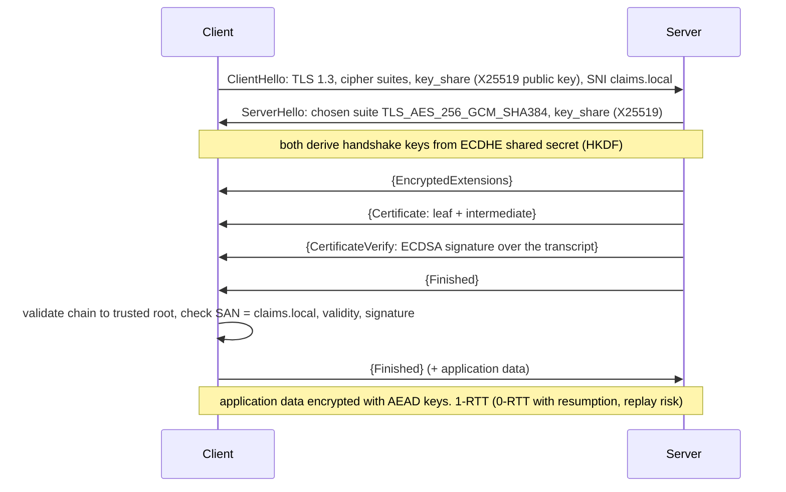
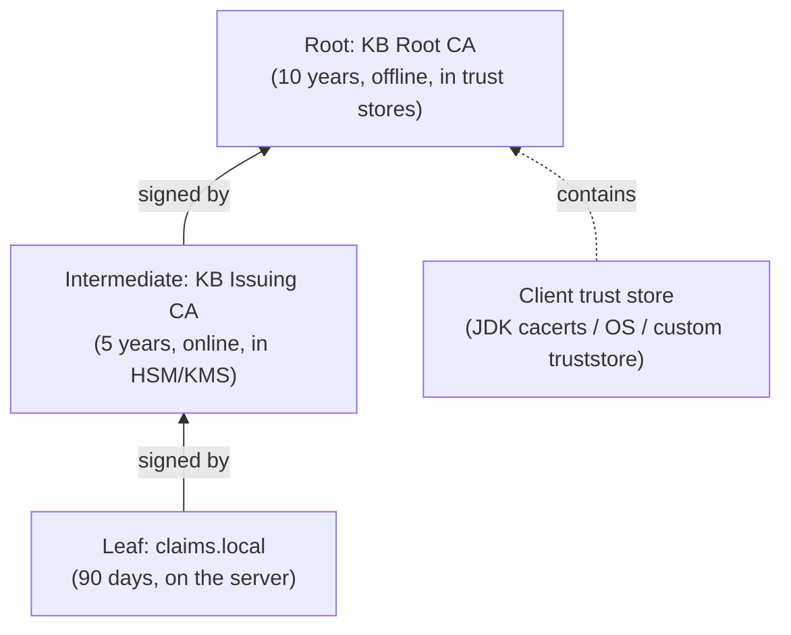
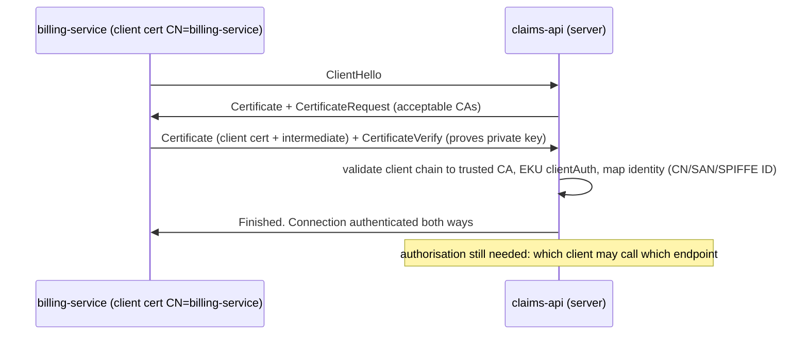

# TLS & Certificates (PKI, mTLS)

!!! abstract "TL;DR"
    - **TLS** gives a connection **confidentiality** (AEAD), **integrity** and **server authentication** (and client authentication with **mTLS**). TLS 1.3 negotiated `TLS_AES_256_GCM_SHA384`, an **X25519** ephemeral key exchange (forward secrecy) and an **ECDSA** certificate signature in the demo, in one round trip.
    - A **certificate** binds a public key to names (the **SAN** list) and is signed by a CA. Clients build a **chain** leaf → intermediate → trusted root. A server that omitted its intermediate failed with "**unable to verify the first certificate**" (code 21). A wrong hostname failed in both OpenSSL and Java ("No subject alternative names matching IP address 127.0.0.2"), and expiry failed with "certificate has expired".
    - Java's default trust store doesn't know private CAs: "**PKIX path building failed / unable to find valid certification path**". The fix is a trust store containing the private root (HTTP 200 over TLS 1.3 afterwards), **never** a trust-all `TrustManager`.
    - **mTLS:** the server requires a client certificate signed by a trusted CA. Without one, the connection failed with TLS alert **116 "certificate required"**. It's the standard for service-to-service identity (service meshes, PingFederate/OAuth client authentication, bank and partner APIs).
    - Operate certificates as a lifecycle: short validity (90 days now, heading to 47 days for public certs), **automated renewal** (ACME/Let's Encrypt, cert-manager, ACM, Key Vault), monitoring expiry, protected private keys (KMS/HSM), and a CA hierarchy with an offline root.

## Why it matters

Expired certificates and broken chains cause some of the most embarrassing outages (Microsoft Teams, Spotify and countless internal services). Developers also routinely "fix" `PKIX path building failed` by disabling verification, which turns TLS into encryption to anyone. Interviewers ask how the handshake works, what's in a certificate, how chains are validated, how mTLS works and how certificates are rotated. For a key-management background, they'll also probe CA design and private key protection.

Everything in the demos was done with **OpenSSL 3.0.13** (a root CA, an issuing intermediate, a server certificate and a client certificate, all ECDSA P-256) and **Java 21** `HttpClient`, while writing this page.

## Core concepts

### What TLS provides, and the TLS 1.3 handshake


*Notice that the certificate only authenticates the server (by signing the handshake transcript). The traffic keys come from the ephemeral X25519 exchange, so stealing the certificate's private key later doesn't decrypt recorded sessions: that's forward secrecy.*

Measured: TLS 1.3 handshake with `Cipher is TLS_AES_256_GCM_SHA384`, `Server Temp Key: X25519, 253 bits`, `Peer signature type: ECDSA`, `Verify return code: 0 (ok)`. Forcing TLS 1.2 gave `ECDHE-ECDSA-AES256-GCM-SHA384`. Requesting a legacy suite (`RC4-MD5`) failed with "no cipher match", because OpenSSL 3 doesn't even offer it.

| | TLS 1.2 | TLS 1.3 |
|---|---|---|
| Round trips | 2 RTT (1 with resumption) | **1 RTT** (0-RTT optional) |
| Key exchange | RSA key transport or (EC)DHE | **(EC)DHE only**: forward secrecy mandatory |
| Ciphers | Many, including CBC and weak legacy suites | 5 AEAD suites (AES-GCM, ChaCha20-Poly1305, AES-CCM) |
| Certificate | Sent in the clear | Encrypted |
| Status | Still common, acceptable with good config | Default for new systems |

Hybrid post-quantum key exchange (`X25519MLKEM768`) is already negotiated by modern browsers and CDNs with TLS 1.3, and OpenSSL 3.5 and recent JDKs support it.

### X.509 certificates

| Field | Example (measured) | Purpose |
|---|---|---|
| Subject | `CN = claims.local` | Legacy name. **Not used for hostname checks** by modern clients |
| **Subject Alternative Name** | `DNS:claims.local, DNS:localhost, IP Address:127.0.0.1` | The names the certificate is valid for |
| Issuer | `CN = KB Issuing CA` | Who signed it |
| Validity | `notBefore=Oct 3 2026`, `notAfter=Jan 1 2027` (90 days) | Time window |
| Public key | EC P-256 | Key the holder proves possession of |
| Key Usage / Extended Key Usage | `digitalSignature` / `TLS Web Server Authentication` | What the key may be used for (`clientAuth` for mTLS client certs) |
| Basic Constraints | CA certs: `CA:TRUE, pathlen:0` | Whether it may sign other certificates |
| CRL Distribution Points / AIA | URLs | Revocation info, issuer download, OCSP |
| Signature | ECDSA-SHA256 by the issuer | Binds everything above |

### Chains and trust


*Notice that clients only trust roots. The server must send the leaf **and** the intermediates, so the client can build the path up to a root it already has.*

Measured validation results:

| Test | Result |
|---|---|
| `openssl verify -CAfile root.crt server.crt` (intermediate not provided) | **verification failed** |
| Same with `-untrusted int.crt` | `server.crt: OK` |
| Server configured with the leaf only, client trusting the root | `Verify return code: 21 (unable to verify the first certificate)` |
| `-verify_hostname evil.local` | verification failed |
| `-attime` one day after expiry | `certificate has expired` |
| Java `HttpClient`, default JDK trust store, private CA | `SSLHandshakeException: unable to find valid certification path to requested target` |
| Java with a PKCS12 trust store containing `KB Root CA` | **HTTP 200 via TLSv1.3 TLS_AES_256_GCM_SHA384** |
| Java connecting to `127.0.0.2` (not in the SAN) | `No subject alternative names matching IP address 127.0.0.2 found` |

Validation steps a client performs: build a path to a trust anchor, check each signature, validity dates, basic constraints and path length, key usage and EKU, name constraints, the **hostname against the SANs**, and (optionally) revocation status.

### Revocation

| Mechanism | How | Reality |
|---|---|---|
| CRL | CA publishes a signed list of revoked serials | Large, cached. Fine for private PKI |
| OCSP | Client asks the CA's responder about one cert | Privacy and latency issues. Let's Encrypt ended OCSP in 2025 in favour of CRLs |
| OCSP stapling | Server attaches a signed OCSP response | Avoids client lookups |
| Short-lived certificates | Expire before revocation matters | The industry direction (public TLS validity falling to 47 days by 2029) |

Many clients soft-fail on revocation checks, so in practice short lifetimes plus fast key rotation are the dependable controls.

### Mutual TLS


*Notice that mTLS authenticates the client by possession of a private key, which is stronger than a bearer token because it can't be replayed from a log. But authentication isn't authorisation: the server still decides what that identity may do.*

Measured: with the client certificate, the handshake succeeded (`Verify return code: 0`). Without it, the server aborted with **`tlsv13 alert certificate required` (SSL alert number 116)**.

Where mTLS shows up: service meshes (Istio and Linkerd issue SPIFFE identities like `spiffe://cluster.local/ns/claims/sa/billing` and rotate them automatically), Kafka client authentication, OAuth 2.0 **mutual-TLS client authentication and certificate-bound access tokens** (RFC 8705, supported by PingFederate), Open Banking and partner B2B APIs, and database connections.

## In practice: code & configuration

### Spring Boot 3: SSL bundles

```yaml
spring:
  ssl:
    bundle:
      pem:
        server:
          keystore:
            certificate: "file:/etc/tls/tls.crt"      # leaf + intermediate (full chain!)
            private-key: "file:/etc/tls/tls.key"
          truststore:
            certificate: "file:/etc/tls/ca.crt"       # CAs trusted for client certs (mTLS)
          reload-on-update: true                      # hot-reload renewed certs (Boot 3.2+)
        partner-client:
          keystore:
            certificate: "file:/etc/partner/client.crt"
            private-key: "file:/etc/partner/client.key"
          truststore:
            certificate: "file:/etc/partner/partner-root.crt"
server:
  port: 8443
  ssl:
    bundle: server
    client-auth: need                                 # require client certificates (mTLS)
```

```java
@Bean
RestClient partnerClient(RestClient.Builder builder, RestClientSsl ssl) {   // RestClientSsl: Boot 3.2+
    return builder
        .baseUrl("https://api.partner.example.com")
        .apply(ssl.fromBundle("partner-client"))   // client cert for mTLS + partner trust store
        .build();
}
```

The point is to reference a named SSL bundle (`RestClientSsl`, `WebClientSsl`, or `SslBundles` for other clients) instead of building `SSLContext`s by hand.

=== "❌ Common mistake"

    ```java
    // "Fixes" PKIX errors by trusting everything: any attacker can now impersonate the server
    TrustManager[] trustAll = { new X509TrustManager() {
        public void checkClientTrusted(X509Certificate[] c, String a) {}
        public void checkServerTrusted(X509Certificate[] c, String a) {}
        public X509Certificate[] getAcceptedIssuers() { return new X509Certificate[0]; }
    }};
    sslContext.init(null, trustAll, null);
    HttpsURLConnection.setDefaultHostnameVerifier((host, session) -> true);   // and no hostname check
    ```

=== "✅ Better"

    ```java
    // Trust exactly the private root you need (or use a Spring SSL bundle / JVM truststore)
    KeyStore ts = KeyStore.getInstance("PKCS12");
    try (var in = Files.newInputStream(Path.of("/etc/tls/truststore.p12"))) { ts.load(in, pwd); }
    TrustManagerFactory tmf = TrustManagerFactory.getInstance("PKIX");
    tmf.init(ts);
    SSLContext ctx = SSLContext.getInstance("TLS");
    ctx.init(null, tmf.getTrustManagers(), null);
    HttpClient client = HttpClient.newBuilder().sslContext(ctx).build();   // hostname verification stays on
    ```

### Certificates in Kubernetes with cert-manager

```yaml
apiVersion: cert-manager.io/v1
kind: Certificate
metadata: { name: claims-api-tls, namespace: claims }
spec:
  secretName: claims-api-tls            # tls.crt (full chain), tls.key, ca.crt
  duration: 2160h                       # 90 days
  renewBefore: 720h                     # renew 30 days early
  privateKey: { algorithm: ECDSA, size: 256, rotationPolicy: Always }   # new key on each renewal
  dnsNames: [claims.internal.example.com]
  issuerRef: { name: internal-ca, kind: ClusterIssuer }   # private CA (Vault, AWS Private CA, ACME for public)
```

### Diagnosing TLS problems

```bash
openssl s_client -connect api.example.com:443 -servername api.example.com -showcerts </dev/null
#   check: "Verify return code", the chain sent, SANs, expiry, negotiated protocol/cipher
openssl x509 -in cert.pem -noout -subject -issuer -dates -ext subjectAltName,extendedKeyUsage
openssl verify -CAfile root.crt -untrusted intermediate.crt leaf.crt
keytool -list -v -keystore truststore.p12                    # what does the JVM trust?
java -Djavax.net.debug=ssl:handshake -jar app.jar            # JSSE handshake trace
```

## Real-world usage

- **AWS:** **ACM** issues and auto-renews public certificates for ALB, CloudFront and API Gateway (private keys never exported). **AWS Private CA** runs private hierarchies for internal mTLS. Certificates for EC2 or EKS pods come via cert-manager with the AWS Private CA issuer.
- **Azure:** **Key Vault certificates** with auto-renewal (DigiCert/GlobalSign integration or a private CA), App Gateway and Front Door integration, and the Key Vault CSI driver for pods.
- **Let's Encrypt / ACME** issues the majority of public web certificates for free with 90-day lifetimes, and has announced shorter options, driving full automation.
- **Service meshes** (Istio, Linkerd, Cilium) give every workload an mTLS identity with automatic rotation (hours to days), removing certificate handling from application code.
- **Enterprise PKI** at banks and healthcare organisations uses an offline root, HSM-protected issuing CAs (Thales Luna, Entrust), and CRL/OCSP infrastructure, the kind of environment CipherTrust integrates with.

## Trade-offs & production gotchas

!!! warning "TLS and certificate failures"
    - **Expired certificates:** the classic outage. Automate renewal, alert at 30/14/7 days, and monitor the certificates actually served, not just the ones issued.
    - **Missing intermediate:** works in browsers (which cache or fetch intermediates) but fails in Java, curl and mobile clients (measured: code 21). Always serve the full chain.
    - **Trust-all TrustManagers or disabled hostname verification:** a man-in-the-middle can read everything. Fix trust stores instead.
    - **Wrong names:** CN-only certificates, a missing SAN for a new hostname or IP (measured Java error), wildcards that don't cover nested subdomains (`*.example.com` doesn't match `a.b.example.com`).
    - **Weak configuration:** TLS 1.0/1.1, RSA key exchange (no forward secrecy), CBC suites. Prefer TLS 1.3 and 1.2 with ECDHE + AEAD only.
    - **Private keys in Git, images or wide-access Secrets:** the certificate's protection is only as good as the key's. Use KMS/HSM-backed issuers or tightly scoped Secrets.
    - **JVM caches and long-lived connections:** renewed certificates aren't picked up without reload (Spring SSL bundle `reload-on-update`) or a restart.
    - **mTLS without authorisation:** any certificate from a broad CA is accepted. Restrict the trusted CAs and map identities to permissions.

- **Public vs private CA:** public CAs are trusted everywhere but issue only for public DNS names you control. Private CAs give you full control (internal names, mTLS, short lifetimes), but you must distribute trust anchors.
- **TLS termination at the edge vs end-to-end:** terminating at the ALB or Ingress simplifies certificates but leaves internal hops in plaintext unless you re-encrypt or use a mesh. Regulated environments (HIPAA, PCI) often require encryption in transit internally too.

## How this connects to my experience

- **Where I used it:** not ★ for this subtopic, but adjacent to my resume. At **Coriolis (CipherTrust Cloud Key Management)**: enterprise key management across AWS, Azure and GCP with HSM integrations (Thales Luna, SafeNet), the infrastructure that typically protects CA and TLS private keys. At **OptumRx**: "secure enterprise APIs using OAuth2, PingFederate, and Active Directory integration", where TLS and possibly mTLS sit underneath. At **Johnson Controls**: JWT-based authentication and SSO. *[confirm: whether you handled certificate issuance or renewal, mTLS between services, Java trust store issues, or PingFederate certificate configuration (signing certs, SSL server certs)]*
- **Talking points:**
    - "I treat certificates as a lifecycle: short validity, automated renewal with cert-manager or ACM, full chains, and monitoring of what's actually served."
    - "PKIX errors are fixed by trusting the right CA in a scoped trust store, never by disabling verification."
    - "mTLS gives strong workload identity, but I still authorise per identity, ideally through a mesh or gateway so apps don't handle certificates directly."
- **Likely follow-up chain:** "Walk me through a TLS handshake" → "What's forward secrecy?" → "How does a client validate a certificate?" → "What does PKIX path building failed mean?" → "How does mTLS work, and where would you use it?" → "How do you avoid expired-certificate outages?" → "How are CA keys protected?" ([HSMs](05-hsms-and-byok-hyok.md))

## Interview questions

### Fundamentals

??? question "Q1. What does TLS provide, and how does the TLS 1.3 handshake work at a high level?"
    **Answer:** Confidentiality and integrity of data in transit (AEAD encryption) and authentication of the server, optionally the client too. In TLS 1.3, the client sends supported suites and an ephemeral key share (X25519). The server replies with its key share, and both derive keys with HKDF from the ECDHE secret. The server sends its certificate chain encrypted, proves possession of the private key by signing the handshake transcript (CertificateVerify), and both exchange Finished MACs. One round trip. Measured: `TLS_AES_256_GCM_SHA384` with `X25519` and an ECDSA signature.

    **Interviewer listens for:** the key exchange vs authentication split, ephemeral keys, certificate verify, and 1-RTT.

    **Common wrong answer:** "The client encrypts data with the server's public key from the certificate."

??? question "Q2. What is forward secrecy?"
    **Answer:** Session keys are derived from ephemeral (EC)DHE key pairs that are discarded after the handshake, so compromising the server's long-term private key later doesn't let an attacker decrypt previously recorded sessions. The certificate key only signs the handshake. TLS 1.3 requires ephemeral key exchange. TLS 1.2 with RSA key transport lacks forward secrecy (the client encrypts the pre-master secret with the server's RSA key), so it should be disabled. Measured: `Server Temp Key: X25519` is the ephemeral key.

    **Interviewer listens for:** ephemeral keys, the role of the long-term key, and RSA key transport as the counterexample.

    **Common wrong answer:** "It means certificates are renewed regularly."

??? question "Q3. What's inside an X.509 certificate, and which field is used for hostname verification?"
    **Answer:** Subject and issuer names, a validity period, the subject's public key, extensions (Subject Alternative Names, Key Usage, Extended Key Usage, Basic Constraints, CRL and AIA URLs), a serial number, and the issuer's signature over all of it. Modern clients verify the hostname against the **SAN** list (DNS names, IPs), not the Subject CN (measured: Java reported "No subject alternative names matching IP address 127.0.0.2"). EKU must include serverAuth for servers and clientAuth for mTLS clients.

    **Interviewer listens for:** the main fields, SAN for hostnames, and EKU.

    **Common wrong answer:** "The CN must equal the hostname."

??? question "Q4. How does a client decide to trust a server certificate?"
    **Answer:** It builds a chain from the leaf through the intermediates the server sent to a root in its trust store, verifies each signature, checks validity dates, basic constraints and path length, key usage and EKU, name constraints, matches the requested hostname against the SANs, and optionally checks revocation (CRL/OCSP). Measured failures: missing intermediate (code 21, "unable to verify the first certificate"), hostname mismatch, expiry, and an unknown root in Java ("unable to find valid certification path").

    **Interviewer listens for:** chain building to a trust anchor and the individual checks.

    **Common wrong answer:** "It checks that the certificate is signed by anyone."

### Intermediate

??? question "Q5. What does 'PKIX path building failed' mean in Java, and how do you fix it properly?"
    **Answer:** JSSE couldn't build a chain from the server's certificate to any trust anchor in its trust store. Causes: a private or corporate CA not in the JDK `cacerts`, the server not sending its intermediate, a TLS-inspecting proxy re-signing traffic, or an expired or wrong chain. Fix: diagnose with `openssl s_client -showcerts` and `-Djavax.net.debug=ssl:handshake`, fix the server's chain if incomplete, and add the correct root to a dedicated trust store (a Spring SSL bundle, `-Djavax.net.ssl.trustStore`, or the image's cacerts at build time). Measured: the default store failed, and a trust store with the private root gave HTTP 200. Never install a trust-all TrustManager.

    **Interviewer listens for:** the meaning, causes, diagnostics and a scoped fix.

    **Common wrong answer:** "Disable certificate validation in the HTTP client."

??? question "Q6. How does mutual TLS work, and when would you use it?"
    **Answer:** The server sends a CertificateRequest, and the client presents its certificate chain and signs the transcript to prove key possession. The server validates it against trusted client CAs (EKU clientAuth) and maps the identity (CN, SAN or SPIFFE ID) to permissions. Measured: with a client certificate the handshake succeeded, and without one the server sent alert 116 "certificate required". Use it for service-to-service authentication (meshes), partner and B2B APIs, OAuth client authentication and certificate-bound tokens (RFC 8705), Kafka, and admin interfaces. It still needs authorisation and automated certificate rotation.

    **Interviewer listens for:** the CertificateRequest flow, proof of possession, identity mapping, use cases, and authorisation.

    **Common wrong answer:** "mTLS means encrypting the data twice."

??? question "Q7. Why do servers need to send intermediate certificates?"
    **Answer:** Trust stores contain roots, not intermediates. CAs sign leaves with intermediates so the root key can stay offline. The client needs the intermediate to link the leaf to the root. Browsers often hide the problem by caching intermediates or fetching them via AIA, but Java, curl, Go and mobile clients typically fail. Measured: a leaf-only server gave `Verify return code: 21 (unable to verify the first certificate)`, while `openssl verify` with the intermediate passed. Configure the full chain (leaf first, then intermediates, without the root) on servers and load balancers.

    **Interviewer listens for:** the root-offline rationale, client differences, and the configuration order.

    **Common wrong answer:** "The root certificate should be sent so the client can trust it."

??? question "Q8. How does certificate revocation work, and why are short-lived certificates preferred?"
    **Answer:** CRLs are signed lists of revoked serials published by the CA. OCSP lets clients ask a responder about one certificate, and stapling has the server attach the response. In practice revocation is unreliable: clients often soft-fail when responders are unreachable, CRLs are large, and OCSP raises privacy and latency concerns (Let's Encrypt ended OCSP in 2025). Short-lived certificates (90 days today, heading to 47 days for public TLS, hours to days in service meshes) limit the exposure window automatically, provided renewal is fully automated.

    **Interviewer listens for:** the mechanisms, their weaknesses, and the short-lived trend with automation.

    **Common wrong answer:** "Browsers always check revocation, so revocation solves key compromise."

??? question "Q9. TLS termination at the load balancer vs end-to-end encryption: what are the trade-offs?"
    **Answer:** Terminating at the ALB, Ingress or CDN centralises certificates (ACM or Key Vault auto-renewal), enables L7 routing and WAF inspection, and offloads crypto, but traffic from the LB to pods is plaintext unless re-encrypted. End-to-end (re-encryption to the backend, TLS passthrough, or mesh mTLS) protects internal hops against network sniffing and lateral movement, which compliance (HIPAA, PCI DSS) often requires, but adds certificate management for backends and costs a little CPU. A common pattern is public TLS at the edge with ACM, plus mesh mTLS or re-encryption internally.

    **Interviewer listens for:** operational vs security trade-offs and the common hybrid.

    **Common wrong answer:** "Inside the VPC is trusted, so plaintext is fine."

### Senior

??? question "Q10. Design a private PKI for service-to-service mTLS across 200 services."
    **Answer:** A root CA kept offline (HSM-protected, used only to sign intermediates), issuing intermediates per environment or region in an HSM or managed CA (AWS Private CA, Vault PKI, an Azure-backed CA) with name constraints. Workload identity in SANs (SPIFFE IDs or DNS names per service). Automated issuance and rotation via a service mesh (Istio/Linkerd: short-lived certs, hours to days, no app changes) or cert-manager with `privateKey.rotationPolicy: Always`. Trust distribution: the root in every workload's trust store via mesh or ConfigMaps. Authorisation policies keyed on identity. Revocation through short lifetimes plus CRLs for intermediates. Monitoring for issuance failures and expiry, a documented root rollover plan with overlapping trust, and audit of every issuance.

    **Interviewer listens for:** hierarchy and key protection, identity format, automation, trust distribution, authorisation and rollover.

    **Common wrong answer:** "One self-signed certificate shared by all services."

??? question "Q11. How would you rotate a TLS certificate and key without downtime?"
    **Answer:** Issue the new certificate (with a new key pair) before the old one expires, through automation (cert-manager `renewBefore`, ACM auto-renewal, Key Vault policy). Deploy it so servers serve the new chain without dropping connections: hot reload (Spring SSL bundles `reload-on-update`, NGINX reload, Envoy SDS), or a rolling restart behind a load balancer. For CA or intermediate changes, distribute the new trust anchor to clients first, so both old and new are trusted, then switch issuance, then remove the old anchor after all leaves are reissued. Monitor the served certificate (synthetic checks) and expiry metrics. With mTLS, clients and servers must trust both chains during the overlap.

    **Interviewer listens for:** pre-expiry automation, hot reload, trust overlap for CA changes, and verification.

    **Common wrong answer:** "Replace the files and restart everything at once."

??? question "Q12. How are CA and TLS private keys protected in a high-assurance environment?"
    **Answer:** CA keys live in FIPS 140-2/140-3 Level 3 HSMs (Thales Luna, Entrust nShield, CloudHSM) with quorum or M-of-N authentication for root operations, the root offline in a ceremony-controlled environment, and issuing CAs online but HSM-backed with strict access and audit. TLS server keys are ideally non-exportable: ACM-managed keys for AWS load balancers, Key Vault HSM-backed keys, or HSM-backed TLS offload via PKCS#11 for on-prem servers. Otherwise keys in tightly scoped Secrets with rotation on every renewal. Monitor via CA issuance logs and Certificate Transparency for public domains.

    **Interviewer listens for:** HSM levels, quorum controls, offline root, non-exportable keys, and monitoring.

    **Common wrong answer:** "Store the CA key in a password-protected PEM file on the build server."

### Scenario-based

??? question "Q13. A Java service calling a partner API suddenly fails with PKIX path building failed, while curl from a laptop works. Diagnose."
    **Answer:** Possible causes: the partner rotated to a certificate from a new CA or intermediate that isn't in the service's trust store (custom stores often contain only the old root), the partner's server now sends an incomplete chain (curl or browsers may fetch the missing intermediate via AIA, Java won't: compare `openssl s_client -showcerts` from the service's network), a corporate egress proxy performs TLS inspection on the server path but not from the laptop, or an old JDK image lacks a newer public root. Check with `-Djavax.net.debug=ssl:handshake`. Fix by updating the trust store with the correct CA (or asking the partner to serve the full chain), and add monitoring for upcoming partner certificate changes. Don't disable validation.

    **Interviewer listens for:** chain and trust-store differences, AIA fetching, proxies, JDK root updates, and a principled fix.

    **Common wrong answer:** "Add a trust-all TrustManager for that client."

??? question "Q14. Your company had an outage because an internal certificate expired. What do you change?"
    **Answer:** Inventory every certificate (load balancers, Ingress, keystores, mTLS clients, signing certs) with owners. Automate issuance and renewal with cert-manager, ACM, Key Vault or Vault, renewing well before expiry (renewBefore of a third of the lifetime) and rotating keys. Shorten lifetimes so renewal is exercised often. Use hot reload so renewed certificates are actually served. Monitor served certificates externally (blackbox probes, Prometheus `ssl_cert_not_after`) with alerts at 30/14/7 days, routed to owners. Avoid manual certificates in images or vendor appliances where possible, and track those that remain. Run a post-incident review on why monitoring didn't catch it.

    **Interviewer listens for:** inventory, automation, served-certificate monitoring, ownership, and process.

    **Common wrong answer:** "Issue 10-year certificates so it never happens again."

## Cheat sheet

| Topic | Remember |
|---|---|
| TLS gives | AEAD confidentiality + integrity + server (and client) authentication |
| TLS 1.3 | 1-RTT, ECDHE only (forward secrecy), 5 AEAD suites, encrypted certificate. Measured: TLS_AES_256_GCM_SHA384 + X25519 + ECDSA |
| Certificate | Public key + SAN names + validity + EKU, signed by issuer; hostname check uses **SAN** |
| Chain | Serve leaf + intermediates; root in trust store (missing intermediate → code 21) |
| Java error | PKIX path building failed → fix trust store / chain, never trust-all |
| Revocation | CRL / OCSP / stapling; soft-fail; short-lived certs preferred (90 → 47 days) |
| mTLS | CertificateRequest → client cert + CertificateVerify; no cert → alert 116; still authorise |
| Spring Boot | SSL bundles, `client-auth: need`, `reload-on-update` |
| Automation | ACME/Let's Encrypt, cert-manager, ACM, Key Vault, AWS Private CA, mesh |
| Keys | HSM/KMS-backed, offline root, rotate on renewal |
| Avoid | TLS < 1.2, RSA key exchange, CBC suites, CN-only certs, trust-all |

## Sources
1. [RFC 8446: TLS 1.3](https://www.rfc-editor.org/rfc/rfc8446) and [RFC 5280: X.509 PKI certificate and CRL profile](https://www.rfc-editor.org/rfc/rfc5280).
2. [RFC 8705: OAuth 2.0 mutual-TLS client authentication and certificate-bound access tokens](https://www.rfc-editor.org/rfc/rfc8705) and [SPIFFE](https://spiffe.io/).
3. [Mozilla Server Side TLS guidelines](https://wiki.mozilla.org/Security/Server_Side_TLS) and [OWASP TLS Cheat Sheet](https://cheatsheetseries.owasp.org/cheatsheets/Transport_Layer_Security_Cheat_Sheet.html).
4. [CA/Browser Forum ballot SC-081 (certificate lifetime reduction to 47 days)](https://cabforum.org/2025/04/11/ballot-sc081v3-introduce-schedule-of-reducing-validity-and-data-reuse-periods/) and [Let's Encrypt: ending OCSP support](https://letsencrypt.org/2024/12/05/ending-ocsp/).
5. [Spring Boot reference: SSL bundles](https://docs.spring.io/spring-boot/reference/features/ssl.html) and [Java Secure Socket Extension (JSSE) reference guide](https://docs.oracle.com/en/java/javase/21/security/java-secure-socket-extension-jsse-reference-guide.html).
6. [cert-manager documentation](https://cert-manager.io/docs/), [AWS Certificate Manager](https://docs.aws.amazon.com/acm/latest/userguide/acm-overview.html), [AWS Private CA](https://docs.aws.amazon.com/privateca/latest/userguide/PcaWelcome.html) and [Azure Key Vault certificates](https://learn.microsoft.com/en-us/azure/key-vault/certificates/about-certificates).
7. Ivan Ristić, *Bulletproof TLS and PKI* (2nd ed.).
8. Demonstrations on this page: OpenSSL 3.0.13 (CA hierarchy, verify failures, s_server/s_client handshakes, mTLS, missing intermediate, TLS 1.2 vs 1.3) and Java 21 HttpClient (PKIX failure, custom trust store, SAN mismatch), run while writing this page.
