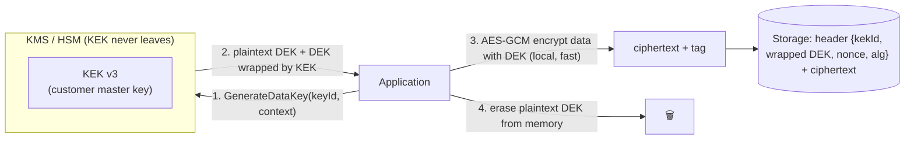
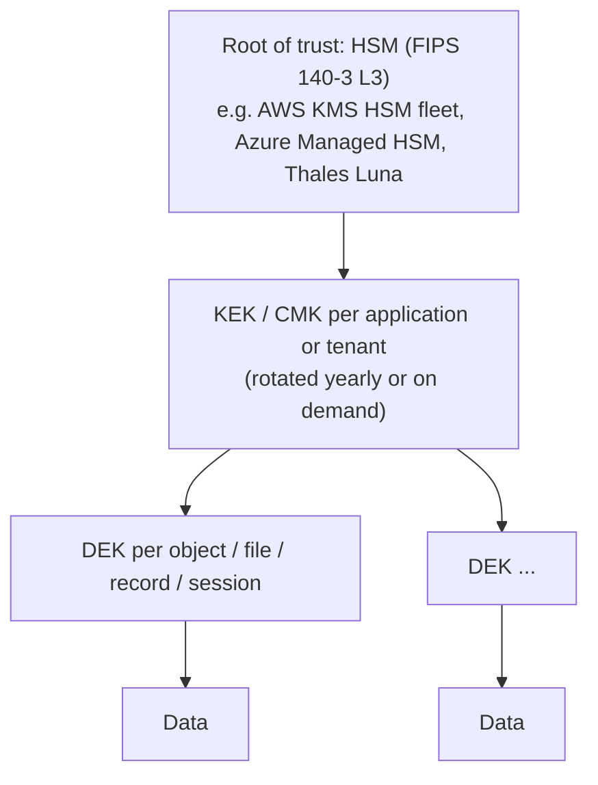
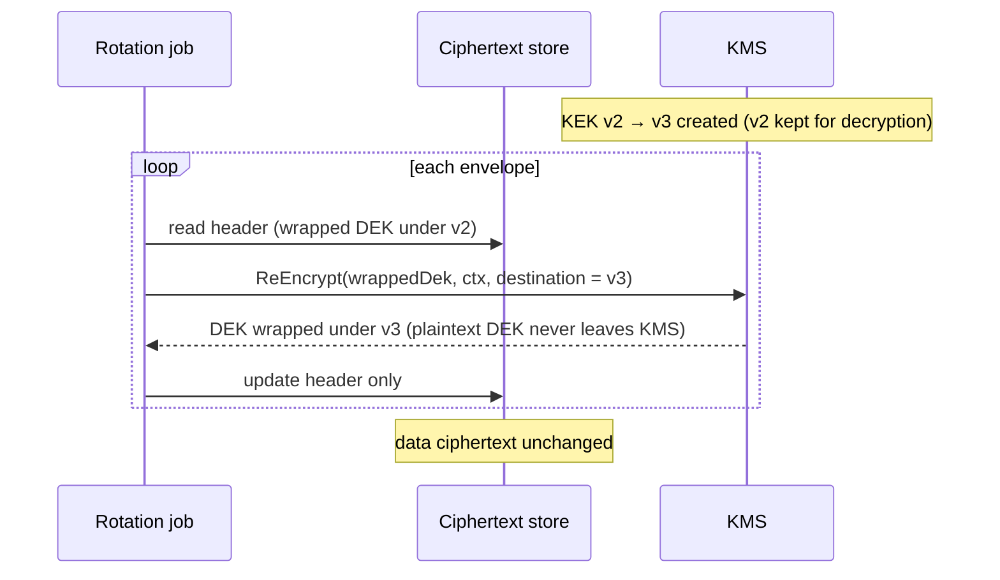
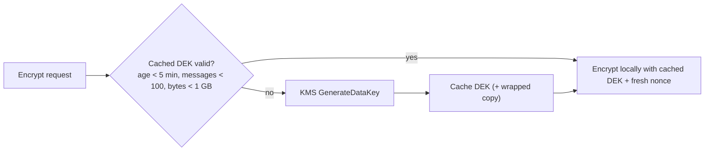

# Envelope Encryption & Data Keys

!!! abstract "Key takeaways"
    - **Envelope encryption** encrypts data locally with a random **data encryption key (DEK)**, then encrypts (**wraps**) the DEK with a **key encryption key (KEK)** that never leaves the KMS or HSM. You store the **wrapped DEK next to the ciphertext**: 67 bytes alongside 1 MiB of AES-256-GCM ciphertext in the demo.
    - It solves three problems: KMS APIs can't encrypt bulk data (AWS KMS `Encrypt` takes at most 4 KB) and are network calls, the master key stays in hardware, and **rotation becomes cheap**. Re-wrapping 2,000 DEKs under a new KEK took **24 ms**, while re-encrypting the same 2,000 MiB of data took **3.2 s** in memory (and far longer with real storage I/O).
    - Bind context with **encryption context / AAD** (`tenant=acme|table=claims|id=C42`): decrypting with a different context failed (`AEADBadTagException`). AWS KMS also logs it in CloudTrail for audit.
    - **Data key caching** trades a little blast radius for big savings: with 5 ms KMS latency, 200 encryptions took **1,048 ms / 200 KMS calls** without caching and **11 ms / 2 calls** with a DEK reused for 100 messages. Bound the reuse by count, bytes and time.
    - Per-tenant or per-record DEKs enable **crypto-shredding**: delete the wrapped DEK (or destroy the tenant's KEK) and the data is unrecoverable (both verified), which is useful for GDPR erasure and backups you can't rewrite.

## Why it matters

Every serious data-protection design (S3 SSE-KMS, EBS, RDS, DynamoDB, Kafka payload encryption, field-level encryption in healthcare systems, multi-cloud key management products such as CipherTrust) uses envelope encryption. Interviewers ask "why not encrypt directly with KMS?", "how do you rotate keys without re-encrypting petabytes?", "what's encryption context?", "how do you delete one customer's data from backups?" This page is ★ because key management, KMS and rotation workflows are central to my Coriolis (CCKM) and Deloitte experience.

The measurements come from a Java 21 simulation written for this page: a local "KMS" holding versioned AES-256 KEKs that never leave it, AES-256-GCM for data and for wrapping, and configurable KMS latency. Real KMS behaviour is described from AWS, Azure and Google documentation.

## Core concepts

### The envelope


*Notice that the KMS only ever handles 32-byte keys, and the bulk data never travels to it. Whoever reads the storage still needs KMS permission to unwrap the DEK, which is where access control and audit happen.*

**Decryption** is the reverse: read the header, call `Decrypt(wrappedDek, context)` (KMS checks IAM, key policy, key state and context), get the plaintext DEK, decrypt locally, erase the DEK.

### Why not just call KMS Encrypt on the data?

| Concern | Direct KMS encryption | Envelope encryption |
|---|---|---|
| Size | AWS KMS `Encrypt`: max **4 KB** plaintext. Azure Key Vault RSA: ~190–446 bytes | Unlimited (local AES) |
| Performance | One network round trip per operation, request quotas (thousands/s per account and Region) | One KMS call per DEK. Local AES at GB/s |
| Key exposure | The KEK never leaves (good) | The KEK never leaves. The DEK exists briefly in app memory |
| Rotation | Data encrypted directly must be re-encrypted | **Re-wrap DEKs only** |
| Offline / multi-cloud | Needs the KMS for everything | The DEK can be used locally, and the wrapped DEK can be wrapped by several KEKs (multi-region, multi-cloud) |

### Key hierarchy


*Notice the fan-out: one KEK protects millions of DEKs, and each DEK protects a small amount of data. Compromise of one DEK exposes one object. Compromise of the KEK requires breaking the HSM boundary.*

Granularity of DEKs:

| DEK scope | Pros | Cons |
|---|---|---|
| Per object or record | Minimal blast radius, natural crypto-shredding, no nonce-limit concerns | One KMS call per object unless cached |
| Per session, batch or time window (cached) | Far fewer KMS calls (200 → 2 measured) | A leaked DEK exposes more data |
| Per tenant (DEK or KEK) | Tenant isolation and erasure, BYOK per tenant | Key management overhead |

### Encryption context (AAD)

Encryption context is non-secret key-value data that's cryptographically bound to the ciphertext (as AEAD associated data) and must be presented exactly at decryption. Measured: a DEK wrapped with `tenant=acme|table=claims|id=C42` couldn't be unwrapped with `tenant=evil|…` (`AEADBadTagException`). Uses:

- **Prevent confused-deputy and cut-and-paste attacks:** a wrapped DEK or ciphertext copied to another tenant's record won't decrypt.
- **Authorisation:** AWS KMS key policies and grants can require specific context values (`kms:EncryptionContext:tenant`).
- **Audit:** AWS KMS records the context in CloudTrail for every `Decrypt`, so you can see which record or tenant was accessed. Never put secrets or PII in it.

### Rotating the KEK: re-wrap, don't re-encrypt


*Notice that only the 67-byte header changes. The terabytes of ciphertext stay untouched, which is why envelope encryption makes rotation practical.*

Measured on 2,000 × 1 MiB objects:

| Approach | Time | Bytes rewritten |
|---|---|---|
| Re-wrap each DEK under the new KEK | **24 ms** | 67 B per object |
| Decrypt and re-encrypt all data with new DEKs | **3,167 ms** | 2,000 MiB |

With a real KMS, each `ReEncrypt` is a network call (milliseconds), so you parallelise and respect quotas. It's still trivial compared with rewriting the data. Often you don't even need to re-wrap: **AWS KMS automatic rotation** keeps all previous key material under the same key ID, so old wrapped DEKs remain decryptable and new ones use the new material ([rotation strategies](06-key-rotation-strategies-without-downtime.md)). Measured caveat: old KEK versions must be **kept** for unrotated data (`[kek-v1, kek-v2, kek-v3]` all held). Destroying v1 made its envelopes unrecoverable (`InvalidKeyException`).

### Data key caching


*Notice that the limits bound both blast radius and AES-GCM nonce usage per key. Caching is a deliberate security trade-off, not a free optimisation.*

Measured with 5 ms simulated KMS latency: no caching **1,048 ms, 200 KMS calls**. Cache for 100 messages: **11 ms, 2 calls**. The AWS Encryption SDK provides a caching cryptographic materials manager with exactly these limits (max age, max messages, max bytes). S3's **bucket keys** apply the same idea server-side, cutting SSE-KMS request costs by up to 99%.

### Crypto-shredding

If every tenant, customer or record has its own DEK (or KEK), deleting that key makes all its data unreadable everywhere, including backups, replicas and logs you can't edit. Measured: removing a wrapped DEK made the object unrecoverable, and destroying KEK v1 made all envelopes under it unrecoverable. AWS KMS enforces a 7–30 day waiting period before key deletion precisely because it's irreversible. Use cases: GDPR or CCPA erasure requests, tenant offboarding, data retention expiry.

## In practice: code & configuration

### Envelope encryption with AWS KMS in Java

```java
public final class EnvelopeCrypto {
    private static final SecureRandom RNG = new SecureRandom();
    private final KmsClient kms;
    private final String keyId;                 // e.g. "alias/claims-data" (KEK in KMS)

    public EnvelopeCrypto(KmsClient kms, String keyId) { this.kms = kms; this.keyId = keyId; }

    public record Envelope(String kekArn, byte[] wrappedDek, byte[] nonce, byte[] ciphertext) {}

    public Envelope encrypt(byte[] plaintext, Map<String, String> context) throws GeneralSecurityException {
        GenerateDataKeyResponse dk = kms.generateDataKey(r -> r
            .keyId(keyId).keySpec(DataKeySpec.AES_256).encryptionContext(context));
        byte[] dek = dk.plaintext().asByteArray();
        try {
            byte[] nonce = new byte[12];
            RNG.nextBytes(nonce);
            Cipher c = Cipher.getInstance("AES/GCM/NoPadding");
            c.init(Cipher.ENCRYPT_MODE, new SecretKeySpec(dek, "AES"), new GCMParameterSpec(128, nonce));
            c.updateAAD(canonical(context));                         // bind the same context to the data
            return new Envelope(dk.keyId(), dk.ciphertextBlob().asByteArray(), nonce, c.doFinal(plaintext));
        } finally {
            Arrays.fill(dek, (byte) 0);                             // don't keep plaintext keys around
        }
    }

    public byte[] decrypt(Envelope e, Map<String, String> context) throws GeneralSecurityException {
        byte[] dek = kms.decrypt(r -> r
                .ciphertextBlob(SdkBytes.fromByteArray(e.wrappedDek()))
                .encryptionContext(context)                         // must match exactly, logged in CloudTrail
                .keyId(e.kekArn()))                                  // pin the expected KEK
            .plaintext().asByteArray();
        try {
            Cipher c = Cipher.getInstance("AES/GCM/NoPadding");
            c.init(Cipher.DECRYPT_MODE, new SecretKeySpec(dek, "AES"), new GCMParameterSpec(128, e.nonce()));
            c.updateAAD(canonical(context));
            return c.doFinal(e.ciphertext());
        } finally {
            Arrays.fill(dek, (byte) 0);
        }
    }

    private static byte[] canonical(Map<String, String> ctx) {
        return new TreeMap<>(ctx).toString().getBytes(StandardCharsets.UTF_8);   // deterministic order
    }
}
```

In production, prefer the **AWS Encryption SDK** (or Google Tink with a KMS-backed AEAD) over hand-rolled code: it defines a versioned message format (algorithm suite, key IDs, wrapped DEKs for multiple KEKs, AAD), supports multi-Region and multi-KMS keyrings, key commitment, and data key caching.

=== "❌ Common mistake"

    ```java
    // Calling KMS for every record (latency, quotas, cost) with no context
    byte[] ct = kms.encrypt(r -> r.keyId(keyId).plaintext(SdkBytes.fromUtf8String(ssn))).ciphertextBlob().asByteArray();

    // ...or the opposite: one static AES key in config "encrypted by KMS once", used forever for everything
    SecretKey global = loadFromConfig("DATA_KEY");   // no rotation, no isolation, huge blast radius
    ```

=== "✅ Better"

    ```java
    // DEK per object (or cached with bounds), wrapped by a KMS key, context bound and audited
    Envelope env = crypto.encrypt(json, Map.of("tenant", tenantId, "table", "claims", "id", claimId));
    repository.save(new EncryptedClaim(claimId, env.kekArn(), env.wrappedDek(), env.nonce(), env.ciphertext()));
    ```

### Ciphertext format with versioning

```text
| version (1) | alg suite (1) | kekId len (2) | kekId | wrapped DEK len (2) | wrapped DEK | nonce (12) | ciphertext+tag |
```

Always store the **KEK identifier and version** and the **algorithm** with the data. Without them you can't rotate, migrate algorithms (crypto-agility) or decrypt after a key change.

## Real-world usage

- **AWS:** S3 SSE-KMS (with bucket keys), EBS, RDS and DynamoDB encryption all use KMS keys as KEKs and per-resource data keys. The **AWS Encryption SDK** and **DynamoDB Encryption Client / Database Encryption SDK** do client-side envelope encryption. KMS `GenerateDataKey`, `GenerateDataKeyWithoutPlaintext` (for deferred encryption) and `ReEncrypt` are the primitives.
- **Azure:** Key Vault / Managed HSM keys wrap DEKs (`wrapKey`/`unwrapKey`) for Storage, SQL TDE and Disk Encryption with customer-managed keys. Application code uses the Azure SDK `CryptographyClient`.
- **GCP:** Cloud KMS KEKs with locally generated DEKs (Tink `KmsEnvelopeAead`), plus CMEK for Cloud Storage, BigQuery and others.
- **Kubernetes:** Secrets encryption at rest with the KMS v2 provider is envelope encryption (a DEK per write, cached, wrapped by a cloud KMS key) ([ConfigMaps and Secrets](../docker-kubernetes/05-configmaps-secrets-and-volumes.md)).
- **Multi-cloud key managers** (Thales CipherTrust Cloud Key Manager, HashiCorp Vault Transit) manage KEKs across AWS, Azure and GCP, rotate them, and support BYOK/HYOK ([HSMs and BYOK](05-hsms-and-byok-hyok.md)).

## Trade-offs & production gotchas

!!! warning "Envelope encryption mistakes"
    - **Storing the plaintext DEK** (or logging it) anywhere: defeats the design. Keep only the wrapped DEK, and zero plaintext buffers.
    - **No key ID or version in the ciphertext:** rotation and migration become impossible.
    - **Deleting or disabling old KEK versions** while data still depends on them: unrecoverable data (measured). Track usage before deletion, and use KMS deletion waiting periods.
    - **Unbounded data key caching:** one leaked DEK exposes everything it encrypted, and GCM nonce limits are approached. Cap age, messages and bytes.
    - **Missing encryption context:** wrapped DEKs and ciphertext can be moved between tenants or records. Bind context and enforce it in key policies.
    - **KMS as a hard runtime dependency:** throttling or a Region outage blocks reads. Use caching within limits, multi-Region keys, retries with back-off, and capacity planning against quotas.
    - **Treating encryption as access control:** whoever has `kms:Decrypt` on the key can read the data. Scope IAM and key policies tightly and audit.

- **Client-side vs server-side encryption:** server-side (SSE-KMS) is transparent and protects storage media and backups from the cloud provider's staff and side channels, but anyone with read access through the service gets plaintext. Client-side (application) encryption protects data even from privileged readers of the database, at the cost of complexity (no server-side query on encrypted fields).
- **Per-record DEKs vs cached DEKs:** isolation and shredding vs cost and latency. Choose per data sensitivity.

## How this connects to my experience

- **Resume bullets:** **Coriolis Technologies, CipherTrust Cloud Key Management (CCKM):** "Developed enterprise key management capabilities supporting AWS, Azure, and GCP environments", "Implemented automated key rotation workflows and HSM integrations using Thales Luna and SafeNet", "Worked extensively with AWS KMS, encryption services, and cloud security workflows." **Deloitte:** "implemented security controls using IAM, KMS, and Secrets Manager" on a healthcare analytics platform.
- **How to talk about it:** CCKM manages the KEKs (cloud CMKs, BYOK key material from Luna/SafeNet HSMs) that sit at the top of every cloud service's envelope hierarchy. Rotation workflows rotate KEKs, and envelope encryption is why those rotations don't require re-encrypting customer data. *[confirm: which operations you implemented (key creation, import/BYOK, rotation scheduling, re-wrap jobs, key deletion), for which clouds, and whether you built application-side envelope encryption at Deloitte or relied on SSE-KMS]*
- **Talking points:**
    - "Envelope encryption keeps the master key in hardware, makes bulk encryption fast and local, and turns rotation into re-wrapping a few bytes per object instead of rewriting the data."
    - "I always store the key ID with the ciphertext and bind an encryption context, which gives tenant isolation, KMS policy conditions and CloudTrail audit of who decrypted what."
    - "Per-tenant keys give crypto-shredding for erasure requests, which matters in healthcare where backups can't be edited."
- **Likely follow-up chain:** "Why envelope encryption?" → "What exactly is stored?" → "How does rotation work, and do you re-encrypt data?" → "What's encryption context for?" → "How do you avoid KMS throttling?" (caching, bucket keys) → "How do you delete one customer's data from backups?" (crypto-shredding) → "How did CCKM handle BYOK and rotation across clouds?"

## Interview questions

### Fundamentals

??? question "Q1. What is envelope encryption?"
    **Answer:** Data is encrypted locally with a random data encryption key (DEK) using a fast symmetric AEAD (AES-256-GCM). The DEK is then encrypted (wrapped) with a key encryption key (KEK) held in a KMS or HSM. The wrapped DEK is stored alongside the ciphertext, and the plaintext DEK is discarded. To decrypt, you ask the KMS to unwrap the DEK (subject to IAM and policy), then decrypt locally. Measured: a 67-byte wrapped DEK accompanied 1 MiB of ciphertext.

    **Interviewer listens for:** DEK vs KEK, local encryption, the stored wrapped DEK, and the KMS for unwrap.

    **Common wrong answer:** "Encrypting the data twice with two keys."

??? question "Q2. Why not send the data to KMS and encrypt it there directly?"
    **Answer:** KMS encrypt APIs have small size limits (AWS KMS: 4 KB), every call is a network round trip with latency, quotas and cost, and data encrypted directly under the KMS key can't be rotated cheaply. With envelope encryption, KMS handles only 32-byte keys, bulk crypto runs locally at GB/s, the master key still never leaves the HSM, and rotation only re-wraps DEKs (24 ms for 2,000 DEKs vs 3.2 s to re-encrypt 2 GiB measured).

    **Interviewer listens for:** size, latency, quotas, cost, and rotation benefits.

    **Common wrong answer:** "Because KMS isn't secure enough for data."

??? question "Q3. What is an encryption context, and why use one?"
    **Answer:** Non-secret key-value pairs (tenant, table, record id) cryptographically bound to the encrypted data key or ciphertext as AEAD associated data. The exact same context must be supplied to decrypt (measured: a different tenant value failed with `AEADBadTagException`). It prevents moving ciphertext or wrapped keys between records or tenants, can be enforced in KMS key policies (`kms:EncryptionContext:*` conditions), and appears in CloudTrail logs for auditing which data was decrypted. Never put secrets in it, because it's logged in plaintext.

    **Interviewer listens for:** AAD binding, policy conditions, audit, and non-secrecy.

    **Common wrong answer:** "It's an extra password for the key."

??? question "Q4. What must be stored with encrypted data?"
    **Answer:** The wrapped DEK, the KEK identifier and version (or ARN), the nonce or IV, the algorithm suite and format version, and the ciphertext with its authentication tag. Not the plaintext DEK. Without key IDs you can't decrypt after rotation or migrate. Without an algorithm or version field you can't evolve the format (crypto-agility). The encryption context is usually reconstructed from the record's own fields, not stored separately.

    **Interviewer listens for:** a complete header, key versioning and agility.

    **Common wrong answer:** "Just the ciphertext; the app knows the key."

### Intermediate

??? question "Q5. How do you rotate the master key without re-encrypting all the data?"
    **Answer:** Create a new KEK version. New data keys are wrapped with it. For existing data, either keep old KEK versions available for decryption (AWS KMS automatic rotation does this transparently under the same key ID), or re-wrap each DEK: unwrap with the old KEK and wrap with the new one, ideally server-side via KMS `ReEncrypt` so the plaintext DEK never reaches the app, then update only the header. Measured: re-wrapping 2,000 DEKs took 24 ms vs 3.2 s to re-encrypt 2,000 MiB in memory, and real I/O makes the gap much larger. Never destroy old KEK versions until nothing references them.

    **Interviewer listens for:** new key versions, keeping old ones, re-wrap or ReEncrypt, and deletion safety.

    **Common wrong answer:** "Download all data, decrypt and re-encrypt with the new key."

??? question "Q6. What is data key caching, and what are the risks?"
    **Answer:** Reusing a DEK from GenerateDataKey for many encryptions within limits, instead of calling KMS each time. It cuts latency, KMS cost and throttling (measured: 200 calls and 1,048 ms vs 2 calls and 11 ms with 5 ms KMS latency). The risks: a compromised DEK exposes all data encrypted under it, the plaintext DEK lives longer in memory, and AES-GCM nonce limits per key approach faster. Mitigate with bounds on maximum age, messages and bytes (as the AWS Encryption SDK caching CMM does), per-tenant caches, and secure memory handling.

    **Interviewer listens for:** the benefit numbers, blast radius, nonce limits, and bounds.

    **Common wrong answer:** "Cache the DEK forever; it's encrypted anyway."

??? question "Q7. What is crypto-shredding, and when is it useful?"
    **Answer:** Making data unrecoverable by destroying the key that encrypts it, instead of deleting every copy of the data. With per-tenant or per-record DEKs (or KEKs), deleting the key renders data in databases, backups, replicas and logs unreadable. Measured: deleting a wrapped DEK, or destroying KEK v1, made the corresponding envelopes unrecoverable. It's useful for GDPR or CCPA erasure, tenant offboarding and retention enforcement where immutable backups can't be edited. It requires careful key granularity and a guarantee that no other copies of the key exist (including KMS deletion waiting periods and HSM backups).

    **Interviewer listens for:** key-per-scope design, backup applicability, and irreversibility safeguards.

    **Common wrong answer:** "Overwrite the database rows with zeros."

??? question "Q8. Client-side envelope encryption vs server-side encryption with KMS (e.g. S3 SSE-KMS): when do you choose each?"
    **Answer:** SSE-KMS: the service performs envelope encryption transparently, protecting data at rest (disks, backups) with KMS-controlled keys, policies and audit. Anyone authorised to read through the service gets plaintext. Client-side: the application encrypts before sending, so the storage service, DBAs and anyone with read access to the store see only ciphertext, and only principals with KMS decrypt rights can read it. Costs: you can't query or index encrypted fields server-side, and key handling moves into your code. Choose client-side for highly sensitive fields (SSNs, diagnoses, payment data) or zero-trust storage, and SSE-KMS as the baseline everywhere.

    **Interviewer listens for:** threat models of each, and the functionality cost.

    **Common wrong answer:** "They're equivalent."

??? question "Q9. How do you avoid KMS becoming a bottleneck or single point of failure?"
    **Answer:** Reduce calls with DEK caching within limits, S3 bucket keys, and batching (one DEK per batch or file rather than per record where acceptable). Know the quotas (requests per second per account, Region and operation) and request increases. Retry with exponential back-off and jitter on throttling. Use multi-Region keys (AWS) or key replication for DR so ciphertext can be decrypted in another Region. Monitor KMS latency and throttles. Fail predictably: for reads, a cached DEK can keep serving during brief KMS issues within its validity window.

    **Interviewer listens for:** call reduction, quotas, retries, multi-Region, and monitoring.

    **Common wrong answer:** "KMS is managed, so it never fails."

### Senior

??? question "Q10. Design field-level encryption for a multi-tenant healthcare SaaS with per-tenant keys."
    **Answer:** One KMS key (KEK) per tenant (or per tenant tier, with tenant ID in the encryption context and key policy conditions), optionally customer-managed (BYOK) for enterprise tenants. Sensitive fields encrypted client-side with AES-256-GCM using DEKs from `GenerateDataKey`, cached per tenant with tight bounds, and AAD including tenant, table, record and field. A ciphertext header with format version, KEK ARN and wrapped DEK. Searchable fields get keyed blind indexes (HMAC with a per-tenant index key). IAM: services can only use the keys of the tenant in the request, with context conditions. Rotation via automatic KMS rotation, plus re-wrap jobs for algorithm or key migrations. Tenant offboarding via key deletion (crypto-shredding, after the retention period). Audit via CloudTrail, with alerts on unusual decrypt volume.

    **Interviewer listens for:** per-tenant isolation, context and policy binding, the format, search, rotation, shredding and audit.

    **Common wrong answer:** "One AES key in a config file for all tenants."

??? question "Q11. How would you migrate encrypted data from one cloud KMS to another (e.g. AWS to Azure) or to a different algorithm?"
    **Answer:** Thanks to the envelope design, migrate wrapping, not data, when possible. For each envelope, unwrap the DEK with the source KMS and wrap it with the target KEK (Azure Key Vault `wrapKey`), storing both wrapped copies during transition (a multi-keyring format like the AWS Encryption SDK supports several wrapped DEKs). Switch reads to prefer the new keyring, then remove old wrappings. Do it with throttled, idempotent, resumable batch jobs, verification (decrypt samples), and audit. If the data algorithm itself must change (for example, deprecating AES-CBC), you do need to re-encrypt data. Version headers let old and new formats coexist during migration. Multi-cloud key managers such as CipherTrust orchestrate this.

    **Interviewer listens for:** re-wrap vs re-encrypt, dual wrapping, batch job properties, and format versioning.

    **Common wrong answer:** "Export the KMS master key and import it into Azure." AWS KMS keys aren't exportable.

??? question "Q12. What are the security limits of envelope encryption? What does it not protect against?"
    **Answer:** It protects data at rest against storage-level compromise (stolen disks, leaked backups, a misconfigured bucket without KMS rights) and centralises access control and audit at the KMS. It doesn't protect against an attacker who obtains the application's IAM permissions (they can call Decrypt), compromise of the application host while plaintext DEKs or data are in memory, overly broad key policies, insiders with KMS decrypt rights, or data leaked after decryption (logs, caches, APIs). Defences: least privilege and context conditions on keys, short-lived credentials, anomaly detection on KMS usage, DEK zeroisation, separation of duties (key admins vs key users), and encryption as one layer of defence in depth.

    **Interviewer listens for:** an honest threat model and complementary controls.

    **Common wrong answer:** "With KMS envelope encryption the data can't be stolen."

### Scenario-based

??? question "Q13. A batch job encrypting 50 million records with AWS KMS is throttled and slow. What do you change?"
    **Answer:** It's probably calling KMS per record (GenerateDataKey or Encrypt), hitting request quotas. Switch to envelope encryption with DEK caching: generate a DEK per batch, file or partition and reuse it within bounds (for example, a maximum of 1 million records or 1 GB or 15 minutes), as measured, where 100 messages per DEK cut KMS calls by 100×. Encrypt locally in parallel. Store the KEK ID and wrapped DEK per batch. Add retries with back-off for remaining calls, request a quota increase if needed, and confirm the security trade-off of per-batch keys with the data owner (blast radius, shredding granularity).

    **Interviewer listens for:** diagnosis, caching or batching with bounds, parallel local crypto, and the trade-off conversation.

    **Common wrong answer:** "Ask AWS to remove the limit."

??? question "Q14. A customer invokes their right to erasure, but their data is in nightly immutable backups for 7 years. How do you comply?"
    **Answer:** If the system was designed with per-customer (or per-tenant) keys, crypto-shred: delete the customer's wrapped DEKs or KEK (after any legal hold checks), so all copies, including immutable backups, become unreadable (measured: data unrecoverable after key deletion). Document the deletion, respecting the KMS waiting period, and make sure no key copies remain (exports, HSM backups). Remove live data normally. If the system lacked per-customer keys, you need compensating measures: delete on restore (a suppression list applied whenever backups are restored), shorter backup retention, and plan per-customer keys for the future. Discuss with legal/DPO how regulators view encrypted-but-retained data.

    **Interviewer listens for:** crypto-shredding by design, the fallback suppression-list approach, and the governance angle.

    **Common wrong answer:** "Restore every backup, delete the rows and re-save the backups."

## Cheat sheet

| Topic | Remember |
|---|---|
| Envelope | Local AEAD with DEK; DEK wrapped by KEK in KMS/HSM; store wrapped DEK + KEK ID + nonce + alg |
| Why | KMS size limits (4 KB), latency/quotas, KEK never leaves, cheap rotation |
| Sizes (measured) | Wrapped DEK 67 B for 1 MiB ciphertext |
| Context | AAD + policy condition + CloudTrail audit; wrong context → fail; no secrets in it |
| Rotation | Re-wrap DEKs (24 ms / 2,000) vs re-encrypt (3.2 s / 2 GiB); AWS auto-rotation keeps old material |
| Old KEKs | Keep until unused: destroyed KEK → data unrecoverable |
| Caching | 200 → 2 KMS calls, 1,048 → 11 ms; bound age, messages, bytes |
| Crypto-shredding | Per-tenant or per-record keys → delete key = erase all copies |
| Libraries | AWS Encryption SDK, Database Encryption SDK, Tink KmsEnvelopeAead, Azure CryptographyClient |
| Services | S3 SSE-KMS (+ bucket keys), EBS, RDS, DynamoDB, Kubernetes KMS v2, CMEK |

## Sources
1. [AWS KMS concepts: Envelope encryption, data keys and encryption context](https://docs.aws.amazon.com/kms/latest/developerguide/kms-cryptography.html#enveloping) and [encryption context](https://docs.aws.amazon.com/kms/latest/developerguide/encrypt_context.html).
2. [AWS KMS API: GenerateDataKey](https://docs.aws.amazon.com/kms/latest/APIReference/API_GenerateDataKey.html), [Encrypt (4 KB limit)](https://docs.aws.amazon.com/kms/latest/APIReference/API_Encrypt.html) and [ReEncrypt](https://docs.aws.amazon.com/kms/latest/APIReference/API_ReEncrypt.html).
3. [AWS Encryption SDK: data key caching](https://docs.aws.amazon.com/encryption-sdk/latest/developer-guide/data-key-caching.html) and [message format](https://docs.aws.amazon.com/encryption-sdk/latest/developer-guide/message-format.html).
4. [Amazon S3: Reducing the cost of SSE-KMS with bucket keys](https://docs.aws.amazon.com/AmazonS3/latest/userguide/bucket-key.html).
5. [Azure Key Vault: wrap and unwrap keys](https://learn.microsoft.com/en-us/rest/api/keyvault/keys/wrap-key/wrap-key) and [Google Cloud KMS: Envelope encryption](https://cloud.google.com/kms/docs/envelope-encryption).
6. [NIST SP 800-57 Part 1 Rev. 5: key management (key hierarchy, cryptoperiods)](https://csrc.nist.gov/pubs/sp/800/57/pt1/r5/final).
7. [Google Tink: KMS envelope AEAD](https://developers.google.com/tink/client-side-encryption).
8. Demonstrations on this page: a Java 21 envelope-encryption simulation written for this page (wrapped DEK size, context binding, re-wrap vs re-encrypt timing, data key caching with simulated KMS latency, crypto-shredding).
