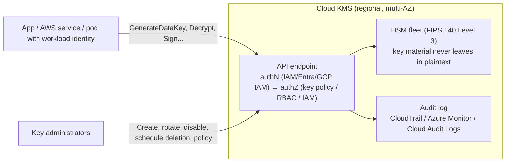
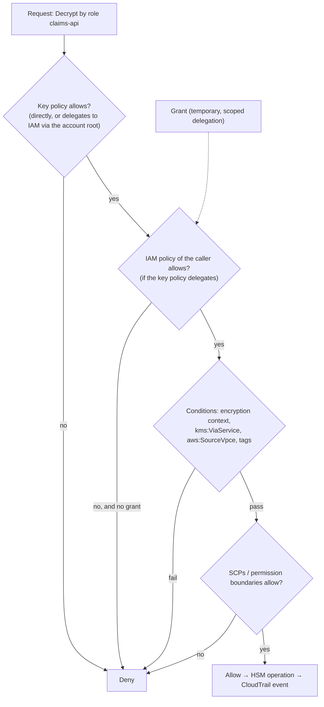

# Cloud KMS (AWS KMS, Azure Key Vault, GCP KMS)

!!! abstract "TL;DR"
    - A cloud **KMS** stores keys in FIPS-validated **HSMs** that you never see, and exposes **operations** (encrypt, decrypt, generate data key, sign, wrap) under fine-grained **authorisation** with full **audit**. Keys don't leave the service: there's no API to export a KMS private or symmetric key.
    - **AWS KMS:** symmetric keys (AES-256-GCM), asymmetric RSA/ECC (sign or encrypt), HMAC keys. Authorisation = **key policy** + IAM + **grants**. **Encryption context** is enforced and logged in CloudTrail. Direct `Encrypt` is limited to **4,096 bytes** (5,000 failed with a validation error), so bulk data uses `GenerateDataKey` (a 32-byte plaintext DEK plus its wrapped blob, verified against the mock). Deletion requires a **7–30 day** waiting period, and cancelling leaves the key **Disabled**.
    - **Azure Key Vault:** keys, secrets and certificates in one service. **Standard** (software-protected) vs **Premium** (HSM-backed), plus **Managed HSM** (single-tenant, FIPS 140-3 Level 3). Azure RBAC, **soft delete + purge protection**, and key rotation policies.
    - **Google Cloud KMS:** key rings → keys → **versions**, protection levels **SOFTWARE / HSM / EXTERNAL (EKM)**, IAM roles per key, scheduled automatic rotation, and version destruction after a delay.
    - Design for **least privilege** (separate key admins from key users, condition on context and tags), **per-application or per-tenant keys**, **rotation**, **multi-region DR**, **quota-aware** usage (data key caching, bucket keys), and **audit and alerting** on key usage and policy changes.

## Why it matters

KMS is the root of trust for almost every encryption feature in the cloud (S3, EBS, RDS, DynamoDB, Secrets Manager, Kubernetes Secrets, Kafka on MSK), and for application-level envelope encryption and signing. Misconfigured key policies, keys deleted too eagerly, missing encryption context, throttling, or a single-Region design cause outages and data loss. Interviewers probe the authorisation model, how rotation and deletion work, what encryption context does, and how the three clouds differ. This is ★ for me: KMS integration across AWS, Azure and GCP was the core of CipherTrust Cloud Key Management at Coriolis.

API behaviours marked "verified (mock)" were exercised with boto3 against **moto**, a local AWS mock, while writing this page. Moto reproduces API shapes and many validations, but not real HSMs, policy evaluation or every limit (it didn't enforce the 7-day minimum deletion window, for example). All other facts come from AWS, Microsoft and Google documentation.

## Core concepts

### What a KMS gives you


*Notice the separation: callers get the results of cryptographic operations, never the keys. That's why access control and audit on the API are the real security boundary.*

### AWS KMS essentials

**Key types and ownership**

| Dimension | Options |
|---|---|
| Ownership | **AWS owned** (invisible, used by services by default), **AWS managed** (`aws/s3`, `aws/ebs`: visible, AWS-controlled policy and rotation), **customer managed** (you control policy, rotation, deletion, grants) |
| Key spec | `SYMMETRIC_DEFAULT` (AES-256-GCM), RSA 2048/3072/4096 (encrypt or sign), ECC NIST P-256/384/521 and secp256k1 (sign), HMAC 224–512, SM2 (China Regions), ML-DSA (post-quantum signatures, recently added) |
| Origin | `AWS_KMS` (generated in KMS), `EXTERNAL` (imported key material, BYOK), `AWS_CLOUDHSM` (custom key store), `EXTERNAL_KEY_STORE` (XKS, the key stays outside AWS) |
| Scope | Single-Region, or **multi-Region** keys (same key ID and material replicated to other Regions for DR and global apps) |

**Verified (mock) API behaviours**

| Call | Result |
|---|---|
| `CreateKey` (symmetric) | `SYMMETRIC_DEFAULT`, `ENCRYPT_DECRYPT`, `KeyManager=CUSTOMER`, `Origin=AWS_KMS` |
| `GenerateDataKey(AES_256, context)` | 32-byte plaintext DEK + ciphertext blob (wrapped DEK) |
| `Decrypt` with the same context | OK |
| `Decrypt` with a different context | `InvalidCiphertextException` |
| `Encrypt` 5,000 bytes | `ValidationException` (limit is 4,096 bytes). 4,096 bytes OK |
| `EnableKeyRotation` | `KeyRotationEnabled: true` |
| `ScheduleKeyDeletion(7 days)` → `CancelKeyDeletion` | `PendingDeletion` → **`Disabled`** (must be re-enabled explicitly) |
| `Sign` / `Verify` with `ECC_NIST_P256`, `ECDSA_SHA_256` | ~71–72-byte DER signature, valid |
| `GetPublicKey` | 91-byte DER public key. No API exists to export the private key |
| `ReEncrypt` to another key | Wrapped DEK re-wrapped under the destination key, plaintext never returned |
| `CreateGrant(Decrypt, EncryptionContextSubset tenant=acme)` | Grant created with a context constraint |

**Authorisation model**


*Notice that every KMS key has a key policy, and without it allowing access (directly or by delegating to IAM), even account administrators can't use the key. Explicit denies anywhere win.*

- **Key policy:** the primary resource policy. Separate statements for **key administrators** (manage but not use) and **key users** (use but not manage).
- **IAM policies:** effective only if the key policy delegates to the account (`"Principal": {"AWS": "arn:aws:iam::<acct>:root"}`).
- **Grants:** programmatic, scoped and revocable delegation, used by AWS services (EBS attaching volumes) and for temporary access.
- **Conditions:** `kms:EncryptionContext:<key>`, `kms:ViaService` (only through S3 or Secrets Manager), `kms:CallerAccount`, `aws:SourceVpce`, tag-based ABAC.

**Rotation and lifecycle**

- **Automatic rotation** (symmetric customer-managed keys): new backing key material on a schedule (default 365 days, configurable 90–2,560 days), plus **on-demand rotation**. The key ID, ARN and policy stay the same, and **old material is retained**, so existing ciphertexts still decrypt and nothing needs re-encrypting.
- Asymmetric, HMAC and imported keys: rotate manually by creating a new key and moving the alias ([rotation strategies](06-key-rotation-strategies-without-downtime.md)).
- **Disable** (reversible) vs **ScheduleKeyDeletion** (7–30 days, irreversible after the window). Deleting a key makes every ciphertext under it unrecoverable, so alarm on `ScheduleKeyDeletion` events and use `Disable` first.
- **Quotas:** shared request-per-second limits per account and Region per operation category (cryptographic operations in the thousands to tens of thousands per second, depending on Region and key type). Throttling returns `ThrottlingException`. Mitigate with data key caching, S3 bucket keys, and quota increases.

### Azure Key Vault and Managed HSM

| Aspect | Key Vault Standard | Key Vault Premium | Managed HSM |
|---|---|---|---|
| Key protection | Software (FIPS 140 Level 1) | **HSM-backed** keys (FIPS 140 Level 3) | Dedicated single-tenant HSM pool (FIPS 140-3 Level 3) |
| Objects | Keys, secrets, certificates | Keys, secrets, certificates | Keys only |
| Tenancy | Multi-tenant | Multi-tenant HSMs | Single-tenant, customer-controlled security domain |
| Use | App secrets, software keys | CMK for Azure services, signing | High-assurance CMK, BYOK, regulatory requirements |

- **Operations:** `encrypt/decrypt` (RSA), `wrapKey/unwrapKey` (envelope), `sign/verify`, plus secrets and certificate lifecycle (auto-renewal with integrated CAs).
- **Authorisation:** **Azure RBAC** (recommended: `Key Vault Crypto User`, `Key Vault Crypto Officer`, `Key Vault Secrets User`) or legacy access policies, with Entra ID identities (managed identities, workload identity).
- **Safety:** **soft delete** (retention 7–90 days) and **purge protection** (deleted vaults and keys can't be purged until retention ends, required for CMK scenarios), a key **rotation policy** (automatic rotation and expiry notifications), private endpoints, firewall rules.
- **CMK for Azure services:** Storage, SQL TDE, Disk Encryption Sets, Cosmos DB and AKS KMS etcd encryption reference a Key Vault key and use it to wrap their DEKs.

### Google Cloud KMS

- **Hierarchy:** project → location → **key ring** → **key** → **key versions**. The primary version encrypts, and all enabled versions decrypt.
- **Protection levels:** `SOFTWARE`, `HSM` (Cloud HSM, FIPS 140-2 Level 3), `EXTERNAL` / `EXTERNAL_VPC` (**Cloud EKM**: key material in an external key manager such as Thales CipherTrust, Fortanix or Futurex, so Google calls out for every operation, HYOK-style).
- **Purposes:** `ENCRYPT_DECRYPT` (symmetric), `ASYMMETRIC_SIGN`, `ASYMMETRIC_DECRYPT`, `MAC`, `RAW_ENCRYPT_DECRYPT`.
- **Rotation:** automatic rotation by schedule (creates new primary versions, old versions remain for decryption). **Destruction** of a version is scheduled after a configurable waiting period (set per key when it's created), and **Key Access Justifications** can gate EKM key use.
- **IAM:** `roles/cloudkms.cryptoKeyEncrypterDecrypter`, `cryptoKeyEncrypter`, `cryptoKeyDecrypter`, `signerVerifier`, `admin`, granted per key or key ring. **Autokey** can provision CMEK keys automatically per resource.

### Side-by-side comparison

| Feature | AWS KMS | Azure Key Vault / Managed HSM | Google Cloud KMS |
|---|---|---|---|
| Unit | Key (ARN, aliases) | Vault → key (versions) | Key ring → key → versions |
| HSM | Shared FIPS 140-3 L3 HSMs; CloudHSM custom key store | Premium (HSM-backed), Managed HSM (single-tenant) | Cloud HSM; EKM (external) |
| Authorisation | Key policy + IAM + grants + conditions | Azure RBAC / access policies | IAM per key or key ring |
| Context / AAD | Encryption context (enforced, logged) | Application AAD (via SDK) | Additional authenticated data |
| Rotation | Automatic (90–2,560 days) + on-demand; old material retained | Rotation policy (new versions) | Scheduled rotation (new versions) |
| Deletion safety | 7–30 day pending deletion; disable | Soft delete + purge protection | Scheduled version destruction |
| BYOK / HYOK | Import key material, XKS | BYOK into HSM, Managed HSM | Import, Cloud EKM |
| Multi-region | Multi-Region keys | Paired-Region backup, Managed HSM replication | Multi-region / global locations |
| Audit | CloudTrail | Azure Monitor diagnostic logs | Cloud Audit Logs |

## In practice: code & configuration

### A least-privilege AWS KMS key policy

```json
{
  "Version": "2012-10-17",
  "Statement": [
    { "Sid": "AccountRootForIAMDelegationAndRecovery",
      "Effect": "Allow", "Principal": { "AWS": "arn:aws:iam::111122223333:root" },
      "Action": "kms:*", "Resource": "*" },
    { "Sid": "KeyAdministratorsManageNotUse",
      "Effect": "Allow", "Principal": { "AWS": "arn:aws:iam::111122223333:role/kms-admins" },
      "Action": ["kms:Describe*", "kms:Put*", "kms:Enable*", "kms:Disable*", "kms:TagResource",
                 "kms:ScheduleKeyDeletion", "kms:CancelKeyDeletion", "kms:RotateKeyOnDemand"],
      "Resource": "*" },
    { "Sid": "ClaimsApiUseOnlyForItsTenantContext",
      "Effect": "Allow", "Principal": { "AWS": "arn:aws:iam::111122223333:role/claims-api" },
      "Action": ["kms:GenerateDataKey", "kms:Decrypt"], "Resource": "*",
      "Condition": { "StringEquals": { "kms:EncryptionContext:app": "claims" } } },
    { "Sid": "OnlyThroughSecretsManagerForThisRole",
      "Effect": "Allow", "Principal": { "AWS": "arn:aws:iam::111122223333:role/billing" },
      "Action": "kms:Decrypt", "Resource": "*",
      "Condition": { "StringEquals": { "kms:ViaService": "secretsmanager.eu-west-1.amazonaws.com" } } }
  ]
}
```

### Terraform: key with rotation, alias and safe deletion

```hcl
resource "aws_kms_key" "claims" {
  description             = "claims data KEK"
  enable_key_rotation     = true
  rotation_period_in_days = 365
  deletion_window_in_days = 30          # maximum safety window
  multi_region            = true        # replicate for DR
  policy                  = data.aws_iam_policy_document.claims_key.json
  tags = { app = "claims", data-classification = "phi" }
}

resource "aws_kms_alias" "claims" {
  name          = "alias/claims-data"
  target_key_id = aws_kms_key.claims.key_id
}

# Azure equivalent (sketch)
# resource "azurerm_key_vault_key" "claims" { key_type = "RSA-HSM", key_size = 3072, rotation_policy { automatic { time_before_expiry = "P30D" } expire_after = "P1Y" } }
```

=== "❌ Common mistake"

    ```json
    { "Effect": "Allow", "Principal": { "AWS": "*" }, "Action": "kms:*", "Resource": "*" }
    ```
    ```text
    One key for every app and environment, rotation off, no encryption context,
    no alarm on ScheduleKeyDeletion, and admins who can also Decrypt.
    ```

=== "✅ Better"

    ```text
    Key per application (and per tenant where needed), separate admin and user roles,
    context and kms:ViaService conditions, rotation on, a 30-day deletion window,
    EventBridge alarm on DisableKey/ScheduleKeyDeletion/PutKeyPolicy,
    multi-Region keys for DR, all usage audited in CloudTrail.
    ```

### Using KMS from Spring Boot

```java
@Configuration
class KmsConfig {
    @Bean KmsClient kmsClient() {
        return KmsClient.builder()
            .region(Region.EU_WEST_1)
            .credentialsProvider(DefaultCredentialsProvider.create())   // IRSA / Pod Identity on EKS
            .overrideConfiguration(o -> o.retryStrategy(AwsRetryStrategy.adaptiveRetryStrategy())) // throttling-aware
            .build();
    }
}
// Azure: new CryptographyClientBuilder().keyIdentifier(keyId).credential(new DefaultAzureCredential()).buildClient()
//        client.wrapKey(KeyWrapAlgorithm.RSA_OAEP_256, dek)
// GCP:   KeyManagementServiceClient.create().encrypt(CryptoKeyName.of(p, loc, ring, key), ByteString.copyFrom(dek))
```

## Real-world usage

- **AWS services with CMKs:** S3 SSE-KMS (with bucket keys), EBS, RDS and Aurora, DynamoDB, Secrets Manager, SQS/SNS, MSK, CloudWatch Logs, and EKS secrets encryption, all using KMS keys as KEKs through grants and `kms:ViaService`.
- **Regulated industries** (healthcare, finance) use customer-managed keys with per-application or per-data-classification separation, CloudTrail-based access reviews, and often HSM-backed or external key stores for sovereignty ([HSMs and BYOK/HYOK](05-hsms-and-byok-hyok.md)).
- **Multi-cloud key management** products (Thales **CipherTrust Cloud Key Manager**, Fortanix, HashiCorp Vault) give one console and policy layer over AWS KMS, Azure Key Vault and GCP KMS: key lifecycle, BYOK uploads, rotation scheduling, and reporting.
- **Code and artifact signing** uses KMS asymmetric keys (cosign with `awskms://`, `azurekms://` and `gcpkms://` key URIs) so signing keys never touch build agents.
- **Kubernetes:** KMS v2 encryption providers on EKS, AKS and GKE wrap the DEKs that protect Secrets in etcd.

## Trade-offs & production gotchas

!!! warning "KMS pitfalls"
    - **Deleting keys:** irreversible after the window. All data under the key is gone. Prefer disabling, monitor `ScheduleKeyDeletion`, and require approvals.
    - **Locking yourself out:** a key policy without the account root statement or any admin makes the key unmanageable (AWS support has to recover it).
    - **Over-broad access:** `kms:*` to many roles, or admins who can decrypt. Separate duties and use conditions.
    - **Single-Region keys** for multi-Region data: a Region outage or DR failover can't decrypt. Use multi-Region keys or re-wrap in the DR Region.
    - **Throttling:** calling KMS per record or request. Use envelope encryption with caching and bucket keys.
    - **Cross-account sharing** that forgets one side: both the key policy (in the key account) and IAM (in the caller account) must allow.
    - **Azure soft delete and purge protection off:** an accidental purge destroys keys used by storage or SQL CMK.
    - **Imported key material (BYOK)** can expire or be deleted by you, and AWS can't recover it. Keep secure backups in your HSM.

- **AWS managed vs customer managed keys:** managed keys are zero-effort, but you can't control their policy or rotation, use them cross-account, or delete them. Customer managed keys cost a monthly fee plus requests, but give control and audit granularity.
- **Shared HSM-backed KMS vs dedicated HSM (CloudHSM, Managed HSM):** KMS is cheaper and simpler with excellent availability. Dedicated HSMs give single-tenancy and full control at higher cost and operational effort.

## How this connects to my experience

- **Resume bullets:** **Coriolis Technologies, CipherTrust Cloud Key Management (CCKM):** "Developed enterprise key management capabilities supporting AWS, Azure, and GCP environments", "Implemented automated key rotation workflows and HSM integrations using Thales Luna and SafeNet", "Worked extensively with AWS KMS, encryption services, and cloud security workflows", "Built REST APIs using Spring Boot and automated deployments through GitLab CI/CD pipelines". **Deloitte:** "implemented security controls using IAM, KMS, and Secrets Manager."
- **How to talk about it:** CCKM is a control plane over native cloud KMSs. It creates and manages customer-managed keys in AWS KMS, Azure Key Vault and GCP Cloud KMS, uploads customer key material from HSMs (BYOK), schedules and executes rotations, and reports on key usage, so I know each provider's key model, API and lifecycle differences first-hand. *[confirm: which provider APIs you integrated (CreateKey/ImportKeyMaterial, Key Vault import, Cloud KMS import jobs), what the rotation workflows did (native rotation vs new key plus alias switch), multi-account or multi-subscription handling, and which Spring Boot REST APIs you owned]*
- **Talking points:**
    - "KMS keys never leave the service. The security boundary is the authorisation layer: key policy, IAM and grants on AWS, RBAC on Azure, IAM on GCP. So I separate key admins from key users and use context conditions."
    - "Rotation differs per cloud: AWS keeps old material under the same key ID, while Azure and GCP create new versions, and asymmetric or imported keys need a new key and an alias switch."
    - "Deletion is the dangerous operation. Waiting periods, purge protection, alarms and approvals."
- **Likely follow-up chain:** "How does AWS KMS authorisation work?" → "What's a grant?" → "What does automatic rotation actually do?" → "How do Azure and GCP differ?" → "How would you handle multi-Region DR?" → "What did CCKM add on top of native KMS?" → "BYOK vs HYOK?"

## Interview questions

### Fundamentals

??? question "Q1. What does a cloud KMS do, and why not just store keys in a secrets manager?"
    **Answer:** A KMS generates and stores keys inside FIPS-validated HSMs and performs cryptographic operations (encrypt, decrypt, generate data keys, sign, wrap) without ever exposing the key material. It enforces fine-grained authorisation and logs every use. A secrets manager stores and returns secret values (passwords, API keys) to authorised callers, so the secret leaves the service. Keys used for data protection belong in a KMS, so even a fully authorised caller only gets operation results, never the key. In fact, secrets managers themselves encrypt secrets with KMS keys.

    **Interviewer listens for:** operations without key export, HSMs, authorisation and audit, and the contrast with returning secrets.

    **Common wrong answer:** "They're the same; KMS is just for keys and Secrets Manager for passwords."

??? question "Q2. Explain AWS managed vs customer managed vs AWS owned keys."
    **Answer:** AWS owned keys are used invisibly by services for default encryption: free, not visible in your account, and not controllable. AWS managed keys (`aws/s3`, `aws/rds`) are created on first use, visible in your account and audited in CloudTrail, but AWS controls the policy and rotation, and they can't be used cross-account or deleted. Customer managed keys are created by you: you control the key policy, grants, rotation, enabling and disabling, deletion, and cross-account use, for a monthly fee plus requests. Regulated workloads typically require customer managed keys.

    **Interviewer listens for:** control, visibility and cost differences, and compliance implications.

    **Common wrong answer:** "AWS managed means AWS can read your data."

??? question "Q3. Why can't you encrypt a 10 MB file with AWS KMS Encrypt, and what do you do instead?"
    **Answer:** `Encrypt` accepts at most 4,096 bytes of plaintext (verified against the mock: 5,000 bytes returned a ValidationException), and each call is a network request subject to quotas. Use envelope encryption: `GenerateDataKey` returns a plaintext 256-bit DEK and the same DEK encrypted under the KMS key. Encrypt the file locally with AES-GCM, store the wrapped DEK with the ciphertext, and discard the plaintext DEK. Decrypt by calling `Decrypt` on the wrapped DEK. The AWS Encryption SDK implements this ([envelope encryption](03-envelope-encryption-and-data-keys.md)).

    **Interviewer listens for:** the 4 KB limit, GenerateDataKey, and the local encryption flow.

    **Common wrong answer:** "Split the file into 4 KB chunks and call Encrypt for each."

??? question "Q4. What happens when you schedule a KMS key for deletion?"
    **Answer:** The key enters `PendingDeletion` for a waiting period of 7–30 days (30 by default), during which it can't be used for cryptographic operations, so any service or app depending on it starts failing, which is an early warning. You can cancel during the window, and the key returns as **Disabled** and must be re-enabled (verified against the mock: PendingDeletion → Disabled after cancel). After the window, the key material is destroyed and all ciphertext under it is permanently unrecoverable. Best practice: disable first and watch for failures, alarm on `ScheduleKeyDeletion` via CloudTrail/EventBridge, and restrict who can schedule deletion.

    **Interviewer listens for:** the waiting period, unusability during it, the cancel behaviour, irreversibility, and safeguards.

    **Common wrong answer:** "The key is deleted immediately but AWS keeps a backup."

### Intermediate

??? question "Q5. How does AWS KMS authorisation work: key policies, IAM and grants?"
    **Answer:** Every KMS key has a key policy, and access is only possible if the key policy allows it, either directly to a principal, or by delegating to IAM through the account root principal, in which case IAM policies in the account can grant access. Grants provide scoped, programmatic, revocable delegation of specific operations to a principal, optionally with encryption context constraints (verified against the mock: a Decrypt grant constrained to `tenant=acme`). AWS services like EBS use grants. Conditions (`kms:EncryptionContext`, `kms:ViaService`, `aws:SourceVpce`, tags) refine access, and explicit denies, SCPs and permission boundaries apply on top.

    **Interviewer listens for:** key policy primacy, IAM delegation, grants, and conditions.

    **Common wrong answer:** "An IAM admin can always use any KMS key."

??? question "Q6. What does AWS KMS automatic key rotation actually do?"
    **Answer:** For symmetric customer managed keys, it generates new cryptographic material on a schedule (365 days by default, configurable from 90 to 2,560 days, plus on-demand rotation), keeping the same key ID, ARN, aliases and policy. New encryptions use the newest material, and all previous material is retained, so existing ciphertexts and wrapped DEKs still decrypt without changes. It doesn't re-encrypt data, and it isn't supported for asymmetric, HMAC or imported keys, which require manual rotation (a new key plus an alias switch, and re-wrapping if old keys must be retired).

    **Interviewer listens for:** same key ID, old material retained, no re-encryption, and the supported key types.

    **Common wrong answer:** "Rotation re-encrypts all your data with a new key."

??? question "Q7. What is encryption context in AWS KMS, and how do you use it in policies?"
    **Answer:** Non-secret key-value pairs passed with Encrypt or GenerateDataKey that are cryptographically bound as AAD and must be supplied identically on Decrypt (verified against the mock: a different context returned InvalidCiphertextException). They appear in CloudTrail, so you can audit which tenant or record was decrypted, and they can be required in key policies or grants (`"Condition": {"StringEquals": {"kms:EncryptionContext:tenant": "acme"}}`) so a role can only decrypt data for its own tenant. Services use them too (S3 uses the object ARN as context).

    **Interviewer listens for:** AAD binding, audit, policy conditions, and no secrets in context.

    **Common wrong answer:** "It's metadata for tagging keys."

??? question "Q8. How do Azure Key Vault Standard, Premium and Managed HSM differ?"
    **Answer:** Standard stores keys protected by software (FIPS 140 Level 1), plus secrets and certificates. Premium adds HSM-backed keys (FIPS 140 Level 3) in multi-tenant HSMs, suitable for customer-managed keys for Azure services. Managed HSM is a single-tenant, fully managed HSM pool (FIPS 140-3 Level 3) where the customer controls the security domain. It holds keys only, and is used for high-assurance CMK, BYOK and regulatory requirements. All support Azure RBAC, logging, soft delete and purge protection, and rotation policies.

    **Interviewer listens for:** protection levels, tenancy, object types, and use cases.

    **Common wrong answer:** "Managed HSM is just Key Vault with a different price."

??? question "Q9. How do you design KMS keys for multi-Region disaster recovery?"
    **Answer:** Data replicated to another Region must be decryptable there. On AWS, use multi-Region keys (a primary plus replicas sharing the same key ID and material, each with its own policy), so ciphertext from Region A decrypts with the replica in Region B without cross-Region calls. Alternatively wrap DEKs under keys in both Regions (the AWS Encryption SDK multi-keyring), or re-encrypt during replication (S3 replication with a destination KMS key). On Azure, use Key Vault's paired-Region replication or backup/restore, or Managed HSM multi-Region replication. On GCP, use multi-region or global key locations. Test failover: policies, grants and quotas in the DR Region must be ready too.

    **Interviewer listens for:** decryptability in the DR Region, multi-Region keys or dual wrapping, and testing.

    **Common wrong answer:** "KMS is global, so nothing is needed."

### Senior

??? question "Q10. Design the KMS key strategy for a multi-account AWS organisation handling PHI."
    **Answer:** Customer managed keys per application and data classification per account (not one shared key), defined in Terraform with enforced tags. Key policies separate administrators (platform security) from users (application roles via IRSA or Pod Identity), with `kms:ViaService` and encryption context conditions and no wildcard principals. Automatic rotation on, 30-day deletion windows, an SCP denying `ScheduleKeyDeletion` and `PutKeyPolicy` except to break-glass roles. Multi-Region keys for DR. Organisation-wide CloudTrail with EventBridge alerts on DisableKey, ScheduleKeyDeletion, PutKeyPolicy, CreateGrant anomalies and unusual decrypt volumes. Cross-account access explicit on both sides. Where sovereignty requires it, a CloudHSM custom key store or XKS. Regular access reviews using IAM Access Analyzer.

    **Interviewer listens for:** granularity, separation of duties, guardrails, DR, monitoring and governance.

    **Common wrong answer:** "Use the default aws/s3 key everywhere."

??? question "Q11. A service starts failing with KMS ThrottlingException under load. How do you fix it?"
    **Answer:** Identify which operations and keys exceed the per-account, per-Region request quota (CloudWatch KMS metrics, CloudTrail). Reduce calls: envelope encryption with data key caching (bounded by age, messages and bytes), S3 bucket keys for SSE-KMS, batching, and avoiding per-request Decrypt of the same wrapped DEK (cache plaintext DEKs briefly in memory within policy). Use the SDK's adaptive retry with back-off and jitter. Spread load across Regions if appropriate. Request a quota increase with justification. Check for runaway loops (for example, a Lambda decrypting a secret on every invocation instead of caching it).

    **Interviewer listens for:** diagnosis, call reduction techniques, retries, quotas, and anti-patterns.

    **Common wrong answer:** "Create more KMS keys to spread the load." Quotas are per account and Region, not per key, for most operations.

??? question "Q12. How does a multi-cloud key manager like CipherTrust CCKM work with native cloud KMSs?"
    **Answer:** It acts as a central control plane: it connects to each cloud account or subscription or project with scoped credentials, inventories native keys, creates customer-managed keys in AWS KMS, Azure Key Vault and GCP KMS, and supports BYOK (generating key material in an on-prem HSM such as Thales Luna, then importing it with the provider's wrapping process: AWS `ImportKeyMaterial` with a wrapping public key, Azure BYOK, GCP import jobs) and HYOK patterns (AWS XKS, GCP EKM) where keys stay external. It orchestrates rotation schedules (native rotation where available, or new key versions plus alias updates), key lifecycle (enable, disable, delete with approvals), reporting and compliance evidence across clouds, and often stores backups of imported key material so it can be re-imported. The native KMS still performs the cryptographic operations for cloud services.

    **Interviewer listens for:** the control-plane role, BYOK/HYOK mechanics per cloud, rotation orchestration, and governance.

    **Common wrong answer:** "It replaces the cloud KMS and encrypts all cloud data itself."

### Scenario-based

??? question "Q13. After a key policy change, an application can no longer decrypt S3 objects, but IAM shows it has kms:Decrypt. Diagnose."
    **Answer:** The key policy is the primary gate: if the new policy removed the account-root delegation statement, IAM permissions no longer count, or it changed principals or conditions (encryption context, `kms:ViaService` for S3, `aws:SourceVpce` when calls come via a VPC endpoint) so the request no longer matches. Also check explicit denies in the key policy, SCPs or permission boundaries, a cross-account caller missing an allow on one side, and the key state (disabled, pending deletion). Use CloudTrail (the AccessDenied event with error details), the IAM policy simulator and Access Analyzer. Restore the delegation or add the specific principal with the right conditions. Change key policies via reviewed IaC.

    **Interviewer listens for:** key-policy primacy, conditions, denies, cross-account, key state, and tooling.

    **Common wrong answer:** "Give the role AdministratorAccess."

??? question "Q14. An engineer accidentally scheduled deletion of the production database's KMS key. What do you do?"
    **Answer:** Immediately cancel the deletion (`CancelKeyDeletion`) while still inside the 7–30 day window, then re-enable the key (it returns Disabled, as verified against the mock). Check for impact: services fail while the key is pending deletion or disabled (RDS, EBS, S3 operations), so verify recovery and check logs. Then prevent recurrence: an SCP or key policy restricting `kms:ScheduleKeyDeletion` to a break-glass role with approval, EventBridge alerts on the event, a 30-day window by default, IaC as the only change path, and a post-incident review. If the window had already passed, the data under the key would be unrecoverable (unless it was imported key material you still hold), so restoring from backups under different keys would be the only option.

    **Interviewer listens for:** urgent cancel and re-enable, impact check, guardrails, and an understanding of irreversibility.

    **Common wrong answer:** "Open a ticket with AWS to restore the key later."

## Cheat sheet

| Topic | Remember |
|---|---|
| Principle | Keys never leave; operations via API; authZ + audit is the boundary |
| AWS ownership | AWS owned / AWS managed / customer managed |
| AWS key specs | SYMMETRIC_DEFAULT (AES-256-GCM), RSA, ECC, HMAC (+ ML-DSA) |
| Encrypt limit | 4,096 B → use GenerateDataKey (32 B DEK + blob) |
| AuthZ | Key policy (primary) + IAM (if delegated) + grants + conditions |
| Context | Enforced AAD; CloudTrail; `kms:EncryptionContext:*` conditions |
| Rotation | AWS auto 90–2,560 days, same key ID, old material kept; asymmetric/imported: new key + alias |
| Deletion | 7–30 days PendingDeletion; cancel → Disabled; irreversible after |
| Azure | Standard / Premium (HSM) / Managed HSM; RBAC; soft delete + purge protection; rotation policy |
| GCP | Key ring → key → versions; SOFTWARE/HSM/EXTERNAL (EKM); scheduled destroy |
| DR | Multi-Region keys / dual wrapping |
| Throttling | Caching, bucket keys, adaptive retries, quota increase |

## Sources
1. [AWS KMS Developer Guide](https://docs.aws.amazon.com/kms/latest/developerguide/overview.html): [key policies](https://docs.aws.amazon.com/kms/latest/developerguide/key-policies.html), [grants](https://docs.aws.amazon.com/kms/latest/developerguide/grants.html), [rotation](https://docs.aws.amazon.com/kms/latest/developerguide/rotate-keys.html), [deleting keys](https://docs.aws.amazon.com/kms/latest/developerguide/deleting-keys.html), [multi-Region keys](https://docs.aws.amazon.com/kms/latest/developerguide/multi-region-keys-overview.html) and [quotas](https://docs.aws.amazon.com/kms/latest/developerguide/limits.html).
2. [AWS KMS Cryptographic Details whitepaper](https://docs.aws.amazon.com/kms/latest/cryptographic-details/intro.html).
3. [Azure Key Vault overview](https://learn.microsoft.com/en-us/azure/key-vault/general/overview), [Managed HSM](https://learn.microsoft.com/en-us/azure/key-vault/managed-hsm/overview), [soft delete](https://learn.microsoft.com/en-us/azure/key-vault/general/soft-delete-overview) and [key rotation](https://learn.microsoft.com/en-us/azure/key-vault/keys/how-to-configure-key-rotation).
4. [Google Cloud KMS documentation](https://cloud.google.com/kms/docs), [protection levels](https://cloud.google.com/kms/docs/algorithms) and [Cloud EKM](https://cloud.google.com/kms/docs/ekm).
5. [AWS Encryption SDK developer guide](https://docs.aws.amazon.com/encryption-sdk/latest/developer-guide/introduction.html).
6. [Thales CipherTrust Cloud Key Manager](https://cpl.thalesgroup.com/encryption/ciphertrust-cloud-key-management) (product overview).
7. [NIST SP 800-57 Part 1 Rev. 5](https://csrc.nist.gov/pubs/sp/800/57/pt1/r5/final) and [FIPS 140-3](https://csrc.nist.gov/pubs/fips/140-3/final).
8. Demonstrations on this page: boto3 against a local moto AWS mock (GenerateDataKey, context enforcement, 4 KB limit, rotation flag, deletion and cancel states, Sign/Verify, GetPublicKey, ReEncrypt, grants), run while writing this page. Moto approximates the API and doesn't reproduce HSMs, policy evaluation or all limits.
