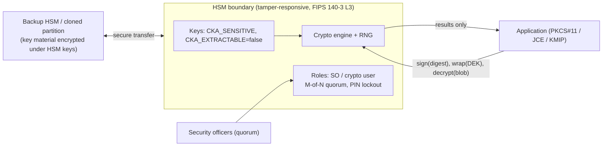
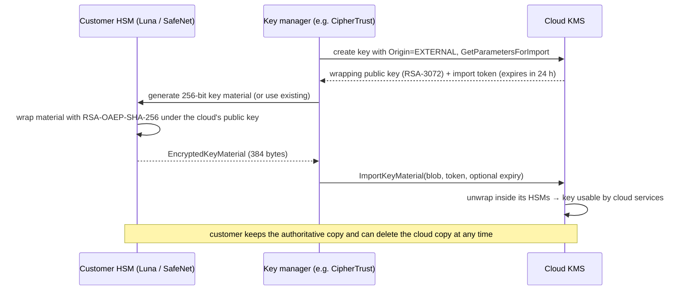
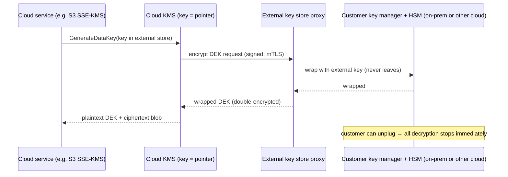
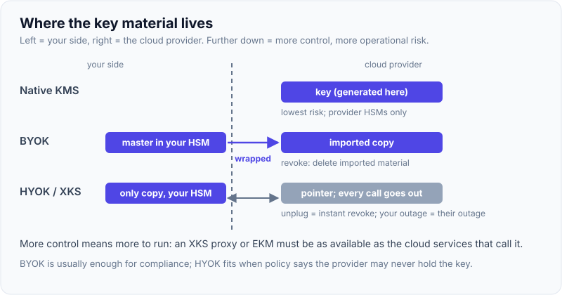

# HSMs & BYOK/HYOK

!!! abstract "Key takeaways"
    - An **HSM** is a tamper-resistant device that generates, stores and uses keys so that **private and secret keys never leave it in plaintext**. Applications send data in and get results out. Measured with SoftHSM2 (a software PKCS#11 token with the same API): a key created as `sensitive, never extractable` couldn't be read (`--read-object` aborted), and Java's `getEncoded()` returned **null**, yet the key wrapped a DEK inside the token in **~44 µs**.
    - Interfaces: **PKCS#11** (C API, the lingua franca), **JCE/SunPKCS11** in Java, Microsoft CNG/KSP, **KMIP** for key management servers, and vendor REST APIs. Assurance comes from **FIPS 140-3** (Level 3: tamper-evident/responsive, identity-based auth) and Common Criteria.
    - Operational controls: **partitions** (tenant isolation), **role separation** (security officer vs crypto user), **M-of-N quorum** for sensitive operations, PIN lockout (three wrong PINs gave `CKR_PIN_INCORRECT` each time), HA groups and **secure backups** of key material.
    - **BYOK:** you generate key material in your own HSM and **import** it into the cloud KMS, wrapped with the provider's public key. Reproduced: a 32-byte key wrapped with an RSA-3072 wrapping key using `RSAES_OAEP_SHA_256` → a **384-byte** blob that the provider side unwrapped identically. Unwrapping with the wrong OAEP hash failed. The cloud then uses the key, and you keep the authoritative copy and can delete it from the cloud.
    - **HYOK / external key stores** (AWS XKS, Google Cloud EKM, Azure via Managed HSM/DKE): the key **never** enters the cloud, and every cryptographic call goes out to your key manager. You get maximum sovereignty, and you take on availability, latency and operational risk.

## Why it matters

Regulated organisations (banks, healthcare, government) often must prove that keys are protected in FIPS-validated hardware, that the provider can't use keys without them, and that they can revoke cloud access to data. That's the problem space of HSMs, BYOK and HYOK, and it's exactly what products like **Thales CipherTrust Cloud Key Manager** solve. Interviewers for security-heavy roles ask what an HSM really guarantees, how PKCS#11 works, how BYOK differs from HYOK, and what trade-offs each brings. This page is ★: my Coriolis work included HSM integrations with Thales Luna and SafeNet and multi-cloud key management.

Demos used **SoftHSM2** with OpenSC `pkcs11-tool` and Java 21's **SunPKCS11** provider, plus OpenSSL 3 for the BYOK wrapping procedure, while writing this page. SoftHSM implements the PKCS#11 API in software, so it shows real API behaviour but none of the physical protections of a hardware HSM.

## Core concepts

### What an HSM guarantees


*Notice that the application never handles key bytes. Compromising the server gives an attacker the ability to use the key while they control it, but not to steal it, which is why audit and access control around HSM use still matter.*

| Guarantee | What it means |
|---|---|
| Non-exportability | Keys marked sensitive and non-extractable can't be read in plaintext (verified in SoftHSM) |
| Tamper resistance | Physical attacks trigger zeroisation (hardware HSMs) |
| True RNG | Hardware entropy for key generation |
| Access control | Login roles, PINs/smartcards, quorum (M-of-N) for administrative operations |
| Audit | Signed or tamper-evident logs of operations |
| Certified assurance | FIPS 140-2/140-3 levels, Common Criteria EAL4+ |

**FIPS 140-3 levels (simplified):** Level 1 = correct algorithms, software OK. Level 2 = tamper evidence + role-based auth. **Level 3 = tamper response (zeroisation), identity-based auth, physical separation of critical interfaces** (the common requirement for HSMs). Level 4 = protection against environmental attacks.

### PKCS#11 in practice

PKCS#11 (Cryptoki) models **slots** and **tokens** (an HSM partition), **sessions**, and **objects** (keys, certificates) with **attributes**:

| Attribute | Meaning |
|---|---|
| `CKA_SENSITIVE` | Value can't be revealed in plaintext |
| `CKA_EXTRACTABLE` | Can be exported wrapped under another key (false = never leaves) |
| `CKA_ALWAYS_SENSITIVE`, `CKA_NEVER_EXTRACTABLE` | Proof that it has always been protected |
| `CKA_LOCAL` | Generated on the token (not imported) |
| `CKA_ENCRYPT/DECRYPT/SIGN/WRAP/UNWRAP` | Permitted operations |

Measured in SoftHSM2:

| Action | Result |
|---|---|
| `pkcs11-tool --keygen --key-type AES:32 --sensitive` | Key `kek-v1`, `Access: sensitive, always sensitive, never extractable, local` |
| `--read-object --type secrkey --id 01` | **Aborting.** (no plaintext export) |
| EC P-256 key pair generated on the token | Private key `never extractable, local`. A 64-byte (raw r‖s) ECDSA signature produced inside |
| Java: `ks.getKey("kek-v1")` | `P11SecretKey`, **`getEncoded() = null`** |
| Java: AES-GCM encrypt a 32-byte DEK with the token key | 48-byte wrapped DEK, decrypted back identically. **~44 µs/op** |
| Login with a wrong PIN, three times | `CKR_PIN_INCORRECT` each time (real HSMs lock the user after N failures) |
| SunPKCS11 with `AES/KWP` or `RSA/OAEP` | Not supported by that provider: mechanism support varies by HSM and provider, so check it early |

### Cloud HSM options

| Service | Model | Notes |
|---|---|---|
| **AWS CloudHSM** | Single-tenant HSM clusters in your VPC (FIPS 140-3 L3), you own the crypto users | PKCS#11, JCE, OpenSSL engine, KSP. You manage HA (multi-AZ cluster), users, backups. Can back an AWS KMS **custom key store** |
| **AWS KMS** | Multi-tenant HSM fleet (FIPS 140-3 L3) | Not "your" HSM, but keys never leave in plaintext |
| **Azure Managed HSM** | Single-tenant, fully managed, FIPS 140-3 L3, customer-held security domain | Keys only, Azure RBAC. Backs CMK for Azure services |
| **Azure Dedicated HSM** | Bare Thales Luna appliances in Azure | Full control, full operational responsibility (being superseded by Cloud HSM offerings) |
| **Google Cloud HSM** | Managed HSM protection level for Cloud KMS keys (FIPS 140-2 L3) | Same KMS API, `protectionLevel: HSM` |
| On-prem: **Thales Luna**, Entrust nShield, Utimaco | Appliances or PCIe cards | Root CAs, payment HSMs, BYOK sources |

### BYOK: bring your own key


*Notice that the key material crosses the network only wrapped under a key whose private half lives in the cloud provider's HSM. The plaintext exists only inside two HSM boundaries.*

{ loading=lazy }
*Notice the only thing that ever crosses the network is the orange wrapped blob.*

Reproduced with OpenSSL (the same steps AWS documents for manual import):

| Step | Result |
|---|---|
| Wrapping public key (RSA-3072, DER) | 422 bytes |
| Key material | 32 random bytes |
| Encrypt with `rsa_padding_mode:oaep`, `rsa_oaep_md:sha256`, `rsa_mgf1_md:sha256` | **384-byte** `EncryptedKeyMaterial.bin` |
| Provider side decrypts with its private key | Identical key material |
| Decrypt assuming OAEP with SHA-1 | `Public Key operation error`: algorithm parameters must match the provider's wrapping spec exactly |

BYOK across providers:

| | AWS KMS | Azure Key Vault / Managed HSM | Google Cloud KMS |
|---|---|---|---|
| Mechanism | `GetParametersForImport` → `ImportKeyMaterial` (RSA-OAEP-SHA-256 or RSA-AES key wrap) | BYOK: Key Exchange Key (KEK) from the vault, wrap target key in your HSM, upload `.byok` blob | **Import jobs** with RSA-OAEP + AES key wrap |
| Expiry | Optional material expiry | Key attributes | n/a |
| Re-import | Same material can be re-imported after deletion | Re-upload | New version |
| Rotation | Automatic rotation not supported for imported material (newer on-demand rotation with imported material exists); rotate by new key + alias | New version | New import as new version |

**Why BYOK:** compliance (key generated under your control and quorum), the ability to **delete the cloud copy** to cut access instantly, key escrow and backup outside the provider, and consistent key provenance across clouds. **What it doesn't give you:** once imported, the provider's service uses the key internally. You trust the provider's HSM boundary and access controls just as with native keys.

### HYOK and external key stores


*Notice that every key operation leaves the cloud. Revocation is instant and absolute, but the external system's latency and availability become part of every request.*

- **AWS KMS External Key Store (XKS):** KMS keys whose material lives in your external key manager behind an XKS proxy. KMS performs double encryption (an internal KMS key plus the external key).
- **Google Cloud EKM:** `EXTERNAL` / `EXTERNAL_VPC` protection levels with partners (Thales CipherTrust, Fortanix, Futurex), plus Key Access Justifications.
- **Azure:** Managed HSM with customer-held security domain, and **Double Key Encryption** for Microsoft Purview-protected content (one key held by the customer).

| Model | Where key material lives | Provider can use key? | Revoke access | Availability risk |
|---|---|---|---|---|
| Native KMS key | Provider HSMs | Yes (under policy) | Disable/delete key | Lowest |
| **BYOK** | Provider HSMs (copy) + your HSM (master) | Yes | Delete imported material (re-import later) | Low |
| Dedicated cloud HSM (CloudHSM, Managed HSM) | Single-tenant HSM you control | Only via your users/policies | Your control | Medium (you run HA) |
| **HYOK / XKS / EKM** | Outside the cloud | Only per request, via your system | Unplug instantly | **Highest**: your outage = cloud data outage |

{ loading=lazy }
*Notice the HYOK arrow goes both ways on every request: that's the price of instant revocation.*

## In practice: code & configuration

### Java with an HSM via PKCS#11

```java
// pkcs11.cfg:  name = Luna   library = /usr/safenet/lunaclient/lib/libCryptoki2_64.so   slot = 0
Provider p11 = Security.getProvider("SunPKCS11").configure("/etc/hsm/pkcs11.cfg");
Security.addProvider(p11);
KeyStore ks = KeyStore.getInstance("PKCS11", p11);
ks.load(null, pinFromSecretStore());                               // crypto-user PIN, never hard-coded

SecretKey kek = (SecretKey) ks.getKey("claims-kek-v3", null);      // handle only: getEncoded() == null
byte[] nonce = new byte[12];
SecureRandom.getInstanceStrong().nextBytes(nonce);
Cipher c = Cipher.getInstance("AES/GCM/NoPadding", p11);           // operation executes inside the HSM
c.init(Cipher.ENCRYPT_MODE, kek, new GCMParameterSpec(128, nonce));
byte[] wrappedDek = c.doFinal(dek.getEncoded());
```

Vendors also ship their own JCE providers (Luna JSP, nShield) with richer mechanism support. AWS CloudHSM provides a JCE provider and PKCS#11 library.

=== "❌ Common mistake"

    ```text
    Generate the "BYOK" key on a laptop with openssl rand, email it to the cloud admin,
    keep the only copy in a password-protected zip, and never test re-import.
    HSM partition PIN in application.yml. One HSM, no HA, no backups.
    ```

=== "✅ Better"

    ```text
    Key material generated inside the HSM under quorum, wrapped in-HSM with the provider's
    wrapping key, imported via automation (key manager), backed up to a second HSM/partition,
    expiry and re-import procedures tested. HSM credentials from a secret store,
    HA group across sites, audit logs shipped to the SIEM.
    ```

### Terraform: AWS KMS key with imported material (BYOK)

```hcl
resource "aws_kms_external_key" "claims_byok" {
  description             = "BYOK key, material from on-prem Luna HSM"
  key_material_base64     = var.wrapped_key_material_b64   # produced by the HSM/key manager, never plaintext
  valid_to                = "2027-12-31T00:00:00Z"         # optional expiry of imported material
  deletion_window_in_days = 30
  policy                  = data.aws_iam_policy_document.byok.json
}
```

(Passing wrapped material through Terraform state still deserves care: many teams run the import via the key manager's API instead.)

## Real-world usage

- **Payment industry:** payment HSMs (Thales payShield) for PIN translation and card keys under PCI PIN and PCI DSS rules.
- **Public and private CAs:** root and issuing CA keys in Luna/nShield HSMs with key ceremonies and quorum ([TLS and certificates](02-tls-and-certificates.md)).
- **Banks and healthcare on cloud:** BYOK into AWS KMS/Azure Key Vault for CMK, with on-prem HSMs as the root of key provenance, orchestrated by **Thales CipherTrust Cloud Key Manager** or similar.
- **Sovereign cloud requirements** (EU public sector, Schrems II concerns) drive HYOK: Google EKM, AWS XKS, Microsoft DKE.
- **Code signing and blockchain custody** keep signing keys in HSMs so build servers or wallets never hold them.

## Trade-offs & production gotchas

!!! warning "HSM and BYOK pitfalls"
    - **Losing the only copy of BYOK material** (or letting it expire without a re-import path): cloud data becomes unrecoverable.
    - **Single HSM, no HA:** HSMs fail and need maintenance. Use HA groups, multiple AZs and tested backups.
    - **Credentials as the weak link:** HSM PINs in config files mean an attacker can use (not steal) keys. Protect and rotate them, and use quorum for admin.
    - **Mechanism and provider gaps:** e.g. SunPKCS11 lacked AES-KWP and RSA-OAEP here. Validate the exact algorithms you need early.
    - **HYOK outages:** an external key store down = cloud services can't decrypt. Size it for latency (every call), multi-site HA, and monitor.
    - **Wrong wrapping parameters on import:** OAEP hash/MGF mismatches fail (reproduced). Follow the provider's spec exactly.
    - **Assuming BYOK means the provider can't access data:** imported keys are used by provider services internally. Only HYOK keeps keys outside.
    - **Throughput:** HSMs have operation limits (thousands to tens of thousands of ops/s). Use envelope encryption so HSMs only wrap DEKs.

- **Control vs operational burden:** native KMS → BYOK → dedicated HSM → HYOK increases control and sovereignty, and also cost, latency and responsibility. Pick the minimum that satisfies the regulatory requirement.
- **Cloud HSM vs on-prem HSM:** cloud HSMs remove physical operations but keep you responsible for users, HA and backups.

## How this connects to my experience

- **Resume bullets (Coriolis Technologies, CipherTrust Cloud Key Management):** "Developed enterprise key management capabilities supporting AWS, Azure, and GCP environments", "**Implemented automated key rotation workflows and HSM integrations using Thales Luna and SafeNet**", "Worked extensively with AWS KMS, encryption services, and cloud security workflows."
- **How to talk about it:** CCKM sits between customer HSMs (Luna, SafeNet) and cloud KMSs: generating key material in the HSM, wrapping it for each provider's import format (AWS import parameters, Azure BYOK KEK, GCP import jobs), uploading it, tracking expiry and versions, and rotating by importing new material or creating new keys. *[confirm: whether you worked on the HSM side (PKCS#11/Luna client integration), the cloud import side, or both; which providers; HYOK features such as XKS or Google EKM; how the integration was tested]*
- **Talking points:**
    - "An HSM guarantees keys can't be extracted, not that they can't be misused, so access control, quorum and audit around HSM use still matter."
    - "BYOK gives provenance and the ability to pull the cloud copy. HYOK keeps keys outside entirely but makes the key manager a dependency of every cloud request."
    - "I've seen how strict the import formats are: OAEP hash, MGF and wrapping algorithm must match exactly, and the import token expires."
- **Likely follow-up chain:** "What does an HSM give you that KMS doesn't?" → "What's PKCS#11?" → "Explain BYOK step by step" → "BYOK vs HYOK?" → "How do you rotate imported keys?" ([rotation](06-key-rotation-strategies-without-downtime.md)) → "What did you build in CCKM?"

## Interview questions

### Fundamentals

??? question "Q1. What is an HSM, and what does it guarantee?"
    **Answer:** A hardware security module is a tamper-resistant, certified device (FIPS 140-3 Level 3 typically) that generates, stores and uses cryptographic keys internally. Keys can be marked sensitive and non-extractable, so applications send data and receive results, but never get key bytes (verified with SoftHSM: export aborted, Java `getEncoded()` returned null while operations worked). It also provides true randomness, role-based authentication, quorum controls, audit and tamper response (zeroisation). It doesn't stop an attacker with valid access from *using* keys, so access control and audit remain essential.

    **Interviewer listens for:** non-extractability, certification, controls, and the misuse caveat.

    **Common wrong answer:** "An encrypted disk for keys."

??? question "Q2. What is PKCS#11?"
    **Answer:** The Cryptoki standard C API for cryptographic tokens and HSMs. It models slots and tokens, sessions, login roles (security officer, user) and objects (keys, certificates) with attributes such as `CKA_SENSITIVE`, `CKA_EXTRACTABLE` and allowed operations, and mechanisms (`CKM_AES_GCM`, `CKM_RSA_PKCS_OAEP`, `CKM_ECDSA`). Applications load the vendor's library (Luna, CloudHSM, SoftHSM) and call it directly, or via wrappers such as Java's SunPKCS11 provider or OpenSSL providers. Mechanism support varies (here SunPKCS11 lacked AES-KWP and RSA-OAEP).

    **Interviewer listens for:** the object/attribute model, vendor libraries, language bindings and mechanism variance.

    **Common wrong answer:** "A file format for certificates." (That's PKCS#12.)

??? question "Q3. What do FIPS 140-3 levels mean?"
    **Answer:** A NIST standard for cryptographic modules. Level 1: approved algorithms, no physical requirements. Level 2: tamper evidence and role-based authentication. Level 3: tamper response with key zeroisation, identity-based authentication, separation of critical security parameter interfaces (the usual requirement for HSMs and cloud KMS). Level 4: protection against environmental attacks and complete envelope protection. Compliance regimes (FedRAMP, PCI, some healthcare contracts) specify required levels.

    **Interviewer listens for:** a correct ladder, especially Level 3.

    **Common wrong answer:** "Levels are key lengths."

??? question "Q4. What is BYOK?"
    **Answer:** Bring Your Own Key: you generate key material in your own HSM, wrap it with the cloud provider's public wrapping key, and import it into the cloud KMS. The cloud then uses it like a native key. You keep the authoritative copy (and can back it up), prove provenance and generation controls, and can delete the cloud copy (or let it expire) to cut access, re-importing later. Reproduced: 32 bytes wrapped with RSA-3072 OAEP-SHA-256 → 384-byte blob unwrapped identically on the provider side.

    **Interviewer listens for:** generate locally, wrap with the provider key, import, control benefits.

    **Common wrong answer:** "Uploading your key file to the cloud console."

### Intermediate

??? question "Q5. BYOK vs HYOK: what's the difference, and when would you pick each?"
    **Answer:** BYOK imports a copy of your key into the provider's HSMs, so the provider performs operations with it locally (fast and highly available), and you control its lifecycle and provenance. HYOK (AWS XKS, Google EKM, Microsoft DKE) keeps keys outside the cloud entirely, so every cryptographic call goes to your external key manager. You can cut access instantly, and the provider can't use the key without your system, but you inherit latency on every operation and the availability risk (your outage stops cloud decryption). Pick BYOK for most compliance needs. Pick HYOK only for strict sovereignty or regulator requirements, with HA engineering.

    **Interviewer listens for:** where the key lives, who performs operations, the latency and availability trade-off.

    **Common wrong answer:** "They're the same, HYOK is just the Azure name."

??? question "Q6. Walk through importing key material into AWS KMS."
    **Answer:** Create a KMS key with `Origin=EXTERNAL`. Call `GetParametersForImport` choosing a wrapping algorithm (e.g. `RSAES_OAEP_SHA_256`, or RSA-AES key wrap for larger material) and wrapping key spec (RSA-3072/4096). You get the wrapping public key and an import token valid for 24 hours. In your HSM, wrap the 256-bit key material with that public key using exactly those parameters (reproduced: 384-byte blob; a SHA-1 assumption failed to unwrap). Call `ImportKeyMaterial` with the blob, token, and optional expiry. Keep your copy backed up: AWS can't recover imported material, and you can re-import the same material after deletion or expiry.

    **Interviewer listens for:** the API sequence, exact algorithm parameters, token expiry, backups.

    **Common wrong answer:** "Send the plaintext key over TLS."

??? question "Q7. Why do key attributes like CKA_EXTRACTABLE matter?"
    **Answer:** They define what the token allows: `CKA_SENSITIVE` prevents plaintext reading, `CKA_EXTRACTABLE=false` prevents even wrapped export, and `CKA_NEVER_EXTRACTABLE`/`CKA_ALWAYS_SENSITIVE`/`CKA_LOCAL` prove the key has always been protected and was generated on-device (useful for attestation). Measured: a key created `--sensitive` showed "always sensitive, never extractable, local" and export aborted. Choose deliberately: KEKs and signing keys non-extractable. Keys meant for BYOK export must be extractable only under wrapping, with quorum.

    **Interviewer listens for:** each attribute's meaning and the design choice.

    **Common wrong answer:** "Attributes are just labels."

??? question "Q8. How do you make HSMs highly available and recoverable?"
    **Answer:** HA groups or clusters across sites or AZs (Luna HA groups, CloudHSM multi-AZ clusters) with client-side load balancing and failover. Key material replicated between HSMs through secure cloning or backup (encrypted under HSM-internal keys, often requiring quorum). Backups stored off-site, restore procedures tested. Monitoring of HSM health, capacity (ops/s) and partition usage. For cloud use, envelope encryption reduces HSM calls so capacity and latency issues hurt less.

    **Interviewer listens for:** HA groups, secure cloning/backup, testing, capacity.

    **Common wrong answer:** "HSMs don't fail."

??? question "Q9. What is quorum (M-of-N) authentication, and why use it?"
    **Answer:** Sensitive operations (creating or deleting partitions, exporting keys for backup, changing policies, activating a root CA key) require approval from M of N designated officers, each with their own credential (smartcards, PED keys). It prevents a single insider or a single stolen credential from compromising keys, enforces separation of duties, and supports auditable key ceremonies. Cloud equivalents: AWS CloudHSM quorum authentication, Azure Managed HSM security domain with quorum of keys.

    **Interviewer listens for:** dual control, insider threat, ceremonies.

    **Common wrong answer:** "Requiring two passwords for one admin."

### Senior

??? question "Q10. Design key management for a bank adopting AWS and Azure with a regulator requiring key provenance and the ability to revoke cloud access."
    **Answer:** On-prem (or cloud-dedicated) HSMs as the root of provenance, under quorum. A key manager (e.g. CipherTrust) generating key material in HSMs and importing via BYOK into AWS KMS and Azure Managed HSM/Key Vault Premium per application and data classification, with documented import procedures, material expiry, backups and re-import tests. Revocation: delete imported material or disable keys (instant), documented as the revocation control. For the most sensitive datasets, HYOK (XKS/DKE) with HA key managers in two sites if the regulator requires keys never leave. Envelope encryption everywhere to limit HSM/KMS calls. Separation of duties: security team owns keys, app teams get use-only permissions with context conditions. Audit from HSM logs, CloudTrail and Azure Monitor into the SIEM. Regular key ceremonies and rotation.

    **Interviewer listens for:** provenance, BYOK/HYOK placement by sensitivity, revocation mechanics, separation of duties, audit.

    **Common wrong answer:** "Use native KMS keys; the regulator will accept it."

??? question "Q11. How would you rotate a BYOK key?"
    **Answer:** Imported material doesn't support classic automatic rotation, so: generate new material in the HSM, create a new KMS key (or a new version where the provider supports versions, as Azure and GCP do), import it, move the alias to it so new encryptions use it, re-wrap existing DEKs where policy requires retiring the old key (ReEncrypt), keep the old key enabled for decryption until no ciphertext depends on it, then disable and eventually delete it. Track mapping between HSM key versions and cloud keys. AWS has added on-demand rotation support for imported key material, which simplifies this when available.

    **Interviewer listens for:** new material + alias switch, re-wrap, retention of old keys, tracking.

    **Common wrong answer:** "Re-import the same key."

??? question "Q12. What are the operational risks of HYOK, and how do you mitigate them?"
    **Answer:** Every cloud cryptographic operation depends on your external key manager: latency adds to requests (S3, EBS volume attach), and any outage, certificate expiry, network partition or proxy misconfiguration makes cloud data unavailable, at scale. Mitigations: multi-site active-active key managers and XKS proxies, low-latency connectivity (Direct Connect, private endpoints), DEK caching inside the cloud service within allowed limits, capacity planning for request rates, monitoring and alerting on latency and errors, runbooks, and restricting HYOK to datasets that truly need it.

    **Interviewer listens for:** dependency, latency, failure modes, HA and scope limitation.

    **Common wrong answer:** "HYOK is strictly better security, so use it everywhere."

### Scenario-based

??? question "Q13. An ImportKeyMaterial call fails with an error about the key material. What do you check?"
    **Answer:** The wrapping algorithm and parameters match `GetParametersForImport` exactly (OAEP hash and MGF hash SHA-256 vs SHA-1; RSA vs RSA-AES key wrap): reproduced, a parameter mismatch prevents unwrapping. The import token hasn't expired (24 h) and belongs to the same key. The material size and format (256-bit raw for symmetric, correct DER/PKCS#8 for asymmetric). You used the wrapping public key from the same parameters request. If re-importing, the material is identical to the original. Then check the key state (pending import) and permissions.

    **Interviewer listens for:** parameters, token, format, re-import rules.

    **Common wrong answer:** "Retry until it works."

??? question "Q14. A security review says the application's HSM PIN is in a Kubernetes Secret and the app runs with full crypto-user rights. Risk and fix?"
    **Answer:** Anyone who reads that Secret (or compromises the pod) can use every key in the partition, even though they can't extract them: sign arbitrary data, decrypt anything wrapped by those keys. Fix: separate partitions/users per application with only the needed keys and mechanisms, credentials from an external secret store with workload identity and rotation, network restrictions to the HSM, HSM-side audit and alerts on unusual operation volume, quorum for administrative actions, and prefer envelope designs where the app only wraps/unwraps DEKs. Consider a KMS front (CloudHSM-backed custom key store) so IAM and CloudTrail govern usage.

    **Interviewer listens for:** "use not steal" risk, least privilege, credential handling, audit.

    **Common wrong answer:** "It's fine because keys can't leave the HSM."

## Cheat sheet

| Topic | Remember |
|---|---|
| HSM | Tamper-resistant, keys non-extractable, results only; FIPS 140-3 L3 |
| Measured | SoftHSM: export aborted, `getEncoded()` null, DEK wrap ~44 µs, PIN errors |
| PKCS#11 | Slots/tokens, sessions, objects + attributes (SENSITIVE, EXTRACTABLE, LOCAL), mechanisms |
| Controls | Partitions, SO vs user, M-of-N quorum, PIN lockout, HA + backups |
| Cloud HSM | AWS CloudHSM, Azure Managed HSM, Google Cloud HSM; KMS custom key store |
| BYOK | Wrap HSM material with provider key (RSA-3072 OAEP-SHA-256 → 384 B), import, keep master copy |
| HYOK | Key stays outside (XKS, EKM, DKE); instant revoke; latency + availability risk |
| Rotation (BYOK) | New material + new key/version + alias switch; keep old for decrypt |
| Pitfalls | Lost material, single HSM, PINs in config, parameter mismatch |

## Sources
1. [OASIS PKCS #11 Cryptographic Token Interface Base Specification v3.1](https://docs.oasis-open.org/pkcs11/pkcs11-spec/v3.1/pkcs11-spec-v3.1.html).
2. [NIST FIPS 140-3](https://csrc.nist.gov/pubs/fips/140-3/final) and [CMVP validated modules](https://csrc.nist.gov/projects/cryptographic-module-validation-program).
3. [AWS KMS: Importing key material](https://docs.aws.amazon.com/kms/latest/developerguide/importing-keys.html), [custom key stores (CloudHSM)](https://docs.aws.amazon.com/kms/latest/developerguide/keystore-cloudhsm.html) and [external key stores (XKS)](https://docs.aws.amazon.com/kms/latest/developerguide/keystore-external.html).
4. [AWS CloudHSM user guide](https://docs.aws.amazon.com/cloudhsm/latest/userguide/introduction.html).
5. [Azure Key Vault BYOK specification](https://learn.microsoft.com/en-us/azure/key-vault/keys/byok-specification) and [Managed HSM security domain](https://learn.microsoft.com/en-us/azure/key-vault/managed-hsm/security-domain).
6. [Google Cloud KMS: Importing keys](https://cloud.google.com/kms/docs/importing-a-key) and [Cloud EKM](https://cloud.google.com/kms/docs/ekm).
7. [Thales Luna HSM](https://cpl.thalesgroup.com/encryption/hardware-security-modules/general-purpose-hsms) and [SoftHSM2](https://github.com/softhsm/SoftHSMv2); [Java PKCS#11 reference guide](https://docs.oracle.com/en/java/javase/21/security/pkcs11-reference-guide1.html).
8. Demonstrations on this page: SoftHSM2 + OpenSC pkcs11-tool + Java 21 SunPKCS11 (non-extractable keys, in-token wrapping, signing, PIN errors, provider mechanism gaps) and OpenSSL 3 (BYOK RSA-OAEP-SHA-256 wrap/unwrap, parameter mismatch), run while writing this page.
