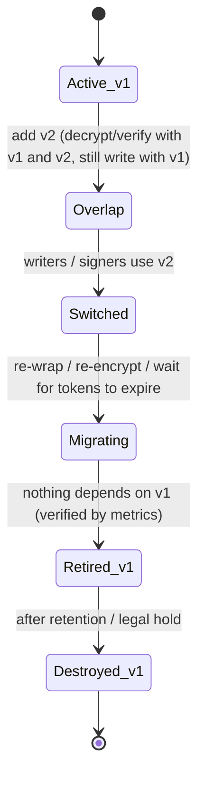
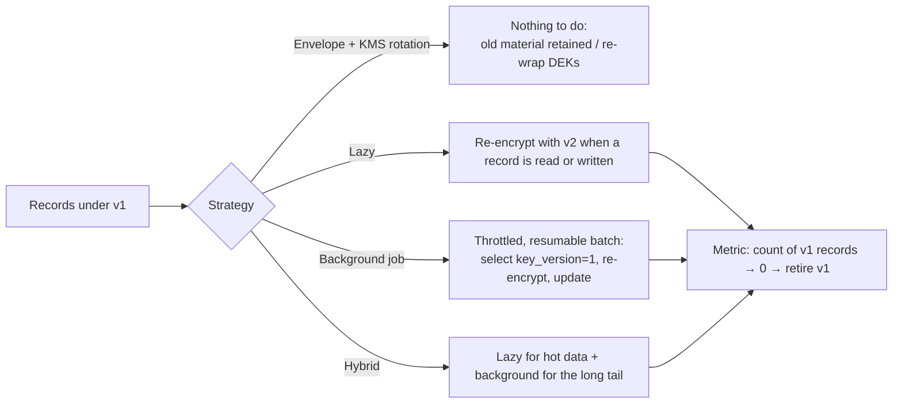
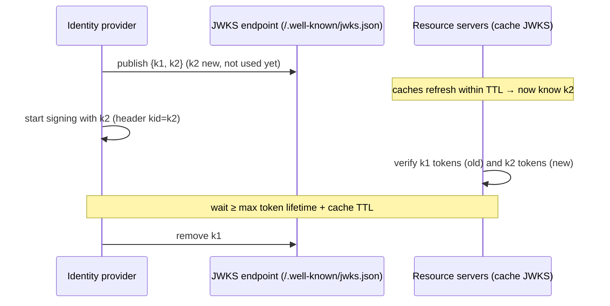

# Key Rotation Strategies Without Downtime

!!! abstract "Key takeaways"
    - Rotation limits **how much data one key protects** and **how long a leaked key is useful**. Drivers: cryptoperiods (NIST SP 800-57), usage limits (AES-GCM nonces), compliance (PCI DSS, HIPAA programmes), people leaving, and **suspected compromise**.
    - The universal pattern is **add → switch → migrate → retire**: introduce the new key while old ones remain valid for reading, switch writers to it, migrate what must move, and only then retire the old key. Every ciphertext, token and signature must carry a **key ID / version**.
    - Measured: after adding v2 to a keyring, **10,000/10,000** v1 records stayed readable. Lazy re-encryption on 30% of reads migrated 3,037, and a background job re-encrypted the remaining **6,963 in ~0.5 s**. Retiring a key **before** migration made its records unreadable ("key version 2 retired").
    - With **envelope encryption**, rotating the KEK only re-wraps DEKs ([envelope encryption](03-envelope-encryption-and-data-keys.md)). AWS KMS automatic rotation keeps old material under the same key ID, so nothing needs re-encrypting. Azure and GCP create new versions that decrypt old data.
    - For **signing keys**, publish the new public key first (JWKS with both `kid`s: old and new tokens both verified), sign with the new key, and remove the old key only after the longest-lived token or artifact expires. For **shared secrets** (DB passwords, API keys, HMAC webhook secrets), accept two values during the overlap.

## Why it matters

Rotation is where key management meets production. Done badly, it causes outages: a JWKS updated after tokens were already signed with a new key, a database password changed before all pods picked it up, an old KMS key deleted while backups still need it. Done well, it's routine, automated and boring. Interviewers probe how you rotate each kind of key without downtime and what you do after a leak. This is ★: I "implemented automated key rotation workflows" for CipherTrust Cloud Key Management.

The keyring, migration and JWKS behaviour was measured with a Java 21 simulation written for this page.

## Core concepts

### Why and when to rotate

| Trigger | Example | Urgency |
|---|---|---|
| Cryptoperiod reached | Annual KEK rotation, 90-day certificates | Scheduled |
| Usage limit | ~2³² AES-GCM encryptions with random nonces per key | Scheduled / automatic |
| Personnel or system change | Admin with key access leaves, vendor offboarded | Prompt |
| Compliance | PCI DSS key management requirements, internal policy | Scheduled |
| **Suspected compromise** | Key in a Git commit, leaked config, breached host | **Emergency** |
| Algorithm deprecation | RSA-2048 → 3072, SHA-1 → SHA-256, PQC migration | Planned migration |

Rotation doesn't fix everything: data encrypted under a leaked key stays exposed until re-encrypted, and signatures made with a leaked key stay valid until verifiers stop trusting it. That's why emergency rotation includes revocation and re-encryption, not just "new key from now on".

### The universal pattern


*Notice the ordering: readers learn about the new key before writers start using it, and the old key is retired only when measurements prove nothing still needs it. Skipping either step is what causes rotation outages.*

### Rotation by key type

| Key type | Strategy | Overlap window |
|---|---|---|
| **KMS KEK** (envelope) | Native rotation (AWS same key ID, old material kept; Azure/GCP new versions) or new key + alias + `ReEncrypt` of DEKs | Old versions kept indefinitely or until re-wrapped |
| **Data keys (DEKs)** | Fresh DEK per object/session; rotate cached DEKs by age/messages/bytes | None needed |
| **Application symmetric keys** (field encryption) | Keyring with versions; key ID in each ciphertext; lazy + background re-encryption | Until migration completes |
| **Signing keys** (JWT, code, documents) | Publish new public key → sign with new → remove old after max lifetime | ≥ max token/artifact lifetime + cache TTL |
| **TLS certificates** | Renew before expiry with new key pair; hot reload; for CA changes, distribute new trust anchor first | renewBefore window ([TLS](02-tls-and-certificates.md)) |
| **Shared secrets** (DB passwords, API keys, HMAC) | Dual credentials / dual secrets (alternating users, two active API keys, two webhook secrets) | Until all consumers switched |
| **Password hashes** | Rehash on next login with the new algorithm/parameters | Gradual ([password hashing](07-password-hashing-and-secrets-management.md)) |

### Data re-encryption strategies


*Notice that lazy migration alone never finishes for cold data (6,963 of 10,000 records were still on v1 after a 30% read sample). A background job is what lets you actually retire the old key.*

Measured with 10,000 AES-256-GCM records and a versioned keyring:

| Step | Result |
|---|---|
| Add v2, make it active | All 10,000 v1 records still decrypt (keyring lookup by version byte) |
| Lazy re-encryption on 30% of reads | 3,037 migrated, **6,963 still on v1** |
| Background job | Remaining 6,963 re-encrypted in **~510 ms** (in memory). v1 count = 0 |
| Retire v1 | Safe: reads keep working |
| Retire v2 before migrating to v3 | `IllegalStateException: key version 2 retired`: data unreadable |

### Signing keys and JWKS


*Notice that the new key is published a full cache TTL before it's used, and the old key stays until every token signed with it has expired. Reversing either step causes signature-verification failures across all services.*

Measured: with both keys in the JWKS, a token signed with `k1` and one signed with `k2` both verified. After removing `k1` (once the maximum token lifetime had passed), `k1` was no longer available, which is correct then and an outage if done early.

### Cloud KMS rotation semantics

| | Automatic rotation | Old data | Manual rotation |
|---|---|---|---|
| **AWS KMS** (symmetric, customer managed) | New material every 90–2,560 days (default 365) + on-demand; same key ID | Decrypts transparently (old material retained) | New key + `UpdateAlias` (+ `ReEncrypt` to retire old key); required for asymmetric/HMAC keys |
| **Azure Key Vault** | Rotation policy creates new versions; expiry notifications | Old versions decrypt (if enabled) | New version; update references that pin a version |
| **GCP Cloud KMS** | Rotation schedule creates new primary version | Old versions decrypt while enabled | New version / set primary |

Pitfall: apps that pin a **specific key version** (Azure key URI with version, GCP version name) don't follow automatic rotation. Reference the key, not the version, for encryption.

## In practice: code & configuration

### A versioned keyring in Java

```java
public final class Keyring {
    private final Map<String, SecretKey> keys;     // "v1" → key, "v2" → key (loaded from KMS-wrapped storage)
    private final String activeId;                 // "v2": used for all new encryptions

    public byte[] encrypt(byte[] pt, byte[] aad) throws GeneralSecurityException {
        byte[] nonce = new byte[12];
        RNG.nextBytes(nonce);
        Cipher c = Cipher.getInstance("AES/GCM/NoPadding");
        c.init(Cipher.ENCRYPT_MODE, keys.get(activeId), new GCMParameterSpec(128, nonce));
        c.updateAAD(concat(activeId.getBytes(UTF_8), aad));              // bind key ID too
        return Header.of(activeId, nonce).prepend(c.doFinal(pt));        // key ID travels with the data
    }

    public byte[] decrypt(byte[] blob, byte[] aad) throws GeneralSecurityException {
        Header h = Header.parse(blob);
        SecretKey k = keys.get(h.keyId());
        if (k == null) throw new KeyRetiredException(h.keyId());          // alert: should never happen
        Cipher c = Cipher.getInstance("AES/GCM/NoPadding");
        c.init(Cipher.DECRYPT_MODE, k, new GCMParameterSpec(128, h.nonce()));
        c.updateAAD(concat(h.keyId().getBytes(UTF_8), aad));
        return c.doFinal(h.body(blob));
    }

    public boolean needsRotation(byte[] blob) { return !Header.parse(blob).keyId().equals(activeId); }
}
// Read path: if (keyring.needsRotation(blob)) repository.updateCiphertext(id, keyring.encrypt(plain, aad));  // lazy
// Background: SELECT id FROM claims WHERE key_version <> 'v2' LIMIT 1000 ... (throttled, resumable)
```

Google Tink's keysets implement exactly this (primary key + enabled keys, key ID prefix in every ciphertext), and are worth using instead of hand-rolled code.

### Rotating a database password with zero downtime

=== "❌ Common mistake"

    ```text
    1. ALTER USER app PASSWORD 'new';      ← every running pod's pool fails on next reconnect
    2. Update the Kubernetes Secret
    3. Restart pods and hope
    ```

=== "✅ Better (alternating users / dual credentials)"

    ```text
    1. Create/enable credential B (app_b) with the same grants; credential A keeps working
    2. Store B in Secrets Manager / Key Vault as AWSCURRENT; A becomes AWSPREVIOUS
    3. Pods pick up B (secret refresh + pool recycle, or rolling restart)
    4. Verify via DB sessions that nothing uses A
    5. Rotate A's password (it becomes the standby for the next cycle)
    AWS Secrets Manager's "alternating users" rotation strategy implements this.
    ```

### HMAC webhook secret rotation

```java
// Accept signatures from either secret during the overlap; sign outgoing with the newest
boolean valid = secrets.active().stream()                      // [newSecret, oldSecret]
    .anyMatch(s -> MessageDigest.isEqual(hmac(s, body), received));
```

## Real-world usage

- **AWS KMS / Azure / GCP** automatic rotation for KEKs, with services (S3, EBS, RDS) unaffected because they use envelope encryption.
- **AWS Secrets Manager** Lambda rotation (single user or alternating users) for RDS, Redshift and DocumentDB credentials. Azure Key Vault rotation policies with Event Grid notifications.
- **Identity providers** (PingFederate, Okta, Entra ID, Keycloak) rotate token-signing keys with JWKS overlap. Clients must refresh JWKS on unknown `kid`.
- **Let's Encrypt / cert-manager** rotate certificate keys every renewal (`rotationPolicy: Always`).
- **Multi-cloud key managers** (CipherTrust CCKM, Vault) schedule rotations across providers, track versions and report compliance.

## Trade-offs & production gotchas

!!! warning "Rotation outages"
    - **Retiring or deleting old keys too early:** data or tokens become unverifiable (measured). Gate retirement on metrics ("records on old version = 0", "tokens signed by old kid = 0").
    - **No key ID in ciphertext or tokens:** you can't tell which key to use, so rotation means trial decryption or downtime.
    - **Signing with a new key before publishing it:** every verifier fails until its JWKS cache refreshes.
    - **Pinned key versions** in config don't follow automatic rotation.
    - **Single-credential password rotation:** connection failures across the fleet.
    - **Rotation that never runs:** untested automation fails on the day you need it. Rotate regularly so the process stays exercised.
    - **Rotating the key but not the data after compromise:** old ciphertext remains readable to the attacker.

- **Frequency vs risk:** frequent rotation shrinks exposure but multiplies the opportunities for operational mistakes. Automation makes frequent rotation cheap; manual processes push teams to rotate rarely.
- **Re-encrypt vs re-wrap:** re-wrapping is cheap but doesn't help if a DEK itself leaked. Compromise of data keys requires real re-encryption.

## How this connects to my experience

- **Resume bullet (Coriolis, CCKM):** "Implemented **automated key rotation workflows** and HSM integrations using Thales Luna and SafeNet", "Developed enterprise key management capabilities supporting AWS, Azure, and GCP environments." **Deloitte:** IAM, KMS and Secrets Manager. **Johnson Controls:** JWT-based authentication (signing key rotation is part of that). **OptumRx:** OAuth2/PingFederate (JWKS-based token verification).
- **How to talk about it:** the CCKM workflows scheduled rotations per key policy, used native rotation where the provider supported it, and otherwise created new keys or versions (including BYOK material from Luna/SafeNet HSMs), moved aliases, and tracked versions so old ones weren't destroyed while still needed. *[confirm: scheduling mechanism, which providers' rotation APIs you integrated, how you handled imported keys, notifications/approvals, any re-wrap jobs]*
- **Talking points:**
    - "Every rotation is add, switch, migrate, retire, and retirement is gated on evidence that nothing depends on the old key."
    - "Key IDs travel with every ciphertext and token. That's what makes rotation boring."
    - "For signing keys, publish first and remove last; for secrets, run two in parallel."
    - "After a compromise, rotation isn't enough: revoke trust and re-encrypt what the old key protected."
- **Likely follow-up chain:** "How did your rotation workflows work?" → "What happens to data encrypted with the old key?" → "How do AWS, Azure and GCP differ?" → "How do you rotate a JWT signing key?" → "A DB password?" → "What if a key leaks?"

## Interview questions

### Fundamentals

??? question "Q1. Why rotate cryptographic keys?"
    **Answer:** To limit the amount of data and time exposed if a key is compromised (cryptoperiods), to stay within algorithm usage limits (AES-GCM nonce bounds), to remove access for people or systems that had it, to meet compliance requirements, and to respond to suspected compromise. Rotation is risk reduction, not a cure: data already encrypted under a leaked key stays exposed until re-encrypted.

    **Interviewer listens for:** blast radius, cryptoperiods, usage limits, compliance, and the limitation.

    **Common wrong answer:** "Because old keys become weaker over time."

??? question "Q2. Describe a safe, generic rotation process."
    **Answer:** Add the new key so all readers/verifiers accept both old and new. Switch writers/signers to the new key. Migrate what must move (re-wrap DEKs, re-encrypt data, wait for tokens to expire). Verify with metrics that nothing uses the old key. Retire (disable), then destroy after retention. Every ciphertext/token carries a key ID. Measured: retiring a key before migration made records unreadable, while following the sequence kept 10,000/10,000 readable.

    **Interviewer listens for:** ordering, key IDs, evidence-gated retirement.

    **Common wrong answer:** "Replace the key everywhere at the same time."

??? question "Q3. Does AWS KMS automatic rotation re-encrypt your data?"
    **Answer:** No. It generates new key material for the same key ID and retains all previous material, so existing ciphertexts and wrapped DEKs keep decrypting and new operations use the new material. Nothing in your data changes. It applies to symmetric customer-managed keys (90–2,560-day period, plus on-demand rotation). Asymmetric, HMAC and imported keys need manual rotation (new key + alias switch).

    **Interviewer listens for:** same key ID, retained material, scope.

    **Common wrong answer:** "Yes, KMS re-encrypts all S3 objects."

??? question "Q4. How do you rotate a JWT signing key without breaking clients?"
    **Answer:** Generate the new key pair, publish its public key in the JWKS alongside the old one, wait at least the verifiers' JWKS cache TTL, then start signing with the new key (new `kid` in headers). Keep the old public key until the longest-lived token signed with it has expired (plus cache time), then remove it. Verifiers should refetch the JWKS on an unknown `kid`. Measured: both old (`k1`) and new (`k2`) tokens verified during the overlap.

    **Interviewer listens for:** publish-before-use, kid, overlap ≥ max lifetime, refetch on unknown kid.

    **Common wrong answer:** "Swap the key and force everyone to log in again." (Sometimes acceptable in emergencies, never as the routine.)

### Intermediate

??? question "Q5. How do you re-encrypt existing data after rotating an application key?"
    **Answer:** Lazy re-encryption on read/write for hot data, plus a throttled, resumable background job (select records by key version, decrypt with the old key, encrypt with the new, update atomically with optimistic concurrency) for the long tail. Track the count of records per key version and retire the old key when it reaches zero. Measured: lazy migration on 30% of reads left 6,963 of 10,000 records on v1, and a background job cleared them. With envelope encryption, prefer re-wrapping DEKs instead.

    **Interviewer listens for:** lazy + background, idempotency/resumability, metrics-gated retirement.

    **Common wrong answer:** "Take the system offline and re-encrypt everything."

??? question "Q6. How do you rotate a database password with zero downtime?"
    **Answer:** Use two credentials. Alternating users: create or refresh user B with the same grants, publish B as current in Secrets Manager or Key Vault while A remains valid, let applications pick up B (refresh or rolling restart, pool recycle), verify no sessions use A, then rotate A for next time. Or databases that support dual passwords per user (MySQL 8 retain current password). AWS Secrets Manager's alternating-users rotation implements this. Better long-term: short-lived credentials (IAM database authentication, Vault dynamic secrets).

    **Interviewer listens for:** overlap, propagation, verification, dynamic credentials.

    **Common wrong answer:** "Change the password and restart all pods."

??? question "Q7. Why must every ciphertext carry a key identifier?"
    **Answer:** During and after rotation several keys are valid at once. The key ID tells the decryptor which key (and version) to use without trial decryption, supports lazy migration ("is this on the active key?"), lets you count records per key to decide when retirement is safe, and enables algorithm agility. Bind the key ID into the AAD so it can't be swapped. Tink keysets, the AWS Encryption SDK message format and JWT `kid` all follow this.

    **Interviewer listens for:** multiple valid keys, migration tracking, AAD binding.

    **Common wrong answer:** "The application can just try each key."

??? question "Q8. How do rotation semantics differ between AWS KMS, Azure Key Vault and GCP KMS?"
    **Answer:** AWS rotates material behind the same key ID and keeps old material, so callers change nothing. Azure Key Vault and GCP KMS create new key versions: encryption uses the latest/primary version when you reference the key without a version, and old versions keep decrypting while enabled. The trap is configuration that pins a version (Azure versioned key URIs, GCP version names) and so never moves to the new version. Imported/asymmetric keys rotate manually everywhere.

    **Interviewer listens for:** same-ID vs versions, pinned-version trap, manual cases.

    **Common wrong answer:** "They all work the same way."

??? question "Q9. How do you rotate an HMAC secret used to sign webhooks?"
    **Answer:** Introduce a second secret: the receiver accepts signatures from either during the overlap (constant-time comparison against each), the sender switches to the new secret, then the old secret is removed once all senders have switched (and any in-flight retries are done). Many providers (Stripe) support multiple active signing secrets with a defined expiry for the old one. Version the secret in the header if possible.

    **Interviewer listens for:** dual acceptance, sender switch, removal, constant-time.

    **Common wrong answer:** "Update both sides at exactly the same time."

### Senior

??? question "Q10. A private key used to sign JWTs was committed to a public repository. What do you do?"
    **Answer:** Treat it as compromised immediately. Generate a new key pair, publish it, switch signing to it, and remove the compromised public key from the JWKS as soon as possible (accepting that sessions signed with it end: force re-authentication), rather than waiting for natural expiry. Revoke refresh tokens issued during the exposure window, review logs for tokens with that `kid` used from unusual sources, purge the key from Git history and rotate any other secrets in the same commit, and run a post-incident review (secret scanning in CI, keys in KMS/HSM so they can't be committed).

    **Interviewer listens for:** emergency removal over overlap, session impact, investigation, prevention.

    **Common wrong answer:** "Rotate on the normal schedule."

??? question "Q11. Design an automated rotation system for keys across AWS, Azure and GCP."
    **Answer:** A central inventory of keys with owner, purpose, provider, rotation policy and dependencies. A scheduler that triggers per-policy rotations: native rotation where available, otherwise new key/version creation (including BYOK import from the HSM) and alias/reference updates. Pre-checks (dependents use aliases, not pinned versions), post-checks (new key in use, error rates), and approvals for sensitive keys. Tracking of old versions with retirement gated on usage metrics (CloudTrail/Azure/GCP audit logs showing no recent use, re-wrap jobs completed). Notifications, compliance reporting, idempotent workflows and dry-run mode. That's essentially what multi-cloud key managers such as CipherTrust CCKM provide.

    **Interviewer listens for:** inventory, provider-specific strategies, safety checks, usage-based retirement, auditability.

    **Common wrong answer:** "A cron job that calls each provider's rotate API."

??? question "Q12. How do you rotate a root or intermediate CA without breaking mTLS between services?"
    **Answer:** Distribute the new trust anchor first so every client and server trusts both old and new roots (trust bundles in the mesh or truststores). Start issuing leaves from the new CA (often via a new intermediate cross-signed by the old root to bridge). Let leaf certificates renew naturally (short lifetimes make this quick) or force reissue. Monitor that no certificates from the old chain remain in use, then remove the old root from trust bundles. Never switch issuance before the new root is trusted everywhere.

    **Interviewer listens for:** trust-first, cross-signing, renewal, measured removal.

    **Common wrong answer:** "Replace the CA and reissue all certificates at once."

### Scenario-based

??? question "Q13. After a key rotation, some old records fail to decrypt. What happened, and how do you recover?"
    **Answer:** Likely the old key was disabled, deleted or dropped from the keyring before all data was migrated (measured: retiring v2 early made its records unreadable), or ciphertexts lacked key IDs and the code assumed the active key, or config pinned a new version without keeping the old. Recover by re-enabling the old key (KMS disable is reversible, deletion during the waiting window can be cancelled), restoring it to the keyring, completing migration with metrics, and adding a retirement gate. If the key was truly destroyed, restore from backups encrypted under other keys.

    **Interviewer listens for:** root causes, reversible recovery steps, gating.

    **Common wrong answer:** "The data is corrupted; restore the database."

??? question "Q14. Services intermittently reject tokens with 'invalid signature' right after the identity provider rotated its key. Diagnose."
    **Answer:** The IdP started signing with the new key before resource servers had it: either it published and used the key at the same time, or services cache the JWKS longer than the publish-to-use delay, or they don't refetch on an unknown `kid`. Fix: configure the IdP to publish new keys well ahead of activation (PingFederate and others support pre-publishing), make verifiers refresh JWKS on unknown `kid` (Spring Security's `NimbusJwtDecoder` does with rate limiting), align cache TTLs, and add monitoring on signature failures by `kid`.

    **Interviewer listens for:** publish/activate ordering, caching, kid refetch.

    **Common wrong answer:** "Clock skew."

## Cheat sheet

| Topic | Remember |
|---|---|
| Pattern | Add → switch → migrate → retire (gate on metrics) → destroy |
| Key IDs | In every ciphertext/token/signature; bind in AAD |
| Measured | 10,000/10,000 old records readable after adding v2; lazy 30% left 6,963 on v1; background cleared them; early retirement broke reads |
| KMS | AWS same ID, old material kept; Azure/GCP new versions; don't pin versions |
| Envelope | Re-wrap DEKs, don't re-encrypt data |
| Signing keys | Publish first, sign later, remove after max lifetime + cache TTL |
| Secrets | Dual credentials / alternating users / two HMAC secrets |
| Certificates | Renew early, rotate key, hot reload; CA: trust new root first |
| Compromise | Rotate + revoke + re-encrypt + investigate |

## Sources
1. [NIST SP 800-57 Part 1 Rev. 5: Recommendation for key management (cryptoperiods)](https://csrc.nist.gov/pubs/sp/800/57/pt1/r5/final).
2. [AWS KMS: Rotating keys](https://docs.aws.amazon.com/kms/latest/developerguide/rotate-keys.html) and [AWS Secrets Manager rotation strategies](https://docs.aws.amazon.com/secretsmanager/latest/userguide/rotation-strategy.html).
3. [Azure Key Vault: Configure key auto-rotation](https://learn.microsoft.com/en-us/azure/key-vault/keys/how-to-configure-key-rotation) and [Google Cloud KMS: Key rotation](https://cloud.google.com/kms/docs/key-rotation).
4. [RFC 7517: JSON Web Key (JWK/JWKS)](https://www.rfc-editor.org/rfc/rfc7517) and [Spring Security OAuth2 resource server JWT](https://docs.spring.io/spring-security/reference/servlet/oauth2/resource-server/jwt.html).
5. [Google Tink: Key management and keysets](https://developers.google.com/tink/key-management-overview).
6. [PCI DSS v4.0 key management requirements (Req. 3.6/3.7)](https://www.pcisecuritystandards.org/).
7. Demonstrations on this page: a Java 21 simulation written for this page (versioned keyring, lazy and background re-encryption, premature retirement, JWKS overlap).
