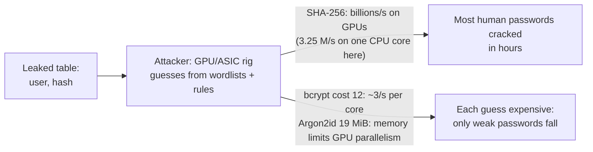
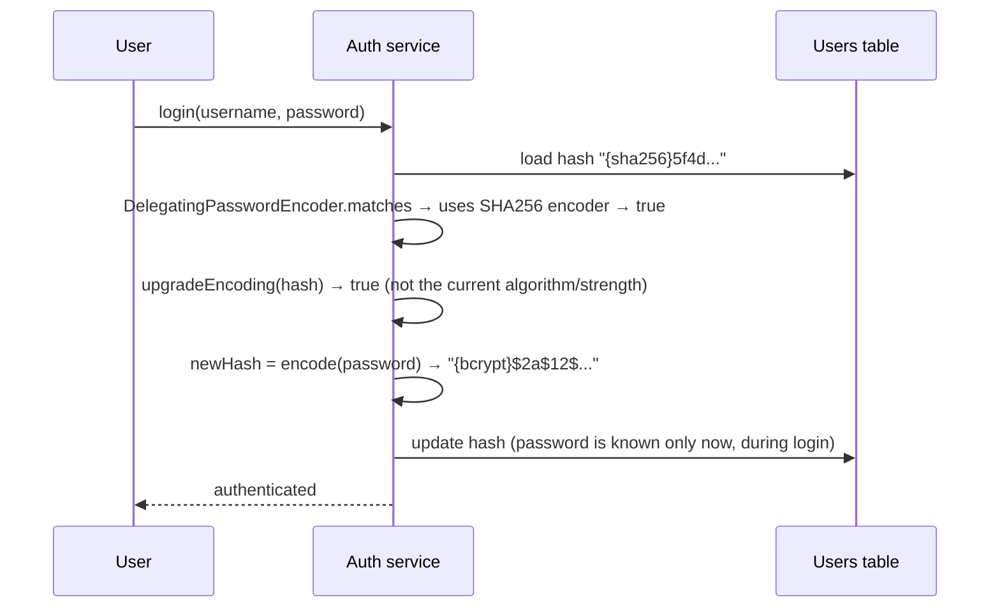
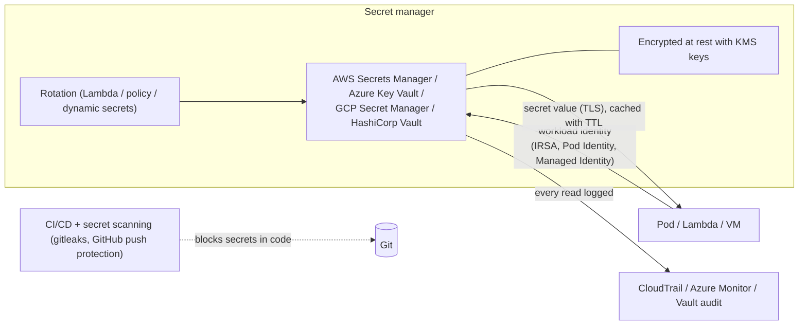

# Password Hashing & Secrets Management

!!! abstract "Key takeaways"
    - **Passwords are hashed, never encrypted**, with a **slow, salted, ideally memory-hard** function: **Argon2id** (first choice), **scrypt**, **bcrypt**, or **PBKDF2** (FIPS environments). Measured on one core: **SHA-256 ran 3.25 million hashes/s** (what an attacker would love), while bcrypt cost 12 took **300 ms**, Argon2id (19 MiB, t=2) **~40–65 ms**, PBKDF2-SHA256 at 310k iterations **294 ms**.
    - Each hash has a unique **salt** (the same password hashed twice gave two different bcrypt strings), parameters are stored in the hash string (`$2a$12$…`), and comparison is constant-time inside the library. bcrypt only uses the first **72 bytes** (Spring Security now rejects longer input: "password cannot be more than 72 bytes").
    - Upgrade legacy hashes **on login** with Spring Security's `DelegatingPasswordEncoder`: `{bcrypt}…` by default, a legacy `{sha256}` hash still matched and reported **`upgradeEncoding = true`**, so you re-hash it with the current algorithm right after a successful login.
    - **Application secrets** (DB passwords, API keys, tokens) belong in a **secret manager** (AWS Secrets Manager, Azure Key Vault, GCP Secret Manager, HashiCorp Vault), fetched at runtime with **workload identity**, never in code, images, Git, or logs. Prefer **short-lived dynamic credentials**, and automate **rotation** with overlap ([rotation strategies](06-key-rotation-strategies-without-downtime.md)).
    - Defence in depth: secret scanning in CI and repos, least-privilege access per secret, audit, caching with TTLs, and a playbook for leaks (rotate first, then investigate).

## Why it matters

Credential databases leak regularly. Whether a leak becomes a mass account takeover depends almost entirely on how passwords were hashed. Hard-coded secrets in Git and container images are among the most common causes of cloud breaches. Interviewers ask "how do you store passwords?" (and expect Argon2/bcrypt with reasons, not SHA-256), how to migrate old hashes, and how services get database credentials securely. This page is ★: I built user management with JWT authentication at Johnson Controls and used Secrets Manager, KMS and IAM at Deloitte.

Measurements were taken with Java 21 and **Spring Security Crypto 6.5.5** (with Bouncy Castle 1.80 for Argon2) on one core while writing this page. Secret-manager behaviour is from provider documentation.

## Core concepts

### Why fast hashes fail for passwords


*Notice that the attacker's cost per guess is exactly your cost per login. Password hashing deliberately makes each verification slow and memory-hungry, which is tolerable once per login and ruinous for billions of guesses.*

Requirements for password storage:

1. **One-way:** a hash, not encryption (an encryption key could decrypt them all).
2. **Unique random salt** per password, so identical passwords produce different hashes and precomputed rainbow tables don't work.
3. **Work factor:** tunable cost so each guess takes tens to hundreds of milliseconds, increased over time.
4. **Memory hardness** (Argon2, scrypt): forces each guess to use lots of RAM, neutralising GPU/ASIC parallelism.
5. **Constant-time verification** and safe encoding of parameters in the stored string.

### The algorithms

| Algorithm | Type | Recommended parameters (OWASP) | Measured (one core) | Notes |
|---|---|---|---|---|
| **Argon2id** | Memory-hard (PHC winner 2015) | m = 19 MiB, t = 2, p = 1 (or 46 MiB, t = 1) | ~38–66 ms (19 MiB / 16 MiB settings) | First choice. Memory is the main cost |
| **scrypt** | Memory-hard | N = 2¹⁷, r = 8, p = 1 | — | Good alternative |
| **bcrypt** | CPU-hard (Blowfish) | Cost ≥ 10 (12 common) | cost 10: **77 ms**, 12: **300 ms**, 14: **1,196 ms** | 72-byte input limit. Very widely supported |
| **PBKDF2-HMAC-SHA256** | CPU-hard, FIPS-approved | ≥ 600,000 iterations (OWASP 2023) | 310k iterations: **294 ms** | Use when FIPS compliance is required. GPU-friendly |
| SHA-256 / MD5 (even salted) | Fast hash | **Never** for passwords | **3.25 M hashes/s** | |

Each step of bcrypt cost doubles the time (77 → 300 → 1,196 ms for 10 → 12 → 14). Tune to your login rate and hardware: an endpoint doing 300 ms of CPU per login is also a **denial-of-service** vector, so pair it with rate limiting.

### Salt, pepper and stored format

```text
$2a$12$AaUGbWANLAOT7t5.mTKcme tnQJDGCK3omhIg3497i/hX/wJzm7RJS
 │   │  └── 22-char salt ──────┘└── 31-char hash ─────────────┘
 │   └ cost (2^12 rounds)
 └ algorithm version
```

- **Salt:** random per password, stored with the hash (measured: the same password produced two different hashes). Not secret.
- **Pepper:** an optional secret added to every password (or an HMAC applied before hashing), stored **outside** the database (HSM/KMS or secret manager), so a database-only leak can't be cracked at all. Plan pepper rotation (re-hash on login, or HMAC-then-hash with versioned peppers).
- **Parameters in the string** let you raise costs over time and verify old hashes with their original parameters.

### Upgrading legacy hashes


*Notice that you can only re-hash when you have the plaintext, which is during a successful login. For accounts that never log in, wrap the old hash (bcrypt(sha256_hash)) or force a reset.*

Measured with `PasswordEncoderFactories.createDelegatingPasswordEncoder()`: new hashes are `{bcrypt}$2a$...`, a legacy `{sha256}` hash still matched, `upgradeEncoding()` returned **true** for it and **false** for the bcrypt hash. Spring Security's `DaoAuthenticationProvider` calls `UserDetailsPasswordService.updatePassword` automatically when this happens.

### Secrets management


*Notice that the application authenticates with its platform identity, so there's no "secret zero" stored with the app. The secret manager encrypts with KMS, rotates, and logs every read.*

| Approach | How | When |
|---|---|---|
| **Static secret in a manager** | Fetch at startup/refresh, cache with TTL | Third-party API keys |
| **Managed rotation** | Secrets Manager rotation Lambda (single or alternating users), Key Vault rotation policy | Database and service credentials |
| **Dynamic secrets** | Vault database engine / IAM database auth generates per-instance credentials with a lease (minutes–hours) | Best for DBs: nothing long-lived to leak |
| **Workload identity instead of secrets** | IAM roles (IRSA/Pod Identity), Azure Managed Identity, GCP Workload Identity, IAM DB auth | Cloud APIs: no secret at all |
| **Kubernetes delivery** | Secrets Store CSI driver / External Secrets Operator ([ConfigMaps & Secrets](../docker-kubernetes/05-configmaps-secrets-and-volumes.md)) | Pods |

## In practice: code & configuration

### Password hashing in Spring Security

```java
@Bean
PasswordEncoder passwordEncoder() {
    // {id}-prefixed hashes; default for new hashes is bcrypt. Switch the default to Argon2id:
    String idForEncode = "argon2@SpringSecurity_v5_8";
    Map<String, PasswordEncoder> encoders = new HashMap<>();
    encoders.put(idForEncode, Argon2PasswordEncoder.defaultsForSpringSecurity_v5_8());
    encoders.put("bcrypt", new BCryptPasswordEncoder(12));
    encoders.put("pbkdf2@SpringSecurity_v5_8", Pbkdf2PasswordEncoder.defaultsForSpringSecurity_v5_8());
    return new DelegatingPasswordEncoder(idForEncode, encoders);   // verifies all, re-hashes old ones on login
}

@Service
class JdbcUserPasswordService implements UserDetailsPasswordService {
    @Override
    public UserDetails updatePassword(UserDetails user, String newEncodedPassword) {
        users.updateHash(user.getUsername(), newEncodedPassword);   // called automatically after a successful login
        return User.withUserDetails(user).password(newEncodedPassword).build();
    }
}
```

=== "❌ Common mistake"

    ```java
    String hash = DigestUtils.sha256Hex(password);                    // fast, unsalted: cracked in minutes
    String hash2 = DigestUtils.sha256Hex(SALT_CONSTANT + password);   // one global salt: still fast
    String enc = aes.encrypt(password);                               // reversible: one key leak = all passwords
    if (stored.equals(hash)) { ... }                                  // timing leak
    log.info("login attempt {} / {}", username, password);            // in the logs forever
    ```

=== "✅ Better"

    ```java
    String stored = passwordEncoder.encode(rawPassword);              // Argon2id/bcrypt, random salt, params embedded
    boolean ok = passwordEncoder.matches(rawPassword, stored);       // constant-time inside the library
    // + rate limiting / lockout with backoff, MFA, breached-password check (k-anonymity HIBP API),
    //   NIST SP 800-63B: length ≥ 8 (prefer 15), no composition rules, no forced periodic changes
    ```

### Fetching secrets in Spring Boot

```yaml
# Spring Cloud AWS: import secrets as properties at startup (IRSA/Pod Identity provides credentials)
spring:
  config:
    import: "aws-secretsmanager:prod/claims-api/db;prod/claims-api/partner"
  datasource:
    url: jdbc:postgresql://claims.cluster-xyz.eu-west-1.rds.amazonaws.com/claims
    username: ${username}      # keys from the secret JSON
    password: ${password}
# Azure: spring.cloud.azure.keyvault.secret.property-sources[0].endpoint=https://kv-claims.vault.azure.net/
```

```java
// Or fetch programmatically with caching (AWS Secrets Manager caching client)
SecretCache cache = new SecretCache(SecretsManagerClient.create());   // default TTL 1 h, refreshes in background
String json = cache.getSecretString("prod/claims-api/partner");
```

For database credentials, prefer **IAM database authentication** (RDS, Aurora, Azure AD auth for Azure SQL/PostgreSQL) or **Vault dynamic credentials**: the app gets short-lived credentials from its identity and nothing static exists to leak.

## Real-world usage

- **Password storage:** Argon2id/bcrypt in modern frameworks (Spring Security, Django defaults to PBKDF2 with Argon2 optional, ASP.NET Identity PBKDF2). Many organisations outsource it to an IdP (PingFederate/PingOne, Entra ID, Okta, Cognito), reducing their own password exposure, plus MFA and passkeys (WebAuthn) to remove passwords entirely.
- **Breaches as lessons:** LinkedIn (2012, unsalted SHA-1, mostly cracked), Adobe (2013, *encrypted* passwords with ECB, hints in clear), versus breaches of bcrypt-protected databases where only weak passwords fell.
- **Secrets:** AWS Secrets Manager with rotation for RDS, Azure Key Vault + Managed Identity, HashiCorp Vault dynamic secrets for databases and cloud IAM, GitHub/GitLab secret scanning with push protection.
- **Kubernetes:** External Secrets Operator or Secrets Store CSI driver syncing from Secrets Manager or Key Vault, with workload identity.

## Trade-offs & production gotchas

!!! warning "Password and secret pitfalls"
    - **Fast hashes (MD5/SHA-x), unsalted or globally salted hashes, or reversible encryption** for passwords.
    - **Work factor too high without rate limiting:** login becomes a CPU DoS. Too low: cheap cracking. Benchmark (77 ms vs 1.2 s across bcrypt costs here) and revisit yearly.
    - **bcrypt's 72-byte limit:** long passphrases or pre-concatenated data are truncated (Spring now rejects them). Pre-hash with HMAC if you must support longer inputs, or use Argon2id.
    - **Memory-hard parameters vs container limits:** Argon2 at 64 MiB × concurrent logins can exhaust pod memory. Size parameters with concurrency.
    - **Secrets in Git, images, env dumps, CI logs, Terraform state, error messages:** scan and block. Treat any exposure as a leak.
    - **Long-lived static credentials** without rotation, shared across services.
    - **Secret manager as a hard dependency on every request:** cache with TTLs and handle refresh.
    - **Over-broad secret access:** one role reading `secretsmanager:GetSecretValue` on `*`. Scope by ARN/path and use resource policies.

- **Argon2id vs bcrypt vs PBKDF2:** Argon2id is strongest against GPU attacks. bcrypt is ubiquitous and fine at cost ≥ 12. PBKDF2 is required in FIPS 140 contexts but needs very high iteration counts.
- **Own password storage vs IdP:** an IdP centralises security (MFA, breach detection, passkeys) but adds dependency and integration work.

## How this connects to my experience

- **Resume bullets:** **Johnson Controls (Metasys):** "Built user management microservices and owned JWT-based authentication and SSO implementation end-to-end", "Implemented Spring Security authorization controls and API security mechanisms." **Deloitte:** "implemented security controls using IAM, KMS, and **Secrets Manager**." **OptumRx:** "secure enterprise APIs using OAuth2, PingFederate, and Active Directory integration." **Coriolis:** key management and rotation.
- **How to talk about it:** in the Johnson Controls user-management service, passwords would be stored with a Spring Security `PasswordEncoder` (bcrypt or similar), with SSO and JWTs for sessions. At Deloitte, service credentials lived in Secrets Manager, encrypted with KMS, accessed through IAM roles. At OptumRx, authentication was delegated to PingFederate/AD, so the services never stored passwords at all. *[confirm: the actual encoder and cost factor at Johnson Controls, whether legacy hashes were migrated, how secrets reached services at Deloitte (Spring Cloud AWS, SDK, env), whether rotation was enabled]*
- **Talking points:**
    - "Passwords: Argon2id or bcrypt cost 12 via DelegatingPasswordEncoder, so algorithms can be upgraded transparently on login."
    - "Better still, delegate authentication to an IdP with MFA. The fewest password stores is the most secure design."
    - "Secrets come from a manager via workload identity, cached with TTLs, rotated with overlap, and never appear in Git, images or logs."
- **Likely follow-up chain:** "How do you store passwords?" → "Why not SHA-256 with a salt?" → "bcrypt vs Argon2?" → "How do you migrate old hashes?" → "What's a pepper?" → "How do services get DB credentials?" → "How do you rotate them?" → "A secret was pushed to GitHub, now what?"

## Interview questions

### Fundamentals

??? question "Q1. How should passwords be stored?"
    **Answer:** As the output of a slow, salted, adaptive password-hashing function: Argon2id (preferred), scrypt, bcrypt (cost ≥ 12) or PBKDF2-HMAC-SHA256 with a high iteration count for FIPS. Each hash has a unique random salt and embeds its parameters. Verification uses the library's constant-time match. Never plaintext, never reversible encryption, never fast hashes. Measured: SHA-256 manages 3.25 million hashes per second on one core, while bcrypt cost 12 takes 300 ms per hash, roughly a million times more expensive per guess.

    **Interviewer listens for:** a named slow algorithm, salt, work factor, and why fast hashes fail.

    **Common wrong answer:** "Hash with SHA-256 and a salt."

??? question "Q2. What's the purpose of a salt? Is it secret?"
    **Answer:** A unique random value per password, combined before hashing, so identical passwords yield different hashes (measured: two different bcrypt strings for the same password), precomputed rainbow tables are useless, and attackers must crack each hash separately. It isn't secret: it's stored with the hash (in bcrypt and Argon2 strings). A secret value stored elsewhere is a pepper.

    **Interviewer listens for:** uniqueness, defeating precomputation, stored with hash, distinction from pepper.

    **Common wrong answer:** "The salt must be kept secret like a key."

??? question "Q3. Why not encrypt passwords instead of hashing them?"
    **Answer:** Encryption is reversible: anyone with the key (an attacker who gets the key along with the database, or an insider) recovers every password, and users reuse passwords across sites. Systems only need to *verify* a password, which hashing supports. Adobe's 2013 breach showed the damage: encrypted (ECB) passwords plus hints. The only reason to keep reversible credentials is for credentials *you* use to call other systems, and those belong in a secret manager.

    **Interviewer listens for:** reversibility risk, verification-only need, the distinction from app secrets.

    **Common wrong answer:** "Encryption is stronger than hashing."

??? question "Q4. Where should application secrets like database passwords live?"
    **Answer:** In a secret manager (AWS Secrets Manager, Azure Key Vault, GCP Secret Manager, Vault): encrypted with KMS, access controlled per secret, audited and rotatable. Applications fetch them at runtime using workload identity (IAM roles, managed identity), cache with a TTL, and never store them in code, images, Git, plain environment files or logs. Better still, avoid static secrets with IAM database authentication or dynamic credentials.

    **Interviewer listens for:** secret manager, workload identity, runtime fetch, avoidance of static secrets.

    **Common wrong answer:** "In application.properties, excluded from Git."

### Intermediate

??? question "Q5. bcrypt vs Argon2id vs PBKDF2: how do you choose?"
    **Answer:** Argon2id (PHC winner) is memory-hard, which blunts GPU/ASIC cracking; it's the OWASP first choice (e.g. 19 MiB, t=2, p=1; measured ~40–65 ms). bcrypt is CPU-hard, ubiquitous and battle-tested, but has a 72-byte input limit and is less GPU-resistant; cost 12 took 300 ms here. PBKDF2-HMAC-SHA256 is FIPS-approved, so it's mandatory in some regulated environments, but GPU-friendly and needs ≥ 600k iterations (310k took 294 ms). Choose Argon2id unless compliance mandates PBKDF2, or ecosystem support favours bcrypt.

    **Interviewer listens for:** memory-hardness, FIPS, 72-byte limit, parameters.

    **Common wrong answer:** "They're equivalent."

??? question "Q6. How do you migrate millions of users from SHA-1 hashes to Argon2id?"
    **Answer:** Store algorithm identifiers with hashes (Spring's `{id}` prefixes). On each successful login, verify with the old algorithm and immediately re-hash the known plaintext with Argon2id (`DelegatingPasswordEncoder` + `UserDetailsPasswordService` does this: measured, a legacy `{sha256}` hash matched and reported `upgradeEncoding = true`). For dormant accounts, don't wait: wrap the old hash now (Argon2id(SHA-1 hash)), mark it as wrapped, and verify by applying both. Eventually force resets for remaining legacy accounts. Never keep fast hashes lying around.

    **Interviewer listens for:** upgrade-on-login, wrapping for dormant accounts, algorithm IDs.

    **Common wrong answer:** "Reset everyone's password."

??? question "Q7. What is a pepper, and how do you manage it?"
    **Answer:** A secret value applied to all passwords (concatenated or, better, HMAC(pepper, password) before hashing) and stored outside the database: in an HSM, KMS or secret manager. A database-only leak then can't be cracked at all without the pepper. Managing it requires versioning (store the pepper version with each hash), rotation via re-hash on login, and high availability of wherever it's stored, because losing it means nobody can log in. It complements, not replaces, proper hashing.

    **Interviewer listens for:** separate storage, HMAC application, versioning, availability risk.

    **Common wrong answer:** "A pepper is a second salt stored in the same column."

??? question "Q8. How does bcrypt's 72-byte limit matter?"
    **Answer:** bcrypt only processes the first 72 bytes of input; older libraries silently truncated, so two long passphrases differing after byte 72 had identical hashes, and composite inputs (e.g. user ID + password) could lose entropy. Spring Security now rejects longer input (measured: "password cannot be more than 72 bytes"). Options: limit password length for bcrypt (72 bytes is plenty for most users but UTF-8 characters can be multi-byte), pre-hash with HMAC-SHA256 and base64 (to avoid NUL bytes), or use Argon2id.

    **Interviewer listens for:** truncation risk, pre-hashing correctly, Argon2 alternative.

    **Common wrong answer:** "bcrypt has no input limit."

??? question "Q9. How do you rotate database credentials automatically?"
    **Answer:** With a secret manager's rotation: AWS Secrets Manager rotation Lambdas (single-user or alternating-users), Azure Key Vault rotation policies with Event Grid-triggered functions, or Vault's database secrets engine issuing dynamic credentials with leases. Applications must pick up new values (cache TTL refresh, connection pool recycling) and the scheme must overlap old and new credentials during the switch. Monitor rotation failures. Ideally move to IAM database authentication so credentials are short-lived tokens.

    **Interviewer listens for:** managed rotation, overlap, app refresh, dynamic credentials.

    **Common wrong answer:** "A quarterly manual password change."

### Senior

??? question "Q10. Design credential storage for an authentication service with 5 million users."
    **Answer:** Argon2id with parameters benchmarked to ~50–100 ms on production hardware and sized for login concurrency (memory per hash × concurrent logins), encoded with algorithm IDs. An HMAC pepper held in KMS/HSM, versioned. Upgrade-on-login for parameter increases. Rate limiting and progressive delays per account and IP, bot protection, breached-password checks (HIBP k-anonymity), NIST 800-63B password rules (length, no forced rotation), MFA and passkey support. Separate the auth DB, encrypt at rest, restrict access, and audit. Consider delegating to an IdP entirely. Load-test login to make sure hashing cost doesn't become a DoS vector.

    **Interviewer listens for:** parameter tuning and capacity, pepper, upgrade path, abuse protection, MFA/passkeys.

    **Common wrong answer:** "bcrypt and done."

??? question "Q11. A developer pushed AWS access keys to a public GitHub repository. Walk through the response."
    **Answer:** Revoke/deactivate the keys immediately (bots scan GitHub within minutes) and issue replacements only if still needed, ideally replacing them with role-based access. Check CloudTrail for activity by that key ID since the push (new IAM users, EC2 instances for mining, data access) and remediate. Remove the secret from Git history (and assume it's still compromised, as forks and caches exist). Rotate any other secrets in the same commit. Review how it happened: add pre-commit and CI secret scanning, GitHub push protection, and remove long-lived keys from developer workflows (SSO, short-lived credentials).

    **Interviewer listens for:** revoke first, investigate with logs, history cleanup isn't enough, prevention.

    **Common wrong answer:** "Delete the commit and force-push."

??? question "Q12. How do you eliminate 'secret zero', the credential needed to fetch other secrets?"
    **Answer:** Use platform-attested workload identity: AWS IAM roles via instance profiles, IRSA or EKS Pod Identity; Azure Managed Identity / Workload Identity federation; GCP Workload Identity; SPIFFE/SPIRE identities in meshes; Vault's Kubernetes/AWS/Azure auth methods that verify the platform's signed identity tokens. The platform vouches for the workload, so no bootstrap secret needs to be stored with it. Combine with short-lived credentials and least-privilege policies per workload.

    **Interviewer listens for:** platform identity, federation/attestation, short-lived tokens.

    **Common wrong answer:** "Put the Vault token in an environment variable."

### Scenario-based

??? question "Q13. After raising bcrypt cost from 10 to 14, login latency and CPU spike and some pods time out. What happened?"
    **Answer:** Each step doubles the work: cost 14 is ~16× cost 10 (measured 77 ms → 1,196 ms per hash on one core). Under normal login concurrency that saturates CPU, and with HPA lag or attacker traffic it becomes a DoS. Re-hashing on login (upgradeEncoding) adds a second expensive hash for every user. Fix: pick a cost that fits the latency budget (e.g. 12 ≈ 300 ms, or Argon2id ~50 ms), roll out gradually, rate-limit login, scale the auth service for the new CPU profile, and consider offloading authentication to an IdP.

    **Interviewer listens for:** exponential cost, capacity impact, upgrade double-hash, balanced tuning.

    **Common wrong answer:** "Higher cost is always better."

??? question "Q14. A security review finds database passwords in Kubernetes YAML in Git and as environment variables in pods. Remediation plan?"
    **Answer:** Rotate the exposed passwords immediately. Move the source of truth to Secrets Manager/Key Vault (or dynamic credentials via Vault or IAM DB auth). Deliver via Secrets Store CSI driver or External Secrets Operator with workload identity, mounted as files rather than env vars (Spring `configtree`). Remove secrets from Git (history rewrite where policy requires; treat as leaked anyway), add secret scanning in CI, restrict Kubernetes RBAC on Secrets, enable KMS encryption at rest, and automate rotation with overlap. Track completion per service.

    **Interviewer listens for:** rotate first, external store + identity, files over env, scanning, RBAC, rotation.

    **Common wrong answer:** "Base64-encode them in a Kubernetes Secret."

## Cheat sheet

| Topic | Remember |
|---|---|
| Passwords | Hash, don't encrypt; Argon2id > scrypt > bcrypt(≥12) > PBKDF2(≥600k, FIPS) |
| Measured | SHA-256 3.25 M/s; bcrypt 10/12/14 = 77/300/1,196 ms; Argon2id ~40–65 ms; PBKDF2 310k = 294 ms |
| Salt | Unique, random, stored with hash; pepper = secret, stored elsewhere |
| bcrypt | 72-byte limit (Spring rejects longer) |
| Upgrade | DelegatingPasswordEncoder `{id}`; `upgradeEncoding` → re-hash on login; wrap dormant hashes |
| Policy | NIST 800-63B: length, breached-password check, MFA, no forced rotation; rate limiting |
| Secrets | Secret manager + workload identity; cache with TTL; files not env |
| Best | No static secrets: IAM DB auth, dynamic credentials |
| Rotation | Managed rotation with overlap; app refresh |
| Leak | Revoke/rotate first, audit logs, clean history, add scanning |

## Sources
1. [OWASP Password Storage Cheat Sheet](https://cheatsheetseries.owasp.org/cheatsheets/Password_Storage_Cheat_Sheet.html) and [Secrets Management Cheat Sheet](https://cheatsheetseries.owasp.org/cheatsheets/Secrets_Management_Cheat_Sheet.html).
2. [RFC 9106: Argon2](https://www.rfc-editor.org/rfc/rfc9106) and [NIST SP 800-132: PBKDF](https://csrc.nist.gov/pubs/sp/800/132/final).
3. [NIST SP 800-63B: Digital identity guidelines (authentication)](https://pages.nist.gov/800-63-4/sp800-63b.html).
4. [Spring Security reference: Password storage (DelegatingPasswordEncoder)](https://docs.spring.io/spring-security/reference/features/authentication/password-storage.html).
5. [AWS Secrets Manager: Rotation](https://docs.aws.amazon.com/secretsmanager/latest/userguide/rotating-secrets.html), [Spring Cloud AWS Secrets Manager integration](https://docs.awspring.io/spring-cloud-aws/docs/3.2.0/reference/html/index.html#secrets-manager-integration) and [RDS IAM database authentication](https://docs.aws.amazon.com/AmazonRDS/latest/UserGuide/UsingWithRDS.IAMDBAuth.html).
6. [Azure Key Vault secrets and rotation](https://learn.microsoft.com/en-us/azure/key-vault/secrets/tutorial-rotation) and [HashiCorp Vault database secrets engine](https://developer.hashicorp.com/vault/docs/secrets/databases).
7. [GitHub secret scanning and push protection](https://docs.github.com/en/code-security/secret-scanning).
8. Demonstrations on this page: Java 21 with Spring Security Crypto 6.5.5 and Bouncy Castle 1.80, run while writing this page (hash throughput and costs, salts, 72-byte limit, DelegatingPasswordEncoder upgrade detection).
