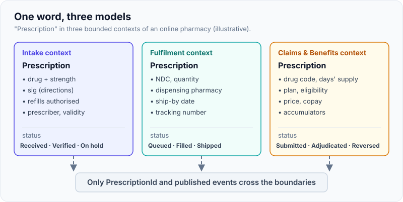
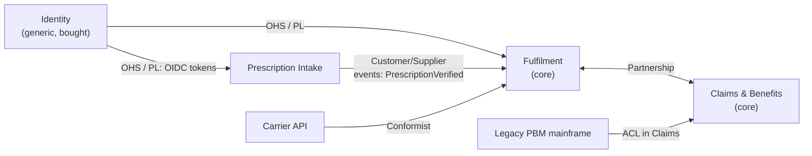
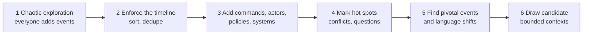

# Strategic DDD: Bounded Contexts, Ubiquitous Language, Context Mapping

!!! abstract "Key takeaways"
    - **Strategic DDD decides where models begin and end.** Tactical patterns (entities, aggregates) only pay off inside a well-drawn boundary.
    - A **bounded context** is the boundary within which one model and one **ubiquitous language** are consistent. The same word ("Prescription", "Customer") may mean different things in different contexts, and that's fine.
    - Classify **subdomains** as **core** (your competitive edge: build it, put the best people on it), **supporting** (needed, specific, simpler) or **generic** (buy or reuse: identity, email, payments).
    - A **context map** records how contexts relate: Partnership, Shared Kernel, Customer/Supplier, Conformist, Anticorruption Layer, Open Host Service, Published Language, Separate Ways, Big Ball of Mud. The relationship is as much about **teams and power** as about code.
    - Find boundaries with domain experts, not in the database schema: **event storming** clusters domain events and commands; where the language changes, the context changes.

## Why it matters

Most large systems fail at the model level before they fail at the code level. One team builds a `Customer` class with 80 fields because Sales, Billing, Support and Shipping all "need a customer". Every change needs four teams to agree, every bug fix risks another department's report, and nobody can say what `customer.status` means.

Eric Evans' answer in *Domain-Driven Design* (2004) was that **total unification of a large domain model is neither feasible nor cost-effective** (Fowler's summary in his Bounded Context bliki). Instead you:

1. Split the problem space into **subdomains** and decide where to invest.
2. Split the solution into **bounded contexts**, each with one consistent model and language.
3. Make the relationships between contexts explicit in a **context map**, including who adapts to whom.

Interviewers ask about strategic DDD because it's the honest answer to "how did you decide what goes in which service?" A candidate who says "we split by entity" or "by database table" signals the classic distributed-monolith mistake; one who talks about language, ownership and context relationships signals design maturity. The service-boundary consequences are covered in [Using DDD to define microservice boundaries](04-using-ddd-to-define-microservice-boundaries.md).

## Core concepts

### Domain, subdomains and where to invest

The **domain** is the business area the software serves. A **subdomain** is a coherent part of it. Evans' later *DDD Reference* (2015) and Vaughn Vernon's *Implementing Domain-Driven Design* (2013) classify subdomains so you spend effort where it differentiates:

| Subdomain type | What it is | Strategy | Example (online pharmacy, illustrative) |
|---|---|---|---|
| **Core** | Why customers choose you; complex, changes often | Build in-house, richest model, best engineers, deep DDD | Benefit pricing and fulfilment routing |
| **Supporting** | Specific to your business but not differentiating | Build simply, maybe CRUD, maybe outsource | Prescriber directory, refill reminders |
| **Generic** | Solved problem, same for everyone | Buy or use open source | Identity (PingFederate, Keycloak), email, payments |

Subdomains are **problem space** (what the business does). Bounded contexts are **solution space** (how you model it). Ideally they line up one to one; in legacy systems one context often covers several subdomains, which is a signal to refactor.

!!! tip "Interview phrasing"
    "Core domain gets the rich model and our best people; generic subdomains we buy; supporting ones we keep simple." That one sentence shows you know DDD is an *investment* strategy, not a coding style to apply everywhere.

### Ubiquitous language

The **ubiquitous language** is the vocabulary that domain experts and developers share *inside one context*, and it's used everywhere: in conversation, user stories, class names, method names, events, API fields and tests. If the pharmacist says "the prescription is *on hold* pending prior authorisation", the code has `Prescription.placeOnHold(PriorAuthRequired reason)`, not `rx.setStatus(7)`.

Why it matters:

- **Translation is where bugs hide.** Every time someone maps "business words" to "code words" in their head, meaning leaks.
- **Code becomes reviewable by experts.** A test named `refillIsRejectedWhenNoRefillsRemain` can be read by a pharmacist.
- **Language drift is a design signal.** When experts start using a word differently, the model needs to change.

The language is **bounded**: it's only consistent within its context. Trying to make one company-wide glossary is how you get the 80-field `Customer`.

### Bounded context

A **bounded context** is an explicit boundary (organisational, linguistic and technical) inside which a particular model is defined and applies. Inside it, every term has exactly one meaning. Outside it, the same word may mean something else.

Fowler's bliki uses "Customer" and "Product" as the usual polysemes, and an electricity-utility "meter" that meant three different things to three departments. In a pharmacy:

| Term | Prescribing / Intake | Fulfilment | Claims & Benefits |
|---|---|---|---|
| **Prescription** | Prescriber's order: drug, sig (directions), refills, validity | A job to dispense: NDC, quantity, pharmacy, ship-by date | A claim line: drug code, days' supply, plan, price |
| **Member / Patient** | Clinical identity, allergies | Delivery address, signature required | Plan, eligibility, accumulators |
| **Status** | Received, verified, on hold | Queued, filled, shipped | Submitted, adjudicated, reversed |

Three models, each simple and correct in its context, beat one model that is wrong everywhere.

{ loading=lazy }
*Only the identifier crosses the boundary; each context keeps its own fields, rules and lifecycle.*

A bounded context usually maps to **one team** and **one codebase/deployable** (or one module of a modular monolith), and owns its own data. A team can own several contexts; one context should not be split across teams, because then nobody owns the language.

### Context maps: how contexts relate

A **context map** is a diagram (and a document) of the bounded contexts and the relationship between each pair. The relationship names come from Evans' DDD Reference; they describe **who depends on whom** (upstream and downstream) and **who adapts**.


*Notice that arrows point from upstream to downstream, and each edge names a relationship: the legacy mainframe is wrapped by an anti-corruption layer, while Fulfilment simply conforms to the carrier's API because it has no leverage there.*

| Pattern | Meaning | Use when | Risk |
|---|---|---|---|
| **Partnership** | Two teams succeed or fail together; plan and release in coordination | Two core contexts that evolve together | Coupled roadmaps; doesn't scale beyond a few teams |
| **Shared Kernel** | A small, explicitly shared subset of the model (a library or schema) changed only by agreement | A few stable types both need exactly the same way | It grows; becomes a hidden shared database |
| **Customer/Supplier** | Upstream (supplier) plans to meet downstream (customer) needs; downstream has a voice | Same organisation, negotiated priorities | Supplier ignores customer; becomes Conformist by accident |
| **Conformist** | Downstream adopts the upstream model as is | Upstream won't change and its model is acceptable | Upstream concepts leak into your core |
| **Anticorruption Layer (ACL)** | Downstream builds a translation layer to protect its model | Upstream model is legacy, messy or foreign to your language | Extra code to maintain; must be kept thin and tested |
| **Open Host Service (OHS)** | Upstream publishes a well-defined protocol/API for all consumers | Many consumers; avoid one-off integrations | Versioning discipline required |
| **Published Language (PL)** | A documented shared exchange format (e.g. HL7 FHIR, NCPDP, an Avro schema) | Pairs well with OHS; industry standards | Format evolution and compatibility |
| **Separate Ways** | No integration; each context solves it independently | Integration costs more than duplication | Duplicate effort, divergent data |
| **Big Ball of Mud** | A part with no clear model; draw a boundary around it and don't let it spread | Legacy you can't fix yet | Pretending it has a clean model |

Two things interviewers probe:

- **Upstream/downstream is about influence, not data direction.** Upstream's decisions affect downstream; data can flow either way.
- **These patterns describe team relationships.** Conformist is usually what you get when you can't influence the upstream team, and an ACL is what you build when you won't let their model into yours.

### Anti-corruption layer in more detail

The ACL is the pattern you'll actually code most often. It's a set of adapters and translators at the edge of your context that turn the upstream's model (field names, codes, quirks) into your ubiquitous language, so the core never imports upstream types. Microsoft's cloud design patterns catalogue describes it as a façade or adapter layer between subsystems that don't share semantics, often used during legacy migration. It fits naturally as a *driven adapter* in a [hexagonal architecture](03-hexagonal-ports-and-adapters-and-clean-architecture.md).

### Discovering boundaries: event storming

**Event storming** (Alberto Brandolini) is a workshop format: domain experts and engineers put **domain events** (orange stickies, past tense: `Prescription Verified`, `Claim Adjudicated`) on a long timeline, then add **commands**, **actors**, **policies** ("whenever X, then Y"), **external systems** and **hot spots** (questions, conflicts). It runs at three levels: *big picture* (whole business, find contexts), *process modelling* (one flow) and *software design* (aggregates).


*Notice that boundaries come last: they emerge where pivotal events hand off between departments and where the same word starts to mean something else.*

{ loading=lazy }
*Watch where the dashed lines fall: at the pivotal events where work passes from one group of people to another.*

Heuristics for where a boundary goes:

- **Language changes**: the same noun gets different attributes or a different lifecycle.
- **Pivotal events**: `Prescription Verified` ends intake's job and starts fulfilment's.
- **Different experts**: pharmacists vs claims analysts vs warehouse staff.
- **Different rates of change** or different consistency needs.

Other techniques: **domain storytelling** (Hofer and Schwentner) for narrative flows, and the DDD Crew's **Bounded Context Canvas** to document each context's purpose, language, inbound and outbound communication. **Context Mapper** provides a DSL (CML) to write context maps as text and generate diagrams.

### Mapping to modules and code

Strategic boundaries should be **visible in code**. In a Spring Boot monolith that means one top-level package per context (package-by-feature, not by layer) and a test that fails if contexts reach into each other's internals; [Spring Modulith](04-using-ddd-to-define-microservice-boundaries.md#modular-monolith-first-with-spring-modulith) does this out of the box.

## In practice: code & configuration

The most common strategic mistake in code is a single shared model used by every context.

=== "❌ Common mistake"
    ```java
    // shared-model.jar used by Intake, Fulfilment and Claims
    @Entity
    public class Prescription {
        @Id Long id;
        String drugName;         // Intake
        String sig;              // Intake
        int refillsRemaining;    // Intake
        String ndc;              // Fulfilment
        String pharmacyId;       // Fulfilment
        String trackingNumber;   // Fulfilment
        String planId;           // Claims
        BigDecimal copay;        // Claims
        int status;              // 1..14, meaning depends on who you ask
        // ...70 more fields; every team changes this class
    }
    ```

=== "✅ Correct approach"
    ```java
    // Each context owns its model; only identity and events cross the boundary.

    // --- intake context: com.acme.pharmacy.intake ---
    public record PrescriptionId(UUID value) {}

    public sealed interface IntakeStatus permits Received, Verified, OnHold {}
    public record Received() implements IntakeStatus {}
    public record Verified(Instant at, PharmacistId by) implements IntakeStatus {}
    public record OnHold(HoldReason reason) implements IntakeStatus {}

    // Published language: the event other contexts may depend on
    public record PrescriptionVerified(
            PrescriptionId prescriptionId, MemberId memberId,
            DrugCode drug, Quantity quantity, int daysSupply, Instant verifiedAt) {}

    // --- fulfilment context: com.acme.pharmacy.fulfilment ---
    // Its own model of "the thing to dispense"; built from the event, not the Intake entity
    public record DispenseOrder(DispenseOrderId id, PrescriptionId source,
                                Ndc ndc, Quantity quantity, PharmacyId pharmacy,
                                LocalDate shipBy) {}
    ```

An ACL around a legacy upstream keeps its vocabulary out of your model:

```java
// claims context: driven adapter that translates the legacy PBM response
@Component
class LegacyPbmEligibilityAdapter implements EligibilityChecker {   // port owned by Claims

    private final PbmSoapClient client;                             // upstream's generated types

    LegacyPbmEligibilityAdapter(PbmSoapClient client) { this.client = client; }

    @Override
    public Eligibility check(MemberId member, LocalDate on) {
        PbmEligRsp rsp = client.elig(member.value(), on.format(BASIC_ISO_DATE));
        // Translate codes into our language; unknown codes fail loudly, not silently
        return switch (rsp.getStatCd()) {
            case "A" -> new Eligibility.Active(PlanId.of(rsp.getGrpNbr()));
            case "T" -> new Eligibility.Terminated(parse(rsp.getTermDt()));
            case "P" -> new Eligibility.Pending();
            default  -> throw new UnknownUpstreamCode("PBM stat_cd", rsp.getStatCd());
        };
    }
}

// Our model, in our language (sealed so callers must handle every case)
public sealed interface Eligibility {
    record Active(PlanId plan) implements Eligibility {}
    record Terminated(LocalDate on) implements Eligibility {}
    record Pending() implements Eligibility {}
}
```

A context map can live next to the code as text, so it's reviewed like code. Context Mapper's CML:

```text
ContextMap PharmacyMap {
  contains Intake, Fulfilment, Claims, LegacyPBM
  Intake [U,OHS,PL] -> [D] Fulfilment
  Fulfilment [P] <-> [P] Claims
  LegacyPBM [U] -> [D,ACL] Claims
}
```

## Real-world usage

- **Microsoft's microservices guidance** (Azure Architecture Center) runs a full domain analysis for a drone-delivery example: business functions, then bounded contexts (Shipping, Drone Management, Accounts, Third-party transportation and others), then a context map with an ACL around a legacy system, before any service is designed.
- **Industry published languages** are context-map patterns in disguise: HL7 FHIR in healthcare, ISO 20022 in payments, NCPDP in pharmacy claims. When you integrate with them you are usually Conformist or you build an ACL.
- **Event storming** is widely used in large organisations as the kickoff for a modernisation or monolith split; the output is a set of candidate contexts and a list of hot spots, not a finished design.
- **Failure mode:** the "enterprise canonical data model". Many banks and insurers tried a single company-wide model for Customer or Policy; it becomes the shared kernel nobody can change. DDD's position is to standardise the **exchange format** (published language) and let each context model internally.
- In regulated domains (healthcare, banking) contexts often follow **data-sensitivity** lines too: the context that holds PHI or card data is kept small so the compliance scope is small. The [ontology page](../fde-data-integration/05-semantic-layer-and-ontology-modelling-the-customer-s-domain.md) covers the opposite need: a cross-context *read* model for analytics.

## Trade-offs & production gotchas

| Option | Pros | Cons | Use when |
|---|---|---|---|
| One shared model | Simple at first; no translation | Grows without bound; every change is cross-team | Small app, one team, simple domain |
| Shared kernel | No duplication for a few stable types | Needs joint governance; tends to grow | Two close teams, a handful of value types |
| Separate models + events | Autonomy; each model stays simple | Translation code; eventual consistency | Multiple teams or distinct languages |
| ACL | Protects your core from foreign models | Extra layer to test and maintain | Legacy or third-party upstream you can't change |
| Conformist | Zero translation cost | Upstream's model and changes leak in | Upstream model is good enough and it's not your core |

!!! warning "Gotchas"
    - **Boundaries from the database schema.** Tables reflect old decisions; boundaries come from language and behaviour.
    - **Shared "common" libraries with domain types.** A `common-model.jar` is an accidental shared kernel. Share technical utilities, not domain classes.
    - **Contexts too small.** One context per entity creates chatty integration. A context is usually a team-sized area of language, not a noun.
    - **No owner for the map.** Context maps rot. Keep it in the repo (CML or Mermaid) and update it in design reviews.
    - **ACL that leaks.** If upstream DTOs appear in your domain package, the ACL isn't doing its job. An architecture test can forbid the import.

!!! question "Interview angle"
    "What's the difference between a subdomain and a bounded context?" Subdomain: part of the business problem (problem space). Bounded context: boundary of a model in the software (solution space). Aim for one-to-one, but legacy rarely gives you that.

## How this connects to my experience

Not a ★ subtopic, and the resume doesn't name DDD explicitly, so position this as how I *reason* about boundaries.

- **Where it shows up:** OptumRx Meteor, "Owned the GraphQL Consumer Service end-to-end, acting as the integration layer between 5 upstream systems and multiple downstream consumers." Each upstream is effectively a separate context with its own language; an integration layer that translates them into one consumer-facing schema is an **anti-corruption layer plus open host service**. *[confirm: whether you translated upstream field names and codes into your own types, or passed them through (Conformist)]*
- **Talking points:**
    - "Five upstreams meant five vocabularies. I kept their DTOs at the edge and mapped them into our own GraphQL types, so a change in one upstream didn't ripple into consumers." *[confirm]*
    - "Identity was a generic subdomain: we integrated PingFederate and Active Directory over OAuth2 rather than building it." (resume: "Built secure enterprise APIs using OAuth2, PingFederate, and Active Directory integration")
    - The Metasys monolith migration needed boundary decisions; see the ★ page on [microservice boundaries](04-using-ddd-to-define-microservice-boundaries.md).
- **Likely follow-up chain:** "How did you handle upstream model differences?" → "What if an upstream changes a field?" → "Who owned the schema contract?" Answer with translation at the edge, contract tests or schema checks per upstream, and versioned consumer schema. *[confirm the actual mechanisms]*

## Interview questions

### Fundamentals

??? question "Q1. What is a bounded context?"
    **Answer:** An explicit boundary within which one domain model and its ubiquitous language are consistent. Inside it each term has one meaning; outside, the same word can mean something else. It's typically owned by one team and maps to one module or deployable with its own data.

    **Interviewer listens for:** "model and language consistent inside", explicit boundary, ownership.

    **Common wrong answer:** "It's a microservice" or "it's a package". Those are implementations; a context can be a module in a monolith or several services.

??? question "Q2. What is ubiquitous language and where does it appear?"
    **Answer:** The shared vocabulary of domain experts and developers within a context, used in conversation, stories, code, events, APIs and tests. It removes translation between business and code, and changes in the language signal model changes.

    **Interviewer listens for:** used in the code, scoped to one context.

    **Common wrong answer:** "A company-wide glossary."

??? question "Q3. Core vs supporting vs generic subdomains?"
    **Answer:** Core is what differentiates the business: invest heavily, build in-house, apply rich DDD. Supporting is specific but not differentiating: build simply. Generic is a solved problem: buy or use open source (identity, email, payments).

    **Interviewer listens for:** it's an investment decision.

    **Common wrong answer:** treating every part with full tactical DDD.

### Intermediate

??? question "Q4. Name the context-map relationships and when you'd use an anti-corruption layer."
    **Answer:** Partnership, Shared Kernel, Customer/Supplier, Conformist, Anticorruption Layer, Open Host Service, Published Language, Separate Ways, Big Ball of Mud. Use an ACL when the upstream model is legacy, third-party or semantically foreign and you don't want it to shape your core model; it translates at the edge.

    **Interviewer listens for:** upstream/downstream, and that ACL vs Conformist is a choice about protecting your model.

    **Common wrong answer:** "ACL is an API gateway."

??? question "Q5. What does upstream and downstream mean in a context map?"
    **Answer:** Upstream's decisions affect downstream, not the other way round. It's about influence and dependency; data may flow both ways. Downstream then chooses to conform, negotiate (customer/supplier) or translate (ACL).

    **Interviewer listens for:** influence, not data flow.

    **Common wrong answer:** "Upstream sends data to downstream."

??? question "Q6. How do you find bounded contexts in an existing business?"
    **Answer:** Work with domain experts: big-picture event storming, look for pivotal events, language shifts, different experts and different rates of change. Validate with team structure and data ownership. Don't start from the database schema or the org chart alone.

    **Interviewer listens for:** domain experts, language as the main signal.

    **Common wrong answer:** "One context per table/entity."

### Senior

??? question "Q7. Why not a single canonical enterprise data model?"
    **Answer:** It forces every department to agree on every term, grows without bound, couples all teams' release cycles and ends up wrong for everyone. DDD standardises exchange formats (published language, events) and lets each context model internally.

    **Interviewer listens for:** coupling cost, published language as the alternative.

    **Common wrong answer:** "Canonical models reduce duplication, so they're always better."

??? question "Q8. When is a shared kernel acceptable, and how do you keep it safe?"
    **Answer:** When two closely cooperating teams need a small, stable set of identical types (IDs, money, a few value objects). Keep it tiny, versioned, jointly owned, changed only by agreement, with tests on both sides. Prefer duplication if it starts to grow.

    **Interviewer listens for:** small, governed, explicit.

    **Common wrong answer:** a large `common-domain` library.

??? question "Q9. How do strategic DDD and Conway's law relate?"
    **Answer:** Systems mirror communication structures, so context boundaries and team boundaries should match. A context split across teams has no language owner; one team owning many unrelated contexts loses focus. Context-map relationships (partnership, customer/supplier, conformist) describe team dynamics as much as code.

    **Interviewer listens for:** team alignment, the "inverse Conway" idea of shaping teams to the desired architecture.

    **Common wrong answer:** treating context maps as purely technical.

### Scenario-based

??? question "Q10. Sales, Billing and Support all want new fields on the shared Customer table. What do you propose?"
    **Answer:** Recognise three contexts with different meanings of Customer. Give each its own model and storage, keep a shared `CustomerId`, and publish events (`CustomerRegistered`, `AddressChanged`) from the context that owns each fact. Migrate incrementally: new fields go into the owning context first, then move existing ones.

    **Interviewer listens for:** ownership per fact, shared identity, incremental move.

    **Common wrong answer:** "Add a JSON column for extensions."

??? question "Q11. You integrate with a legacy mainframe whose codes are cryptic and change without notice. How do you protect your system?"
    **Answer:** An ACL: a port in my domain language, an adapter that calls the mainframe and translates codes into sealed domain types, fails loudly on unknown codes, and is covered by contract tests from recorded responses. Nothing outside the adapter imports mainframe types; an architecture test enforces it.

    **Interviewer listens for:** translation, loud failure, tests, enforced isolation.

    **Common wrong answer:** passing the mainframe DTOs through "to save time".

## Cheat sheet

| Concept | Remember |
|---|---|
| Subdomain | Problem space: core (invest), supporting (simple), generic (buy) |
| Bounded context | Solution space: one model + one language; one team owns it |
| Ubiquitous language | Same words in talk, code, events, tests; scoped to a context |
| Context map | Contexts + relationships; upstream = influence |
| Protect your model | ACL; avoid Conformist for your core |
| Serve many consumers | Open Host Service + Published Language |
| Shared Kernel | Tiny, governed, jointly owned |
| Find boundaries | Event storming: pivotal events, language shifts, different experts |
| Anti-pattern | Canonical enterprise model, entity-per-service, `common-model.jar` |

## Sources
1. [Eric Evans, *Domain-Driven Design Reference* (2015, CC BY)](https://www.domainlanguage.com/ddd/reference/): definitions of bounded context, ubiquitous language, context map patterns, core domain. Book: *Domain-Driven Design: Tackling Complexity in the Heart of Software* (Addison-Wesley, 2004).
2. [Martin Fowler, Bounded Context (bliki, 2014)](https://martinfowler.com/bliki/BoundedContext.html): infeasibility of a unified model, polysemes such as Customer, Product and "meter".
3. [Martin Fowler, Ubiquitous Language (bliki)](https://martinfowler.com/bliki/UbiquitousLanguage.html): shared rigorous language between developers and users.
4. Vaughn Vernon, *Implementing Domain-Driven Design* (Addison-Wesley, 2013), ch. 2–3: subdomains, context maps; and *Domain-Driven Design Distilled* (2016).
5. [Microsoft Azure Architecture Center: Using domain analysis to model microservices](https://learn.microsoft.com/en-us/azure/architecture/microservices/model/domain-analysis): drone-delivery bounded contexts and context map.
6. [Microsoft: Anti-corruption Layer pattern](https://learn.microsoft.com/en-us/azure/architecture/patterns/anti-corruption-layer): ACL as façade/adapter between subsystems with different semantics.
7. [Alberto Brandolini, *Introducing EventStorming*](https://www.eventstorming.com/): workshop formats (big picture, process, software design), notation.
8. [DDD Crew: Context Mapping](https://github.com/ddd-crew/context-mapping) and [Bounded Context Canvas](https://github.com/ddd-crew/bounded-context-canvas): pattern cheat sheet and context documentation template.
9. [Context Mapper: CML language reference](https://contextmapper.org/docs/context-map/): textual context maps with relationship roles (U/D, ACL, OHS, PL, CF, P, SK).
