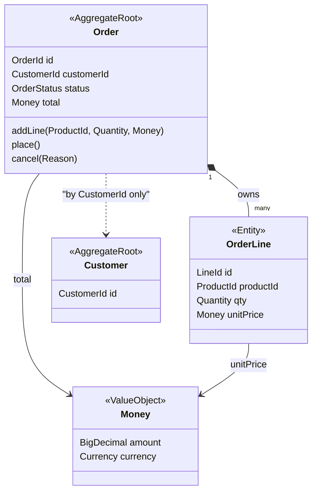
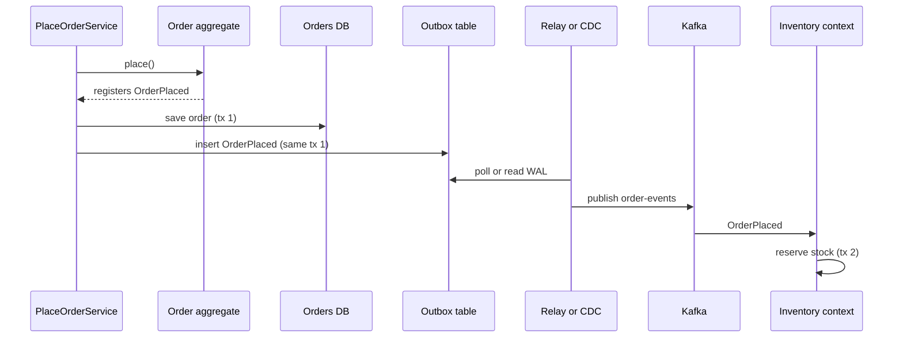

# Tactical DDD: Entities, Value Objects, Aggregates, Domain Events

!!! abstract "Key takeaways"
    - **Entity** = identity that persists through change (`Order #42` is the same order after you edit it). **Value object** = defined only by its attributes, immutable, replaceable (`Money(10.00, EUR)`). Default to value objects; Java 21 `record`s make them cheap.
    - An **aggregate** is a cluster of objects treated as **one unit for data changes**, with one **aggregate root** as the only entry point. It exists to protect **invariants**: rules that must be true after every transaction.
    - Vernon's rules: **protect true invariants inside the boundary**, **design small aggregates**, **reference other aggregates by identity only**, **use eventual consistency outside the boundary** (one aggregate per transaction).
    - **Repositories** load and save whole aggregates (one per aggregate root, not one per table). **Domain services** hold domain logic that doesn't belong to one entity.
    - **Domain events** are past-tense facts (`OrderPlaced`) raised by an aggregate; they drive side effects and other aggregates, and become integration events across contexts, published reliably with an **outbox**.

## Why it matters

Strategic DDD ([page 01](01-strategic-ddd-bounded-contexts-ubiquitous-language-context-m.md)) tells you *where* a model lives. Tactical DDD tells you *how to shape the model* inside one bounded context so the business rules are enforced in one place.

The alternative most Spring codebases drift into is the **anemic domain model** (Martin Fowler's term): entities are bags of getters and setters, and every rule lives in `XxxService` classes. It looks fine at first. Then two services both change `order.status`, one forgets to check stock, a third updates line items without recalculating the total, and the "rule" that an order total never exceeds the credit limit is enforced in three places, two of them wrong.

Tactical DDD moves the rule next to the data it protects and makes it impossible to bypass. Interviewers use it to test whether you can:

- tell an entity from a value object, and justify the choice;
- draw an aggregate boundary from an invariant rather than from a table diagram;
- explain why you'd *not* update two aggregates in one transaction, and what you do instead.

## Core concepts

### Entities: identity over attributes

An **entity** has a thread of identity that runs through its lifecycle. Two `Patient` objects with the same name and birth date are still two patients; one patient who changes address is still the same patient. Equality is by **ID**, and the object is usually mutable through **behaviour methods** (`patient.moveTo(newAddress)`), not setters.

Practical rules:

- Generate the ID early (a UUID or a typed `PatientId` record) so the entity is valid before it's saved and events can carry the ID.
- `equals`/`hashCode` on the ID only. With JPA, be careful: Hibernate proxies and IDs generated on persist break naive implementations; an assigned UUID avoids most of it.
- Keep constructors and factory methods honest: an entity should never exist in an invalid state.

### Value objects: attributes, immutability, behaviour

A **value object** measures, quantifies or describes something and has **no identity**: `Money`, `Quantity`, `DateRange`, `Address`, `Dosage`, `Email`. Two values with the same attributes are equal and interchangeable. They are **immutable**: to "change" one you replace it.

Value objects are where a lot of the domain's correctness lives, and they're the cheapest pattern to adopt:

- **Validation in one place.** `new Email("x")` throws; an `Email` in your code is always valid.
- **Behaviour with the data.** `money.add(other)` refuses to add EUR to USD; `range.overlaps(other)` is written once.
- **No primitive obsession.** `transfer(AccountId from, AccountId to, Money amount)` can't be called with arguments swapped the way `transfer(String, String, BigDecimal)` can.
- **Thread safety for free**, because they're immutable.

Java 21 `record`s are a near-perfect fit: final fields, value-based `equals`/`hashCode`, and a compact constructor for validation. In JPA they map as `@Embeddable` (Hibernate 6.2+ supports records as embeddables) or via an `AttributeConverter`.

!!! tip "Entity or value object?"
    Ask "if two of these have the same attributes, are they the same thing?" If yes, it's a value. The same concept can be either depending on context: an `Address` is a value in Ordering but an entity in a Postal Service context that tracks each address over time.

### Aggregates and the aggregate root

An **aggregate** is a cluster of entities and value objects with a boundary, treated as **one unit for data changes**. One entity is the **aggregate root**; outside code may hold a reference only to the root, and every change goes through it. Evans' DDD Reference: the root enforces the invariants of the whole cluster, and **transactions should not cross aggregate boundaries**.

The boundary comes from **invariants**, business rules that must be consistent at the end of every transaction:

- "An order's total equals the sum of its lines, and must not exceed 10,000 without approval" → `Order` and its `OrderLine`s are one aggregate.
- "A prescription can't be refilled more times than authorised" → `Prescription` with its `Fill` history.
- "The customer's lifetime spend" is *not* an invariant of `Order`; it's a read model or another aggregate updated eventually.


*Notice the solid composition from `Order` to `OrderLine` (inside the boundary, saved together) versus the dotted reference to `Customer`, which holds only an ID: Customer is a separate aggregate with its own transaction.*

### Vernon's four rules of aggregate design

Vaughn Vernon's *Effective Aggregate Design* essays (2011) and *Implementing Domain-Driven Design* (ch. 10) give the rules interviewers expect:

1. **Model true invariants in consistency boundaries.** Only rules that must be *immediately* consistent go inside one aggregate.
2. **Design small aggregates.** Large clusters load slowly, lock widely and fail often under concurrent edits. Vernon's starting point is a root entity plus value objects, adding child entities only when an invariant requires them.
3. **Reference other aggregates by identity.** Hold `CustomerId`, not `Customer`. That stops one transaction from modifying two aggregates, keeps loading cheap, and lets aggregates live in different stores or services later.
4. **Use eventual consistency outside the boundary.** If a rule spans aggregates, one transaction updates one aggregate and publishes a **domain event**; another transaction reacts and updates the next.

Vernon's own caveat: these are rules of thumb. You may break "one aggregate per transaction" for UI convenience or when there's no concurrency contention, but you should know you're doing it.

### Why big aggregates hurt: concurrency

Each aggregate is typically guarded by **optimistic locking** (a `@Version` column). Two users editing *different* parts of a large aggregate still collide on the same version number, so one of them fails. Vernon's canonical example is a Scrum `Product` that contained all its backlog items, releases and sprints: every concurrent change to any backlog item conflicted with every other.

{ loading=lazy }
*Same edits, different boundaries: one big aggregate turns unrelated changes into version conflicts.*

### Repositories

A **repository** gives the illusion of an in-memory collection of aggregates: `orders.byId(id)`, `orders.save(order)`. Rules that keep it honest:

- **One repository per aggregate root**, never per child entity. There is no `OrderLineRepository`.
- It loads and saves the **whole aggregate**, so invariants can be checked.
- Its interface belongs to the **domain** (a port, see [hexagonal architecture](03-hexagonal-ports-and-adapters-and-clean-architecture.md)); the Spring Data / JPA / Mongo implementation is an adapter.
- Query-heavy screens shouldn't be forced through aggregates. Use a separate read model or plain SQL projection (CQRS-lite).

### Domain services, application services, factories

| Building block | Holds | Example |
|---|---|---|
| **Domain service** | Domain logic involving several aggregates or not naturally owned by one; stateless; named in the ubiquitous language | `PricingPolicy.priceFor(order, plan)`, `FundsTransfer` |
| **Application service** | Use-case orchestration: load aggregate, call one behaviour, save, publish; transactions and security live here; *no* business rules | `PlaceOrderService.handle(PlaceOrder cmd)` |
| **Factory** | Complex creation logic that guarantees a valid aggregate | `Order.draft(customerId, cart)` static factory |

The usual smell: business `if`s in an application service. If the rule is "you can't cancel a shipped order", it belongs in `Order.cancel()`.

### Domain events

A **domain event** records something that happened that domain experts care about, named in the past tense: `OrderPlaced`, `PrescriptionVerified`, `PaymentFailed`. It's immutable and carries the aggregate ID, the facts needed by listeners and a timestamp.

Uses:

- **Eventual consistency between aggregates** (Vernon rule 4): `OrderPlaced` → reserve stock in `Inventory`.
- **Side effects without coupling**: send an email, update a read model, write an audit record.
- **Integration across bounded contexts**: translated into an **integration event** (a stable, versioned published-language contract) and sent over Kafka.


*Notice that the order row and the event row commit in one local transaction; Inventory updates in its own transaction later, which is exactly Vernon's "eventual consistency outside the boundary".*

{ loading=lazy }
*The gap between transaction one and transaction two is the price of small aggregates; design the UI and the business process to tolerate it.*

**Domain vs integration events.** Domain events are internal to a context and can change freely with the model. Integration events are a public contract: fewer fields, versioned schema, no internal types. Many teams map one to the other in an outbox writer. The reliable-publish mechanics (outbox, CDC, idempotent consumers) are in [Saga and outbox](../microservices/07-distributed-transactions-saga-outbox-pattern.md).

## In practice: code & configuration

The anemic model with the rule in a service versus an aggregate that protects itself:

=== "❌ Common mistake"
    ```java
    @Entity @Data                                   // setters for everything
    public class Order {
        @Id @GeneratedValue Long id;
        Long customerId;
        String status;                              // "NEW", "PLACED", ... any string
        BigDecimal total;
        @OneToMany(cascade = ALL) List<OrderLine> lines;
    }

    @Service
    public class OrderService {
        @Transactional
        public void addLine(Long orderId, Long productId, int qty, BigDecimal price) {
            Order o = orderRepo.findById(orderId).orElseThrow();
            o.getLines().add(new OrderLine(productId, qty, price));
            // forgot to recalc total; forgot to check status; another service does it differently
            Customer c = customerRepo.findById(o.getCustomerId()).orElseThrow();
            c.setLifetimeSpend(c.getLifetimeSpend().add(price));   // 2 aggregates in 1 tx
        }
    }
    ```

=== "✅ Correct approach"
    ```java
    // Value objects: records with validation in the compact constructor
    public record OrderId(UUID value) {
        public static OrderId newId() { return new OrderId(UUID.randomUUID()); }
    }
    public record Money(BigDecimal amount, Currency currency) {
        public Money {
            Objects.requireNonNull(currency);
            if (amount.signum() < 0) throw new IllegalArgumentException("negative money");
            amount = amount.setScale(2, RoundingMode.HALF_EVEN);
        }
        public Money add(Money o) {
            if (!currency.equals(o.currency)) throw new CurrencyMismatch(currency, o.currency);
            return new Money(amount.add(o.amount), currency);
        }
        public Money times(int n) { return new Money(amount.multiply(BigDecimal.valueOf(n)), currency); }
        public boolean exceeds(Money o) { return amount.compareTo(o.amount) > 0; }
    }

    // Aggregate root: the only way to change lines; invariants checked on every change
    public class Order {
        private static final Money APPROVAL_LIMIT = new Money(new BigDecimal("10000"), EUR);

        private final OrderId id;
        private final CustomerId customerId;          // reference by identity
        private final List<OrderLine> lines = new ArrayList<>();
        private OrderStatus status = OrderStatus.DRAFT;
        private Money total = Money.zero(EUR);
        private final List<Object> events = new ArrayList<>();

        public void addLine(ProductId product, int qty, Money unitPrice) {
            requireStatus(OrderStatus.DRAFT);
            if (qty <= 0) throw new InvalidQuantity(qty);
            Money newTotal = total.add(unitPrice.times(qty));
            if (newTotal.exceeds(APPROVAL_LIMIT)) throw new ApprovalRequired(id, newTotal);
            lines.add(new OrderLine(LineId.next(), product, qty, unitPrice));
            total = newTotal;                         // invariant: total == sum(lines)
        }

        public void place() {
            requireStatus(OrderStatus.DRAFT);
            if (lines.isEmpty()) throw new EmptyOrder(id);
            status = OrderStatus.PLACED;
            events.add(new OrderPlaced(id, customerId, total, Instant.now()));
        }

        public List<Object> pullEvents() { var e = List.copyOf(events); events.clear(); return e; }
        public List<OrderLine> lines() { return List.copyOf(lines); }   // no external mutation
        // ...
    }

    public record OrderPlaced(OrderId orderId, CustomerId customerId, Money total, Instant at) {}
    ```

Wiring it in Spring Boot 3: the application service is thin, and events are published after the aggregate is saved. Spring Data's `AbstractAggregateRoot` (or `@DomainEvents`) publishes registered events when `repository.save(...)` is called; `@TransactionalEventListener` runs listeners after commit.

```java
@Service
class PlaceOrderService {
    private final OrderRepository orders;               // domain port
    private final ApplicationEventPublisher publisher;

    @Transactional                                      // one aggregate, one transaction
    public void handle(PlaceOrder cmd) {
        Order order = orders.byId(cmd.orderId()).orElseThrow(() -> new OrderNotFound(cmd.orderId()));
        order.place();                                  // rule lives in the aggregate
        orders.save(order);
        order.pullEvents().forEach(publisher::publishEvent);
    }
}

@Component
class CustomerSpendProjector {
    // Runs only if the order transaction committed; updates a different aggregate later
    @TransactionalEventListener(phase = TransactionPhase.AFTER_COMMIT)
    @Transactional(propagation = Propagation.REQUIRES_NEW)
    void on(OrderPlaced e) { spend.increment(e.customerId(), e.total()); }
}
```

!!! warning "In-process events are not reliable delivery"
    `AFTER_COMMIT` listeners run in memory: if the JVM dies between commit and listener, the event is lost. For anything that must happen (another context, Kafka), write the event to an **outbox** in the same transaction, or use Spring Modulith's event publication registry, which persists events and retries incomplete ones.

## Real-world usage

- **Banking:** `Account` is a classic small aggregate guarding "balance never goes below the overdraft limit". A transfer touches two accounts, so it's modelled as a `Transfer` (process/saga) that debits one aggregate, emits `MoneyDebited`, then credits the other, with a compensating step on failure. Ledgers are often event-sourced, where the aggregate's state is rebuilt from its events (see [CQRS and event sourcing](../microservices/08-cqrs-and-event-sourcing.md)).
- **Healthcare / pharmacy:** `Prescription` protects "refills used ≤ refills authorised" and "can't fill an expired prescription"; `Dosage`, `DaysSupply` and `Ndc` are value objects with validation. Fulfilment reacts to `PrescriptionVerified` rather than sharing the entity.
- **E-commerce:** Amazon-style carts and orders are separate aggregates; inventory reservation is eventually consistent, which is why "in stock" can still turn into "sorry, cancelled".
- **Microsoft's drone-delivery guidance** identifies `Delivery`, `Package`, `Drone` and `Account` as aggregates and `Scheduler` and `Supervisor` as domain services in the Shipping context, then uses them as service candidates (see [page 04](04-using-ddd-to-define-microservice-boundaries.md)).
- **Failure mode:** one aggregate per "screen". The UI shows order, customer, payments and shipments together, so the team makes one giant aggregate. Use a read model for the screen and keep write-side aggregates small.

## Trade-offs & production gotchas

| Option | Pros | Cons | Use when |
|---|---|---|---|
| Rich domain model (aggregates) | Rules in one place; testable without Spring; ubiquitous language in code | More classes; mapping to persistence; learning curve | Core domain with real invariants |
| Anemic model + transaction scripts | Simple, fast to write, fits CRUD | Rules scattered; duplication; hard to change safely | Supporting/generic subdomains, simple CRUD |
| Large aggregate | Strong consistency across more data | Contention, slow loads, lock conflicts | Rarely; tiny data, low concurrency |
| Small aggregates + events | Scales, low contention, service-ready | Eventual consistency; more moving parts | Default for most core models |
| JPA entities as domain model | One model, less mapping | Annotations and lazy-loading leak into domain | Pragmatic teams, careful with setters and proxies |
| Separate persistence model | Pure domain, freedom of storage shape | Mapping code | Complex domain or non-relational store |

!!! warning "Gotchas"
    - **Lazy loading across aggregates.** `@ManyToOne Customer customer` pulls another aggregate into your transaction. Store `CustomerId`.
    - **Exposing mutable collections.** `getLines().add(...)` bypasses the root. Return copies or unmodifiable views.
    - **`@Data` / setters on aggregates.** Lombok setters undo encapsulation. Use behaviour methods.
    - **Events published before commit.** Listeners act on data that may roll back. Use `AFTER_COMMIT` or an outbox.
    - **Validation only in DTOs.** `@Valid` on the request is input checking; invariants still belong in the model.
    - **Repository per table.** If `OrderLineRepository` exists, someone will change lines without the root.

!!! question "Interview angle"
    "How do you decide aggregate boundaries?" Start from invariants that need immediate consistency; keep everything else out; reference other aggregates by ID; ask the business whether a rule really must be instant or can be true "within a few seconds". That last question often shrinks the aggregate.

## How this connects to my experience

Not a ★ subtopic, and the resume doesn't name DDD, so position it as transferable design knowledge with honest anchors.

- **Where it shows up:** OptumRx Meteor, "Designed Kafka-based event-driven workflows with retry and DLQ handling" and "Designed and developed microservices using Java, Spring Boot, Kafka, MongoDB, Redis, and GraphQL". Kafka events between services are integration events; the question is whether they were derived from domain events on a model. *[confirm: whether services had rich models or mostly transaction-script services, and how events were published (outbox vs direct send)]*
- **Talking points:**
    - MongoDB fits aggregates naturally: one document per aggregate, atomic single-document writes, references by ID across documents. *[confirm: whether documents were shaped this way]*
    - Value objects for identifiers and codes in a healthcare domain (member IDs, NDCs, days' supply) remove a whole class of mix-up bugs.
    - CCKM: key lifecycle (create, rotate, disable, destroy) is a natural aggregate with state-transition invariants ("can't rotate a destroyed key"); the resume says "Implemented automated key rotation workflows". *[confirm: how state rules were enforced]*
- **Likely follow-up chain:** "What's an aggregate?" → "How big should it be?" → "Two aggregates must change together, now what?" → "How do you make sure the event isn't lost?" Answer: invariants define it; small; domain event plus eventual consistency; outbox and idempotent consumer with retry and DLQ, which ties back to the Kafka retry/DLQ bullet.

## Interview questions

### Fundamentals

??? question "Q1. Entity vs value object?"
    **Answer:** An entity has an identity that persists through state changes, so equality is by ID; it's usually mutable through behaviour methods. A value object is defined by its attributes, has no identity, is immutable and is replaced rather than changed. Prefer value objects; in Java 21 they're records with validation in the compact constructor.

    **Interviewer listens for:** identity vs attributes, immutability, a concrete example, that context decides.

    **Common wrong answer:** "Entities are JPA `@Entity` classes and value objects are DTOs."

??? question "Q2. What is an aggregate and what is the aggregate root for?"
    **Answer:** A cluster of entities and value objects treated as one unit for data changes, with a consistency boundary. The root is the only entry point: outsiders reference only the root, and every change goes through its methods, so it can enforce invariants for the whole cluster. One transaction modifies one aggregate.

    **Interviewer listens for:** invariants, single entry point, transaction boundary.

    **Common wrong answer:** "An aggregate is a parent entity with a `@OneToMany`."

??? question "Q3. What's a domain event and how is it named?"
    **Answer:** An immutable record of something that happened in the domain that experts care about, named in the past tense (`OrderPlaced`), carrying the aggregate ID and relevant facts. Raised by the aggregate, published after commit, used for side effects and eventual consistency.

    **Interviewer listens for:** past tense, raised by the aggregate, after commit.

    **Common wrong answer:** naming commands as events (`PlaceOrderEvent`).

### Intermediate

??? question "Q4. State Vernon's rules of aggregate design."
    **Answer:** Model true invariants in consistency boundaries; design small aggregates; reference other aggregates by identity; use eventual consistency outside the boundary. Together they imply one aggregate per transaction.

    **Interviewer listens for:** all four, and the reason for each (contention, load cost, decoupling).

    **Common wrong answer:** "Put related entities in one aggregate so you can save them together."

??? question "Q5. Domain service vs application service?"
    **Answer:** A domain service holds domain logic that doesn't fit one aggregate, named in the ubiquitous language, stateless, no infrastructure. An application service orchestrates a use case: load, call domain behaviour, save, publish, handle transactions and security. Business rules in an application service are a smell.

    **Interviewer listens for:** where rules live, thin application layer.

    **Common wrong answer:** "Domain services are the `@Service` classes."

??? question "Q6. What is an anemic domain model and is it always bad?"
    **Answer:** Entities with data and no behaviour, logic in services. Fowler calls it an anti-pattern for complex domains because rules scatter and duplicate. It's fine for simple CRUD or supporting subdomains where there are few invariants; DDD is an investment for the core.

    **Interviewer listens for:** nuance, tying it to subdomain type.

    **Common wrong answer:** "Always bad" or "DDD means every class must be rich".

### Senior

??? question "Q7. Two aggregates must stay consistent. How do you handle it?"
    **Answer:** First ask whether the rule truly needs immediate consistency; often the business accepts seconds. If eventual is fine: update one aggregate, record a domain event in the same transaction (outbox), and update the other in its own transaction from the event, idempotently, with retries and a compensating action if it fails. If it really must be atomic, the boundary is probably wrong and they belong in one aggregate.

    **Interviewer listens for:** challenge the requirement, outbox, idempotency, boundary rethink.

    **Common wrong answer:** "Wrap both saves in `@Transactional`" (fine in one DB today, blocks splitting later and causes contention).

??? question "Q8. How do you map aggregates to JPA or MongoDB?"
    **Answer:** JPA: root as `@Entity` with `@Version`, children as cascaded `@OneToMany` with orphan removal or `@ElementCollection`, values as `@Embeddable` records; IDs to other aggregates as plain value columns, not `@ManyToOne`. MongoDB: one document per aggregate, giving atomic writes for free; references by ID. Optionally keep a separate persistence model and map.

    **Interviewer listens for:** no cross-aggregate associations, optimistic locking, document = aggregate.

    **Common wrong answer:** bidirectional JPA associations across the whole model.

??? question "Q9. Domain events vs integration events?"
    **Answer:** Domain events are internal to a bounded context, can carry domain types and change with the model. Integration events are a public, versioned contract (published language) with a schema, published to a broker. Translate domain to integration events at the boundary so internal refactors don't break consumers.

    **Interviewer listens for:** contract stability, versioning, translation point.

    **Common wrong answer:** "Publish JPA entities as JSON to Kafka."

### Scenario-based

??? question "Q10. Users keep getting OptimisticLockException editing a large Project aggregate. What do you do?"
    **Answer:** Look at which invariants actually require the cluster. Split children that change independently (tasks, comments) into their own aggregates referencing `ProjectId`; keep in the root only rules that need instant consistency; move cross-cutting rules to events or a domain service. Re-measure conflicts.

    **Interviewer listens for:** invariant analysis, smaller aggregates, evidence.

    **Common wrong answer:** "Switch to pessimistic locking" or "remove `@Version`".

??? question "Q11. A pharmacy needs 'a prescription can't be filled more times than authorised'. Model it."
    **Answer:** `Prescription` aggregate root with `PrescriptionId`, `RefillsAuthorised` value, a list of `Fill` entities or a count, and `fill(Quantity, PharmacyId, Clock)` that checks status, expiry and remaining refills, then raises `PrescriptionFilled`. Fulfilment reacts to the event; it never decrements refills itself. `@Version` prevents double fills from concurrent requests.

    **Interviewer listens for:** rule in the root, value objects, optimistic locking for the race, event out.

    **Common wrong answer:** a `refillsRemaining` column decremented by any service.

## Cheat sheet

| Concept | Remember |
|---|---|
| Entity | Identity through change; equality by ID; behaviour methods |
| Value object | Attributes only; immutable; Java `record`; validate in constructor |
| Aggregate | Consistency boundary around invariants; one root; one per transaction |
| Vernon's rules | True invariants inside, small, reference by ID, eventual consistency outside |
| Repository | One per aggregate root; whole aggregate in/out; interface in domain |
| Domain service | Stateless domain logic across aggregates; ubiquitous-language name |
| Application service | Orchestration, transaction, security; no rules |
| Domain event | Past tense, immutable, raised by aggregate, published after commit |
| Reliable publish | Outbox / Modulith event registry; idempotent consumers |
| Smells | `@Data` aggregates, cross-aggregate `@ManyToOne`, `OrderLineRepository` |

## Sources
1. [Eric Evans, *Domain-Driven Design Reference* (2015)](https://www.domainlanguage.com/ddd/reference/): definitions of entity, value object, aggregate, repository, factory, domain service, domain event. Book: *Domain-Driven Design* (Addison-Wesley, 2004), Part II.
2. [Vaughn Vernon, *Effective Aggregate Design*, Parts I–III (2011)](https://www.dddcommunity.org/library/vernon_2011/): the four aggregate rules, the Scrum Product contention example, reference by identity, eventual consistency. Book: *Implementing Domain-Driven Design* (2013), ch. 5, 6, 8, 10.
3. [Martin Fowler, Anemic Domain Model (bliki)](https://martinfowler.com/bliki/AnemicDomainModel.html) and [Value Object](https://martinfowler.com/bliki/ValueObject.html): anemic model anti-pattern; value equality and immutability.
4. [Spring Data Commons reference: publishing events from aggregate roots](https://docs.spring.io/spring-data/commons/reference/repositories/core-domain-events.html): `@DomainEvents`, `AbstractAggregateRoot`, publication on `save`.
5. [Spring Framework reference: transaction-bound events](https://docs.spring.io/spring-framework/reference/data-access/transaction/event.html): `@TransactionalEventListener` and phases.
6. [Microsoft Azure Architecture Center: Tactical DDD for microservices](https://learn.microsoft.com/en-us/azure/architecture/microservices/model/tactical-ddd): entities, value objects, aggregates, domain services and events in the drone-delivery example.
7. [Chris Richardson, Pattern: Transactional outbox](https://microservices.io/patterns/data/transactional-outbox.html): reliable event publication alongside the aggregate's transaction.
8. [Spring Modulith reference: Working with application events](https://docs.spring.io/spring-modulith/reference/events.html): event publication registry and `@ApplicationModuleListener`.
