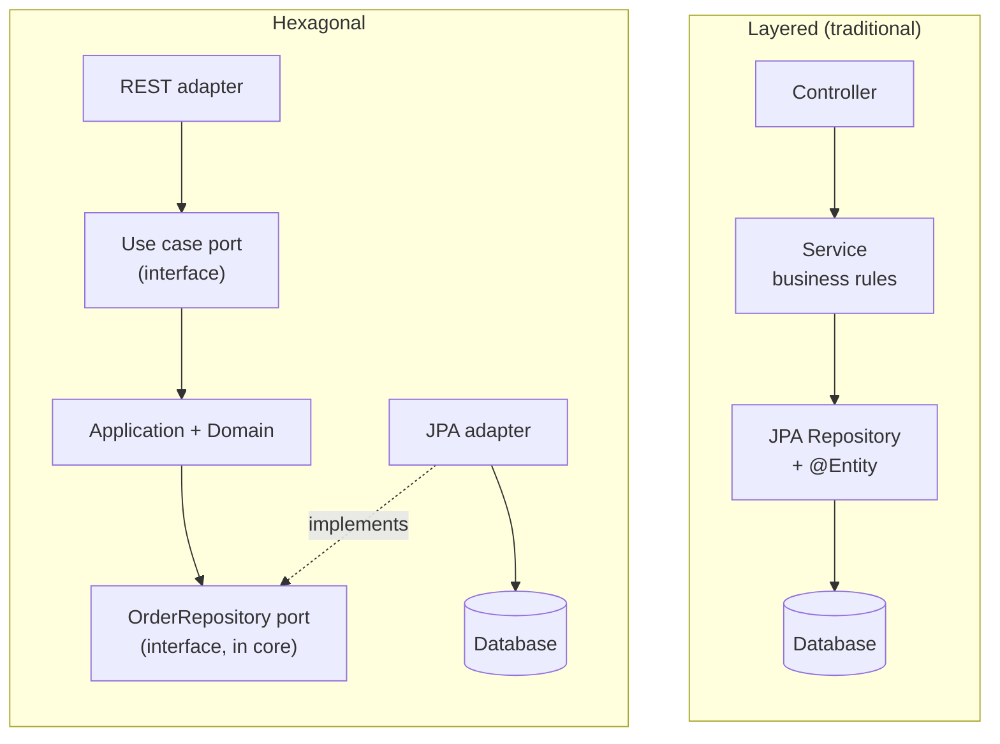
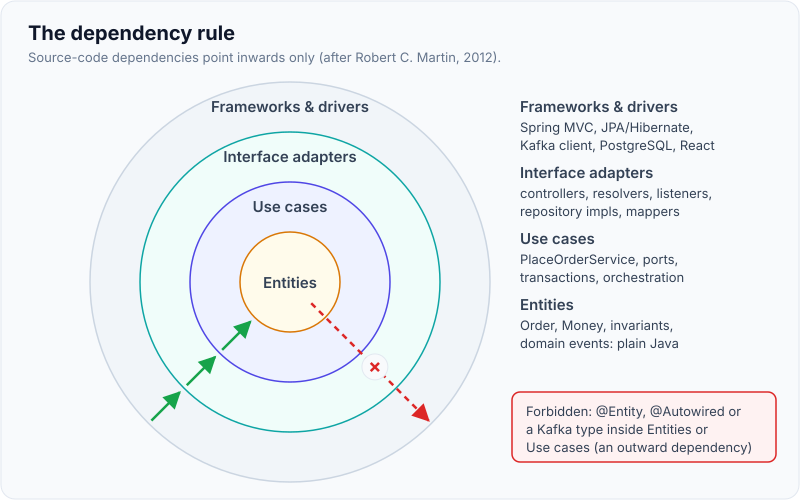
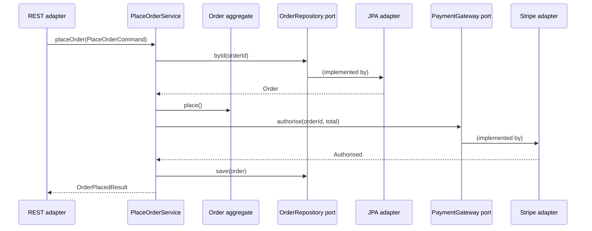

# Hexagonal / Ports-and-Adapters & Clean Architecture

!!! abstract "Key takeaways"
    - **One idea under three names.** Hexagonal / ports and adapters (Cockburn, 2005), onion (Palermo, 2008) and clean architecture (Martin, 2012) all put the **domain at the centre** and make **source-code dependencies point inwards** only.
    - A **port** is an interface owned by the application, in its language. **Driving (primary) ports** are use cases the outside calls (`PlaceOrderUseCase`); **driven (secondary) ports** are what the application needs (`OrderRepository`, `PaymentGateway`).
    - An **adapter** translates between a port and a technology: REST controller, Kafka listener, GraphQL resolver (driving); JPA, Mongo, HTTP client, Kafka producer (driven). Swapping an adapter never touches the core.
    - The payoff is **testability and replaceability**: the core runs in plain unit tests with fakes; the database, broker or framework can change at the edge.
    - It costs mapping code and indirection. Use it for the **core domain**; a simple CRUD service is fine with controller → repository. **Enforce** the rule with ArchUnit or Spring Modulith, or it erodes.

## Why it matters

The classic layered architecture (presentation → business → data access) has a hidden problem: the **business layer depends on the data layer**. Service classes import JPA entities and repositories, so the domain is shaped by the ORM, tests need a database, and "upgrade Hibernate" or "move to MongoDB" becomes a rewrite of the business layer.

Alistair Cockburn's hexagonal architecture (2005) states the goal: allow an application to be **driven equally by users, programs, automated tests or batch scripts**, and to be **developed and tested in isolation from its eventual run-time devices and databases**. The database is just another thing outside the application, like the UI.

Interviewers ask about it because it reveals whether you understand **dependency inversion at architecture scale**, and whether you can be pragmatic: a senior answer includes when *not* to do it.

## Core concepts

### Layered vs hexagonal: which way the arrows point


*Notice the dotted "implements" arrow: in hexagonal the JPA adapter depends on the core's interface, so the source-code dependency points inwards even though data flows out to the database at run time.*

That inversion is the whole trick. The core declares `interface OrderRepository` in its own terms; infrastructure implements it. The Dependency Inversion Principle (the D in SOLID) applied to the whole application.

### Ports and adapters

| | Driving (primary, left side) | Driven (secondary, right side) |
|---|---|---|
| **Who initiates** | Outside world calls the application | Application calls the outside world |
| **Port** | Use-case interface: `PlaceOrderUseCase`, `GetOrderQuery` | SPI the core needs: `OrderRepository`, `PaymentGateway`, `EventPublisher`, `Clock` |
| **Who implements the port** | The application service | An adapter in infrastructure |
| **Adapters** | REST controller, GraphQL resolver, Kafka consumer, scheduled job, CLI, test | JPA/Mongo repository, HTTP client, Kafka producer, S3, email, KMS |

Cockburn's later naming makes it concrete: "for placing orders", "for storing orders", "for notifying customers". Each port has a purpose in the application's language, not a technology name. `OrderRepository` is good; `OrderJpaDao` as a port is not.

{ loading=lazy }
*The core never changes when an adapter is swapped: that's the test of whether the boundaries are real.*

### Onion and clean architecture

**Onion architecture** (Jeffrey Palermo, 2008) draws the same idea as concentric rings: domain model at the centre, then domain services, then application services, with UI, infrastructure and tests in the outer ring. "All coupling is toward the centre."

**Clean architecture** (Robert C. Martin, 2012) generalises hexagonal, onion, DCI and BCE into four rings and one rule:

- **Entities**: enterprise-wide business rules (in DDD terms, the domain model).
- **Use cases**: application-specific business rules (application services / interactors).
- **Interface adapters**: controllers, presenters, gateways that convert data between use cases and the outside.
- **Frameworks and drivers**: web framework, database, UI, devices.

**The Dependency Rule:** *source code dependencies can only point inwards*. Nothing in an inner circle can know anything about an outer circle, including names of classes, functions or data formats declared there. Data crossing a boundary is in the form most convenient for the inner circle.

{ loading=lazy }
*Every legal arrow points inward; an `@Entity` or `@Autowired` inside the centre is an outward dependency in disguise.*

| Term | Hexagonal | Onion | Clean |
|---|---|---|---|
| Business rules | Application (inside) | Domain model + domain services | Entities |
| Use-case orchestration | Application (inside) | Application services | Use cases / interactors |
| Boundary interfaces | Ports | Interfaces in inner rings | Input / output boundaries, gateways |
| Technology code | Adapters | Infrastructure ring | Interface adapters + frameworks |

In interviews you can say: "they differ in vocabulary and number of rings; the invariant is that the domain depends on nothing and the edges depend on it."

### How DDD fits in

DDD supplies **what goes in the middle**: aggregates, value objects, domain services and domain events ([page 02](02-tactical-ddd-entities-value-objects-aggregates-domain-events.md)). Hexagonal supplies **how the middle is protected**. Repositories are driven ports; an [anti-corruption layer](01-strategic-ddd-bounded-contexts-ubiquitous-language-context-m.md#anti-corruption-layer-in-more-detail) is a driven adapter that translates a foreign model; application services implement driving ports.

### Request flow through the hexagon


*Notice that the use case only talks to ports; which adapter answers is decided by Spring's wiring at start-up, so a test can wire in-memory fakes instead.*

### Package layout in a Spring Boot service

Two common layouts. Both keep framework annotations out of `domain`.

```text
com.acme.ordering
├── domain/                 # aggregates, value objects, domain events, domain services
│   ├── Order.java
│   ├── Money.java
│   └── OrderRepository.java      # driven port (interface)
├── application/
│   ├── port/in/PlaceOrderUseCase.java     # driving port
│   ├── port/out/PaymentGateway.java       # driven port
│   └── PlaceOrderService.java             # implements PlaceOrderUseCase
└── adapter/
    ├── in/web/OrderController.java        # REST -> use case
    ├── in/kafka/CartCheckedOutListener.java
    ├── out/persistence/JpaOrderRepository.java + OrderJpaEntity.java + mapper
    └── out/payment/StripePaymentGateway.java
```

Package by **bounded context first** (one top-level package per context), then by layer inside it. Layer-first at the top level (`controllers/`, `services/`, `repositories/`) hides the domain and makes contexts bleed into each other.

## In practice: code & configuration

The usual violation is a "service" that knows about HTTP clients, JPA entities and Kafka, and so can only be tested with all of them running.

=== "❌ Common mistake"
    ```java
    @Service
    public class OrderService {
        @Autowired OrderJpaRepository repo;            // Spring Data interface leaks in
        @Autowired RestTemplate rest;                   // transport in business code
        @Autowired KafkaTemplate<String, String> kafka;

        @Transactional
        public OrderEntity place(Long id) {
            OrderEntity e = repo.findById(id).orElseThrow();
            if (e.getLines().isEmpty()) throw new ResponseStatusException(BAD_REQUEST); // HTTP in domain
            var rsp = rest.postForObject("https://pay/api/auth", Map.of("amt", e.getTotal()), Map.class);
            if (!"OK".equals(rsp.get("status"))) throw new IllegalStateException();
            e.setStatus("PLACED");
            kafka.send("orders", new ObjectMapper().writeValueAsString(e));          // entity as contract
            return e;                                                                 // entity to controller
        }
    }
    ```

=== "✅ Correct approach"
    ```java
    // --- application/port/in: driving port, in the use case's language
    public interface PlaceOrderUseCase {
        OrderPlacedResult place(PlaceOrderCommand cmd);
    }
    public record PlaceOrderCommand(OrderId orderId) {}

    // --- application/port/out: driven ports the core needs
    public interface PaymentGateway { Authorisation authorise(OrderId id, Money amount); }
    public interface OrderEvents { void publish(OrderPlaced event); }

    // --- application: no Spring web, no JPA, no Kafka imports
    public class PlaceOrderService implements PlaceOrderUseCase {
        private final OrderRepository orders;
        private final PaymentGateway payments;
        private final OrderEvents events;

        public PlaceOrderService(OrderRepository o, PaymentGateway p, OrderEvents e) {
            this.orders = o; this.payments = p; this.events = e;
        }

        @Override
        public OrderPlacedResult place(PlaceOrderCommand cmd) {
            Order order = orders.byId(cmd.orderId()).orElseThrow(() -> new OrderNotFound(cmd.orderId()));
            if (payments.authorise(order.id(), order.total()) instanceof Authorisation.Declined d) {
                throw new PaymentDeclined(order.id(), d.reason());
            }
            order.place();                                  // invariant check inside the aggregate
            orders.save(order);
            events.publish(new OrderPlaced(order.id(), order.total()));
            return new OrderPlacedResult(order.id(), order.status());
        }
    }

    // --- adapter/in/web: driving adapter (HTTP <-> command)
    @RestController
    @RequestMapping("/orders")
    class OrderController {
        private final PlaceOrderUseCase placeOrder;
        OrderController(PlaceOrderUseCase placeOrder) { this.placeOrder = placeOrder; }

        @PostMapping("/{id}/place")
        OrderResponse place(@PathVariable UUID id) {
            return OrderResponse.from(placeOrder.place(new PlaceOrderCommand(new OrderId(id))));
        }
    }

    // --- adapter/out/persistence: driven adapter (domain <-> JPA)
    @Repository
    class JpaOrderRepository implements OrderRepository {
        private final SpringDataOrderJpa jpa;               // Spring Data stays in the adapter
        private final OrderMapper mapper;
        JpaOrderRepository(SpringDataOrderJpa jpa, OrderMapper mapper) { this.jpa = jpa; this.mapper = mapper; }

        public Optional<Order> byId(OrderId id) { return jpa.findById(id.value()).map(mapper::toDomain); }
        public void save(Order order) { jpa.save(mapper.toEntity(order)); }
    }

    // --- configuration: wire the plain-Java core with Spring at the edge
    @Configuration
    class OrderingConfig {
        @Bean @Transactional
        PlaceOrderUseCase placeOrder(OrderRepository o, PaymentGateway p, OrderEvents e) {
            return new PlaceOrderService(o, p, e);
        }
    }
    ```

!!! tip "Pragmatic middle ground"
    Many Spring teams allow `@Service` and `@Transactional` on application services (they're stable annotations, not infrastructure), but forbid web, persistence and messaging types in `domain` and `application`. Decide the rule as a team and encode it in a test, below.

The core is now testable in milliseconds with fakes:

```java
class PlaceOrderServiceTest {
    InMemoryOrderRepository orders = new InMemoryOrderRepository();
    FakePaymentGateway payments = new FakePaymentGateway();
    RecordingOrderEvents events = new RecordingOrderEvents();
    PlaceOrderService service = new PlaceOrderService(orders, payments, events);

    @Test
    void declinedPaymentLeavesOrderInDraft() {
        Order order = orders.add(OrderFixtures.draftWithOneLine());
        payments.declineNext("insufficient funds");

        assertThatThrownBy(() -> service.place(new PlaceOrderCommand(order.id())))
            .isInstanceOf(PaymentDeclined.class);
        assertThat(orders.byId(order.id()).orElseThrow().status()).isEqualTo(OrderStatus.DRAFT);
        assertThat(events.published()).isEmpty();
    }
}
```

Enforce the dependency rule with **ArchUnit** so it can't silently erode:

```java
@AnalyzeClasses(packages = "com.acme.ordering")
class ArchitectureTest {

    @ArchTest
    static final ArchRule onion = Architectures.onionArchitecture()
        .domainModels("..domain..")
        .applicationServices("..application..")
        .adapter("web", "..adapter.in.web..")
        .adapter("kafka", "..adapter.in.kafka..")
        .adapter("persistence", "..adapter.out.persistence..")
        .adapter("payment", "..adapter.out.payment..");

    @ArchTest
    static final ArchRule domainIsFrameworkFree = noClasses()
        .that().resideInAPackage("..domain..")
        .should().dependOnClassesThat().resideInAnyPackage(
            "org.springframework..", "jakarta.persistence..", "org.apache.kafka..");
}
```

`onionArchitecture()` checks that the domain depends on nothing outward, application only on domain, and adapters don't depend on each other. For whole bounded contexts in one deployable, [Spring Modulith](04-using-ddd-to-define-microservice-boundaries.md#modular-monolith-first-with-spring-modulith) adds module-level verification. jMolecules offers annotations (`@AggregateRoot`, `@ValueObject`, `@Port`, `@Adapter`) that make the intent explicit and verifiable with ArchUnit rules.

## Real-world usage

- **Netflix** (Tech Blog, 2020) described a Studio Workflows app whose data was spread across services speaking gRPC, JSON API and GraphQL. They kept entities, repositories (interfaces) and interactors (use cases) inside the hexagon and data sources outside, so moving a source to a different service or protocol meant writing a new adapter, not changing business logic.
- **Testing strategy:** hexagonal makes the "testing honeycomb / pyramid" practical: domain and use-case tests are pure unit tests; each adapter gets a focused integration test (Testcontainers for Postgres, Kafka, Mongo); a few end-to-end tests check the wiring. See [testing strategy](../testing/01-test-pyramid-and-testing-strategy-for-microservices.md).
- **Legacy migration:** a driven port in front of a legacy system lets you replace it later with a new service behind the same port, which is the code-level half of a [strangler fig migration](../microservices/02-decomposition-strategies-and-monolith-migration.md).
- **Security and compliance domains** (banking, healthcare, key management) benefit because crypto providers, HSMs and identity providers sit behind ports; switching provider or cloud is an adapter change.
- **Failure mode: the "hexagonal CRUD" service.** Five classes and two mappers to save a row with no rules. Teams then abandon the pattern everywhere. Apply it where there's domain logic to protect.

## Trade-offs & production gotchas

| Option | Pros | Cons | Use when |
|---|---|---|---|
| Layered (controller/service/repository) | Familiar, little code, fast for CRUD | Business depends on persistence; tests need DB | Simple CRUD, supporting/generic subdomains |
| Hexagonal with JPA entities as domain | Ports and testability with less mapping | JPA annotations and lazy loading in domain | Pragmatic teams, moderate complexity |
| Full hexagonal/clean with separate models | Pure domain; free to change storage and transport | Mapping code, more classes, onboarding cost | Core domain, long-lived, many integrations |
| Vertical slices (per use case) | Each feature self-contained; little ceremony | Shared domain rules can be duplicated | Feature-heavy apps with thin domain |

!!! warning "Gotchas"
    - **Ports named after technology.** `KafkaPublisherPort` leaks the adapter into the core; name it `OrderEvents`.
    - **One port per adapter method explosion.** Group ports by purpose, not one interface per method.
    - **Leaking DTOs inward.** The controller's request DTO or the upstream API's response type in a use case is an outward dependency. Map at the adapter.
    - **Transactions across adapters.** `@Transactional` on the use case covers the DB, not Kafka or HTTP; use an outbox for events.
    - **Generic "BaseRepository<T>" in the domain.** Domain ports should express domain operations (`activeOrdersFor(customerId)`), not expose a query builder.
    - **No enforcement.** Without an ArchUnit/Modulith test the rule erodes within months.

!!! question "Interview angle"
    "Isn't this over-engineering?" Good answer: "For CRUD, yes. I use it where there's real domain logic or many integrations, because the cost is mapping code and the benefit is a core I can test in milliseconds and adapters I can replace. I'd still package by bounded context everywhere and enforce whichever rule we choose."

## How this connects to my experience

Not a ★ subtopic and not named on the resume, so present it as how I structure services, anchored on what is there.

- **Where it shows up:** OptumRx Meteor, "Owned the GraphQL Consumer Service end-to-end, acting as the integration layer between 5 upstream systems and multiple downstream consumers." An integration layer is naturally hexagonal: GraphQL resolvers are **driving adapters**; each of the 5 upstream clients is a **driven adapter** behind a port; Redis caching ("Implemented Redis-based caching for frequently accessed queries") can be a decorator on a driven port. *[confirm: how the code was actually structured, and whether upstream clients sat behind interfaces]*
- **Talking points:**
    - "With five upstreams, isolating each behind a port meant an upstream change was a change to one adapter plus its contract test." *[confirm]*
    - "Established engineering standards around testing" (resume) is where an architecture test or package convention belongs. *[confirm whether ArchUnit or similar was used]*
    - CCKM: "Developed enterprise key management capabilities supporting AWS, Azure, and GCP environments" and HSM integrations with Thales Luna and SafeNet. Multiple clouds and HSMs behind one capability is the textbook driven-port case. *[confirm the actual abstraction]*
- **Likely follow-up chain:** "How did you isolate the upstreams?" → "How did you test a resolver without all five running?" → "What happens when an upstream changes its schema?" Answer: port per upstream in our language, adapter with mapping, fakes for unit tests, contract or recorded-response tests per adapter, schema change caught at the adapter. *[confirm actual mechanisms]*

## Interview questions

### Fundamentals

??? question "Q1. What problem does hexagonal architecture solve?"
    **Answer:** It isolates the application's business logic from delivery mechanisms and infrastructure, so it can be driven by UI, APIs, tests or batch jobs and developed and tested without real databases or devices. It does this by defining ports owned by the application and adapters that implement or call them.

    **Interviewer listens for:** isolation, testability, database treated like the UI (outside).

    **Common wrong answer:** "It's about having six layers."

??? question "Q2. Driving vs driven ports?"
    **Answer:** Driving (primary) ports are the use cases the outside world invokes; the application implements them and adapters like REST controllers or Kafka listeners call them. Driven (secondary) ports are interfaces the application needs, such as repositories or payment gateways; adapters in infrastructure implement them.

    **Interviewer listens for:** who calls whom, who implements.

    **Common wrong answer:** "Input ports are DTOs and output ports are responses."

??? question "Q3. State the dependency rule."
    **Answer:** Source-code dependencies point only inwards, towards higher-level policy. Inner circles (entities, use cases) know nothing of outer ones (controllers, frameworks, DB), including their class names and data formats. Control can flow outward at run time through interfaces declared inside.

    **Interviewer listens for:** source dependency vs control flow, dependency inversion.

    **Common wrong answer:** "Data can only flow inwards."

### Intermediate

??? question "Q4. Hexagonal vs onion vs clean architecture?"
    **Answer:** Same core idea, different vocabulary. Hexagonal talks about inside/outside, ports and adapters. Onion uses concentric rings with the domain at the centre. Clean names four rings (entities, use cases, interface adapters, frameworks) and states the dependency rule. All invert the layered dependency on persistence.

    **Interviewer listens for:** common invariant, not claiming big differences.

    **Common wrong answer:** a long list of differences.

??? question "Q5. Should JPA entities be your domain model?"
    **Answer:** It's a trade-off. Separate models keep the domain pure and let the schema evolve independently, at the cost of mapping. Using annotated entities as the domain is pragmatic but lets lazy loading, no-arg constructors and proxies shape the model. I'd separate for complex core domains or non-relational stores, and accept annotations elsewhere while still banning setters and cross-aggregate associations.

    **Interviewer listens for:** trade-off, not dogma.

    **Common wrong answer:** "Always separate" or "never separate" with no reason.

??? question "Q6. How do you enforce the architecture over time?"
    **Answer:** Architecture tests in CI: ArchUnit `onionArchitecture()` or `layeredArchitecture()` rules, a rule that the domain package imports no Spring/JPA/Kafka types, Spring Modulith `verify()` for modules. Plus package-private adapters, build modules (Gradle/Maven) where the domain module has no framework dependency, and code review.

    **Interviewer listens for:** automated, in CI.

    **Common wrong answer:** "Code review and documentation."

### Senior

??? question "Q7. Where do transactions, security and validation go?"
    **Answer:** Transactions on the application service (the use-case boundary), applied by configuration or annotation. Authentication at the driving adapter (filter), authorisation of the use case at the application layer, domain-level permissions (a member can only see their own claims) in the domain where they're business rules. Input syntax validation at the adapter; invariants in the domain.

    **Interviewer listens for:** layered responsibilities, not all in controllers.

    **Common wrong answer:** "`@Transactional` on the repository" or "all validation via `@Valid`".

??? question "Q8. When is hexagonal overkill?"
    **Answer:** CRUD with no rules, short-lived prototypes, thin proxies, or a generic subdomain you'd rather buy. The cost (interfaces, mappers, more files) buys nothing if there's no logic to protect. I'd still package by feature and keep the option to extract ports later.

    **Interviewer listens for:** cost/benefit, subdomain type.

    **Common wrong answer:** "Never; always use it."

### Scenario-based

??? question "Q9. Your service must move from MongoDB to PostgreSQL. What changes in a hexagonal design?"
    **Answer:** A new driven adapter implementing the same `OrderRepository` port, its mapping and its integration tests (Testcontainers Postgres), plus a data migration and maybe dual-write or backfill during cut-over. Domain and use cases don't change; their unit tests prove behaviour is unchanged. If the port leaked Mongo concepts (query documents), fix the port first.

    **Interviewer listens for:** adapter-only change, migration plan, leaky port awareness.

    **Common wrong answer:** "Change the entity annotations and repositories throughout."

??? question "Q10. A GraphQL service aggregates five upstream APIs. Sketch the architecture."
    **Answer:** GraphQL resolvers as driving adapters calling query use cases; each upstream behind a driven port in our language with its own adapter (HTTP client, mapping, timeouts, circuit breaker); a cache decorator around slow ports; DataLoader batching at the resolver level to avoid N+1; contract tests per upstream adapter; the consumer schema owned by us, never a pass-through of upstream types.

    **Interviewer listens for:** ports per upstream, ACL-style mapping, resilience at adapters, owned schema.

    **Common wrong answer:** resolvers calling upstream clients directly and returning their DTOs.

## Cheat sheet

| Concept | Remember |
|---|---|
| Goal | Core testable and runnable without UI, DB or broker |
| Port | Interface owned by the core, named by purpose |
| Driving port / adapter | Use case / REST, GraphQL, Kafka listener, test |
| Driven port / adapter | Repository, gateway / JPA, Mongo, HTTP, Kafka producer |
| Dependency rule | Source dependencies point inwards only |
| Clean rings | Entities → use cases → interface adapters → frameworks |
| DDD fit | Aggregates in the middle; repositories and ACLs are driven ports/adapters |
| Enforce | ArchUnit `onionArchitecture()`, no-framework rule, Modulith `verify()` |
| Skip it for | CRUD, prototypes, generic subdomains |

## Sources
1. [Alistair Cockburn, Hexagonal Architecture (2005)](https://alistair.cockburn.us/hexagonal-architecture/): original statement of ports and adapters, driven equally by users, programs, tests and batch scripts.
2. [Robert C. Martin, The Clean Architecture (2012)](https://blog.cleancoder.com/uncle-bob/2012/08/13/the-clean-architecture.html): four rings, the Dependency Rule, crossing boundaries. Book: *Clean Architecture* (Prentice Hall, 2017).
3. [Jeffrey Palermo, The Onion Architecture, part 1 (2008)](https://jeffreypalermo.com/2008/07/the-onion-architecture-part-1/): concentric rings, coupling toward the centre.
4. [ArchUnit User Guide: Architectures (layered, onion)](https://www.archunit.org/userguide/html/000_Index.html): `onionArchitecture()` and dependency rules as tests.
5. [Spring Modulith reference: Verifying application module structure](https://docs.spring.io/spring-modulith/reference/verification.html): module-level verification.
6. [Netflix Technology Blog, "Ready for changes with Hexagonal Architecture" (2020)](https://netflixtechblog.com/ready-for-changes-with-hexagonal-architecture-b315ec967749): entities, repositories and interactors inside; data sources (gRPC, JSON API, GraphQL) swappable as adapters.
7. Tom Hombergs, *Get Your Hands Dirty on Clean Architecture* (2nd ed., Packt, 2023): Java/Spring package layout with `port.in` / `port.out`, mapping strategies.
8. [jMolecules](https://github.com/xmolecules/jmolecules): annotations and ArchUnit integration for DDD building blocks and architectural styles.
