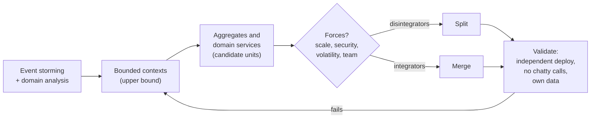
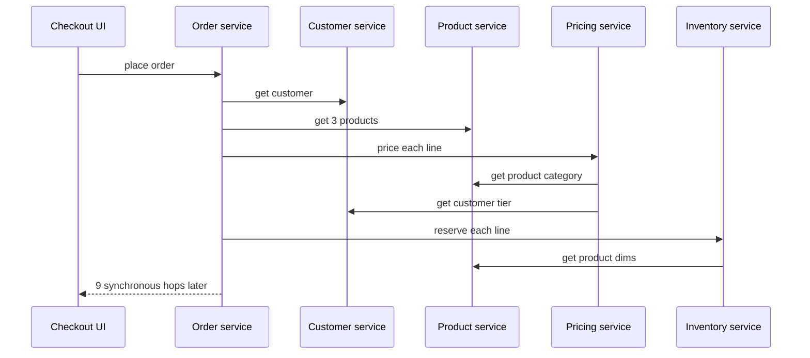

# Using DDD to Define Microservice Boundaries

!!! abstract "Key takeaways"
    - **A microservice should not span more than one bounded context.** The bounded context is the *upper* bound; a context may become one service or several, but a service that mixes two models is a design bug.
    - **Aggregates and domain services are candidate units** inside a context (Microsoft's guidance), because an aggregate is already a consistency and persistence boundary. Don't go smaller than an aggregate.
    - Split further only for a **force**: different scaling, fault isolation, security or compliance scope, code volatility, team ownership. Merge back when you see **integrators**: shared transactions, chatty calls, tight workflow coupling.
    - **Each service owns its data.** Other services get it through APIs or events, never through the database. No shared tables, no cross-service joins, no two-phase commit.
    - **When unsure, start coarse**: a modular monolith with enforced context boundaries (Spring Modulith) lets you find the right seams cheaply, then extract the ones that earn it. Splitting a service later is easier than merging wrong ones.

## Why it matters

The most expensive microservice mistake is the wrong boundary. Get it wrong and you build a **distributed monolith**: services that must be deployed together, call each other synchronously in long chains, share a database, and need a cross-team meeting for every feature. You pay the full cost of distribution (network failures, eventual consistency, observability, ops) and get none of the autonomy.

Most wrong boundaries come from three habits:

- **Entity services**: one service per noun (`CustomerService`, `ProductService`, `OrderService`), each a CRUD wrapper over a table. Every business operation becomes a choreography across all of them.
- **Technical layers**: a "data service", a "validation service", a "notification service" that every flow passes through.
- **Org-chart or size rules**: "a service per team member", "a service should be under 1,000 lines".

DDD gives a principled answer: boundaries come from **business language and invariants** ([page 01](01-strategic-ddd-bounded-contexts-ubiquitous-language-context-m.md), [page 02](02-tactical-ddd-entities-value-objects-aggregates-domain-events.md)), then are adjusted for **technical and organisational forces**. This is the page interviewers drill into when they ask "how did you decide your service boundaries?"

## Core concepts

### From domain to services: the sequence

Microsoft's Azure Architecture Center gives a four-step approach used across its microservices guidance:

1. **Start with a bounded context.** Service functionality shouldn't span more than one. If a service mixes models, revisit the domain analysis.
2. **Examine the aggregates.** They're good candidates: derived from business requirements, highly cohesive, a persistence boundary, loosely coupled to each other.
3. **Consider domain services.** Stateless operations across several aggregates, typically workflows, can become services (Microsoft's drone example makes `Scheduler` and `Supervisor` services).
4. **Apply non-functional requirements.** Team size, data types, technology, scalability, availability, security: these may split a service further or merge several.


*Notice the loop back from validation to the bounded contexts: boundary design is iterative, and a failing check usually means the domain analysis was wrong, not that you need another integration mechanism.*

### Bounded context = upper bound, aggregate = lower bound

| Granularity | Boundary | Risk if you stop here |
|---|---|---|
| **Several contexts in one service** | Too big | Two models and two languages tangled; teams step on each other |
| **One context = one service** | Usually the right default | A large context may have parts with very different load or security needs |
| **One context → several services, cut at aggregates or domain services** | Fine when a force justifies it | Cross-service consistency becomes eventual; more ops |
| **Smaller than an aggregate** (one service per entity or table) | Too small | An invariant needs a distributed transaction; chatty calls; nanoservices |

The rule of thumb from Vernon and Microsoft: **never split an aggregate across services**, because its invariants need one local transaction. Everything bigger than that is a judgement call driven by forces.

{ loading=lazy }
*Services are drawn around contexts or groups of aggregates, never through the middle of an aggregate.*

### Granularity disintegrators and integrators

Neal Ford, Mark Richards, Pramod Sadalage and Zhamak Dehghani (*Software Architecture: The Hard Parts*, 2021) give a balanced checklist: forces that push a service apart and forces that pull it back together.

| Disintegrators (split) | Integrators (merge) |
|---|---|
| **Service scope and function**: unrelated responsibilities, low cohesion | **Database transactions**: an operation needs ACID across both parts |
| **Code volatility**: one part changes weekly, the rest yearly | **Workflow and choreography**: parts constantly call each other; latency and failure chains |
| **Scalability and throughput**: one part needs 50 instances, the rest 2 | **Shared code**: large shared domain logic that would be duplicated or versioned |
| **Fault tolerance**: one part's failure shouldn't take down the rest | **Data relationships**: data that is joined and changed together |
| **Security / compliance**: one part handles PHI or card data and needs a smaller, audited scope | |
| **Extensibility**: new variants (payment types) are added often | |

A good interview answer names forces on **both** sides and says which won.

### Team alignment: Conway's law in practice

Conway's law says systems mirror the communication structure of the organisation that builds them. Team Topologies (Skelton and Pais) turns that into design: **stream-aligned teams** own one or more bounded contexts end to end, platform teams provide self-service infrastructure, and the **inverse Conway manoeuvre** shapes teams to match the architecture you want.

Practical consequences:

- One context, one owning team. A team can own several services; a service should never have two owning teams.
- If two "independent" services always change together in the same sprint, they're one service or the boundary is wrong.
- Context-map relationships ([page 01](01-strategic-ddd-bounded-contexts-ubiquitous-language-context-m.md#context-maps-how-contexts-relate)) predict integration pain: a Conformist relationship to an upstream team you can't influence is a reason for an ACL service at the edge.

### Data ownership

Each service owns its data and is the **single writer** for it. Others get the data by:

- **Query API** (sync): fine for occasional reads; adds runtime coupling.
- **Events** (async): the owner publishes `PrescriptionVerified`, `MemberAddressChanged`; consumers keep a local **read-only copy** of just the fields they need. Removes runtime coupling; adds staleness.
- **Never**: a shared database, cross-service joins, or one service writing another's tables.

Integration events are the **published language** between services: versioned schemas (Avro or JSON Schema in a registry), additive changes, emitted reliably via an **outbox** ([saga and outbox](../microservices/07-distributed-transactions-saga-outbox-pattern.md)).

### Validating a boundary

Microsoft's checklist, which doubles as a list of interview "smells":

- Each service has a **single responsibility**.
- **No chatty calls** between services. If a split makes two services chatty, the functions probably belong together.
- Each service is small enough for **one small team** to build independently.
- **No deploy-together dependencies**: every service deploys independently.
- Services **evolve independently** (not tightly coupled).
- Boundaries **avoid data consistency problems**: where strong consistency is needed, group the functionality; elsewhere accept eventual consistency.

Above all, the guidance says: be pragmatic, DDD is iterative, and **when in doubt start coarse**, because splitting one service is easier than refactoring functionality across several.


*Notice how entity-shaped services turn one business operation into nine synchronous calls: latency adds up, and any one failure fails the checkout. That's the "chatty calls" smell the validation checklist warns about.*

{ loading=lazy }
*Same feature, two boundary choices: the entity split inherits every downstream failure; the capability split keeps the hot path local.*

### Modular monolith first with Spring Modulith

Martin Fowler's *MonolithFirst* observation: almost all successful microservice stories started as a monolith that got too big, and most systems built as microservices from scratch ended up in serious trouble, largely because boundaries are hard to get right early. A **modular monolith** gets you the boundary discipline without the distribution cost:

- One deployable, **one top-level package per bounded context**, each with a small public API and hidden internals.
- Modules talk through **published APIs and application events**, not by reaching into each other's repositories.
- A test **verifies** the module structure in CI, so boundaries don't erode.
- When a module needs its own scaling, team or compliance scope, **extract** it: its events become Kafka messages and its API becomes HTTP or gRPC.

[Spring Modulith](https://docs.spring.io/spring-modulith/reference/) (1.x, Spring Boot 3) supports exactly this: each direct sub-package of the main application package is an application module; sub-packages of a module are internal; `ApplicationModules.of(App.class).verify()` fails on cycles and on access to another module's internals; `@ApplicationModuleListener` handles events asynchronously in a new transaction after commit; the **event publication registry** persists events so incomplete ones can be retried; and `@Externalized` can publish selected events to Kafka or other brokers.

{ loading=lazy }
*Extraction is cheap when the module already talks only through events and a small API: the transport changes, the contract doesn't.*

## In practice: code & configuration

A boundary drawn around entities versus one drawn around a capability:

=== "❌ Common mistake"
    ```java
    // Pricing calls Product and Customer synchronously on every request.
    // Order needs Product, Customer, Pricing and Inventory to place one order.
    @Service
    class PricingService {
        private final ProductClient products;      // HTTP to product-service
        private final CustomerClient customers;    // HTTP to customer-service

        Money price(String productId, String customerId, int qty) {
            ProductDto p = products.get(productId);            // remote call
            CustomerDto c = customers.get(customerId);         // remote call
            BigDecimal discount = "GOLD".equals(c.tier()) ? new BigDecimal("0.1") : BigDecimal.ZERO;
            return Money.of(p.listPrice().multiply(BigDecimal.valueOf(qty)).multiply(ONE.subtract(discount)));
        }
    }
    // Plus: order-service and inventory-service both read the shared PRODUCT table "for speed".
    ```

=== "✅ Correct approach"
    ```java
    // Ordering context owns pricing decisions and keeps a local, read-only copy
    // of the catalogue facts it needs, fed by the Catalogue context's events.
    package com.acme.ordering.internal;

    @Component
    class CatalogueProjection {
        private final PriceListRepository priceList;   // ordering's own table

        @ApplicationModuleListener                      // async, after commit, new tx
        void on(ProductPriceChanged e) {                 // published by Catalogue
            priceList.upsert(new PriceListEntry(e.productId(), e.listPrice(), e.category(), e.version()));
        }
    }

    // Pricing is a domain service inside Ordering: no network hop on the hot path
    class PricingPolicy {
        Money priceFor(OrderLine line, CustomerTier tier, PriceListEntry entry) {
            return entry.listPrice().times(line.quantity()).discount(tier.discount());
        }
    }
    ```

Verify the module boundaries in CI and generate the module diagram as documentation:

```java
class ModularityTests {
    ApplicationModules modules = ApplicationModules.of(PharmacyApplication.class);

    @Test
    void verifiesModuleBoundaries() {
        modules.verify();   // fails on cycles and on references to another module's internal packages
    }

    @Test
    void writesDocumentation() {
        new Documenter(modules).writeDocumentation();   // C4 / PlantUML component diagrams per module
    }
}
```

```text
com.acme.pharmacy
├── PharmacyApplication.java
├── intake/                    # module: public API = types in this package
│   ├── PrescriptionVerified.java          # event other modules may use
│   └── internal/ ...                      # hidden from other modules
├── fulfilment/
│   └── internal/ ...
└── claims/
    ├── ClaimsApi.java
    └── internal/ ...          # PHI-heavy; first candidate for extraction (smaller compliance scope)
```

Publishing a module event to Kafka when the time comes (with `spring-modulith-events-kafka` on the classpath):

```java
@Externalized("pharmacy.intake.prescription-verified.v1::#{#this.prescriptionId()}")   // topic::key
public record PrescriptionVerified(PrescriptionId prescriptionId, MemberId memberId,
                                   DrugCode drug, int daysSupply, Instant verifiedAt) {}
```

## Real-world usage

- **Microsoft's drone-delivery reference** goes from domain analysis to bounded contexts to aggregates (`Delivery`, `Package`, `Drone`, `Account`) and domain services (`Scheduler`, `Supervisor`), then adds an `Ingestion` service for load levelling and a `Delivery History` service because historical storage needs differ from in-flight operations. Both additions are driven by non-functional forces, not the domain.
- **Shopify** chose a modular monolith ("componentisation") for its core Rails application rather than microservices, enforcing boundaries between components with tooling (Packwerk). It's the standard counter-example when someone assumes scale requires microservices.
- **Amazon Prime Video** (2023) moved an audio/video monitoring tool from distributed serverless components back into a single process and reported a large cost reduction. The boundary was technical (pipeline steps), not domain; it's a lesson about over-splitting, not against microservices.
- **Healthcare and banking** often draw an extra boundary along **data sensitivity**: keep PHI or card data in as few services as possible so HIPAA or PCI DSS scope stays small. That's the "security" disintegrator in practice.
- **Failure mode:** the "shared customer database" that five services read and two write. It looks like microservices in the deployment diagram and behaves like a monolith in every schema change.

## Trade-offs & production gotchas

| Option | Pros | Cons | Use when |
|---|---|---|---|
| Modular monolith | One deploy, local transactions, cheap to move boundaries | Single scaling unit and blast radius; discipline needed | New product, 1–3 teams, boundaries uncertain |
| One service per bounded context | Clear ownership, independent deploy, coherent model | Some contexts are large; mixed scaling needs | Default for multi-team systems |
| Several services per context | Targeted scaling, isolation, compliance scope | Eventual consistency inside one language; more ops | A clear disintegrator outweighs integrators |
| Entity services | Looks simple, easy to explain | Chatty, distributed transactions, distributed monolith | Almost never |

!!! warning "Gotchas"
    - **Splitting before you understand the domain.** Early boundaries are guesses. Validate them in a modular monolith or with event storming before paying for the network.
    - **Shared database "for now".** It stays. Agree single-writer ownership from day one, even if both schemas live on one server.
    - **Synchronous chains on the hot path.** Each hop multiplies failure probability. Replicate the reference data you need via events.
    - **Shared domain libraries.** A `common-domain.jar` used by every service is a shared kernel that forces lock-step upgrades. Share contracts (schemas), not domain classes.
    - **Ignoring the UI.** A capability-aligned backend with one monolithic frontend still couples teams; micro-frontends or BFFs per context finish the job.
    - **Distributed transactions.** If a business operation needs ACID across two services, the boundary is probably wrong; otherwise use a saga with compensation.

!!! question "Interview angle"
    "How big should a microservice be?" Don't answer with lines of code. "No bigger than one bounded context, no smaller than one aggregate; within that range, split only when a force like scaling, fault isolation, security scope or team ownership outweighs the cost of eventual consistency and extra operations."

## How this connects to my experience

★ **Resume claims:**

- Johnson Controls, Metasys: "Contributed to the migration of a legacy monolithic application to microservices" and "Built user management microservices and owned JWT-based authentication and SSO implementation end-to-end."
- Publicis Sapient, OptumRx Meteor: "Designed and developed microservices using Java, Spring Boot, Kafka, MongoDB, Redis, and GraphQL", "Collaborated with senior architects to design scalable service architecture, API strategies, and data integration patterns", "Owned the GraphQL Consumer Service end-to-end, acting as the integration layer between 5 upstream systems and multiple downstream consumers", and "established a micro-frontend architecture".

- **Where I used it:**
    - **Metasys:** user management is a textbook **generic/supporting context** with a clear language (users, roles, credentials, sessions) and its own data, and every other part depends on it. That's why it's a good early extraction. *[confirm: what other services were carved out, whether boundaries followed business capabilities, and how user data moved out of the monolith]*
    - **OptumRx Meteor:** the GraphQL Consumer Service sits at a **context boundary**: five upstream contexts, each with its own language, and consumers that need one coherent model. It's an ACL plus open host service implemented as a service. *[confirm: whether the service owned data or was stateless aggregation, and how other services' boundaries were decided with the architects]*
    - **Kafka workflows with retry and DLQ** are the integration mechanism that makes context-aligned services work: events instead of synchronous chains. *[confirm: which domain events crossed service boundaries]*
    - **Micro-frontends** extend the boundary to the UI so a team can own a capability end to end. *[confirm: whether micro-frontends were split by business capability and owned by the same teams as the backend services]*
- **Talking points:**
    - "I start boundaries from language and invariants, then check forces. User management in Metasys had its own language and data and was needed everywhere, so it was a natural first service, and owning JWT and SSO solved the cross-service trust problem every later extraction needed." *[confirm]*
    - "In Meteor, the GraphQL layer let downstream consumers see one model while five upstreams kept theirs. That's what DDD calls an anti-corruption layer, and it's why an upstream change didn't ripple to consumers." *[confirm]*
    - "If I designed Meteor's backend from scratch today, I'd validate boundaries in a modular monolith with Spring Modulith first, and extract only the contexts with a clear force, such as PHI scope or a different scaling profile." (opinion, not a claim)
    - As a lead: "I ask two questions in design reviews: which invariant forces these to be together, and which force justifies pulling them apart?"
- **Likely follow-up chain:** "How did you decide service boundaries?" → language and capabilities, not entities; user management example → "Did any services end up chatty?" *[confirm a real example, or say how you'd detect it: tracing shows fan-out on the hot path]* → "How did services share data?" events over Kafka with local copies; no shared tables *[confirm whether any shared DB existed]* → "How did you handle a business operation across services?" saga with retry and DLQ, idempotent consumers → "What would you change?" modular monolith first, explicit context map, contract tests.

## Interview questions

### Fundamentals

??? question "Q1. How does a bounded context relate to a microservice?"
    **Answer:** A microservice shouldn't span more than one bounded context, because that mixes two models and languages. A context is often one service, but it can be split into several along aggregates or domain services when a force justifies it. The context is the upper bound; the aggregate is the lower bound.

    **Interviewer listens for:** upper bound, not necessarily 1:1, aggregates as lower bound.

    **Common wrong answer:** "Bounded context and microservice are the same thing."

??? question "Q2. Why are entity services an anti-pattern?"
    **Answer:** Business operations span several entities, so an entity-per-service design turns each operation into a chain of synchronous calls or a distributed transaction. Services become CRUD wrappers, logic ends up in orchestrators, and every feature touches several teams. Boundaries should follow capabilities and invariants.

    **Interviewer listens for:** chatty calls, distributed transactions, capability alignment.

    **Common wrong answer:** "They're fine if each is small."

??? question "Q3. Why must each service own its data?"
    **Answer:** A shared database couples services at the schema level: one team's migration breaks another, deployment becomes coordinated, and nobody owns the data's meaning. Single-writer ownership with APIs or events keeps services independently deployable and lets each choose its storage.

    **Interviewer listens for:** schema coupling, independent deploy, single writer.

    **Common wrong answer:** "For performance."

### Intermediate

??? question "Q4. What forces justify splitting a bounded context into several services?"
    **Answer:** Disintegrators: different scaling or throughput, fault isolation, security or compliance scope (PHI, PCI), very different change rates, distinct sub-capabilities with low cohesion, frequent extension. Weigh them against integrators: need for ACID transactions, chatty workflows, shared code and tightly related data.

    **Interviewer listens for:** both sides, a concrete example.

    **Common wrong answer:** "When the codebase gets too big."

??? question "Q5. How do you validate that boundaries are right?"
    **Answer:** Each service deploys independently; no chatty synchronous calls on hot paths; one team owns each service; features rarely need coordinated changes across services; no shared tables; strong-consistency needs stay inside one service. Measure: tracing fan-out, co-change in version control, deploy coupling.

    **Interviewer listens for:** checklist plus evidence from data.

    **Common wrong answer:** "If the services are small enough."

??? question "Q6. What is a modular monolith and when do you choose it?"
    **Answer:** One deployable with explicit modules per bounded context, hidden internals, communication through APIs and events, and boundary checks in CI. Choose it when the domain or team count doesn't yet justify distribution, or boundaries are uncertain; extract modules later. Spring Modulith enforces and documents it.

    **Interviewer listens for:** enforced boundaries, extraction path.

    **Common wrong answer:** "A monolith with packages," without enforcement.

### Senior

??? question "Q7. How do Conway's law and Team Topologies influence service boundaries?"
    **Answer:** Architecture mirrors team communication, so align bounded contexts with stream-aligned teams, one owner per context, and use the inverse Conway manoeuvre to shape teams to the target architecture. Context-map relationships expose team dependencies that will become integration pain.

    **Interviewer listens for:** ownership, cognitive load, inverse Conway.

    **Common wrong answer:** ignoring teams entirely.

??? question "Q8. Two services you own always change and deploy together. What do you do?"
    **Answer:** Treat it as evidence of a wrong boundary. Check what changes together: a shared invariant, a chatty workflow, or a shared model. If they share invariants or a language, merge them (or into one module). If it's a contract issue, stabilise the contract with versioned events and consumer-driven contract tests.

    **Interviewer listens for:** willingness to merge, root-cause on co-change.

    **Common wrong answer:** "Add an orchestrator" or "deploy them in one pipeline".

??? question "Q9. How do you migrate from a shared database to per-service ownership?"
    **Answer:** Name a single writer per table; move other writers to the owner's API; give readers events or a read API; split the schema into per-service schemas on the same server first; then move to separate databases. Use CDC or an outbox for events and Liquibase/Flyway for incremental schema moves. Each step is reversible.

    **Interviewer listens for:** incremental, single writer first, CDC/outbox.

    **Common wrong answer:** "Big-bang migration over a weekend."

### Scenario-based

??? question "Q10. Design service boundaries for an online pharmacy."
    **Answer:** Event storm the flow, then contexts: Intake (prescriptions, verification), Fulfilment (dispensing, shipping), Claims and Benefits (eligibility, adjudication, pricing), Member, Identity (bought, generic). One service per context initially; split Shipping from Dispensing if carrier integration scales differently; keep Claims small because it handles PHI and payer data. Integrate with events (`PrescriptionVerified`, `ClaimAdjudicated`), ACLs around the legacy PBM, and local read models instead of synchronous chains.

    **Interviewer listens for:** process, forces, compliance, events, ACL.

    **Common wrong answer:** Patient, Drug, Prescription, Order services.

??? question "Q11. A product team wants a separate 'Discount service' that Order calls synchronously on every line. Your view?"
    **Answer:** Ask which force justifies the split. Pricing is usually part of the ordering capability's invariants (order total, approval limits), so a remote call per line adds latency and a failure point to checkout. Prefer a pricing domain service inside Ordering, fed by events for reference data. If discounts are owned by a different team with a different change rate, expose a batch API or publish discount rules as events and evaluate locally.

    **Interviewer listens for:** force-based reasoning, latency and availability math, alternatives.

    **Common wrong answer:** "Yes, smaller services are better."

??? question "Q12. You inherit 40 microservices that form a distributed monolith. Where do you start?"
    **Answer:** Measure coupling: tracing to find synchronous chains and fan-out, version-control co-change, shared databases, deploy-together groups. Redraw a context map, find services that belong to the same context, and merge the worst clusters (fewer, larger services). Replace hot-path sync calls with events and local copies. Add contract tests and independent deploy as a gate. Do it incrementally, one cluster at a time.

    **Interviewer listens for:** data first, willingness to merge, incremental plan.

    **Common wrong answer:** "Add a service mesh" or "rewrite".

## Cheat sheet

| Concept | Remember |
|---|---|
| Upper bound | One service never spans two bounded contexts |
| Lower bound | Never split an aggregate across services |
| Candidates | Aggregates and domain services inside a context |
| Split for | Scale, fault isolation, security/compliance, volatility, team |
| Merge for | ACID needs, chatty workflow, shared code, related data |
| Data | Single writer; APIs or events; local read-only copies |
| Validate | Independent deploy, no chatty calls, one team, no shared DB |
| Smells | Entity services, shared DB, sync chains, `common-domain.jar` |
| Default | Start coarse: modular monolith + Spring Modulith `verify()` |
| Extract | Module events → `@Externalized` to Kafka; API → HTTP |

## Sources
1. [Microsoft Azure Architecture Center: Identify microservice boundaries](https://learn.microsoft.com/en-us/azure/architecture/microservices/model/microservice-boundaries): four-step approach, validation criteria, drone-delivery services, "start coarse".
2. [Microsoft .NET Microservices guide: Identify domain-model boundaries for each microservice](https://learn.microsoft.com/en-us/dotnet/architecture/microservices/architect-microservice-container-applications/identify-microservice-domain-model-boundaries): bounded context as the unit for microservices.
3. Neal Ford, Mark Richards, Pramod Sadalage, Zhamak Dehghani, *Software Architecture: The Hard Parts* (O'Reilly, 2021), ch. 7: granularity disintegrators and integrators.
4. Sam Newman, [*Building Microservices*, 2nd ed. (O'Reilly, 2021)](https://samnewman.io/books/building_microservices_2nd_edition/): information hiding, bounded contexts, data ownership.
5. [Martin Fowler, MonolithFirst (bliki)](https://martinfowler.com/bliki/MonolithFirst.html): successful microservice systems usually started as monoliths; boundaries are hard to get right early.
6. [Spring Modulith reference: Fundamentals](https://docs.spring.io/spring-modulith/reference/fundamentals.html), [Verification](https://docs.spring.io/spring-modulith/reference/verification.html), [Events](https://docs.spring.io/spring-modulith/reference/events.html), [Documentation](https://docs.spring.io/spring-modulith/reference/documentation.html): module packages, `verify()`, `@ApplicationModuleListener`, event publication registry, `@Externalized`, `Documenter`.
7. [Team Topologies: key concepts](https://teamtopologies.com/key-concepts): stream-aligned teams, cognitive load, inverse Conway manoeuvre.
8. [Shopify Engineering, "Deconstructing the Monolith" (2019)](https://shopify.engineering/deconstructing-monolith-designing-software-maximizes-developer-productivity): modular monolith / componentisation instead of microservices.
9. [Prime Video Tech, "Scaling up the Prime Video audio/video monitoring service and reducing costs by 90%" (2023)](https://www.primevideotech.com/video-streaming/scaling-up-the-prime-video-audio-video-monitoring-service-and-reducing-costs-by-90): consolidating over-split serverless components.
10. Vaughn Vernon, *Implementing Domain-Driven Design* (2013), ch. 2–3 and 10: contexts, aggregates as consistency boundaries.
