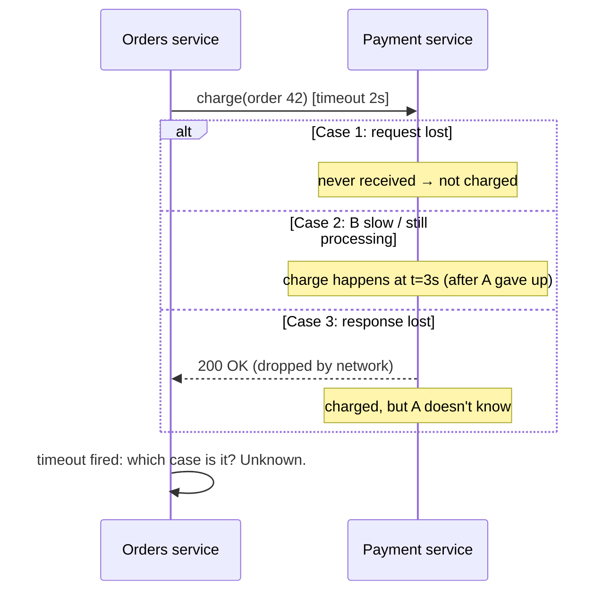
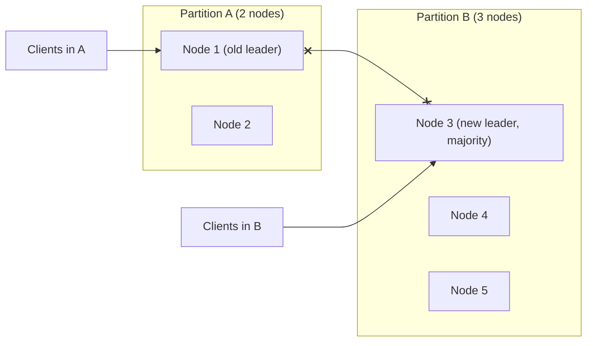

# Fallacies of Distributed Computing, Failure Modes

!!! abstract "TL;DR"
    - **The 8 fallacies** (Deutsch, Gosling): the network is reliable, latency is zero, bandwidth is infinite, the network is secure, topology doesn't change, there is one administrator, transport cost is zero, the network is homogeneous. Each false assumption shows up as a class of production bugs.
    - **Partial failure** is what makes distributed systems hard. Part of the system fails while the rest keeps running, and **you often can't tell what failed**. After a timeout, the request may have failed, may still be running, or may have succeeded with the response lost.
    - **Failure models**, from easiest to hardest: **crash-stop** → **crash-recovery** (comes back, possibly with stale state) → **omission** (lost messages) → **timing/performance** (too slow) → **Byzantine** (arbitrary or malicious behaviour). Most business systems assume crash-recovery + omission + timing faults, not Byzantine ones.
    - **Partitions** split nodes into groups that can't talk. Without care they cause **split brain** (two leaders). Prevent it with **quorums** and **fencing tokens**.
    - **Gray failures** (partly working) and **metastable failures** (the system stays down after the trigger is gone, sustained by retries or cold caches) cause many of the worst outages. Design defences: timeouts, bounded retries, back-pressure, load shedding and idempotency.

## Why it matters

Every remote call in a microservice architecture runs into these fallacies. Senior interviews ask "what can go wrong when service A calls service B?", and the expected answer goes beyond "it might be down": lost responses, duplicates, slow responses, partitions, stale data after recovery, and retry storms. This is the foundation for the rest of this topic: consistency, consensus, idempotency, retries, transactions, exactly-once, clocks and back-pressure.

## Core concepts

### The eight fallacies and what they break

| Fallacy | What breaks | Defence |
|---|---|---|
| 1. The network is reliable | Lost requests and responses, duplicates on retry | Timeouts, retries + **idempotency**, acks, outbox |
| 2. Latency is zero | Chatty call chains, N+1 remote calls, timeouts | Batching (DataLoader), caching, async, co-location, latency budgets |
| 3. Bandwidth is infinite | Huge payloads, over-fetching, cross-AZ costs | Pagination, compression, field selection (GraphQL), claim check |
| 4. The network is secure | Spoofing, sniffing, lateral movement | mTLS, zero trust, authN/authZ per call, encryption |
| 5. Topology doesn't change | Hard-coded IPs, stale DNS, broken connections after scaling | Service discovery, short DNS TTLs, connection recycling, health checks |
| 6. There is one administrator | Conflicting configs, uncoordinated upgrades, cert expiry | Config as code, ownership, compatibility contracts, automation |
| 7. Transport cost is zero | Serialisation CPU, cloud egress and NAT bills | Efficient formats (Protobuf), locality, VPC endpoints |
| 8. The network is homogeneous | Protocol/version mismatches, MTU issues, mixed clients | Versioned APIs, tolerant readers, standard protocols |

### Partial failure: the three outcomes of a timeout


*Notice that A **can't distinguish** the three cases. Blindly retrying risks a double charge (cases 2 and 3), and not retrying risks a lost charge (case 1). The only safe answers are **idempotent operations with idempotency keys** and **state you can query** ("what's the status of payment X?").*

### Failure models

| Model | Behaviour | Example | Typical handling |
|---|---|---|---|
| Crash-stop | Node halts forever | Terminated instance | Replication, failover |
| **Crash-recovery** | Node halts, later restarts (may lose volatile state) | Pod restart, JVM OOM | Durable logs, re-sync, idempotent replay |
| **Omission** | Messages lost (send or receive) | Packet drops, full queues | Retries, acks, timeouts |
| **Timing / performance** | Responses arrive too late | GC pause, overloaded node, noisy neighbour | Timeouts, hedging, load shedding |
| Byzantine | Arbitrary, inconsistent or malicious behaviour | Corrupted node, attacker | BFT protocols (blockchains), checksums, signatures, authentication |

Most enterprise systems design for **crash-recovery + omission + timing**. Checksums and authentication handle the Byzantine-like faults that matter in practice (corruption, spoofing).

### Network partitions and split brain


*Notice the danger: if node 1 keeps acting as leader while node 3 is elected in the majority partition, both accept writes (**split brain**). **Majority quorums** make sure only one side can make progress. **Fencing tokens** make sure a deposed leader's late writes are rejected by storage.*

- Partitions are **not rare**: misconfigured switches, cloud network events, GC pauses long enough to look like a partition, asymmetric reachability.
- **Asymmetric partitions:** A can reach B but not the reverse. Heartbeat-based failure detectors get confused, causing flapping leadership.

### Gray and metastable failures

- **Gray failure:** a component is degraded in a way some observers notice and others don't. A node passes health checks but drops 5% of requests, or a disk is slow. Detect it from the **caller's perspective** (client metrics, outlier ejection).
- **Metastable failure:** a trigger (a brief spike, a cache flush, a deploy) pushes the system into a bad state that **sustains itself** after the trigger is gone. For example: retries double the load → more timeouts → more retries. Or a cold cache → DB overload → slow fills → cache stays cold. Recovery needs **load reduction** (shedding, turning off retries, warming caches), not just waiting.

### Time and ordering

- There's no global clock. Physical clocks drift and jump (NTP corrections, leap seconds, VM pauses). See [clocks, ordering & locks](08-clocks-ordering-distributed-locks.md).
- A process can pause at any moment (GC, VM migration, swap) for seconds, so "I hold the lease" can become false without the process noticing.
- **FLP impossibility:** in a fully asynchronous system with even one crash failure, no deterministic consensus algorithm can guarantee termination. Real systems use timeouts (partial synchrony) to make progress. That's why consensus needs timeouts and leader leases.

## In practice: code & configuration

=== "❌ Common mistake"
    ```java
    // Assumes a reliable, zero-latency network: no timeouts, blind retries of a non-idempotent call,
    // sequential remote calls in a loop (latency adds up).
    public OrderView view(String orderId) {
        Order o = orderClient.get(orderId);                          // default timeouts may be infinite
        List<ItemView> items = new ArrayList<>();
        for (String sku : o.skus()) items.add(catalogClient.get(sku)); // N sequential round trips
        return new OrderView(o, items);
    }
    public void pay(Order o) {
        for (int i = 0; i < 3; i++) {
            try { paymentClient.charge(o.total(), o.card()); return; }  // retry may double-charge
            catch (Exception e) { /* retry */ }
        }
    }
    ```

=== "✅ Correct approach"
    ```java
    // Deadline propagation + batching + idempotent, queryable operations.
    public OrderView view(String orderId, Deadline deadline) {
        Order o = orderClient.get(orderId, deadline.remaining());               // per-call timeout ≤ remaining budget
        Map<String, ItemView> items = catalogClient.getBatch(o.skus(),          // one round trip (batching)
                                                             deadline.remaining());
        return new OrderView(o, o.skus().stream().map(items::get).toList());
    }

    public PaymentResult pay(Order o) {
        String key = "order-" + o.id() + "-charge";                              // stable idempotency key
        try {
            return paymentClient.charge(o.total(), o.cardToken(), key, Duration.ofSeconds(2));
        } catch (TimeoutException e) {
            // Outcome unknown: ask instead of guessing; the same key makes a retry safe too.
            return paymentClient.status(key).orElseGet(() ->
                    paymentClient.charge(o.total(), o.cardToken(), key, Duration.ofSeconds(2)));
        }
    }

    public record Deadline(Instant at, Clock clock) {
        public Duration remaining() {
            Duration d = Duration.between(clock.instant(), at);
            if (d.isNegative() || d.isZero()) throw new DeadlineExceededException();
            return d;
        }
    }
    ```

## Real-world usage

- **AWS us-east-1 (2011, EBS):** a network change triggered a re-mirroring storm (a metastable-like cascade) that consumed capacity for days. **2021:** an internal network overload from client retries impaired control planes. Both show how retries and recovery traffic can amplify failures.
- **GitHub (2018):** a 43-second network partition between data centres caused a MySQL failover, and writes went to both sides (split brain-like divergence). Reconciling took ~24 hours of degraded service.
- **Jepsen analyses** have repeatedly found databases losing acknowledged writes under partitions, which is why "test with fault injection" is standard advice.
- **Healthcare and banking integrations** (pharmacy networks, payment rails) are full of "unknown outcome" cases. Status endpoints, idempotency keys and reconciliation jobs exist precisely for fallacy #1.

## Trade-offs & production gotchas

| Design choice | Protects against | Cost |
|---|---|---|
| Aggressive timeouts | Slow dependencies holding resources | False timeouts and duplicate work |
| Retries | Transient omission faults | Load amplification, duplicates |
| Idempotency keys | Duplicate side effects | Storage and complexity |
| Quorums + fencing | Split brain | Availability of the minority side, latency |
| Hedged requests | Tail latency | Extra load (budget them) |
| Load shedding | Metastable overload | Rejected requests |

!!! warning "Gotchas"
    - **Default HTTP and DB client timeouts are often infinite or very long.** Set connect, read and pool-acquire timeouts explicitly everywhere.
    - **A timeout is not a failure signal.** It's "unknown". Design the next step (query, retry with a key, reconcile) accordingly.
    - **Health checks can lie** (gray failure). Combine them with client-side error and latency metrics.
    - **Recovery is a load event.** Restarts, cache warm-up and backlog replay need rate limits too.

## How this connects to my experience

- **Where I used it:**
    - OptumRx GraphQL Consumer Service: "integration layer between **5 upstream systems** and multiple downstream consumers" (every fallacy applies to every upstream call).
    - Kafka "retry and DLQ handling".
    - CCKM: "HSM integrations" and cloud KMS APIs across AWS, Azure and GCP (remote calls to security-critical systems).
- **Talking points:**
    - "With 5 upstreams, latency adds up (fallacy 2). We used DataLoader batching, parallel resolver calls and caching, with a latency budget per upstream." *[confirm: budgets/timeouts actually used]*
    - "Network unreliability meant retries, so consumers and upstream mutations needed idempotency, and DLQs for poison messages."
    - "For key-management calls to cloud KMS or HSMs, an unknown outcome (did the key get created?) is handled by querying state before retrying." *[confirm: CCKM handling of create/rotate timeouts]*
- **Likely follow-up chain:** "What happens if an upstream is slow?" → "Do you retry?" → "How do you avoid duplicates?" → "How do you know it's slow and not down?" Answer: timeout budget + breaker + partial response → retry only idempotent reads, with backoff → idempotency keys and status checks → client-side metrics, outlier detection, and you often can't know, so design for unknown.

## Interview questions

### Fundamentals

??? question "Q1. List the fallacies of distributed computing."
    **Answer:** The network is reliable, latency is zero, bandwidth is infinite, the network is secure, topology doesn't change, there is one administrator, transport cost is zero, the network is homogeneous.

    **Interviewer listens for:** a consequence and a defence for a few of them.

    **Common wrong answer:** listing them without any implications.

??? question "Q2. What is a partial failure?"
    **Answer:** Some components fail while others keep working, and the failure may be invisible or ambiguous to the rest of the system. It's unlike a single machine, where things usually fail together. It forces you to handle unknown outcomes, timeouts and inconsistent views.

    **Interviewer listens for:** ambiguity as the core problem.

    **Common wrong answer:** "when some servers are down" (missing the ambiguity).

??? question "Q3. After a timeout, what could have happened?"
    **Answer:** The request was lost (nothing happened), the server is slow or still processing (it may happen later), or it succeeded and the response was lost. The caller can't tell which. So use idempotent operations with keys, and status queries or reconciliation.

    **Interviewer listens for:** all three cases.

    **Common wrong answer:** "the call failed".

??? question "Q4. Crash-stop vs crash-recovery?"
    **Answer:** Crash-stop nodes never come back. Crash-recovery nodes restart, possibly losing in-memory state or with stale state. They must recover from durable logs and rejoin safely (catching up, without acting on stale leadership).

    **Interviewer listens for:** stale state on recovery.

    **Common wrong answer:** "the same".

### Intermediate

??? question "Q5. What is split brain and how do you prevent it?"
    **Answer:** After a partition, two nodes or groups both believe they're the leader and accept conflicting writes. Prevent it with **majority quorums** (only the side with > N/2 can elect a leader or commit), **fencing tokens** checked by storage, leader leases with clock-safety margins, and STONITH-style isolation in some clusters.

    **Interviewer listens for:** quorum plus fencing.

    **Common wrong answer:** "use a heartbeat".

??? question "Q6. What is a gray failure?"
    **Answer:** A partial, subtle failure that some observers see and others don't: a node passes health checks but fails or slows real requests. Detect it with client-side metrics, outlier ejection and end-to-end probes. Mitigate by ejecting the node and failing over.

    **Interviewer listens for:** the observer difference.

    **Common wrong answer:** "a failure in grey-coloured services".

??? question "Q7. How does 'latency is zero' show up in microservices?"
    **Answer:** Chatty synchronous chains (A→B→C→D), N+1 remote calls in loops, and sequential calls that could run in parallel. Each hop adds latency and failure probability. Fixes: batching (DataLoader), parallel fan-out with timeouts, caching, aggregation layers, async messaging, and co-locating hot paths.

    **Interviewer listens for:** concrete fixes.

    **Common wrong answer:** "use faster servers".

### Senior

??? question "Q8. What is a metastable failure? Give an example and a mitigation."
    **Answer:** The system enters a bad state that persists after the trigger is gone, sustained by its own feedback. For example, a brief DB slowdown causes client timeouts, retries double the load, and the DB stays overloaded. Mitigate with:
    - retry budgets and jittered backoff
    - circuit breakers
    - load shedding and admission control
    - bounded queues
    - capacity headroom
    - cache warming
    - the ability to quickly reduce load (kill switches)

    **Interviewer listens for:** the feedback loop, and load reduction.

    **Common wrong answer:** "restart everything".

??? question "Q9. Why does consensus need timeouts (FLP)?"
    **Answer:** FLP proves that in a fully asynchronous system with even one possible crash, no deterministic algorithm can guarantee consensus terminates, because you can't distinguish a slow node from a crashed one. Practical protocols (Raft, Paxos) assume partial synchrony and use timeouts for leader election. They stay **safe** always, and are **live** when the network behaves.

    **Interviewer listens for:** safety vs liveness.

    **Common wrong answer:** "consensus is impossible, so don't use it".

### Scenario-based

??? question "Q10. Payments occasionally show 'charged twice' after network blips. Diagnose and fix."
    **Answer:** Timeouts led to retries of a non-idempotent charge (the response was lost or the server was slow). Fix:
    - A stable idempotency key per logical charge (from the order), passed to the PSP and stored.
    - On timeout, query the status by key before retrying.
    - Dedup at the server.
    - Reconciliation to detect and refund duplicates.
    - Make the client timeout longer than the server's processing time.

    **Interviewer listens for:** idempotency + status query + reconciliation.

    **Common wrong answer:** "increase the timeout".

??? question "Q11. A 30-second network partition between two data centres happened during peak. What could go wrong, and what should your design guarantee?"
    **Answer:**
    - **What could go wrong:** leader failover to the other DC (possible split brain if not quorum-based), async replication lag causing lost acknowledged writes on failover, clients retrying en masse, caches diverging, and duplicate message processing on rebalance.
    - **What the design should guarantee:** quorum-based leadership with fencing, writes acknowledged only after durable replication for critical data, idempotent consumers, retry budgets, clear RPO for async data, and post-incident reconciliation.

    **Interviewer listens for:** systemic thinking.

    **Common wrong answer:** "partitions are too rare to plan for".

## Cheat sheet

| Concept | Remember |
|---|---|
| Fallacies | Reliable, zero latency, infinite bandwidth, secure, static topology, one admin, free transport, homogeneous |
| Timeout | = unknown outcome (lost / slow / response lost) |
| Defences | Timeouts + bounded retries + idempotency keys + status queries + reconciliation |
| Failure models | Crash-stop, crash-recovery, omission, timing, Byzantine |
| Partitions | Quorums + fencing → no split brain |
| Gray failure | Partly working. Detect from the caller's side |
| Metastable | Self-sustaining overload. Fix by shedding load, not waiting |
| FLP | No guaranteed async consensus. Timeouts give liveness. Safety always |
| Process pauses | GC/VM pauses break leases. Use fencing |

## Sources
1. [Peter Deutsch et al.: The Eight Fallacies of Distributed Computing (with commentary by A. Rotem-Gal-Oz)](https://www.rgoarchitects.com/Files/fallacies.pdf).
2. Martin Kleppmann, *Designing Data-Intensive Applications*, ch. 8 "The Trouble with Distributed Systems".
3. [Bronson et al.: Metastable Failures in Distributed Systems (HotOS 2021)](https://sigops.org/s/conferences/hotos/2021/papers/hotos21-s11-bronson.pdf).
4. [Huang et al.: Gray Failure (HotOS 2017)](https://www.microsoft.com/en-us/research/publication/gray-failure-achilles-heel-cloud-scale-systems/).
5. [Fischer, Lynch, Paterson: Impossibility of Distributed Consensus with One Faulty Process (1985)](https://groups.csail.mit.edu/tds/papers/Lynch/jacm85.pdf).
6. [GitHub: October 21 post-incident analysis (2018)](https://github.blog/news-insights/company-news/oct21-post-incident-analysis/).
7. [AWS: Summary of the Amazon EC2 and EBS service event (2011)](https://aws.amazon.com/message/65648/).
8. [Jepsen analyses](https://jepsen.io/analyses): databases under partitions.
