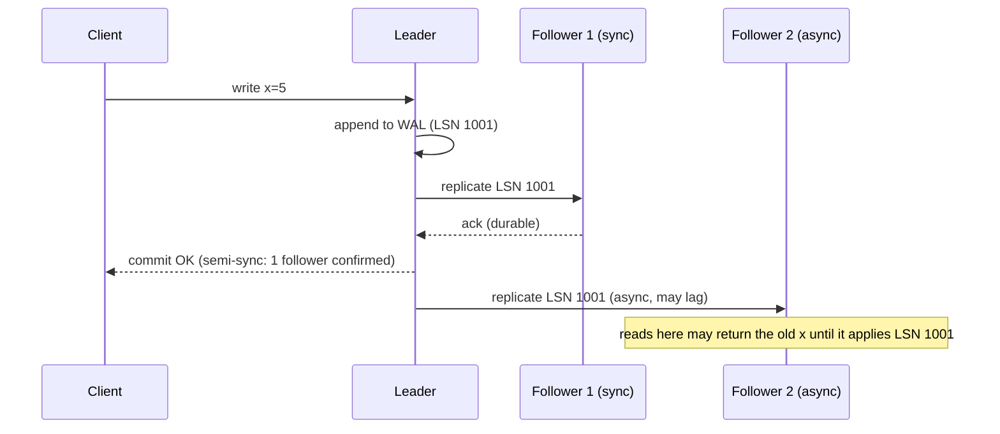
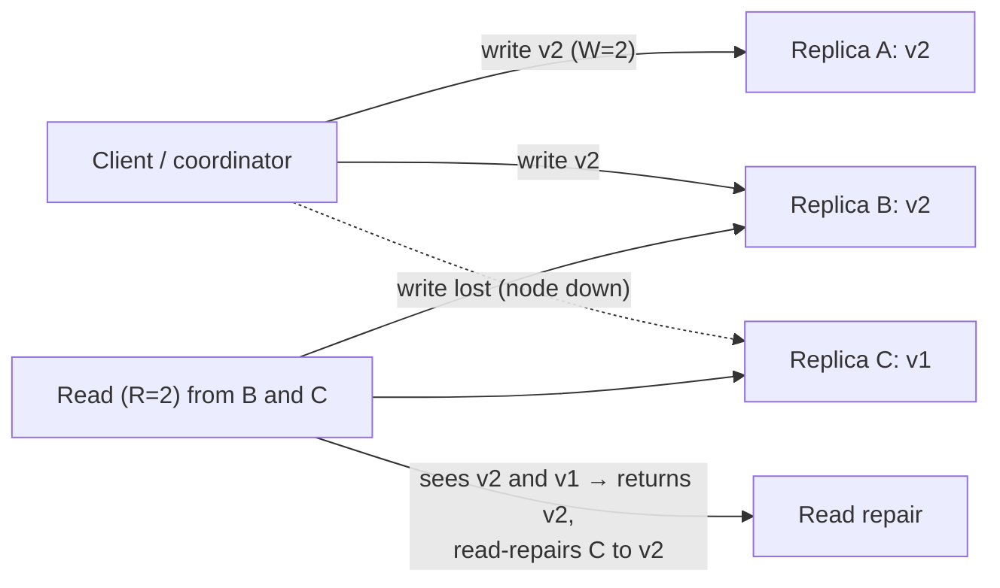

# Consistency Models & Replication (Leader/Follower, Quorum)

!!! abstract "TL;DR"
    - **Replication** keeps copies of data on several nodes for **durability, availability, read scaling and latency**. The hard part is keeping copies **in sync while things fail**.
    - **Leader/follower:**
        - The leader orders writes into a **replication log**: statement-based, **physical WAL shipping**, or **logical/row-based**. Followers apply the log in order.
        - Replication can be **sync** (durable, slow, blocks on followers), **async** (fast, can lose acked writes on failover) or **semi-sync** (one sync follower).
        - **Failover** must handle lag, split brain and choosing the most up-to-date follower.
    - **Leaderless (Dynamo-style):** clients or coordinators write to **W** of **N** replicas and read from **R**. **W + R > N** gives read/write overlap. Replicas converge through **read repair**, **hinted handoff** and **anti-entropy** (Merkle trees). **Sloppy quorums** keep writes available during failures but weaken the overlap guarantee.
    - **Conflicts** (multi-leader or leaderless) are detected with **version vectors** and resolved by LWW (lossy), app merge or **CRDTs**.
    - **Consistency guarantees come from these mechanisms:** linearisable reads need the leader or consensus (or quorum reads with repair). Follower reads give eventual consistency, which session guarantees can upgrade (read-your-writes and so on). Pick the guarantee **per operation**.

## Why it matters

The system design pages covered *what* the consistency models are. This page covers *how* replication produces (or breaks) them, which is what senior interviewers drill into: "What happens to acknowledged writes when the leader dies?", "Why does W + R > N not guarantee linearisability?", "How does Cassandra repair divergent replicas?", "What does `w: majority` actually buy you in MongoDB?"

## Core concepts

### Leader/follower replication


*Notice what the client's "OK" means: the write is on the leader **and** one follower. If the leader dies now, F1 has the write and should be promoted. Promoting the lagging F2 would **lose an acknowledged write**.*

**Replication log formats:**

| Format | How | Pros | Cons | Examples |
|---|---|---|---|---|
| Statement-based | Ship SQL statements | Compact | Non-determinism (`NOW()`, `RAND()`, triggers) | Old MySQL SBR |
| Physical (WAL shipping) | Ship storage-engine log bytes | Exact copy, simple | Tied to engine version, no cross-version upgrades | PostgreSQL streaming replication |
| **Logical (row-based)** | Ship row-level changes | Version-independent, enables **CDC** | Larger than statements | MySQL RBR binlog, Postgres logical decoding, MongoDB oplog |

Logical logs power **change data capture** (Debezium): the replication stream becomes an event source for caches, search indexes and outboxes.

### Sync, async, semi-sync

- **Synchronous:** commit waits for followers. No data loss on leader failure, but a slow or failed follower stalls writes. Rarely used for *all* followers.
- **Asynchronous:** commit after the leader's local write. Lowest latency, but **replication lag** and possible **loss of acknowledged writes** on failover.
- **Semi-synchronous / quorum commit:** wait for k followers (Postgres `synchronous_standby_names = 'ANY 1 (...)'`, MongoDB `w: "majority"`, MySQL semi-sync, Aurora's 4/6 storage quorum).
- **Chain replication** (CRAQ, some storage systems) pipelines writes down a chain. Reads from the tail are strongly consistent.

### Failover hazards

1. **Detecting** leader failure: timeouts (too short means flapping, too long means downtime).
2. **Choosing** a new leader: the most up-to-date follower (highest LSN). In consensus-based systems, the elected leader must have all committed entries.
3. **Reconfiguring** clients and other followers to the new leader.
4. **Hazards:**
    - Lost async writes. A returning old leader may hold writes the new leader never saw: discard them, which is data loss, or reconcile them.
    - **Split brain** if the old leader keeps accepting writes. Use fencing or quorum.
    - **Auto-increment and ID reuse** after discarding writes. GitHub once leaked data across users this way when IDs collided with a cache.
    - Cache and replica divergence.

### Leaderless replication (Dynamo-style)


*Notice why **W + R > N** works: with N=3, W=2, R=2, any 2 read replicas overlap the 2 written ones in at least one node, so the read sees v2. It **repairs** stale replica C on the way. With W=1, R=1, it could have read only C and returned stale v1.*

Convergence mechanisms:

- **Read repair:** fix stale replicas detected during reads.
- **Hinted handoff:** if a replica is down, another node stores a "hint" and delivers the write when it's back.
- **Anti-entropy:** background comparison using **Merkle trees** (hash trees over key ranges) to find and sync differences cheaply (Cassandra `nodetool repair`).

**Why W + R > N isn't linearisability:**

- **Sloppy quorums:** writes go to *any* W reachable nodes, not the designated N, so there's no guaranteed overlap.
- Concurrent writes and LWW resolution.
- A write that succeeded on fewer than W nodes (reported as failed) isn't rolled back, so it may be visible later.
- A read concurrent with a write may see the new value while a later read doesn't.

Linearisable quorum reads need extra steps (read repair before returning, ABD-style protocols) or consensus.

### Detecting and resolving conflicts

- **Version vectors:** each replica keeps a counter. Comparing vectors tells you whether one version **happened before** another (it can be overwritten) or they're **concurrent** (a conflict to merge).
- **Resolution options:**
    - **LWW** with timestamps: simple, but silently drops concurrent writes, and depends on clocks.
    - **Siblings + app merge:** for example a shopping cart union.
    - **CRDTs:** counters, sets, maps and registers that merge automatically and deterministically (Riak, Redis Enterprise active-active, Automerge).
    - **Avoid conflicts:** route all writes for a key to one home leader or Region.

### From mechanism to guarantee

| Read path | Guarantee you get |
|---|---|
| Leader / primary only (with fenced leadership) | Linearisable per object |
| Consensus read (Raft ReadIndex / lease read) | Linearisable |
| Majority read concern (MongoDB `readConcern: majority`) | Reads only majority-committed data (won't roll back), maybe not the latest |
| Quorum read with W + R > N (strict quorum) | Usually latest. Not linearisable in edge cases |
| Any follower | Eventual. Add session guarantees for UX |

## In practice: code & configuration

=== "❌ Common mistake"
    ```java
    // MongoDB: w=1 + secondary reads. Acked writes can be rolled back after failover,
    // and users don't see their own updates.
    MongoClientSettings settings = MongoClientSettings.builder()
        .writeConcern(WriteConcern.W1)                       // ack from primary only
        .readPreference(ReadPreference.secondaryPreferred()) // stale reads
        .build();
    ```

=== "✅ Correct approach"
    ```java
    // Durable writes for important data + read-your-writes where it matters.
    MongoClientSettings settings = MongoClientSettings.builder()
        .writeConcern(WriteConcern.MAJORITY.withWTimeout(5, TimeUnit.SECONDS)) // survives failover
        .readConcern(ReadConcern.MAJORITY)                   // never read data that may roll back
        .readPreference(ReadPreference.primary())            // latest data for user-facing flows
        .retryWrites(true)                                   // safe retries for supported ops
        .build();
    // Analytics/reporting reads can use secondaries with readPreference secondaryPreferred
    // plus maxStalenessSeconds (≥ 90 s) to bound lag.
    ```

```ini
# PostgreSQL primary: quorum-based synchronous replication (any 1 of 2 standbys must confirm)
synchronous_standby_names = 'ANY 1 (standby_a, standby_b)'
synchronous_commit = on          # wait for WAL flush on the sync standby
# per-transaction relaxation for low-value writes:
#   SET LOCAL synchronous_commit = local;
```

```sql
-- Cassandra: replication factor 3 per DC; strong-within-DC reads and writes (2 + 2 > 3)
CREATE KEYSPACE care WITH replication = {'class': 'NetworkTopologyStrategy', 'dc1': 3, 'dc2': 3};
CONSISTENCY LOCAL_QUORUM;
```

## Real-world usage

- **PostgreSQL / MySQL / Aurora:** leader-follower. Aurora separates compute from a quorum-replicated storage layer (6 copies, 4/6 writes), so failover doesn't lose committed writes.
- **MongoDB:** replica sets with a Raft-like election. `w: majority` is the default write concern since 5.0, to avoid rollbacks of acked writes.
- **Cassandra / ScyllaDB / DynamoDB (internally):** leaderless or partitioned replication with tunable consistency, hinted handoff and repair.
- **Kafka:** per-partition leader + ISR (in-sync replicas). `acks=all` + `min.insync.replicas=2` is effectively quorum commit. Unclean leader election trades durability for availability.
- **Incidents:** GitHub's 2012 MySQL failover discarded writes and reused auto-increment IDs, which mixed up data. Jepsen findings across many databases about lost writes under partitions.

## Trade-offs & production gotchas

| Choice | Durability | Latency | Availability | Use when |
|---|---|---|---|---|
| Async followers | Acked writes can be lost | Lowest | High | Reads/analytics, tolerant data |
| Semi-sync / majority | No loss of acked writes (with correct failover) | +1 RTT to nearest follower | Writes stall if quorum lost | Most OLTP |
| Fully sync to all | Strongest | Highest | Any follower failure blocks | Rare |
| Leaderless quorum | Tunable | Tunable | Very high (sloppy quorums) | Write-heavy, always-on |
| Multi-leader | Conflicts possible | Low local writes | High | Multi-Region writes, offline clients |

!!! warning "Gotchas"
    - **Replica lag is unbounded under load.** Monitor it (seconds behind, LSN gap) and remove badly lagging replicas from read pools.
    - **Unclean leader election** (Kafka, some DBs) promotes an out-of-date replica, which loses data for the sake of availability. Know your setting.
    - **LWW + clock skew** silently drops "newer" writes.
    - **Read-your-writes across devices** (phone + laptop) needs server-side tracking, not just sticky sessions.

## How this connects to my experience

- **Where I used it:**
    - MongoDB at OptumRx (replica sets).
    - Kafka (ISR, `acks`, `min.insync.replicas`) with retry/DLQ.
    - RDS and DynamoDB at Deloitte.
    - Redis (async replicas).
- **Talking points:**
    - "For Kafka topics carrying workflow events: `acks=all`, `min.insync.replicas=2`, replication factor 3, so a single broker loss doesn't drop acknowledged events." *[confirm: actual topic configuration]*
    - "MongoDB: majority write concern for important writes, primary reads for user-facing views after edits." *[confirm: write concern and read preference used]*
    - "Redis replication is async. That's fine for cache and reference data, not for anything we can't rebuild."
- **Likely follow-up chain:** "What happens to acked writes on failover?" → "How did you configure Kafka durability?" → "Why not read from secondaries?" → "How do you bound staleness?" Answer: semi-sync/majority → acks=all + min ISR → read-your-writes and lag → maxStaleness, routing by use case.

## Interview questions

### Fundamentals

??? question "Q1. Synchronous vs asynchronous replication: what's the risk of async?"
    **Answer:** With async, the leader acknowledges before followers have the write. If it crashes, a follower promoted without that write **loses acknowledged data**, and readers on followers see stale data (lag). Sync avoids the loss but adds latency and stalls on follower failure. Semi-sync is the usual compromise.

    **Interviewer listens for:** acknowledged-write loss.

    **Common wrong answer:** "async is just slower to replicate".

??? question "Q2. What is a replication log, and what formats exist?"
    **Answer:** The ordered stream of changes a leader sends to followers. Statement-based (SQL, non-determinism issues), physical WAL (exact bytes, engine-version-bound), logical/row-based (row changes, version-independent, used for CDC).

    **Interviewer listens for:** trade-offs, and the link to CDC.

    **Common wrong answer:** "a log file of errors".

??? question "Q3. What does W + R > N give you?"
    **Answer:** Overlap between the set of replicas that acknowledged the latest write and the set you read from, so a read sees at least one up-to-date copy (and can repair the stale ones). With N=3, W=2, R=2, for example.

    **Interviewer listens for:** the overlap reasoning.

    **Common wrong answer:** "it guarantees linearisability".

??? question "Q4. What are read repair and hinted handoff?"
    **Answer:** **Read repair:** when a read sees divergent versions across replicas, write the newest back to the stale ones. **Hinted handoff:** when a target replica is down, another node temporarily stores the write (a hint) and forwards it when the replica recovers.

    **Interviewer listens for:** both convergence mechanisms.

    **Common wrong answer:** "backup and restore".

### Intermediate

??? question "Q5. Why isn't a strict quorum linearisable?"
    **Answer:**
    - Sloppy quorums break the overlap.
    - A partially failed write (on fewer than W nodes) isn't rolled back and may surface later.
    - Concurrent writes resolved by LWW and clock skew.
    - A read racing a write can return new data, and a subsequent read old data (unless reads repair synchronously before returning).

    Linearisability needs extra protocol steps or consensus.

    **Interviewer listens for:** specific edge cases.

    **Common wrong answer:** "it is linearisable".

??? question "Q6. What does MongoDB `w: majority` + `readConcern: majority` give?"
    **Answer:** Writes are acknowledged only when a majority of voting members have them, so they survive failover with no rollback. Reads return only majority-committed data, so you never read something that will be rolled back. Reads from the primary with majority concern can still miss the very latest uncommitted writes. Use `linearizable` read concern (primary, slower) for strict recency.

    **Interviewer listens for:** rollback avoidance vs recency.

    **Common wrong answer:** "it makes everything strongly consistent".

??? question "Q7. How do version vectors detect conflicts?"
    **Answer:** Each version carries a vector of counters, one per replica. If every counter of A ≤ the corresponding counter of B, then A happened before B and B can replace it. If neither dominates, they're **concurrent**: keep both as siblings and merge (app logic or CRDT).

    **Interviewer listens for:** the happens-before comparison.

    **Common wrong answer:** "compare timestamps".

??? question "Q8. What are session guarantees, and how do you provide read-your-writes and monotonic reads with replicas?"
    **Answer:** Session guarantees make eventual consistency usable for one user:

    - **Read-your-writes:** after I write, my reads see that write.
    - **Monotonic reads:** I never see older data after seeing newer data (no going back in time).
    - **Monotonic writes** and **writes-follow-reads** keep one session's operations in order.

    With async replicas: route a user's reads to the **leader for a short window after they write**, or track the **log position / version** of their last write and only read from a replica that has caught up to it (MongoDB causal consistency sessions do this with `afterClusterTime`). For monotonic reads, **pin a user to one replica** (hash by user id) so a lagging replica cannot show them older data after a fresher one did.

    **Interviewer listens for:** definitions of each guarantee, leader-after-write routing, version/LSN tracking, replica pinning, MongoDB causal sessions.

    **Common wrong answer:** "Read from the leader always." It works, but removes the read scaling that replicas were added for.

### Senior

??? question "Q9. Walk through a safe leader failover."
    **Answer:**
    1. Detect failure with a confirmed timeout.
    2. Elect or choose the most up-to-date follower (or let consensus elect one with all committed entries).
    3. **Fence** the old leader (revoke its lease, bump the epoch/term, storage rejects old epochs).
    4. Repoint clients (DNS/proxy/endpoint) and followers.
    5. Handle divergent writes from the old leader (discard and reconcile, never reuse IDs).
    6. Verify replication health.
    7. Alert.

    Managed services and Patroni/etcd automate this.

    **Interviewer listens for:** fencing and divergent writes.

    **Common wrong answer:** "promote any replica".

??? question "Q10. Kafka's replication: how do acks, ISR and unclean election interact?"
    **Answer:**
    - Each partition has a leader and followers. The **ISR** is the set of followers caught up within `replica.lag.time.max.ms`.
    - `acks=all` waits for all ISR members. With `min.insync.replicas=2`, writes fail if the ISR shrinks below 2 (durability over availability).
    - **Unclean leader election** (disabled by default) lets an out-of-sync replica become leader, so acknowledged messages can be lost.

    **Interviewer listens for:** knowing the settings and their trade-offs.

    **Common wrong answer:** "acks=all means all replicas everywhere".

### Scenario-based

??? question "Q11. After a DB failover, users report that their last few minutes of changes vanished. Explain and prevent it."
    **Answer:** Async replication: the promoted replica lacked the recent writes, and the old leader's extra writes were discarded. Prevent with:
    - semi-sync/quorum commit for critical tables
    - lag-aware failover (refuse to promote a replica that's too far behind, or wait for catch-up)
    - fencing
    - idempotent client retries plus reconciliation from audit/outbox logs
    - documented RPO

    **Interviewer listens for:** the mechanism plus prevention.

    **Common wrong answer:** "users didn't save properly".

??? question "Q12. Analytics queries on the primary slow down OLTP. Can you move them to replicas safely?"
    **Answer:** Yes, for reads that tolerate lag:
    - Route reporting to async replicas, with **bounded staleness** (MongoDB `maxStalenessSeconds`, or lag-aware routing in Postgres).
    - Show "data as of" times.
    - Keep user-facing reads that follow writes on the primary.
    - For heavy analytics, use CDC into a warehouse instead of OLTP replicas.

    **Interviewer listens for:** staleness bounds and separating workloads.

    **Common wrong answer:** "just point everything at replicas".

## Cheat sheet

| Concept | Remember |
|---|---|
| Log formats | Statement (non-deterministic), WAL (physical), logical/row (CDC) |
| Sync modes | Sync (no loss, slow), async (fast, lag, loss), semi-sync/majority (compromise) |
| Failover | Detect → choose most up-to-date → **fence old** → repoint → reconcile |
| Quorum | W + R > N overlap. Sloppy quorums, partial writes and LWW break strictness |
| Convergence | Read repair, hinted handoff, anti-entropy (Merkle trees) |
| Conflicts | Version vectors detect. LWW / merge / CRDT / avoid via home leader |
| MongoDB | `w: majority` + `readConcern: majority` (no rollback). `linearizable` for recency |
| Kafka | `acks=all`, `min.insync.replicas=2`, RF 3, unclean election off |
| Guarantee | Leader/consensus = linearisable. Followers = eventual (+ session guarantees) |

## Sources
1. Martin Kleppmann, *Designing Data-Intensive Applications*, ch. 5 "Replication".
2. [DeCandia et al.: Dynamo (SOSP 2007)](https://www.allthingsdistributed.com/files/amazon-dynamo-sosp2007.pdf): quorums, hinted handoff, Merkle trees, vector clocks.
3. [PostgreSQL: synchronous replication](https://www.postgresql.org/docs/current/warm-standby.html#SYNCHRONOUS-REPLICATION) and [logical decoding](https://www.postgresql.org/docs/current/logicaldecoding.html).
4. [MongoDB: write concern](https://www.mongodb.com/docs/manual/reference/write-concern/), [read concern](https://www.mongodb.com/docs/manual/reference/read-concern/), [maxStalenessSeconds](https://www.mongodb.com/docs/manual/core/read-preference-staleness/).
5. [Apache Kafka documentation: replication, ISR, unclean leader election](https://kafka.apache.org/documentation/#replication).
6. [Apache Cassandra: data consistency and repair](https://cassandra.apache.org/doc/latest/cassandra/managing/operating/repair.html).
7. [GitHub: Downtime last Saturday (2012), MySQL failover and ID reuse](https://github.blog/news-insights/the-library/github-availability-this-week/).
8. [Jepsen: consistency models and analyses](https://jepsen.io/consistency).
